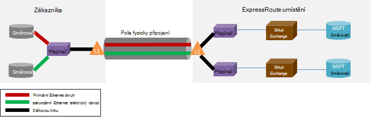

<properties
   pageTitle="ExpressRoute časté otázky"
   description="Nejčastější dotazy týkající se ExpressRoute obsahuje informace o podporovaných služby Azure, náklady, dat a připojení, SLA, poskytovatelů a umístění, šířku pásma a další technické podrobnosti."
   documentationCenter="na"
   services="expressroute"
   authors="cherylmc"
   manager="carmonm"
   editor=""/>
<tags
   ms.service="expressroute"
   ms.devlang="na"
   ms.topic="article" 
   ms.tgt_pltfrm="na"
   ms.workload="infrastructure-services"
   ms.date="10/10/2016"
   ms.author="cherylmc"/>

# ExpressRoute časté otázky

## Co je ExpressRoute?
ExpressRoute je Azure služba, která umožňuje vytvořit soukromé připojení mezi datacentrech Microsoft a infrastrukturu, která je ve svém místním prostředí nebo sdruženém zařízení. ExpressRoute připojení není přejděte veřejné Internetu a nabízejí vyšší zabezpečení, spolehlivost a rychlosti s nižší čekacích dob než typický připojení přes Internet.

### Jaké jsou výhody používání ExpressRoute a připojení privátní sítě?
ExpressRoute připojení není přejděte veřejné Internetu a nabízejí vyšší zabezpečení, spolehlivost a rychlosti s dolním a konzistentní čekacích dob než typický připojení přes Internet. V některých případech pomocí připojení ExpressRoute pro přenos dat mezi místním prostředím zařízení a Azure může mít výhod nákladů.

### K čemu cloudovým službám společnosti Microsoft podporují přes ExpressRoute?
ExpressRoute podporuje většinou služeb Microsoft Azure dnes včetně Office 365.  Brzy informovaní o aktualizacích na všeobecně dostupná.

### Kde je služba dostupné?
Zobrazit tuto stránku pro umístění služby a dostupnosti: [ExpressRoute partnery a umístění](expressroute-locations.md).

### Jak můžu používat ExpressRoute pro připojení k Microsoft, když nemám partnerství pomocí některého z partnerů ExpressRoute carrier?
Můžete vybrat místní carrier a má připojení Ethernet na jeden z podporovaných exchange poskytovatele umístění. Můžete pak druhé strany společnosti Microsoft na místě poskytovatele. Zaškrtněte políčko poslední část [ExpressRoute partnery nebo umístění](expressroute-locations.md) abyste zjistili, pokud je k dispozici v některém z exchange umístění svého poskytovatele služeb. Můžete pak objednejte ExpressRoute okruh prostřednictvím poskytovatele služeb pro připojení k Azure.

### Kolik stojí ExpressRoute?
Zaškrtněte políčko [ceny podrobnosti](https://azure.microsoft.com/pricing/details/expressroute/) pro ceny informace.

### Pokud zaplatit ExpressRoute okruh dané šířky pásma připojení VPN, které můžu koupit od svého poskytovatele služeb sítě musí být stejně rychlé?
Ne. Připojení k síti VPN všechny rychlosti možnost si zakoupit od svého poskytovatele služeb. Připojíte se k Azure však budou omezeny na šířku pásma s obvodovou ExpressRoute zakoupení.

### Pokud zaplatit ExpressRoute okruh dané šířky pásma mám možnost rychlost až vyšší rychlosti případné potíže?
Ano. Obvody ExpressRoute nakonfigurovaná pro podporu případy, kdy shlukové až dvakrát omezení šířky pásma, které získané žádné další náklady. Pokud tuto funkci podporují, obraťte se na svého poskytovatele služeb.

### Můžu používat stejný soukromé síťové připojení s virtuální sítě a další služby Azure současně?
Ano. ExpressRoute obvodu, jednou nastavení vám umožní přístup k služby v rámci virtuální sítě a další služby Azure současně. Připojíte k virtuální sítím prostřednictvím soukromé peering cesty a dalších služeb nad veřejné peering cestu.

### Nabízí ExpressRoute smlouva úrovni služeb (SLA)?
Získáte [stránky ExpressRoute SLA](https://azure.microsoft.com/support/legal/sla/) pro další informace.

## Podporované služby
Většina Azure services podporují přes ExpressRoute.

- Připojení k virtuálních počítačích a cloudovým službám nasazenou v virtuální sítě jsou podporovaná nad soukromé peering cestu.
- Azure weby jsou podporovány nad veřejné peering cestu.
- Rozbočovač IoT je podporována nad veřejné peering cestu.
- Office 365 je podporovaná nad cestou peering Microsoft.
- Všechny ostatní služby máte přístup k nad veřejné peering cestu. Výjimky jsou:

    **Nejsou podporovány následující služby:**

    - CDN
    - Visual Studio týmu služby načítání testování
    - Vícefaktorové ověřování
    - Přenosy správce

## Připojení a dat

### Nejdou nějaké kvůli omezením množství dat, které můžu převést pomocí ExpressRoute?
Není jsme nastavit omezení počtu přenos dat. Podívejte se do [ceny podrobností](https://azure.microsoft.com/pricing/details/expressroute/) informace na šířku pásma sazby.

### K čemu rychlosti připojení jsou podporovány ExpressRoute?
Podporované šířky pásma nabídky:

| 50 MB / 100 MB /, 200 MB /, 500 MB/s 1Gbps, 2 GB/s, 5 GB/s 10Gbps |

### Které poskytovatele služeb jsou dostupné?
Seznam poskytovatele služeb a umístění najdete v článku [ExpressRoute partnery a umístění](expressroute-locations.md) .

## Podrobné technické informace

### Jaké jsou technické požadavky pro připojení místního pracoviště Azure?
Najdete v tématu [požadavky na stránce ExpressRoute](expressroute-prerequisites.md) pro požadavky.

### Mají připojení ExpressRoute nadbytečné?
Ano. Jednotlivé Express směrování obvody má nadbytečné dvojice křížové připojení nakonfigurované tak, aby poskytují dostupnost.

### Budou ztraceny připojení, pokud jeden z odkazů ExpressRoute selže?
Pokud jeden z křížového spojení selže, neztratíte připojení. Nadbytečné připojení neexistuje podpora zatížení sítě. Navíc můžete vytvořit více obvody jinde peering dosáhnout selhání odolnost.

### Pokud nevím spoluvytváření umístěné v cloudu exchange a poskytovateli služeb nabízí spojení, je potřeba objednejte dvě pole fyzicky připojení mezi Moje v místní síti a Microsoft? 
Ne, stačí jedno pole fyzicky připojení Pokud váš poskytovatel služeb můžete vytvořit dva Ethernet virtuální obvody přes fyzické připojení. Fyzické připojení (například optického vlákna) se přeruší ve vrstvě 1 (L1) zařízení (viz obrázek dole). Dva virtuální obvody Ethernet jsou označené různých ID VLAN jeden primární okruhem a druhý pro sekundární. Tyto VLAN jsou ID v vnější 802.1Q Ethernet záhlaví. Vnitřní 802.1Q Ethernet záhlaví (není vidět) je namapovaných na konkrétní [doménu směrování ExpressRoute](expressroute-circuit-peerings.md). 

### Můžete se vztahují nějaká Moje VLAN Azure pomocí ExpressRoute?
Ne. Do Azure nepodporujeme rozšíření 2 připojení vrstvy.

### Můžete mít víc než jeden okruh ExpressRoute v předplatného?
Ano. Můžete mít víc než jeden okruh ExpressRoute ve vašem předplatném. Výchozí limit počtu vyhrazené obvody nastavenou 10. Můžete kontaktovat Microsoft Support zvýšení limitu v případě potřeby.

### Můžete mít ExpressRoute obvody z různé poskytovatele služeb?
Ano. Obvody ExpressRoute může mít s mnoha poskytovatele služeb. Jednotlivé obvody ExpressRoute bude přidružený k pouze jeden poskytovatele.

### Jak se připojují virtuálních sítí ExpressRoute obvodu
Základní kroky, které jsou uvedeny níže.

- Můžete vytvořit ExpressRoute okruh a máte poskytovatele služeb ji povolit.
- Vy nebo na poskytovatele musíte nakonfigurovat BGP peering (s).
- Virtuální sítě musí odkazovat na okruh ExpressRoute.

Další informace najdete v článku [pracovní postupy ExpressRoute pro zřizování obvodu a okruh státy](expressroute-workflows.md) .

### Nejdou nějaké omezení připojení Moje ExpressRoute okruhem?
Ano. [ExpressRoute partnery nebo umístění](expressroute-locations.md) stránky přehled hranic připojení ExpressRoute okruhem. Připojení k ExpressRoute okruhem je omezené na jediný geopolitické region. Připojení lze rozbalit přes geopolitické oblastí povolením funkci ExpressRoute premium.

### Můžu si odkaz více virtuální sítím ExpressRoute obvodu?
Ano. Až 10 virtuálních sítí můžete propojit s obvodovou ExpressRoute.

### Mám víc předplatných Azure, ve kterých jsou virtuální sítě. Můžete připojit přes virtuální sítě uložených v samostatné předplatné jednoho okruh ExpressRoute?
Ano. Až 10 ostatní Azure předplatná má být použit jeden okruh ExpressRoute můžete povolit. Toto omezení je možné zvýšit povolením funkci ExpressRoute premium.

Další informace najdete v tématu [sdílení ExpressRoute okruh přes víc předplatných](expressroute-howto-linkvnet-arm.md).

### Připojení k stejný obvod samostatný nezávisle virtuální sítě?
Ne. Všechny virtuální sítě propojen stejný obvod ExpressRoute jsou součástí tu samou doménu směrování a ostatní vás izolovaný od ostatních z hlediska směrování. Pokud potřebujete postup izolace, musíte vytvořit samostatné okruh ExpressRoute.

### Můžete mít jeden virtuální sítě připojení k víc než jeden okruh ExpressRoute?
Ano. Můžete propojit jeden virtuální sítě s až 4 ExpressRoute obvody. Musí být objednali až 4 různých [ExpressRoute umístění](expressroute-locations.md).

### Z mé virtuální sítě připojené k ExpressRoute obvody, přístup k Internetu?
Ano. Pokud ještě ohlášena výchozí trasy (0.0.0.0/0) nebo internet směrování předpony přes BGP relaci, budete moct připojení k Internetu z virtuální sítě propojené s ExpressRoute okruh.

### Můžete blokovat připojení k Internetu, virtuální sítí připojené k ExpressRoute obvody?
Ano. Můžete inzerce výchozí trasy (0.0.0.0/0) pro blokování všech připojení k Internetu na virtuálních počítačích používaný v rámci virtuální sítě a směrování všech přenosů mimo okruh ExpressRoute. Všimněte si, že pokud inzerce výchozí trasy jsme vynutíte přenosy služby nabízené přes veřejnou prozkoumávání (například Azure úložiště a databáze SQL) zpět na svém místním prostředí. Budete muset nastavit vrátíte přenosy Azure prostřednictvím veřejné peering cestu nebo přes internet.

### Můžete virtuálních sítí propojen stejný obvod ExpressRoute Promluvte si s překrývajícími?
Ano. Virtuálních počítačích nasazenou v virtuální sítí připojených ke stejné okruh ExpressRoute můžou vzájemně komunikovat.

### Můžete použít připojení k webu virtuálních sítí ve spojení s ExpressRoute?
Ano. ExpressRoute může existovat společně s VPN k webu.

### Můžu přejít z webu webu / čárky webu konfigurace používat ExpressRoute virtuální sítě?
Ano. Budete muset vytvořit brány ExpressRoute v rámci virtuální sítě. Nastane menší prostoje přidružené k procesu.

### Co je potřeba připojení k úložišti Azure přes ExpressRoute?
Musíte vytvořit ExpressRoute obvodu a nakonfigurovat směruje pro veřejné prozkoumávání.

### Nejdou nějaké omezení počtu trasy, které můžu inzerce?
Ano. Jsme přijmout až 4000 směrování předpony pro soukromé prozkoumávání a 200 pro veřejné prozkoumávání a prozkoumávání Microsoft. Můžete zvětšit 10 000 postupů pro soukromé prozkoumávání-li povolit funkci ExpressRoute premium.

### Nejdou nějaké omezení rozsahy IP adres, které můžu inzerce BGP relace?
Ve veřejných a Microsoft peering BGP relaci jsme nepřijímat soukromé předpony (RFC1918).

### Co se stane, když překročit BGP omezuje?
Dojde ke ztrátě BGP relace. Bude možné obnovit po počet předponu přechází pod limit.

### Co je údaj o čase blokování ExpressRoute BGP? Je možné upravovat?
Je čas blokování 180. Udržování zprávy se odesílají každých 60 sekund. Tyto podařilo odstranit nastavení na straně Microsoft, který nelze změnit.

### Po hodnotu výchozí trasy (0.0.0.0/0) na virtuálních sítí nelze aktivovat Windows spuštěné v mém VMs Azure. Jak do můžu tento problém odstraňovat?
Následující postup vám pomůže Azure rozpoznat žádost o aktivaci:

1. Vytvoření veřejné prozkoumávání ExpressRoute okruhem.
2. Vyhledávání DNS a zjistěte IP adresu **kms.core.windows.net**
3. Udělejte jednu z následujících dvou položek tak, aby služby správy klíčů bude ocenit jejich úspěchy, že žádost o aktivaci pochází z Azure bude přijmout žádost.
    - Ve vaší místní síti směrujte přenosy určené pro IP adresu (získá v kroku 2) zpět Azure prostřednictvím veřejné prozkoumávání.
    - Máte NSP poskytovatele kříž pin přenos Azure prostřednictvím veřejné prozkoumávání.

### Můžete změnit šířku pásma obvodu ExpressRoute?
Ano. Zvětšení šířky pásma obvodu ExpressRoute aniž byste museli byl. Budete muset zpracování u poskytovatele připojení zajistit, aby si aktualizoval omezením v rámci svých sítí umožňujících zvýšení šířky pásma. Ale nebudete moct zmenšení šířky pásma obvodu ExpressRoute. Nemusíte dolní, které šířku pásma bude znamenat, že útržky dolů a společenské obvodu ExpressRoute.

### Změna šířky pásma obvodu ExpressRoute
Je možné aktualizovat šířky pásma obvodu ExpressRoute pomocí rutinu rozhraní API a prostředí PowerShell aktualizace snaží okruh.

## ExpressRoute Premium

### Co je ExpressRoute premium?
ExpressRoute premium je sada funkcí uvedených pod ním.

 - Lepší směrování tabulky limit z 4000 tras na 10 000 trasy pro soukromé prozkoumávání.
 - Lepší počet VNets připojeného k ExpressRoute obvod (výchozí hodnota je 10). Viz tabulka dole další podrobnosti.
 - Globální připojení přes síť Microsoft core. Teď bude možné k propojení VNet v jednom regionu geopolitické s ExpressRoute okruh v jiné oblasti. **Příklad:** Můžete propojit VNet vytvořené v Evropě západní ExpressRoute okruh vytvořené v křemíku sedla.
 - Připojení ke službám Office 365 a CRM Online.

### Kolik VNets můžu odkaz ExpressRoute okruh Pokud je povoleno ExpressRoute premium?
Následující tabulky jsou zobrazeny limity ExpressRoute počet VNets za ExpressRoute okruh.

[AZURE.INCLUDE [expressroute-limits](../../includes/expressroute-limits.md)]

### Jak povolit ExpressRoute premium?
ExpressRoute prémiových funkcí může být užitečné, když tato funkce je povolený a můžete vypnout tak, že aktualizace stavu okruh. Můžete povolit ExpressRoute premium času vytvoření okruh nebo upoutat okruh aktualizace snaží rozhraní API / rutiny prostředí PowerShell povolit ExpressRoute premium.

### Jak můžu vypnout ExpressRoute premium?
Můžete zakázat ExpressRoute premium tak, že zavoláte aktualizace snaží elektrický obvod rozhraní API / rutiny prostředí PowerShell musíte se ujistit, že máte diagramů s měřítky připojení, musí splňovat výchozí omezení než zakážete ExpressRoute premium. Žádost o zakázat ExpressRoute premium, pokud vaše využití přizpůsobí mimo limit výchozí jsme se nezdaří.

### Můžete se vybrat funkce požadovaným ze sady funkcí premium?
Ne. Nebude moct vyberte funkcí, u kterých je třeba. Pokud zapnete ExpressRoute premium zapnut všechny funkce.

### Kolik stojí ExpressRoute premium?
Podívejte se do [ceny podrobnosti](https://azure.microsoft.com/pricing/details/expressroute/) nákladů.

### ExpressRoute premium kromě standardní poplatky ExpressRoute zaplatit?
Ano. ExpressRoute premium poplatky nad ExpressRoute okruh náklady a poplatky povinné poskytovatel připojení.

## ExpressRoute a služeb Office 365 a CRM Online

[AZURE.INCLUDE [expressroute-office365-include](../../includes/expressroute-office365-include.md)]

### Jak vytvořit okruh ExpressRoute pro připojení ke službám Office 365 a CRM Online?

1. Prohlédněte si stránku [ExpressRoute požadavky](expressroute-prerequisites.md) aby zkontrolovala, jestli že splňujete požadavky.
2. Zobrazení seznamu poskytovatelů služeb a umístění na [partnery ExpressRoute a umístění](expressroute-locations.md) zajištění splnění potřeb připojení.
3. Plánování požadavků na kapacitu kontrolou [Plánování sítě a ladění výkonu pro Office 365](http://aka.ms/tune/).
4. Postupujte podle kroků uvedených v pracovních postupech dole nastavit připojení [pracovní postupy ExpressRoute pro zřizování obvodu a okruh státy](expressroute-workflows.md).

>[AZURE.IMPORTANT] Ujistěte se, že jste povolili doplněk premium ExpressRoute, při konfiguraci připojení ke službám Office 365 a CRM Online.

### Je třeba povolit veřejné prozkoumávání Azure pro připojení ke službám Office 365 a CRM Online?
Ne, stačí povolit Microsoft Peering. Ověřování umožnění datových přenosů do Azure AD odešle prostřednictvím Microsoft Peering. 

### Můj existující obvody ExpressRoute, podporují připojení ke službám Office 365 a CRM Online?
Ano. Existující elektrický obvod ExpressRoute je možné konfigurovat podporuje připojení ke službám Office 365. Ujistěte se, jestli máte dostatečnou kapacitu k připojení ke službám Office 365 a ujistěte se, že jste povolili doplněk premium. [Plánování sítě a ladění výkonu pro Office 365](http://aka.ms/tune/) vám usnadní plánování vašim potřebám připojení. Viz také [vytvořit a upravit okruh ExpressRoute](expressroute-howto-circuit-classic.md).

### K čemu Office 365 službám můžete přistupovat přes připojení ExpressRoute?

Podívejte se na stránku [Office 365 URL a rozsahy IP adres](http://aka.ms/o365endpoints) pro aktuální seznam služeb podporované přes ExpressRoute.

### Kolik ExpressRoute pro služby Office 365 a CRM Online náklady?
Služby Office 365 a CRM Online vyžaduje premium doplněk být aktivní. [Ceny stránku s podrobnostmi o](https://azure.microsoft.com/pricing/details/expressroute/) podrobnosti nákladů pro ExpressRoute.

### Jaké oblasti je ExpressRoute pro Office 365 podporuje?
Další informace o seznamu partnery a umístění, kde má podporu ExpressRoute v nápovědě k [ExpressRoute partnerům a umístění](expressroute-locations.md) .

### Můžu používat Office 365 přes internet i v případě ExpressRoute nakonfigurovaný pro naši organizaci?
Ano. Koncové body Office 365 služby jsou dostupné prostřednictvím Internetu, i když nakonfiguroval ExpressRoute pro síť. Pokud jste do umístění, který je nakonfigurovaný na připojit se ke službám Office 365 prostřednictvím ExpressRoute, připojíte pomocí ExpressRoute.

### Můžete Dynamics AX Online k nim získat přístup přes připojení ExpressRoute?
Ne, není podporovaná.
