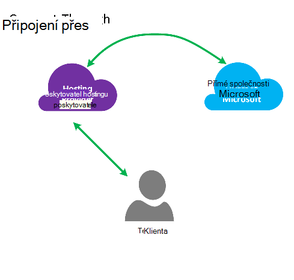
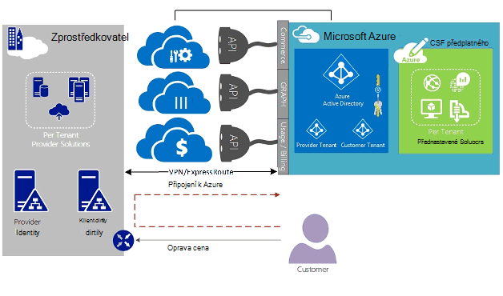
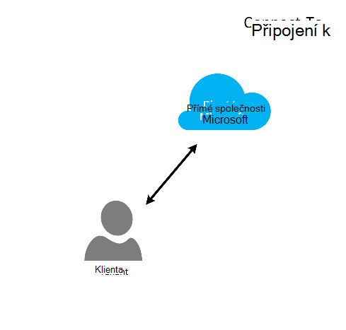
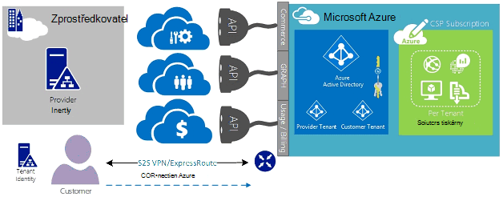
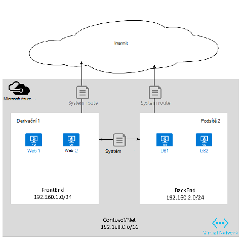
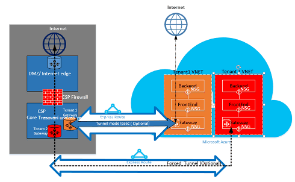

<properties
   pageTitle="Azure ExpressRoute pro cloudové řešení poskytovatelů | Microsoft Azure"
   description="Tento článek obsahuje informace o poskytovatele služeb cloudu, který chcete zahrnout služby Azure a ExpressRoute do jejich nabídky."
   documentationCenter="na"
   services="expressroute"
   authors="richcar"
   manager="carmonm"
   editor=""/>
<tags
   ms.service="expressroute"
   ms.devlang="na"
   ms.topic="get-started-article"
   ms.tgt_pltfrm="na"
   ms.workload="infrastructure-services"
   ms.date="10/10/2016"
   ms.author="richcar"/>

# ExpressRoute pro cloudové řešení poskytovatelů (CSP)

Microsoft poskytuje služby Hyper měřítko pro tradiční prodejců a distributoři (CSP), aby mohli rychle vytvořit nové služby a řešení pro vaši zákazníci bez nutnosti investovat ve vývoji tyto nové služby. Pokud chcete, aby cloudové řešení poskytovatele (Zprostředkovatel) možnost přímo spravovat tyto nové služby, Microsoft poskytuje programy a rozhraní API, pomocí kterých zprostředkovateli přidávání a používání zdrojů Microsoft Azure jménem zákazníkům. Jednou z těchto zdrojů je ExpressRoute. ExpressRoute umožňuje zprostředkovateli připojení existujících zdrojů zákazníků Azure služeb. ExpressRoute je odkaz soukromé komunikace vysokorychlostní služby Azure. 

ExpresRoute se skládá ze dvojice obvody vysoké dostupnosti, které jsou připojené k předplatných odběratelů a nejde sdílet více zákazníci. Každý okruh by měl ukončen v různých směrovači údržbu vysoké dostupnosti.

>[AZURE.NOTE] Existuje šířky pásma a připojení caps na ExpressRoute, což znamená, že velké/komplexního implementace budou vyžadovat víc obvody ExpressRoute jednoho zákazníka.

Microsoft Azure poskytuje rostoucí počet služby, které můžou nabízet svým zákazníkům.  Pro nejlepší převzít využít z těchto služeb vyžaduje použití ExpressRoute připojení k poskytování vysokorychlostní nízké latence přístup k prostředí Microsoft Azure.

## Správa Microsoft Azure
Microsoft poskytuje zprostředkovatele pomocí rozhraní API pro správu předplatného Azure zákazníků tím, že programové integrace se systémy řízení vlastní služby. Funkce podporované správy najdete [tady](https://msdn.microsoft.com/library/partnercenter/dn974944.aspx).

## Správa zdrojů Microsoft Azure
V závislosti na smlouvu, kterou máte se zákazníkem bude určovat, jak se spravuje předplatné. Zprostředkovatel můžete spravovat přímo vytváření a správu zdrojů nebo zákazníka můžete udržujete předplatného Microsoft Azure a podle potřeby vytvářet Azure zdroje. Pokud váš zákazník spravuje vytvoření zdrojů v Microsoft Azure předplatné se používají jednu ze dvou modelů: "Připojit přes", nebo model "Direct k". Podrobně v následujících částech jsou popsány těchto modelů.  

### Připojení přes modelu

  

Zprostředkovatel vytvoří v modelu připojit pomocí přímé připojení mezi vaší datacentra a Azure předplatného. Přímé připojení se použijí ExpressRoute připojení sítě s Azure. Zákazníkovi připojí se k síti. Tento scénář vyžaduje zákazníka prochází CSP síť pro přístup ke službám Azure. 

Pokud má ostatní Azure předplatná není spravuje jste zákazník jako v aplikaci veřejné Internetu nebo vlastní soukromé připojení k připojení k těmto službám zřízení v části mimo CSP předplatného. 

Pro CSP Správa služby Azure předpokládá se, že Zprostředkovatel má úložiště identity dříve vytvořené zákazníků, která by pak replikovat do služby Azure Active Directory pro správu CSP předplatné prostřednictvím Administrate-On-Behalf-Of (AOBO). Klíčové ovladačů pro tento scénář zahrnutí místo, kam dané partnera nebo poskytovatele má založení vztah se zákazníkem, zákazníka spotřebovává aktuálně poskytovatele služeb a partnera má přání zadejte kombinaci poskytovatele hostované a hostovaný Azure řešení poskytnout flexibilitu a adresu zákazníka problémy, které nemůžete splnit CSP sám o sobě. Tento model je znázorněn na **Obrázek**dole.

### Připojení k modelu

Připojení k modelu, poskytovatel služeb vytvoří přímé připojení mezi CSP zřízení Azure předplatného pomocí ExpressRoute přes zákazníka (zákazník) a jejich zákazníka datacentra sítě.

>[AZURE.NOTE] Pro ExpressRoute zákazníka by potřeba vytvářejí a spravují okruhem ExpressRoute.  

Tento scénář připojení vyžaduje, aby zákazníka připojí přímo v síti zákazníka pro přístup k CSP Správa přístupových práv Azure předplatné pomocí přímé síťové připojení, které je, vlastnictví a spravovány plně nebo částečně zákazníka. Tyto zákazníci, předpokládá se, že poskytovatel nemá aktuálně zřídit úložiště identity zákazníka a zprostředkovatele by pomáhat zákazníkům s replikace jejich aktuální úložiště identifikovat do služby Azure Active Directory pro správu jejich předplatné prostřednictvím AOBO. Klíčové ovladačů pro tento scénář zahrnutí místo, kam dané partnera nebo poskytovatel služeb má založení vztah se zákazníkem, zákazníka spotřebovává aktuálně poskytovatele služeb a partnera má přání poskytování služeb, které jsou založeny pouze na hostované Azure řešení bez nutnosti existující datacentra poskytovatele nebo infrastruktury.

Volba mezi těmito dvěma možností vycházejí potřeb zákazníka a aktuální potřeby pohybu Azure služeb. Podrobnosti o tyto modelům a přidružená přístupu na základě rolí řídit, sítě a identity provedeních jsou zahrnuty podrobnosti na následující odkazy:
-   **Role na základě přístup ovládacího prvku (RBAC)** – RBAC vychází z Azure Active Directory.  Další informace o Azure RBAC najdete [tady](../active-directory/role-based-access-control-configure.md).
-   **Sítě** – zahrnuje různé témata sítě v Microsoft Azure.
-   **Azure Active Directory (AAD)** – AAD poskytuje Správa identit pro Microsoft Azure a 3 aplikacích SaaS stran. Další informace o najdete v tématu Azure AD [tady](https://azure.microsoft.com/documentation/services/active-directory/).  

## Rychlosti sítě
ExpressRoute podporuje rychlosti sítě z 50 Mb/s do 10Gb/s. Díky zákazníků, kteří mají koupit šířku pásma sítě potřebné pro jejich jedinečné prostředí.

>[AZURE.NOTE] Šířka pásma lze zvětšit, v případě potřeby bez přerušení komunikace, ale zmenšit síti rychlost vyžaduje hrubé dolů obvodu a znovu vytvářeli nižší rychlostí sítě.  

ExpressRoute podporuje připojení více vNets jednoho obvodu ExpressRoute pro lepší využití vysokorychlostní připojení. Jeden okruh ExpressRoute možné sdílet mezi více Azure předplatná vlastníkem stejný zákazník.

## Konfigurace ExpressRoute
ExpressRoute je možné konfigurovat pro podporu tři typy přenosů ([směrování domény](#ExpressRoute-routing-domains)) pomocí jednoho okruhem ExpressRoute. Tyto přenosy rozdělit do prozkoumávání Microsoft Azure prozkoumávání veřejné a soukromé prozkoumávání. Můžete zvolit jeden nebo všechny typy přenosů odesílaná jednoho okruh ExpressRoute nebo použití více obvody ExpressRoute v závislosti na velikosti ExpressRoute obvodu a izolace vyžadované zákazníkovi. Zabezpečení postoje vašeho zákazníka, nemusí dovolit veřejné přenosy a privátní přenosy procházet přes stejný obvod.

### Připojení přes modelu
Konfigurace připojení prostřednictvím bude zodpovědný za všechny sociální sítě underpinnings připojení zdroje datacentra zákazníků k předplatným hostované v Azure. Každý z vašeho zákazníka, který chcete použít Azure funkce bude nutné vlastní ExpressRoute připojení, které jste se spravuje. Použijeme stejnou metody, pomocí kterých zákazníků byste použili opatřovat okruh ExpressRoute. Jste se postupujte stejně uvedených v článku [pracovní postupy ExpressRoute](./expressroute-workflows.md) pro zřizování obvodu a okruh státy. Pak nakonfigurujete směruje ohraničení brány (BGP Protocol) určit přenosy předávaných mezi místní síti a Azure vNet.

### Připojení k modelu
V konfiguraci připojit k zákazníkovi už má existující připojení k Azure nebo zahájí připojení k propojení ExpressRoute od zákazníků vlastní datacentra přímo do Azure místo svého datacentra poskytovatele služeb Internetu. Zahájení procesu zřizovací, zákazníkovi bude postupujte podle pokynů v modelu připojit pomocí výše popsaným. Po obvodu zákazníkovi muset nastavit místní být mít přístup k vaší síti a Azure vNets.

S nastavení připojení a konfiguraci trasy pomůže umožňuje zdrojů v datacenter(s) komunikovat se zdroji klienta ve vaší datacentru nebo k prostředkům ve Azure.

## ExpressRoute směrování domén
ExpressRoute nabízí tři směrování domény: veřejné soukromé a prozkoumávání Microsoft. Každé směrování domény budou nakonfigurována identickými směrovači v konfiguraci aktivní vysoké dostupnosti. Podrobné informace o ExpressRoute směrování domény najděte [tady](./expressroute-circuit-peerings.md).

Můžete definovat vlastní cesty filtry umožňující pouze provozovaných, které chcete povolit nebo nepotřebujete. Další informace nebo pokud chcete zobrazit informace o těchto změnách naleznete v článku: [vytvořit a upravit směrování ExpressRoute okruhem pomocí prostředí PowerShell](./expressroute-howto-routing-classic.md) podrobné informace o směrování filtry.

>[AZURE.NOTE] Microsoft a veřejné prozkoumávání připojení, musíte být přes veřejnou IP adresu vlastněná zákazníků nebo CSP a musí dodržovat všechny definovaná pravidla. Další informace najdete na stránce [ExpressRoute požadavky](expressroute-prerequisites.md) .  

## Směrování
ExpressRoute se připojí k Azure sítím prostřednictvím virtuální brána sítě Azure. Síť bran poskytují směrování Azure virtuálních sítí.

Vytváření virtuálních sítí Azure také vytvoří tabulku směrování výchozí pro vNet směrování adres z podsítí vNet. Pokud je tabulka směrování výchozí nedostatečná vlastní řešení směruje lze vytvořit ke směrování odchozí přenosy dat vlastní zařízení nebo směruje blokovat konkrétní podsítě nebo externích sítí.

### Výchozí směrování
Výchozí směrování tabulka obsahuje následující postupy:

- Směrování v rámci podsítě
- Podsítě k podsítě v rámci virtuální sítě
- K Internetu
- Virtuální sítě – virtuální sítě pomocí Brána VPN
- Virtuální sítě – k místní síti pomocí sítě VPN nebo ExpressRoute brány

  

### Uživatelem definované směrování (UDR)
Uživatelem definované směruje povolit ovládací prvek přenosy odchozí z přiřazených podsítě do dalších podsítí virtuální sítě nebo víc než jednu z jiných předdefinovaných brány (ExpressRoute; Internetu nebo VPN). Výchozí systémové směrování tabulce můžete nahrazen příkazem uživatelem definovaných směrování tabulku, která slouží k nahrazení výchozí směrovací tabulka s vlastní cesty. S uživatelem definovaných směrování můžete zákazníci vytvořit konkrétní trasy spotřebiče například brány firewall nebo průnik zjišťování zařízení nebo blokovat přístup pro konkrétní podsítě podsítě směrování uživatelem definovaných hostitelské. Přehled směruje definován uživatele můžete najít [v tomto poli](../virtual-network/virtual-networks-udr-overview.md). 

## Zabezpečení
Podle toho, jaký model se používá, připojit k nebo připojit-prostřednictvím zákazníkovi definuje zásady zabezpečení v jejich vNet nebo poskytuje zabezpečení zásad požadavky Zprostředkovatel definovat jejich vNets. Je to možné definovat následující kritéria zabezpečení:

1.  **Zákazníků izolace** – platformy Azure poskytuje izolace zákazníků tím, že ukládání ID zákazníka a vNet informace v zabezpečené databázi, která je jsou uvedeny na začátku jednotlivé zákazníky přenosy v tunelem Přenášet.
2.  **Skupina zabezpečení síti (NSG)** pravidla platí pro definování povolené přenosy do a od podsítí v rámci vNets v Azure. Ve výchozím nastavení NSG obsahovat pravidla blokování přenos z Internetu vNet blokování nebo povolení pravidel pro přenos v rámci vNet. Další informace o skupinách zabezpečení sítě [tady](https://azure.microsoft.com/blog/network-security-groups/).
3.  **Platnost tunneling** – to je možnost, kterým přesměrujete přenosy internet vázaná pocházející z Azure přesměrováni přes připojení ExpressRoute na místní datacentra. Další informace o vynucený tunneling [tady](./expressroute-routing.md#advertising-default-routes).  

4.  **Šifrování** , i když obvody ExpressRoute připojení jsou vyhrazená pro určitého zákazníka, je možné, že poskytovatel sítě může být porušena, povolení narušitele zkoumat přenosů paketů. Pokud chcete vyřešit tento potenciál, zákazníků nebo CSP můžete šifrovat komunikaci přes připojení tím, že definujete zásadám tunelem režim pro všechny přenosy předávaných mezi zapnutým místní zdroje a Azure zdroje (naleznete v tématu volitelné režimu tunelem IPSec 1 zákazníka na obrázku 5: ExpressRoute zabezpečení, výše). Druhou možností bude používat bránu firewall zařízení na každý koncový bod obvodu ExpressRoute. To vyžaduje další 3 stran brána firewall VMs/zařízení nainstalovaný na obou koncích šifrování přenos přes okruh ExpressRoute.

  

## Další kroky
Služba poskytovatele cloudové řešení umožňuje vytvářet zvětšíte hodnotu zákazníkům bez nutnosti drahé infrastrukturu a funkce nákupů a zachovat svou pozici jako primární externí zajištění poskytovatele. Bezproblémová integrace s Microsoft Azure lze provést pomocí rozhraní API CSP, což umožňuje integraci správy Microsoft Azure do existující rámce správy.  

Další informace najdete v následující odkazy:

[Program Microsoft Cloud řešení zprostředkovatele](https://partner.microsoft.com/en-US/Solutions/cloud-reseller-overview).  
[Příprava transact jako poskytovatele služby cloudu řešení](https://partner.microsoft.com/en-us/solutions/cloud-reseller-pre-launch).  
[Microsoft Cloud řešení Provider zdroje](https://partner.microsoft.com/en-us/solutions/cloud-reseller-resources).
