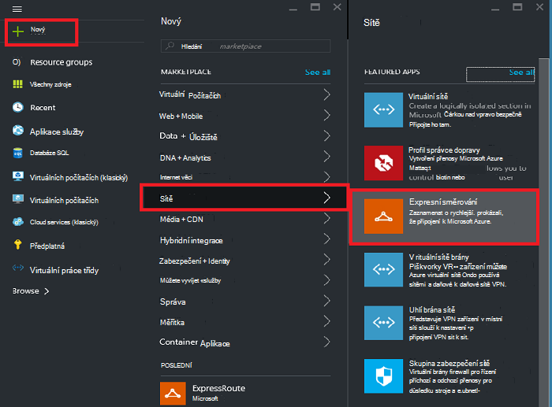
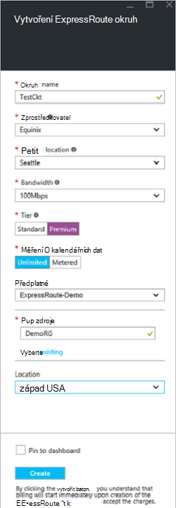
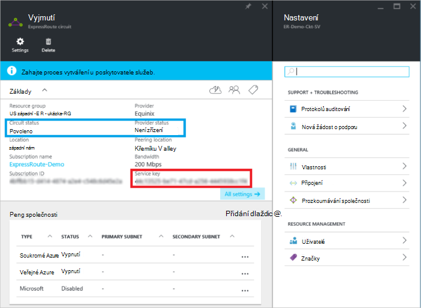
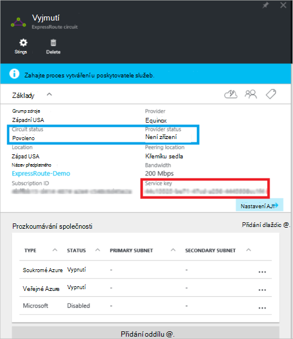
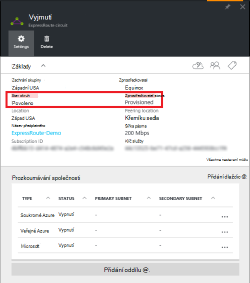

<properties
   pageTitle="Vytvářet a upravovat pomocí Správce zdrojů a portálu Azure ExpressRoute okruh | Microsoft Azure"
   description="Tento článek popisuje, jak vytvořit zřízení, ověřte, aktualizovat, odstranit a deprovision ExpressRoute okruh."
   documentationCenter="na"
   services="expressroute"
   authors="cherylmc"
   manager="carmonm"
   editor=""
   tags="azure-resource-manager"/>
<tags
   ms.service="expressroute"
   ms.devlang="na"
   ms.topic="article"
   ms.tgt_pltfrm="na"
   ms.workload="infrastructure-services"
   ms.date="10/10/2016"
   ms.author="cherylmc"/>

# Vytváření a změny ExpressRoute okruh

> [AZURE.SELECTOR]
[Azure portálu - správce prostředků](expressroute-howto-circuit-portal-resource-manager.md)
[prostředí PowerShell – správce prostředků](expressroute-howto-circuit-arm.md)
[prostředí PowerShell – klasické](expressroute-howto-circuit-classic.md)

Tento článek popisuje, jak vytvořit Azure ExpressRoute okruh pomocí portálu Azure a nasazení modelu správce prostředků Azure. Následující postup také vidíte, jak můžete zkontrolovat stav obvodu, aktualizovat, nebo odstranit a deprovision ho.

**Modely Azure nasazení**

[AZURE.INCLUDE [vpn-gateway-clasic-rm](../../includes/vpn-gateway-classic-rm-include.md)] 

## Než začnete

- Seznamte se s [požadavky](expressroute-prerequisites.md) a [pracovní postupy](expressroute-workflows.md) před zahájením konfigurace.
- Ujistěte se, že máte přístup k [Azure portálu](https://portal.azure.com).
- Ujistěte se, že máte oprávnění k vytvoření nové sítě zdroje. Pokud nemáte potřebná oprávnění, kontaktujte svého účtu správce.

## Vytvoření a zřízení ExpressRoute okruh

### 1. přihlásit k portálu Azure

V prohlížeči přejděte na [portál Azure](http://portal.azure.com) a přihlaste se pomocí účtu Azure.

### 2. Vytvořte nový okruh ExpressRoute

>[AZURE.IMPORTANT] ExpressRoute okruh se vám nebudou účtovat poplatky od okamžiku vydání klíč služby. Ujistěte se, kdy je připraven zřízení obvod poskytovatel připojení k provedení této operace.

1. ExpressRoute okruh můžete vytvořit tak, že vyberete možnost vytvořit nový zdroj. Klikněte na **Nový** > **sítě** > **ExpressRoute**, jak je znázorněno na následujícím obrázku:

    

2. Po kliknutí na **ExpressRoute**, zobrazí se zásuvné **vytvořit ExpressRoute okruh** . Při plnění do pole hodnoty v tomto zásuvné Ujistěte se, zadejte správná SKU osy a měření data.

    - **Vrstvy** Určuje, zda je povolen ExpressRoute standardní nebo doplněk ExpressRoute premium. Můžete použít **Standardní** získat standardní SKU nebo **Premium** pro doplněk premium.

    - **Měření dat** Určuje typ fakturace. Zadání **Účtovaná podle objemu dat** pro plán s měřením dat a **omezení** pro neomezený datový tarif. Všimněte si, že můžete změnit fakturační typ z **Účtovaná podle objemu dat** na **Neomezeno**, ale nemůžete změnit typ z **Neomezeno** **Účtovaná podle objemu dat**.

    

>[AZURE.IMPORTANT] Upozorňujeme, že umístění prozkoumávání označuje [fyzické umístění](expressroute-locations.md) místo, kam jste prozkoumávání u Microsoftu. To **nejsou** spojeny s vlastnost "Umístění", který odkazuje na oblast, kde je uložena Azure zprostředkovatele zdroje. Když nejsou ve spojení, je vhodné zvolit zdroje zprostředkovatele geograficky zavřít umístění prozkoumávání obvodu. 

### 3. zobrazení obvody a vlastností

**Zobrazení všech obvody**

Můžete zobrazit všechny obvody, které jste vytvořili tak, že vyberete **všechny zdroje** v levé nabídce.
    

**Zobrazení vlastností**

    You can view the properties of the circuit by selecting it. On this blade, note the service key for the circuit. You must copy the circuit key for your circuit and pass it down to the service provider to complete the provisioning process. The circuit key is specific to your circuit.

### 4. odešlete klíč služby poskytovatele připojení pro zřízení

Na tomto zásuvné **Stav zprostředkovatele** obsahuje informace o aktuálním stavu zřizování na straně poskytovatele služeb. **Stav okruhem** poskytuje stavu na straně Microsoft. Další informace o okruh zřizování států naleznete v článku [pracovní postupy](expressroute-workflows.md#expressroute-circuit-provisioning-states) .

Při vytváření nové okruh ExpressRoute obvod bude ve stavu následující:

Stav zprostředkovatele: není zřízení 
Okruh stav: povoleno

Obvod se změní následující stavu, když poskytovatel připojení probíhá povolení za vás:

Stav zprostředkovatele: zřizujete 
Okruh stav: povoleno

Abyste mohli používat ExpressRoute okruh musí být v tomto stavu:

Stav zprostředkovatele: zřízení 
Okruh stav: povoleno

### 5. pravidelně Kontrola stavu a stav okruh klávesy

Můžete zobrazit vlastnosti obvodu, který máte zájem že ho vyberete. Zkontrolujte **Stav zprostředkovatele** a ujistěte se, přesune se do **Provisioned** až potom pokračujte.

### 6. konfigurace směrování vytvořit

Podrobné pokyny naleznete v článku [Konfigurace směrování okruh ExpressRoute](expressroute-howto-routing-portal-resource-manager.md) vytvářet a upravovat okruh peerings.

>[AZURE.IMPORTANT] Tyto pokyny platí pouze pro obvody, které jsou vytvořené pomocí poskytovatele služeb, které nabízejí služby 2 připojení vrstvy. Při používání poskytovatele služby, který nabízí spravovaných layer 3 služby (obvykle IP VPN, jako je MPLS), bude váš poskytovatel připojení konfigurovat a spravovat směrování za vás.

### 7. propojit virtuální sítě s obvodovou ExpressRoute

Pak propojte virtuální síť s obvodovou ExpressRoute. Použijte v článku [virtuální sítě odkazování na ExpressRoute obvody](expressroute-howto-linkvnet-arm.md) při práci s nasazení modelu správce prostředků.

## Zjišťování stavu obvodu ExpressRoute

Zobrazení stavu obvodu tak, že ho vyberete. 

## Úprava ExpressRoute okruhem

Některé vlastnosti obvodu ExpressRoute můžete změnit bez vlivu na připojení. V současné době nejde upravit vlastnosti okruh ExpressRoute pomocí portálu Azure. Pomocí prostředí PowerShell můžete však upravte okruhem vlastnosti. Další informace naleznete v části [Úprava ExpressRoute okruh pomocí prostředí PowerShell](expressroute-howto-circuit-arm.md#modify).

Můžete udělat následující s žádné výpadek služeb:

- Povolení nebo zakázání doplněk premium ExpressRoute pro ExpressRoute okruh.

- Zvětšení šířky pásma obvodu ExpressRoute. Všimněte si, že přechodu šířku pásma okruh nepodporuje. 

- Změna měření plán z dat podle objemu dat na neomezený Data. Všimněte si, že měření plán z neomezený dat podle objemu dat dat nepodporuje se změna.

-  Můžete povolit a zakažte **Povolit klasické operace**.

Další informace o limitech a omezení podívejte se do [Nejčastější dotazy týkající se ExpressRoute](expressroute-faqs.md).

## Zrušení zajišťování a odstranění ExpressRoute okruh

Odstranit ExpressRoute okruh tak, že kliknutím na ikonu **Odstranit** . Poznámka:

- Je nutné zrušit všechny virtuální sítí okruh ExpressRoute. Pokud tento nezdaří, zkontrolujte, zda virtuální sítě jsou propojené s obvod.

- Když je ExpressRoute okruh služby poskytovatele zřizovací stav **Provisioning** nebo **Provisioned** musí spolupracujete poskytovatele služeb deprovision okruh na jejich straně. Budeme dál rezervovat prostředky a vám účtovat tak, aby poskytovatele služeb dokončí zrušení zajišťování obvodu a CZ s upozorněním.

- Pokud poskytovatele služeb má poskytování zrušeno elektrický obvod (zřizovací stavu poskytovatele služby je nastavena na **není zřízení**) můžete odstraňte obvod. Přestanou se vám fakturace za obvod

## Další kroky

Po vytvoření vaší okruh Ujistěte se, Uděláte to takhle:

- [Vytváření a změny směrování ExpressRoute okruhem](expressroute-howto-routing-portal-resource-manager.md)
- [Odkaz na ExpressRoute okruh virtuální sítě](expressroute-howto-linkvnet-arm.md)
