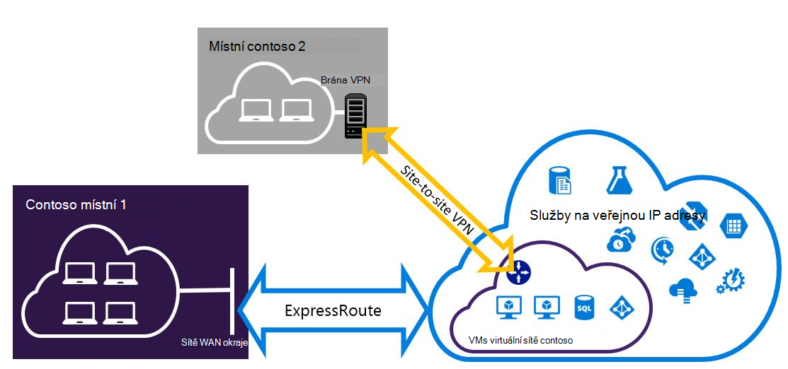

<properties
   pageTitle="Konfigurace připojení VPN Expressroute a na webu, která mohou být nainstalovány | Microsoft Azure"
   description="Tento článek vás provede konfigurace ExpressRoute a připojení VPN k webu, které můžou být nainstalovány pro klasické nasazení modelu."
   documentationCenter="na"
   services="expressroute"
   authors="charwen"
   manager="carmonm"
   editor=""
   tags="azure-service-management"/>
<tags
   ms.service="expressroute"
   ms.devlang="na"
   ms.topic="get-started-article"
   ms.tgt_pltfrm="na"
   ms.workload="infrastructure-services"
   ms.date="10/10/2016"
   ms.author="charwen"/>

# Konfigurace ExpressRoute a webu web existujících připojení pro klasické nasazení modelu

> [AZURE.SELECTOR]
- [Prostředí PowerShell – správce](expressroute-howto-coexist-resource-manager.md)
- [Prostředí PowerShell – klasické](expressroute-howto-coexist-classic.md)

Máte možnost konfigurace webů webu VPN a ExpressRoute má několik výhod. Konfigurace webů webu VPN jako bezpečné převzetí cestu pro ExressRoute nebo používat na webu virtuální privátní sítě pro připojení k serverům, které nejsou připojení přes ExpressRoute. Budeme se zabývat těmito oblastmi kroky pro nastavení obou případech v tomto článku. Tento článek se týká modelu klasické nasazení. Konfigurace není k dispozici na portálu.

**Modely Azure nasazení**

[AZURE.INCLUDE [vpn-gateway-clasic-rm](../../includes/vpn-gateway-classic-rm-include.md)] 

>[AZURE.IMPORTANT] Obvody ExpressRoute musí být nakonfigurované předem, než podle těchto pokynů. Ujistěte se, že absolvování příručky k [Vytvoření ExpressRoute obvodu](expressroute-howto-circuit-classic.md) a [Konfigurace směrování](expressroute-howto-routing-classic.md) před provedením následujících kroků.

## Limity a omezení

- **Směrování přenosu není podporovaná.** Mezi místní síti připojeného prostřednictvím sítě VPN na webu a v místní síti připojeného prostřednictvím ExpressRoute nelze směrovat (přes Azure).
- **Bod webu není podporovaná.** Není možné povolit připojení VPN čárky webu stejné VNet, který je připojen k ExpressRoute. Pro stejnou VNet nemohou být nainstalovány VPN a ExpressRoute čárky webu.
- **Vynuceného tunneling nelze povolili na webu webu VPN brány.** Můžete jenom "Vynutit" všechny přenosy vazbou na Internetu zpátky do vaší místní síti prostřednictvím ExpressRoute.
- **Základní SKU brány není podporovaná.** Brána není – základní SKU používají pro [ExpressRoute brány](expressroute-about-virtual-network-gateways.md) a [Brána VPN](../vpn-gateway/vpn-gateway-about-vpngateways.md).
- **Je podporována pouze na základě směrování Brána VPN.** Je nutné použít na základě směrování [VPN brány](../vpn-gateway/vpn-gateway-about-vpngateways.md).
- **Pro bránu VPN má nakonfigurovaný statické trasy.** Pokud místní síti je připojené k ExpressRoute a VPN k webu, musíte mít statické trasy nakonfigurovali ve svojí místní síti chcete směrovat veřejné internetové připojení VPN k webu.
- **ExpressRoute brány musí být nakonfigurované nejdřív.** ExpressRoute brány nutné nejprve vytvořit před přidáním Brána VPN k webu.

## Konfigurace návrhů

### Nastavení sítě VPN na webu jako převzetí cesty pro ExpressRoute

Připojení VPN k webu můžete nakonfigurovat záložní ExpressRoute. To se týká jenom virtuálních sítí propojené s Azure soukromé peering cestu. Získat přístup prostřednictvím Azure veřejné a Microsoft peerings neexistuje řešení založeného na síti VPN převzetí služby. Okruh ExpressRoute je vždy na primárním odkaz. Pouze v případě okruh ExpressRoute bude prostřednictvím sítě VPN na webu cesty toku dat. 

### Konfigurace připojení k webům nejste připojení prostřednictvím ExpressRoute VPN na webu

Můžete nakonfigurovat sítě některé weby připojit přímo k Azure přes VPN k webu, kde některé weby připojují ExpressRoute. 

>[AZURE.NOTE] Nakonfigurujte virtuální síť nelze jako při přenosu šifrovaná.

## Výběr kroky pro použití

Existují dva různé sady postupů můžete vybírat konfigurovat připojení, která mohou být nainstalovány. Postup konfigurace, kterou jste vybrali závisí na tom, jestli máte existující virtuální sítě, který chcete připojit, nebo chcete vytvořit novou síť virtuální.

- Můžu nemáte VNet a potřebujete ho vytvořit.
    
    Pokud ještě nemáte virtuální sítě, tento postup vás provede jednotlivými vytváření nových virtuální sítě pomocí klasické nasazení modelu a vytvoření nové připojení VPN ExpressRoute a na webu. Abyste mohli nakonfigurovat, postupujte podle kroků uvedených v části článek [Vytvoření nové virtuální sítě a existujících připojení](#new).

- Už mám klasické nasazení modelu VNet.

    Virtuální sítě může být už máte na místě pomocí existujícího připojení VPN k webu nebo ExpressRoute připojení. V části článek [Konfigurace coexsiting připojení pro existující VNet](#add) vás provede procesem odstranit bránu a vytvořit nové připojení VPN ExpressRoute a na webu. Všimněte si, že při vytváření nové připojení, musíte kroky dokončilo specifických pořadí. Nepoužívejte pokyny v další články k vytvoření brány a připojení.

    V tomto postupu vytvoření připojení, která mohou být nainstalovány bude vyžadují, abyste odstranit bránu a potom i konfiguraci nové brány. To znamená, že budete mít prostoj při připojení mezi místní během odstraňte a znovu vytvořte brány a připojení, ale nebudete muset migrovat VMs nebo služby do nové virtuální sítě. VMs a služby budou pořád moct komunikovat pomocí vyrovnávání zatížení při konfigurace brány, pokud jsou nakonfigurovány k tomu nevyzve.

## Vytvoření nového virtuální sítě a existujících připojení

Tento postup vás provede jednotlivými vytváření VNet a vytvoření webu na webu a ExpressRoute připojení, která bude spuštěn společně.

1. Musíte nainstalovat nejnovější verzi rutiny prostředí PowerShell Azure. Zjistěte, [Jak nainstalovat a nakonfigurovat Azure PowerShell](../powershell-install-configure.md) Další informace o instalaci rutiny prostředí PowerShell. Všimněte si, že rutinách, které budete používat pro tuto konfiguraci se mírně liší od co možná hledáte s. Ujistěte se, že jste pomocí rutin podle těchto pokynů. 

2. Vytvoření schématu virtuální sítě. Další informace o konfiguraci schéma najdete v článku [schéma konfigurace Azure virtuální sítě](https://msdn.microsoft.com/library/azure/jj157100.aspx).

    Při vytváření schématu zkontrolujte, jestli že používáte následující hodnoty:

    - Podsítě brány pro virtuální síť, musí být /27 nebo předponu kratší (například /26 nebo /25).
    - Typ připojení brány je "vlastní".

              <VirtualNetworkSite name="MyAzureVNET" Location="Central US">
                <AddressSpace>
                  <AddressPrefix>10.17.159.192/26</AddressPrefix>
                </AddressSpace>
                <Subnets>
                  <Subnet name="Subnet-1">
                    <AddressPrefix>10.17.159.192/27</AddressPrefix>
                  </Subnet>
                  <Subnet name="GatewaySubnet">
                    <AddressPrefix>10.17.159.224/27</AddressPrefix>
                  </Subnet>
                </Subnets>
                <Gateway>
                  <ConnectionsToLocalNetwork>
                    <LocalNetworkSiteRef name="MyLocalNetwork">
                      <Connection type="Dedicated" />
                    </LocalNetworkSiteRef>
                  </ConnectionsToLocalNetwork>
                </Gateway>
              </VirtualNetworkSite>

3. Po vytvoření a konfigurace souboru schématu xml, nahrajte soubor. Tím vytvoříte virtuální sítě.

    Pomocí následující rutiny umístěte vložit ovládací prvek, nahraďte hodnotu vlastní.

        Set-AzureVNetConfig -ConfigurationPath 'C:\NetworkConfig.xml'

4. Vytvoření brány ExpressRoute. Nezapomeňte zadat GatewaySKU jako *Standardní* *vysoce*nebo *UltraPerformance* a GatewayType jako *DynamicRouting*.

    Použijte v následujícím příkladu zaokrouhlením hodnoty pro vlastní.

        New-AzureVNetGateway -VNetName MyAzureVNET -GatewayType DynamicRouting -GatewaySKU HighPerformance

5. Propojení brána ExpressRoute okruh ExpressRoute. Po dokončení tohoto kroku mezi místní síti a Azure pomocí ExpressRoute, připojení.

        New-AzureDedicatedCircuitLink -ServiceKey <service-key> -VNetName MyAzureVNET

6. Dále vytvořte bránu VPN k webu. GatewaySKU musí být *Standardní* *vysoce* *UltraPerformance* a GatewayType musí být nebo *DynamicRouting*.

        New-AzureVirtualNetworkGateway -VNetName MyAzureVNET -GatewayName S2SVPN -GatewayType DynamicRouting -GatewaySKU  HighPerformance

    Načíst nastavení brány virtuální sítě, včetně ID brány a veřejnou IP použít `Get-AzureVirtualNetworkGateway` rutiny.

        Get-AzureVirtualNetworkGateway

        GatewayId            : 348ae011-ffa9-4add-b530-7cb30010565e
        GatewayName          : S2SVPN
        LastEventData        :
        GatewayType          : DynamicRouting
        LastEventTimeStamp   : 5/29/2015 4:41:41 PM
        LastEventMessage     : Successfully created a gateway for the following virtual network: GNSDesMoines
        LastEventID          : 23002
        State                : Provisioned
        VIPAddress           : 104.43.x.y
        DefaultSite          :
        GatewaySKU           : HighPerformance
        Location             :
        VnetId               : 979aabcf-e47f-4136-ab9b-b4780c1e1bd5
        SubnetId             :
        EnableBgp            : False
        OperationDescription : Get-AzureVirtualNetworkGateway
        OperationId          : 42773656-85e1-a6b6-8705-35473f1e6f6a
        OperationStatus      : Succeeded

7. Vytvoření místní síti VPN brány entity. Tento příkaz není nakonfigurujte bránu VPN místní. Místo toho ho umožňuje poskytovat místní brána nastavení, jako je veřejnou IP a místní adresy mezeru, tak, aby brána Azure VPN k ní připojit.

    >[AZURE.IMPORTANT] V netcfg není definované místní síti VPN, na webu. Místo toho třeba použít tuto rutinu k určení parametrů místní síti. Není možné definovat pomocí portálu nebo netcfg soubor.

    Použijte v následujícím příkladu nahradit hodnoty vlastní.

        New-AzureLocalNetworkGateway -GatewayName MyLocalNetwork -IpAddress <MyLocalGatewayIp> -AddressSpace <MyLocalNetworkAddress>

    > [AZURE.NOTE] Pokud místní síti obsahuje více než jedna, můžete předat je vše v matici.  $MyLocalNetworkAddress =@("10.1.2.0/24","10.1.3.0/24","10.2.1.0/24")  

    Načíst nastavení brány virtuální sítě, včetně ID brány a veřejnou IP použít `Get-AzureVirtualNetworkGateway` rutiny. Viz následující příklad.

        Get-AzureLocalNetworkGateway

        GatewayId            : 532cb428-8c8c-4596-9a4f-7ae3a9fcd01b
        GatewayName          : MyLocalNetwork
        IpAddress            : 23.39.x.y
        AddressSpace         : {10.1.2.0/24}
        OperationDescription : Get-AzureLocalNetworkGateway
        OperationId          : ddc4bfae-502c-adc7-bd7d-1efbc00b3fe5
        OperationStatus      : Succeeded

8. Konfigurace místního VPN zařízení pro připojení k Nová brána. Použití informací, které můžete získat v kroku 6 při konfiguraci VPN zařízení. Další informace o konfiguraci sítě VPN zařízení najdete v tématu [Konfigurace zařízení VPN](../vpn-gateway/vpn-gateway-about-vpn-devices.md).

9. Odkaz webu webu VPN brány na Azure místní brány.

    V tomto příkladu je connectedEntityId ID místní brány, který můžete najít spuštěním `Get-AzureLocalNetworkGateway`. Hledání virtualNetworkGatewayId pomocí `Get-AzureVirtualNetworkGateway` rutiny. Po dokončení tohoto kroku mezi místní síti a Azure přes připojení VPN k webu připojení.

        New-AzureVirtualNetworkGatewayConnection -connectedEntityId <local-network-gateway-id> -gatewayConnectionName Azure2Local -gatewayConnectionType IPsec -sharedKey abc123 -virtualNetworkGatewayId <azure-s2s-vpn-gateway-id>

## Konfigurace připojení pro existující VNet coexsiting

Pokud máte existující virtuální síť, zkontrolujte velikost podsítě brány. Pokud podsítě brány je /28 nebo /29, musíte nejdřív virtuální sítě bránu odstranit a podsítě zvětšení brány. Postup v této části se zobrazí jak na to.

Pokud podsítě brány je /27 nebo větší virtuální sítě je připojený prostřednictvím ExpressRoute, můžete přeskočit kroků a pokračujte ["Krok 6 – Vytvoření brány na webu VPN"](#vpngw) v předchozí části.

>[AZURE.NOTE] Při odstranění existující brány místních poštovních dojde ke ztrátě o připojení k síti virtuální při práci v této konfiguraci.

1. Musíte nainstalovat nejnovější verzi rutin prostředí PowerShell Azure správce prostředků. Zjistěte, [Jak nainstalovat a nakonfigurovat Azure PowerShell](../powershell-install-configure.md) Další informace o instalaci rutiny prostředí PowerShell. Všimněte si, že rutinách, které budete používat pro tuto konfiguraci se mírně liší od co možná hledáte s. Ujistěte se, že jste pomocí rutin podle těchto pokynů. 

2. Odstranění existující VPN na webu nebo ExpressRoute brány. Použijte následující rutinu nahradit hodnoty vlastní.

        Remove-AzureVNetGateway –VnetName MyAzureVNET

3. Exportujte schématu virtuální sítě. Použijte následující rutinu Powershellu nahradit hodnoty vlastní.

        Get-AzureVNetConfig –ExportToFile “C:\NetworkConfig.xml”

4. Úprava schéma souboru konfigurace sítě tak, aby podsítě brány /27 nebo předponu kratší (například /26 nebo /25). Viz následující příklad. 
>[AZURE.NOTE] Pokud nemáte dost IP adresy vlevo v síti virtuální podsítě zvětšit brány, potřebujete přidat více IP adresu místa. Další informace o konfiguraci schéma najdete v článku [schéma konfigurace Azure virtuální sítě](https://msdn.microsoft.com/library/azure/jj157100.aspx).

          <Subnet name="GatewaySubnet">
            <AddressPrefix>10.17.159.224/27</AddressPrefix>
          </Subnet>

5. Pokud předchozí Brána VPN k webu, musíte taky změnit typ připojení k **Dedicated**.

                 <Gateway>
                  <ConnectionsToLocalNetwork>
                    <LocalNetworkSiteRef name="MyLocalNetwork">
                      <Connection type="Dedicated" />
                    </LocalNetworkSiteRef>
                  </ConnectionsToLocalNetwork>
                </Gateway>

6. V tomto okamžiku budete mít VNet s žádné brány. Vytvořit nové brány a dokončete připojení, můžete pokračovat ve [Krok 4 – vytvoření ExpressRoute brány](#gw), najdete v sadě předchozích kroků.

## Další kroky

Další informace o ExpressRoute najdete v tématu [Nejčastější dotazy týkající se ExpressRoute](expressroute-faqs.md)
