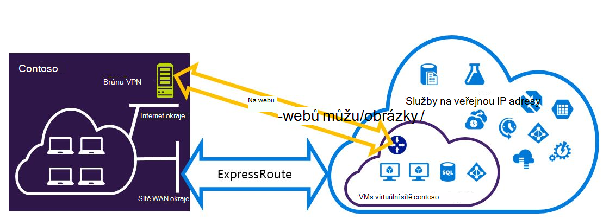
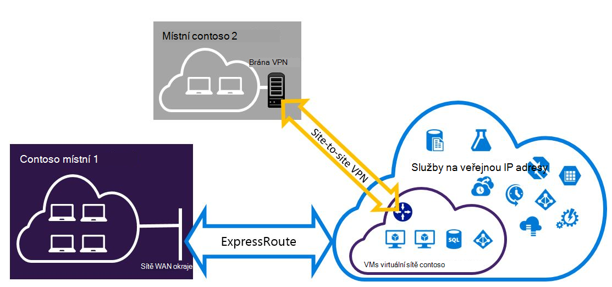

<properties
   pageTitle="Konfigurace Expressroute a webu web sítě VPN, které můžou být nainstalovány pro nasazení modelu správce prostředků | Microsoft Azure"
   description="Tento článek vás provede konfigurace ExpressRoute a připojení VPN k webu, které můžou být nainstalovány pro správce prostředků model."
   documentationCenter="na"
   services="expressroute"
   authors="charwen"
   manager="carmonm"
   editor=""
   tags="azure-resource-manager"/>
<tags
   ms.service="expressroute"
   ms.devlang="na"
   ms.topic="get-started-article"
   ms.tgt_pltfrm="na"
   ms.workload="infrastructure-services"
   ms.date="10/10/2016"
   ms.author="charleywen"/>

# Konfigurace ExpressRoute a webu web existujících připojení pro nasazení modelu správce prostředků

> [AZURE.SELECTOR]
- [Prostředí PowerShell – správce](expressroute-howto-coexist-resource-manager.md)
- [Prostředí PowerShell – klasické](expressroute-howto-coexist-classic.md)

Máte možnost konfigurace webů webu VPN a ExpressRoute má několik výhod. Konfigurace webů webu VPN jako bezpečné převzetí cestu pro ExressRoute nebo používat na webu virtuální privátní sítě pro připojení k serverům, které nejsou připojení přes ExpressRoute. Budeme se zabývat těmito oblastmi kroky pro nastavení obou případech v tomto článku. Tento článek se týká nasazení modelu správce prostředků. Konfigurace není k dispozici v portálu Azure.

**Modely Azure nasazení**

[AZURE.INCLUDE [vpn-gateway-clasic-rm](../../includes/vpn-gateway-classic-rm-include.md)] 

>[AZURE.IMPORTANT] Obvody ExpressRoute musí být nakonfigurované předem, než podle těchto pokynů. Ujistěte se, že absolvování příručky k [Vytvoření ExpressRoute obvodu](expressroute-howto-circuit-arm.md) a [Konfigurace směrování](expressroute-howto-routing-arm.md) před provedením následujících kroků.

## Limity a omezení

- **Směrování přenosu není podporovaná.** Mezi místní síti připojeného prostřednictvím sítě VPN na webu a v místní síti připojeného prostřednictvím ExpressRoute nelze směrovat (přes Azure).
- **Základní SKU brány není podporovaná.** Brána není – základní SKU používají pro [ExpressRoute brány](expressroute-about-virtual-network-gateways.md) a [Brána VPN](../vpn-gateway/vpn-gateway-about-vpngateways.md).
- **Je podporována pouze na základě směrování Brána VPN.** Je nutné použít na základě směrování [VPN brány](../vpn-gateway/vpn-gateway-about-vpngateways.md).
- **Pro bránu VPN má nakonfigurovaný statické trasy.** Pokud místní síti je připojené k ExpressRoute a VPN k webu, musíte mít statické trasy nakonfigurovali ve svojí místní síti chcete směrovat veřejné internetové připojení VPN k webu.
- **ExpressRoute brány musí být nakonfigurované nejdřív.** ExpressRoute brány nutné nejprve vytvořit před přidáním Brána VPN k webu.

## Konfigurace návrhů

### Nastavení sítě VPN na webu jako převzetí cesty pro ExpressRoute

Připojení VPN k webu můžete nakonfigurovat záložní ExpressRoute. To se týká jenom virtuálních sítí propojené s Azure soukromé peering cestu. Získat přístup prostřednictvím Azure veřejné a Microsoft peerings neexistuje řešení založeného na síti VPN převzetí služby. Okruh ExpressRoute je vždy na primárním odkaz. Pouze v případě okruh ExpressRoute bude prostřednictvím sítě VPN na webu cesty toku dat.
>[AZURE.NOTE] Sice ExpressRoute okruh preferovaného přes VPN k webu Pokud jsou oba směruje stejné, bude Azure pomocí shoda předpony longuest zvolit směrování směrem k určení paketu.

### Konfigurace připojení k webům nejste připojení prostřednictvím ExpressRoute VPN na webu

Můžete nakonfigurovat sítě některé weby připojit přímo k Azure přes VPN k webu, kde některé weby připojují ExpressRoute. 

>[AZURE.NOTE] Nakonfigurujte virtuální síť nelze jako při přenosu šifrovaná.

## Výběr kroky pro použití

Existují dva různé sady postupů můžete vybírat konfigurovat připojení, která mohou být nainstalovány. Postup konfigurace, kterou jste vybrali závisí na tom, jestli máte existující virtuální sítě, který chcete připojit, nebo chcete vytvořit novou síť virtuální.

- Můžu nemáte VNet a potřebujete ho vytvořit.
    
    Pokud ještě nemáte virtuální síť, tento postup vás provede jednotlivými vytváření nových virtuální síť pomocí Správce prostředků nasazení modelu a vytvoření nové připojení VPN ExpressRoute a na webu. Abyste mohli nakonfigurovat, postupujte podle kroků uvedených v části článek [Vytvoření nové virtuální sítě a existujících připojení](#new).

- Správce prostředků nasazení modelu VNet už mám.

    Virtuální sítě může být už máte na místě pomocí existujícího připojení VPN k webu nebo ExpressRoute připojení. Oddíl [pro nastavení coexsiting připojení pro existující VNet](#add) vás provede procesem odstranit bránu a vytvořit nové připojení VPN ExpressRoute a na webu. Všimněte si, že při vytváření nové připojení, musíte kroky dokončilo specifických pořadí. Nepoužívejte pokyny v další články k vytvoření brány a připojení.

    V tomto postupu vytvoření připojení, která mohou být nainstalovány bude vyžadují, abyste odstranit bránu a potom i konfiguraci nové brány. To znamená, že budete mít prostoj při připojení mezi místní během odstraňte a znovu vytvořte brány a připojení, ale nebudete muset migrovat VMs nebo služby do nové virtuální sítě. VMs a služby budou pořád moct komunikovat pomocí vyrovnávání zatížení při konfigurace brány, pokud jsou nakonfigurovány k tomu nevyzve.

## Vytvoření nového virtuální sítě a existujících připojení

Tento postup vás provede jednotlivými vytváření VNet a vytvoření webu na webu a ExpressRoute připojení, která bude spuštěn společně.
    
1. Musíte nainstalovat nejnovější verzi rutiny prostředí PowerShell Azure. Zjistěte, [Jak nainstalovat a nakonfigurovat Azure PowerShell](../powershell-install-configure.md) Další informace o instalaci rutiny prostředí PowerShell. Všimněte si, že rutinách, které budete používat pro tuto konfiguraci se mírně liší od co možná hledáte s. Ujistěte se, že jste pomocí rutin podle těchto pokynů.

2. Přihlášení svůj účet a nastavit prostředí.
    
        login-AzureRmAccount
        Select-AzureRmSubscription -SubscriptionName 'yoursubscription'
        $location = "Central US"
        $resgrp = New-AzureRmResourceGroup -Name "ErVpnCoex" -Location $location

3. Vytvořte virtuální sítě, včetně podsítě brány. Další informace o konfiguraci virtuální sítě najdete v tématu [Konfigurace Azure virtuální sítě](../virtual-network/virtual-networks-create-vnet-arm-ps.md).

    >[AZURE.IMPORTANT] Podsítě brány musí být /27 nebo předponu kratší (například /26 nebo /25).
    
    Vytvoření nového VNet.

        $vnet = New-AzureRmVirtualNetwork -Name "CoexVnet" -ResourceGroupName $resgrp.ResourceGroupName -Location $location -AddressPrefix "10.200.0.0/16" 

    Přidání podsítí.

        Add-AzureRmVirtualNetworkSubnetConfig -Name "App" -VirtualNetwork $vnet -AddressPrefix "10.200.1.0/24"
        Add-AzureRmVirtualNetworkSubnetConfig -Name "GatewaySubnet" -VirtualNetwork $vnet -AddressPrefix "10.200.255.0/24"

    Uložení konfigurace VNet.

        $vnet = Set-AzureRmVirtualNetwork -VirtualNetwork $vnet

4. Vytvoření brány ExpressRoute. Další informace o konfiguraci brány ExpressRoute najdete v tématu [Konfigurace brány ExpressRoute](expressroute-howto-add-gateway-resource-manager.md). GatewaySKU musí být *Standardní* *vysoce*nebo *UltraPerformance*.

        $gwSubnet = Get-AzureRmVirtualNetworkSubnetConfig -Name "GatewaySubnet" -VirtualNetwork $vnet
        $gwIP = New-AzureRmPublicIpAddress -Name "ERGatewayIP" -ResourceGroupName $resgrp.ResourceGroupName -Location $location -AllocationMethod Dynamic
        $gwConfig = New-AzureRmVirtualNetworkGatewayIpConfig -Name "ERGatewayIpConfig" -SubnetId $gwSubnet.Id -PublicIpAddressId $gwIP.Id
        $gw = New-AzureRmVirtualNetworkGateway -Name "ERGateway" -ResourceGroupName $resgrp.ResourceGroupName -Location $location -IpConfigurations $gwConfig -GatewayType "ExpressRoute" -GatewaySku Standard 

5. Propojení brána ExpressRoute okruh ExpressRoute. Po dokončení tohoto kroku mezi místní síti a Azure pomocí ExpressRoute, připojení. Další informace o operaci propojení najdete v článku [VNets odkaz na ExpressRoute](expressroute-howto-linkvnet-arm.md).

        $ckt = Get-AzureRmExpressRouteCircuit -Name "YourCircuit" -ResourceGroupName "YourCircuitResourceGroup"
        New-AzureRmVirtualNetworkGatewayConnection -Name "ERConnection" -ResourceGroupName $resgrp.ResourceGroupName -Location $location -VirtualNetworkGateway1 $gw -PeerId $ckt.Id -ConnectionType ExpressRoute

6. Dále vytvořte bránu VPN k webu. Další informace o konfiguraci brány VPN najdete v tématu [Konfigurace VNet s připojením k webu](../vpn-gateway/vpn-gateway-create-site-to-site-rm-powershell.md). GatewaySKU musí být *Standardní* *vysoce*nebo *UltraPerformance*. VpnType musí *RouteBased*.

        $gwSubnet = Get-AzureRmVirtualNetworkSubnetConfig -Name "GatewaySubnet" -VirtualNetwork $vnet
        $gwIP = New-AzureRmPublicIpAddress -Name "VPNGatewayIP" -ResourceGroupName $resgrp.ResourceGroupName -Location $location -AllocationMethod Dynamic
        $gwConfig = New-AzureRmVirtualNetworkGatewayIpConfig -Name "VPNGatewayIpConfig" -SubnetId $gwSubnet.Id -PublicIpAddressId $gwIP.Id
        New-AzureRmVirtualNetworkGateway -Name "VPNGateway" -ResourceGroupName $resgrp.ResourceGroupName -Location $location -IpConfigurations $gwConfig -GatewayType "Vpn" -VpnType "RouteBased" -GatewaySku "Standard"

    Azure Brána VPN podporuje BGP. Zadáte - EnableBgp v následující příkaz.

        $azureVpn = New-AzureRmVirtualNetworkGateway -Name "VPNGateway" -ResourceGroupName $resgrp.ResourceGroupName -Location $location -IpConfigurations $gwConfig -GatewayType "Vpn" -VpnType "RouteBased" -GatewaySku "Standard" -EnableBgp $true

    Můžete najít BGP prozkoumávání IP a číslo využívající Azure brány VPN $azureVpn.BgpSettings.BgpPeeringAddress a $azureVpn.BgpSettings.Asn. Další informace najdete v tématu [Konfigurace BGP](../vpn-gateway/vpn-gateway-bgp-resource-manager-ps.md) Azure VPN brány.

7. Vytvoření místní síti VPN brány entity. Tento příkaz není nakonfigurujte bránu VPN místní. Místo toho ho umožňuje poskytovat místní brána nastavení, jako je veřejnou IP a místní adresy mezeru, tak, aby brána Azure VPN k ní připojit.

    Pokud místní zařízení VPN podporuje pouze statické směrování, můžete nakonfigurovat statické trasy následujícím způsobem.

        $MyLocalNetworkAddress = @("10.100.0.0/16","10.101.0.0/16","10.102.0.0/16")
        $localVpn = New-AzureRmLocalNetworkGateway -Name "LocalVPNGateway" -ResourceGroupName $resgrp.ResourceGroupName -Location $location -GatewayIpAddress *<Public IP>* -AddressPrefix $MyLocalNetworkAddress

    Pokud chcete povolit dynamické směrování místním zařízením VPN podporuje BGP, je potřeba vědět BGP prozkoumávání IP a číslo, který používá místní VPN zařízení.

        $localVPNPublicIP = "<Public IP>"
        $localBGPPeeringIP = "<Private IP for the BGP session>"
        $localBGPASN = "<ASN>"
        $localAddressPrefix = $localBGPPeeringIP + "/32"
        $localVpn = New-AzureRmLocalNetworkGateway -Name "LocalVPNGateway" -ResourceGroupName $resgrp.ResourceGroupName -Location $location -GatewayIpAddress $localVPNPublicIP -AddressPrefix $localAddressPrefix -BgpPeeringAddress $localBGPPeeringIP -Asn $localBGPASN

8. Konfigurace místního VPN zařízení pro připojení k Nová brána Azure VPN. Další informace o konfiguraci sítě VPN zařízení najdete v tématu [Konfigurace zařízení VPN](../vpn-gateway/vpn-gateway-about-vpn-devices.md).

9. Odkaz webu webu VPN brány na Azure místní brány.

        $azureVpn = Get-AzureRmVirtualNetworkGateway -Name "VPNGateway" -ResourceGroupName $resgrp.ResourceGroupName
        New-AzureRmVirtualNetworkGatewayConnection -Name "VPNConnection" -ResourceGroupName $resgrp.ResourceGroupName -Location $location -VirtualNetworkGateway1 $azureVpn -LocalNetworkGateway2 $localVpn -ConnectionType IPsec -SharedKey <yourkey>

## Konfigurace připojení pro existující VNet coexsiting

Pokud máte existující virtuální síť, zkontrolujte velikost podsítě brány. Pokud podsítě brány je /28 nebo /29, musíte nejdřív virtuální sítě bránu odstranit a podsítě zvětšení brány. Postup v této části se zobrazí jak na to.

Pokud podsítě brány je /27 nebo větší virtuální sítě je připojený prostřednictvím ExpressRoute, můžete přeskočit kroků a pokračujte ["Krok 6 – Vytvoření brány na webu VPN"](#vpngw) v předchozí části. 

>[AZURE.NOTE] Při odstranění existující brány místních poštovních dojde ke ztrátě o připojení k síti virtuální při práci v této konfiguraci. 

1. Musíte nainstalovat nejnovější verzi rutiny prostředí PowerShell Azure. Zjistěte, [Jak nainstalovat a nakonfigurovat Azure PowerShell](../powershell-install-configure.md) Další informace o instalaci rutiny prostředí PowerShell. Všimněte si, že rutinách, které budete používat pro tuto konfiguraci se mírně liší od co možná hledáte s. Ujistěte se, že jste pomocí rutin podle těchto pokynů. 

2. Odstranění existující VPN na webu nebo ExpressRoute brány. 

        Remove-AzureRmVirtualNetworkGateway -Name <yourgatewayname> -ResourceGroupName <yourresourcegroup>

3. Odstranění podsítě brány.
        
        $vnet = Get-AzureRmVirtualNetwork -Name <yourvnetname> -ResourceGroupName <yourresourcegroup> 
        Remove-AzureRmVirtualNetworkSubnetConfig -Name GatewaySubnet -VirtualNetwork $vnet

4. Přidání podsítě brány, který je /27 nebo větší.
    >[AZURE.NOTE] Pokud nemáte dost IP adresy vlevo v síti virtuální podsítě zvětšit brány, potřebujete přidat více IP adresu místa.

        $vnet = Get-AzureRmVirtualNetwork -Name <yourvnetname> -ResourceGroupName <yourresourcegroup>
        Add-AzureRmVirtualNetworkSubnetConfig -Name "GatewaySubnet" -VirtualNetwork $vnet -AddressPrefix "10.200.255.0/24"

    Uložení konfigurace VNet.

        $vnet = Set-AzureRmVirtualNetwork -VirtualNetwork $vnet

5. V tomto okamžiku budete mít VNet s žádné brány. Vytvořit nové brány a dokončete připojení, můžete pokračovat ve [Krok 4 – vytvoření ExpressRoute brány](#gw), najdete v sadě předchozích kroků.

## Přidání bodu webu konfigurace brány pro VPN
Postupujte podle pokynů a přidání bodu webu konfigurace bránu VPN v nastavení vzájemnou spolupráci.

1. Přidání fondu adresu klienta VPN. 

        $azureVpn = Get-AzureRmVirtualNetworkGateway -Name "VPNGateway" -ResourceGroupName $resgrp.ResourceGroupName
        Set-AzureRmVirtualNetworkGatewayVpnClientConfig -VirtualNetworkGateway $azureVpn -VpnClientAddressPool "10.251.251.0/24"

2. Nahrání VPN kořenového certifikátu do Azure VPN brány. V tomto příkladu předpokládá se, že kořenového certifikátu uložené v místním počítači, kde jsou tyto rutiny prostředí PowerShell spusťte. 

        $p2sCertFullName = "RootErVpnCoexP2S.cer"
        $p2sCertMatchName = "RootErVpnCoexP2S"
        $p2sCertToUpload=get-childitem Cert:\CurrentUser\My | Where-Object {$_.Subject -match $p2sCertMatchName}
        if ($p2sCertToUpload.count -eq 1){
            write-host "cert found"
        } else {
            write-host "cert not found"
            exit
        } 
        $p2sCertData = [System.Convert]::ToBase64String($p2sCertToUpload.RawData)
        Add-AzureRmVpnClientRootCertificate -VpnClientRootCertificateName $p2sCertFullName -VirtualNetworkGatewayname $azureVpn.Name -ResourceGroupName $resgrp.ResourceGroupName -PublicCertData $p2sCertData

Další informace o čárky webu VPN tématu [Konfigurace připojení čárky webu](../vpn-gateway/vpn-gateway-howto-point-to-site-rm-ps.md).

## Další kroky

Další informace o ExpressRoute najdete v tématu [Nejčastější dotazy týkající se ExpressRoute](expressroute-faqs.md).
