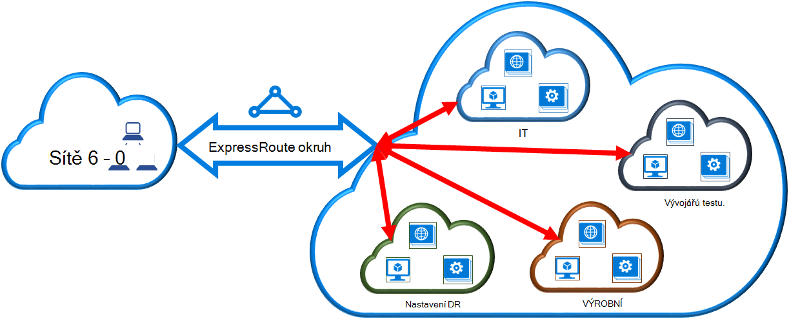

<properties
   pageTitle="Propojit virtuální sítě ExpressRoute okruh pomocí klasické nasazení modelu a prostředí PowerShell | Microsoft Azure"
   description="Tento dokument obsahuje přehled o tom, jak propojit virtuálních sítí (VNets) do ExpressRoute obvody pomocí klasické nasazení modelu a Powershellu."
   services="expressroute"
   documentationCenter="na"
   authors="ganesr"
   manager="carmonm"
   editor=""
   tags="azure-service-management"/>
<tags
   ms.service="expressroute"
   ms.devlang="na"
   ms.topic="article"
   ms.tgt_pltfrm="na"
   ms.workload="infrastructure-services"
   ms.date="10/10/2016"
   ms.author="ganesr" />

# Odkaz na ExpressRoute okruh virtuální sítě

> [AZURE.SELECTOR]
- [Azure portálu - správce prostředků](expressroute-howto-linkvnet-portal-resource-manager.md)
- [Prostředí PowerShell – správce](expressroute-howto-linkvnet-arm.md)
- [Prostředí PowerShell – klasické](expressroute-howto-linkvnet-classic.md)

Tento článek vám pomůže propojit virtuálních sítí (VNets) Azure ExpressRoute obvody pomocí klasické nasazení modelu a Powershellu. Virtuální sítě může být v rámci stejného předplatného nebo může být součástí jiné předplatné.

**Modely Azure nasazení**

[AZURE.INCLUDE [vpn-gateway-clasic-rm](../../includes/vpn-gateway-classic-rm-include.md)]

## Konfigurace požadavky

1. Je třeba nejnovější verzi modulu Azure Powershellu. Nejnovější moduly prostředí PowerShell můžete stáhnout z prostředí PowerShell část [stránky souborů ke stažení Azure](https://azure.microsoft.com/downloads/). Postupujte podle pokynů v [tom, jak nainstalovat a nakonfigurovat Azure PowerShell](../powershell-install-configure.md) podrobné pokyny ke konfiguraci počítače k použití moduly Azure Powershellu.
2. Potřebujete zkontrolovat [požadavky](expressroute-prerequisites.md), [požadavky na směrování](expressroute-routing.md)a [pracovní postupy](expressroute-workflows.md) před zahájením konfigurace.
3. Máte aktivní okruh ExpressRoute.
    - Postupujte podle pokynů a [vytvořte ExpressRoute okruh](expressroute-howto-circuit-classic.md) a aby vám poskytovatel připojení povolit obvod.
    - Zajištění Azure soukromé prozkoumávání nakonfigurovaná pro vaše okruh. V tématu [Konfigurace směrování](expressroute-howto-routing-classic.md) pokyny v článku směrování.
    - Zajistěte, že Azure soukromé prozkoumávání nakonfigurovaný a BGP prozkoumávání mezi sítí a Microsoft nahoru, čímž povolíte připojení začátku do konce.
    - Musí mít virtuální sítě a Brána virtuální sítě vytvořené a plně zřízení. Postupujte podle pokynů ke [konfiguraci virtuální sítě pro ExpressRoute](expressroute-howto-vnet-portal-classic.md).

Až 10 virtuálních sítí můžete propojit s obvodovou ExpressRoute. Všechny virtuální sítě musí být ve stejné geopolitické oblasti. Větší počet virtuálních sítí ExpressRoute obvodu nebo odkaz virtuální sítí, které jsou v ostatních oblastech geopolitické, pokud jste povolili doplněk premium ExpressRoute můžete propojit. Zaškrtněte políčko [Nejčastější dotazy týkající se](expressroute-faqs.md) podrobné informace o doplňku premium.

## Připojení k okruh virtuální sítě v rámci stejného předplatného

Virtuální sítě můžete propojit s obvodovou ExpressRoute pomocí následující rutiny. Ujistěte se, že brány virtuální sítě se vytvoří a je připraven k propojení před spuštěním rutiny.

    New-AzureDedicatedCircuitLink -ServiceKey "*****************************" -VNetName "MyVNet"
    Provisioned

## Připojení k okruh virtuální sítě v jiné předplatné

ExpressRoute okruhem můžete sdílet ve víc předplatných. Následující obrázek znázorňuje jednoduchou schéma způsobu sdílení prací ExpressRoute obvody přes víc předplatných.

Každou menší mraků ve velké cloudu slouží k představují předplatných, která patří různá oddělení v rámci organizace. Svoje předplatné všech oddělení v rámci organizace můžete použít pro nasazení služeb – ale oddělení můžete sdílet jednoho okruh ExpressRoute připojení zpátky do vaší místní síti. Jednoho oddělení (v tomto příkladu: IT) můžete vlastní okruh ExpressRoute. Další předplatná v rámci organizace můžete použít okruh ExpressRoute.

>[AZURE.NOTE] Připojení a šířku pásma poplatky vyhrazené okruhem použije se vlastníka okruh ExpressRoute. Všechny virtuální sítě sdílet stejnou šířku pásma.

### Správa

*Vlastník okruh* je správce/coadministrator předplatné, ve kterém je vytvořen okruh ExpressRoute. Vlastník okruh můžete povolit správci/coadministrators z jiných předplatných označují jako *okruh uživatelů*, má být použit vyhrazené okruh, že vlastníte. Okruh uživatelů, kteří jsou oprávněni používat okruh ExpressRoute organizace můžete propojit virtuální sítě své předplatné okruh ExpressRoute poté, co jsou oprávnění.

Vlastník okruh má snadno změnit nebo odvolat povolení kdykoli. Odvolání oprávnění bude mít za následek všech odkazů odstraní z předplatného, jehož přístup byl odvolán.

### Operace s obvodovou vlastník

#### Vytvoření ověření

Vlastník okruh povoluje správcům jiných předplatných pomocí zadaného okruh. V následujícím příkladu správce okruh (Contoso IT) umožňuje správci jiné předplatné (odchylka-testu) až dva virtuální sítě propojit obvodu. Správce Contoso IT umožňuje to tím, že zadáte ID služeb Microsoft vývojáře-testu. Rutiny neodesílá e-mailu společnosti zadaný ID služeb Microsoft. Vlastník okruh musí sdělit explicitně jiné předplatné vlastníka dokončení povolení.

    New-AzureDedicatedCircuitLinkAuthorization -ServiceKey "**************************" -Description "Dev-Test Links" -Limit 2 -MicrosoftIds 'devtest@contoso.com'

    Description         : Dev-Test Links
    Limit               : 2
    LinkAuthorizationId : **********************************
    MicrosoftIds        : devtest@contoso.com
    Used                : 0

#### Kontrola povolení

Vlastník okruh můžete zkontrolovat všechny povolení vydané na určitou s obvodovou spuštěné následující rutinu:

    Get-AzureDedicatedCircuitLinkAuthorization -ServiceKey: "**************************"

    Description         : EngineeringTeam
    Limit               : 3
    LinkAuthorizationId : ####################################
    MicrosoftIds        : engadmin@contoso.com
    Used                : 1

    Description         : MarketingTeam
    Limit               : 1
    LinkAuthorizationId : @@@@@@@@@@@@@@@@@@@@@@@@@@@@@@@@@@@@
    MicrosoftIds        : marketingadmin@contoso.com
    Used                : 0

    Description         : Dev-Test Links
    Limit               : 2
    LinkAuthorizationId : &&&&&&&&&&&&&&&&&&&&&&&&&&&&&&&&&&&&
    MicrosoftIds        : salesadmin@contoso.com
    Used                : 2

#### Aktualizace povolení

Vlastník okruh můžete změnit povolení pomocí následující rutinu:

    Set-AzureDedicatedCircuitLinkAuthorization -ServiceKey "**************************" -AuthorizationId "&&&&&&&&&&&&&&&&&&&&&&&&&&&&"-Limit 5

    Description         : Dev-Test Links
    Limit               : 5
    LinkAuthorizationId : &&&&&&&&&&&&&&&&&&&&&&&&&&&&&&&&&&&&&&
    MicrosoftIds        : devtest@contoso.com
    Used                : 0

#### Odstranění povolení

Vlastník okruh můžete odebrat nebo odstranění povolení uživateli spusťte následující rutinu:

    Remove-AzureDedicatedCircuitLinkAuthorization -ServiceKey "*****************************" -AuthorizationId "###############################"

### Operace okruh uživatelů

#### Kontrola povolení

Okruh uživatelů můžete procházet povolení pomocí následující rutinu:

    Get-AzureAuthorizedDedicatedCircuit

    Bandwidth                        : 200
    CircuitName                      : ContosoIT
    Location                         : Washington DC
    MaximumAllowedLinks              : 2
    ServiceKey                       : &&&&&&&&&&&&&&&&&&&&&&&&&&&&&&&&&&&&
    ServiceProviderName              : equinix
    ServiceProviderProvisioningState : Provisioned
    Status                           : Enabled
    UsedLinks                        : 0

#### Povolení uplatněním odkaz

Okruh uživatelů můžete spustit následující rutinu pro uplatnění povolení odkaz:

    New-AzureDedicatedCircuitLink –servicekey "&&&&&&&&&&&&&&&&&&&&&&&&&&" –VnetName 'SalesVNET1'

    State VnetName
    ----- --------
    Provisioned SalesVNET1

## Další kroky

Další informace o ExpressRoute najdete v tématu [Nejčastější dotazy týkající se ExpressRoute](expressroute-faqs.md).
