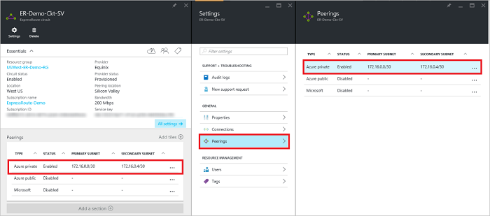
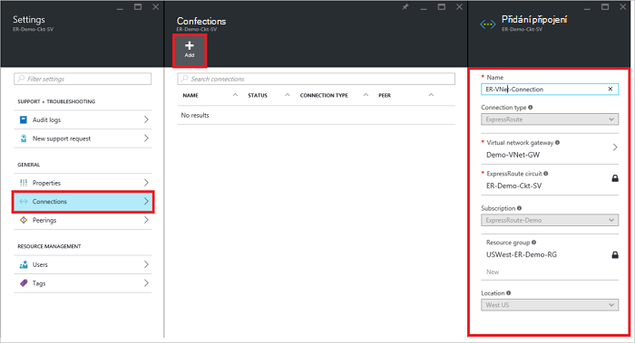
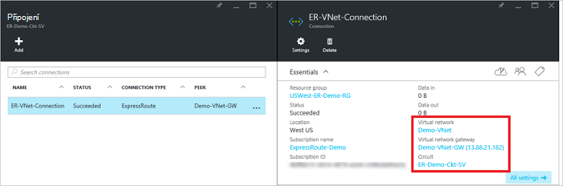

<properties
   pageTitle="Propojit virtuální sítě ExpressRoute okruh pomocí portálu Azure a nasazení modelu správce prostředků | Microsoft Azure"
   description="Tento dokument obsahuje základní informace o propojování virtuálních sítí (VNets) ExpressRoute obvody."
   services="expressroute"
   documentationCenter="na"
   authors="cherylmc"
   manager="carmonm"
   editor=""
   tags="azure-resource-manager"/>
<tags
   ms.service="expressroute"
   ms.devlang="na"
   ms.topic="article"
   ms.tgt_pltfrm="na"
   ms.workload="infrastructure-services"
   ms.date="10/10/2016"
   ms.author="cherylmc" />

# Odkaz na ExpressRoute okruh virtuální sítě

> [AZURE.SELECTOR]
- [Azure portálu - správce prostředků](expressroute-howto-linkvnet-portal-resource-manager.md)
- [Prostředí PowerShell – správce](expressroute-howto-linkvnet-arm.md)
- [Prostředí PowerShell – klasické](expressroute-howto-linkvnet-classic.md)

Tento článek vám pomůže propojit virtuálních sítí (VNets) Azure ExpressRoute obvody pomocí portálu Azure a nasazení modelu správce prostředků. Virtuální sítě můžou být v rámci stejného předplatného nebo může být součástí jiné předplatné.

**Modely Azure nasazení**

[AZURE.INCLUDE [vpn-gateway-clasic-rm](../../includes/vpn-gateway-classic-rm-include.md)]

## Konfigurace požadavky

- Ujistěte se, že zkontrolování [požadavky](expressroute-prerequisites.md), [požadavky směrování](expressroute-routing.md)a [pracovní postupy](expressroute-workflows.md) před zahájením konfigurace.
- Máte aktivní okruh ExpressRoute.
    - Postupujte podle pokynů a [vytvořte ExpressRoute okruh](expressroute-howto-circuit-arm.md) a mít okruh povolit tak, že váš poskytovatel připojení.

    - Zajištění Azure soukromé prozkoumávání nakonfigurovaná pro vaše okruh. V tématu [Konfigurace směrování](expressroute-howto-routing-portal-resource-manager.md) pokyny v článku směrování.

    - Zajistěte, že Azure soukromé prozkoumávání nakonfigurovaný a BGP prozkoumávání mezi síť a Microsoft nahoru, čímž povolíte připojení začátku do konce.

    - Ujistěte se, že máte virtuální síť a bránu virtuální sítě vytvořené a plně zřízení. Postupujte podle pokynů k vytvoření [brány virtuální privátní sítě](../articles/vpn-gateway/vpn-gateway-howto-site-to-site-resource-manager-portal.md) (za pouze kroky 1-5).

Až 10 virtuálních sítí můžete propojit standardní okruh ExpressRoute. Všechny virtuální sítě musí být ve stejné oblasti geopolitické při použití standardní okruh ExpressRoute. Propojení virtuální sítí mimo oblasti geopolitické obvodu ExpressRoute nebo připojit většího počtu virtuálních sítí ExpressRoute obvodu, pokud jste povolili doplněk premium ExpressRoute. Zaškrtněte políčko [Nejčastější dotazy týkající se](expressroute-faqs.md) podrobné informace o doplňku premium.

## Připojení k okruh virtuální sítě v rámci stejného předplatného

### Vytvořit připojení

1. Ujistěte se, že ExpressRoute obvodů a Azure soukromé prozkoumávání byl úspěšně nakonfigurován. Postupujte podle pokynů uvedených v článku [Vytvoření ExpressRoute obvodu](expressroute-howto-circuit-arm.md) a [konfigurovat směrování](expressroute-howto-routing-arm.md). ExpressRoute okruh by měl vypadat jako na následujícím obrázku.

    

    >[AZURE.NOTE] Informace o konfiguraci BGP nezobrazí, pokud poskytovatele layer 3 nakonfigurované vaší peerings. Pokud vaše okruh je v zřizování stavu, je třeba moct vytvářet připojení.

2. Teď můžete začít zřizování připojení k propojení brány virtuální sítě ExpressRoute obvodu. Klikněte na **připojení** > **Přidat** otevřete zásuvné **Přidat připojení** a potom i konfiguraci hodnoty. Viz následující příklad odkazu.

      

3. Po připojení byl úspěšně nakonfigurován, objekt připojení se zobrazí informace o připojení.

    

### Odstranění připojení

Odstranění připojení tak, že vyberete ikonu **Odstranit** na zásuvné používaného připojení.

## Připojení k okruh virtuální sítě v jiné předplatné

V současné době nejde připojit virtuální sítě u předplatných pomocí portálu Azure. Však může použít prostředí PowerShell můžete to udělat. Naleznete v článku [prostředí PowerShell](expressroute-howto-linkvnet-arm.md) Další informace.

## Další kroky

Další informace o ExpressRoute najdete v tématu [Nejčastější dotazy týkající se ExpressRoute](expressroute-faqs.md).
