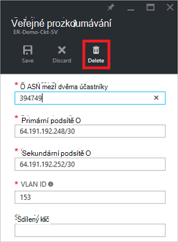

<properties
   pageTitle="Postup při konfiguraci směrování ExpressRoute okruhem pomocí portálu Azure | Microsoft Azure"
   description="Tento článek vás provede kroky pro vytváření a zřízení soukromé, veřejných a Microsoft prozkoumávání obvodu ExpressRoute. Tento článek taky uvidíte, jak chcete zkontrolovat stav, aktualizace nebo odstranění peerings vaše okruhem."
   documentationCenter="na"
   services="expressroute"
   authors="cherylmc"
   manager="carmonm"
   editor=""
   tags="azure-resource-manager"/>
<tags
   ms.service="expressroute"
   ms.devlang="na"
   ms.topic="hero-article" 
   ms.tgt_pltfrm="na"
   ms.workload="infrastructure-services"
   ms.date="10/10/2016"
   ms.author="cherylmc"/>

# Vytváření a změny směrování ExpressRoute okruhem

> [AZURE.SELECTOR]
[Azure portálu - správce prostředků](expressroute-howto-routing-portal-resource-manager.md)
[prostředí PowerShell – správce prostředků](expressroute-howto-routing-arm.md)
[prostředí PowerShell – klasické](expressroute-howto-routing-classic.md)

Tento článek vás provede kroky k vytváření a správě konfigurace směrování ExpressRoute okruhem pomocí portálu Azure a nasazení modelu správce prostředků.

**Modely Azure nasazení**

[AZURE.INCLUDE [vpn-gateway-clasic-rm](../../includes/vpn-gateway-classic-rm-include.md)] 

## Konfigurace požadavky

- Ujistěte se, že si přečtete stránce [požadavky](expressroute-prerequisites.md) , [směrování požadavky](expressroute-routing.md) stránkou a stránkou [pracovních postupů](expressroute-workflows.md) před zahájením konfigurace.
- Máte aktivní okruh ExpressRoute. Postupujte podle pokynů na téma [vytváření ExpressRoute obvodu](expressroute-howto-circuit-arm.md) a mít okruh povolit tak, že váš poskytovatel připojení před pokračováním. ExpressRoute okruhem musí být ve stavu zřizování a zapnutí abyste mohli spouštět rutiny píše níže.

Tyto pokyny platí pouze pro obvody vytvořená pomocí poskytovatelů služby nabízející služby připojení vrstvy 2. Pokud používáte poskytovatele služby nabízející spravovaných Layer 3 služeb (obvykle IPVPN, jako je MPLS), váš poskytovatel připojení konfigurovat a spravovat směrování za vás. 

>[AZURE.IMPORTANT] Jsme momentálně není uvedena peerings nakonfigurovaný tak, že poskytovatele služeb prostřednictvím portálu pro správu služby. Pracujeme na povolení této možnosti brzy bude k dispozici. U vašeho poskytovatele služeb před zkontrolujte konfigurace BGP peerings.

Můžete nakonfigurovat jedna, dvě nebo všechny tři peerings (Azure osobní, Azure veřejných a Microsoft) pro ExpressRoute okruh. Konfigurace peerings v pořadí, které zvolíte. Přesvědčte se, že dokončete konfiguraci peering postupně po jednom. 

## Azure soukromé prozkoumávání

Tato část obsahuje pokyny o tom, jak vytvořit, získáte, aktualizovat a odstraňovat Azure soukromé peering konfigurace ExpressRoute okruhem. 

### Vytvoření Azure soukromé prozkoumávání

1. ExpressRoute okruh. Ujistěte se, že obvod je plně zřízení poskytovatel připojení před pokračováním.

    

2. Konfigurace Azure soukromé prozkoumávání pro obvod. Zkontrolujte, jestli následující položky před pokračováním další kroky:

    - /30 podsítě primární odkazu. To nesmí být součástí všech adresní prostor rezervovaná virtuálních sítí.
    - /30 podsítě sekundární odkazu. To nesmí být součástí všech adresní prostor rezervovaná virtuálních sítí.
    - Platné ID VLAN stanovit prozkoumávání na. Zajistit, aby žádné další prozkoumávání v obvod používala stejné VLAN ID.
    - JAKO číslo prozkoumávání. Můžete použít 2bajtové a 4bajtový jako čísla. Můžete použít osobní jako číslo pro tento prozkoumávání. Ujistěte se, že nepoužíváte 65515.
    - Pokud se rozhodnete sdělit nám jednu hash MD5. **Toto je nepovinný krok**.

3. Vyberte Azure soukromé peering řádek, jak je ukázáno v následujícím příkladu.
    
    
    

4. Konfigurace soukromé prozkoumávání. Na následujícím obrázku vidíte příklad konfigurace.

    

    
5. Jakmile jste určili všechny parametry uložte konfiguraci. Po konfiguraci přijme úspěšně, zobrazí se něco podobného následujícím příkladu.

    
    

### Chcete-li zobrazit podrobnosti Azure prozkoumávání soukromé

Můžete zobrazit vlastnosti Azure soukromé prozkoumávání tak, že vyberete prozkoumávání.

### Chcete-li aktualizovat Azure soukromé konfigurace prozkoumávání

Můžete vybrat řádek pro prozkoumávání a upravit vlastnosti peering. 

### Chcete-li odstranit Azure soukromé prozkoumávání

Konfigurace peering můžete odebrat tak, že vyberete ikonu odstranit jak je ukázáno v následujícím příkladu.

## Azure veřejné prozkoumávání

Tato část obsahuje pokyny o tom, jak vytvořit, získáte, aktualizovat a odstraňovat Azure veřejné peering konfigurace ExpressRoute okruhem. 

### Vytvoření Azure veřejné prozkoumávání

1. ExpressRoute okruh. Ujistěte se, že obvod je plně zřízení poskytovatel připojení pokračujte dál.

    

2. Konfigurace Azure veřejné prozkoumávání pro obvod. Zkontrolujte, jestli následující položky před pokračováním další kroky:

    - /30 podsítě primární odkazu. 
    - /30 podsítě sekundární odkazu. 
    - Všechny adresy IP slouží k nastavení této prozkoumávání musí být platná veřejné adresy IPv4.
    - Platné ID VLAN stanovit prozkoumávání na. Zajistit, aby žádné další prozkoumávání v obvod používala stejné VLAN ID.
    - JAKO číslo prozkoumávání. Můžete použít 2bajtové a 4bajtový jako čísla.
    - Pokud se rozhodnete sdělit nám jednu hash MD5. **Toto je nepovinný krok**.

3. Vyberte Azure veřejné peering řádku, jak je ukázáno v následujícím příkladu.
    
    
    

4. Konfigurace veřejné prozkoumávání. Na následujícím obrázku vidíte příklad konfigurace.

    

    
5. Jakmile jste určili všechny parametry uložte konfiguraci. Po konfiguraci uživatel úspěšně přijal, zobrazí se něco podobného následujícím příkladu.

    
    

### Chcete-li zobrazit podrobnosti Azure prozkoumávání veřejné

Můžete zobrazit vlastnosti Azure veřejné prozkoumávání tak, že vyberete prozkoumávání.

### Chcete-li aktualizovat Azure veřejné konfigurace prozkoumávání

Můžete vybrat řádek pro prozkoumávání a upravit vlastnosti peering. 

### Chcete-li odstranit Azure veřejné prozkoumávání

Konfigurace peering můžete odebrat tak, že vyberete ikonu odstranit jak je ukázáno v následujícím příkladu.

## Prozkoumávání společnosti Microsoft

Tato část obsahuje pokyny o tom, jak vytvořit, získáte, aktualizovat a odstraňovat peering konfigurace Microsoft ExpressRoute okruhem. 

### Vytvoření prozkoumávání společnosti Microsoft

1. ExpressRoute okruh. Ujistěte se, že obvod je plně zřízení poskytovatel připojení pokračujte dál.

    

2. Konfigurace aplikace Microsoft prozkoumávání okruhem. Zkontrolujte, jestli tyto informace, než budete pokračovat.

    - /30 podsítě primární odkazu. Musí být platná veřejné IPv4 předponu vlastníte a registrován RIR / míra.výnosnosti.
    - /30 podsítě sekundární odkazu. Musí být platná veřejné IPv4 předponu vlastníte a registrován RIR / míra.výnosnosti.
    - Platné ID VLAN stanovit prozkoumávání na. Zajistit, aby žádné další prozkoumávání v obvod používala stejné VLAN ID.
    - JAKO číslo prozkoumávání. Můžete použít 2bajtové a 4bajtový jako čísla.
    - **Inzerovaných předpony:** Je nutné zadat seznam všech předpony, který budete chtít inzerce BGP relace. Přijaté jenom veřejné předpony adres IP. Pokud chcete odeslat sadu předpony, můžete mu poslat čárkou oddělený seznam. Tyto předpony musí registrované pro vás v RIR / míra.výnosnosti.
    - **Zákazníka ASN:** Pokud jste předpony zobrazování reklam, které nejsou registrované na prozkoumávání jako číslo, můžete zadat jako číslo, na které jsou registrované. **Toto je nepovinný krok**.
    - **Směrování název registru:** Můžete zadat RIR / míra.výnosnosti proti které AS jsou registrované číslo a předpony. **Toto je nepovinný krok.**
    - Algoritmus hash MD5, pokud se rozhodnete sdělit nám jednu. **Toto je nepovinný krok.**
    
3. Můžete vybrat prozkoumávání, kterou chcete konfigurovat, jak je ukázáno v následujícím příkladu. Vyberte řádek peering Microsoft.
    
    
    

4.  Konfigurace prozkoumávání Microsoft. Na následujícím obrázku vidíte příklad konfigurace.

    

    
5. Jakmile jste určili všechny parametry uložte konfiguraci. 

    Pokud bude vaše okruh ověření potřeby stavu (viz níže), musíte otevřít požadavek podpory můžete zobrazit doklad o vlastnictví předpony pro náš tým podpory.  
    
    

    Otevíráte požadavek podpory můžete přímo na portálu, jak je ukázáno v následujícím příkladu   
    
    

6. Po konfiguraci přijme úspěšně, zobrazí se něco podobného následujícím příkladu.

    
    

### Chcete-li zobrazit podrobnosti prozkoumávání společnosti Microsoft

Můžete zobrazit vlastnosti Azure veřejné prozkoumávání tak, že vyberete prozkoumávání.

### Aktualizaci Microsoft prozkoumávání konfigurace

Můžete vybrat řádek pro prozkoumávání a upravit vlastnosti peering. 

### Chcete-li odstranit prozkoumávání společnosti Microsoft

Konfigurace peering můžete odebrat tak, že vyberete ikonu odstranit jak je ukázáno v následujícím příkladu.

## Další kroky

Dalším krokem [odkaz VNet ExpressRoute obvodu](expressroute-howto-linkvnet-arm.md).

-  Další informace o pracovních postupech ExpressRoute najdete v článku [pracovní postupy ExpressRoute](expressroute-workflows.md).

-  Další informace o okruh prozkoumávání najdete v článku [ExpressRoute obvody a směrování domény](expressroute-circuit-peerings.md).

-  Další informace o práci s virtuálních sítí najdete v článku [Přehled virtuální sítě](../virtual-network/virtual-networks-overview.md).

