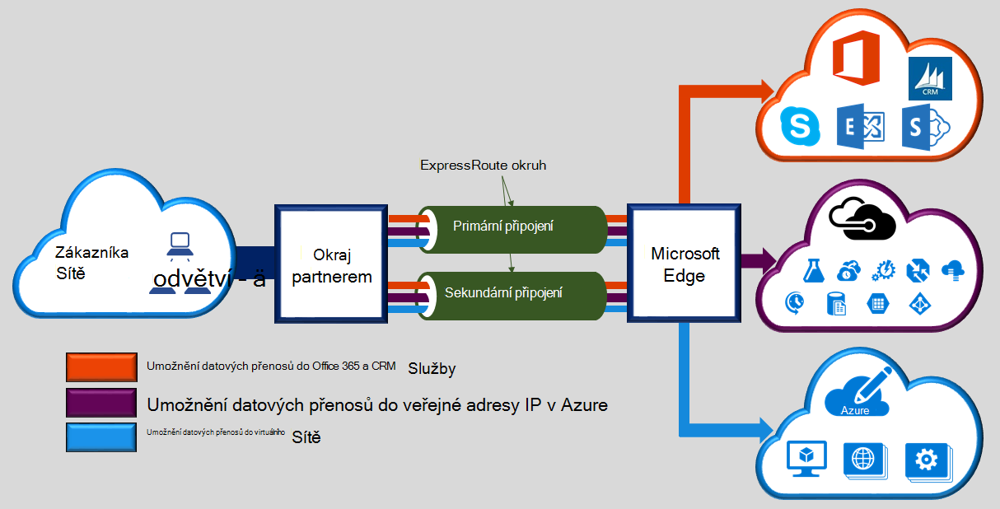
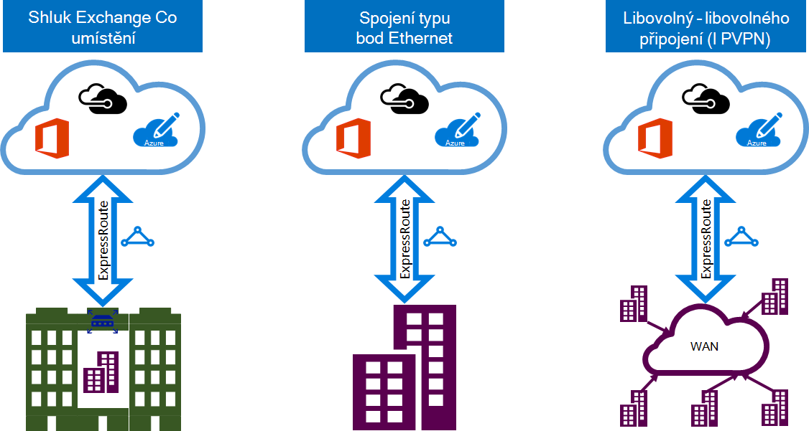

<properties 
   pageTitle="Úvod k ExpressRoute | Microsoft Azure"
   description="Tato stránka obsahuje základní informace o službě ExpressRoute, včetně fungování připojení ExpressRoute."
   documentationCenter="na"
   services="expressroute"
   authors="cherylmc"
   manager="carmonm"
   editor=""/>
<tags 
   ms.service="expressroute"
   ms.devlang="na"
   ms.topic="get-started-article" 
   ms.tgt_pltfrm="na"
   ms.workload="infrastructure-services" 
   ms.date="10/10/2016"
   ms.author="cherylmc"/>

# ExpressRoute technický přehled

Microsoft Azure ExpressRoute umožňuje rozšíření místních sítí do cloudu společnosti Microsoft přes vyhrazené soukromé připojení usnadnit poskytovatel připojení. S ExpressRoute můžete vytvořit připojení ke cloudovým službám společnosti Microsoft, jako je Microsoft Azure Office 365 a CRM Online. Připojení může být z libovolného libovolného sítě (IP VPN), v síti Ethernet bod k nebo virtuální křížově připojení prostřednictvím poskytovatele připojení v zařízení společné umístění. ExpressRoute připojení nepřekročí veřejné Internetu. Díky ExpressRoute připojení nabízet další spolehlivost rychlejší rychlosti, malá čekacích dob a vyšší zabezpečení než typický připojení přes Internet.

**Klíčové výhody patří:**

- Layer 3 propojení mezi místní síti a v cloudu společnosti Microsoft prostřednictvím poskytovatele připojení. Připojení možné z libovolného libovolného (IPVPN) síť, Ethernet spojení, nebo prostřednictvím virtuální křížově připojení přes Ethernet exchange.
- Připojení ke cloudovým službám společnosti Microsoft ve všech oblastech geopolitické oblasti.
- Globální připojení ke službám Microsoft přes všech oblastí s doplňkem premium ExpressRoute.
- Dynamické směrování mezi sítí a Microsoft pomocí standardních protokolů oborové (BGP).
- Předdefinované redundance v každé peering umístění vyšší spolehlivost.
- Připojení provozu [SLA](https://azure.microsoft.com/support/legal/sla/).
- QoS a podporu více tříd služby pro speciální aplikací, jako je Skype pro firmy.

V tématu [Nejčastější dotazy týkající se ExpressRoute](expressroute-faqs.md) pro další podrobnosti.

## Jak můžu připojit moji síť Microsoftu pomocí ExpressRoute?

Vytvoření připojení mezi místní síti a v cloudu společnosti Microsoft v třemi různými způsoby:

### Spoluvytváření umístěné v cloudu exchange

Sídlíte spoluvytváření v zařízení se serverem exchange cloudu, můžete objednejte virtuální křížově připojení ke cloudu společnosti Microsoft prostřednictvím poskytovatele společné umístění Ethernet exchange. Společné umístění poskytovatelů můžou nabízet vrstvy 2 křížově připojení nebo spravovaných Layer 3 křížově připojení mezi infrastrukturu ve funkci společné umístění a v cloudu společnosti Microsoft.

### Připojení pomocí Ethernet 

Místní datacentrech/poboček můžete připojit k v cloudu společnosti Microsoft prostřednictvím dvoustranných Ethernet propojení. Bod k Ethernet zprostředkovatelé můžou nabízet vrstvy 2 připojení nebo spravuje Layer 3 připojení mezi webem a v cloudu společnosti Microsoft.

### Libovolný – libovolného sítí (IPVPN)

Vaší sítě WAN můžete integrovat s v cloudu společnosti Microsoft. Poskytovatelé IPVPN (obvykle MPLS VPN) nabízejí libovolného libovolného propojení mezi pobočky a datacentrech. V cloudu společnosti Microsoft můžete být propojeny WAN aby vypadal stejně jako jakékoli jiné pobočce. Sítě WAN poskytovatelů obvykle nabízejí spravovaných připojení Layer 3. ExpressRoute funkce a funkce shodná všech ve všech výše uvedených modely služby připojení. 

Připojení poskytovatelů můžou nabízet jeden nebo více modely služby připojení. Můžete pracovat s poskytovatelem připojení vyberte model, který je pro vás nejlepší.

## Funkce ExpressRoute

ExpressRoute podporuje následující funkcí a možností: 

### Připojení Layer 3

Společnost Microsoft použije standardní dynamické směrování protokol BGP () na exchange přesměrovává mezi místním sítě, instancí v Azure a Microsoft veřejné adresy.  Můžeme vytvořit více relací BGP k síti profilů jiný přenos. Další informace najdete v článku [ExpressRoute obvodů a směrování domény](expressroute-circuit-peerings.md) .

### Zálohování

Každý ExpressRoute okruh sestává z dvě připojení dvěma směrovači okraj Microsoft Enterprise (MSEEs) od poskytovatele připojení / vaší sítě okraje. Microsoft budou vyžadovat duální připojení BGP od poskytovatele připojení / straně – jedno pro každé MSEE. Můžete rozhodnout nasazení nadbytečné zařízení / Ethernet obvodů vaší konci. Připojení poskytovatelů však použít nadbytečné zařízení zajistit, že připojení předána Microsoft nadbytečné způsobem. Konfigurace nadbytečné připojení Layer 3 je požadavek naše [SLA](https://azure.microsoft.com/support/legal/sla/) platit. 

### Připojení ke cloudovým službám společnosti Microsoft

[AZURE.INCLUDE [expressroute-office365-include](../../includes/expressroute-office365-include.md)]

ExpressRoute připojení povolení přístupu k následující služby:

- Služby Microsoft Azure
- Služby Microsoft Office 365
- Microsoft CRM Online služby 
 
Na stránce [Nejčastější dotazy týkající se ExpressRoute](expressroute-faqs.md) pro podrobný seznam služeb podporované přes ExpressRoute můžou navštívit.

### Připojení k všech oblastí v rámci geopolitické oblasti

Můžete připojit k aplikaci Microsoft v jednom z našich [prozkoumávání umístění](expressroute-locations.md) a mít taky přístup k všech oblastí v rámci oblasti geopolitické. 

Například pokud jste připojení k Microsoft v Amsterodamu prostřednictvím ExpressRoute, bude mít přístup ke všem službám Microsoft cloud použitý ve severní Evropy a západního Evropy. Přečtěte si [ExpressRoute partnery a prozkoumávání umístění](expressroute-locations.md) článek Přehled geopolitické oblastí, přidružené oblastí cloudu společnosti Microsoft a odpovídající ExpressRoute prozkoumávání umístění.

### Globální připojení s doplňkem ExpressRoute premium

Můžete povolit funkci ExpressRoute premium doplněk rozšiřte připojení přes geopolitické hranice. Například, pokud jste připojení k Microsoft v Amsterodamu prostřednictvím ExpressRoute, budete mít přístup ke všem službám společnosti Microsoft cloud hostované ve všech oblastech po celém světě (vnitrostátní mračnech vyloučíte). Můžete využít služby nasazenou v Jižní Americe nebo Austrálie stejným způsobem jako přejdete například do oblasti Severní a západní Europe.

### Ekosystému partnera připojení ve formátu RTF

ExpressRoute má stále narůstající ekosystému poskytovatelů připojení a partnerů SI. Můžete odkázat na článek [ExpressRoute poskytovatelů a umístění](expressroute-locations.md) nejnovější informace.

### Připojení k vnitrostátní mraky

Microsoft funguje izolace cloudu prostředí pro speciální geopolitické oblastí a segmenty zákazníků. Podívejte se na stránku [poskytovatelů ExpressRoute a umístění](expressroute-locations.md) pro seznam vnitrostátní mračnech a poskytovatelů.

### Možnosti podporované šířky pásma

Máte možnost si zakoupit obvody ExpressRoute pro široká škála rychlé sítě. Seznam podporovaných rychlé sítě je uvedená dole. Ujistěte se, obraťte se na svého poskytovatele připojení seznamu podporovaných rychlé sítě, které poskytují.

- 50 MB /
- 100 MB /
- 200 MB /
- 500 MB /
- 1 GB/s
- 2 GB/s
- 5 s technologií
- 10 GB/s

### Dynamická změna měřítka šířky pásma

Máte možnost zvětšení šířky pásma ExpressRoute elektrický obvod (na základě nejlepší plánování řízené úsilí) bez nutnosti byl připojení. 

### Flexibilní fakturační modely

Můžete vybrat fakturační modelu, který je pro vás nejlepší. Volba mezi fakturace modely vypsané dole. Podívejte se na stránku [Nejčastější dotazy týkající se ExpressRoute](expressroute-faqs.md) pro další podrobnosti. 

- **Neomezený data**. ExpressRoute okruh bude účtováno založené na měsíční poplatek a všechny příchozí a odchozí datové přenos je zahrnuta zdarma. 
- **Účtovaná podle objemu dat data**. ExpressRoute okruh bude účtováno podle měsíční poplatek. Přenos všechny příchozí dat je zdarma. Přenos odchozí dat bude účtováno cena za GB přenos dat. Kurzy přenos dat se liší podle oblasti.
- **ExpressRoute premium doplňku**. ExpressRoute premium je doplněk přes okruh ExpressRoute. Doplněk premium ExpressRoute poskytuje následující možnosti: 
    - Lepší směrování limity pro Azure veřejných a Azure soukromé prozkoumávání z 4 000 tras na 10 000 trasy.
    - Globální připojení služby. ExpressRoute okruhem vytvořené v jakékoli oblasti (s výjimkou vnitrostátní mračnech) bude mít přístup k zdrojů v jakékoli jiné oblasti na světě. Například virtuální sítě vytvořené v západní Evropy můžete k nim získat přístup prostřednictvím ExpressRoute okruh v křemíku sedla zřízení.
    - Vyšší počet VNet odkazy na okruh ExpressRoute z 10 větší omezení, v závislosti na šířku pásma obvodu.

## Další kroky

- Informace o připojení ExpressRoute a směrování domény. V tématu [ExpressRoute obvody a směrování domény](expressroute-circuit-peerings.md).
- Najděte poskytovatele služeb. V tématu [ExpressRoute partnery a prozkoumávání umístění](expressroute-locations.md).
- Ujistěte se, že jsou splněné všechny předpoklady. V tématu [požadavky ExpressRoute](expressroute-prerequisites.md).
- Podívejte se do požadavky pro [směrování](expressroute-routing.md), [překladu síťových adres](expressroute-nat.md) a [QoS](expressroute-qos.md).
- Konfigurace připojení k ExpressRoute.
    - [Vytvoření ExpressRoute okruh](expressroute-howto-circuit-classic.md)
    - [Konfigurace směrování](expressroute-howto-routing-classic.md)
    - [Odkaz VNet ExpressRoute obvodu](expressroute-howto-linkvnet-classic.md)
