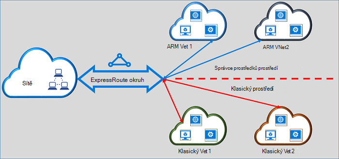

<properties
   pageTitle="Přesunutí ExpressRoute obvody od klasického správci zdrojů | Microsoft Azure"
   description="Tato stránka obsahuje Následuje přehled toho, co je potřeba vědět o přemostění klasickou a nasazení modelů správce prostředků."
   documentationCenter="na"
   services="expressroute"
   authors="ganesr"
   manager="carmonm"
   editor=""/>
<tags
   ms.service="expressroute"
   ms.devlang="na"
   ms.topic="get-started-article"
   ms.tgt_pltfrm="na"
   ms.workload="infrastructure-services"
   ms.date="10/10/2016"
   ms.author="ganesr"/>

# Přesunutí ExpressRoute obvody z klasickou nasazení modelu správce prostředků

Tento článek obsahuje přehled o co to znamená: přesunout Azure ExpressRoute okruh ze klasickou nasazení modelu správce prostředků Azure.

[AZURE.INCLUDE [vpn-gateway-sm-rm](../../includes/vpn-gateway-classic-rm-include.md)]

Můžete jeden okruhem ExpressRoute pro připojení k virtuální sítě, které jsou používaný v klasickou modelů nasazení Správce prostředků i. ExpressRoute obvodu, bez ohledu na to, jak je vytvořená, můžete teď propojit virtuálních sítí mezi oběma modely nasazení.

## Obvody ExpressRoute vytvořené v modelu klasické nasazení

Obvody ExpressRoute vytvořené v modelu klasické nasazení muset přesunout do modelu nasazení Správce prostředků nejprve povolit připojení k klasickou a nasazení modely správce prostředků. Není k dispozici ztrátě připojení nebo narušení při přesunutí připojení. Se zachovají všechna propojení okruh virtuální sítě v modelu klasické nasazení (v rámci stejného předplatného a křížově předplatné).

Po úspěšném dokončení přesunutí okruh ExpressRoute, provede a vypadá přesně ExpressRoute obvodu, který byl vytvořený v modelu nasazení Správce prostředků. Teď můžete vytvářet připojení, virtuální sítě v modelu nasazení Správce prostředků.

Po ExpressRoute okruhem byla přesunutá do modelu nasazení Správce prostředků můžete ovládat životního cyklu okruhem ExpressRoute jenom pomocí modelu nasazení Správce prostředků. To znamená, že můžete provádět operací, jako je přidání a aktualizace nebo odstranění peerings aktualizace vlastností elektrický obvod (třeba šířka pásma, SKU a fakturace typu) a odstranění obvody pouze v modelu nasazení Správce prostředků. Přečtěte si část pod na obvody vytvořené v modelu nasazení Správce prostředků další podrobnosti o jak se dá řídit přístup k oběma modely nasazení.

Nemáte zahrnují poskytovatele připojení k provedení přesunout.

## Obvody ExpressRoute vytvořené v modelu nasazení Správce prostředků

Můžete povolit obvody ExpressRoute vytvořené v modelu nasazení Správce prostředků aby byly přístupné z obou modelů nasazení. Všechny ExpressRoute okruh ve vašem předplatném může být užitečné k k nim získat přístup z obou modelů nasazení.

- Obvody ExpressRoute vytvořených v modelu nasazení Správce prostředků nemají přístup do klasického nasazení modelu ve výchozím nastavení.
- ExpressRoute obvody byl přesunut z modelu klasické nasazení do modelu nasazení Správce zdroje jsou přístupné z obou modelů nasazení ve výchozím nastavení.
- ExpressRoute okruhem vždy mají přístup k nasazení modelu správce prostředků, bez ohledu na to, zda byl vytvořen ve Správci zdrojů nebo klasická nasazení modelu. To znamená, že můžete vytvořit připojení, virtuální sítím vytvořeným následující pokyny [k propojení virtuální sítí](expressroute-howto-linkvnet-arm.md)v modelu nasazení Správce prostředků.
- Přístup k modelu klasické nasazení se řídí parametr **allowClassicOperations** v okruhem ExpressRoute.

>[AZURE.IMPORTANT] Všechny kvóty, které jsou popsány na stránce [služby omezení](../azure-subscription-service-limits.md) použití. Jako příklad standardní okruh mít maximálně 10 virtuální odkazy/připojení přes klasickou a nasazení modely správce prostředků.

## Řízení přístupu k modelu klasické nasazení

Můžete povolit jednoho okruh ExpressRoute propojíte virtuálních sítí v obou modelech nasazení nastavením **allowClassicOperations** parametru okruh ExpressRoute.

Nastavení **allowClassicOperations** na hodnotu TRUE umožňuje propojit virtuální sítě z obou nasazení modelů na okruh ExpressRoute. Virtuální sítě klasické nasazení modelu můžete propojit tak, že následující pokyny [k propojení virtuální sítí v modelu klasické nasazení](expressroute-howto-linkvnet-classic.md). Virtuální sítě nasazení modelu správce prostředků můžete propojit tak, že následující pokyny [k propojení virtuální sítí v modelu nasazení Správce prostředků](expressroute-howto-linkvnet-arm.md).

Nastavení **allowClassicOperations** FALSE bloků přístup obvod z modelu klasické nasazení. Však se zachovají všechna propojení virtuální sítě v modelu klasické nasazení. V tomto případě okruh ExpressRoute se nezobrazí v modelu klasické nasazení.

## Podporované operace v modelu klasické nasazení

Tyto operace klasické jsou podporovány na ExpressRoute okruh při **allowClassicOperations** je nastavena na TRUE:

 - Získání informací okruh ExpressRoute
 - Vytvoření, aktualizace nebo načtení nebo odstranění virtuální sítě odkazy na klasické virtuálních sítí
 - Vytvoření, aktualizace nebo načtení nebo odstranění virtuální sítě povolení odkaz pro připojení mezi předplatného

Tyto operace klasické nelze provést, když **allowClassicOperations** je nastavena na TRUE:

 - Vytvoření, aktualizace nebo načtení nebo odstranění ohraničení brány (BGP Protocol) peerings Azure osobní, Azure veřejnosti a peerings společnosti Microsoft
 - Odstranění ExpressRoute obvody

## Komunikace mezi klasickou a nasazení modely správce prostředků

ExpressRoute okruh funguje jako most mezi klasickou a nasazení modely správce prostředků. Komunikace mezi virtual machines ve virtuálních sítí v modelu klasické nasazení a můžou být ve virtuálních sítí toků správce prostředků nasazení modelu prostřednictvím ExpressRoute Pokud obou virtuální sítě jsou propojené s stejný obvod ExpressRoute.

Agregační výkon je omezen výkon objemu brány virtuální sítě. Přenosy nejsou zadány poskytovatel připojení sítě nebo vašich sítí v takovém případě. Přenos mezi virtuální sítě je plně obsažená v síti Microsoft.

## Přístup k Azure veřejných a zdroje prozkoumávání společnosti Microsoft

Můžete získat přístup k prostředky, které jsou obvykle přístupných osobám s postižením prostřednictvím Azure veřejné prozkoumávání a Microsoft prozkoumávání bez narušení.  

## Co bude podporované

Tato část popisuje, co bude podporované pro ExpressRoute obvody:

 - Můžete jeden okruh ExpressRoute pro přístup k virtuální sítě, které jsou nasazenou v klasickou a nasazení modelů správce prostředků.
 - ExpressRoute okruh z klasickou můžete přesunout do modelu nasazení Správce prostředků. Po přesunutí okruhem ExpressRoute vypadá, je a provede jako jakékoli jiné elektrický obvod ExpressRoute vytvořenou v modelu nasazení Správce prostředků.
 - Můžete přesouvat pouze okruh ExpressRoute. Okruh odkazy, virtuálních sítí a bran VPN nejdou přesouvat prostřednictvím operaci.
 - Po ExpressRoute okruhem byla přesunutá do modelu nasazení Správce prostředků můžete ovládat životního cyklu okruhem ExpressRoute jenom pomocí modelu nasazení Správce prostředků. To znamená, že můžete provádět operací, jako je přidání a aktualizace nebo odstranění peerings aktualizace vlastností elektrický obvod (třeba šířka pásma, SKU a fakturace typu) a odstranění obvody pouze v modelu nasazení Správce prostředků.
 - ExpressRoute okruh funguje jako most mezi klasickou a nasazení modely správce prostředků. Komunikace mezi virtual machines ve virtuálních sítí v modelu klasické nasazení a můžou být ve virtuálních sítí toků správce prostředků nasazení modelu prostřednictvím ExpressRoute Pokud obou virtuální sítě jsou propojené s stejný obvod ExpressRoute.
 - Připojení mezi předplatné je podporované v klasickou a nasazení modely správce prostředků.

## Co se nepodporuje

Tato část popisuje, co se nepodporuje pro ExpressRoute obvody:

 - Přesunutí odkazy okruh brány a virtuální sítí klasickou nasazení modelu správce prostředků.
 - Správa životního cyklu obvodu ExpressRoute z modelu klasické nasazení.
 - Na základě rolí řízení přístupu (RBAC) Podpora modelu klasické nasazení. Ovládací prvky RBAC okruh nelze provést v modelu klasické nasazení. Všechny správce/coadministrator předplatné nebo můžete propojení zrušit virtuální sítí obvod.

## Konfigurace

Postupujte podle pokynů, které jsou popsané v [Přesunutí ExpressRoute okruh od klasického nasazení modelu správce prostředků](expressroute-howto-move-arm.md).

## Další kroky

- Informace o pracovním postupu najdete v článku [ExpressRoute okruh zřizování stavy obvodu a pracovní postupy](expressroute-workflows.md).
- Konfigurace připojení k ExpressRoute:

    - [Vytvoření ExpressRoute okruh](expressroute-howto-circuit-arm.md)
    - [Konfigurace směrování](expressroute-howto-routing-arm.md)
    - [Odkaz na ExpressRoute okruh virtuální sítě](expressroute-howto-linkvnet-arm.md)
