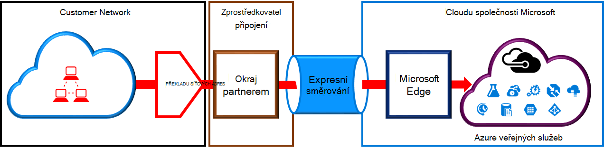
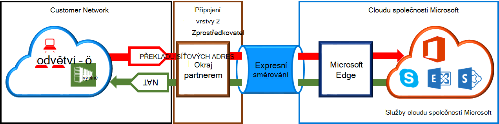

<properties
   pageTitle="Požadavky na překladu síťových adres pro ExpressRoute obvody | Microsoft Azure"
   description="Tato stránka obsahuje podrobné požadavky pro konfiguraci a správě překladu síťových adres ExpressRoute obvody."
   documentationCenter="na"
   services="expressroute"
   authors="cherylmc"
   manager="carmonm"
   editor=""/>
<tags
   ms.service="expressroute"
   ms.devlang="na"
   ms.topic="get-started-article"
   ms.tgt_pltfrm="na"
   ms.workload="infrastructure-services"
   ms.date="10/10/2016"
   ms.author="cherylmc"/>

# Požadavky na ExpressRoute překladu síťových adres

Pokud chcete připojit ke cloudovým službám společnosti Microsoft pomocí ExpressRoute, musíte nastavit a spravovat dále. Někteří poskytovatelé připojení nabízejí nastavení a správě překladu síťových adres jako služba spravovaných. Obraťte se na svého poskytovatele připojení a zjistěte, pokud je tato služba. V opačném případě musí odpovídat požadavkům píše níže. 

Zkontrolujte stránku [ExpressRoute obvody a směrování domén](expressroute-circuit-peerings.md) a získejte přehled různých směrování domén. Požadavkům na veřejnou IP adresu pro Azure veřejné a Microsoft prozkoumávání, doporučujeme nastavení překladu síťových adres mezi vaší sítě a společnosti Microsoft. Tato část obsahuje podrobný popis infrastruktury překladu síťových adres, které chcete nastavit.

## Požadavky na překladu síťových adres pro Azure veřejné prozkoumávání

Azure veřejné peering cestu umožňuje připojit se ke všem službám hostované v Azure nad jejich veřejnou IP adres. Jedná se o uvedené v [Nejčastější dotazy týkající se ExpessRoute](expressroute-faqs.md) a všechny služby hostované pomocí tvůrce programů na Microsoft Azure. Připojení ke službám Microsoft Azure na veřejné prozkoumávání je vždy, které iniciuje ze sítě do sítě Microsoft. Přenosy určené k Microsoft Azure na veřejné prozkoumávání musí být SNATed platné veřejné adresy IPv4 před připojením Microsoft sítě. Následující obrázek poskytuje uceleném vzhledu Převaděč může být nastavení až splňují požadavek na výše.

 

### Inzerce fondu a postup překladu síťových adres IP

Ujistěte se, že přenosy zadávání Azure veřejné peering cestu s platnou veřejné adresy IPv4. Microsoft musíte mít k ověření vlastnictví fondu překladu síťových adres protokolu IPv4 adres proti místní směrování registru Internetu (RIR) nebo k Internetu směrování registru (míra.výnosnosti). Kontrola proběhne na základě číslo jako peered s a IP adres pro NAT Odkaz na stránku [směrování požadavky ExpressRoute](expressroute-routing.md) pro informace o směrování Registry.
 
Neplatí žádná omezení délce předponou překladu síťových adres IP nabízené prostřednictvím tohoto prozkoumávání. Musíte sledovat fondu překladu síťových adres a ujistěte se, že nejsou omezeny překladu síťových adres relací.

>[AZURE.IMPORTANT] Fond překladu síťových adres IP oznámení Microsoft nesmí být oznámení na Internetu. To přeruší připojení k další služby od Microsoftu.

## Požadavky pro Microsoft prozkoumávání překladu síťových adres

Cesta peering Microsoft umožňuje připojit se ke cloudovým službám společnosti Microsoft, které nejsou podporovány Azure veřejné peering cestu. Seznam služeb obsahuje služby Office 365, například Exchange Online, SharePoint Online Skype pro firmy a CRM Online. Microsoft očekává podporují obousměrné připojení na prozkoumávání Microsoft. Přenosy určené ke službě Microsoft cloud services musí být SNATed platné veřejné adresy IPv4 před připojením sítě Microsoft. Přenosy určené k síti ze služby Microsoft cloud services musí být SNATed před připojením sítě. Následující obrázek poskytuje uceleném vzhledu Převaděč jak mají být nastavení pro aplikaci Microsoft prozkoumávání.
 
 

#### Přenos pocházející z vaší sítě určené společnosti Microsoft

- Ujistěte se, že přenosy zadávání Microsoft peering cestu s platnou veřejná adresa IPv4. Microsoft musíte mít k ověření vlastníka fondu překladu síťových adres protokolu IPv4 adres proti místní směrování internetových registru systému (RIR) nebo k Internetu směrování registru (míra.výnosnosti). Kontrola proběhne na základě číslo jako peered s a IP adres pro NAT Odkaz na stránku [směrování požadavky ExpressRoute](expressroute-routing.md) pro informace o směrování Registry.

- IP adresy používané Azure veřejné peering instalačního programu a jiných ExpressRoute obvody nesmí nabízené společnosti Microsoft prostřednictvím BGP relace. Neexistuje žádné omezení délky předponou překladu síťových adres IP nabízené prostřednictvím tohoto prozkoumávání.

    >[AZURE.IMPORTANT] Fond překladu síťových adres IP oznámení Microsoft nesmí být oznámení na Internetu. To přeruší připojení k další služby od Microsoftu.

#### Přenos pocházející z Microsoft určené k síti

- Některé scénáře vyžadují Microsoft zahajte připojení k koncové body služby hostovaný ve vaší síti. Typický příklad scénáře, měl by připojení k servery služby AD FS použitý ve vaší síti z Office 365. V takovém případě musí proniknout odpovídající předpony ze sítě do Microsoft prozkoumávání. 

- Musíte SNAT přenosy určené k IP adrese ve vaší síti od Microsoftu. 

## Další kroky

- Podívejte se do požadavky pro [směrování](expressroute-routing.md) a [QoS](expressroute-qos.md).
- Informace o pracovním postupu najdete v článku [ExpressRoute okruh zřizování stavy obvodu a pracovní postupy](expressroute-workflows.md).
- Konfigurace připojení k ExpressRoute.

    - [Vytvoření ExpressRoute okruh](expressroute-howto-circuit-classic.md)
    - [Konfigurace směrování](expressroute-howto-routing-classic.md)
    - [Odkaz VNet ExpressRoute obvodu](expressroute-howto-linkvnet-classic.md)

