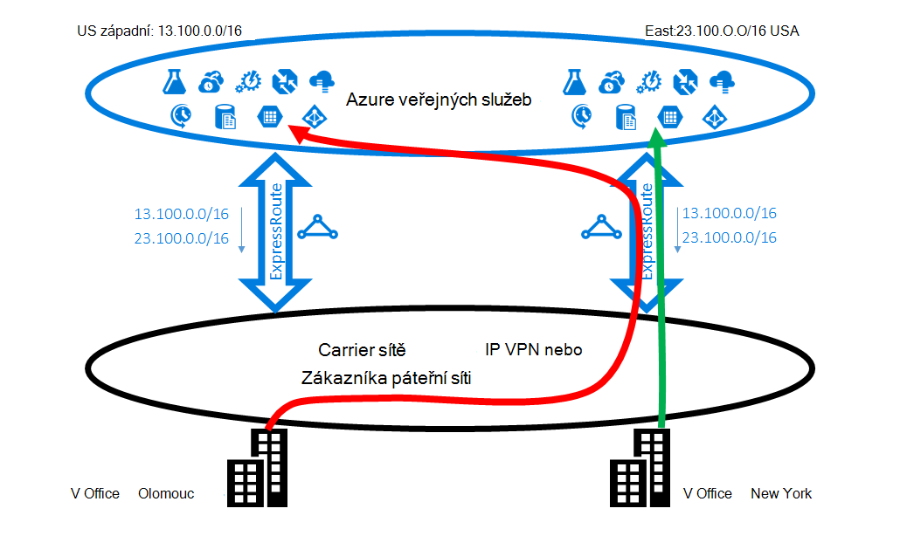
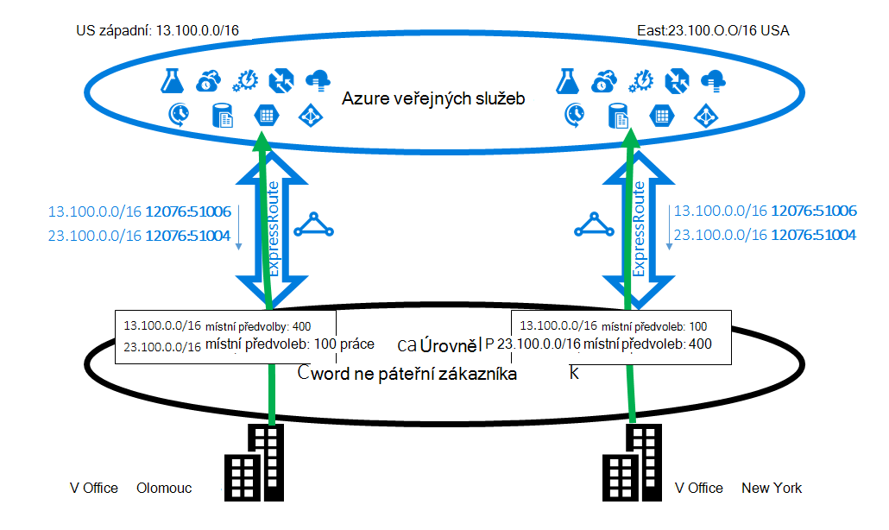
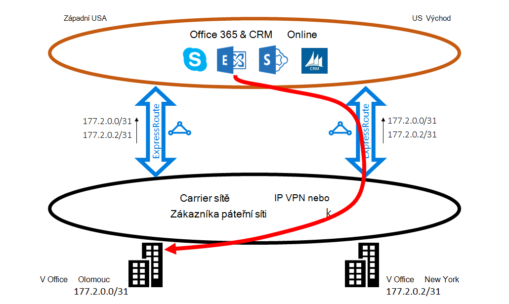
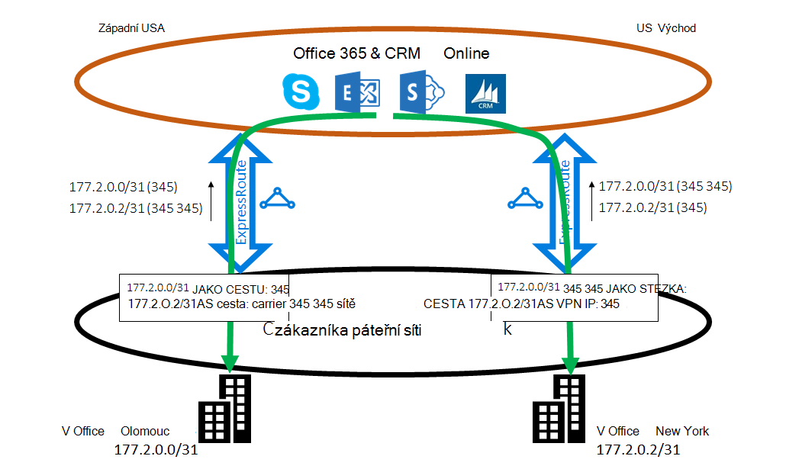

<properties
   pageTitle="Optimalizace směrování ExpressRoute | Microsoft Azure"
   description="Tato stránka obsahuje podrobnosti o tom, jak optimalizovat směrování po zákazníka více než jedno ExpressRoute obvody připojení mezi Microsoft a síti corp zákazníka."
   documentationCenter="na"
   services="expressroute"
   authors="charwen"
   manager="carmonm"
   editor=""/>
<tags
   ms.service="expressroute"
   ms.devlang="na"
   ms.topic="get-started-article"
   ms.tgt_pltfrm="na"
   ms.workload="infrastructure-services"
   ms.date="10/10/2016"
   ms.author="charwen"/>

# Optimalizace ExpressRoute směrování
Pokud máte víc obvody ExpressRoute, máte více než jednu cestu k připojení k Microsoft. V důsledku toho nepřesnými směrování dochází – to znamená přenosy pro vaši může trvat delší cestu kontaktovat Microsoft a Microsoft k síti. Čím delší cestu síť, vyšší latence. Latence má přímé dopad na výkon a uživatelské prostředí aplikace. Tento článek ilustrují potíže a je vysvětleno, jak optimalizovat směrování technologie standardní směrování.

## Nepřesnými směrování případ 1
Podívejme se zavřít na směrování problém v příkladu. Představte si, že máte dvě kanceláří ve Spojených státech a jeden v jedné v New York a Los Angeles. Vaší kanceláře připojeni na široké oblasti sítě WAN, což může být páteřní síť nebo VPN IP poskytovatele služeb. Máte dvě obvody ExpressRoute, v nám západní a jednu nám východě, které jsou také připojené v síti WAN. Očividně máte dvě cesty k připojení k síti Microsoft. Teď si představte, máte Azure nasazení (například aplikaci služby Azure) v nám západní a východního USA. Svůj úmysl je připojit uživatele v Los Angeles západní nám Azure a uživatelé v New Yorku východ nám Azure, protože správce služeb oznamuje, že v jednotlivých office uživatelé blízké Azure služby pro optimální prostředí. Bohužel plán označené jako pracuje dobře uživatelům východ pobřeží, ale ne pro uživatele západní pobřeží. Příčinu problému je následující. Na každý okruh ExpressRoute jsme přístupné pro vás předponu v Azure nám východ (23.100.0.0/16) a předponu v Azure nám západní (13.100.0.0/16). Pokud nevíte, jaký předponu pochází z které oblasti, nejste schopni zacházet s odlišným chováním. Sítě WAN si myslet, že předpon blíže k nám východ než námi západní i proto směrovat okruh ExpressRoute nám východě oba uživatele office. V databázi máte hodně Nešťastný uživatelů v office Los Angeles.

### Řešení: použijte BGP komunit
Optimalizovat směrování pro oba uživatelé office, musíte vědět, které předpona západ Azure cz a které z východu Azure cz. Tyto informace jsme kódovat [BGP komunity](expressroute-routing.md)hodnotami. Na každou Azure oblast, například "12076:51004" pro cz východ, "12076:51006" pro cz západní jsme přidáte jedinečnou hodnotu BGP komunity. Teď když víte, které předponu pochází z které Azure oblasti, můžete nakonfigurovat, které ExpressRoute okruh by měl být preferovaný. Protože používáme BGP na exchange směrování informace, můžete ovlivnit směrování místní předvoleb BGP společnosti. V našem příkladu je můžete přiřadit hodnotu vyšší místní předvoleb 13.100.0.0/16 v nám západní než námi východě a podobně hodnotu vyšší místní předvoleb 23.100.0.0/16 nám východě než v západní US. Tuto konfiguraci zajistí, že existenci obou cesty pro Microsoft uživatelů v Los Angeles bude mít okruh ExpressRoute západní nám se připojit k západní Azure nám že uživatelů v New Yorku ExpressRoute nám východě východ nám Azure. Směrování optimalizován po obou stranách. 

## Nepřesnými směrování případ 2
Tady máme jiný příklad kde připojení od Microsoftu trvat delší cestu k vaší sítě. V tomto případě použít místní servery Exchange a Exchange Online v [hybridním prostředí](https://technet.microsoft.com/library/jj200581%28v=exchg.150%29.aspx). Vaší kanceláře připojení k síti WAN. Přístupné předpony místní servery v obou pobočky společnosti Microsoft prostřednictvím dva obvody ExpressRoute. Exchange Online zahájí připojení k místní servery v případech, například Migrace poštovních schránek. Bohužel směrován připojení k office Los Angeles obvodu ExpressRoute nám východě před přecházení celý kontinentu zpět do západní pobřeží. Příčinu problému se podobá první z nich. Bez jakékoli tip Microsoft network neumí určit, které zákazníka předponu je tomu vašemu nejbližší nám východ a který z nich je tomu vašemu nejbližší západní US. Se to děje vybrat nesprávný cestu k pobočce v Los Angeles.

### Řešení: použijte prepending jako cesta
Existují dva způsoby řešení problému. První z nich je jednoduše inzerce místní předpony pro office Los Angeles 177.2.0.0/31 na okruh ExpressRoute v nám západ a vaší místní předpony pro New York office 177.2.0.2/31 na okruh ExpressRoute východě US. Výsledkem je pouze jeden cesta k připojení k jednotlivé pobočky společnosti Microsoft. Existuje nejednoznačnosti a směrování optimalizován. Návrh budete muset myslete strategie překlopení. V případě, že je tato cesta společnosti Microsoft prostřednictvím ExpressRoute nefunkční, budete muset Ujistěte se, že Exchange Online se mohou připojit k místní servery. 

Druhá řešením je, že nadále inzerce obě předpony na obou ExpressRoute obvody a kromě toho, které nám dáte tip které předponu je tomu vašemu nejbližší který z nich pobočky. Protože podporujeme prepending BGP jako cesty, můžete nakonfigurovat cestu AS pro vaše předponu k ovlivnění směrování. V tomto příkladu můžete prodloužit cesta AS pro 172.2.0.0/31 cz východě tak, aby jsme bude raději elektrický obvod ExpressRoute v cz západní přenosy určené pro tento prefix (jak naší síti se myslíte, že cesta k tuto předponu je kratší v západ). JAKO CESTU k 172.2.0.2/31 v nám západní můžete podobně prodloužíte tak, aby jsme budete raději okruh ExpressRoute nám východě. Směrování je optimalizována pro obě poboček. Návrh Pokud jeden okruh ExpressRoute je poškozený, Exchange Online můžete dostat můžete pomocí jiného ExpressRoute obvodů a vaší sítě WAN. 

>[AZURE.IMPORTANT] Odebrání soukromé jako čísla v parametru PATH AS pro předpony dostali na Microsoft Peering. Budete muset přidat veřejné jako čísla jako cesta k ovlivnění směrování Microsoft Peering.

>[AZURE.IMPORTANT] Když zde uvedené příklady Microsoft a veřejné peerings, podporujeme stejné možnosti pro soukromé prozkoumávání. Také jako cesta prepending funguje v rámci jedné jednoho okruh ExpressRoute ovlivnit výběr primárního a sekundárního cesty.
