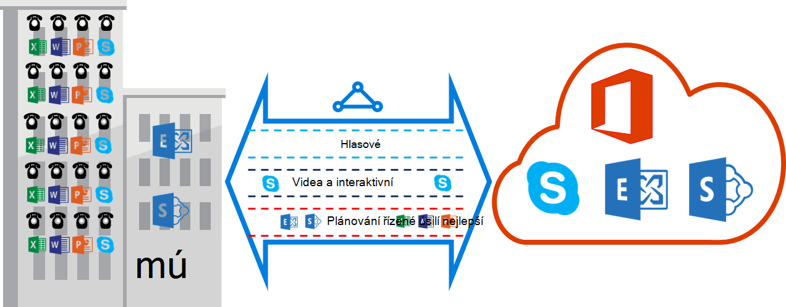

<properties
   pageTitle="Požadavky na QoS pro ExpressRoute | Microsoft Azure"
   description="Tato stránka obsahuje podrobné požadavky pro konfiguraci a správě QoS ExpressRoute obvody."
   documentationCenter="na"
   services="expressroute"
   authors="cherylmc"
   manager="carmonm"
   editor=""/>
<tags
   ms.service="expressroute"
   ms.devlang="na"
   ms.topic="get-started-article"
   ms.tgt_pltfrm="na"
   ms.workload="infrastructure-services"
   ms.date="10/10/2016"
   ms.author="cherylmc"/>

# ExpressRoute QoS požadavky

Skype pro firmy má různých úloh, které vyžadují zpracování odlišné QoS. Pokud plánujete využívat hlasové služby prostřednictvím ExpressRoute, měli byste dodržovat požadavky píše níže.

>[AZURE.NOTE] QoS požadavky se vztahují k aplikaci Microsoft prozkoumávání jenom. Hodnoty DSCP do dostali na Azure veřejné prozkoumávání a Azure soukromé prozkoumávání přenosy v síti, nastaví se na hodnotu 0. 

Následující tabulka obsahuje seznam označení DSCP používat Skype pro firmy. Další informace naleznete v [Správa QoS pro Skype pro firmy](https://technet.microsoft.com/library/gg405409.aspx) .

| **Přenosy třídy** | **Zpracování (označení DSCP)** | **Skype pro firmy úloh** |
|---|---|---|
| **Hlasové** | EF (46) | Skype nebo Lync hlasové |
| **Interaktivní** | AF41 (34) | Video |
|   | AF21 (18) | Sdílení aplikace | 
| **Výchozí** | AF11 (10) | Přenos souborů|
|   | CS0 (0) | Cokoli jiného| 

- Měli byste klasifikovat pracovního vytížení a označit správné hodnoty DSCP. Postupujte podle pokynů [v tomto poli](https://technet.microsoft.com/library/gg405409.aspx) o tom, jak nastavit označení DSCP v síti.

- Měli byste konfigurace a podporu více fronty QoS ve vaší síti. Hlasové musí se jednat o samostatný třídu a přijímání pozornost EF podle RFC 3246. 

- Můžete se rozhodnout, fronty mechanismus, přetížení zjišťování zásad a přidělení šířky pásma za přenosy předmětu. Ale označení pro Skype pro firmy úloh DSCP musí být zachovány. Pokud používáte označení DSCP není uvedená výše, například AF31 (26), je třeba přepsat tuto hodnotu DSCP 0 před odesláním paketu společnosti Microsoft. Microsoft pouze odešle pakety označené DSCP hodnotu uvedenou v výše uvedenou tabulku. 

## Další kroky

- Podívejte se do požadavky pro [směrování](expressroute-routing.md) a [překladu síťových adres](expressroute-nat.md).
- V následujících tématech Konfigurace ExpressRoute připojení.

    - [Vytvoření ExpressRoute okruh](expressroute-howto-circuit-classic.md)
    - [Konfigurace směrování](expressroute-howto-routing-classic.md)
    - [Odkaz VNet ExpressRoute obvodu](expressroute-howto-linkvnet-classic.md)
