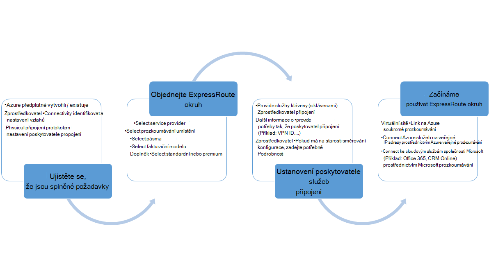
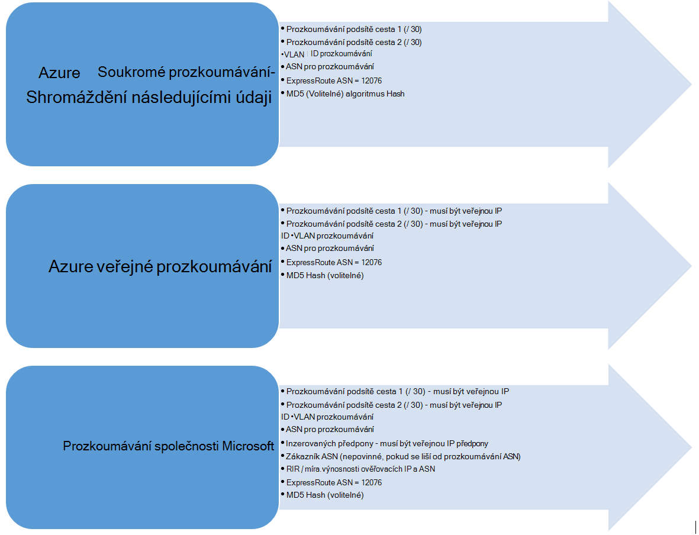

<properties
   pageTitle="Pracovní postupy pro konfiguraci ExpressRoute okruh | Microsoft Azure"
   description="Tato stránka vás provede pracovní postupy pro konfiguraci ExpressRoute obvodů a peerings"
   documentationCenter="na"
   services="expressroute"
   authors="cherylmc"
   manager="carmonm"
   editor="" />
<tags
   ms.service="expressroute"
   ms.devlang="na"
   ms.topic="article" 
   ms.tgt_pltfrm="na"
   ms.workload="infrastructure-services"
   ms.date="10/10/2016"
   ms.author="cherylmc"/>

# Pracovní postupy ExpressRoute pro zřizování obvodu a okruh státy

Tato stránka vás provede službu Směrování konfigurace pracovní postupy na nejvyšší úrovni a zřízení.

Na následujícím obrázku a odpovídající kroky zobrazit úkoly, které je potřeba provést pro ExpressRoute okruh zřízení začátku do konce. 

1. Použití Powershellu ke okruh ExpressRoute. Postupujte podle pokynů v článku [Vytvoření ExpressRoute obvody](expressroute-howto-circuit-classic.md) další podrobnosti.

2. Objednejte připojení od poskytovatele služeb. Tento proces se liší. Další informace o tom, jak řadit připojení obraťte na poskytovatele připojení.

3. Ujistěte se, že obvod byla zajištěna úspěšně ověřením okruh ExpressRoute zřizování stav prostřednictvím Powershellu. 

4. Konfigurace směrování domén. Pokud váš poskytovatel připojení spravuje Layer 3 za vás, budou nastaví její konfiguraci směrování vaší okruhem. Pokud váš poskytovatel připojení jenom nabízí vrstvy 2 služby, musíte nakonfigurovat směrování podle pokynů podle [směrování požadavky](expressroute-routing.md) a [konfiguraci směrování](expressroute-howto-routing-classic.md) stránky.

    -  Povolení Azure soukromé prozkoumávání: je třeba povolit prozkoumávání k připojení k VMs / cloudových služeb nasazené v rámci virtuální sítí.
    -  Povolení Azure veřejné prozkoumávání: je třeba povolit Azure veřejné prozkoumávání Pokud se chcete připojit k Azure služeb hostovaných na veřejnou IP adres. Toto je žádost o přístup k Azure zdrojů, pokud jste vybrali Povolit výchozí směrování Azure prozkoumávání soukromé.
    -  Povolení prozkoumávání Microsoft – je nutné jej povolit přístup k Office 365 a CRM online službám. 
    
    >[AZURE.IMPORTANT] Musíte se ujistit, že používáte samostatné proxy / okraje pro připojení k Microsoft než ten můžete použít k Internetu. Používat stejný okraj ExpressRoute a Internet způsobit asymetrické směrování a způsobit výpadků připojení k síti.

    

5. Propojení virtuální sítě pro ExpressRoute obvody – můžete propojit virtuálních sítí ExpressRoute okruhem. Podle pokynů [k propojení VNets](expressroute-howto-linkvnet-arm.md) vaše okruh. Tyto VNets mohou být v rámci stejného předplatného Azure jako okruh ExpressRoute nebo může být v jiné předplatné.

## ExpressRoute okruh zřizování státy

Každý ExpressRoute okruh má dvě stavy:

- Zřizovací stavu poskytovatele služby
- Stav

Stav znázorňuje stav zřizovací společnosti Microsoft. Tato vlastnost je nastavena na povoleno při vytváření Expressroute okruh

Stav připojení poskytovatele zřizovací znázorňuje stav na straně poskytovatel připojení. Může být buď *NotProvisioned*, *Provisioning*nebo *Provisioned*. ExpressRoute okruh musí být ve stavu Provisioned chcete ho používat.

### Možné stavy obvodu ExpressRoute

Tato část uvádí, možné stavy ExpressRoute okruhem.

#### Na údaje o času vytvoření

Zobrazí se okruh ExpressRoute v tomto stavu hned, jak spouštět rutiny prostředí PowerShell vytvořit okruh ExpressRoute.

    ServiceProviderProvisioningState : NotProvisioned
    Status                           : Enabled

#### Po připojení poskytovatel ho právě zřizujete obvod

Uvidíte okruh ExpressRoute v tomto stavu hned předejte klíč služby poskytovatelem připojení a začínaly zřizovací obrázku.

    ServiceProviderProvisioningState : Provisioning
    Status                           : Enabled

#### Když připojení poskytovatele dokončení zřizovací

Zobrazí se okruh ExpressRoute v tomto stavu hned připojení poskytovatele dokončení zřizovací.

    ServiceProviderProvisioningState : Provisioned
    Status                           : Enabled

Zřízení a zpřístupnit je, že pro vás nebudou moct používat ji může být v stavu pouze obvod. Pokud používáte zprostředkovatele vrstvy 2, můžete nakonfigurovat směrování pro vaše okruh pouze v případě, že je v tomto stavu.

#### Pokud je připojení poskytovatele zrušení zajišťování obvod

Požádání poskytovateli služeb deprovision okruhem ExpressRoute uvidíte okruhem nastaven do stavu následující po dokončení procesu deprovisioning poskytovatele služeb.

    ServiceProviderProvisioningState : NotProvisioned
    Status                           : Enabled

Je možné jej znovu povolit Pokud potřeby nebo spouštět rutiny prostředí PowerShell odstranit obvod.  

>[AZURE.IMPORTANT] Pokud spustíte rutiny prostředí PowerShell odstranění okruh když zřizujete ServiceProviderProvisioningState nebo Provisioned se nezdaří. Prosím pracovat s poskytovatele připojení k deprovision okruh ExpressRoute nejdřív a potom odstraňte obvod. Microsoft bude dál k fakturování obvod, dokud spouštět rutiny prostředí PowerShell odstranit obvod.

## Směrování stav konfigurace relace

BGP zřizujete stavu můžete zjistit, zda v Microsoft edge byla povolena BGP relace. Stav musí být povolené na vám nebudou moct používat prozkoumávání.

Je třeba zkontrolovat stav relace BGP zejména u prozkoumávání Microsoft. Kromě BGP zřizujete stavu je jiný stav s názvem *inzerovaných veřejné předpony stavu*. Stav inzerovaný veřejné předpony musí být v *nakonfigurované* stavu, jak pro BGP relace, která má být nahoru a směrování práce začátku do konce. 

Pokud stavu *ověření potřeby* je nastaven stav inzerovaný veřejné předponu, BGP relace neaktivní, jak inzerovaný předpony neshoduje čísla jako v některém z směrování Registry. 

>[AZURE.IMPORTANT] V případě stavu inzerovaný veřejné předpony probíhá *Ruční ověření* stavu, musíte otevřít požadavek podpory můžete s [podporou společnosti Microsoft](https://portal.azure.com/?#blade/Microsoft_Azure_Support/HelpAndSupportBlade) a prokázat, že jste majiteli IP adresy inzerovaných podél přidružené číslem samostatného systému.

## Další kroky

- Konfigurace připojení k ExpressRoute.

    - [Vytvoření ExpressRoute okruh](expressroute-howto-circuit-arm.md)
    - [Konfigurace směrování](expressroute-howto-routing-arm.md)
    - [Odkaz VNet ExpressRoute obvodu](expressroute-howto-linkvnet-arm.md)
