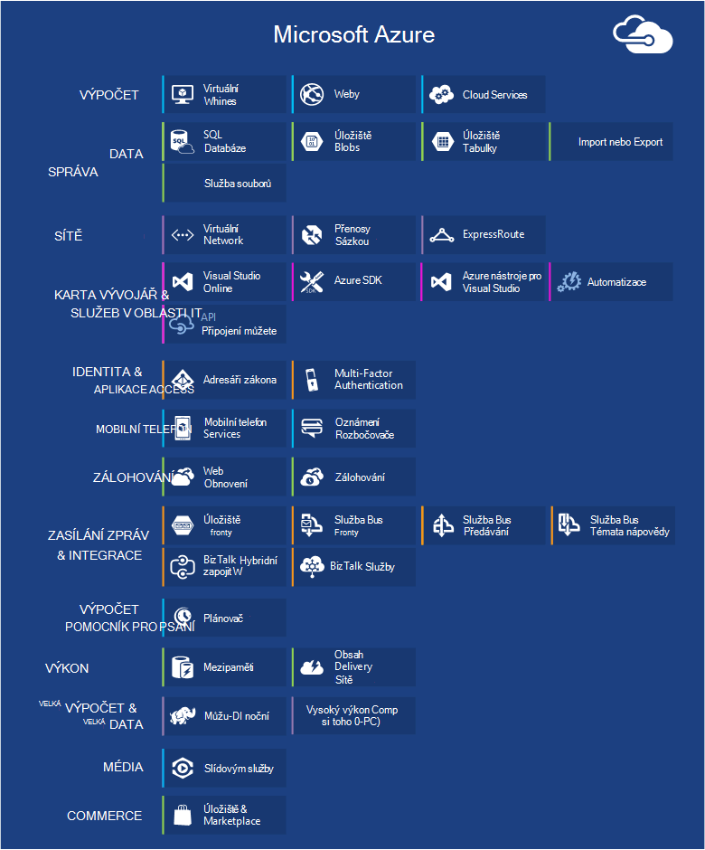
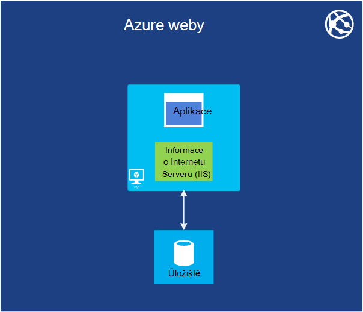

<properties
    pageTitle="Úvod k Microsoft Azure | Microsoft Azure"
    description="Začínáte s Microsoft Azure? Získat základní přehled služeb nabízí s příklady v čem se užitečné."
    services=" "
    documentationCenter=".net"
    authors="rboucher"
    manager="carolz"
    editor=""/>

<tags
    ms.service="multiple"
    ms.workload="multiple"
    ms.tgt_pltfrm="na"
    ms.devlang="na"
    ms.topic="article"
    ms.date="06/30/2015"  
    ms.author="robb"/>

# Představení Microsoft Azure

Microsoft Azure je platformy pro aplikace společnosti Microsoft pro veřejné cloudu.  Hledání v tomto článku se vám základ pro Principy základy Azure, i když neznáte jakékoli okolnosti související cloudu výpočetních.

**Jak se v tomto článku**

Azure roste vždycky, takže můžete snadno získat přetížený.  Spuštění služby základní, které jsou uvedené nejprve v tomto článku a přejděte k dalším službám. Které neznamená nelze použít jenom dalších službách samostatně, ale služby základní tvoří základní aplikace spuštěné v Azure.

**Váš názor**

Váš názor je důležité. Tento článek by vám měl dát efektivní přehled Azure. Pokud ne, námi o to v oddílu komentáře v dolní části stránky. Dejte některé podrobnosti o měly nacházet a jak zvýšit v článku.  

## Součásti Azure

Azure skupin služby do kategorií v portálu pro správu a různé vizuální pomůcky třeba [Co je Azure Infographic](https://azure.microsoft.com/documentation/infographics/azure/) . Na portálu Správa je používáte ke správě většina (ale ne všech) služby Azure.

Tento článek použije **jiné organizace** pro řešení služeb na základě podobné funkce a volat si důležité dílčí služby, které jsou součástí větší z nich.  

   
 *Obrázek: Azure poskytuje přístupné pro internetové služby aplikace spuštěné v Azure datacentrech.*

## Správa portálu
Azure je rozhraní web s názvem [Portálu pro správu](http://manage.windowsazure.com) , který umožňuje správcům přístup a spravovat nejčastěji, ale ne všechny funkce Azure.  Společnost Microsoft obvykle vydává portálu uživatelského rozhraní novější beta před do důchodu starší verzí. Novější tu jmenuje ["Azure náhled portál"](https://portal.azure.com/).

Se obvykle používá dlouhé překrytí po obou portály jsou aktivní. Během služby základní se zobrazí v obou portály, může být k dispozici v obou ne všechny funkce. Může novější služby objeví v novějších portálu první a starší služby a funkce může existovat pouze v starší verzí.  Zpráva tady je, Pokud nenajdete něco na portálu starší Kontrola toho novější a naopak.

## Výpočet

Většina základních věcí, které nemá cloudu platformy reprodukujte spouštění aplikací. Má každá modely Azure výpočetním vlastní úlohu.

Můžete použít tyto technologie samostatně nebo jejich zkombinování, je potřeba vytvořit správné foundation aplikace. Přístup, které zvolíte, závisí na jaké problémy se snažíte vyřešit.

### Azure virtuálních počítačích

   
*Obrázek: Azure virtuálních počítačích umožňuje úplnou kontrolu nad instance virtuálního počítače v cloudu.*

Možnost vytvoření virtuálního počítače jako služba, zda z obrázku standardních nebo z jednoho zadáte, může být užitečné. Tento přístup známý jako infrastruktury služby (IaaS), je poskytuje Azure virtuálních počítačích. Obrázek 2 znázorňuje kombinace spuštění virtuálního virtuálního počítače (počítače) a jak ho vytvořit virtuální pevný disk.  

Pokud chcete vytvořit virtuálního počítače, zadáte které virtuální pevný disk na použití a velikost OM.  Potom zaplatit čas, na kterém běží OM. Platíte minuty a jenom ho je spuštěná, přestože je minimální úložiště částka za uchovávání virtuální pevný disk k dispozici. Azure nabízí Galerie populace VHD (označované jako "obrázky"), které obsahují spustitelný operační systém, od které začnete. Jedná se o společnosti Microsoft a partnerských možnosti, například Windows Server a Linux, SQL Server, Oracle a spousta dalšího. Které můžete vytvořit VHD a obrázky a pak nahrajte je sami zadarmo. Můžete dokonce nahrát VHD, které obsahují pouze data a potom k nim přistupovat z pracovního VMs.

Místo, kde virtuální pevný disk pochází z, můžete uložit trvale všechny změny provedené je spuštěná virtuálního počítače. Při příštím vytvoření virtuálního počítače z tohoto souboru věci vystopovat kde jste skončili. VHD, které zpět virtuálních počítačích jsou uložené ve objektů BLOB Azure úložiště, které budeme později.  To znamená, že dostanete redundance zajistit, aby že vaše VMs nezmizí z důvodu hardware a disku k chybám. Je také možné zkopírovat změněné virtuální pevný disk z Azure a pak ho spusťte místně.

Spuštění aplikace v rámci jedné nebo více virtuálních počítačích, podle toho, jak ho před vytvořili nebo rozhodnout teď vytvořit od začátku.

Tento zcela obecný přístup do cloudu výpočetních mohou sloužit k řešení mnoho různých problémů.

**Scénáře virtuálního počítače**

1.  **Odchylka nebo zkoušení** – je můžou používat k vytvoření levný vývoj a testování platformy, které můžete vypnout po s ním pracovat. Taky můžete vytvořit a spuštění aplikace, které využívají jakéhokoliv jazyky a knihoven, který se vám líbí. Tyto aplikace můžete použít některou z možností správy dat, které poskytuje Azure, můžete také použít SQL Server nebo jinou systému správy databáze spuštěné v jedné nebo více virtuálních počítačích.
2.  **Přesunutí aplikací Azure (výtah a shift)** – "Výtah a shift" odkazuje přesunutí aplikace podobně jako byste používali vozíku přesunout velké objekt.  "Zvedněte" virtuální pevný disk z vaší místní datacentra a "posunou" to tak, aby Azure a spustit tam.  Budete obvykle muset provést některé odebrání závislostí na jiných systémů. Pokud jsou moc, můžete místo toho zvolit možnost 3.  
3.  **Rozšířit vaše Datacentra** - použití Azure VMs jako rozšíření datacentra vaší místní systém služby SharePoint nebo jiných aplikacích. K podpoře to, je možné spuštěním služby Active Directory v Azure VMs vytvořte Windows domén v cloudu. Virtuální sítě Azure (jak je uvedeno dále) umožňuje shromáždit místní síti a k síti v Azure.

### Web Apps

   
 *Obrázek: Azure Web Apps spustí web aplikaci v cloudu aniž by bylo nutné spravovat webový server.*

Jednu nejčastější věci, které se uživatelé v cloudu běží weby a webových aplikací. Umožňuje Azure virtuálních počítačích, ale pořád ponechá je zodpovědný správy jeden nebo více VMs a základní operační systémy. Můžete to udělat role webové služby cloudu, ale nasazení a jejich údržba stále trvá pro správu práce.  Co dělat, když chcete na webu Pokud někdo jiný má na starosti pro správu pracovní zátěž:?

To je přesně poskytuje Web Apps. Tento model výpočetním nabízí spravovaných webovém prostředí pomocí portálu Správa Azure, stejně jako rozhraní API. Přesunout stávající web aplikaci do webových aplikací beze změny nebo můžete vytvořit novou přímo v cloudu. Po spuštění na webu můžete přidat nebo odebrat instance dynamicky na Azure Web Apps načíst požadavků na vyrovnávání mezi nimi. Azure Apps nabízí sdílené možnost, pokud váš web běží ve virtuálního počítače s ostatními servery, a standardní možnost, která umožňuje síť, kterou chcete spustit v samostatném OM. Standardní možnost vás také seznámí zvětšení (výpočetní power) vašich instancí v případě potřeby.

Vývoj Web Apps podporuje .NET PHP, Node.js, Java a Python spolu s SQL databáze a MySQL (z ClearDB, partnera společnosti Microsoft) pro relační úložiště. Je taky podporuje předdefinované několika oblíbených aplikacích, včetně WordPress Joomla a Drupal. Cílem je poskytovat platformu minimum náklady scalable a obecně užitečné pro vytváření webů a webové aplikace v cloudu veřejné.

**Webové aplikace scénáře**

Web Apps má být užitečné pro podniky, vývojáři a agencies návrh webu. Pro společnosti je snadno spravovat scalable, vysoce zabezpečené a vysoce dostupné řešení pro systém stavu weby. Pokud potřebujete k vytvoření webu, je nejlepší můžete začít s Azure Web Apps a pokračovat ke Cloudovým službám, když potřebujete funkci, která není k dispozici. V tématu konec oddílu "Využití" pro další odkazy, které vám můžou pomoct na některou z možností.

### Cloud Services
   
*Obrázek: Azure Cloudovým službám místo spustit vysoce scalable vlastní kód platformy jako prostředí služby (PaaS)*

Předpokládejme, že budete chtít vytvořit cloudu aplikace, která podporuje mnoho uživatelů současně, nevyžaduje mnohem správu a nikdy havaruje. Může být založení software dodavatel, například, která se rozhodl podpořit Software jako služba (SaaS) vytvořením verzi nějaká aplikace v cloudu. Nebo může být k zahájení vytváření aplikaci příjemce, který očekáváte, bude postupně se zvětšují rychle. Pokud vytváříte v Azure, který model spuštění byste měli použít?

Azure Web Apps umožňuje vytváření tento typ webové aplikace, ale existují některá omezení. Nemáte přístup pro správu, například, což znamená, že nelze nainstalovat libovolného software. Azure virtuálních počítačích vám spousty flexibilitu, včetně přístup pro správu a určitě můžete vytvořit velmi scalable aplikaci, ale budete muset zpracovat aspektech spolehlivosti a správu sami. Jakým způsobem je možnost, která umožňuje kontrolu potřebujete ale zpracuje také většina požadované spolehlivost a správy práce.

To je přesně co poskytuje společnost Azure Cloud Services. Tato technologie slouží výslovně podporuje scalable, spolehlivost a nízké Správce aplikací a je příklad co má běžně označovanému jako platformu jako služba (PaaS). Můžete ho vytvořit aplikaci pomocí technologie, jaká jste, například C#, Java, PHP, Python, Node.js nebo něco jiného. Kód provede ve virtuálních počítačích (jako takzvaný instance) s verzí systému Windows Server.

Ale tyto VMs se liší od těch, které vytvoříte s Azure virtuálních počítačích. Pro jednoho sloupce, Azure přímo vy, dělá věci jako instalaci opravy operačního systému a automaticky zavádění nové opravené obrázky. To znamená, že aplikace neměli udržovat stavu webu nebo pracovního role instance; je třeba místo toho uchovávat v jednu z možností správy dat Azure popsané v následující části. Azure také sleduje tyto VMs restartování už tento selhalo. Můžete nastavit cloudovým službám automaticky vytvořit více nebo méně instance odpověď na požadavek. Díky zpracovat lepší použití a měřítko zpět, takže si nejsou platíte co nejvíc po méně použití.

Máte dvě role můžete vybírat při vytváření instance, obě založený na systému Windows Server. Hlavní rozdíl mezi těmito dvěma je, že instanci roli web běží služby IIS, zatímco instanci pracovního role nemá. Jak se spravuje stejným způsobem, však a je společná pro aplikaci pro použití služeb. Například instanci rolí web může přijímaní žádostí před uživateli a potom předejte instanci pracovního role pro zpracování. Zobrazit aplikace nahoru nebo dolů, můžete požádat o, že Azure vytvářet další instance buď role nebo vypnutí existující instance. A podobně jako na virtuálních počítačích Azure, vám jste účtují jenom čas, jestli je spuštěný pokaždé, webu nebo pracovního role.

**Cloud Services scénáře**

Cloud Services jsou ideální pro podporu rozsáhlé měřítka, když potřebujete větší kontrolu nad platformu, než poskytuje Azure Web Apps, ale nepotřebujete publikum nemůže ovládat operačního systému.

#### Výběr modelu výpočetním
Na stránce [Azure Web Apps, cloudovými službami a porovnání virtuálních počítačích](./app-service-web/choose-web-site-cloud-service-vm.md) poskytuje podrobnější informace o tom, jak zvolte model výpočetním.

## Správa dat

Aplikace bylo nutné dat, a různé druhy aplikací různé druhy data. Z toho důvodu Azure nabízí několik různých způsobů k ukládání a správa dat. Azure poskytuje mnoho možností úložiště, ale všechny jsou sice pro velmi trvalé úložiště.  Pomocí kterékoli z těchto možností je vždy 3 kopií dat synchronizovány přes Azure datacentrum – 6 Pokud povolíte Azure používat geo redundance k obecnějším údajům k jiné datacentru aspoň 300 mil pryč.     

### Ve virtuálních počítačích
Možnost spustit SQL Server nebo jinou systému správy databáze v OM vytvořili virtuálních počítačích s Azure už někdo zmínil. Zjistit, jestli tato možnost není omezen na relační systémy; Můžete taky můžete zadarmo spustit NoSQL technologiemi usnadnění, například MongoDB a Cassandra. Vlastní databáze je nainstalován systém jednoduchých it opakování co může vám tento použitých v naší datacentrech- ale taky vyžaduje zpracování správy, které systému správy databáze.  Další možnosti zpracovává Azure víc nebo všechny správy za vás.

Znovu stav virtuálního počítače a jakékoli další data disku vytvořit nebo odešlete podporovaným úložiště objektů blob (které budeme dál).  

### Databáze Azure SQL
   

*Obrázek: Databáze SQL Azure poskytuje služby spravovaných relační databáze v cloudu.*

Relační úložištěm Azure poskytuje funkci databáze SQL. Nenechte pojmenování oklamat vás. Toto je jiná než typický databáze SQL poskytovanou SQL serveru přes Windows Server.  

Dříve označovaného jako SQL Azure, obsahuje databáze SQL Azure některé klíčové funkce systému relační databáze řízení, včetně jednotlivé transakce přístup k datům souběžně prováděné více uživatelů pomocí integrity dat, ANSI SQL dotazů a známé programovací model. Jako SQL serveru, databázi SQL dají se otevřít prostřednictvím Entity Framework, ADO.NET, JDBC a dalších známé dat přístup k technologií pro server. Podporuje také většina jazyka T SQL spolu s nástrojů SQL serveru, jako jsou SQL Server Management Studio. Kdokoli ničím novým a SQL Server (nebo jiné relační databáze) pomocí SQL databáze je jednoduché.

Databáze SQL není právě systému správy databáze v cloudu – it uživatele služby PaaS. Pořád řídit dat a kdo má přístup, ale má na starosti SQL databáze pro správu grunt prací, třeba správu infrastruktury hardware a automaticky aktuálnost software databáze a operační systém. Databáze SQL taky zvyšuje dostupnost, automatické zálohování, v okamžiku obnovení funkcí a můžete replikace kopií geografických oblastech.  

**Scénáře pro databáze SQL**

Pokud vytváříte Azure aplikace (použití libovolného příkazu pro modely výpočetním), která potřebuje relační úložiště, SQL databáze může být vhodné možnosti. Aplikace spuštěné mimo cloudu můžete taky použít tuto službu však tak, aby nebyla hodně ostatních případech. Například data uložená v SQL databázi můžete k nim získat přístup z různých klientské systémy, včetně počítačů, notebooky, tablety a telefony. A protože umožňuje předdefinovaných dostupnost prostřednictvím replikace databáze SQL může pomoci prostoje.

### Tabulky
  

*Obrázek: Azure tabulky obsahuje ploché NoSQL umožňuje ukládat data.*

Tato funkce je někdy se jí říká různých podmínek v rámci jeho větší funkce s názvem "Azure úložiště". Pokud se zobrazí "tabulky", "Azure tabulek" nebo "úložiště tabulek", je stejný výsledek.  

A nechcete být zaměňovány s názvem: Tato technologie nenabízí možnost, relační úložiště. Ve skutečnosti je příklad NoSQL přístupu s názvem úložištěm klíč/hodnota. Azure tabulky, aby aplikace ukládání vlastností různých typů, například řetězce, celá čísla a kalendářní data. Aplikace poté můžete získat skupinu vlastností zadáním jedinečný klíč pro tuto skupinu. Při složité operací, jako se nepodporuje doplňky spojení, tabulek nabízí rychlý přístup k zadaným datům. Budou se velmi scalable s udržet tolik terabajt dat jedné tabulky. A odpovídající jejich zjednodušení tabulky jsou obvykle levnější než úložiště relační databáze SQL.

**Scénáře pro tabulky**

Předpokládejme, že chcete vytvořit Azure aplikace, která potřebuje rychlý přístup k zadali data, možná ho spousty, ale není potřeba provést složitých dotazů SQL na tato data. Představte si, například, že vytváříte aplikace příjemce, který potřebuje k ukládání informací profilu zákazníka pro každého uživatele. Aplikace bude velmi Oblíbené, musíte povolit pro velké množství dat, takže je neuděláte hodně s těmito daty kromě ukládání, pak načítání v jednoduchých způsobů, jak. Toto je přesně druh situace, kdy má smysl tabulek Azure.

### Objekty BLOB
    
*Obrázek: Objektů BLOB Azure poskytuje nestrukturovaná binárními daty.*  

Azure objektů BLOB (znovu "Úložiště objektů Blob" a jenom "úložiště objektů BLOB" jsou totéž) slouží k ukládání nestrukturovaná binárními daty. Podobně jako tabulky poskytuje levný úložiště objektů BLOB a jeden objektů blob může být větší než 1TB (jeden terabajt). Azure aplikace můžete taky použít Azure jednotky, které umožňují objektů BLOB poskytovat trvalý úložiště v Azure instance systému souborů Windows. Aplikace uvidí běžnému souborů systému Windows, ale obsah skutečně uložené v objektů blob.

Úložiště objektů BLOB používá mnoho dalších Azure funkcí (včetně virtuálních počítačích), takže určitě zvládne svého pracovního vytížení příliš.

**Scénáře pro objekty BLOB**

Aplikace, která jsou uložená videa, kompaktní soubory nebo jiné binární informace slouží objektů blob pro jednoduché, levný úložiště. Objekty BLOB se také běžně používají společně s dalšími službami třeba obsahu síť pro doručování, který bude budeme později.  

### Import nebo Export
  

*Obrázek: Azure Import a Export umožňuje dodat fyzické pevném disku nebo z Azure pro rychlejší a levnější hromadné data importovat nebo exportovat.*  

Někdy budete chtít přesunout velké množství dat do Azure. Která by trvat delší dobu, například dny a pomocí spoustu šířky pásma. V takovém případě můžete Azure Import nebo Export, který umožňuje dodat zašifrovaných nástroje Bitlocker 3,5" SATA pevných discích přímo do Azure datacentrech, kde Microsoft převede data do úložiště objektů blob za vás.  Po dokončení nahrávání se dodává Microsoft jednotky zpět.  Můžete taky požádat o exportovat do pevných discích a odešlou zpět prostřednictvím hromadné velké objemy dat z úložiště objektů Blob.

**Scénáře pro Import nebo Export**

- **Velké migraci dat** – pokaždé, když máte velké objemy dat (TB), který chcete nahrát na Azure, Import nebo Export služba je často hodně rychlejší a případně levnější než přenos přes internet. Jakmile se data v objektů BLOB, zpracováváte ho do jiných formulářů, například úložiště tabulek nebo v databázi SQL.

- **Archivace obnovení dat** – umožňuje přenášet Microsoft velké objemy dat uložených v úložišti objektů Blob Azure na paměťové zařízení, které odesíláte a pak toto zařízení dodá zpět do umístění vyžadujete Import nebo Export. Vzhledem k tomu, že to bude určitou dobu trvat, není vhodný v případě havárie obnovení. Je vhodné pro archivované dat, kterou nepotřebujete rychlý přístup k.

### Služba souborů
    
*Obrázek: Služby Azure soubor obsahuje SMB \\ \\server\share cesty pro aplikace spuštěné v cloudu.*

V místním prostředí, je běžné mít velkých objemů úložiště souborů přístupných pomocí protokolu zprávy blok SMB (Server) \\ \\Server\share formát. Azure má nyní služba, která vám umožní použít tento protokol v cloudu. Aplikace spuštěné v Azure slouží ke sdílení souborů mezi VMs systémem souborů známé rozhraní API jako ReadFile a WriteFile. Kromě toho soubory můžete taky k nim získat přístup ve stejnou dobu prostřednictvím rozhraní REST, které vám umožní přístup k akcie z místního, když také nastavíte virtuální sítě. Azure soubory se vytváří nad službu objektů blob tak dědí stejné dostupnost, životnost, škálovatelnost a geo redundance integrované v úložišti Azure.

**Scénáře Azure souborů**

- **Přenesení existujících aplikace v cloudu** – jeho snadněji migrace místní aplikace do cloudu, které používají sdílených souborů ke sdílení dat mezi část aplikace. Každý OM připojí ke sdílení souborů a pak můžete čtení a zápis souborů úplně stejně, jako je by proti souboru místní sdílet.

- **Sdílené nastavení aplikace** – běžné vzor pro distribuované aplikace je konfigurační soubory v centrálním umístění, kde lze k nim z mnoha různých virtuálních počítačích. Tyto soubory konfigurace můžete uložené v Azure sdílené složky a číst všechny instance aplikace. Nastavení můžete taky spravuje přes rozhraní REST, které umožňuje Celosvětová dostupnost přístup ke svým souborům konfigurace.

- **Sdílení diagnostických** – ukládání a sdílení diagnostických souborů například protokoly metriky a výpisy. Máte tyto soubory k dispozici prostřednictvím rozhraní SMB a PODRŽTE umožňuje aplikací používat řadu nástrojů pro analýzu pro zpracování a analýza dat diagnostiky.

- **Odchylka/Test/ladění** – Pokud vývojáři nebo Správci pracující na virtuálních počítačích v cloudu, potřebují často sady nástrojů a programů. Instalace a distribuce tyto nástroje na každém počítači virtuální je časově náročný. Azure soubory můžete vývojář nebo správce uložit oblíbená nástroje ve sdílené složce a připojení k nim z libovolné virtuálního počítače.

## Sítě

Azure spustí dnes v mnoha datacentrech šířit po celém světě. Při spuštění aplikace nebo uložení dat, můžete vybrat jednu nebo víc z těchto datacentrech používat. Taky můžete připojit k tyto datacentrech různými způsoby službách dole.

### Virtuální sítě
   

*Obrázek: Virtuální sítě poskytuje privátní sítě v cloudu různých službách můžete vzájemné komunikaci, nebo na místní zdroje Pokud nastavíte VPN křížově místní připojení.*  

Užitečné způsobů použití veřejných cloudu se s ním zacházet jako rozšíření vlastní datacentra.

Vzhledem k tomu můžete vytvářet VMs na službu, potom je odeberte (a zastavit platební) když jste už nepotřebujete, můžete mít výpočetních power pouze v případě, že vám vyhovoval. A od Azure virtuálních počítačích umožňuje vytvořit VMs službou SharePoint, služby Active Directory a jiného softwaru známé místního, můžete tento přístup práce s aplikací, které už máte.

Nastavte u této opravdu užitečný, ale vaši uživatelé by měla být možné zacházet s těmito aplikacemi, jako by byly spuštěna ve vlastní datacentru. To je přesně umožňuje Azure virtuální sítě. Pomocí zařízení brány VPN, správce můžete nastavit virtuální privátní sítě (VPN) mezi místní síti a vaše VMs nasazené k síti virtuální v Azure. Protože přiřazovat vlastní IP adresy v4 do cloudu VMs se mají ve vaší síti. Ve vaší organizaci mohou uživatelé aplikace těmto VMs obsahují jako by byly místně spuštěna.

Další informace o plánování a vytváření virtuálních sítě, která vám vyhovuje najdete v článku [Virtuální sítě](./virtual-network/virtual-networks-overview.md).

### Expresní směrování

   

*Obrázek: Používá virtuální sítě Azure ExpressRoute, ale přesměrovává připojení prostřednictvím rychleji vyhrazené řádků místo veřejného Internetu.*  

Pokud potřebujete další šířka pásma nebo zabezpečení než síť virtuální Azure připojení umožňuje, můžete hledat do ExpressRoute. V některých případech ExpressRoute lze také uložit můžete peníze. Musíte mít stále virtuální sítě v Azure, ale propojení mezi Azure a váš web používá vyhrazené připojení, které nepřekročí veřejné Internetu. Abyste mohli používat tuto službu, musíte mít přísudku se poskytovatele služeb sítě nebo poskytovatele exchange.

Nastavení ExpressRoute připojení vyžaduje delší dobu a plánování, takže můžete chtít prostřednictvím sítě VPN na webu a pak migraci do ExpressRoute připojení.

Další informace o ExpressRoute najdete v tématu [ExpressRoute technický přehled](./expressroute/expressroute-introduction.md).

### Přenosy správce

   

*Obrázek: Azure přenosy správce vám umožní globální provoz směrovat na služby na základě inteligentní pravidel.*

Pokud aplikace Azure běží v několika datacentrech, správce Azure provoz směrovat žádosti o před uživateli inteligentně všech instancí aplikace. Můžete taky směrovat přenosy v síti ke službám neběží v Azure, dokud zpřístupněním z Internetu.  

Azure aplikace s uživateli ve pouze jedné části světa narazit v jedinou Azure datacentra. Aplikace s uživateli rozptýleny na světě, ale je spíše spuštění více datacentrech možná i všechny. V takovém případě druhý čelit problému: jak inteligentně přímé uživatelům instancí aplikace? Ve většině případů, měli byste také jednotlivým uživatelům přístup k datacentra nejblíže k ní, protože pravděpodobně poskytne ji ten nejlepší čas odpověď. Ale co dělat, když tuto instanci aplikace přetížené nebo není k dispozici? V tomto případě je hodní směrování svůj požadavek automaticky do jiného datacentra. To je přesně co probíhá správcem přenosy Azure.

Vlastník aplikace definuje pravidla, která určit, jak budou přesměrovány žádosti o před uživateli datacentrech a potom závisí na správce přenosy provádět následujícími pravidly. Například uživatelé mohou obvykle přesměrováni k nejbližšímu datacentru Azure, ale odeslána do jiného po dobu odezvy z jejich výchozí datacentra přesahuje dobu odezvy z jiných datacentrech. Globálně distribuované aplikace s většího počtu uživatelů s předdefinované služby pro zpracování problémy tyto je užitečné.

Přenosy správce používá adresáře služby DNS (Name) uživatelům směrování tak, aby služby koncové body, ale dál přenosy není přejděte pomocí Správce přenosy po toto připojení. To je kritický, která může zpomalovat komunikace služby pořád přenosy správce.

## Karta Vývojář služby
Azure nabízí celou řadu nástroje pro vývojáře a odborníky vytvářejí a spravují aplikace v cloudu.  

### Azure SDK
Po návratu do 2008 podporované úplně prvním předprodejní verzi Azure pouze vývoj .NET. Dnes ale můžete vytvořit Azure aplikací v poměrně mnohem libovolný jazyk. Společnost Microsoft aktuálně poskytuje SDK specifické pro určitý jazyk pro .NET Java, PHP, Node.js, skutečné a Python. Je také obecné SDK Azure, které podporuje základní všechny jazyce, například C++.  

Tyto SDK umožňují vytvářet, nasazení a správu Azure aplikací. Jsou k dispozici z [www.microsoftazure.com](https://azure.microsoft.com/downloads/) nebo GitHub a mohou být použity s Visual Studio a zatmění. Azure nabízí příkazového řádku nástrojů, které vývojáři můžete použít libovolný role redaktora nebo vývojové prostředí, včetně nástroje pro nasazení aplikace na Azure systémy Linux a Macintosh.

Spolu s dokážete vytvořit Azure aplikace, tyto SDK taky poskytují klienta knihoven, které vám pomůžou vytvářet software, který používá Azure služby. Například může vytvářet aplikace, která bude číst a data zapisuje objektů BLOB Azure nebo vytvořte nástroj, který nasadí Azure aplikací pomocí rozhraní Azure správy.

### Týmovou Visual Studio

Visual Studio týmovou je název marketingové za číslo služby, které pomáhají k vývoji aplikací v Azure.

Chcete-li předejít zmatky - neposkytuje hostovanou nebo Web-based verze aplikace Visual Studio. Potřebujete místní kopii pracovního aplikace Visual Studio. Ale poskytuje mnoho dalších nástrojů, které jsou velmi užitečné.

Zahrnout systému správy hostovanou zdrojového s názvem službu Team Foundation, který nabízí správy verzí a sledování pracovních položek.  Podle potřeby, můžete použít i libovolná pro správu verzí. A můžete měnit systému správy zdrojového kódu, který používáte Project. Můžete vytvořit neomezený soukromé týmové projekty přístupné z kdekoli na světě.  

Visual Studio týmovou poskytuje testování služby načítání. Můžete provést zatížení testů vytvořené ve Visual Studiu na VMs v cloudu. Zadejte celkový počet uživatelů, které chcete načíst testovací s a Visual Studio týmovou automaticky zjistí, kolik agentů jsou potřeby číselník nahoru požadované virtuálních počítačích a spouštět testy načíst. Pokud jste MSDN odběratelů, dostanete tisíce bezplatné uživatele minut zatížení testování každý měsíc.

Visual Studio týmovou také nabízí podporu pro aktivní vývoj s funkcí, jako jsou průběžné integrační sestavování, kanbanové vývěsky a virtuální tým místnosti.

**Scénáře služby Visual Studio týmu**

Visual Studio týmovou je dobré možnost organizacím, které potřebují spolupracovat po celém světe a nemáte už máte infrastruktury na místě k tomu nevyzve. Můžete nastavení v minutách, zvolte systému správy zdrojů a začnete psát kód a vytváření daný den.  V sekci nástroje týmu poskytnout místo pro koordinaci a spolupráci a další nástroje zadejte analýzy potřebné k testování a rychle optimalizaci aplikace.

Ale organizacím, které už máte místní systém můžete otestovat nových projektů na Visual Studio týmovou zobrazíte, když je efektivnější.   

### Přehledy aplikace

  

*Obrázek: Aplikace přehledy monitory výkonu a použití te000126961 aplikace live webu nebo zařízení.*

Když jste publikovali aplikace – jestli běží na mobilních zařízeních, stolní počítače nebo webových prohlížečů - aplikace přehledy zjistíte, jak to funguje a co dělají uživatelé s ním. Zachová počtu selhání a pomalé odpověď, oznámení, pokud čísla křížové nepřijatelná mezní hodnoty a umožňují Diagnostika problémy.

Při vytváření nové funkce chcete změřit úspěch s uživateli. Analýzou vzorce použití porozumět tomu, jaký je nejlepší pro vaši zákazníci a zlepšit aplikaci v každé cyklu vývoje.

I když je hostovaný v Azure, aplikace přehledy vyhovovat celou řadu rostoucí aplikace, jak a vypnutí Azure. J2EE a ASP.NET webové aplikace spadají, jakož i iOS, aplikací pro Android, OSX a Windows. Telemetrie se pošle z SDK vytvořené pomocí aplikace, analyzovat a pak budou zobrazeny ve službě aplikace přehledy v Azure.

Pokud budete potřebovat složitější analýzy, exportujte do databáze nebo Power BI, a další nástroje telemetrie proudu.

**Scénáře přehledy aplikací**

Vyvíjíte aplikace. Může to být do webových aplikací nebo zařízení aplikaci nebo zařízení aplikaci s back-end web.

* Ladění výkonu aplikace po publikování nebo bude během načítání testování.  Aplikace přehledy sloučí telemetrie z všechny nainstalované instance a nabídne grafy doby odezvy, žádosti o výjimce počty, doby odezvy závislost typu a dalších ukazatele výkonu. Tyto umožňují ladění výkonu vaše aplikace. Můžete vložit kód vykazování více konkrétních dat, pokud ho potřebujete.
* Zjištění a diagnostikovat potíže v živé aplikace. Dostanete upozornění e-mailem, pokud ukazatele výkonu křížové přijatelné mezní hodnoty. Seznámit se s určitým uživatelem relace, třeba zobrazíte požadavek, který způsobil výjimku.
* Sledovat použití k posouzení úspěch každé nové funkce. Při navrhování nového příběhu uživatele chcete změřit kolik se používá, a zda uživatelé dosáhnout očekávané. Přehledy aplikace umožňuje základní použití zásad správy informací, jako jsou webové stránky a vložení kódu můžete sledovat uživatelské prostředí podrobněji.

### Automatizace
Nikdo to se mi líbí ztrácet čas udělat stejný ruční procesy znova a znova. Azure automatizaci poskytují způsob, jak můžete vytvářet, monitorovat, spravovat a nasazení zdrojů v prostředí Azure.  

Automatizace používá "runbooks", který využívá prostředí Windows PowerShell pracovní postupy (ne jenom běžná Powershellu) na pozadí. Runbooks jsou určeny pro spouštět bez zásahu uživatele. Pracovní postupy prostředí PowerShell umožňuje stav skript, který v kontroly podél tak, jak uložit. Potom Pokud dojde k selhání, nemusíte spuštění skript od začátku. Je možné obnovit na poslední kontroly. Tím se uloží můžete před sebou hodně práce pokusu o zpracování všech možných chyby skriptu.

**Automatizace scénáře**

Azure automatizace je vhodné použít k automatizaci ruční dlouho probíhajících, k chybám a často opakovaných úkolů v Azure.

### Rozhraní API správy

Vytváření a publikování aplikace Programmer rozhraní API na Internetu je běžným způsobem poskytování služeb aplikací. Pokud tyto služby resellable (například počasí dat), můžete povolit organizace jiné třetí strany pro přístup k těmto stejné služby za poplatek. Při změně velikosti další partnerům, obvykle musíte optimalizovat a řízení přístupu.  Data v jiném formátu může být nutné i některé partnery.

Azure rozhraní API řízení usnadňuje organizace publikovat rozhraní API pro partnery, zaměstnanců a jiných společností, zabezpečené a ve velkém měřítku. Poskytuje různých koncový bod rozhraní API a funguje jako proxy volání skutečné koncový bod při poskytování služby, jako třeba ukládání do mezipaměti, transformace, omezení, řízení přístupu a technologie pro analýzu agregace.

**Scénáře správy rozhraní API**

Řekněme, že vaše společnost používá sadu zařízení, aby všechny muset volat na zpět k centrální služby pro získání dat – například dodávky společnost, která obsahuje zařízení v každé vozík na cestách.  Společnosti bude určitě chcete nastavit systém ke sledování vozy jeho vlastní, můžete problémy se spolehlivým předpovídání a aktualizujte čas doručení. Ho můžete zjistit, kolik vozy má a plánování řádně podporovat.  Každý vozík bude nutné zařízení, která volá zpět k centrální umístění s jeho umístění a rychlosti dat a případně dalších.

Zákazník námořní společnosti bude pravděpodobně také využívat zobrazuje umístění data.  Zákazník může používat k zjistit, jak dlouhé produkty obsahuje nějaká cestování, kde jsou mrtvém bodě, kolik jejich platební na určitých trasách (Pokud spolu s jejich ceny dodat). Pokud námořní společnosti sloučí tato data už, může zaplatit množství zákazníků.  Ale pak námořní společnosti umožňují dejte zákazníkům data. Po zákazníkům poskytují přístup, nemají publikum nemůže ovládat intervalu dotazovaném data. Budou muset poskytují pravidla o kdo má přístup k jaká data. Všechny jednotlivá pravidla musel být integrovaná externí rozhraní API. Je to, kde můžou pomoct rozhraní API správy.  

## Identita a přístup

Práce s identity je části většiny aplikací. Zjištění, kdo je uživatel umožní aplikaci rozhodnout, jak by měl komunikovat s tímto uživatelem. Azure poskytuje služby můžete sledovat identity stejně jako integrace s obchody identity, kterou už používáte.

### Služby Active Directory

Jako většina adresářovými službami Azure Active Directory informacemi o uživatele a organizace, ke které patří. Umožňuje uživatelům Přihlaste se a pak dodává s tokenů, které představují aplikacím prokázali identitu. Umožňuje také synchronizace informace o uživatelích s Windows Server služby Active Directory s místní ve svojí místní síti. Mechanismy a formáty dat používaný službou Azure Active Directory nejsou stejné s klávesovými zkratkami ve službě Active Directory pro Windows Server, jsou velmi podobné funkce, které provede.

Je důležité pochopit, že Azure Active Directory je určen především pro použití cloudové aplikace. Ji může používat aplikace spuštěné v Azure, například nebo na jiných platformách cloudu. Používá se také v aplikacích cloudu společnosti Microsoft vlastní, třeba můžou být v Office 365. Pokud chcete rozšířit vaše datacentra do cloudu pomocí Azure virtuálních počítačích a Azure virtuální sítě, ale Azure Active Directory není správná volba. Místo toho je vhodné spustit služby Active Directory pro Windows Server na virtuálních počítačích.

Pokud chcete, aby aplikace pracovat s informacemi, které obsahuje, Azure Active Directory poskytuje rozhraní API RESTful s názvem Azure Active Directory grafu. Toto rozhraní API umožňuje aplikacím na všechny objekty directory access platformy a vztahy mezi nimi.  Například oprávněnými aplikace pomocí tohoto rozhraní API Seznamte se s uživatelem, skupin, do kterých patří do a dalších informací. Aplikace můžete taky zobrazení vztahů mezi uživatelé jejich sociální grafu odesílat, je další inteligentně práce s připojením mezi lidé.

Další možností tuto službu Azure Active Directory, řízení přístupu, usnadňuje žádost přijmout identity informací z Facebooku, Google, Windows Live ID nebo jiných poskytovatelů identit Oblíbené. Místo vyžadují aplikace porozumět formáty různorodého dat a protokolů každá z těchto poskytovatelů, převádí řízení přístupu ke všem poznámkám do jednoho obvyklý formát. Také seznámí žádost přijmout přihlášení z jednoho nebo víc domén služby Active Directory. Například dodavatele poskytuje aplikace SaaS pomocí Azure Active Directory, řízení přístupu uživatelům ve všech jeho zákazníci jednotného přihlašování k aplikaci.

Adresářové služby jsou základní podpora v místním nasazení výpočetních. Nesmí být překvapivé, že jsou také důležité v cloudu.

### Vícefaktorové ověřování
   

*Obrázek: Vícefaktorové ověřování poskytuje funkce aplikace pro ověření identifikace více formulářů*

Zabezpečení je vždy důležité. Vícefaktorové ověřování (MFA) pomůže zajistit, že jenom sami uživatelé svých účtů. Zadání dvě z těchto tří postupů ověření identity pro přihlášení uživatele a transakce vyžaduje MFA (označovaná taky jako dvojúrovňové ověřování nebo "2FA").

- Co byste vědět (obvykle heslo)
- Něco máte (důvěryhodné zařízení, které není duplicitní snadno, jako telefon)
- Co že je (biometrika)

Takže pokud se uživatel přihlásí, můžete je požádat o si taky ověřit identitu se v mobilní aplikaci, telefonní hovor nebo textovou zprávu v kombinaci s své heslo. Ve výchozím nastavení Azure Active Directory podporuje používání hesel jako jediné metody ověřování pro přihlášení uživatele. Můžete MFA společně s Azure AD nebo vlastních aplikací a adresářů pomocí MFA SDK. Taky můžete ho spolu s místní aplikací pomocí Multi-Factor ověřování serveru.

**Scénáře MFA**

Ochrana přihlášení na citlivé účtů, například banky přihlášení a přístup zdrojového kódu místo, kam neoprávněným položka může mít vysokou finanční vlastnictví nákladů.   

## Mobilní telefon

Při vytváření aplikace pro mobilní zařízení, Azure dávají ukládání dat v cloudu, ověřování uživatelů a posílat nabízená oznámení, aniž byste museli psát značnou vlastního kódu.

Během určitě je možné vytvářet back-end pro mobilní aplikaci pomocí virtuálních počítačích, Cloudovým službám nebo Web Apps, můžete můžete mnohem méně času psaní základní součásti služby pomocí služby Azure společnosti.

### Mobilní aplikace

*Obrázek: Mobilních aplikací poskytuje funkce běžně vyžadované aplikací, které rozhraní s mobilními zařízeními.*

Azure mobilní aplikace poskytuje mnoho užitečné funkce, která mohou ušetřit čas při vytváření back-end pro mobilní aplikaci. Umožňuje provádět jednoduché vytváření a správa dat uložených v databázi SQL. S kódem na straně serveru můžete snadno použít možnosti ukládání další data jako úložiště objektů blob nebo MongoDB. Mobilní aplikace podporuje oznámení, když v některých případech můžete použít oznámení rozbočovače jak je popsáno níže.  Služba má i rozhraní REST API, který vaše mobilní aplikace můžete volat do práce. Mobilní aplikace také poskytuje možnost ověřování uživatelů prostřednictvím Microsoft a služba Active Directory i jiné poskytovatele identity známý jako je Facebook, Twitter a Google.   

Můžete použít jiné služby Azure jako Bus služby a pracovní rolí a připojit k místní systémy. 3 stran doplňky z obchodu Azure (třeba SendGrid pro e-mail) můžete používat i dalších funkcí.

Knihovny Native client – pro Android iOS, HTML a JavaScript, Windows Phone a Windows Store snadněji vyvíjet aplikace na všechny hlavní mobilní platformách. Rozhraní REST API vám umožní použít funkce data a ověřování služby Mobile s aplikací na jiné platformy. Jeden mobilních služeb můžete zpátky více klientů aplikace tak poskytnete konzistentní uživatelské prostředí na zařízeních.

Protože Azure podporuje rozsáhlé měřítko už, můžete zpracování přenosů Jakmile aplikace k více Oblíbené.  Odstraňování problémů a spravovat výkon podporuje protokolování a monitorování.

### Oznámení o rozbočovače

  

*Obrázek: Oznámení rozbočovače poskytuje funkce běžně vyžadované aplikací, které rozhraní s mobilními zařízeními.*

Zatímco píšete kód dělat oznámení v mobilních aplikacích Azure, oznámení rozbočovače Optimalizováno pro vysílání miliony vysoce přizpůsobených nabízená oznámení během několika minut.  Nemusíte bát, podrobnosti, jako jsou mobilní operátor nebo výrobce zařízení. Je možné zacílit jednotlivé nebo miliony uživatelé, kteří mají jediné rozhraní API volání.

Oznámení o rozbočovače je navržený pro práci s všechny back-end. Můžete používat Azure mobilní aplikace, vlastní back-end v cloudu systém u kteréhokoli poskytovatele nebo místní backendovou.

**Oznámení o centrální scénářů** Pokud byly psaní mobilní hra trvaly, kde přehrávače zapne, budete muset upozornit přehrávače 2, které player 1 dokončeno zase zapnout. Pokud to je vše, které musíte udělat, můžete použít jenom mobilní aplikace. Pokud jste měli 100 000 uživatelů, ale přehrávání hra a chcete poslat čase citlivé bezplatnou nabídku všem uživatelům a oznámení rozbočovače je lepší volbou.

Novinky, můžete poslat sportovní událostí a product oznámení oznámení miliony uživatelů s nízkou latence. Podniky může upozornění zaměstnanci o nový čas důvěrné komunikace, třeba potenciálních, abyste nemuseli neustále kontrola e-mailu nebo jiných aplikacích chcete být trvale informovaní zaměstnanců. Můžete taky odeslat více-úvazek-požadování hesel pro vícefaktorové ověřování.

## Zálohování
Každý organizace musí zálohování a obnovení data. Zálohování a obnovení aplikace v cloudu a místní můžete Azure. Azure nabízí různé možnosti můžete v závislosti na typu zálohování.

### Obnovení webu

Obnovení Azure webu (dřív to bylo Hyper-V obnovení správce) můžete chránit důležitých aplikací koordinaci replikace a obnovení na webech. Obnovení webu poskytuje možnost Zamknout aplikací na základě Hyper-v, VMWare nebo SAN na vedlejší web hostování webů nebo Azure a vyhněte se výdaje na úkol a složitosti vytváření a správa vlastních sekundární umístění. Azure šifruje data a komunikací a údajů budete mít možnost povolit šifrování data na ostatních příliš.

Neustále sleduje stav vašich služeb a pomáhají automatizovat uspořádaný obnovení služby v případě výpadku webu na primární datacentra. Virtuálních počítačích může být aktualizovány orchestrated způsobem obnově služby rychle a to i v případě složitých vícevrstvého úloh.

Obnovení webu spolupracuje existující technologiemi usnadnění, například Hyper-V otevřené System Center a SQL Server vždy zapnuto. Podívejte se na [Přehled obnovení webu Azure](site-recovery/site-recovery-overview.md) další podrobnosti.

### Azure zálohování
  

*Obrázek: Azure zálohování zálohovat data z místního Windows servery do cloudu.*  

Azure zálohování zálohovat data z místního serverech běží Windows Server do cloudu. Správa zálohování přímo z nástroje Zálohování v systému Windows Server 2012, Windows Server 2012 Essentials nebo systém Center 2012 – správce ochranu dat. Můžete taky můžete agenta specializované zálohování.

Data je bezpečnější, protože předtím, než jsou šifrované zálohy uložené šifrované v Azure a chráněny certifikát, který jste nahráli. Služba používá stejnou ochranu dat nadbytečné a snadno dostupné v úložišti Azure.  Můžete zálohovat souborů a složek v pravidelných intervalech nebo okamžitě spuštění úplnou nebo přírůstková zálohování. Po zálohování do cloudu, můžete snadno uživatelé obnovit zálohování na libovolný server. Dále nabízí zásady uchovávání informací, která dokáže nahradit dat, komprese dat a dat přepojit omezení, můžete spravovat náklady k ukládání a přenést data.

**Scénáře Azure zálohování**

Pokud jste už pomocí účtu systému Windows Server nebo System Center, Azure zálohování natural řešení pro zálohování servery systému souborů, virtuálních počítačích a databáze systému SQL Server.  Funguje s šifrované, sparse a mu tuhle zkomprimovanou soubory. Takže byste měli [Zkontrolovat Azure zálohování předpoklady](http://technet.microsoft.com/library/dn296608.aspx) platí určitá omezení.

## Zasílání zpráv a integrace

Bez ohledu na to, co je způsobem musí kód často chcete provést interakci s jiný kód.  V některých případech potřebné stačí základní ve frontě zpráv. V ostatních případech jsou vyžadovány složitější interakce. Azure nabízí několik způsobů k řešení těchto problémů. 5 obrázek znázorňuje možnosti.

### Fronty

*Obrázek: Fronty povolit volné spojení mezi části aplikace a usnadnit měřítka.*  

Řízení fronty je jednoduchá: jednu žádost umístí zprávy ve frontě a tato zpráva se postupně jen pro čtení jiné aplikace. Pokud aplikace potřebuje jenom tato služba jednoduché, Azure fronty může být nejlepší varianta.

Z důvodu způsobu zobrazení Azure vzrostla určitou dobu fronty Azure úložiště a služby Bus fronty poskytují podobné fronty služby. Důvody proč byste měli použít na sobě jsou zahrnuty poměrně technické papíru [Azure fronty a fronty Bus služby – porovnání a Contrasted](http://msdn.microsoft.com/library/azure/hh767287.aspx).  V mnoha případech buď pracovat.

**Scénáře fronty**

Jeden běžné fronty dnes slouží k povolení instanci rolí web komunikovat s instanci pracovního rolí stejné aplikace Cloudovým službám.

Předpokládejme například, že jste vytvořili Azure žádost o sdílení videa. Aplikace se skládá z PHP kód spuštěný v roli web, který umožňuje uživatelům odesílání a sledování videí, spolu s kolegy role implementovaná v jazyce C#, který překládá video nahrané na různé formáty.

Když instanci rolí web získá nové video od uživatele, ho uložit videa objektů blob a potom odeslat zprávu o roli pracovních přes fronty oznámením, kde najdete v tomto videu nové. Pracovní role instance-it nemá užitečné, které bude jedna pak číst zprávy ve frontě a provede požadované překladů videa na pozadí.

Strukturování aplikace tímto způsobem umožňuje asynchronní zpracování a také způsobí, že aplikace snadněji měřítko, protože počet web role instance a rolí instancí pracovního můžete měnit nezávisle na sobě. Můžete také velikost fronty jako spouštěč zobrazit počet pracovníka role nahoru nebo dolů. Příliš velká, a přidat další role. Až dostane malá písmena, můžete omezit počet s rolí umožňuje ušetřit.  

Lze použít tento stejné mezi mnoho různých částí aplikace i když nebudete používat pro web a pracovní role.  Umožňuje zobrazit části na obou stranách fronty nahoru a dolů jako služba a vyžaduje čas zpracování.

### Služba Bus
Jestli se spouštějí v cloudu v datovém centru, na mobilní zařízení nebo někde jinde, aplikací potřebují pracovat. Cílem Bus služby Azure je nechat spuštěné poměrně mnohem kdekoli vyměňovat data.

Kromě frontách (1: 1) popsané výše služby Bus také poskytuje jiných formách komunikace.

#### Service Bus Relay

*Obrázek: Service Bus Relay umožňuje komunikaci mezi aplikacemi na různých stranách bránu firewall.*

Služby Bus umožňuje přímé komunikace přes jeho služby pro přenos dat, poskytnutí zabezpečeného způsob, jak pracovat bran. Služba Bus relé povolit aplikacím komunikovat výměně zpráv prostřednictvím koncový bod hostované v cloudu, nikoli místně.

**Scénáře Bus Relay Service**

Aplikace, které komunikace prostřednictvím služby Bus může být Azure aplikací ani spuštěná na jinou platformu cloudu. Může být také spuštěné mimo cloudu, ale. Například si můžete přemýšlejte letecké implementující rezervace služby ve počítače uvnitř vlastní datacentra. Aerolinek potřebuje vystavit tyto služby pro mnoho klientů, včetně vrácení se změnami místa v letišť, rezervace agent terminály a možná i zákazníků telefony. Služba Bus může používat Uděláte to takto: vytváření volně vázaný interakce mezi různé aplikace.

#### Služba Bus témata a předplatného
   
 *Obrázek: Služba Bus témata umožňuje více aplikací umožňuje publikovat zprávy a dalších aplikací k přihlášení k odběru přijímat zprávy, které splňují určitá kritéria.*

Služba Bus poskytuje mechanismus publikovat a odběr s názvem témata a předplatná. S publish-subscribe aplikace můžete posílat zprávy téma, zatímco ostatní aplikace můžete vytvořit předplatná pro toto téma. Díky-n komunikaci mezi sadu aplikací, takže stejná zpráva je nečte více příjemcům.

**Služba Bus témata a předplatná scénáře**

Kdykoli nastavujete kde jsou velké množství zpráv, které jsou všechny důležité, ale různých podřízené systémů stačí poslouchat různé podmnožiny této komunikace služby Bus téma a předplatné je vhodné použít.

### BizTalk služby
   
 *Obrázek: BizTalk služba poskytuje možnost transformace formáty zpráv XML v cloudu.*

Někdy potřebujete připojit systémy, které komunikovat pomocí zasílání způsob změny formátu. Je běžné pro firmy s jinou databázi schémata a XML zpráv formáty, i když běžné standard je k dispozici. Místo psaní spoustu vlastního kódu, můžete propojit různé systémy Admin.systému místní.  Služba Azure BizTalk poskytuje stejného typu služby, ale v cloudu. Můžete buď zaplatit pouze co použijete a Nedělejte si starosti o měřítko, jako je třeba místní.

**BizTalk služby scénáře**

Interakce Business Business (B2B) běžně vyžadují tento typ překladu.  Například společnosti vytváření letadla musí objednejte části z jeho jednotlivé části dodavatele. Bude obsahovat více částí dodavatele.  Tyto objednávky by měl automatické přejdete přímo z systémů Tvůrce letadla ve v rámci sítě dodavatelů.  Žádná z firmy chce změnit jejich základní systémy a jednotlivými formáty zpráv a je velmi pravděpodobné, že tyto formáty jsou stejné. BizTalk Services můžete pořídit zprávy a překládat mezi nových formátů oba způsoby. Dodavatel letadla ve můžete to postará přeložit nebo různé dodavatele můžete, v závislosti na kdo chce mít větší kontrolu a množství překladu potřeby.     

## Výpočet pomoc
Azure poskytuje pomoc o službách, které není nutné spouštět vždycky.  

### Plánovač

   
*Obrázek: Azure plánovač umožňuje naplánovat úlohy v daném čase pro určitou dobu trvání.*

Někdy aplikace stačí spustit na určitý čas. V Azure, což je možné uložit peněz s tímto typem aplikace místo nechat zachovat právě spuštěné 24 denně, 7 čeká se na data zpracuje aplikace. Azure plánovač umožňuje naplánování aplikace by měla běžet založené na interval čas nebo kalendáře. Je spolehlivý a ověří, že spustí proces i v případě nezdařené Centrum sítí, počítače a data. Rozhraní REST API plánovač umožňuje spravovat tyto akce.

Když plánované varování, Plánovač odešle HTTP nebo HTTPS zprávy do určité koncový bod nebo můžete dát zprávy ve frontě úložiště.  Takže musíte mít aplikaci mít přístupné koncový bod nebo ji sledovat fronty úložiště. Pak Jakmile získá zprávu, může provádět jakékoli akce je naprogramován tak, aby.

**Plánovač scénáře**

- Opakované použití akce: jako příklad službu může pravidelně Načtení dat z twitter a shromáždění data do běžná informačního kanálu.
- Každodenní údržbu: protokolu zpracování nebo vyřazením, zálohování a jiné občas plán úkolů.
- Úkoly, které spustit v noci.
- Webové aplikace úkoly, jako je denní vyřazování protokoly, zálohování a jiných údržbu. Zálohování své databáze na 1: 00 každý den dalšího 9 měsíců, například rozhodnout, správce.

Rozhraní API plánovač umožňuje vytvářet, aktualizovat, odstranit, zobrazení a správa kolekcí úlohy a naplánovaných úloh programově.

## Výkon

Výkon je vždy důležité aplikace. Aplikace se mají přístup k stejná data znova a znova. Jedním ze způsobů zvýšit výkon je zkopírujte tato data blíž k aplikaci minimalizace čas potřebný k načtení. Azure poskytuje různých službách tohoto postupu.

### Azure ukládání do mezipaměti

   
 **Obrázek: Aplikace Azure mezipaměti dat v paměti a i rozdělení na mnoha pracovníka role**

Přístup k datům uložené v některém z správy dat v Azure služby SQL databáze, tabulek nebo objekty BLOB – je úplně rychlý. Ještě přístup k data uložená v paměti je ještě rychlejší. Z toho důvodu zachování kopie v paměti často používané dat můžete zlepšit výkonu aplikace. K tomuto můžete na Azure v paměti ukládání do mezipaměti.

Aplikace Cloud Services můžete ukládání dat do mezipaměti, a potom ho vyvolat přímo, aniž by musel pro přístup k trvalé úložiště. Mezipaměť můžete vedou do aplikace VMs nebo poskytované VMs vyhrazený pro ukládání do mezipaměti. V obou případech můžete distribuované mezipaměti, s daty v ní rozložení napříč několika VMs v Azure datacentra.

Azure obsahují několik různých mezipaměti technologiemi, které mají posunutou určitou dobu. Popořádku byly vydané je sdílený, v roli, spravovat a Redis mezipaměti. Sdílené ukládání do mezipaměti je technologie starší a neměli vytvářet nové implementace s ním. Mezipaměť spravovaných má stejné funkce Role v mezipaměti, ale jako služba spravovaných mimo portálu pro správu Azure. Mezipaměť Redis je ve verzi preview. Provádění Redis nejvyšší hodnoty dosahuje funkcí a doporučuje se při psaní nové mezipaměti kódu.

**Scénáře Azure mezipaměti**

Aplikace, která opakovaně přečte katalogu produktů můžou využívat pomocí tohoto typu ukládání do mezipaměti, například od data, musí bude k dispozici rychleji. Technologie podporuje také uzamčení, nechat ho použít s pro čtení i zápis a také data jen pro čtení. A ASP.NET aplikace pomocí služby pro ukládání data relace s jenom změna konfigurace.

### Síť pro doručování obsahu
   
 **Obrázek: Kopií objektů blob můžete mezipaměti na webech ve světě.**

Předpokládejme, že je nutné uložit objektů blob data, která budou používána v uživatelům po celém světě. Možná je video nejnovější World Cup porovnat, například nebo aktualizace ovladačů nebo Oblíbené e knize. Ukládání kopií dat v několika Azure datacentrech pomůžou, ale pokud existuje víc uživatelů, je nejspíš není dost. Ještě lepší výkon můžete použít Azure CDN.

CDN obsahuje desítky weby celého světa každý může ukládání kopií objektů BLOB Azure. Při prvním uživatele v některé části světa přístupu k určité objektů blob informace, které obsahuje zkopírována z Azure datacentra do místní úložiště CDN v této zeměpisná oblast. Po uplynutí tohoto, bude přístup z té části světa použít kopírování objektů blob uložené v CDN-nebudete muset přejít k nejbližšímu datacentru Azure. Výsledkem je rychlejší přístup k datům často používané uživatelé kdekoli na světě.

**Scénáře CDN**

Je běžné CDN Media Services pomocí k poskytování videa Celosvětová dostupnost. Video se obvykle velkých a vyžaduje mnoho šířky pásma.  Media Services je kontakt o kdekoli jinde na této stránce.

## Velkých dat a velký výpočetním

### HDInsight (Hadoop)
   
 **Obrázek: HDInsight pomáhá s hromadné zpracování velkých objemů dat**

Počet let hromadné analýzy dat mělo relačních dat uložených v úložišti vytvořené pomocí relační systému správy databáze. Tento typ analýzy firmy je pořád důležité a bude poměrně dlouho bude doplněný. Ale co dělat, když data chcete analyzovat tak velký, relační databáze právě nemůže zpracovat jeho? A Předpokládejme, že není relačních dat? Je možné, že serveru odhlásí datacentru, například data historických události ze senzorů, nebo něco jiného. V případě takto máte takzvanou problémovým velký data. Potřebujete další přístup.

Dominantní technologie dnes pro analýzu velký dat je Hadoop. Apache otevřete zdrojový projekt, tato technologie jsou uložená data pomocí Hadoop Distributed soubor systému (HDFS) a potom umožňuje vývojářům vytvářet MapReduce úlohy k analýze dat. HDFS rozložení dat mezi servery, a pak se spustí bloky MapReduce úlohy na každý z nich, takže Velký data zpracovat souběžně.

HDInsight stejný název služeb na základě Apache Hadoop Azure. HDInsight umožňuje HDFS ukládání dat v clusteru a distribuce napříč několika VMs. Rozložení taky logickou MapReduce projektu přes tyto VMs. Stejně jako s místním Hadoop data zpracovaných místně nástroji logiky a data na funguje jsou ve stejném OM- a paralelně pro lepší výkon. HDInsight lze také uložit data v Azure úložiště trezoru (objemových), který využívá objektů BLOB.  Použití objemových umožňuje uložit peníze, protože můžete odstranit svůj cluster HDInsight není při použití, ale nadále uchovávat data v cloudu.

HDinsight podporuje jiných komponent ekosystému Hadoop i, včetně podregistru a Prasátko. Společnost Microsoft také vytvořila součástí, které usnadňují práci s daty vytvořené pomocí HDInsight pomocí tradiční BI nástroje, například adaptér HiveODBC a Průzkumník dat, která práce s Excelovými.

### Vysoký výkon (velký výpočetním)

Jednou z nejčastěji atraktivní způsoby použití cloudu platformy je spustit výkonných výpočetních (HPC) nebo jiných aplikacích "Velký výpočet". Jako příklad lze uvést specializované technickým aplikace integrované používat standardní zprávy předávání rozhraní (MPI), stejně jako takzvané embarrassingly paralelní aplikací, tyto finanční riziko modely.

Podstatu velký výpočet provádí kód ve více počítačích ve stejnou dobu. Na Azure to znamená spuštěno mnoho virtuální stroje současně, pracují paralelně nějaký problém vyřešit. Vyžaduje nějak zdroje a naplánování aplikací, tedy, distribuování svou práci v těchto případech. Bezplatné HPC Pack společnosti Microsoft a dalších řešení výpočetním clusteru můžete provádět dobře Azure, díky Azure výpočetním a infrastruktury služby přidat kapacita okamžitou do výpočetního clusteru místní nebo spustit velký výpočet aplikace úplně v cloudu.

Azure poskytuje oblast OM instance velikosti s různé konfigurace procesoru jádra paměti, kapacitu disku a další vlastnosti požadavkům na jiné aplikace. Nedávno uvedených práce instance A8 a A9 dobře pro mnoho výpočet náročné pracovního vytížení a paralelní MPI aplikací zejména, protože mají vysokorychlostní, vícejádrových procesorů a velké množství paměti. V některých konfigurace instance využívat sítě latencí minimum a maximum výkon aplikace v cloudu, která obsahuje technologii aplikace access (RDMA) vzdálené přímé paměti nejefektivnější paralelní MPI aplikací.

Azure také nabízí velký výpočet vývojáře aplikace a partnery úplnou sadu výpočetní funkce, službami, architektura výběru a vývojového nástroje. Azure podporuje vlastní velký výpočet pracovní postupy týkající se pracovních postupů specializované dat a projektu a úkolu plánování vzorce, které lze přizpůsobit tisíce vypočítat jádra.

## Média

   
 **Obrázek: Media Services je platformu pro aplikace, které obsahují video a multimédia pro klienty ve světě.**

Video velkou část internetový provoz tvoří dnes a toto procento budou ještě větší zítra. Ještě poskytují video na webu není jednoduché. Existuje velké množství proměnných, jako jsou algoritmu kódování a rozlišení obrazovky uživatele. Video se také obvykle mít roztržení na službu, třeba noční sobota zásobníku při velkým množstvím lidí zjistíte, že chtějí podívejte se na online video.

Možnost jeho oblíbenosti, není bezpečný tipu, že mnoho nových aplikací se vytvoří použití videa. Ještě všem poznámkám potřebovat vyřešit některé stejné problémy a provedení každého z nich řešení těchto problémů v samostatném něco v ní žádná smysl. Lepší přístup je vytvořit platformě, která poskytuje běžná řešení pro mnoho aplikací používat. A vytváření této platformě v cloudu má několik výhod vymazat. Může být obecně dostupných na základě systému průběžného financování a také zvládne rozptylu služba, která často video aplikacích směřovat.

Azure Media Services řeší potíže. Je k dispozici sadu součástí cloudu, které usnadnit životnost osob vytvoření a spuštění aplikací pomocí video a média.

Jak je vidět na obrázku Media Services obsahuje sady součástí aplikací, které spolupracují s videa a další mediální soubory. Například obsahuje multimediálních jedí součásti nahrání videa do Media Services (kde je uložena v objektů BLOB Azure), komponentu kódování, která podporuje různé formáty videa a zvuku, ochranu obsahu součásti, která poskytuje Správa digitálních práv, součásti pro vložení služby Active Directory do videa toku, součásti pro přenos a další. Partnery společnosti Microsoft můžete taky poskytnout součásti pro platformu a potom v aplikaci Microsoft distribuce tyto součásti a bill nim jejich jménem.

Aplikace, které využívají této platformě lze spustit v Azure nebo kdekoli jinde. Například desktopové aplikace pro na chaloupku videa můžou uživatelům jeho video nahrát Media Services, pak zpracování různými způsoby. Můžete taky může používat cloudové správy obsahu služba spuštěná v Azure Media Services pro zpracování a distribuce video. Tam, kde je spuštěn a něco jiného, co to znamená, vybere jednotlivých aplikací součástí, které je nutné použít, přístupu k nim prostřednictvím RESTful rozhraní.

Vysílat ho vytvoří aplikace použijte Azure CDN jiné CDN, nebo jednoduše posílat bitů přímo uživatelům. Však získá tam, video vytvořené pomocí Media Services můžete využívané systémy různých klientů včetně systému Windows, Macintosh, HTML 5, iOS, Android, Windows Phone, Flashe a Silverlightu. Cílem je usnadňuje vytváření aplikací moderní média.

**Odkazy**

Vizuální zobrazení fungování Media Services, stáhněte si [Azure Media Services plakát][Azure Media Services Poster].

## Commerce

Nárůst Software jako služba je transformace, jak vytvoříme aplikací. Je také transformace, jak jsme prodej aplikací. Protože aplikace SaaS jsou umístěná v cloudu, má smysl, potenciálních zákazníků by měla vypadat řešení online. A tato změna se vztahuje k datům, jakož i aplikace. Proč byste neměli lidé najděte do cloudu komerčně dostupné datové sady? Microsoft adresy obě těmto problémům s [Azure Marketplace](https://azure.microsoft.com/marketplace/).

   
 **Obrázek: Azure Marketplace a úložiště přihlašovacích údajů Azure umožňují najít a nákup Azure aplikací a komerční datové sady a použít je jako součást aplikace Azure.**

Rozdíl mezi těmito dvěma je Marketplace překročí portálu pro správu Azure, že úložišti můžete k nim získat přístup z uvnitř na portálu. Potenciální zákazníci můžete vyhledávat Azure aplikace, které podle svých potřeb. Zákazníci můžete hledat komerční datové sady i, včetně demografická data, finančních dat, zeměpisné údaje a další. Až budou najdete něco, co je třeba, že můžete k němu přístup buď z dodavatel, přímým webová umístění Store nebo Marketplace, nebo v některých případech z portálu pro správu. Aplikace můžete taky pomocí Marketplace, bude mít přístup k výsledků vyhledávání na webu rozhraní API pro hledání Bing.

**Scénáře Commerce**

SendGrid je aplikace v úložišti Azure, kterou chcete poslat e-mailu. Nabízí další funkce jako spolehlivé doručení a statistiky.  Můžete koupit této aplikace a související služby místo pokusíte takové infrastruktury sami vytvořit.  

## Začínáme

Teď máte do celkového rámce, dalším krokem je psát první Azure aplikace. Vyberte svůj jazyk [získat odpovídající SDK](/downloads/)a najdete v článku pro ho. Cloud computing je nový výchozí – začít nyní.

[Azure Media Services Poster]: http://azure.microsoft.com/documentation/infographics/media-services/
