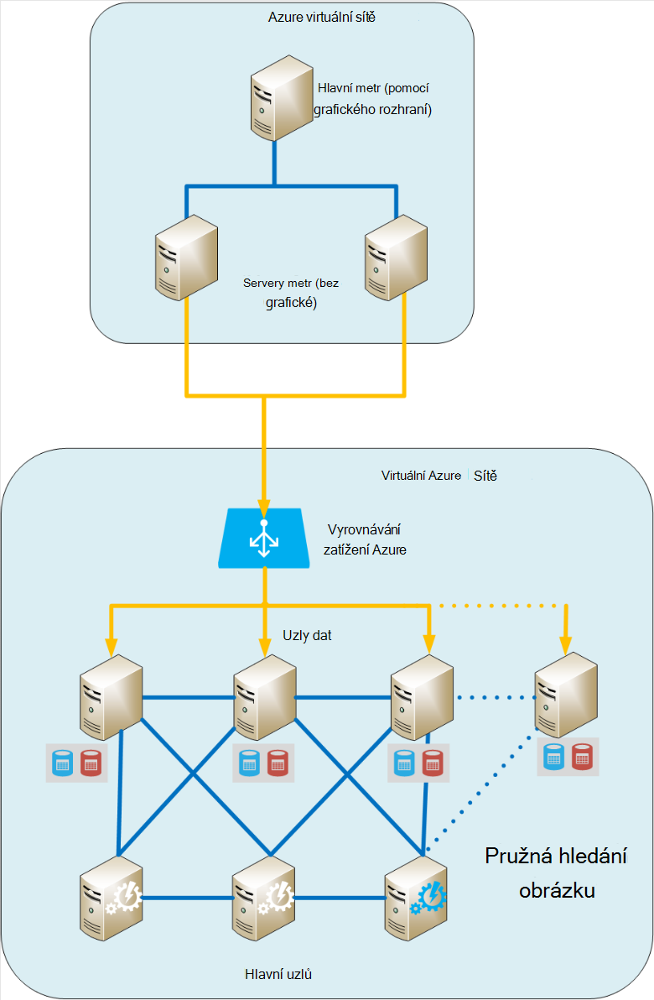
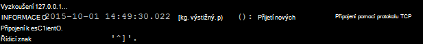
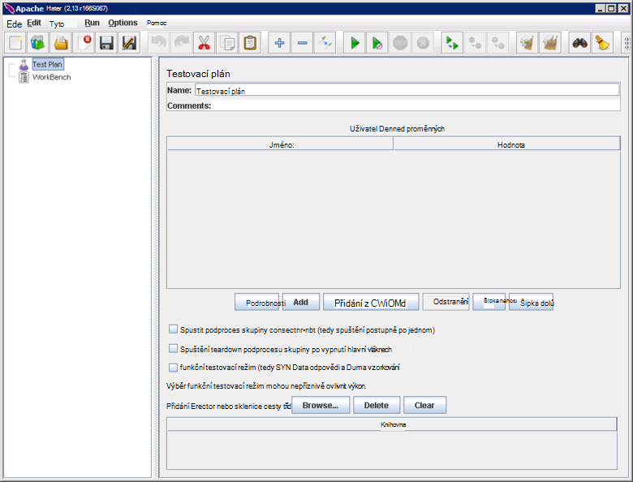
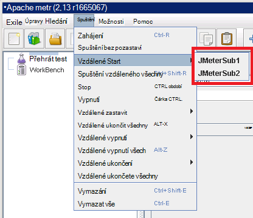
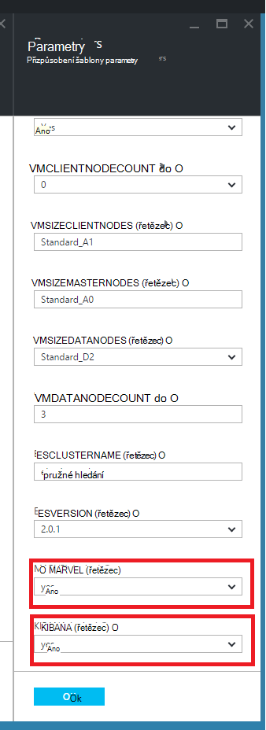
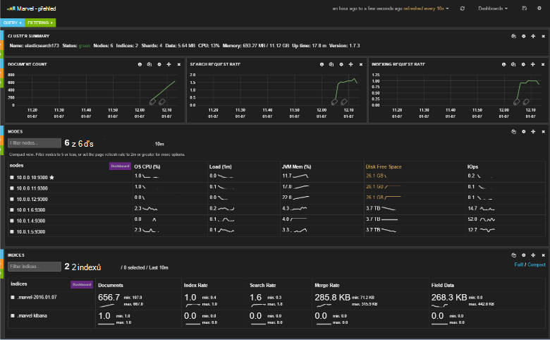
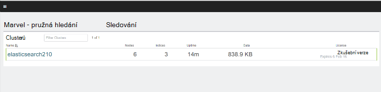
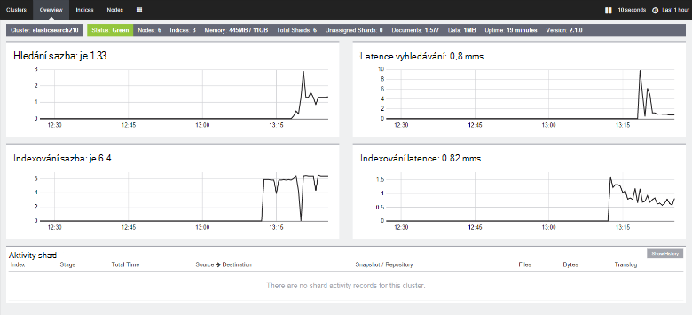

<properties
   pageTitle="Vytváření výkonu testování prostředí pro Elasticsearch | Microsoft Azure"
   description="Jak nastavit prostředí k testování výkonu Elasticsearch obrázku."
   services=""
   documentationCenter="na"
   authors="dragon119"
   manager="bennage"
   editor=""
   tags=""/>

<tags
   ms.service="guidance"
   ms.devlang="na"
   ms.topic="article"
   ms.tgt_pltfrm="na"
   ms.workload="na"
   ms.date="09/22/2016"
   ms.author="masashin"/>
   
# <a name="creating-a-performance-testing-environment-for-elasticsearch-on-azure"></a>Vytváření výkonu testování prostředí pro Elasticsearch na Azure

[AZURE.INCLUDE [pnp-header](../../includes/guidance-pnp-header-include.md)]

Tento článek je [součástí řady](guidance-elasticsearch.md). 

Tento dokument popisuje, jak nastavit prostředí k testování výkonu Elasticsearch obrázku. Tuto konfiguraci byla použita k testování provádění úloh data požití a dotaz, podle popisu v [optimalizace dat požití výkon Elasticsearch na Azure][].

Testování proces výkonu používat [Apache JMeter](http://jmeter.apache.org/), se [Standardní sada](http://jmeter-plugins.org/wiki/StandardSet/) nainstalovaná v konfiguraci předlohy/podřízeného pomocí sady vyhrazené VMs (není součástí clusteru Elasticsearch) specificky nakonfigurovali za účelem moduly plug-in. 

[Agent serveru PerfMon](http://jmeter-plugins.org/wiki/PerfMonAgent/) byl nainstalovaný v jednotlivých uzlech Elasticsearch. Následující části obsahují pokyny k opětovnému vytvoření testovacím prostředí, aby vám vést vlastní výkonu testováním pomocí JMeter. Tyto pokyny se předpokládá, že jste již vytvořili Elasticsearch obrázku s uzly připojené pomocí Azure virtuální sítě. 

Všimněte si, že testovacím prostředí spustí také jako sady Azure VMs spravovat pomocí jednoho Azure skupina.

[Marvel](https://www.elastic.co/products/marvel) byla i nainstalovali a nakonfigurovali povolit interní aspekty clusteru Elasticsearch sledovat a analyzovat snadněji. Jestliže byl statistiku JMeter Špička nebo žlábku výkonu, může být informace dostupné prostřednictvím Marvel velmi užitečné v případě vám pomohou zjistit příčinu kolísání.

Následující obrázek ukazuje strukturu celého systému. 



Mějte na paměti následující skutečnosti:

- Předloha JMeter OM běží Windows Server poskytovat prostředí grafického rozhraní konzole JMeter. OM JMeter předlohy nabízí grafické ( *jmeter* aplikace) povolit testování vytvořit testy, spusťte testy a vizualizovat výsledky. Tento OM souřadnice se serverem JMeter VMs, které skutečně odeslat požadavky, které představují testů.

- Podřízené VMs JMeter běží Server se systémem Ubuntu (Linux), se nepožaduje grafického rozhraní pro tyto VMs. JMeter server VMs spouštění softwaru JMeter server ( *jmeter server* aplikace) k odeslání žádosti o Elasticsearch obrázku.

- Uzlů vyhrazené klientů nebyly použili, přestože byly vyhrazené předlohy uzlů.

- Počet datových uzlů v clusteru se může lišit v závislosti na scénáři testované.

- Stačí clusteru Elasticsearch spustit Marvel sledovat výkon za běhu a Server Agent JMeter sběr monitorování dat pro pozdější analýzu.

- Při testování Elasticsearch 2.0.0 a novějších verzích jednu z datových uzlů také se spustí Kibana. Toto je požaduje verzi Marvel, která poběží na Elasticsearch 2.0.0 a novější.

## <a name="creating-an-azure-resource-group-for-the-virtual-machines"></a>Vytvoření skupiny Azure zdroje pro virtuálních počítačích

Hlavní JMeter potřebujete připojit přímo na každý z uzlů v clusteru Elasticsearch shromažďovat data o výkonu. Pokud JMeter VNet je odlišné od obrázku Elasticsearch VNet, potom to vyžaduje konfiguraci jednotlivých uzlech Elasticsearch s veřejnou IP adresu. Pokud se problém s konfigurací Elasticsearch pak implementace JMeter VMs ve stejné VNet jako obrázku Elasticsearch pomocí stejné skupiny prostředků, v takovém případě můžete tento první krok vynechat.

Nejdřív [vytvořit skupinu zdrojů](../resource-group-template-deploy-portal.md). Tento dokument předpokládá, že skupina zdroje je s názvem *JMeterPerformanceTest*. Pokud chcete spustit JMeter VMs ve stejné VNet jako obrázku Elasticsearch, použijte stejné skupiny prostředků jako tomuto clusteru místo abyste vytvářeli novou.

## <a name="creating-the-jmeter-master-virtual-machine"></a>Vytváření JMeter předlohy virtuálního počítače

Další [vytvořit Windows OM](../virtual-machines/virtual-machines-windows-hero-tutorial.md) obrázek *Windows Server 2008 R2 SP1* .  Doporučujeme vybrat velikostí OM s dostatečnou jádra a paměti ke spuštění testy výkonu. V ideálním případě půjde stroje s alespoň na úrovni 2 jádra a 3,5 GB paměti RAM (A2 standardní nebo zvětšit).

<!-- TODO add info on why disabling diagnostics is positive --> 

Doporučujeme zakázat Diagnostika. Při vytváření OM na portálu, provedete na zásuvné *Nastavení* v části *Sledování* klikněte v části *Diagnostics*. Další nastavení ponechte výchozí hodnoty.

Ověřte, že OM a všechny přidružené prostředky vytvořil úspěšně [zkoumání skupina zdroje](../azure-portal/resource-group-portal.md#manage-resource-groups) na portálu. Zdroje uvedené by měl obsahovat virtuálního počítače, skupiny zabezpečení sítě a veřejnou IP adresu všechny se stejným názvem a síťový rozhraní a úložiště účet s názvy podle barvy OM.

## <a name="creating-the-jmeter-subordinate-virtual-machines"></a>Vytváření virtuálních počítačích podřízené JMeter

Nyní [vytvořte OM Linux](../virtual-machines/virtual-machines-linux-quick-create-portal.md) obrázek *Se systémem Ubuntu serveru 14.04 l* .  Stejně jako u předlohy OM JMeter vyberte velikost OM s dostatečnou jádra a paměti ke spuštění testy výkonu. V ideálním případě půjde stroje s alespoň na úrovni 2 a jádra aspoň 3,5 GB paměti RAM (standardní A2 nebo zvětšit).

Znovu doporučujeme, abyste zakázat Diagnostika.

Můžete vytvořit libovolný počet podřízených VMs podle potřeby. 

## <a name="installing-jmeter-server-on-the-jmeter-subordinate-vms"></a>Instalace serveru JMeter na podřízené VMs JMeter

Podřízené VMs JMeter používáte Linux a ve výchozím nastavení se nemůže připojit k nim otevřením připojení ke vzdálené ploše (RDP). Místo toho můžete [použít nátěrové otevřete okno příkazového řádku](../virtual-machines/virtual-machines-linux-mac-create-ssh-keys.md) na každé OM.

Jakmile jste připojení k jedné z podřízené VMs, použijeme flám nastavit JMeter.

Nejprve nainstalujte prostředí Java Runtime potřebné ke spuštění JMeter.

```bash
sudo add-apt-repository ppa:webupd8team/java
sudo apt-get update
sudo apt-get install oracle-java8-installer
```

Stáhněte software JMeter balíčku zip formátu.

```bash
wget http://apache.mirror.anlx.net/jmeter/binaries/apache-jmeter-2.13.zip
```

Příkaz unzip nainstalovat a potom použijte rozbalte JMeter software. Software zkopírována do složky s názvem **apache jmeter 2.13**.

```bash
sudo apt-get install unzip
unzip apache-jmeter-2.13.zip
```

Přejděte do *koše* adresáře blokování spustitelnými JMeter a vytvořit sady informací o *serveru jmeter* a *jmeter* spustitelný soubor.

```bash
cd apache-jmeter-2.13/bin
chmod u+x jmeter-server
chmod u+x jmeter
```

Teď, potřebujeme upravit tento soubor `jmeter.properties` vyhledali v aktuální složce (použijte textovém editoru znáte většina, například *vi* nebo *vim*). Vyhledejte následující řádky:

```yaml
...
client.rmi.localport=0
...
server.rmi.localport=4000
...
```

Zrušte komentář (odebrat úvodní mezery \## znaky) a změnit tyto řádky, jak je ukázáno v následujícím příkladu, a pak soubor uložíte a zavřete editor:

```yaml
...
client.rmi.localport=4441
...
server.rmi.localport=4440
```

Teď spusťte následující příkazy Otevřít port 4441 TCP příchozích (Toto je port jste právě nakonfigurovali *jmeter serveru* poslouchat na):

```bash
sudo iptables -A INPUT -m state --state NEW -m tcp -p tcp --dport 4441 -j ACCEPT
```

Stažení souboru zip obsahujícího standardní kolekce moduly plug-in pro JMeter (tyto moduly plug-in pro zajištění sledování výkonnosti) a potom soubor do složky **apache jmeter 2.13** rozbalit. Rozbalení souboru v tomto umístění umístí budou moduly plug-in pro správné složky.

Pokud vás systém vyzve k licenci soubor nahradit, zadáním hodnoty (pro všechny):

```bash
wget http://jmeter-plugins.org/downloads/file/JMeterPlugins-Standard-1.3.0.zip
unzip JMeterPlugins-Standard-1.3.0.zip
```

Použití `nohup` ke spuštění serveru JMeter na pozadí. By měly odpovídat zobrazením ID procesu a se zpráva oznamující, že vytvořila vzdálené objektu a je připraven zahájit příjem příkazy.  Spusťte tento příkaz v adresáři ~/apache-jmeter-2.13/bin. 

```bash
nohup jmeter-server &
```

> [AZURE.NOTE]Jestliže OM je vypnutí program serveru JMeter ukončen. Bude muset připojit angličtině a restartujte ji znovu ručně. Můžete taky můžete nakonfigurovat spuštění příkazu *jmeter serveru* automaticky přidáním následujících příkazů při spuštění systému `/etc/rc.local` souboru (před příkaz *Ukončit 0* ):

```bash
sudo -u <username> bash << eoc
cd /home/<username>/apache-jmeter-2.13/bin
nohup ./jmeter-server &
eoc
```

Nahrazení `<username>` se vaše přihlašovací jméno.

Bude pravděpodobně vhodné nechte otevřené okno terminálu, takže můžete sledovat průběh serveru JMeter probíhá testování.

Bude muset tyto kroky zopakujte pro každý podřízený OM JMeter.

## <a name="installing-the-jmeter-server-agent-on-the-elasticsearch-nodes"></a>Instalace Agent serveru JMeter uzlech Elasticsearch

Tento postup předpokládá, že máte přístup pro přihlášení do Elasticsearch uzlů. Pokud jste vytvořili pomocí šablony správce prostředků obrázku, můžete se připojit každý uzel až do pole odkaz OM, jak je ukázáno v části [Systém Elasticsearch na Azure](guidance-elasticsearch-running-on-azure.md)Elasticsearch topologie. Do pole odkaz pomocí nátěrové taky můžete připojit. 

Odtud můžete příkaz *ssh* k přihlášení do všech uzlů v Elasticsearch obrázku.

Přihlaste se na jeden z uzly Elasticsearch jako správce.  Na příkazovém řádku flám zadejte následující příkazy k vytvoření složky při blokování Agent serveru JMeter a přesunout do této složky:

```bash
mkdir server-agent
cd server-agent
```

Následující příkazy k instalaci příkazu *unzip* (pokud už není nainstalovaná), stažení softwaru JMeter Server Agent a rozbalit ho:

```bash
sudo apt-get install unzip
wget http://jmeter-plugins.org/downloads/file/ServerAgent-2.2.1.zip
unzip ServerAgent-2.2.1.zip
```
 
Spusťte tento příkaz nakonfigurujte bránu firewall a povolení přenosy protokolu TCP přes port 4444 (Toto je port používaný Agent serveru JMeter):

```bash
sudo iptables -A INPUT -m state --state NEW -m tcp -p tcp --dport 4444 -j ACCEPT
```

Spusťte tento příkaz Spustit Agent serveru JMeter na pozadí:

```bash
nohup ./startAgent.sh &
```

Agent serveru JMeter by měly odpovídat se zprávami označující, že byl spuštěn a přijímá požadavky na port 4444.  Stisknutím klávesy Enter získat příkazový řádek a potom spusťte tento příkaz.

```bash
telnet <nodename> 4444
```

Nahrazení `<nodename>` s názvem uzel. (Hledaný název uzel spuštěním `hostname` příkaz.) Tento příkaz otevře připojení k port 4444 na místním počítači. Toto připojení můžete použít k ověření, že JMeter Server Agent funguje správně.

Pokud JMeter Server Agent nespustí, dostanete odpověď 

`*telnet: Unable to connect to remote host: Connection refused*.`

Pokud běží Agent JMeter serveru a portu 4444 správně nakonfiguroval, měli byste zkontrolovat následující odpověď:



> [AZURE.NOTE] Relace telnet neposkytuje řazení příkazového řádku po má připojení.

V relaci telnet zadejte tento příkaz:

``` 
test
```

Pokud je JMeter Server Agent nakonfigurované a poslouchat správně, je měli označuje, že přijata příkazu zpráv a odpovídání zprávou *Yep*.

> [AZURE.NOTE]Můžete zadat do dalších příkazů získání dat pro sledování výkonu. Příklad příkazu `metric-single:cpu:idle` získáte aktuální část údaj o čase, procesoru nečinnosti (Toto je snímek). Úplný seznam příkazů navštivte stránku [Agent PerfMon serveru](http://jmeter-plugins.org/wiki/PerfMonAgent/) . : Zpátky na volání se mu Perfmon serveru Agent. >>

V relaci telnet zadejte tento příkaz ukončení relace a vraťte se do příkazového řádku flám:

``` 
exit
```

> [AZURE.NOTE]Jak se JMeter podřízené VMs, pokud je odhlášení nebo pokud je tento počítač vypnutí a restartování potom Agent serveru JMeter bude nutné restartovat ručně pomocí `startAgent.sh` příkaz. Pokud chcete Agent serveru JMeter, aby se spouštěl automaticky, přidejte tento příkaz na konec `/etc/rc.local` soubor před příkaz *Ukončit 0* . 
> Nahrazení `<username>` se vaše přihlašovací jméno:

```bash
sudo -u <username> bash << eoc
cd /home/<username>/server-agent
nohup ./startAgent.sh &
eoc
```

Můžete nyní buď opakovat celého tohoto procesu u všech ostatních uzlů v clusteru Elasticsearch nebo můžete použít `scp` příkaz Kopírovat agent serveru složky a obsah do každé uzel a použití `ssh` příkaz Spustit Agent serveru JMeter jak je ukázáno v následujícím příkladu. e nahradit `<username>` s svoje uživatelské jméno a `<nodename>` s názvem uzel místo, kam chcete kopírování a používání softwaru (můžete být vyzváni k zadání hesla, jak spustit každého příkazu):

```bash
scp -r \~/server-agent <username>@<nodename>:\~
ssh <nodename> sudo iptables -A INPUT -m state --state NEW -m tcp -p tcp --dport 4444 -j ACCEPT
ssh <nodename> -n -f 'nohup \~/server-agent/startAgent.sh'
```

## <a name="installing-and-configuring-jmeter-on-the-jmeter-master-vm"></a>Instalace a konfigurace JMeter na hlavní OM JMeter

Na portálu Azure klikněte na **skupiny zdrojů**. V zásuvné **skupiny zdrojů** klikněte na skupina zdroje obsahující JMeter předlohy a podřízených VMs.  V zásuvné **pole Skupina zdroje** klikněte na **hlavní OM JMeter**. V zásuvné virtuálního počítače, na panelu nástrojů klikněte na **Připojit**. Otevřete soubor RDP po zobrazení výzvy ve webovém prohlížeči. Připojení ke vzdálené ploše pro vaše OM vytvoří systém Windows.  OM po zobrazení výzvy zadejte uživatelské jméno a heslo.

V OM v Internet Exploreru přejděte na stránku [Stáhnout Java pro Windows](http://www.java.com/en/download/ie_manual.jsp) . Postupujte podle pokynů ke stažení a spusťte instalační program Java.

Ve webovém prohlížeči přejděte na stránku [Stáhnout JMeter Apache](http://jmeter.apache.org/download_jmeter.cgi) a stáhněte zip obsahujícího posledních binární. Uložení poštovního praktické místo na vaše OM.

Přejděte na web [Vlastní JMeter moduly plug-in](http://jmeter-plugins.org/) a stáhněte standardní sada moduly plug-in. Uložte poštovního do stejné složky jako soubor ke stažení JMeter v předchozím kroku.

V programu Průzkumník Windows, přejděte do složky obsahující apache-jmeter*xxx* zip souboru, kde *xxx* je aktuální verzi JMeter. Extrahujte soubory do aktuální složky.

Extrahujte soubory v JMeterPlugins – standardní*yyy*zip souboru, kde je aktuální verzi moduly plug-in do apache *yyy* -jmeter*xxx* složek. Tím se přidá budou moduly plug-in pro správné složce pro JMeter. Můžete sloučit složky knihovny a po zobrazení výzvy k přepsání souborů licence a soubor Readme pro.

Přejděte na apache-složek/bin*xxx*jmeter a úpravy jmeter.properties souboru programu Poznámkový blok.  V `jmeter.properties` soubor, najděte část označené *vzdálené tabulkami hosts a konfigurace RMI*.  V této části soubor vyhledejte následující řádek:

```yaml
remote_hosts=127.0.0.1
```

Změňte tento řádek a nahraďte IP adresu 127.0.0.1 čárkou oddělený seznam IP adresy nebo názvy hostitelů pro každou z podřízené servery JMeter. Příklad:

```yaml
remote_hosts=JMeterSub1,JMeterSub2
```

Vyhledejte následující řádek a potom odebrat `#` písmeno na začátku řádku a změňte hodnotu client.rmi.localport nastavení:

```yaml
#client.rmi.localport=0
```

:

```yaml
client.rmi.localport=4440
```

Uložit a zavřít Poznámkový blok. 

Na panelu nástrojů Windows klikněte na tlačítko **Start**, klikněte na **Nástroje pro správu**a klikněte na **Brána Windows Firewall s pokročilým zabezpečením**.  V brána Windows Firewall s pokročilým zabezpečením okno v levém podokně klikněte pravým tlačítkem na **Příchozí pravidla**a potom klikněte na **Nové pravidlo**.

V dialogovém okně **Příchozí Průvodce vytvořením nového pravidla**na stránce **Typ pravidla** vyberte **Port**a klikněte na tlačítko **Další**.  Na stránce porty a protokoly vyberte **TCP**, vyberte **konkrétní místní porty**, zadejte do pole text `4440-4444`a potom na tlačítko **Další**.  Na stránce akce vyberte **Povolit připojení**a klikněte na tlačítko **Další**. Na stránce profilu, ponechte všechny možnosti zaškrtnuté a klikněte na tlačítko **Další**.  Na stránce název do pole **název** textového pole zadejte *JMeter*a klikněte na **Dokončit**.  Brána Windows Firewall s pokročilým zabezpečením okno zavřete.

V Průzkumníkovi v apache-jmeter -**xx/Bin složku, poklikejte na dávkový soubor *jmeter* systému Windows spustit grafického uživatelského rozhraní. Uživatelské rozhraní objevit:



V řádku nabídek klikněte na příkaz **Spustit**, klikněte na tlačítko **Start vzdálené**a ověřte, že jsou uvedeny dva JMeter podřízené počítače:



Teď jste připraveni začít testování výkonu.

## <a name="installing-and-configuring-marvel"></a>Instalace a konfigurace Marvel

Šablona rychlý úvod Elasticsearch Azure se nainstaluje a konfiguraci potřeby verze Marvel automaticky, pokud nastavíte parametry MARVEL a KIBANA na hodnotu true ("Ano") při vytváření clusteru:



Pokud přidáváte Marvel do existujícího clusteru potřebujete novou instalaci ručně a proces se liší podle toho, jestli používáte Elasticsearch verzi 1.7.x nebo 2.x, jak je uvedeno v následující postupy.

### <a name="installing-marvel-with-elasticsearch-173-or-earlier"></a>Instalace Marvel s Elasticsearch 1,73 nebo starší

Pokud používáte Elasticsearch 1.7.3 nebo starší, proveďte následující kroky *v každém uzlu* clusteru:

- Přihlaste se k uzel a přesuňte Elasticsearch adresáři.  Na Linux, je typické adresáři `/usr/share/elasticsearch`.

-  Spusťte tento příkaz si stáhněte a nainstalujte modul plug-in Marvel pro Elasticsearch:

```bash
sudo bin/plugin -i elasticsearch/marvel/latest
```

- Ukončete a restartujte Elasticsearch na uzel:

```bash
sudo service elasticsearch restart
```

- Pokud chcete ověřit, že Marvel nainstalovaný správně, otevřete webový prohlížeč a přejděte na adresu URL `http://<server>:9200/_plugin/marvel`. Nahrazení `<server>` s názvem nebo IP adresu serveru všechny Elasticsearch clusteru.  Ověřte, že se zobrazí stránka podobná té, která vidíte na obrázku:




### <a name="installing-marvel-with-elasticsearch-200-or-later"></a>Instalace Marvel s Elasticsearch 2.0.0 nebo novější

Pokud používáte Elasticsearch 2.0.0 nebo novější, proveďte následující úkoly *v každém uzlu* clusteru:

Přihlaste se k uzel a přejděte v adresáři domácí Elasticsearch (obvykle `/usr/share/elasticsearch`) následující příkazy si stáhněte a nainstalujte modul plug-in Marvel pro Elasticsearch:

```bash
sudo bin/plugin install license
sudo bin/plugin install marvel-agent
```

Ukončete a restartujte Elasticsearch na uzel:

```bash
sudo service elasticsearch restart
```

V následujícím postupu nahraďte `<kibana-version>` s 4.2.2 Pokud používáte Elasticsearch 2.0.0 nebo Elasticsearch 2.0.1 nebo se 4.3.1 Pokud používáte Elasticsearch 2.1.0 nebo novější.  Nahrazení `<marvel-version>` s 2.0.0 Pokud používáte Elasticsearch 2.0.0 nebo Elasticsearch 2.0.1 nebo se 2.1.0 Pokud používáte Elasticsearch 2.1.0 nebo novější.  Proveďte následující úkoly *v jednom uzlu* clusteru:

Přihlaste se k uzel a příslušného sestavení Kibana pro vaši verzi Elasticsearch stahování [Elasticsearch stáhnout webu](https://www.elastic.co/downloads/past-releases)a pak extrahujte balíček:

```bash
wget https://download.elastic.co/kibana/kibana/kibana-<kibana-version>-linux-x64.tar.gz
tar xvzf kibana-<kibana-version>-linux-x64.tar.gz
```

Otevřete port 5601 přijmout příchozí žádosti:

```bash
sudo iptables -A INPUT -m state --state NEW -m tcp -p tcp --dport 5601 -j ACCEPT
```

Přejděte do složky Konfigurace Kibana (`kibana-<kibana-version>-linux-x64/config`), upravit `kibana.yml` soubor a přidejte následující řádek. Nahrazení `<server>` s názvem nebo IP adresu serveru Elasticsearch clusteru:

```yaml
elasticsearch.url: "http://<server>:9200"
```

Přejděte do složky Koš Kibana (`kibana-<kibana-version>-linux-x64/bin`), a spusťte tento příkaz integrovat modul plug-in Marvel do Kibana:

```bash
sudo ./kibana plugin --install elasticsearch/marvel/<marvel-version>
```

Spuštění Kibana:

```bash
sudo nohup ./kibana &
```

Pokud chcete ověřit instalace Marvel, otevřete webový prohlížeč a přejděte na adresu URL `http://<server>:5601/app/marvel`. Nahrazení `<server>` s názvem nebo IP adresu serveru Kibana.

Ověřte, že se zobrazí stránka podobná té, která vidíte na obrázku (název svůj cluster bude pravděpodobně se liší od vidět na obrázku).



Klikněte na odkaz, který odpovídá svůj cluster (elasticsearch210 na obrázku výše). Stránku podobný ukázáno v následujícím příkladu by měla vypadat:




[Ladění výkonu požití dat pro Elasticsearch na Azure]: guidance-elasticsearch-tuning-data-ingestion-performance.md  