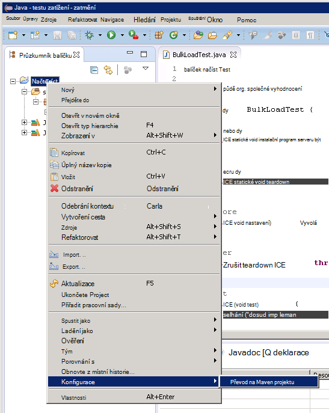
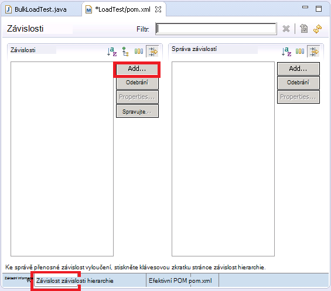

<properties
   pageTitle="Nasazení JMeter JUnit vzorkování testování Elasticsearch výkonu | Microsoft Azure"
   description="Jak používat vzorkování JUnit k vytvoření a odeslání dat do Elasticsearch obrázku."
   services=""
   documentationCenter="na"
   authors="dragon119"
   manager="bennage"
   editor=""
   tags=""/>

<tags
   ms.service="guidance"
   ms.devlang="na"
   ms.topic="article"
   ms.tgt_pltfrm="na"
   ms.workload="na"
   ms.date="09/22/2016"
   ms.author="masashin"/>
   
# Nasazení JMeter JUnit vzorkování testování Elasticsearch výkon

[AZURE.INCLUDE [pnp-header](../../includes/guidance-pnp-header-include.md)]

Tento článek je [součástí řady](guidance-elasticsearch.md). 

Tento dokument popisuje, jak vytvářet a používat JUnit vzorník, které můžete generovat a odeslání dat do Elasticsearch obrázku jako součást JMeter testovací plán. Tento postup obsahuje vysoce flexibilní přístup k načtení testování, které můžete generovat velké objemy dat test bez v závislosti na externí datové soubory.

> [AZURE.NOTE] Načtení testů použít ke zjištění výkonu požití data podle [optimalizace dat požití výkon Elasticsearch](guidance-elasticsearch-tuning-data-ingestion-performance.md) vypočteny pomocí tento přístup. Podrobnosti o kód JUnit jsou popsané v tomto dokumentu.

Testování výkon požití dat kód JUnit byl vývoj pomocí zatmění (Mars) a závislosti jsou převáděny Maven. Následující postupy popisují krok za krokem proces instalace zatmění konfigurace Maven, vytvoření JUnit testu a nasazení tento test jako JUnit žádost vzorkování v testu JMeter.

> [AZURE.NOTE] Podrobné informace o struktuře a konfigurace testovacím prostředí najdete v článku [Vytvoření výkonu testovací prostředí pro Elasticsearch na Azure][].

## Požadavky na instalaci

V počítači vývoj budete potřebovat [Prostředí Java Runtime](http://www.java.com/en/download/ie_manual.jsp) .
Bude taky muset nainstalovat [Zatmění integrovaném vývojovém prostředí pro vývojáře Java](https://www.eclipse.org/downloads/index.php?show_instructions=TRUE).

> [AZURE.NOTE] Pokud používáte předlohy OM JMeter popsaná v tématu [Vytvoření výkonu testování prostředí pro Elasticsearch na Azure][] jako vývojové prostředí, stáhněte si Windows 32bitové verzi instalačního programu zatmění.

## Vytvoření projektu JUnit test pro testování Elasticsearch zatížení

Otevření integrovaném vývojovém zatmění prostředí, pokud už není spuštěný a potom zavřete **úvodní** stránku.  V nabídce **soubor** klikněte na a potom klikněte na **Projekt Java**.

V okně **Nový projekt Java** zadejte název projektu, vyberte **použít výchozí JRE**a potom klikněte na **Dokončit**.

V okně **Průzkumníka balíčku** rozbalte uzel s názvem po projektu. Zkontrolujte, zda obsahuje do složky nazvané **src** a odkaz na JRE jste zadali.

Klikněte pravým tlačítkem myši na složku **src** , klikněte na **Nový**a pak klikněte na **JUnit Test písmena**.

V okně **Nový případ Test JUnit** vyberte **nové 4 Junit test**, zadejte název balíčku (může to být stejný jako název projektu, i když podle názvů musí začínat písmenem samá velká písmena), název třídy test a vyberte požadované možnosti, které mohou generovat kódy metoda potřebných pro svůj testovací. **Třídy zkoušený** políčko ponechat prázdné a potom klikněte na **Dokončit**.

Pokud se zobrazí dialogové okno následující **Nový případ Test JUnit** , vyberte možnost přidat knihovnu JUnit 4 cesty buildu a potom klikněte na **OK**. 

Zkontrolujte, že kostry kód JUnit test je generováno zobrazené v okně editor jazyka Java.

V **Průzkumníkovi balíčku**klikněte pravým tlačítkem myši na uzel projektu, klikněte na **Konfigurovat**a klikněte na **převést na Maven projektu**.

> [AZURE.NOTE]Použití Maven umožňuje vám snadno spravovat externí závislostí (například knihoven klienta Elasticsearch Java) projektu závisí na.

V dialogovém okně **vytvořit nový POM** v rozevíracím seznamu **balení** vyberte **sklenice**a potom klikněte na **Dokončit**.

V podokně, které se zobrazí pod editoru projektu objektů modelu (POM) mohou zobrazovat upozornění "cesty buildu Určuje spuštění prostředí J2SE 1,5. Neexistují žádné JREs nainstalovaný v pracovním prostoru sporná, i když kompatibilních s toto prostředí", podle toho, jakou verzi systému Java nainstalovaný v počítači vývoj. Pokud máte nainstalovanou verzi jazyka Java, který následuje verze 1.5 můžete ignorovat upozornění.

V editoru POM rozbalte **Vlastnosti** a potom klikněte na **vytvořit**.

V dialogovém okně **Přidat vlastnost** do pole **název** zadejte *es.version*, do pole **hodnota** zadejte *1.7.2*a potom klikněte na **OK**. Toto je verze Elasticsearch Java klienta knihovnu (Tato verze může v budoucnosti nahrazeny a definování verze jako vlastnost POM a odkazování na tuto vlastnost jinde v rámci projektu umožňuje verze rychle změnit.)

Klikněte na kartu **závislostí** na základě editoru POM a potom klikněte na **Přidat** vedle seznamu **závislosti** .

V dialogovém okně **Vyberte závislost** zadejte do pole **Id skupiny** *org.elasticsearch*, zadejte do pole **Id artefaktů** *elasticsearch* **verze** zadejte do pole * \${es.version}*a klikněte na **OK**. Informace o knihovně klienta Java Elasticsearch směřuje v online Maven centrálním úložišti a tuto konfiguraci bude automaticky stáhnout knihovnu a jeho závislosti při projektu.

V nabídce **soubor** klikněte na **Uložit vše**. Tato akce Uložit a vytvořte projekt stahování závislosti nastavil Maven. Zkontrolujte, jestli složce Maven závislosti vypadá v Průzkumníku balíčku. Rozbalte tuto složku zobrazíte sklenice soubory stažené na podporu knihovnu Elasticsearch Java klienta.

## Import existujícího projektu test JUnit zatmění

Tento postup předpokládá, že jste stáhli Maven projektu, která byla dříve vytvořena pomocí zatmění.

Spusťte zatmění integrovaném vývojovém prostředí. V nabídce **soubor** klikněte na **importovat**.

V okně **Vyberte** složku **Maven** , klikněte na **Existující Maven projekty**a klikněte na tlačítko **Další**.

V okně **Maven projekty** zadejte složku držící projektu (složku obsahující soubor pom.xml), klikněte na tlačítko **Vybrat vše**a potom klikněte na **Dokončit**.

V okně **Průzkumníka balíčku** rozbalte uzel odpovídající do projektu. Přesvědčte se, že projekt obsahuje do složky nazvané **src**. Tato složka obsahuje zdrojového kódu pro zkoušku JUnit. Projektu můžete kompilovaný a nasazené po níže uvedených pokynů.

## Nasazení testu JUnit JMeter

Tento postup předpokládá, že jste vytvořili projekt pojmenovanou LoadTest obsahující třídu JUnit testu s názvem `BulkLoadTest.java` , který přijme konfigurace parametrech v jako jeden řetězec konstruktoru (Toto je mechanismus JMeter očekává).

V integrovaném vývojovém prostředí zatmění, v **Průzkumníku balíčku**klikněte pravým tlačítkem myši na uzel projektu a potom klikněte na **Exportovat**.

V **Průvodci exportem**na stránce **Vybrat** rozbalte uzel **Java** , klikněte na tlačítko **JAR souboru**a klikněte na tlačítko **Další**.

Na stránce **JAR specifikace souboru** v dialogovém okně **Vybrat zdroje, chcete-li exportovat** rozbalte projekt zrušte zaškrtnutí políčka **Project**a zrušte zaškrtnutí políčka **pom.xml**. V dialogovém okně **JAR souboru** zadejte název souboru a umístění pro SKLENICE (je nutno koncovku souboru .jar) a potom klikněte na **Dokončit**.

V programu Průzkumník Windows, zkopírujte SKLENICE soubor, který jste právě vytvořili předlohy JVM JMeter a uložte ho ve apache jmeter 2.13\\knihovny\\junit složky pod složce nainstalovanou JMeter (postup "Vytváření virtuálního počítače předlohy JMeter" při [vytváření výkonu testovací prostředí pro Elasticsearch na Azure](guidance-elasticsearch-creating-performance-testing-environment.md) Další informace najdete.)

Vraťte se do zatmění, rozbalte Průzkumníka **Balíčku** a poznamenejte si všechny soubory SKLENICE a jejich umístění uvedené ve složce Maven závislosti projektu. Všimněte si, že soubory zobrazené na následujícím obrázku se mohou lišit podle toho, jakou verzi systému Elasticsearch používáte:

V programu Průzkumník Windows, zkopírujte každý soubor SKLENICE odkazuje ve složce Maven závislosti apache jmeter 2.13\\knihovny\\junit složky na hlavní OM JMeter.

Pokud knihovny\\junit složky již obsahuje starší verze těchto SKLENICE souborů a pak je odebrat. Pokud je necháte na místě JUnit test nemusí fungovat podle odkazy může být převeden na špatném sklenic po g.

V předloze JMeter OM vypnout JMeter když právě probíhá.  Spusťte JMeter.  V JMeter klikněte pravým tlačítkem na **Testovací plán**, klikněte na **Přidat**, klikněte na **vláknech (uživatelé)**a klikněte na **Seskupit vlákna**.

Uzlu **Testovací plán** klikněte pravým tlačítkem **Vlákna skupiny**, klikněte na tlačítko **Přidat**, klikněte na **Vzorník**a klikněte na **Žádosti o JUnit**.

Na stránce **JUnit žádost** vyberte **Hledat JUnit4 poznámky (místo JUnit 3)**. V rozevíracím seznamu **název třídy** vyberte svojí třídě test zatížení JUnit (se zobrazí ve formuláři * &lt;balíčku&gt;.&lt; třídy&gt;*), **Otestujte metoda** rozevíracím seznamu vyberte JUnit zkušební metody (Toto je metodu, která ve skutečnosti provádí práci související s test která by byly označené *@test* poznámky v aplikaci project zatmění) a zadejte všechny hodnoty, který bude předán konstruktoru v rozevíracím seznamu **Popisek řetězec konstruktor** . Podrobnosti o vidět na následujícím obrázku je jenom příkladů; **název třídy** * *Zkušební metody*a * *Konstruktor řetězec popisek** bude pravděpodobně se liší od uvedené.

V rozevíracím seznamu **název třídy** není zobrazena svojí třídě, je nejspíš znamená, že SKLENICE nebyla exportována správně nebo nedostala v knihovny\\knihovny chybí složka junit nebo některé závislá sklenic po g\\junit složky. V takovém případě projektu z zatmění data znova vyexportovat a zajistilo, že jste zaškrtli políčko zdroj **src** , zkopírujte SKLENICE knihovny\\junit složky a ověřte, že nezkopírujete všechny závislá sklenic po g seřazené podle Maven do složky knihovny.

Zavřete JMeter. Je potřeba uložit testovací plán.  Zkopírujte soubor SKLENICE obsahující třídu JUnit test /home/&lt;uživatelské jméno&gt;/apache-jmeter-2.13/lib/junit složky ve všech podřízených VMs JMeter (*&lt;uživatelské jméno&gt; * je název pro správu uživatele jste zadali, když jste vytvořili OM, další informace najdete postup "Vytváření virtuálních počítačích podřízené JMeter" při [vytváření výkonu testovací prostředí pro Elasticsearch na Azure](guidance-elasticsearch-creating-performance-testing-environment.md) .)

Zkopírujte závislá SKLENICE vyžadované třídu JUnit test /home/&lt;uživatelské jméno&gt;/apache-jmeter-2.13/lib/junit složky ve všech podřízených VMs JMeter. Ujistěte se, že nejdřív odebrat všechny starší verze souborů SKLENICE z této složky.

Můžete použít `pscp` nástroj zkopírovat soubory z počítače s Windows Linux.

[Vytváření výkonu testování prostředí pro Elasticsearch na Azure]: guidance-elasticsearch-creating-performance-testing-environment.md
