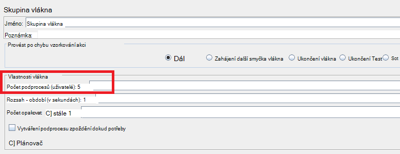
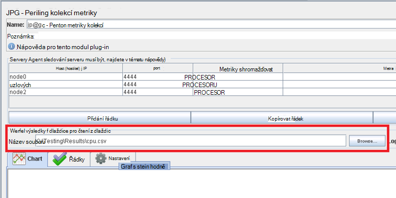
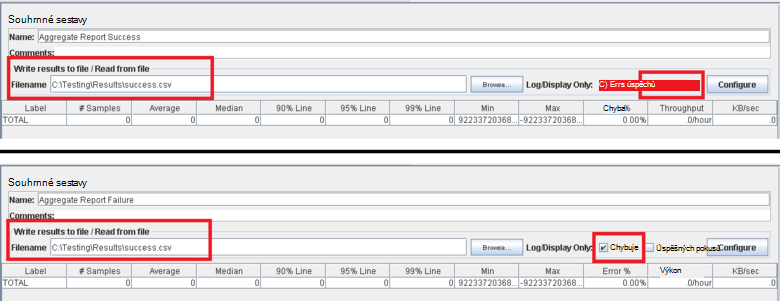
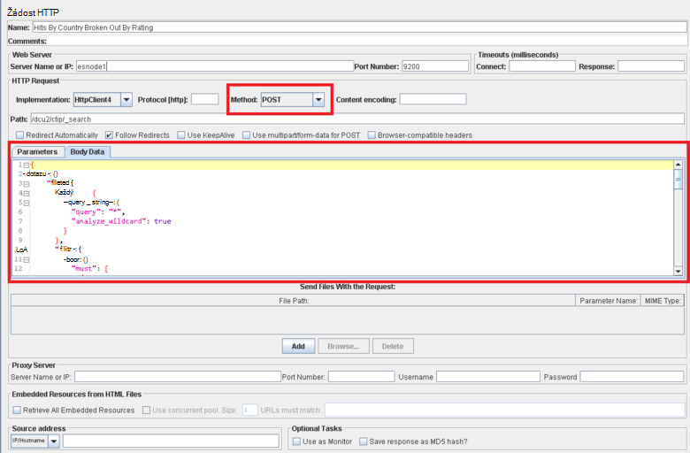

<properties
   pageTitle="Provádění JMeter testovací plán pro Elasticsearch | Microsoft Azure"
   description="K tomu výkonu testuje Elasticsearch s JMeter."
   services=""
   documentationCenter="na"
   authors="dragon119"
   manager="bennage"
   editor=""
   tags=""/>

<tags
   ms.service="guidance"
   ms.devlang="na"
   ms.topic="article"
   ms.tgt_pltfrm="na"
   ms.workload="na"
   ms.date="09/22/2016"
   ms.author="masashin" />
   
# <a name="implementing-a-jmeter-test-plan-for-elasticsearch"></a>Provádění JMeter testovací plán pro Elasticsearch

[AZURE.INCLUDE [pnp-header](../../includes/guidance-pnp-header-include.md)]

Tento článek je [součástí řady](guidance-elasticsearch.md). 

Výkon zkoušek provedených proti Elasticsearch byly implementovaná pomocí JMeter testovací plán společně s kódu jazyka Java začleněná jako JUnit test k provádění úloh, jako je odeslání dat do clusteru. Test plány a kód JUnit jsou popsány v [optimalizace dat požití výkon Elasticsearch na Azure][]a [agregace dat optimalizace výkonu dotazu pro Elasticsearch na Azure][].

V tomto dokumentu účel sumarizovat klíčové prostředí získaných stavba a spuštěním těchto test plány. [Doporučené postupy JMeter](http://jmeter.apache.org/usermanual/best-practices.html) stránky na webu Apache JMeter obsahuje více generalized rad k používání JMeter efektivně.

## <a name="implementing-a-jmeter-test-plan"></a>Provádění JMeter testovací plán

Následující seznam obsahuje souhrn položek, které byste měli zvážit při vytváření JMeter testovací plán:

- Umožňuje vytvořte skupinu samostatný podproces pro každý test, kterou chcete provést. Test může obsahovat více kroků, včetně použití logických operátorů řadiče časovače, před a po procesorů, vzorků a posluchače.

- Nevytvářejte příliš mnoho podprocesů ve skupině podproces. Příliš mnoho vláknech způsobí JMeter dojde k chybě "Paměti mimo" výjimky. Je lepší přidat další podřízené servery JMeter menší počet podprocesů než pokusí o spuštění velké množství vláken na jednom serveru JMeter operačním systémem.



- Vyhodnotí výkonu clusteru začlenit modul plug-in [Perfmon metriky kolekcí](http://jmeter-plugins.org/wiki/PerfMon/) do testovací plán. Toto je JMeter posluchače, který je k dispozici jako jednu z moduly plug-in standardním JMeter. Uložení dat jako nezpracovaná výkonu do sady soubory ve formátu hodnoty oddělené čárkami (CSV) a jejich zpracování po dokončení testu. Toto je efektivnější která ukládá méně přetížení JMeter než pokusíte zpracování dat, jako je nezaznamenávají. 



Můžete nástroj tyto aplikace Excel můžete importovat data a generovat oblasti grafy pro účely analýzy.

Vezměte v úvahu zachycení následující informace:

- Využití procesoru pro každý uzel Elasticsearch obrázku.

- Počet bajtů přečtených sekundu z disku pro každý uzel.

- Pokud je to možné procento využití procesoru času stráveného čekání na vstupu a výstupu provádět v jednotlivých uzlech. Tím se nedají vždycky pro Windows VMs, ale Linux můžete vytvořit vlastní metriky (metrické spouštění), které se spustí příkaz prostředí pro vyvolání *vmstat* uzlu:

```Shell
sh:-c:vmstat 1 5 | awk 'BEGIN { line=0;total=0;}{line=line+1;if(line&gt;1){total=total+\$16;}}END{print total/4}'
```

Pole 16 v výstup *vmstat* obsahuje procesoru čas strávený čeká se na vstupu a výstupu. Další informace o tom, jak toto údajů funguje najdete v článku [vmstat příkaz](http://linuxcommand.org/man_pages/vmstat8.html).

- Počet bajtů poslali a dostali v síti na jednotlivých uzlech.

- Slouží k zaznamenání výkon a četnost operací úspěšné a neúspěšné samostatné posluchače souhrnné sestavy. Zachycení úspěšné a neúspěšné dat na různých souborů.



- Zachovat ke každému případu test JMeter co nejjednodušší, aby bylo možné přímo sladit výkon při akcích konkrétní test. Test případech, které vyžadují komplexní logiky zvažte encapsulating tato logika v testu JUnit a použití vzorkování JUnit žádost ve JMeter testu.

- Žádost HTTP vzorník slouží k provádění operací HTTP, například GET, příspěvku, vložit nebo odstranit. Například spuštěním Elasticsearch vyhledávání pomocí dotazu příspěvku a poskytuje Detaily dotazu v rozevíracím seznamu *Data textu* :



- Pro snadnější opakovatelnosti a opakované použití parametrizovat test JMeter test plány. Pak můžete skriptování k automatizaci spuštěním testovací plán.

## <a name="implementing-a-junit-test"></a>Provádění JUnit test

Komplexní kód můžete začlenit do testovací plán JMeter vytvořením jeden nebo více JUnit testů. JUnit test můžete psát pomocí jazyka Java integrované prostředí pro vývoj (integrovaném vývojovém prostředí) například zatmění. [Nasazení JMeter JUnit vzorkování testování Elasticsearch výkonu][] obsahuje informace o tom, jak nastavit odpovídající vývojové prostředí.

Následující seznam shrnuje některé osvědčené postupy, pomocí kterých můžete by měl při psaní kódu pro JUnit otestujte:

- Použijte konstruktoru třídy test pro předávání inicializační parametry do test. JMeter můžete použít konstruktor, který má argument jednoho řetězce. V konstruktoru analyzovat tento argument do jeho jednotlivé části, jak je vidět v následujícím příkladu:

```Java
private String hostName = "";
private String indexName = "";
private String typeName = "";
private int port = 0;
private String clusterName = "";
private int itemsPerBatch = 0;

/\* JUnit test class constructor \*/
public ElasticsearchLoadTest2(String params) {
    /* params is a string containing a set of comma separated values for:
        hostName
        indexName
        typeName
        port
        clustername
        itemsPerBatch
    */

    /* Parse the parameter string into an array of string items */
    String delims = "\[ \]\*,\[ \]\*"; // comma surrounded by zero or more spaces
    String\[\] items = params.split(delims);

    /* Note: Parameter validation code omitted */

    /* Use the parameters to populate variables used by the test */
    hostName = items[0];
    indexName = items[1];
    typeName = items[2];
    port = Integer.parseInt(items[3]);
    clusterName = items[4];
    itemsPerBatch = Integer.parseInt(items[5]);

    if(itemsPerBatch == 0)
        itemsPerBatch = 1000;
}
```

- Vyhněte se operací nebo jiné časově náročný operace v konstruktoru nebo třídy test nastavení, protože spouštění při každém spuštění JUnit test. (Stejné test JUnit by umožnit spuštění mnoho tisíce času u každého zkouška spouštějí ze JMeter.)

- Zvažte použití jednorázové instalace pro inicializace drahé test písmena.

- Pokud test vyžaduje velkého počtu vstupních parametrů, obsahují informace o konfiguraci test v samostatném konfiguračního souboru a předávání umístění tohoto souboru do konstruktoru.

- Vyhněte se pevně kódování cesty k souboru v kódu test načíst. Tyto mohou způsobit selhání kvůli rozdíly mezi operating systems například Windows a Linux.

- Označení, že k chybám v JUnit zkušební metody, aby mohli sledovat pomocí JMeter a použít je jako obchodní metriky pomocí výrazy. Pokud je to možné, předejte zpět informace týkající se příčinou selhání, jak je vidět tučné písmo v následujícím příkladu:

```Java
@Test
public void bulkInsertTest() throws IOException {
    ...
    BulkResponse bulkResponse = bulkRequest.execute().actionGet();
    assertFalse(
        bulkResponse.buildFailureMessage(), bulkResponse.hasFailures());
        ...
}
```


[Running Elasticsearch on Azure]: guidance-elasticsearch-running-on-azure.md
[Ladění výkonu požití dat pro Elasticsearch na Azure]: guidance-elasticsearch-tuning-data-ingestion-performance.md
[Nasazení JMeter JUnit vzorkování testování Elasticsearch výkonu]: guidance-elasticsearch-deploying-jmeter-junit-sampler.md
[Optimalizace slučování dat a výkonu dotazu pro Elasticsearch na Azure]: guidance-elasticsearch-tuning-data-aggregation-and-query-performance.md
