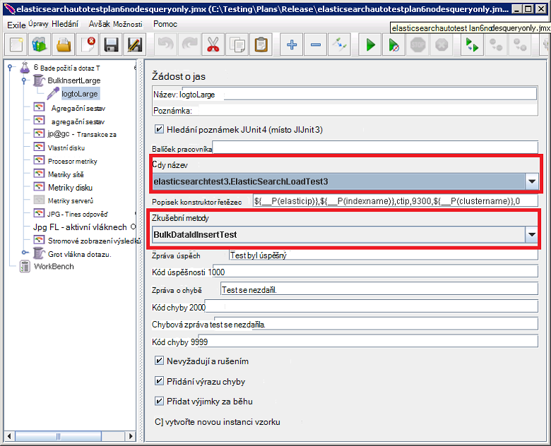

<properties
   pageTitle="Spuštění automatické testů výkonu Elasticsearch | Microsoft Azure"
   description="Popis spouštění testy výkonu ve vlastní prostředí."
   services=""
   documentationCenter="na"
   authors="dragon119"
   manager="bennage"
   editor=""
   tags=""/>

<tags
   ms.service="guidance"
   ms.devlang="na"
   ms.topic="article"
   ms.tgt_pltfrm="na"
   ms.workload="na"
   ms.date="09/22/2016"
   ms.author="masashin"/>
   
# <a name="running-the-automated-elasticsearch-performance-tests"></a>Spuštění automatické testů Elasticsearch výkonu

[AZURE.INCLUDE [pnp-header](../../includes/guidance-pnp-header-include.md)]

Tento článek je [součástí řady](guidance-elasticsearch.md). 

Dokumenty [optimalizace dat požití výkon Elasticsearch na Azure] a [agregace dat optimalizace a výkonu dotazu pro Elasticsearch na Azure] popisují číslo zkoušek spuštěné proti clusteru Elasticsearch vzorku.

Tyto testy byly skriptovány povolit, aby spustit automatické způsobem. Tento dokument popisuje, jak můžete zopakovat testů ve vlastní prostředí.

## <a name="prerequisites"></a>Zjistit předpoklady pro

Automatické testy vyžadují následující položky:

-  Elasticsearch obrázku.

- Nastavení prostředí JMeter podle popisu v dokumentu [vytváření výkonu testovací prostředí pro Elasticsearch na Azure].

- V předloze JMeter OM nainstalovaný [Python 3.5.1](https://www.python.org/downloads/release/python-351/) .


## <a name="how-the-tests-work"></a>Fungování testů
Testů se mají spustit pomocí JMeter. Hlavní server JMeter načte testovací plán a předá sadu JMeter podřízené servery, které skutečně spuštění testů. Hlavní server JMeter souřadnic podřízené servery JMeter a sečteny výsledky.

Jsou k dispozici následující testovací plán:

* [elasticsearchautotestplan3nodes.jmx](https://github.com/mspnp/azure-guidance/blob/master/ingestion-and-query-tests/templates/elasticsearchautotestplan3nodes.jmx). Požití test prochází přes 3 uzel obrázku.

* [elasticsearchautotestplan6nodes.jmx](https://github.com/mspnp/azure-guidance/blob/master/ingestion-and-query-tests/templates/elasticsearchautotestplan6nodes.jmx). Požití test prochází přes 6 uzel obrázku.

* [elasticsearchautotestplan6qnodes.jmx](https://github.com/mspnp/azure-guidance/blob/master/ingestion-and-query-tests/templates/elasticsearchautotestplan6qnodes.jmx). Požití a dotaz test prochází přes 6 uzel obrázku.

* [elasticsearchautotestplan6nodesqueryonly.jmx](https://github.com/mspnp/azure-guidance/blob/master/ingestion-and-query-tests/templates/elasticsearchautotestplan6nodesqueryonly.jmx). Test jen dotazu prochází přes 6 uzel obrázku.


Pomocí těchto testování plány jako základ pro vlastní scénáře v případě potřeby méně nebo více uzlů.

Plány test žádost o vzorník JUnit umožňuje generovat a nahrajte testovací data. Testovací plán JMeter vytvoří a spustí tento vzorník a sleduje všech uzlech Elasticsearch pro data o výkonu.  

## <a name="building-and-deploying-the-junit-jar-and-dependencies"></a>Vytvoření a nasazení JUnit JAR a závislosti
Před spuštěním testy výkonu, které byste měli stáhnout, kompilaci a nasazení JUnit testů nachází ve složce výkonu/junitcode. Tyto testy odkazují JMeter testovací plán. Další informace najdete v tématu Postup "Import existujícího projektu test JUnit zatmění" v dokumentu [nasazení JMeter JUnit vzorkování testování Elasticsearch výkonu].

Existují dvě verze testů JUnit: 

- [Elasticsearch1.73](https://github.com/mspnp/azure-guidance/tree/master/ingestion-and-query-tests/junitcode/elasticsearch1.73). Tento kód použijte k provádění testů požití. Tyto testy pomocí Elasticsearch 1,73.

- [Elasticsearch2](https://github.com/mspnp/azure-guidance/tree/master/ingestion-and-query-tests/junitcode/elasticsearch2). Tento kód použijte k provádění testů dotazu. Tyto testy pomocí Elasticsearch 2.1 a novější.

Zkopírujte příslušný soubor archivu (SKLENICE) Java spolu s zbytek závislosti JMeter počítačích. Při [nasazení JMeter JUnit vzorkování testování Elasticsearch výkonu][]je popsán postup. 

> **Důležité** Po zavedení testu JUnit, použijte JMeter zavádění a konfigurace test plánů, které odkazují na tento test JUnit a zajistit, že skupině podproces BulkInsertLarge odkazuje správný SKLENICE soubor, název třídy JUnit a zkušební metody:
> 
> 
> 
> Uložte aktualizovaný test plány před spuštěním testů.

## <a name="creating-the-test-indexes"></a>Vytváření indexů test
Každý test provádí požití a/nebo dotazů jeden rejstřík zadané při spuštění test. Měli byste vytvořit index použití schémat podle příloh dokumentů [optimalizace dat požití výkon Elasticsearch na Azure] a [agregace dat optimalizace a výkonu dotazu pro Elasticsearch na Azure] a konfigurace podle test nefunguje (doc hodnoty povolit nebo zakázat, více replikách atd.) Všimněte si, že test plány Předpokládejme, že index obsahuje jeden typ s názvem *ctip*.

## <a name="configuring-the-test-script-parameters"></a>Konfigurace parametry skriptu test
Zkopírujte následující test skript parametr JMeter serveru počítače:

* [run.properties](https://github.com/mspnp/azure-guidance/blob/master/ingestion-and-query-tests/run.properties). Tento soubor Určuje počet JMeter test vláken, dobu trvání test (v sekundách), IP adresu uzel (nebo Vyrovnávání zatížení clusteru Elasticsearch) a název clusteru:

  ```ini
  nthreads=3
  duration=300
  elasticip=<IP Address or DNS Name Here>
  clustername=<Cluster Name Here>
  ```
  
  Upravit tento soubor a zadejte příslušné hodnoty pro test a obrázku.

* [dotaz konfigurace Win](https://github.com/mspnp/azure-guidance/blob/master/ingestion-and-query-tests/query-config-win.ini) a [dotaz konfigurace nix.ini](https://github.com/mspnp/azure-guidance/blob/master/ingestion-and-query-tests/query-config-nix.ini). Tyto dva soubory obsahují stejné informace; soubor *win* zformátována pro názvy souborů systému Windows a cest a soubor *nix* zformátována Linux názvy souborů a cest:

  ```ini
  [DEFAULT]
  debug=true #if true shows console logs.

  [RUN]
  pathreports=C:\Users\administrator1\jmeter\test-results\ #path where tests results are saved.
  jmx=C:\Users\administrator1\testplan.jmx #path to the JMeter test plan.
  machines=10.0.0.1,10.0.0.2,10.0.0.3 #IPs of the Elasticsearch data nodes separated by commas.
  reports=aggr,err,tps,waitio,cpu,network,disk,response,view #Name of the reports separated by commas.
  tests=idx1,idx2 #Elasticsearch index(es) name(s) to test, comma delimited if more than one.
  properties=run.properties #Name of the properties file.
  ```

  Upravit tento soubor umístění výsledky testů název testovací plán JMeter spustíte IP adresy uzlů Elasticsearch dat, které shromažďujete měřítka, zprávy obsahující nezpracovanými výkonu data, která bude vytvořen a název (nebo názvy oddělený středníkem) z index(es) zkoušený, pokud víc , testů se spustí jeden po druhém. Pokud run.properties soubor uložený v adresáře nebo jinou složku, zadejte úplnou cestu k souboru.

## <a name="running-the-tests"></a>Spuštění testů

* Zkopírujte soubor [test.py dotazu](https://github.com/mspnp/azure-guidance/blob/master/ingestion-and-query-tests/query-test.py) do počítače serveru JMeter, do stejné složky jako run.properties a soubory (dotazu nix.ini konfigurace) dotazu konfigurace Win.

* Zajištění jmeter.bat (Windows) nebo jmeter.sh (Linux) na spustitelný cestě ve vašem prostředí.

* Spusťte dotaz test.py skript z příkazového řádku k provádění testů:

  ```cmd
  py query-test.py
  ```

* Po dokončení testu výsledky jsou uloženy sadu hodnotami oddělenými čárkou hodnot zadaných v souboru dotazu Win konfigurace (dotazu nix.ini konfigurace) souborů (CSV). Excel umožňuje analyzovat a grafu tato data.


[Ladění výkonu požití dat pro Elasticsearch na Azure]: guidance-elasticsearch-tuning-data-ingestion-performance.md
[Optimalizace slučování dat a výkonu dotazu pro Elasticsearch na Azure]: guidance-elasticsearch-tuning-data-aggregation-and-query-performance.md
[Vytváření výkonu testování prostředí pro Elasticsearch na Azure]: guidance-elasticsearch-creating-performance-testing-environment.md
[Nasazení JMeter JUnit vzorkování testování Elasticsearch výkonu]: guidance-elasticsearch-deploying-jmeter-junit-sampler.md
