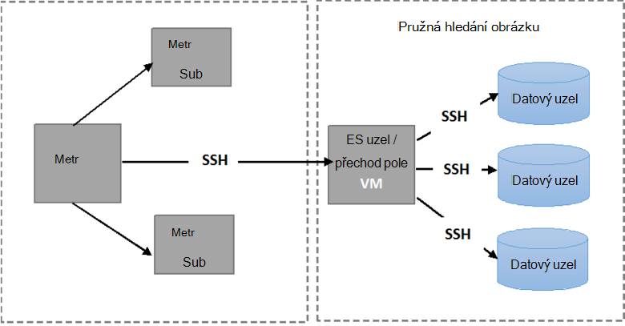

<properties
   pageTitle="Spuštění automatické testů odolnost proti chybám Elasticsearch | Microsoft Azure"
   description="Popis spouštění odolnost srovnává vlastní prostředí."
   services=""
   documentationCenter="na"
   authors="dragon119"
   manager="bennage"
   editor=""
   tags=""/>

<tags
   ms.service="guidance"
   ms.devlang="na"
   ms.topic="article"
   ms.tgt_pltfrm="na"
   ms.workload="na"
   ms.date="09/22/2016"
   ms.author="masashin"/>

# <a name="running-the-automated-elasticsearch-resiliency-tests"></a>Spuštění automatické testů odolnost proti chybám Elasticsearch

[AZURE.INCLUDE [pnp-header](../../includes/guidance-pnp-header-include.md)]

Tento článek je [součástí řady](guidance-elasticsearch.md).

[Konfigurace odolnost]a obnovení na Elasticsearch na Azure[elasticsearch-resilience-recovery], jsme popsané řadu testů, které byly provedeny proti clusteru Elasticsearch vzorku a zjistit, jak dobře systému odpovědi na některé běžné formuláře selhání a jak ji obnovit. Aby mohli provádět automatické způsobem byly skriptovány testů. Tento dokument popisuje, jak můžete zopakovat testů ve vlastní prostředí. 

Byly test následujících situacích:

- **Selhání uzlu a znovu ho spusťte bez ztráty dat**. Uzel data ukončení a restartování po zabere 5 minut.
Elasticsearch nakonfigurovanou není přerozdělit chybějící shards v tomto intervalu, takže žádné další vstupu a výstupu vzniklé v shards manipulace. Po restartování uzel procesu obnovení přináší shards na uzel zpět aktuální.

- **Selhání uzlu se ztrátou katastrofické data**. Přerušili uzel dat a dat, která obsahuje vymazání tak, aby napodobily selhání katastrofické disku. Uzel klepněte restartování (po 5 minut) efektivně budou sloužit jako náhrady samolepicích uzel původní. Proces obnovení vyžaduje opětovné vytvoření chybějící data pro tento uzel a může zahrnovat přemístění shards, které jsou uložené v jiných uzlů.

- **Selhání uzlu a znovu ho spusťte bez ztráty dat, ale s shard rozdělení**. Přerušili uzel dat a shards, které obsahuje jsou přidělit ostatních uzlů. Klepněte restartování uzel a další rozdělení se vyskytuje vyrovnání clusteru.

- **Postupné aktualizace**. Každý uzel clusteru je zastaveno a Nerestartuje po uplynutí krátkého časového intervalu tak, aby napodobily počítačích restartování po aktualizaci. Pouze jeden uzel se zastaví v daném čase.
Shards nejsou znovu přidělit při uzel dolů.

## <a name="prerequisites"></a>Zjistit předpoklady pro

Automatické testy vyžadují následující položky:

- Elasticsearch obrázku.

- Nastavení prostředí JMeter popsanou [výkonu testování pokyny]. 

- Následující položky na hlavní OM JMeter pouze nainstalovaný.

    - Java Runtime 7.

    - Nodejs 4.x.x nebo novější.

    - Přepínač příkazového řádku nástroje libovolná.

## <a name="how-the-scripts-work"></a>Fungování skriptů

Test skripty jsou určeny dělat OM JMeter předlohy. Po výběru testu spustit skripty popisují, jak následující posloupnost operací

1.  Spusťte testovací plán JMeter předávání parametrů, které jste zadali.

2.  Zkopírujte skript, který provádí operace vyžadované test má zadaný OM clusteru. Pokud jste vytvořili pomocí [šablony rychlý úvod Azure Elasticsearch](https://github.com/Azure/azure-quickstart-templates/tree/master/elasticsearch)clusteru to může být OM, který má veřejnou IP adresu nebo OM *Jumpbox* .

3.  Spusťte skript na OM (nebo Jumpbox).

Následující obrázek znázorňuje strukturu testovacím prostředí a Elasticsearch obrázku. Poznámka: skripty test používaný zabezpečené prostředí (SSH) pro připojení k jednotlivých uzlech clusteru provádět různé Elasticsearch operací, jako je zastavení nebo restartováním uzel.



## <a name="setting-up-the-jmeter-tests"></a>Nastavení JMeter testuje

Před systém odolnost testuje by měl kompilaci a nasazení JUnit testů nachází ve složce odolnost proti chybám/jmeter/testů. Tyto testy odkazují JMeter testovací plán. Další informace najdete v tématu Postup "Import existujícího projektu test JUnit zatmění" při [nasazení JMeter JUnit vzorkování testování Elasticsearch výkonu][].

Existují dvě verze JUnit testů v následujících složkách:

- **Elasticsearch17.** Projekt v této složce vytvoří soubor Elasticsearch17.jar. Pomocí této SKLENICE testování Elasticsearch verze 1.7.x

- **Elasticsearch20**. Projekt v této složce vytvoří soubor Elasticsearch20.jar. Pomocí této SKLENICE testování Elasticsearch verze 2.0.0 a v novějších verzích

Zkopírujte příslušný soubor SKLENICE spolu s zbytek závislosti do počítače JMeter. Proces je popsán postup "Nasazení řízení podnikových JUnit test má JMeter" ve [nasazení JMeter JUnit vzorkování testování Elasticsearch výkon].

## <a name="configuring-vm-security-for-each-node"></a>Konfigurace OM zabezpečení pro každý uzel

Test skripty vyžadují instalaci ověřovací certifikát v jednotlivých uzlech Elasticsearch clusteru. Díky skripty automaticky spouštět bez zobrazení dotazu k zadání uživatelského jména a hesla, jak se připojit k různým VMs.

Začněte tím, že přihlášení do jednoho z uzlů v Elasticsearch obrázku (nebo OM Jumpbox) a potom spusťte tento příkaz Generovat ověřovací klíč:

```Shell
ssh-keygen -t rsa
```

Při připojení k uzel Elasticsearch (nebo Jumpbox), spusťte následující příkazy pro každý uzel v he Elasticsearch obrázku. Nahrazení `<username>` s názvem platný uživatel na každém OM a nahradit `<nodename>` s názvem DNS nebo IP adresu OM hostingu uzel Elasticsearch.
Všimněte si, že budete vyzváni k zadání hesla uživatele při spuštění tyto příkazy.
Další informace najdete v článku [přihlášení SSH bez hesla](http://www.linuxproblem.org/art_9.html):

```Shell
ssh <username>@<nodename> mkdir -p .ssh (
cat .ssh/id\_rsa.pub | ssh <username>*@<nodename> 'cat &gt;&gt; .ssh/authorized\_keys'
```

## <a name="downloading-and-configuring-the-test-scripts"></a>Stažení a konfigurace skripty test

Test skripty jsou k dispozici v úložišti libovolná. Pomocí následujícího postupu můžete stáhnout a nakonfigurovat skriptů.

Na počítači předlohy JMeter místo, kam se spustí testů otevřete okno plochy libovolná (libovolná flám) a klonovat úložiště, který obsahuje tyto skripty následujícím způsobem:

```Shell
git clone https://github.com/mspnp/azure-guidance.git
```

Přejděte do složky odolnost proti chybám testů a spusťte tento příkaz nainstalovat závislosti potřebné ke spuštění testů:

```Shell
npm install
```

Pokud předloha JMeter běží v systému Windows, stáhněte si [Plink](http://www.chiark.greenend.org.uk/~sgtatham/putty/download.html), tedy rozhraní příkazového řádku pro klienta nátěrové Telnet. Spustitelný Plink kopírovat do složky odolnost proti chybám testů nebo knihovny.

Pokud předloha JMeter běží na Linux, nemusíte stahovat Plink ale budete muset konfigurace heslo bez SSH mezi hlavním JMeter a Elasticsearch uzel nebo Jumpbox jste použili pomocí následujících kroků uvedených v postupu "Konfigurace OM zabezpečení pro každý uzel." 

Upravit následujících parametrů konfigurace v `config.js` souboru, aby odpovídaly testovacím prostředí a Elasticsearch obrázku. Tyto parametry jsou společná pro všechny testů:

| Jméno | Popis | Výchozí hodnota |
| ---- | ----------- | ------------- |
| `jmeterPath` | Místní cestu k umístění JMeter. | `C:/apache-jmeter-2.13` |
| `resultsPath` | Kde skript vypíše výsledek relativní adresář. | `results` |
| `verbose` | Označuje, zda skript výstupy v režimu s komentářem nebo ne. | `true` |
| `remote` | Označuje, zda testů JMeter spustit místní nebo vzdálené serverech. | `true` |
| `cluster.clusterName` | Název Elasticsearch obrázku. | `elasticsearch` |
| `cluster.jumpboxIp`         | IP adresu počítače Jumpbox.                 |-|
| `cluster.username`          | Správce uživatel, který jste vytvořili při nasazování clusteru. |-|
| `cluster.password`          | Heslo pro správu uživatelů.                        |-|
| `cluster.loadBalancer.ip`   | IP adresy služby Vyrovnávání zatížení Elasticsearch.    |-|
| `cluster.loadBalancer.url`  | Základní adresu URL Vyrovnávání zatížení                          |-|

## <a name="running-the-tests"></a>Spuštění testů

Přejděte do složky odolnost proti chybám testů a spusťte tento příkaz:

```Shell
node app.js
```

Následující nabídky objevit:


Zadejte počet scénář, který chcete spustit: `11`, `12`, `13` nebo `21`. 

Po výběru situace test se spustí automaticky. Výsledky jsou uloženy jako sady textový soubor s oddělovači (CSV) soubory ve složce vytvořené v adresáři výsledky. Každé spuštění obsahuje vlastní složka výsledků.
Excel umožňuje analyzovat a tato data grafu.

[Running Elasticsearch on Azure]: guidance-elasticsearch-running-on-azure.md
[Tuning Data Ingestion Performance for Elasticsearch on Azure]: guidance-elasticsearch-tuning-data-ingestion-performance.md
[testování pokyny výkonu]: guidance-elasticsearch-creating-performance-testing-environment.md
[JMeter guidance]: guidance-elasticsearch-implementing-jmeter.md
[Considerations for JMeter]: guidance-elasticsearch-deploying-jmeter-junit-sampler.md
[Query aggregation and performance]: guidance-elasticsearch-query-aggregation-performance.md
[elasticsearch-resilience-recovery]: guidance-elasticsearch-configuring-resilience-and-recovery.md
[Resilience and Recovery Testing]: guidance-elasticsearch-running-automated-resilience-tests.md
[Nasazení JMeter JUnit vzorkování testování Elasticsearch výkonu]: guidance-elasticsearch-deploying-jmeter-junit-sampler.md
