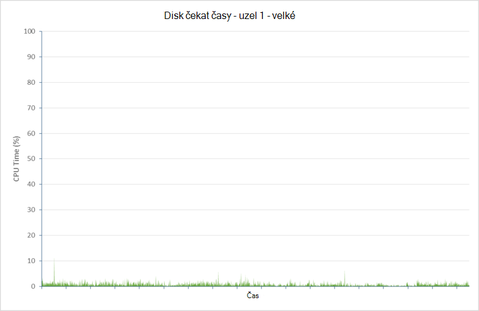

<properties
   pageTitle="Ladění výkonu požití dat pro Elasticsearch na Azure | Microsoft Azure"
   description="Postup pro zvýšení výkonu požití dat s Elasticsearch na Azure."
   services=""
   documentationCenter="na"
   authors="dragon119"
   manager="bennage"
   editor=""
   tags=""/>

<tags
   ms.service="guidance"
   ms.devlang="na"
   ms.topic="article"
   ms.tgt_pltfrm="na"
   ms.workload="na"
   ms.date="09/22/2016"
   ms.author="masashin"/>

# <a name="tuning-data-ingestion-performance-for-elasticsearch-on-azure"></a>Ladění výkonu požití dat pro Elasticsearch na Azure

[AZURE.INCLUDE [pnp-header](../../includes/guidance-pnp-header-include.md)]

Tento článek je [součástí řady](guidance-elasticsearch.md). 

## <a name="overview"></a>Základní informace

Důležitým aspektem při vytváření jakékoli hledání databáze je určit nejlepší způsob, jak strukturovat systému jedí vyhledávání dat rychle a efektivně. Co byste měli zvážit kolem tohoto požadavku na týkají nejen škálu infrastruktury, na které můžete provádět, ale taky různé optimalizace používající zajistit, že systému můžete zachovávat očekávané úrovní dat přílivu. 

Tento dokument popisuje možnosti nasazení a konfiguraci, které byste měli zvážit pro provádění Elasticsearch obrázku, který očekává vysoká rychlost požití data. Zajistit souvislá data pro účely příkladů tento dokument taky zobrazuje výsledky porovnávání různých konfigurací pomocí jednoduchého velkých objemů dat požití úlohu. Podrobnosti o pracovní zátěž jsou popsány v [dodatku](#appendix-the-bulk-load-data-ingestion-performance-test) na konci tohoto dokumentu.

Účel parametry byl generovat absolutní hodnoty pro spuštění Elasticsearch nebo dokonce doporučovat konkrétní topologie, ale raději ke znázornění metody, které můžete použít pro vyhodnocování výkonu, pro změnu velikosti datových uzlů a provádění clusterů vyhovujících požadavcích výkonu. 

Když pro změnu velikosti vlastní systémy, je důležité otestovat výkonu důkladně podle vlastního pracovního vytížení. Shromážděte telemetrie, který umožňuje získat informace o konfiguraci optimální hardwaru používat a vodorovné měřítka faktory, které byste měli zvážit. Zejména postupujte následujícím způsobem:

- Zvažte celkovou velikost datové odeslané a nejen počet položek v žádosti o každé hromadné vložit. Menší počet velké hromadné položky v každém požadavku může být vhodnější než větší číslo, v závislosti na zdroj k dispozici zpracuje každou žádost.

Můžete sledovat efekty různé žádosti o vložení hromadně pomocí [Marvel](https://www.elastic.co/products/marvel), pomocí *readbytes*/*writebytes* vstupu a výstupu čítače s [JMeter](https://jmeter.apache.org/)a operační systém nástroje například *iostat* a *vmstat* na systémem Ubuntu. 

- Vedení testování výkonu a shromáždění telemetrie zpracování míra procesoru a době čekání vstupu a výstupu, latence disku, výkonu a doby odezvy. Tyto informace pomáhají určit potenciálních problémů a hodnotit náklady a výhody používání premium úložiště. Mějte využití procesoru a disku nemusí se i přes všech uzlů v závislosti na způsobu shards a repliky jsou rozvržena obrázku (některé uzly může obsahovat více shards než jiné).

- Zvažte jak počet souběžně prováděné žádosti o vaší pracovní zátěž bude rozvržena clusteru a posoudit dopad zpracování pracovního vytížení pomocí různý počet uzlů.

- Zvažte jak pracovního vytížení rozrůstat jako firmy rozbalí. Zvažte dopad růstu tento o nákladech VMs a úložiště používaný uzlů.

- Rozpoznat, že clusteru pomocí většího počtu uzlů s běžná disků může být výhodnější Pokud nefunguje vyžaduje velké množství žádosti a infrastruktury disku udržuje výkon, která vyhovuje požadavkům vaší smlouvy o úrovni služeb (rozsahu). Zvýšení počtu uzlů může způsobovat režijních v podobě další komunikaci mezi uzel a synchronizace.

- Porozumět tomu, že vyšší počet jádra na uzel může způsobit další disku komunikace více dokumentů můžete zpracování. V tomto případě změřte disku využití k posouzení, zda podsystém vstupu a výstupu může stát se jejím kritický bod a určit výhody používání premium úložiště.

- Otestujte a analyzovat střídání s vyšším číslem uzlů s méně jádra versus méně uzly s více jádra. Mějte na paměti, že zvýšení počtu replik rozšíří požadavky na clusteru a může vyžadovat přidání uzlů.

- Zvažte, zda pomocí dočasné disků může vyžadují, aby indexy má být vrácena častěji.

- Míra hlasitost využití k posouzení kapacity a v části využití úložiště. Například v našem případě jsme uložené 1,5 miliard dokumentů pomocí 350GB úložiště.

- Změřte přenos sazby pro svého pracovního vytížení a zvažte vzdálenost jste pravděpodobnost získání celkového vstupu a výstupu sazba přenos mezní hodnoty u žádného účtu dané úložiště, ve které jste vytvořili virtuálních disků.

## <a name="node-and-index-design"></a>Návrh uzel a rejstřík

V systému, který podporuje požití ve velkém rozsahu dat požádejte na následující otázky:

- **Rychlé posunete nebo relativně statická jsou data?** Čím víc dynamických dat, tím větší údržba nároky pro Elasticsearch. Pokud je replikovat data, je každého otevřené synchronní zachovány. Přesunutí rychlé data, která má jenom omezenou životnost nebo, můžete snadno být nepřijímal můžou využívat zakázání replikace úplně odebrat. Tato možnost je popsáno v části [Optimalizace ve velkém rozsahu dat požití.](#tuning-large-scale-data-ingestion)

- **Jak aktuální požadujete data někdo zjistí hledáním?** Pokud chcete zachovat výkonu, Elasticsearch vyrovnávací paměti neomezené množství dat v paměti může. To znamená, že všechny změny okamžitého hledání žádosti. Proces, který Elasticsearch slouží k zachování změny a zpřístupnit je popsán v [Vytvoření trvalé změny](https://www.elastic.co/guide/en/elasticsearch/guide/current/translog.html#translog). 

    Data kurzu viditelná podléhá *aktualizace\_interval* nastavení relevantní indexu. Ve výchozím nastavení tento interval nastavenou na 1 druhé. Však nemusí být vždy situace vyžaduje aktualizuje to rychle problémy. Například indexy zaznamenání údajů o protokolu potřebovat čelit rychlé a nepřetržitého přílivu informace, které je potřeba požití rychle, ale není nutné zadávat informace, které mají být ihned dotazování. V tomto případě zmenšete frekvenci aktualizací. Tato funkce je také popsány v části [Optimalizace ve velkém rozsahu dat požití.](#tuning-large-scale-data-ingestion)

- **Jak rychle jsou pravděpodobně postupně se zvětšují data?** Kapacita Index je určena počet shards zadané při vytváření rejstříku. Umožňuje pro růst zadejte číslo odpovídající shards (výchozí hodnota je pět). Pokud původně vytvoření indexu v jediném všech pět shards bude nacházet v daném uzlu, ale podle objemu dat roste další uzly lze přidat a Elasticsearch dynamicky distribuce shards mezi uzly. Každý shard má však režijních. Všechny vyhledávání v indexu bude dotazu všechny shards, takže vytváření velkého počtu shards pro malou část dat můžete zpomalovat načtení dat (vyhnout scénář [Kagillion shards](https://www.elastic.co/guide/en/elasticsearch/guide/current/kagillion-shards.html) )

    Některé úloh (třeba protokolování) můžete vytvořit nový index každý den a zjistíte, že počet shards nestačí objemu dat, změňte ji před další indexování (existující indexy, zůstanou beze změn). Pokud je nutné distribuovat existujících dat přes další shards, jednou z možností je indexaci informace. Vytvořit nový index s příslušnou konfiguraci a zkopírujte data do ní. Tento proces můžete být průhledné aplikacím pomocí [aliasů index](https://www.elastic.co/guide/en/elasticsearch/reference/current/indices-aliases.html).

- **Data musím rozdělit na oddíly mezi uživateli ve scénáři multitenancy?** Můžete vytvořit samostatné indexy pro každého uživatele, ale může to být drahé pokud každý uživatel obsahuje jenom střední množství dat. Místo toho zvažte vytvoření [sdíleného indexy](https://www.elastic.co/guide/en/elasticsearch/guide/current/shared-index.html) a umožňuje [aliasy podle filtry](https://www.elastic.co/guide/en/elasticsearch/guide/current/faking-it.html) směrovat požadavky uživatelská data. Mějte data pro uživatele společném stejné shard, přepište výchozí směrování konfiguraci funkcí index a směrování dat na základě některých identifikační atributu uživatele.

- **Jsou data dlouho nebo krátkodobý?** Pokud používáte sadu Azure VMs implementovat Elasticsearch obrázku, můžete na disk systém místních zdrojů, nikoli připojenou jednotku ukládat dočasné data.
Použití OM SKU využívajícího SSD disku zdroje můžete zlepšit výkon vstupu a výstupu. Všechny informace uskutečňuje na disku zdroje je však dočasný a může dojít ke ztrátě, pokud OM restartuje (naleznete v části když bude Data na a dočasné jednotka být ztracený porozumět tomu, [dočasné jednotka na virtuálních počítačích Microsoft Azure](http://blogs.msdn.com/b/mast/archive/2013/12/07/understanding-the-temporary-drive-on-windows-azure-virtual-machines.aspx) další podrobnosti). Pokud potřebujete uchovávání dat mezi restartování, vytvořte disků datového podržte tyto informace a připojíte v angličtině.

- **Jak aktivní jsou data?** Azure VHD se vztahují omezení Pokud výši pro čtení i zápis aktivity překročí zadané parametry (aktuálně 500 vstupní a výstupní operace za sekundu (procesorů) disku připojeného k standardní OM osy a 5000 procesorů Premium úložiště disku). 

    Snížit šanci omezení a zvýšit výkon vstupu a výstupu, zvažte vytvoření více disků dat pro každou OM a nakonfigurujte Elasticsearch datový pruh v těchto discích podle popisu v tématu [Systémové požadavky disku a souborů](guidance-elasticsearch-running-on-azure.md#disk-and-file-system-requirements).

    Vyberete hardwarová konfigurace, která vám pomůže minimalizovat počet disku vstupu a výstupu jen pro čtení operace zajistit, aby byl k dispozici pro data v mezipaměti často přistupovat dostatek paměti. To je popsáno v části [paměti požadavky](guidance-elasticsearch-running-on-azure.md#memory-requirements) systém Elasticsearch na Azure.

- **Jaký druh pracovní zátěž jednotlivých uzlech potřebovat podporuje?** Elasticsearch výhody ušetřil práci paměti mezipaměti dat (v podobě mezipaměť systému souborů) a haldě JVM podle popisu v části [paměti požadavky na](guidance-elasticsearch-running-on-azure.md#memory-requirements) systém Elasticsearch na Azure. 

    Velikost paměti počet jádra procesoru a počet dostupných disků jsou nastavil SKU virtuální počítač. Další informace najdete v tématu [Ceny virtuálních počítačích](http://azure.microsoft.com/pricing/details/virtual-machines/) na Azure webu.

### <a name="virtual-machine-options"></a>Možnosti virtuálního počítače

Můžete vytvořit VMs v Azure pomocí několika různých skladové jednotky. Materiály k dispozici pro Azure OM, závisí na SKU vybrané. Každý SKU nabízí různé kombinaci jádra paměti a úložiště. Potřebujete vyberte odpovídající velikost OM, který bude řešit očekávaného zatížení ale, která budou také efektivní.
Začněte s konfigurací splňující požadavky na váš aktuální (provést porovnávání otestujete tak, jak je popsáno dále v tomto dokumentu). Clusteru je možné přizpůsobit později přidáním dalších VMs systém Elasticsearch uzlů.

[Velikost virtuálních počítačích](../virtual-machines/virtual-machines-linux-sizes.md) na Azure webu dokumenty různé možnosti a skladové jednotky k dispozici pro VMs.

Velikost a zdroje OM roli, která bude provádět uzly spuštěných OM by měly odpovídat.

Pro uzel dat:

- Přidělit až 30 GB nebo 50 % dostupné paměti RAM pro Java haldy, podle toho, co je nižší. Nechte zbytek operačního systému pro ukládání souborů. Pokud používáte Linux, můžete určit množství paměti pro haldě Java nastavením ES\_HALDY\_proměnné velikosti před spuštěním Elasticsearch. Můžete taky Pokud používáte Windows nebo Linux, můžete stanovit velikosti paměti s parametry *Xmx* a *Xms* při spuštění Elasticsearch.

    V závislosti na pracovní zátěž nemusí být méně velké VMs jako efektivní výkon jako je použití většího počtu vzhled velikosti VMs. By měl provádění testů, které můžete změřit nevýhody mezi další v síti a údržba souvisejících versus náklady zvětšení počet jádra k dispozici a konflikty omezená disk v jednotlivých uzlech.

- Použití premium úložiště pro ukládání dat Elasticsearch. To je podrobněji v části [Možnosti ukládání](#storage-options) .

- Použití několika disků stejných dat velikost a pruh v těchto discích. SKU vaší VMs bude určovat maximální počet disků dat, které můžete připojit. Další informace najdete v tématu [Systémové požadavky disku a souborů](guidance-elasticsearch-running-on-azure.md#disk-and-file-system-requirements).

- Procesor SKU více core pomocí alespoň na úrovni 2 jádra nejlépe 4 nebo další. 

Pro klienta uzel:

- Není přidělit místa na disku pro Elasticsearch dat, vyhrazené klienti neukládají dat na disku.

- Ujistěte se, že není k dispozici pro zpracování pracovního vytížení odpovídající paměti. Hromadné vložení požadavky se budou číst do paměti před data odesílaného do různých uzlů dat a výsledky agregace a dotazy jsou shrnuty v paměti před vrácením ke klientské aplikaci. Testu výkonnosti vlastní pracovního vytížení a sledovat využití paměti pomocí nástroje Marvel ATP vrácené pomocí *uzel/stat* rozhraní API [JVM informace](https://www.elastic.co/guide/en/elasticsearch/guide/current/_monitoring_individual_nodes.html#_jvm_section) (`GET _nodes/stats`) k posouzení optimální požadavky.  Zejména sledovat *haldy\_používá\_procent* metrických pro každý uzel a cílem jak udržet velikost haldy pod 75 % dostupný prostor.

- Zajištění k dispozici pro příjem a zpracování očekávaný objem žádosti o dostatečné jádra procesoru.
Požadavky jsou ve frontě a jsou doručeny před zpracování objemu položky, které můžete ve frontě je funkce počet procesoru jádra v jednotlivých uzlech. Délka fronty můžete sledovat pomocí data v vrácené pomocí uzel/stat rozhraní API [fondu podprocesů informace](https://www.elastic.co/guide/en/elasticsearch/guide/current/_monitoring_individual_nodes.html#_threadpool_section) . 

    Pokud počet *Odmítnuto* fronty označuje jsou zamítnutí žádosti o, tento údaj označuje, že je clusteru začali kritické. To může být kvůli šířky pásma procesoru může být také další faktory například nedostatku paměti nebo snížení výkonu vstupu a výstupu, ale tak tyto informace použít společně s statistiky ostatních vám pomohou zjistit příčinu kořenové.

    Uzlů klientů může nebo nemusí být nutné, v závislosti na vaší úloh. Data požití úloh mají není využívat pomocí vyhrazené klienty, že některé vyhledávání a agregace mohlo by umožnit spuštění rychleji. Připravte se na testu výkonnosti vlastní scénáře.

    Uzlů klientů jsou užitečné především pro aplikace, které pomocí rozhraní API klienta přenosu se připojujete k clusteru. Můžete taky použít rozhraní API klienta uzel dynamicky vytvoří vyhrazené klient pro aplikaci a používání zdrojů hostitelské prostředí aplikace. Pokud aplikace používají rozhraní API uzel klienta, pak nemusí být nutné pro svůj cluster má být uzlů předkonfigurované vyhrazené klientů. 
    
    Ale mějte na paměti, že uzel vytvořené pomocí rozhraní API uzel klienta je členem clusteru prvotřídní a jako takové účastní chatter sítě s ostatními uzly. Často spuštění a ukončení uzlů klientů můžete vytvořit nepotřebných šum mezi celého obrázku.

Pro předlohy uzel:

- Není přidělit místa na disku pro Elasticsearch dat, vyhrazené předlohy uzly neukládejte data na disku.

- Požadavky na procesor by měl být minimální.

- Požadavky na paměti, závisí na velikosti clusteru. Informace o stavu clusteru zůstane v paměti. Malé clusterů je minimální velikost paměti povinné, ale pro velké a vysoce aktivní cluster kde indexy jsou vytvářeny často a shards manipulace, množství informací o stavu můžete postupně se zvětšují výrazně. Sledujte velikost haldy JVM a zjistit, jestli budete muset přidat víc paměti.

> [AZURE.NOTE]Clusteru spolehlivost vždy vytvořit více předloh uzlů and configure zbývající uzly chcete-li předejít pravděpodobnost výskytu mozku rozdělení. V ideálním případě je třeba liché číslo předlohy uzlů. Toto téma se podrobněji píše v [odolnost konfigurace a obnovení na Elasticsearch na Azure][].

### <a name="storage-options"></a>Možnosti ukládání

Na VMs Azure různých střídání vliv na výkon, dostupnost a obnovení, které byste měli myslet pečlivě náklady jsou k dispozici řadu možností ukládání.

Všimněte si, že by měl uložíte Elasticsearch data na vlastní datové discích.  To vám pomůže snížit konflikty s operačním systémem a ujistěte se, že velkých objemů v/v Elasticsearch není soutěží s funkcemi operační systém na vstupu a výstupu zdroje.

Azure disků se vztahují omezení výkonu. Pokud zjistíte, že clusteru projde pravidelných roztržení aktivity může požadavky v/v omezena. K tomu nedocházelo, ladění návrhu vyrovnání velikost dokumentu v Elasticsearch proti objemu požadavky pravděpodobně získali při každém disku.

Disků založené na standardní úložiště podporují maximální žádost výši 500 procesorů že disků podle premium úložiště mohou pracovat až 5 000 procesorů, v závislosti na velikosti disků data. Disků Premium úložiště jsou dostupné jenom pro Pošta a GS řadu VMs. Maximální disku procesorů velikostí OM najdete v části [velikost virtuálních počítačích v Azure](../virtual-machines/virtual-machines-linux-sizes.md). Výkon premium úložiště je určený podle velikosti OM společně s přidělení velikosti disku. Další informace najdete v tématu [Premium úložiště: výkonné úložiště pro Azure virtuálního počítače úloh](../storage/storage-premium-storage.md).

**Trvalý dat disků**

Trvalý dat disků jsou VHD, které jsou podporované službou Azure úložiště. Pokud potřebujete-li znovu vytvořit po selhání hlavní OM, existující VHD může být snadno připojen nové OM. VHD lze vytvořit na základě standardní úložiště (otáčející se media) nebo premium úložiště (disky SSD). Pokud chcete použít disky SSD musí vytvořit VMs pomocí řady DS nebo novějším. Pošta počítačích nákladů stejný jako odpovídající VMs D řady, ale bude účtovaná extra pro používání premium úložiště.

V případech, kdy maximální přenos sazbu vztaženou na disku nedostatečná podporu očekávaného zatížení zvažte vytvoření více disků dat a povolte Elasticsearch [datový pruh v těchto discích](guidance-elasticsearch-running-on-azure.md#disk-and-file-system-requirements)nebo implementace úroveň systému [raid0 prokládání pomocí virtuálních disků](../virtual-machines/virtual-machines-linux-configure-raid.md).

> [AZURE.NOTE]Aplikace Microsoft zkušeností raid0 být užitečné zejména pro nástroj vyrovnání vlivu vstupu a výstupu *spiky* úloh, které mohou generovat časté roztržení aktivity.

Použití premium místně nadbytečné (nebo místně nadbytečné pro dispozici nebo pracovního vytížení q & a) úložiště účtu úložiště blokování disků; replikace různých zeměpisných a zóny nepožaduje Elasticsearch vysoké dostupnosti. 

**Dočasné disků**

Použití trvalý disků podle disky SSD vyžaduje vytváření VMs, které podporují premium úložiště. Tento postup je důsledkem cena. Použití místní disk dočasné pro uložení dat Elasticsearch může být nákladů efektivní řešení pro středně velké uzlech požadující až přibližně 800 GB úložiště. Standardní D řady VMs dočasné disků implementace pomocí disky SSD, které poskytují úplně vyšší výkon a mnohem latence nižší než běžném disků

Při použití Elasticsearch, můžete výkon odpovídá použití premium úložiště aniž by náklady – najdete v části [potíží s diskem latence adresování](#addressing-disk-latency-issues) Další informace.

Velikost OM omezuje množství volného místa v dočasné úložiště podle popisu v příspěvku na blogu [Očekávání výkonu D řady](https://azure.microsoft.com/blog/d-series-performance-expectations/).

Například standardní\_D1 OM poskytuje 50GB dočasné úložiště, standardní\_D2 OM má 100GB dočasné úložiště a standardní\_D14 OM poskytuje 800GB dočasné místa. V rámci clusterů vyžadují-li pouze uzly tento velikost mezery OM D řady pomocí dočasné úložiště lze nákladů efektivní.

Je nutné vyrovnat lepší výkon dostupné pro dočasné úložiště proti náklady spojené s obnovení tato data po restartování počítače a čas. Obsah dočasné disku se ztratí, pokud OM se přesune do jiného hostitele serveru, pokud se aktualizuje hostiteli nebo hostiteli dojde k selhání hardwaru. Samotná data má omezenou životnost tento ztrátou dat může být přípustné. Pro longer-lived data je možné znovu vytvořit index nebo obnovit chybějící informace ze zálohy. Je možné minimalizovat potenciální ztráty pomocí repliky, které jsou uložené v jiných VMs.

> [AZURE.NOTE]Nepoužívejte **jednoho** OM pro uložení dat kritické výroby. Pokud na uzel nepovede, všechna data k dispozici. Důležité informace zajistit, aby replikace dat na alespoň jeden uzel.

**Azure souborů**

[Soubor služby Azure](http://blogs.msdn.com/b/windowsazurestorage/archive/2014/05/12/introducing-microsoft-azure-file-service.aspx) poskytuje sdílený soubor připojení přes Azure úložiště. Vytvořením sdílené složky, které můžete pak připojíte na Azure VMs. Více VMs může připojit stejné sdílené složky, což umožňuje přístup k stejná data.

Z hlediska výkonu se nedoporučuje, použití sdílených souborů při blokování Elasticsearch data, která nemusí být sdíleny uzly, disků běžná data jsou více hodí k tomuto účelu. Sdílené složky se dá použít pro vytváření Elasticsearch [stín otevřené indexy](https://www.elastic.co/guide/en/elasticsearch/reference/current/indices-shadow-replicas.html). Tato funkce je však aktuálně pokusné a neměli implementovaná v provozním prostředí v současné době. Z tohoto důvodu stín indexy se nebere ohled na dále v tomto pokyny.

**Možnosti sítě**

Azure používá sdílené síťové schéma. VMs využití stejné stojany hardwaru soutěží síťových prostředků. Proto dostupná šířka pásma sítě se může lišit podle čas a denní cyklu práce spuštěna VMs sdílení stejného fyzickou síťovou infrastrukturu. Máte malé publikum nemůže ovládat následujících skutečností. Je důležité pochopit, že je pravděpodobně kolísání určitou dobu, takže podle toho nastavit očekáváním uživatelů ohledně výkonu sítě.

## <a name="scaling-up-nodes-to-support-large-scale-data-ingestion"></a>Škálování uzly podporuje požití ve velkém rozsahu dat

Můžete vytvořit Elasticsearch clusterů pomocí prakticky střední hardware a potom škálování nebo rozšiřování podle objemu dat roste a zvyšují počet požadavků. S Azure, což je měřítko nakreslenými spuštěním na větší a větší VMs nebo je můžete škálování pomocí dalších VMs menší a levnější. 

Můžete taky provádět kombinací obou strategie. Tak k posouzení nejlepším řešením pro dané situaci, kterou musíte být připravena převzít řady výkonu testuje neexistuje one-size-fits-all řešení pro všechny scénáře.

V této části se zabývají zdola nahoru měřítko, rozšiřování je popsáno v části [měřítka,: k závěrům](#scaling-out-conclusions).
Tato část popisuje výsledky řadu ukazatele, které byly provedeny vůči sadě Elasticsearch clusterů obsahující VMs různých velikostí. Clusterů byly určené jako malá, střední a velká. Následující tabulka shrnuje prostředky přidělené VMs v každém clusteru.

| Obrázku | OM SKU      | Počet vzorky | Počet disků dat | RAM  |
|---------|-------------|-----------------|----------------------|------|
| Small   | Standardní D2 | 2               | 4                    | 7GB  |
| Střední  | Standardní D3 | 4               | 8                    | 14GB |
| Velká   | Standardní D4 | 8               | 16                   | 28GB |

Každý Elasticsearch cluster obsahuje 3 uzly data. Tyto uzly dat zpracovány žádosti klienta o, jakož i zpracování dat zpracování. Uzlů samostatném klientů nebyly nepoužívají, protože nabízených malé přínos pro scénář požití dat využívaný testů. Clusteru obsahuje také tři hlavní uzly mezi nimi bylo zvolených tak, že Elasticsearch ke koordinaci clusteru.

Testů byly provedeny s použitím Elasticsearch 1.7.3. Testů byla původně provádějí clusterů spuštění se systémem Ubuntu Linux 14.0.4 a potom opakuje systému Windows Server 2012. Podrobnosti o pracovní zátěž provádí testy jsou popsány v [dodatku](#appendix-the-bulk-load-data-ingestion-performance-test).

### <a name="data-ingestion-performance--ubuntu-linux-1404"></a>Data požití výkonu – systémem Ubuntu Linux 14.0.4

Následující tabulka shrnuje celkové výsledky spuštěného vyhledá dvě hodiny pro každou konfiguraci:

| Konfigurace | Počet vzorků | Průměrná doba odezvy ([ms) | Výkon (operace/ne) |
|---------------|--------------|----------------------------|---------------------------|
| Small         | 67057        | 636                        | 9.3                       |
| Střední        | 123482       | 692                        | 17.2                      |
| Velká         | 197085       | 839                        | 27.4                      |

Zpracování výkon a počet vzorků pro tři konfigurace jsou v přibližnou poměr 1:2:3. Ale dostupných z hlediska paměti, jádra procesoru a disků zdrojů mít poměr 1:2:4. To bylo považováno jmění vyšetřování podrobnosti nízkoúrovňový výkon uzlů v clusteru posuďte, proč se to může být v případě. Tyto informace pomáhají určit, zda jsou limity škálování a může být lepší vzít v úvahu rozšiřování. 

### <a name="determining-limiting-factors-network-utilization"></a>Zjištění omezení faktory: využití sítě

Elasticsearch jsou závislé na máte dostatečnou šířku pásma sítě pro podporu přílivu požadavků klientů, jakož i informace o synchronizaci přetékat mezi uzly clusteru. Jako zvýrazněný dříve, budete mít omezenou publikum nemůže ovládat dostupnost šířky pásma, který závisí na mnoha proměnných například datacentru v používání a aktuální zatížení sítě jiných VMs sdílení stejného síťovou infrastrukturu. Však stojí pořád zkoumání činnosti sítě pro každý cluster zkontrolujte, že objem provozu není nadbytečné. Následující graf zobrazuje porovnání síti dostali uzel 2 ve všech clusterů (objemy ostatních uzlů v každém clusteru byl velmi podobné).


Průměrný počet bajtů přijatých za sekundu pro uzel 2 v každé konfiguraci obrázku nad dvou hodin byly následujícím způsobem:

| Konfigurace | Průměrný počet bajtů přijaté/s |
|---------------|--------------------------------------|
| Small         | 3993640.3                            |
| Střední        | 7311689.9                            |
| Velká         | 11893874.2                           |

Testů byly provedeny ve **stavu konstantní**byla spuštěná systému. V situacích, kde indexovat nové posouzení nebo obnovení uzel neděje, můžete přenos dat mezi uzly blokování primární a otevřené shards generovat významné v síti. Efekty tento proces jsou popsány více v dokumentu [odolnost konfigurace a obnovení na Elasticsearch na Azure][].

### <a name="determining-limiting-factors-cpu-utilization"></a>Zjištění omezení faktory: využití procesoru

Sazba, ve kterém jsou zpracovány žádosti o alespoň částečně podléhá kapacitu k dispozici zpracování. Elasticsearch přijme hromadné vložení žádosti o hromadné vložit fronty. Každý uzel má sadu hromadné vložit fronty určený podle počtu procesorů k dispozici. Ve výchozím nastavení je jeden fronty pro každý procesor a jednotlivé fronty můžou obsahovat maximálně 50 nevyřízených požadavků, než se pustíte do odmítnuty. 

Aplikace by měl odesílat žádosti o sazbou, která nezpůsobuje zpráv overspill. Počet položek v jednotlivých frontách v daném čase bude funkci rychlosti niž se odešle žádost o v klientských aplikacích a rychlosti niž tyto požadavky na stejné načítání a zpracována Elasticsearch. Z tohoto důvodu zachytit jeden důležité statistický pochybnosti míru chyb shrnuté v následující tabulce.

| Konfigurace | Celková vzorky | Počet chyb  | Míra chyb |
|---------------|---------------|--------------|------------|
| Small         | 67057         | 0            | 0,00 %      |
| Střední        | 123483        | 1            | 0.0008 %    |
| Velká         | 200702        | 3617         | 1.8 %      |

Každé z těchto chyb způsobil následující výjimku Java:

```
org.elasticsearch.action.support.replication.TransportShardReplicationOperationAction$PrimaryPhase$1@75a30c1b]; ]
[219]: index [systembase], type [logs], id [AVEAioKb2TRSNcPa_8YG], message [RemoteTransportException[[esdatavm2][inet[/10.0.1.5:9300]][indices:data/write/bulk[s]]]; nested: EsRejectedExecutionException[rejected execution (queue capacity 50)
```

Zvýšení počtu fronty nebo délka každý fronty může omezit počet chyby, ale tento přístup jenom vyrovnat s roztržení krátkodobých. Tím při spuštění trvalý řadu úkoly požití dat jednoduše zpoždění čárky niž chyby objevovat, ke kterým došlo. Tato změna navíc nezlepší výkon a pravděpodobně poškodit doba odezvy v klientských aplikacích, jako žádosti o bude ve frontě pro už před zpracovávání.

Struktura výchozí index 5 shards s výsledky (10 shards ve všech), 1 otevřené menší neodpovídá zatížení mezi uzly v clusteru, dva uzly bude obsahovat tři shards, zatímco na uzel bude obsahovat čtyři. Nejvytíženějšímu uzel jsou položky, které omezují výkon nejvíce, proto většina pravděpodobně tento uzel byla vybrána v každém případě. 

Následující nastavení grafy ilustrují využití procesoru nejvytíženějšímu uzel v každém clusteru.


Malý, střední a velkých clusterů, byla průměrná využití procesoru pro tyto uzly 75.01 % 64.93 % a 64.64 %. Jen zřídka znamená využití skutečně přístupů 100 % a využití vynechává jako velikost uzly a k dispozici zvýšení dostupné power procesoru. Procesor power tedy pravděpodobně faktoru omezení výkonu velké obrázku.

### <a name="determining-limiting-factors-memory"></a>Zjištění omezení faktory: paměti

Využití paměti je jiné důležitým aspektem, který může ovlivnit výkon. Pro testů byla Elasticsearch přidělené 50 % dostupnou pamětí. Toto je rovnoběžně s [popsány doporučení](https://www.elastic.co/guide/en/elasticsearch/guide/current/heap-sizing.html#_give_half_your_memory_to_lucene). Byly spuštěná testů JVM byly sledovány nadbytečné uvolnění offline (údajem nedostatku paměti haldy). Ve všech případech velikost haldy byla stabilní a JVM vystaveny zhoršeným uvolnění offline. Následující snímek obrazovky znázorňuje snímek Marvel, zvýraznění klávesu JVM statistiky krátkodobě velké clusteru byla spuštěná test.


***JVM paměti a uvolnění offline velké clusteru.***

### <a name="determining-limiting-factors-disk-io-rrates"></a>Zjištění omezení faktory: disk rRates vstupu a výstupu

Zbývající fyzické funkce na straně serveru, který může omezit výkon je výkon disku podsystém vstupu a výstupu. Následující graf porovnává diskem z hlediska bajtů napsané pro nejvytíženějšímu uzlů v každé obrázku.

 

Následující tabulka zobrazuje průměrný počet bajtů napsali za sekundu uzel 2 v každé konfiguraci obrázku nad dvou hodin:

| Konfigurace | Průměrný počet napsali bajtů/sec |
|---------------|-------------------------------------|
| Small         | 25502361.94                         |
| Střední        | 48856124.5                          |
| Velká         | 88137675.46                         |

Zvýšení hlasitosti data zapsaná s počtem požadavků zpracovávaných clusteru, ale sazby vstupu a výstupu jsou v povoleném rozsahu Azure úložiště (disků vytvořený s využitím Azure úložiště, podporují trvalý sazby 10s k 100s MB/s, podle toho, jestli používat standardní nebo Premium úložiště). Posouzení množství času stráveného, čeká se na disku vstupu a výstupu pomáhá s vysvětlením, proč je výkon disku i pod teoretický maximální. Grafy a tabulce zobrazit tyto statistiky stejné tři uzly:

> [AZURE.NOTE]Prodleva disku měří sledováním procento využití procesoru času během níž procesorů blokované čeká se na operací dokončete.


| Konfigurace | Průměrná disku čekat časového využití procesoru (%) |
|---------------|--------------------------------|
| Small         | 21.04                          |
| Střední        | 14.48                          |
| Velká         | 15.84                          |

Tato data úkolů označuje, že významnou část času procesoru (téměř 16 % až 21 %) je strávených prací čeká se na disku vstupu a výstupu dokončete. To je omezení možnost Elasticsearch zpracovávat požadavky a uložit data.

Při zkoušce spustíte velké clusteru Vložit nad rámec **miliónů 5 set dokumentů**. Povolení test pokračujte ukázal, počkejte časy zvýšily kdy databáze obsažené delší než šest set milionů dokumenty. Důvody tohoto chování nebyly zkoumat plně, ale kvůli disku fragmentace způsobují latence lepší disku. 

Zvětšení velikosti clusteru přes více uzlů vám mohou pomoci zmírnění efekty toto chování. V krajní případech může být nutné defragmentovat disku, který je zobrazený nadbytečné vstupu a výstupu časy. Však defragmentace velké disku může trvat delší dobu (případně víc než 48 hodin jednotky virtuální pevný disk 2TB) a jednoduše přeformátování jednotky a povolení Elasticsearch obnovit chybějící data z otevřené shards může být efektivnější přístup.

### <a name="addressing-disk-latency-issues"></a>Řešení potíží s diskem latence

Testů byla původně dělaly pomocí VMs nakonfigurována standardní discích. Standardní disk je založená na otáčející se média a jako výsledek je předmětem rotačního latence a dalších problémů, které můžete omezit vstupu a výstupu sazby. Azure poskytuje taky premium úložiště, ve kterém disků vytvořené pomocí SSD zařízení. Tato zařízení máte žádné rotačního latence a jako výsledek by měl obsahovat vylepšené rychlosti vstupu a výstupu. 

Následující tabulka porovnává výsledky nahrazení premium disků ve velké obrázku standardních disků (standardní VMs D4 ve velké clusteru byly nahrazen příkazem standardní DS4 VMs; počet jádra, paměti a disků byla stejná v obou případech jediný rozdíl že DS4 VMs používá disky SSD).

| Konfigurace    | Počet vzorků | Průměrná doba odezvy ([ms) | Výkon (operace/ne) |
|------------------|--------------|----------------------------|---------------------------|
| Velké – standardní | 197085       | 839                        | 27.4                      |
| Velké - Premium  | 255985       | 581                        | 35,6                      |

Doba odezvy byly výrazně lepší výsledkem mnohem blíže průměr výkon 4 x, malé obrázku. To není všechno rovnoběžně s dostupných na standardní OM DS4 zdrojů. Průměrná využití procesoru nejvytíženějšímu uzel v obrázku (uzly 1 v tomto případě) lepší jako vynaloženy méně času, čeká se na vstupu a výstupu dokončete:


Snížení disku prodleva zřejmé, když zvažte následující graf, který ukazuje, že pro nejvytíženějšímu uzel Tento statistický nezobrazí kolem 1 % průměrně:



Existuje cena si zaplatit zlepšování, ale. Číslo chyby požití lepší koeficientem 10 na 35797 (12.3 %). Znovu většina tyto chyby byly výsledek hromadné vložit fronty přetečení. Předpokladu, že hardware se teď zobrazuje jak systém zavřít kapacitu, může být nutné přidat další uzly nebo vrácení omezení sazbu hromadné vloží ke snížení hlasitosti chyby. Těmto problémům popsané dál v tomto dokumentu.

### <a name="testing-with-ephemeral-storage"></a>Testováním pomocí dočasné úložiště

Stejné testy byly opakovat clusteru D4 VMs pomocí dočasné úložiště. Na D4 VMs dočasné úložiště implementovaná jako jeden 400GB SSD. Počet ukázky zpracovat, doba odezvy a výkon byly všechny velmi podobné údaje vykázaného za clusteru podle DS14 VMs s úložištěm premium.

| Konfigurace                     | Počet vzorků | Průměrná doba odezvy ([ms) | Výkon (operace/ne) |
|-----------------------------------|--------------|----------------------------|---------------------------|
| Velké - Premium                   | 255985       | 581                        | 35,6                      |
| Velké – standardní (dočasné disk) | 255626       | 585                        | 35.5                      |

Míra chyb se také podobné (33862 selhání mimo 289488 požadavky celkem – 11.7 %).

Následující grafy zobrazit využití procesoru a disku počkejte statistiky nejvytíženějšímu uzlu v obrázku (uzly 2 tentokrát):


! [] (media/guidance-elasticsearch/data-ingestion-image13.png

V tomto případě řečeno výkonu samostatně, pomocí dočasné úložiště dají považovat za efektivnější řešení než používat premium úložiště.

### <a name="data-ingestion-performance--windows-server-2012"></a>Data požití výkonu – Windows serveru 2012

Stejné testy byly opakuje sadu Elasticsearch clusterů s uzlů se systémem Windows Server 2012. Účel tyto testy byl stanovit, jaké efekty, případně volba operační systém pravděpodobně na výkon obrázku.

Následující tabulka zobrazuje ke znázornění škálovatelnost Elasticsearch v systému Windows, výkon a odpovědi na ně časy dosáhnout pro malý, střední a konfigurace velké clusteru. Všimněte si, že tyto testy všechny prováděly s Elasticsearch nakonfigurovaný na používání SSD dočasné úložiště, viz testů se systémem Ubuntu vám to, že disk latence byl pravděpodobně kritickým při dosažení maximálního výkonu:

| Konfigurace | Počet vzorků | Průměrná doba odezvy ([ms) | Výkon (operace/ne) |
|---------------|--------------|----------------------------|---------------------------|
| Small         | 90295        | 476                        | 12,5                      |
| Střední        | 169243       | 508                        | 23.5                      |
| Velká         | 257115       | 613                        | 35,6                      |

Tyto výsledky ukazují, jak Elasticsearch zmenší se OM velikostí dostupné zdroje v systému Windows.

V následujících tabulkách porovnává výsledky pro velké cluster v systémem Ubuntu a Windows:

| Operační systém | Počet vzorků | Průměrná doba odezvy ([ms) | Výkon (operace/ne) | Chyba sazba (%) |
|------------------|--------------|----------------------------|---------------------------|----------------|
| Se systémem Ubuntu           | 255626       | 585                        | 35.5                      | 11.7           |
| Windows          | 257115       | 613                        | 35,6                      | 7.2            |

Výkon odpovídal o tomto u velkých systémem Ubuntu clusterů, i když doba odezvy byl mírně vyšší. To může být připadající na nižším chyby (rychleji než úspěšné operace vznikly chyby, takže jste nižší doba odezvy).

Využití procesoru vykázaného pomocí nástroje pro sledování Windows byl nepatrně vyšší než se systémem Ubuntu. Však by měly považovat přímé porovnání měrných jednotek, jako jsou v operačních systémech s opatrně vzhledem ke způsobu, že různých operačních systémech statistické například. Navíc informace na disku latence z hlediska procesoru čas strávený čeká se na vstupu a výstupu není k dispozici stejným způsobem, jako je to u systémem Ubuntu. Důležité je, že byla vysoká využití procesoru, označovat tak, že, čas vydaná čekání na vstupu a výstupu byla nízká:


### <a name="scaling-up-conclusions"></a>Škálování: závěrů

Výkon Elasticsearch dobře sestavenou clusteru je pravděpodobně ekvivalent v systémech Windows a systémem Ubuntu a jestli ho škály nakreslenými ve vzorci podobně jako v obou operačních systémech. Pro dosažení nejlepších výsledků, **použijte premium úložiště při blokování Elasticsearch data**.

## <a name="scaling-out-clusters-to-support-large-scale-data-ingestion"></a>Rozšiřování clusterů podporuje požití ve velkém rozsahu dat

Rozšiřování je bezplatný přístup k škálování šetřených v předchozí části. Důležitým aspektem Elasticsearch je inherentní vodorovné škálovatelnost integrovaná software. Zvětšení velikosti clusteru je jednoduše předmětem přidáním dalších uzlů. Není potřeba provést ruční operace distribuovat indexy nebo shards jako tyto úkoly zpracování automaticky, i když existuje celá řada konfigurace možností, můžete ovlivnit tento proces. 

Přidání více uzlů pomáhá zlepšíte výkon při šíření načíst přes další strojní zařízení. Jak přidat další uzly potřebovat zvažte přeindexovávat dat ke zvýšení počtu shards k dispozici. Mají prioritu tento proces do určité míry můžete před vytvořením indexy, které mají víc shards, než je zpočátku dostupná uzlů. Při přidávání dalších uzlů, můžete shards distribuovaná.

Kromě využijete vodorovné škálovatelnost Elasticsearch důvodů jiných pro provádění indexy, které mají víc shards než uzlů. Každý shard implementovaná jako samostatný datové struktury ( [Lucene](https://lucene.apache.org/) index) a má samostatném vnitřní mechanismy zachovat konzistenci a zpracování souběžné. Vytvoření více shards pomůže zvýšit paralelismus v rámci uzel a dosáhnout zvýšení výkonu. 

Změna měřítka při vyrovnávání act však zachování výkonu. Další uzly a shards clusteru obsažené další úsilí požaduje pro její synchronizovat práci prováděnou obrázku, který můžete zmenšit výkon. Pro danou úlohu je optimální konfiguraci, která maximalizuje požití výkonu při minimalizace režijních údržbu. Konfigurace velkém závisí na druh pracovní zátěž a clusteru; Konkrétně svazku, velikost a obsah dokumenty, nastavení rychlosti niž dojde k požití a hardwaru, na kterém běží systém.  

Tato část uvádí souhrn výsledků vyšetřování pro změnu velikosti clusterů určené pro podporu pracovní zátěž používané testy výkonu popsáno dříve. Stejné test s VMs podle velké spuštění (standardní D4 s 8 procesoru jádra disků 16 dat a 28GB paměti RAM) velikost OM proběhlo na clusterů se systémem Ubuntu Linux 14.0.4, ale konfigurovaných s různý počet uzly a shards. Výsledky nejsou určeny jako konečné platí pouze pro jeden konkrétním scénáři, ale budou představovat dobrý výchozí bod pomoci při analýze vodorovné škálovatelnost clusterů a vygeneruje čísla pro optimální poměr shards uzly, které nejlépe odpovídají vašim požadavkům.

### <a name="baseline-results--3-nodes"></a>Výsledky podle směrného plánu – 3 uzly

Získat obrázek podle směrného plánu, test dat požití výkonu byl spuštěn proti clusteru 3 uzel s 5 shards a 1 otevřené. Toto je výchozí konfigurace Elasticsearch indexu. V této konfiguraci Elasticsearch distribuuje 2 primární shards 2 uzlů a zbývající primární shard je uložený na uzel třetí. Následující tabulka obsahuje souhrn výkon z hlediska hromadné požití operace sekundu a počet dokumentů, které byly úspěšně uloženy tak, že test.

> [AZURE.NOTE] V části tabulky, které následují v této části jsou uvedeny rozdělení primární shards jako číslo pro každý uzel oddělené čárkami. Příklad 3 uzly rozložení 5 shard popsána vztahem 2-2-1. Rozložení otevřené shards není však započítávány. Budou se postupujte podle podobných schéma primárního shards.

| Konfigurace | Počet dokumentů | Výkon (operace/ne)   | Shard rozložení |
|---------------|----------------|-----------------------------|--------------|
| 5 shards      | 200560412      | 27.86                       | 2-2-1        |

### <a name="6-node-results"></a>6 – uzel výsledků

Test byl opakovat 6 uzel clusteru. Účel tyto testy byl si můžete vyzkoušet a ujistit přesněji projevů uložení více shard na uzel.

| Konfigurace | Počet dokumentů | Výkon (operace/ne)   | Shard rozložení |
|---------------|----------------|-----------------------------|--------------|
| 4 shards      | 227360412      | 31.58                       | 1-1-0-1-1-0  |
| 7 shards      | 268013252      | 37.22                       | 2-1-1-1-1-1  |
| 10 shards     | 258065854      | 35.84                       | 1-2-2-2-1-2  |
| 11 shards     | 279788157      | 38.86                       | 2-2-2-1-2-2  |
| 12 shards     | 257628504      | 35.78                       | 2-2-2-2-2-2  |
| 13 shards     | 300126822      | 41.68                       | 2-2-2-2-2-3  |

Tyto výsledky se zobrazí označíte tyto trendy:

* Další shards na uzel zlepšuje výkon. S malým počtem poštovních shards na uzel vytvořené pro tyto testy tohoto jevu by měla být, důvodů popsané výše.

* Liché číslo shards dává vyšší výkon než sudé číslo. Důvody pro jsou menší vymazat, ale *může* být směrování algoritmus, který používá Elasticsearch je lepší moct distribuování data v shards v tomto případě vést k více i zatížení na uzel.

K ověření tyto hypotéz, několik dalších testy byly provedeny s většího počtu shards. Doporučení Elasticsearch se byl rozhodl používat Prvočíslo shards pro každý test při tyto předvádění rozumné rozdělení lichými čísly pro konkrétní oblast.

| Konfigurace | Počet dokumentů | Výkon (operace/ne)   | Shard rozložení      |
|---------------|----------------|-----------------------------|-------------------|
| 23 shards     | 312844185      | 43.45                       | 4-4-4-3-4-4       |
| 31 shards     | 309930777      | 43.05                       | 5-5-5-5-6-5       |
| 43 shards     | 316357076      | 43.94                       | 8-7-7-7-7-7       |
| 61 shards     | 305072556      | 42.37                       | 10-11-10-10-10-10 |
| 91 shards     | 291073519      | 40.43                       | 15-15-16-15-15-15 |
| 119 shards    | 273596325      | 38.00                       | 20-20-20-20-20-19 |

Výsledky funkce navrhované, ukládání čárky dosáhl u asi 23 shards. Od tohoto okamžiku zvýšení počtu shards způsobená malé snížení výkonu (výkon 43 shards je pravděpodobně místním).

### <a name="9-node-results"></a>výsledky 9 uzel

Testů byly opakovat pomocí clusterů 9 uzlů znovu pomocí objektového počet shards.

| Konfigurace | Počet dokumentů | Výkon (operace/ne)   | Shard rozložení               |
|---------------|----------------|-----------------------------|----------------------------|
| 17 shards     | 325165364      | 45.16                       | 2-2-2-2-2-2-2-2-1          |
| 19 shards     | 331272619      | 46.01                       | 2-2-2-2-2-2-2-2-3          |
| 29 shards     | 349682551      | 48.57                       | 3-3-3-4-3-3-3-4-3          |
| 37 shards     | 352764546      | 49.00                       | 4-4-4-4-4-4-4-4-5          |
| 47 shards     | 343684074      | 47.73                       | 5-5-5-6-5-5-5-6-5          |
| 89 shards     | 336248667      | 46.70                       | 10-10-10-10-10-10-10-10-9  |
| 181 shards    | 297919131      | 41.38                       | 20-20-20-20-20-20-20-20-21 |

Tyto výsledky ukázal vzorek podobné s ukládání bodem asi 37 shards.

### <a name="scaling-out-conclusions"></a>Rozšiřování: závěrů

Použití hrubých extrapolace, výsledky testů uzel 6 a 9 uzel zadána, v tomto scénáři konkrétní ideální počet shards pro zvýšení výkonu byl 4n +/-1, kde n je počet uzlů. Tento *může* být funkci Počet hromadné vložení k dispozici, které zase závisí na počet procesoru jádra odůvodnění právě následujícím způsobem (podrobnosti najdete v části [Více dokumentů vzorků](https://www.elastic.co/guide/en/elasticsearch/guide/current/distrib-multi-doc.html#distrib-multi-doc) ):

- Každý požadavek vložení hromadné odeslaný klientské aplikaci přijetí uzel jednu datovou.

- Uzel dat vytvoří novou žádost o vložení hromadné pro každý primární shard ovlivňují původní žádost a předá ho ostatní uzly souběžně.

- Při každé primární shard napsali, další požadavek odeslaný do každého otevřené pro tuto shard. Primární shard čeká žádost posílat otevřené za účelem dokončování před dokončením.

Ve výchozím nastavení vytvoří Elasticsearch jeden podproces vložení hromadné pro jednotlivé dostupné core procesoru v virtuálního počítače. V případě VMs D4 používá tento test každý procesor obsažené 8 jádra, tak 8 hromadné vložení vláknech vytvořená. Index použitý rozložený 4 (v případě jeden 5) primárního shards v jednotlivých uzlech, ale taky 4 (5) repliky v jednotlivých uzlech. Vložení data do těchto shards a replikami může používat až 8 vláken v jednotlivých uzlech na žádosti o odpovídající požadovanou velikost k dispozici. Zvýšení nebo snížení počtu shards může způsobit podprocesu nedostatky, které jsou případně doleva volných vláknech nebo požadavky jsou ve frontě. Však bez dalších hodnocení to je jen teorie a není možné jako konečné.

Testů taky znázorněn jeden další důležité. V tomto případě zvýšení počtu uzlů můžete zlepšit výkon požití dat, ale výsledky není lineárně nutně. Další zkoušek s 12 a 15 clusterů uzel může zobrazit místo ve které velkém měřítku se zobrazí malé další výhody. Pokud tento počet uzly poskytuje nedostatku úložného prostoru, může být nutné vrátit měřítko nahoru strategie a začněte používat víc nebo zvětšit disků podle premium úložiště.

> [AZURE.IMPORTANT] Neprovádět 4n poměr +/-1 jako magic vzorec, který bude vždy fungovat u každé obrázku. Pokud máte míň nebo více jádra procesoru k dispozici, optimální shard konfigurace může být různé. Zjištění byly založeny na konkrétní pracovní zátěž pouze jako požití data. Pro úloh, které se týkají taky kombinaci dotazů a agregace může být velmi různé výsledky.

> Pracovní zátěž požití dat navíc využít jednu index. V mnoha případech bude pravděpodobně rozšířit mezi více indexy vést k různými vzory nebo použití zdrojů dat.

> Důležité tohoto cvičení je znát metodou spíše než výsledky získané. Máme ještě počítat provést vlastní škálovatelnost hodnocení založené na vlastních pracovního vytížení a získat informace, které jsou nejčastěji pro vlastní scénář.

## <a name="tuning-large-scale-data-ingestion"></a>Optimalizace požití ve velkém rozsahu dat

Elasticsearch je snadnému s mnoha přepínače a nastavení, které můžete optimalizovat výkon pro soudní případy zvláštní použití a scénáře. Tato část popisuje některé běžné příklady. Mějte na paměti, že poskytující Elasticsearch jde Flexibilita s upozorněním, je velmi jednoduché detune Elasticsearch a výkonu horší. Když optimalizaci pouze vytvořit změnit současně a vždy změřit efekty změny zajistit, že se nejedná o poškozující systému.

### <a name="optimizing-resources-for-indexing-operations"></a>Optimalizace zdroje pro operace indexování

Následující seznam popisuje některé body byste měli zvážit při ladění Elasticsearch obrázku pro podporu požití rozsáhlé data. První dvě položky nejčastěji mít okamžitě zjevných dopad na výkon a zbytek dělení se více marže, v závislosti na pracovní zátěž:

*  Nové dokumenty přidané do indexu pouze se stanou viditelnými k hledání po aktualizaci index. Aktualizace rejstříku je operaci drahé, takže ho je třeba provést pravidelně místo jako každý dokument je vytvořen. Výchozí interval aktualizace je 1 druhé. Pokud provádíte hromadné operace, měli byste zvážit dočasně zakázání aktualizuje index. Nastavení index *aktualizace\_interval* na hodnotu -1.

    ```http
    PUT /my_busy_index
    {
        "settings" : {
            "refresh_interval": -1
        }
    }
    ```

    Aktivace aktualizace ručně pomocí [* \_aktualizace*](https://www.elastic.co/guide/en/elasticsearch/reference/current/indices-refresh.html) rozhraní API na konci operace zobrazte data. Další informace najdete v článku [Použití hromadné indexování](https://www.elastic.co/guide/en/elasticsearch/reference/current/indices-update-settings.html#bulk) . Další informace o [vliv změny interval aktualizace na požití dat](#the-impact-of-changing-the-index-refresh-interval-on-data-ingestion-performance) jsou popsány později.

* Pokud replikovat indexu každý operace indexování (dokumentu vytvoření, aktualizace nebo odstranění) se opakuje na otevřené shards při jejich vzniku v primární shard. Zvažte zakázání replikace během operace importu hromadné a potom-li znovu povolit se po dokončení importu:

    ```http
    PUT /my_busy_index
    {
        "settings" : {
            "number_of_replicas": 0
        }
    }
    ```

    Když povolíte replikace Elasticsearch provede bajt pro bajtu sítě přenos dat z indexu do každého otevřené. Toto je efektivnější než opakující se proces indexování dokument tak, že dokument v jednotlivých uzlech. Riziko je, může dojít ke ztrátě z primární uzel dojde k chybě při provádění hromadného importu dat, ale obnovení může jednoduše jít o import znovu spustit. [Vliv replikace na výkonu požití dat](#the-impact-of-replicas-on-data-ingestion-performance) se podrobněji píše později.

* Elasticsearch pokusy o využití zdrojů mezi požadovaných pro dotazy a struktury potřebné pro ingesting data k dispozici. Výsledkem je může omezení výkonu požití dat (omezení události jsou zaznamenané do protokolu Elasticsearch). Toto omezení bránící velkého počtu index segmentů z souběžně vzniku vyžadují sloučení a ukládání na disk, proces, který může zabrat všechny zdroje. Pokud váš systém není momentálně provádění dotazů, můžete zakázat omezení požití data. To by mělo umožnit indexování pro zvýšení výkonu. Můžete zakázat omezení pro celý cluster následujícím způsobem:

    ```http
    PUT /_cluster/settings
    {
        "transient" : {
            "indices.store.throttle.type": "none"
        }
    }
    ```

    Nastavení omezení typu clusteru zpátky na *"sloučení"* při požití dokončil. Taky Všimněte si, že zakážete omezení může vést k nestabilita clusteru, takže zajištění postupy na místě, můžete v případě potřeby obnovit clusteru.

* Elasticsearch rezervy poměr stran paměti haldy operace indexování, zbytek je většinou používána dotazů a vyhledávání. Má tyto rezerv účel omezit počet operací disku za účelem provádění zápisy méně, větší než další, menší zápisy. Výchozí část přidělené paměti haldy je 10 %. Pokud indexujete velké množství dat může být nedostatečná tuto hodnotu. Systémy v počítačích, které podporují požití velkých objemů dat měli byste povolit až 512MB RAM pro každou aktivní shard uzel. Například pokud používáte Elasticsearch na D4 VMs (28GB paměti RAM) a přidělovat 50 % dostupnou pamětí JVM (14GB), potom 1.4GB budou k dispozici pro použití tak, že operace indexování. Obsahuje-li uzel 3 aktivní shards, této konfiguraci je pravděpodobně dostatečné. Pokud však uzel obsahuje více shards než to, zvažte zvýšíte hodnotu *indices.memory.index\_vyrovnávací paměť\_velikost* v souboru konfigurace elasticsearch.yml parametr. Další informace najdete v tématu [Informace o výkonu při Elasticsearch indexování](https://www.elastic.co/blog/performance-considerations-elasticsearch-indexing).

    Přidělení více než 512MB na aktivní shard nejspíš nezlepší výkon indexování a může skutečně bude poškozující méně paměti neexistuje k provádění dalších úkolů. Také mějte na paměti, že přidělování haldy místa pro index rezerv odebere paměti dalších operací, jako je vyhledávání a agregace dat a může zpomalit operací dotazu.

* Elasticsearch omezuje počet podprocesů (výchozí hodnota je 8) v shard souběžně provádět operace indexování. Obsahuje-li uzel pouze malým počtem poštovních shards, pak je třeba zvážit zvětšení *index\_souběžné* nastavení pro index, který je předmětem velké množství operace indexování nebo je cílový hromadné vložit takto:

    ```http
    PUT /my_busy_index
    {
        "settings" : {
            "index_concurrency": 20
        }
    }
    ```

* Pokud provádíte velkého počtu operace indexování a skupinová krátkou dobu, můžete zvětšit počet *index* a *hromadně* k dispozici ve fondu vlákna a rozšíření velikost fronty *hromadné vložení* pro každý uzel data. To vám umožní další žádosti o ve frontě místo budou odstraněny. Další informace najdete v tématu [Podprocesu fondu](https://www.elastic.co/guide/en/elasticsearch/reference/current/modules-threadpool.html). Zvýšení počtu hromadné vláknech se nedoporučuje, pokud provádíte trvalý vysoké úrovně požití dat. Místo toho další uzly vytvoříte, můžete rozdělit indexování zatížení mezi tyto uzly sharding. Můžete taky zvažte sériově odeslání hromadného vložení listy namísto paralelně jak to bude sloužit jako přirozené omezení mechanismus, který můžete snížit šanci chyby kvůli hromadné vložit fronty přetečení.

### <a name="the-impact-of-changing-the-index-refresh-interval-on-data-ingestion-performance"></a>Vliv změny index aktualizace interval na výkonu požití dat

Interval aktualizace řídí sazba niž požití dat viditelná dotazů a agregace, ale často aktualizuje může ovlivnit výkon operace s daty požití. Výchozí interval aktualizace je 1 druhé. Můžete zakázat aktualizace úplně, ale toto nemusí být vhodné vaše pracovní zátěž. Můžete experimentovat vyzkoušení různých intervalech a vytvoření papriku místě, zůstatky požití výkonu proti potřebujete prezentovat aktuální informace.

Jako příklad vlivu byl test dat požití výkonu opakovat Elasticsearch cluster obsahuje 7 shards rozšířit mezi uzly 3 data. Index dosáhl jednoho otevřené. D4 OM (28GB paměti RAM, 8 jádra procesoru) byla založena jednotlivých uzlech dat pomocí zálohování SSD dočasné úložiště pro uložení data. Každý test byl spuštěn pro 1 hodinu.

V tomto testu byla interval nastavit výchozí hodnotu 1 druhé. Následující tabulka zobrazuje čas výkon a odpověď pro tento test porovnání a samostatných spusť kde interval sníží jednou každých 30 sekund.

| Časový interval aktualizace | Počet vzorků | Průměrná doba odezvy – úspěšné operace ([ms) | Výkon – úspěšné operations (operace/ne) |
|--------------|--------------|----------------------------------------------------|---------------------------------------------------|
| 1 sekunda     | 93755        | 460                                                | 26.0                                              |
| 30 sekund   | 117758       | 365                                                | 32.7                                              |

V tomto testu přetažením interval výsledkem 18 % zvýšení výkon a snížení 21 % Průměrná doba odezvy. Následující grafy generovaný pomocí Marvel ilustrují primární důvod tento rozdíl. Následující obrázky aktivitě index sloučení výskytu s interval aktualizace nastavení 1 sekundu a 30 sekund. 

Sloučení indexu provádí zabráníte stále příliš mnoho počet segmentů indexu v paměti. 1 druhé interval aktualizace vygeneruje velkého počtu malé segmenty, které se mají nutno sloučit často, že interval aktualizace 30 sekund vygeneruje méně velké segmenty, které lze sloučit víc optimální.


***Index aktivita hromadné korespondence pro kurz aktualizace indexu 1 sekundu***


***Index aktivita hromadné korespondence pro kurz aktualizace indexu 30 sekund***

### <a name="the-impact-of-replicas-on-data-ingestion-performance"></a>Dopad repliky na výkonu požití dat

Repliky jsou základní funkce pružné clusteru a bez použití je rizika neztratí Pokud uzel. Však repliky zvětšit disk a síť vstupu a výstupu prováděnou a může být poškozující sazba niž dat požití. Důvodů popsané výše může být užitečné dočasném vypnutí repliky po celou dobu operací nahrávání rozsáhlých data.

Data požití výkonu testů byly opakuje tři konfigurace:

* Použití clusteru s žádné repliky.

* Použití clusteru s 1 otevřené.

* Pomocí clusteru s 2 replikami.

Ve všech případech clusteru obsažené 7 shards rozšířit mezi 3 uzly a spustili na VMs nakonfigurované podle popisu v předchozí sadu testů. Index testu používá interval aktualizace 30 sekund.

Následující tabulka shrnuje doby odezvy a výkon každý test pro účely porovnání:

| Konfigurace | Počet vzorků | Průměrná doba odezvy – úspěšné operace ([ms) | Výkon – úspěšné operations (operace/ne) | Požití chybami dat. |
|---------------|--------------|----------------------------------------------------|---------------------------------------------------|--------------------------|
| 0 repliky    | 215451       | 200                                                | 59.8                                              | 0                        |
| 1 otevřené     | 117758       | 365                                                | 32.7                                              | 0                        |
| 2 repliky    | 94218        | 453                                                | 26.1                                              | 194262                   |


Pokles výkonu jako počet poštovních repliky zvýšení je jasné, ale měli taky Všimněte si velké množství zpráv požití dat ve sloupci třetího podmínka. Zpráv generovaných tyto chyby zadána, že budou byly kvůli přetečení fronty vložení hromadné příčinou žádosti o odmítnuto. Tyto odmítnutí došlo velmi rychle, proto číslo je velká.

> [AZURE.NOTE] Výsledky třetí test zvýraznění důležitost pomocí strategie inteligentní opakovat při výskytu přechodná chybám, jako je to – regrese krátkodobě umožňuje do fronty vložení hromadné vyprázdnit před neúspěšných opakovat hromadné vložit operace.

Další sady grafy porovnání doby odezvy během testů. V obou případech, které první graf zobrazuje celkové doby odezvy při druhém grafu přiblíží doby odezvy pro nejrychlejší operace (Všimněte si, že měřítka první graf je deseti časy, druhého). Uvidíte, jak se mění profilu doba odezvy přes tři testů.

S žádné repliky většina operací trvaly mezi 75ms a 750ms nejrychlejší odpovědi časy asi 25ms:


S 1 otevřené nejčastěji vyplněné provozní odpověď čas v oblasti 125ms k 1250ms. Nejrychlejším odpovědi trvala přibližně 75ms sice došlo k méně tyto rychlé odpovědi než v případě 0 repliky. Došlo k také mnohem více odpovědi překročila výrazně nejběžnější případech vyšší než 1250ms:


S 2 replikami nejčastěji vyplněné časový rozsah odpověď byla 200 MS k 1500ms, ale došlo k úplně méně výsledky nižší než minimální rozsah než ve sloupci Podmínka 1 otevřené. Vzorek výsledky nad horní mez byly však velmi podobný 1 otevřené testu. Toto je pravděpodobně efekty fronty vložení hromadné přetečení (vyšší než délka fronty požadavků na 50). Další práce muset udržovat 2 repliky způsobí fronty přetečení častěji, zabránění požití operace ušetřil práci nadbytečné odezvy. Operace odmítnuty rychle místo trvá delší dobu, případně způsobí vypršení časového limitu výjimky nebo ovlivňující ochranu citlivosti klientských aplikacích (Toto je účel mechanismus hromadné vložení fronty):


Použití Marvel, uvidíte efekt počtu replik ve frontě rejstřík hromadně. Následující obrázek ukazuje data z Marvel, který znázorňuje, jak vložit hromadné fronty vyplní při zkoušce. Délka průměr fronty byl kolem 40 požadavků, ale pravidelných roztržení způsobila přetečení a žádosti o došlo k odmítnutí jako výsledek:


***Hromadně velikost fronty index a počet zamítnuté s 2 replikami požadavky.***

Porovnejte toto by měl s následujícím obrázku, který zobrazuje výsledky pro jeden otevřené. Modul Elasticsearch bylo možno zpracovávat požadavky dost rychle zachovat délka průměr fronty přibližně 25 a v žádném bodě nebyla délka fronty překročit 50 požadavky tak, aby byla odmítnutá žádné řešení.


***Hromadně velikost fronty index a počet odmítnuty 1 otevřené žádosti o.***

## <a name="best-practices-for-clients-sending-data-to-elasticsearch"></a>Doporučené postupy pro klienty odesílání dat Elasticsearch

Aspektech výkonu mají strach, nejen interně v rámci systému, ale s použití systému v klientských aplikacích. Elasticsearch obsahuje řadu funkcí, které můžete využít požití procesem dat; generování identifikátorů pro dokumenty, provádění analýzy dokumentu a dokonce i transformace dat, který je uložen pomocí skriptování je několik příkladů. Však tyto funkce, které všechny přidat k načítání na modul Elasticsearch a v mnoha případech můžete provést mnohem efektivněji v klientských aplikacích před přenos. 

> [AZURE.NOTE] Tento seznam Doporučené postupy především ingesting nová data raději upravovat stávající data už je uložený v indexu. Požití úloh provádí jako připojení operace tak, že Elasticsearch, že změny dat provádí jako operace přidat nebo odstranit. Je to proto dokumenty v indexu jsou neměnný, takže Úprava dokumentu zahrnuje celý dokument nahrazení novou verzi. Můžete provést žádost HTTP umístění uvedeného postupu přepsat existujícího dokumentu, nebo můžete Elasticsearch *Aktualizovat* rozhraní API abstrahuje dotaz: Pokud chcete načíst existující dokument, sloučí změny a pak provede umístění pro uložení nového dokumentu.

Kromě toho implementaci zvážit následující postupy v případě potřeby:

* Analýzu textu pro index pole, která není potřeba analyzovat zakážete. Analýza zahrnuje tokenizaci text povolit dotazy, které můžete hledat konkrétními termíny. Ji však se sloupcem procesor časově náročný úkol, takže je výběrové. Pokud používáte Elasticsearch při ukládání dat protokolu, může být užitečné manipulačním zprávy podrobné protokolu umožňující komplexní hledání. Druhé pole, jako je těch, které obsahují kód chyby nebo identifikátory by měl pravděpodobně není možné tokenized (frekvence jste pravděpodobně muset požádat o podrobnosti o všech zpráv s kódem chyby obsahuje "3", pro example?) následující kód zakáže analýzy pro pole *název* a *hostip* písmem *protokoly* *systembase* indexu.

    ```http
    PUT /systembase
    {
        "settings" : {
            ...
        },
        "logs" : {
            ...
            "name": {
                "type": "string",
                "index" : "not_analyzed"
            },
            "hostip": {
                "type": "string",
                "index" : "not_analyzed"
            },
            ...
        }
    }
    ```

* Zakázání *_all* pole index, pokud ještě není potřeba. * \_Všechny* pole zřetězí hodnoty dalších polí do dokumentu pro analýzu a indexování. Slouží k provádění dotazů, které možné porovnávat libovolné pole v dokumentu. Pokud jsou tak, aby odpovídala pojmenované pole klienty, pak povolení * \_všechny* jednoduše náročnější vytížení procesoru a úložiště. Následující příklad ukazuje, jak zakázat * \_všechny* pole typu *protokoly* do indexu *systembase* .

    ```http
    PUT /systembase
    {
        "settings" : {
            ...
        },
        "logs" : {
            "_all": {
                "enabled" : false
            },
            ...,
        ...
        }
    }
    ```

    Všimněte si, že můžete vytvořit výběrové verzi * \_všechny* obsahující informace z určitých polí. Další informace najdete v tématu [Zakázání \_všechna pole](https://www.elastic.co/guide/en/elasticsearch/reference/current/mapping-all-field.html#disabling-all-field).

* Vyhněte se dynamického mapování indexy. Dynamické mapování je výkonných funkcí, ale přidávání nových polí do existující index vyžaduje koordinaci změny struktura indexového mezi uzly a dočasně způsobí indexu uzamknout. Dynamické mapování může dojít k rozbalení v počet polí a následné objemu metadat indexu v opačném případě pečlivě použít. Zároveň výsledkem požadavky na vyšší úložiště a vstupu a výstupu, pro ingesting dat a při provádění dotazů. Obě z těchto problémů bude mít vliv na výkon. Zvažte zakázání dynamické mapování a explicitně definovat struktury index. Další informace najdete v tématu [Dynamické mapování polí](https://www.elastic.co/guide/en/elasticsearch/reference/current/dynamic-field-mapping.html#dynamic-field-mapping).

* Pochopte, jak chcete vyrovnat pracovní zátěž konfliktní požadavkům. Zvažte vždy, že data požití může mít významné dopad na výkon jiných souběžné operací, jako je uživatelům provádění dotazů. Požití dat může být vyměřené poplatky za jeho náhlé roztržení a pokud se systém pokusí o používání všechna data okamžitě příchozí přílivu způsobit dotazu sazby zpomalit k skapat. Nechcete, aby tato situace výskytu nastavením sazba niž bude zpracovávat požadavky požití prostřednictvím hromadné vložit fronty se snaží Elasticsearch (viz oddíl [určení omezujících faktorů – využití procesoru](#determining-limiting-factors-cpu-utilization) Další informace), ale tento mechanismus zacházet skutečně jako poslední možnost. Pokud není připraveno použít kód aplikace Zamítnuté požadavky, že rizika ztráty dat. Místo toho zvažte použití vzorek například [na základě fronty Levelling zatížení](https://msdn.microsoft.com/library/dn589783.aspx) určit míru niž data předána Elasticsearch.

* Zajistěte svůj cluster dostatečné prostředky pro zpracování pracovní zátěž, zejména pokud indexy budou nakonfigurována více replikách.

* Použití hromadné vložit rozhraní API nahrajete velký sady dokumentů. Velikost hromadné žádosti řádně podporovat. Někdy větší listy nejsou lepší výkon a mohou způsobit Elasticsearch podprocesů a další zdroje pro stát se jejím přetížený zpoždění dalších souběžné operací. Dokumenty v jedné dávce hromadné vložení jsou uloženy v paměti na uzel koordinující a je provedena operace. Pole fyzicky velikost každé dávku je důležitější než počet dokumentů. I když se doporučuje si přečtěte následující dokumentaci Elasticsearch používají mezi 5 MB a 15 MB počáteční bod pro vlastní vyšetřování je žádné pevné a rychlé pravidlo tak, aby co představuje velikost ideální dávky. Vedení testování stanovit velikost optimální dávky vlastní scénáře a pracovní zátěž mix výkonu.

* Ujistěte se, že žádosti o vložení hromadné jsou rozvržena uzly spíše než vás při načítání. Přesměrování všechny žádosti o při načítání může způsobit vyčerpání paměti jako každý požadavek vložení hromadné zpracovávání je uložen v paměti v uzlu. Latence sítě se můžete prodloužit také jako žádosti o přesměrováni do jiných uzlů.

* Elasticsearch používá hlasování většinou uzly primární a otevřené při psaní data. Operace zápisu není dokončit, dokud kvorum sestavy úspěch. Tento přístup pomáhá zapsat data není-li většinou uzly nejsou dostupné kvůli událost nastavit jako síť oddílu (selhání). Použití hlasování můžete zpomalit o zápisů. Na základě kvora psaní můžete zakázat pomocí nastavení parametru *konzistence* *k jednomu* při psaní data. Následující příklad přidává nový dokument ale dokončí hned po dokončení zápisu do primární shard.

    ```http
    PUT /my_index/my_data/104?consistency=one
    {
        "name": "Bert",
        "age": 23
    }
    ```

    Všimněte si, že se asynchronní replikace zakázání na základě kvora psaní může vést k nekonzistence mezi primární shard a každou replice.

* Pokud chcete použít kvor, Elasticsearch počká, pokud jsou k dispozici nedostatečná uzly před určením operaci zápisu by měl být zrušit, protože hlasování nemůže získat přístup na stránku. Toto období čekat, je určený podle časového limitu dotazu parametr (výchozí hodnota je 1 minutu). Toto nastavení můžete změnit pomocí vypršení časového limitu dotazu parametr. Následující příklad vytvoří nový dokument a čeká maximálně 5 sekund kvorum reagovat před zrušení:

    ```http
    PUT /my_index/my_data/104?timeout=5s
    {
        "name": "Sid",
        "age": 27
    }
    ```

    Elasticsearch taky můžete použít vlastní verze čísla, [generovaného externě](https://www.elastic.co/guide/en/elasticsearch/reference/current/docs-index_.html#_version_types).

* Zvažte zakázání * \_zdroj* pole indexu. Toto pole obsahuje kopii původního dokumentu JSON, který byl použit, když je dokument uložen. Uložení toto pole poněkud další úložiště náklady a disku vstupu a výstupu. Však tyto náklady mohou být marže podle toho, struktury dokumentu a měli byste být také vědět, které zakázání * \_zdroj* pole brání klienta moct dělat následující operace:

    * Pomocí rozhraní API Update při úpravě dokumentu.
    * Provádění se může přiletět zvýraznění při spouštění dotazů.
    * Přeindexovávat data.
    * Ladění dotazů a agregace zobrazením originální dokument.

    Následující příklad vypne * \_zdroj* pole typu *protokoly* do indexu *systembase* .

  ```http
  PUT /systembase
  {
        "settings" : {
            ...
        },
        "logs" : {
            "_source": {
                "enabled": false
            },
            ...,
        ...
        }
  }
  ```

## <a name="general-guidelines-for-conducting-data-ingestion-performance-testing-with-elasticsearch"></a>Obecné pokyny k provádění testování s Elasticsearch výkonu požití dat

Následující body zvýraznění některé položky byste měli zvážit při spouštění testů výkonnosti s Elasticsearch a analýza výsledků.

* Testování výkonu je nemusí být časově náročný a nákladné. Minimálně shromažďování statistik, které změřit rychlosti přenosu na disku a sítě, využití procesoru, využití procesoru čekání čas a latence disku (Pokud je to možné). To vám může rychlé názory na vaše plánování řízené úsilí testu s dobré výnosnosti investice.

* Využijte všech funkcí skriptování poskytovanou vaší testování nástroj zatížení shromažďovat metriky, jinak nemusí být k dispozici. Různé s jednou variantou spolehlivý výkon, můžete získat pomocí nástrojů například *vmstat* a *iostat*má například Linux. Skriptování s JMeter slouží k zaznamenání dat jako součást testovací plán.

* Inženýrské funkce výkonu je převážně o analýze statistiky založených na datech spolehlivý a jestli ho opakující. Nedojde k zastavení na vysoké úrovni metriky, který se nebude dát potřebné přehledy. Vzdělávejte se s daty a proveďte výkonu konstrukce procesu ops vývojáře s rychlé zpětné vazby. Vždy zobrazit statistiku porovnání trendů a minulých výsledky/konfigurace. Tímto postupem pravidelně vygeneruje data, která bude srozumitelný je opakující se vaše úlohami, a které bude možné stanovit změn v konfiguraci a nasazení.

* Použijte nástroj například Marvel obrázku a uzel výkon při testování získat další přehledy. JMeter může být efektivní pro zachycení nezpracovaná data pro další analýzu, ale pomocí Marvel můžete dát v reálném čase chování jak situaci výkonu a možných příčin poruch a zpomalit nabídky. Navíc řadu nástrojů Zkouška zatížení nenabízejí viditelnost na vnitřní metriky Elasticsearch. Použití a porovnejte indexování výkon sazby, počty segmentu hromadné korespondence, Statistika různého zaměření (° c) a omezení časy k dispozici statistiky index. Opakujte tuto analýzu v pravidelných intervalech.

* Porovnejte statistiky zatížení test nástroj s uzel statistiky Marvel (disk a sítě přenosy, využití, paměti využití procesoru a vlákna fondu) pochopit vzorek korelace mezi údajů nahlášených infrastruktury a konkrétní Elasticsearch statistiky.

* Obecně zvažte *jeden uzel jeden shard* jako základ pro účely testování výkonu a posuďte aplikace náklady přidáním uzlů. Však nezávisí úplně na výkon extrapolace podle malým počtem poštovních uzly a shards. Synchronizace a komunikace nákladů v clusteru může mít neočekávané důsledky větší počtu uzlů a shards.

* Podívejte se na přidělení shard mezi uzly a umožňuje porovnávat statistiky. Některé uzly bude mít méně repliky a shards, které vytvoří neodpovídá využití prostředků.

* Pokud provádíte testování zatížení, zvětšete počet podprocesů nástroj test používá k odeslat práce clusteru, dokud dochází k chybám. Trvalé výkon testování, je třeba zvážit zachování úroveň test pod očekávané Špička načíst. Pokud míru chyb překročí stropu, je možné náklady na zdroje back-end kvůli zotavení: za chyby. V těchto situacích budou výkon nevyhnutelně zmírnit.

* Tak, aby napodobily, jak systém reagovat na nečekaně velkou požadavků aktivity, zvažte spuštění testů, které mohou generovat chyby sazba, která překračuje zatížení očekávané ve špičce. To vám umožní výkon obrázků, nikoli pouze z hlediska kapacitu, ale náklady zotavení:.

* Posuďte profilu výkonu pomocí počet dokumentů a odpadkového dokumentů pracovního vytížení vzorků. Zvažte možnost, jak jste přidali více dokumentů, profilu výkonu se může změnit adresa.

* Mějte na paměti z rozsahu procesorů a systémy přepravy limity sazby pro ukládání, které používáte. Typy různých úložiště (SSD otáčející se médií) mají různé převodní sazby.

* Upozorňujeme, že výkon procesoru můžete přetáhnout nejen kvůli disku a síťové aktivity, že protože mohou aplikace back-end mechanismy zamykání a komunikace s distribuované zpracování tuto chybu může způsobovat underutilization procesoru.

* Spusťte testy výkonu nejméně dvě hodiny (ne několik minut). Indexování může ovlivnit výkon způsobem, který nemusí být vidět okamžitě. Například JVM uvolnění shromažďování statistik a indexování sloučení můžete změnit profilu výkonu určitou dobu.

* Zvažte, jak může index aktualizuje výkonu požití velký dopad dat a omezení s clusteru.

## <a name="summary"></a>Souhrn

Je důležité pochopit, jak zobrazit řešení jako objemu dat a počet jejích žádosti o zvětšuje. Elasticsearch provozu v Azure umožňuje svislých a vodorovných měřítka. Můžete spustit na větší VMs s další materiály a distribuce Elasticsearch clusteru přes síť VMs. Oblast možnosti může být matoucí. Je efektivnější implementovat clusteru na velkého počtu malé VMs clusteru s malým počtem ze velký VMs nebo někde uprostřed? Taky, kolik shards by měl obsahovat každý index, a co jsou nevýhody týkající se data požití versus výkonu dotazu? Způsob, ve kterém jsou shards rozvržena uzly může mít významné dopad na výkon požití data. Použití více shards můžete Zkraťte vnitřní konflikty, který bude proveden v rámci shard, ale je nutné vyrovnat tuto výhodu režijních, který pomocí mnoho shards můžete ukládat clusteru. Pokud chcete účinně odpovězte na tyto otázky, máme ještě počítat testování systému k určení strategie nejvhodnější.

Data požití úloh je výkon disku vstupu a výstupu podsystém kritickým. Použití disky SSD může pomoct výkon jejich zmenšením latence disku o zápisů. Pokud nepotřebujete velké množství místa na disku uzlu, zvažte použití standardní VMs s dočasné úložiště místo více drahé VMs, které podporují premium úložiště.

## <a name="appendix-the-bulk-load-data-ingestion-performance-test"></a>Dodatek: hromadné načítání dat požití test výkonu

Tento dodatek popisuje test výkonu provedena Elasticsearch obrázku. Byly testy spuštěny pomocí JMeter spuštěna samostatném sadu VMs. Podrobnosti o konfiguraci testovacím prostředí jsou popsány v [vytváření testování prostředí pro Elasticsearch na Azure výkonu][]. Abyste mohli provést vlastní testování, můžete vytvořit vlastní JMeter testovací plán ručně nebo můžete použít k dispozici automatického testování skripty samostatně. Další informace najdete v tématu [spuštění automatické testů Elasticsearch výkonu][] .

Pracovní zátěž požití dat prováděné pomocí rozhraní API vložení hromadné rozsáhlé nahrát dokumenty. Účel tento index byl tak, aby napodobily úložišti příjem představující systémové události dalších hledání a analýza dat protokolu. Každý dokument byla uložená v jedné indexu založeného na pojmenované *systembase*a měli typ *protokoly*. Všechny dokumenty má stejné pevné schéma popsané v následující tabulce:

| Pole         | Datový typ            | Příklad                           |
|---------------|---------------------|-----------------------------------|
| @timestamp    | data a času            | 2013 – 12-11T08:01:45.000Z          |
| Jméno          | řetězec              | Checkout.payment                  |
| zpráva       | řetězec              | Příchozí zprávě s žádostí o          |
| severityCode  | celé číslo             | 1                                 |
| závažnosti      | řetězec              | informace o                              |
| název hostitele      | řetězec              | sixshot                           |
| hostip        | řetězec (ip adresa) | 10.0.0.4                          |
| Návrh potrubí –           | Funkce INT                 | 123                               |
| TID           | Funkce INT                 | 4325                              |
| ID aplikace         | řetězec (uuid)       | {00000000-0000-0000-000000000000} |
| název_aplikace       | řetězec              | mytestapp                         |
| appVersion    | řetězec              | 0.1.0.1234                        |
| Typ          | Funkce INT                 | 5                                 |
| podtypu       | Funkce INT                 | 1                                 |
| correlationId | identifikátor GUID                | {00000000-0000-0000-000000000000} |
| operační systém            | řetězec              | Linux                             |
| osVersion     | řetězec              | 4.1.1                             |
| Parametry    | [ ]                | {klíč: hodnota, klíč:}             |

Následující požadavek slouží k vytvoření indexu. *Číslo\_z\_repliky*, *aktualizace\_interval*, a *číslo\_z\_shards* nastavení měnit z hodnot vidíte na obrázku v mnoha testů.

> [AZURE.IMPORTANT] Index se nezobrazí a znovu vytvoří před každý test spustit.

```http
PUT /systembase
{
    "settings" : {
        "number_of_replicas": 1,
        "refresh_interval": "30s",
        "number_of_shards": "5"
    },
    "logs" : {
        "properties" : {
            "@timestamp": {
            "type": "date",
            "index" : "not_analyzed"
            },
            "name": {
                "type": "string",
                "index" : "not_analyzed"
            },
            "message": {
                "type": "string",
                "index" : "not_analyzed"
            },
            "severityCode": {
                "type": "integer",
                "index" : "not_analyzed"
            },
            "severity": {
                "type": "string",
                "index" : "not_analyzed"
            },
            "hostname": {
                "type": "string",
                "index" : "not_analyzed"
            },
            "hostip": {
                "type": "string",
                "index" : "not_analyzed"
            },
            "pid": {
                "type": "integer",
                "index" : "not_analyzed"
            },
            "tid": {
                "type": "integer",
                "index" : "not_analyzed"
            },
            "appId": {
                "type": "string",
                "index" : "not_analyzed"
            },
            "appName": {
                "type": "string",
                "index" : "not_analyzed"
            },
            "appVersion": {
                "type": "integer",
                "index" : "not_analyzed"
            },
            "type": {
                "type": "integer",
                "index" : "not_analyzed"
            },
            "subtype": {
                "type": "integer",
                "index" : "not_analyzed"
            },
            "correlationId": {
                "type": "string",
                "index" : "not_analyzed"
            },
            "os": {
                "type": "string",
                "index" : "not_analyzed"
            },
            "osVersion": {
                "type": "string",
                "index" : "not_analyzed"
            },
            "parameters": {
                "type": "string",     
                "index" : "not_analyzed"
            }
        }
    }
}
```

Každý dávku vložení hromadné obsažené 1000 dokumenty. Každý dokument vygenerované podle kombinace náhodné hodnoty *severityCode*, *hostname*, *hostip*, *Návrh potrubí –*, *tid*, *název_aplikace*, *appVersion*, *Typ*, *Podtyp*a *correlationId* polí a náhodné vybraného textu z pevných sady termínů pro pole *název*, *zprávy*, *závažnosti*, *s operačním systémem*, *osVersion*, *Parametry*, *data1*a *data2* . Počet instancí aplikace klienta použili k nahrání dat je pečlivě vybraný maximalizovat úspěšné vstupní hlasitost. Testuje spuštěna dvě hodiny povolit clusteru vyrovnat a sníží vliv dočasná poruch ve výsledcích celkové. V současné době nahrané některých testů téměř 1,5 miliard dokumenty.

Data se dynamicky generovaného při použití vlastní vzorník žádost o JUnit přidaný do skupiny vlákna v JMeter testovací plán. Kód JUnit byla vytvořená pomocí šablony testovacího případu JUnit v integrovaném vývojovém zatmění prostředí.

> [AZURE.NOTE] Informace o tom, jak vytvořit JUnit test pro JMeter najdete v tématu [nasazení JMeter JUnit vzorkování testování Elasticsearch výkonu][].

Následující úryvek zobrazí kód jazyka Java testování Elasticsearch 1.7.3. Všimněte si, že test třídy JUnit v tomto příkladu je s názvem *ElasticsearchLoadTest2*:

```java
/* Java */
package elasticsearchtest2;

    import static org.junit.Assert.*;

    import org.junit.*;

    import java.util.*;

    import java.io.*;

    import org.elasticsearch.action.bulk.*;
    import org.elasticsearch.common.transport.*;
    import org.elasticsearch.client.transport.*;
    import org.elasticsearch.common.settings.*;
    import org.elasticsearch.common.xcontent.*;

    public class ElasticsearchLoadTest2 {

        private String [] names={"checkout","order","search","payment"};
        private String [] messages={"Incoming request from code","incoming operation succeeded with code","Operation completed time","transaction performed"};
        private String [] severity={"info","warning","transaction","verbose"};
        private String [] apps={"4D24BD62-20BF-4D74-B6DC-31313ABADB82","5D24BD62-20BF-4D74-B6DC-31313ABADB82","6D24BD62-20BF-4D74-B6DC-31313ABADB82","7D24BD62-20BF-4D74-B6DC-31313ABADB82"};

        private String hostname = "";
        private String indexstr = "";
        private String typestr = "";
        private int port = 0;
        private int itemsPerInsert = 0;
        private String clustername = "";
        private static Random rand=new Random();

        @Before
        public void setUp() throws Exception {
        }

        public ElasticsearchLoadTest2(String paras) {
        \* Paras is a string containing a set of comma separated values for:
            hostname
            indexstr
            typestr
            port
            clustername
            node
            itemsPerInsert
        */

            // Note: No checking/validation is performed

            String delims = "[ ]*,[ ]*"; // comma surrounded by zero or more spaces
            String[] items = paras.split(delims);

            hostname = items[0];
            indexstr = items[1];
            typestr = items[2];
            port = Integer.parseInt(items[3]);
            clustername = items[4];
            itemsPerInsert = Integer.parseInt(items[5]);

            if (itemsPerInsert == 0)
                itemsPerInsert = 1000;
            }

        @After
        public void tearDown() throws Exception {
        }

        @Test
        public void BulkBigInsertTest() throws IOException {

            Settings settings = ImmutableSettings.settingsBuilder().put("cluster.name", clustername).build();

            TransportClient client;
            client = new TransportClient(settings);

            try {
                client.addTransportAddress(new InetSocketTransportAddress(hostname, port));
                BulkRequestBuilder bulkRequest = client.prepareBulk();
                Random random = new Random();
                char[] exmarks = new char[12000];
                Arrays.fill(exmarks, 'x');
                String dataString = new String(exmarks);

                for(int i=1; i &lt; itemsPerInsert; i++){
                    random.nextInt(10);
                    int host=random.nextInt(20);

                    bulkRequest.add(client.prepareIndex(indexstr, typestr).setSource(XContentFactory.jsonBuilder().startObject()
                        .field("@timestamp", new Date())
                        .field("name", names[random.nextInt(names.length)])
                        .field("message", messages[random.nextInt(messages.length)])
                        .field("severityCode", random.nextInt(10))
                        .field("severity", severity[random.nextInt(severity.length)])
                        .field("hostname", "Hostname"+host)
                        .field("hostip", "10.1.0."+host)
                        .field("pid",random.nextInt(10))
                        .field("tid",random.nextInt(10))
                        .field("appId", apps[random.nextInt(apps.length)])
                        .field("appName", "application" + host)
                        .field("appVersion", random.nextInt(5))
                        .field("type", random.nextInt(6))
                        .field("subtype", random.nextInt(6))
                        .field("correlationId", UUID.randomUUID().toString())
                        .field("os", "linux")
                        .field("osVersion", "14.1.5")
                        .field("parameters", "{key:value,key:value}")
                        .field("data1",dataString)
                        .field("data2",dataString)
                    .endObject()));
                }

                BulkResponse bulkResponse = bulkRequest.execute().actionGet();
                assertFalse(bulkResponse.hasFailures());
            }
            finally {
                client.close();
            }
        }

        @Test
        public void BulkDataInsertTest() throws IOException {
            Settings settings = ImmutableSettings.settingsBuilder().put("cluster.name", clustername).build();

            TransportClient client;
            client = new TransportClient(settings);

            try {
                client.addTransportAddress(new InetSocketTransportAddress(hostname, port));
                BulkRequestBuilder bulkRequest = client.prepareBulk();

                for(int i=1; i&lt; itemsPerInsert; i++){
                    rand.nextInt(10);
                    int host=rand.nextInt(20);

                    bulkRequest.add(client.prepareIndex(indexstr, typestr).setSource(XContentFactory.jsonBuilder().startObject()
                        .field("@timestamp", new Date())
                        .field("name", names[rand.nextInt(names.length)])
                        .field("message", messages[rand.nextInt(messages.length)])
                        .field("severityCode", rand.nextInt(10))
                        .field("severity", severity[rand.nextInt(severity.length)])
                        .field("hostname", "Hostname" + host)
                        .field("hostip", "10.1.0."+host)
                        .field("pid",rand.nextInt(10))
                        .field("tid",rand.nextInt(10))
                        .field("appId", apps[rand.nextInt(apps.length)])
                        .field("appName", "application"+host)
                        .field("appVersion", rand.nextInt(5))
                        .field("type", rand.nextInt(6))
                        .field("subtype", rand.nextInt(6))
                        .field("correlationId", UUID.randomUUID().toString())
                        .field("os", "linux")
                        .field("osVersion", "14.1.5")
                        .field("parameters", "{key:value,key:value}")
                    .endObject()));
                }

                BulkResponse bulkResponse = bulkRequest.execute().actionGet();
                assertFalse(bulkResponse.hasFailures());
            }
            finally {
                client.close();
            }
        }
    }
```

Soukromé *řetězec* matice *názvy*, *zprávy*, *závažnosti*a *aplikace* obsahují kratších seznamů hodnot, které jsou z náhodně vybrané položky. Zbývající položky dat pro každý dokument se vytvářejí za běhu.

Konstruktor, který má parametr *řetězec* je vyvolaná JMeter a hodnoty předané v řetězci jsou zadaný jako součást konfigurace vzorkování JUnit žádost. Pro tento test JUnit parametr *řetězec* očekává obsahují následující informace:

* **Název hostitele**. To je název nebo IP adresu Vyrovnávání zatížení Azure. Vyrovnávání zatížení pokusí se distribuce žádost mezi uzly dat v clusteru. Pokud nepoužíváte Vyrovnávání zatížení zadáte adresu uzel clusteru, ale všechny žádosti o uvidí, že uzel a může mít za následek přitom kritický bod.

* **Indexstr**. Toto je název, který se přidá data generovaného při zkoušce JUnit indexu. Pokud jste vytvořili index, jak jsme je popsali výše, tato hodnota musí být *systembase*.

* **Typestr**. Toto je typ v indexu, kde je uložena data. Pokud jste vytvořili index, jak jsme je popsali výše, tato hodnota musí být *protokoly*.

* **Port**. Jedná se o port pro připojení k na hostiteli. Ve většině případů to měli nastavit 9300 (port používaný Elasticsearch poslouchat pro žádosti o klientského rozhraní API, port 9200 se používá pouze požadavků HTTP).

* **Název_clusteru**. To je název clusteru Elasticsearch obsahující index.

* **ItemsPerInsert**. Jedná se o číselné parametr označující počet dokumentů přidáte v každé hromadné vložení listu. Výchozí velikost dávky je 1000.

Na stránce JUnit žádost používá ke konfiguraci vzorkování JUnit v JMeter zadat data pro řetězec konstruktoru. Následující obrázek ukazuje příklad:


Metody *BulkInsertTest* a *BigBulkInsertTest* provádět skutečné práce pro vytváření a odesílání dat. Obě metody se hodně podobají. Připojte se k němu Elasticsearch a pak vytvořte dávku dokumenty (určené parametrem *ItemsPerInsert* konstruktor řetězec). Dokumenty se přidají do indexu pomocí rozhraní API hromadné Elasticsearch. Rozdíl mezi dva způsoby je *data1* *data2* řetězce v polích a každý dokument vynechány z nahrávat na metodu *BulkInsertTest* , že se vyplní řetězce 12000 znaků v metodu *BigBulkInsertTest* . Všimněte si, že jste vybrali kterou z těchto metod používajících poli *Test Method* na stránce JUnit žádost v JMeter (zvýrazněná na předchozím obrázku).

> [AZURE.NOTE] Ukázkový kód zde uvedené používá knihovnu Elasticsearch 1.7.3 Transport klienta. Pokud používáte Elasticsearch 2.0.0 nebo novější, musíte použít příslušné knihovny pro verzi vybrali. Další informace o knihovně Transport klienta Elasticsearch 2.0.0 naleznete na stránce [Transport klienta](https://www.elastic.co/guide/en/elasticsearch/client/java-api/2.0/transport-client.html) na webu Elasticsearch.

[Konfigurace odolnost a obnovení na Elasticsearch na Azure]: guidance-elasticsearch-configuring-resilience-and-recovery.md
[Vytváření výkonu testování prostředí pro Elasticsearch na Azure]: guidance-elasticsearch-creating-performance-testing-environment.md
[Spuštění testů automatické Elasticsearch výkonu]: guidance-elasticsearch-running-automated-performance-tests.md
[Nasazení JMeter JUnit vzorkování testování Elasticsearch výkonu]: guidance-elasticsearch-deploying-jmeter-junit-sampler.md
