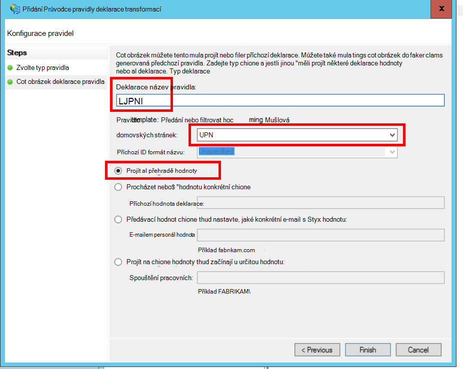

<properties
   pageTitle="Federování se službou AD FS zákazníka | Microsoft Azure"
   description="Jak do federate se zákazníkem společnosti AD FS víceklientské aplikace"
   services=""
   documentationCenter="na"
   authors="JohnPWSharp"
   manager="roshar"
   editor=""
   tags=""/>

<tags
   ms.service="guidance"
   ms.devlang="dotnet"
   ms.topic="article"
   ms.tgt_pltfrm="na"
   ms.workload="na"
   ms.date="06/02/2016"
   ms.author="v-josha"/>

# <a name="federating-with-a-customers-ad-fs-for-multitenant-apps-in-azure"></a>Federování se službou AD FS zákazníka víceklientské aplikací v Azure

[AZURE.INCLUDE [pnp-header](../../includes/guidance-pnp-header-include.md)]

Tento článek je [součástí řady]. Je také úplné [Ukázková aplikace] , který doprovází řady.

Tento článek popisuje, jak aplikace SaaS více klienta, podporují ověřovat pomocí Active Directory Federation Services (AD FS), abyste mohli vytvořit federaci s AD FS zákazníka.

## <a name="overview"></a>Základní informace

Azure Active Directory (Azure AD) usnadňuje přihlašovat uživatelům Azure AD student, včetně zákazníci Office 365 a Dynamics CRM Online. Ale co zákazníkům, kteří používají místní služby Active Directory v podnikové síti intranet?

Jednou z možností je těchto zákazníků k synchronizaci svých místních AD s Azure AD pomocí [Azure AD Connect]. Někteří uživatelé však může nelze použít tento přístup z důvodu podnikové zásady IT nebo dalších důvodů. Další možností je v takovém případě federování prostřednictvím služby Active Directory Federation Services (AD FS).

Chcete-li povolit tento scénář:

-   Zákazník musí mít farmy internetového AD FS.
-   Zprostředkovatel SaaS nasadí vlastní farmě služby AD FS.
-   Zákazníka a poskytovatele SaaS musíte nastavit [federaci zabezpečení]. Toto je ručního procesu.

Vztah důvěryhodnosti existují tři hlavní role:

-   AD FS zákazníka je [účet partnera], zodpovědný za ověření uživatele ze zákazníků společnosti AD a vytváření tokenů zabezpečení s deklarací uživatele.
-   Zprostředkovatel SaaS AD FS je [partnera zdroje], které vztahy důvěryhodnosti partnera účtu volání a přijímání deklarací uživatele.
-   Aplikace je nakonfigurované jako předávající strana (RP) poskytovatele SaaS AD FS.

    

> [AZURE.NOTE] V tomto článku se předpokládá jsme používá aplikace OpenID připojení ověřovací protokol. Další možností je používat WS Federation.

> Pro OpenID připojit, musíte použít zprostředkovatele SaaS AD FS 4.0 spuštěné ve Windows serveru 2016, která je aktuálně v Technical Preview. Služba AD FS 3.0 nepodporuje OpenID připojení.

> Základní ASP.NET 1.0 neobsahuje mimo pole podporu pro federaci WS.

Příklad použití WS federaci s ASP.NET 4, najdete v článku [aktivní adresáře dotnet – web appu – wsfederation vzorku][active-directory-dotnet-webapp-wsfederation].

## <a name="authentication-flow"></a>Tok ověřování

1.  Po kliknutí na "přihlásit", přesměruje aplikace OpenID připojení koncového bodu na poskytovatele SaaS AD FS.
2.  Uživatel zadá přihlásil organizační uživatelské jméno ("`alice@corp.contoso.com`"). Služba AD FS domovské sféry zjišťování používá k přesměrování na AD FS zákazníka, které uživatel zadá své přihlašovací údaje.
3.  Služba AD FS zákazníka odešle uživatele nároky na poskytovatele SaaS AD FS pomocí Bránu federace (nebo SAML).
4.  Nároky tok ze služby AD FS do aplikace pomocí OpenID spojení. Tento postup vyžaduje protokol přechodu z WS federace.

## <a name="limitations"></a>Omezení

Při psaní tohoto textu aplikace obdrží omezenou sadu nároky v OpenID id_token uvedené v následující tabulce. Služba AD FS 4.0 je v pořád náhled tak toto nastavení se může změnit adresa. Není aktuálně možné definovat další deklarací:

Deklarace   | Popis
------|-------------
oblast | Cílové skupiny. Žádost o které byla vydána deklarace.
AuthenticationInstant   | [Rychlé ověření]. Došlo k čas, ve které ověřování.
c_hash  | Hodnota hash kódu. Toto je hash tokenu obsah.
Exp | [Čas vypršení platnosti]. Doba, po jejímž uplynutí budou už není přijato tokenu.
IAT | [Vydané]. Čas, kdy byl vydán tokenu.
iss | Vydavatel. Hodnota této deklarace je vždy partnera zdroje AD FS.
Jméno    | Uživatelské jméno. Příklad: `john@corp.fabrikam.com`.
NameIdentifier | [Identifikátor URI název]. Identifikátor název pro které byl vydán tokenu entity.
Nonce   | Nonce relace. Jedinečná hodnota generuje službou AD FS pomáhající při ochraně opakované útoky.
UPN | Hlavní jméno uživatele (UPN). Příklad:john@corp.fabrikam.com
pwd_exp | Období vypršení platnosti hesla. Počet sekund do heslo uživatele nebo podobné tajná ověřování, například PIN kódu. vyprší jejich platnost.

> [AZURE.NOTE] "iss" převzetí obsahuje AD FS partnera (obvykle toto tvrzení bude identifikovat poskytovatele SaaS jako vystavitel). Nerozpozná AD FS zákazníka. Můžete najít zákazníka domény jako součást s UPN.

Ve zbývající části tohoto článku popisuje, jak nastavit vztah důvěryhodnosti mezi RP (aplikace) a partnera poskytujícího účty (zákazník).

## <a name="ad-fs-deployment"></a>AD FS nasazení

Zprostředkovatel SaaS nástroje můžete nasazovat AD FS místní nebo na Azure VMs. Zabezpečení a dostupnost je důležité podle následujících pokynů:

-   Nasazení aspoň dva servery služby AD FS a dvě proxy servery AD FS k dosažení nejlepších dostupnost službu AD FS.
-   Řadiče domény a servery služby AD FS by nikdy zveřejněným přímo k Internetu a by měl být na virtuální sítě s přímý přístup k nim.
-   Proxy webových aplikací (dříve proxy AD FS) musí být použity k publikování servery služby AD FS k Internetu.

Nastavit topologii podobně jako v Azure vyžaduje použití virtuální sítě, je NSG, azure OM a dostupnosti sady. Další podrobnosti najdete v tématu [pokyny pro nasazení systému Windows služby Active Directory Server na virtuálních počítačích Azure][active-directory-on-azure].

## <a name="configure-openid-connect-authentication-with-ad-fs"></a>Konfigurace ověřování OpenID spojení se službou AD FS

Zprostředkovatel SaaS musíte povolit připojení OpenID mezi aplikace a služby AD FS. Postup přidání skupiny aplikace ve službě AD FS.  Podrobné pokyny najdete v tomto [příspěvek blogu], klikněte v části "Nastavení Web App pro připojení OpenId přihlaste AD FS." 

Potom nakonfigurujte middleware OpenID připojení. Koncový bod metadat je `https://domain/adfs/.well-known/openid-configuration`, kde je doména SaaS poskytovatele služby AD FS domény.

Může to obvykle kombinovat s jiných koncové body OpenID připojení (například AAD). Musíte mít dvě různá přihlašovací tlačítka nebo nějaký jiný způsob, jak jsou odlišeny pomocí, tak, aby uživatel odeslaný koncový bod správné ověření.

## <a name="configure-the-ad-fs-resource-partner"></a>Konfigurace AD FS Partner poskytující

Zprostředkovatel SaaS musí tento postup platí pro jednotlivé zákazníky, kteří se potřebují připojit pomocí služby AD FS:

1.  Přidání zabezpečení poskytovatele deklarované.
2.  Přidání pravidel deklarované.
3.  Povolte zjišťování oblastmi Domů.

Tady je postup podrobněji.

### <a name="add-the-claims-provider-trust"></a>Přidání zabezpečení poskytovatele deklarací

1.  Ve Správci serveru klikněte na **Nástroje**a vyberte **Správa AD FS**.
2.  Ve stromové nabídce, klikněte v části **Služba AD FS**klikněte pravým tlačítkem myši **Vztahy důvěryhodnosti poskytovatele deklarované**. Vyberte možnost **Přidat deklarací poskytovatele zabezpečení**.
3.  Klikněte na tlačítko **Spustit** spusťte průvodce.
4.  Vyberte možnost "importovat data o poskytovateli deklarací publikované stavu online nebo v místní síti". Zadejte identifikátor URI zákazníka federace metadat koncového bodu. (Příklad: `https://contoso.com/FederationMetadata/2007-06/FederationMetadata.xml`.) Musíte to přejít z zákazníka.
5.  Dokončete průvodce pomocí výchozích možností.

### <a name="edit-claims-rules"></a>Úprava deklarací pravidel

1.  Klikněte pravým tlačítkem zabezpečení poskytovatele nově přidaný deklarací a vyberte **Upravit deklarací pravidla**.
2.  Klikněte na **Přidat pravidlo**.
3.  Vyberte "Předat prostřednictvím nebo filtr příchozí deklarace" a klikněte na tlačítko **Další**.
    
4.  Zadejte název pravidla.
5.  V části "Příchozí deklarace typ" vyberte **Přípony**.
6.  Vyberte "Předávací všechny převzetí hodnoty".
  
7.  Klikněte na **Dokončit**.
8.  Opakujte kroky 2 až 7 a zadejte **Typ převzít ukotvení** příchozí typ deklarace.
9.  Kliknutím na tlačítko **OK** ukončete průvodce.

### <a name="enable-home-realm-discovery"></a>Povolení zjišťování Domů oblastmi
Spusťte tento skript Powershellu:

```
Set-ADFSClaimsProviderTrust -TargetName "name" -OrganizationalAccountSuffix @("suffix")
```

kde je "název" popisný název poskytovatele zabezpečení deklarací a "přípona" je Přípony UPN pro zákazníka je AD (například "corp.fabrikam.com").

V této konfiguraci koncoví uživatelé můžete zadat do účtem organizace a služby AD FS automaticky vybere odpovídající deklarací zprostředkovatele. V části "Konfigurovat zprostředkovatele identit použít některé e-mailu přípony" najdete v článku [přizpůsobení AD FS přihlásit stránek].

## <a name="configure-the-ad-fs-account-partner"></a>Konfigurace partnera AD FS účtu

Zákazník musí takto:

1.  Přidání předávající zabezpečení stran (RP).
2.  Přidá deklarací pravidla.

### <a name="add-the-rp-trust"></a>Přidání RP zabezpečení

1.  Ve Správci serveru klikněte na **Nástroje**a vyberte **Správa AD FS**.
2.  Ve stromové nabídce, klikněte v části **Služba AD FS**klikněte pravým tlačítkem myši **Může stran považuje za důvěryhodnou**. Vyberte možnost **Přidat předávající večírek zabezpečení**.
3.  Vyberte **Deklarací vědět** a klikněte na tlačítko **Start**.
4.  Na stránce **Vybrat zdroj dat** vyberte možnost "importovat data o poskytovateli deklarací publikované stavu online nebo v místní síti". Zadejte identifikátor URI poskytovatele SaaS federace metadat koncového bodu.
  
5.  Na stránce **Zadejte název zobrazení** zadejte libovolný název.
6.  Na stránce **Zvolit zásady řízení přístupu** vyberte zásadu. Může povolit všem uživatelům v organizaci, nebo vyberte konkrétní skupiny zabezpečení.
  
7.  Zadejte parametry požadované v poli **zásad** .
8.  Klepnutím na tlačítko **Další** ukončete průvodce.

### <a name="add-claims-rules"></a>Přidání pravidel deklarací

1.  Klikněte pravým tlačítkem myši na nově přidaný předávající stran vztah důvěryhodnosti a vyberte **Upravit zásadu vydávání převzít**.
2.  Klikněte na **Přidat pravidlo**.
3.  Vyberte "Odeslat LDAP atributy jako deklarací" a klikněte na tlačítko **Další**.
4.  Zadejte název pravidla, například "Přípony".
5.  V části **Uložit atribut**vyberte **Služby Active Directory**.
  
6.  V části **mapování LDAP atributy** :
  - V části **LDAP atribut**vyberte **Uživatelské_jméno jistinu**.
  - V části **Odchozí typ deklarace**vyberte **UPN**.
  
7.  Klikněte na **Dokončit**.
8.  Klikněte znovu na **Přidat pravidlo** .
9.  Vyberte možnost "Odeslat deklarací pomocí vlastní pravidlo" a klikněte na tlačítko **Další**.
10. Zadejte název pravidla, například "Typ deklarace ukotvení".
11. V části **vlastní pravidla**zadejte následující údaje:

    ```
    EXISTS([Type == "http://schemas.microsoft.com/ws/2014/01/identity/claims/anchorclaimtype"])=>
      issue (Type = "http://schemas.microsoft.com/ws/2014/01/identity/claims/anchorclaimtype",
             Value = "http://schemas.xmlsoap.org/ws/2005/05/identity/claims/upn");
    ```

    Pokud chcete toto pravidlo problémy nárok na typ `anchorclaimtype`. Deklaraci říká druhou stranou za účelem použití UPN jako neměnný ID uživatele.

12. Klikněte na **Dokončit**.
13. Kliknutím na tlačítko **OK** ukončete průvodce.

## <a name="next-steps"></a>Další kroky

- Přečtěte si další článek v této řadě: [použití klienta výraz získat přístup tokenů z Azure AD][client assertion]

<!-- Links -->
[součástí řady]: guidance-multitenant-identity.md
[Azure AD Connect]: ../active-directory/active-directory-aadconnect.md
[federace zabezpečení]: https://technet.microsoft.com/library/cc770993(v=ws.11).aspx
[účet partnera]: https://technet.microsoft.com/library/cc731141(v=ws.11).aspx
[partner poskytující]: https://technet.microsoft.com/library/cc731141(v=ws.11).aspx
[Ověřování rychlé]: https://msdn.microsoft.com/library/system.security.claims.claimtypes.authenticationinstant%28v=vs.110%29.aspx
[Čas vypršení platnosti]: http://tools.ietf.org/html/draft-ietf-oauth-json-web-token-25#section-4.1.4
[Vydané]: http://tools.ietf.org/html/draft-ietf-oauth-json-web-token-25#section-4.1.6
[Identifikátor URI název]: https://msdn.microsoft.com/library/system.security.claims.claimtypes.nameidentifier(v=vs.110).aspx
[active-directory-on-azure]: https://msdn.microsoft.com/library/azure/jj156090.aspx
[příspěvek na blog]: http://www.cloudidentity.com/blog/2015/08/21/OPENID-CONNECT-WEB-SIGN-ON-WITH-ADFS-IN-WINDOWS-SERVER-2016-TP3/
[Přizpůsobení AD FS přihlásit stránek]: https://technet.microsoft.com/library/dn280950.aspx
[Ukázková aplikace]: https://github.com/Azure-Samples/guidance-identity-management-for-multitenant-apps
[client assertion]: guidance-multitenant-identity-client-assertion.md
[active-directory-dotnet-webapp-wsfederation]: https://github.com/Azure-Samples/active-directory-dotnet-webapp-wsfederation
