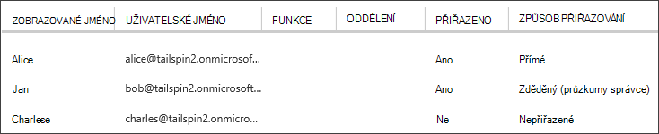

<properties
   pageTitle="Role aplikací | Microsoft Azure"
   description="Jak provádět tak mohli ověřovat pomocí aplikace role"
   services=""
   documentationCenter="na"
   authors="MikeWasson"
   manager="roshar"
   editor=""
   tags=""/>

<tags
   ms.service="guidance"
   ms.devlang="dotnet"
   ms.topic="article"
   ms.tgt_pltfrm="na"
   ms.workload="na"
   ms.date="02/16/2016"
   ms.author="mwasson"/>

#  <a name="application-roles-in-multitenant-applications"></a>Role aplikací víceklientské aplikace

[AZURE.INCLUDE [pnp-header](../../includes/guidance-pnp-header-include.md)]

Tento článek je [součástí řady]. Je také úplné [Ukázková aplikace] , který doprovází řady.

Role aplikací slouží k přiřazování oprávnění uživatelům. Například [Tailspin průzkumy] [ Tailspin] aplikace definuje následující role:

- Správce. Může provádět všechny operace CRUD na průzkum, které patří k tomuto klientovi.
- Poznámkové bloky pro školy. Můžete vytvářet nové průzkumy.
- Čtečka. Může číst zjišťování, které patří k tomuto klientovi.

Uvidíte, že role nakonec získat převést na oprávnění během [ověřování]. Ale první otázky jak přiřadit a spravovat role. Jsme identifikovat tři hlavní možnosti:

-   [Azure AD aplikace role](#roles-using-azure-ad-app-roles)
-   [Azure AD skupiny zabezpečení](#roles-using-azure-ad-security-groups)
-   [Role Správce aplikací](#roles-using-an-application-role-manager).

## <a name="roles-using-azure-ad-app-roles"></a>Role pomocí Azure AD aplikace role

Toto je použitý v aplikaci Tailspin průzkumy přístup.

V tento přístup SaaS poskytovatele definuje role aplikací přidáním do manifest aplikace. Po zaregistruje zákazníka správce pro zákazníka AD adresář uživatelé přiřadí role. Pokud se uživatel přihlásí, jsou odesílány přiřazené role uživatele jako deklarované.

> [AZURE.NOTE] Pokud zákazník musí Azure AD Premium, správce skupiny zabezpečení můžete přiřadit role a členy skupiny zdědí roli aplikace. Toto je pohodlný způsob, jak spravovat role, protože vlastník skupiny nemusí být správce AD.

Výhody tento postup:

-   Jednoduchý programovací model.
-   Role jsou specifické pro tuto aplikaci. Role deklarace pro jednu žádost neodesílají do jiné aplikace.
-   Pokud zákazník odebere aplikace z jejich klienta AD, role zmizí
-   Aplikace nevyžaduje všechny nadbytečné oprávnění služby Active Directory, než profilu uživatele pro čtení.

Nevýhody:

- Zákazníci bez Azure AD Premium nelze přiřadit role skupiny zabezpečení. Tyto zákazníci všechny uživatele přiřazení je zapotřebí AD správce.
- Pokud máte back-end webového rozhraní API, což je samostatná z web appu, přiřazování rolí pro web app nevztahují k webu rozhraní API. Další informace o této chvíle najdete v článku [zabezpečení back-end webového rozhraní API].

### <a name="implementation"></a>Implementace

**Definujte role.** Zprostředkovatel SaaS deklaruje role aplikace [manifest aplikace]. Tady je třeba položce seznamu průzkumy aplikace:

```
"appRoles": [
  {
    "allowedMemberTypes": [
      "User"
    ],
    "description": "Creators can create Surveys",
    "displayName": "SurveyCreator",
    "id": "1b4f816e-5eaf-48b9-8613-7923830595ad",
    "isEnabled": true,
    "value": "SurveyCreator"
  },
  {
    "allowedMemberTypes": [
      "User"
    ],
    "description": "Administrators can manage the Surveys in their tenant",
    "displayName": "SurveyAdmin",
    "id": "c20e145e-5459-4a6c-a074-b942bbd4cfe1",
    "isEnabled": true,
    "value": "SurveyAdmin"
  }
],
```

`value` Vlastnost se zobrazí v role deklarace. `id` Vlastnost je jedinečný identifikátor rolí definované. Vždy generovat nové hodnoty GUID `id`.

**Přiřazení uživatelů**. Je-li zaregistruje nový zákazník, aplikace registrovány v AD tenant zákazníka. V tomto okamžiku AD správce k tomuto klientovi můžou uživatelům přiřadit k rolím.

> [AZURE.NOTE] Uvedených dříve, Zákazníci s Azure AD Premium můžete přiřadit také skupiny zabezpečení role.

Následující snímek obrazovky z portálu Microsoft Azure ukazuje tři uživatelům. Alice přidělené přímo k roli. Jan dědí roli jako člen skupiny zabezpečení s názvem "Průzkumy správce", která je přiřazenou roli. Charlese není přiřazená jakoukoli roli.



> [AZURE.NOTE] Můžete taky aplikace můžete přiřadit role programově pomocí rozhraní API Azure AD grafu.  To však vyžaduje aplikaci získá oprávnění k zápisu pro zákazníka AD adresář. Aplikace se tato oprávnění může dělat spoustu nedostatků &mdash; zákazníka důvěryhodnost aplikaci pozor, abyste zřeteli jejich adresáře. Množství zákazníků může být ochotni poskytnutí tuto úroveň přístupu.

**Získání role deklarace**. Pokud se uživatel přihlásí, žádost přijme přiřazené role uživatele v deklaraci s typem `http://schemas.microsoft.com/ws/2008/06/identity/claims/role`.  

Uživatel může mít více role nebo bez role. Není ve vašem kódu se tak mohli ověřovat předpokládá, že má uživatel právě jeden role deklarace. Napište kód, který zkontroluje, jestli je hodnota konkrétní deklarace prezentovat:

```csharp
if (context.User.HasClaim(ClaimTypes.Role, "Admin")) { ... }
```

## <a name="roles-using-azure-ad-security-groups"></a>Role skupin zabezpečení Azure AD pomocí

V tomto přístupu role tvaru AD skupiny zabezpečení. Aplikace přiřazování oprávnění uživatelům podle členství ve skupinách zabezpečení.

Výhody:

-   Tento přístup pro zákazníky, kteří nemají Azure AD Premium, umožňuje zákazníkovi Správa přiřazování rolí pomocí skupiny zabezpečení.

Nevýhody:

- Složitost. Protože každého klienta odešle deklarace jiné skupiny, aplikace musí mít přehled odpovídající skupiny zabezpečení jaké role aplikace pro každého klienta.
- Pokud zákazník odebere aplikace z jejich klienta AD, skupiny zabezpečení zůstanou v adresáři jejich AD.

### <a name="implementation"></a>Implementace

Nastavte ve manifest aplikace `groupMembershipClaims` vlastnost "SecurityGroup". To je potřeba k optimálnímu AAD deklarací členství ve skupině.

```
{
   // ...
   "groupMembershipClaims": "SecurityGroup",
}
```

Když zaregistruje nový zákazník, nastaví aplikace zákazníkovi vytváření skupin zabezpečení pro role potřeby tak, že aplikace. Zákazník musí potom zadejte ID skupiny objektů do aplikace. Aplikace ukládá tyto v tabulce, která přiřazuje ID skupiny k rolím aplikace na klienta.

> [AZURE.NOTE] Můžete taky aplikace bylo možné vytvořit skupiny programově pomocí rozhraní API Azure AD graf.  To bude méně chyby chybám. Vyžaduje to však aplikace pro získání "čtení a zápis všechny skupiny" oprávnění pro zákazníka AD adresář. Množství zákazníků může být ochotni poskytnutí tuto úroveň přístupu.

Když uživatel přihlásí:

1.  Žádost přijme uživatele skupiny jako deklarované. Každý požadavek hodnotu ID objektu skupiny.
2.  Azure AD omezuje počet skupiny Odeslaná pošta v tokenu. Pokud toto omezení překračuje počet skupin, odešle Azure AD deklaraci zvláštní "průměrných". Pokud toto tvrzení je k dispozici, musí aplikaci dotaz rozhraní API Azure AD grafu zobrazíte všechny skupiny, do které patří. Podrobnosti najdete v tématu [se tak mohli ověřovat v aplikacích cloudu pomocí skupin AD], v části s názvem "Skupiny převzetí nadsazení".
3.  Aplikace vyhledá ID objektů ve vlastní databázi najít odpovídající aplikace roli přiřadit uživatelům.
4.  Aplikace přidá hodnotu vlastní deklarace UPN, která vyjadřuje roli aplikací. Příklad: `survey_role` = "SurveyAdmin".

Zásady se tak mohli ověřovat používejte deklaraci vlastní role deklarace ne celé skupině.

## <a name="roles-using-an-application-role-manager"></a>Role správce role aplikace

Při tomto postupu se role aplikací do neukládají Azure AD vůbec. Místo toho aplikace ukládá přiřazování rolí pro každého uživatele v samostatném DB &mdash; například pomocí třídy **RoleManager** identitu ASP.NET.

Výhody:

-   Aplikace má úplnou kontrolu nad rolí a přiřazení uživatele.

Nevýhody:

- Složitější, těžší chcete zachovat.
- Skupiny zabezpečení AD nelze použít ke správě přiřazování rolí.
- Informace o uživatelích ukládá v databázi aplikace, kde ho získat nejsou synchronizovány s klienta AD adresáře, přidání nebo odebrání uživatelů.   

Pro tento přístup mnoho existující příkladů. Například najdete v článku [Vytvoření aplikace pro ASP.NET MVC s auth a SQL databáze a nasazení služby Azure aplikace].

## <a name="next-steps"></a>Další kroky

- Přečtěte si další článek v této řadě: [na základě rolí a na základě zdroje se tak mohli ověřovat víceklientské aplikace][se tak mohli ověřovat]

<!-- Links -->
[Tailspin]: guidance-multitenant-identity-tailspin.md
[součástí řady]: guidance-multitenant-identity.md
[povolení]: guidance-multitenant-identity-authorize.md
[Zabezpečení back-end webového rozhraní API]: guidance-multitenant-identity-web-api.md
[Vytvoření aplikace pro ASP.NET MVC s auth a SQL databáze a nasazení aplikace služby Azure]: ../app-service-web/web-sites-dotnet-deploy-aspnet-mvc-app-membership-oauth-sql-database.md
[manifestu aplikace]: ../active-directory/active-directory-application-manifest.md
[Ukázková aplikace]: https://github.com/Azure-Samples/guidance-identity-management-for-multitenant-apps
