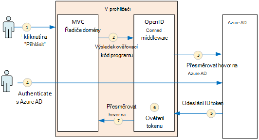
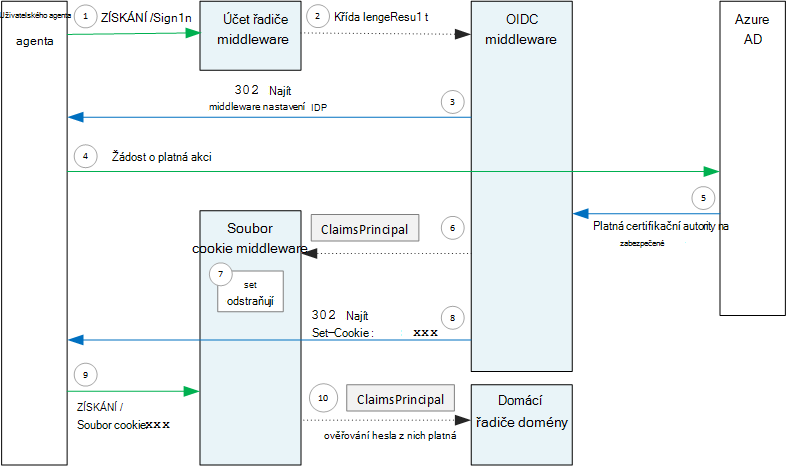

<properties
   pageTitle="Ověřování aplikace víceklientské | Microsoft Azure"
   description="Jak aplikace víceklientské může ověřovat uživatelům Azure AD"
   services=""
   documentationCenter="na"
   authors="MikeWasson"
   manager="roshar"
   editor=""
   tags=""/>

<tags
   ms.service="guidance"
   ms.devlang="dotnet"
   ms.topic="article"
   ms.tgt_pltfrm="na"
   ms.workload="na"
   ms.date="05/23/2016"
   ms.author="mwasson"/>

# <a name="authentication-in-multitenant-apps-using-azure-ad-and-openid-connect"></a>Ověřování víceklientské aplikace pomocí Azure AD a OpenID připojení

[AZURE.INCLUDE [pnp-header](../../includes/guidance-pnp-header-include.md)]

Tento článek je [součástí řady](guidance-multitenant-identity.md). Je také úplné [Ukázková aplikace] , který doprovází řady.

Tento článek popisuje, jak víceklientské aplikace může ověřovat uživatelům Azure Active Directory (Azure AD) použití OpenID připojení (OIDC) k ověření.

## <a name="overview"></a>Základní informace

Náš [implementaci odkaz](guidance-multitenant-identity-tailspin.md) je aplikace ASP.NET Core 1.0. Aplikace používá předdefinované middleware OpenID připojit k provedení tok ověřování OIDC. Na následujícím obrázku vidíte, co se stane, pokud se uživatel přihlásí na nejvyšší úrovni.



1.  Kliknutí na tlačítko "přihlásit" v aplikaci. Tato akce je uskutečněných jednotlivými MVC řadiče.
2.  Správce MVC vrátí **ChallengeResult** akce.
3.  Middlewaru zachytí **ChallengeResult** a vytvoří 302 odpověď, která přesměruje uživatele na přihlašovací stránku Azure AD.
4.  Uživatel se ověří s Azure AD.
5.  Azure AD pošle ID token aplikace.
6.  Middleware ověří ID token. V tomto okamžiku uživatele nyní ověřit v aplikaci.
7.  Middleware přesměruje uživatele zpátky na aplikace.

## <a name="register-the-app-with-azure-ad"></a>Registrace aplikace s Azure AD

Povolit připojení OpenID, zaregistruje poskytovatele SaaS aplikace uvnitř vlastní Azure AD klienta.

Registrace aplikace, postupujte podle pokynů v [Aplikacích integrace se službou Azure Active Directory](../active-directory/active-directory-integrating-applications.md), v části [Přidání aplikace](../active-directory/active-directory-integrating-applications.md#adding-an-application).

Na stránce **Konfigurace** :

-   Všimněte si ID klienta.
-   V části **aplikace je více klienta**vyberte **Ano**.
-   Nastavit **Odpověď adresu URL** adresy URL kde Azure AD odešle ověřovací odpověď. Můžete použít základní adresu URL aplikace.
  - Poznámka: Cesta URL může být, jakož název hostitele odpovídá nasazeném aplikace.
  - Můžete nastavit víc adres URL odpověď. Během vývoje, můžete použít `localhost` adresu pro spuštění aplikace místně.
-   Generování klienta tajná: **klíčů**, klepněte na rozevírací nabídku, která říká **vyberte dobu trvání** a vyberte 1 nebo 2 let. Klávesy se projeví po klepnutí na tlačítko **Uložit**. Ujistěte se, zkopírujte její hodnotu, protože to není znovu zobrazí při načtení stránky konfigurace.

## <a name="configure-the-auth-middleware"></a>Konfigurace ověřování middleware

Tato část popisuje postup při konfiguraci middleware ověřování v ASP.NET Core 1.0 víceklientské ověřování s OpenID připojení.

Ve svojí třídě spuštění přidejte middleware OpenID připojení:

```csharp
app.UseOpenIdConnectAuthentication(options =>
{
    options.AutomaticAuthenticate = true;
    options.AutomaticChallenge = true;
    options.ClientId = [client ID];
    options.Authority = "https://login.microsoftonline.com/common/";
    options.CallbackPath = [callback path];
    options.PostLogoutRedirectUri = [application URI];
    options.SignInScheme = CookieAuthenticationDefaults.AuthenticationScheme;
    options.TokenValidationParameters = new TokenValidationParameters
    {
        ValidateIssuer = false
    };
    options.Events = [event callbacks];
});
```

> [AZURE.NOTE] V tématu [Startup.cs](https://github.com/Azure-Samples/guidance-identity-management-for-multitenant-apps/blob/master/src/Tailspin.Surveys.Web/Startup.cs).

Další informace o spuštění předmětu najdete v článku [Spuštění aplikace](https://docs.asp.net/en/latest/fundamentals/startup.html) v dokumentaci ASP.NET Core 1.0.

Nastavení možností middleware:

- **ClientId**. ID klienta aplikace, které jste získali při registraci aplikace v Azure AD.
- **Autorita**. Pro aplikace víceklientské, nastavte `https://login.microsoftonline.com/common/`. Toto je adresa URL na Azure AD běžné koncový bod, což umožňuje uživatelům z libovolné Azure AD klienta se přihlásit. Další informace o běžných koncový bod najdete v článku [Tento příspěvek blogu](http://www.cloudidentity.com/blog/2014/08/26/the-common-endpoint-walks-like-a-tenant-talks-like-a-tenant-but-is-not-a-tenant/).
- V **TokenValidationParameters**nastavte **ValidateIssuer** NEPRAVDA. To znamená, že aplikace budete zodpovědní za ověření hodnotu Vystavitel tokenu ID. (Middleware pořád ověří token samotné.) Další informace o ověřování Vystavitel najdete v tématu [ověření vydavatel](guidance-multitenant-identity-claims.md#issuer-validation).
- **CallbackPath**. Nastavte rovna cestu do pole Adresa URL odpovědi, které je zaregistrované v Azure AD. Pokud odpověď adresa URL je například `http://contoso.com/aadsignin`, by měl být **CallbackPath** `aadsignin`. Pokud nechcete nastavit tuto možnost, výchozí hodnota je `signin-oidc`.
- **PostLogoutRedirectUri**. Zadejte adresu URL pro přesměrování uživatelé po Odhlásit se. Je vhodné stránku, která umožní anonymní požadavky &mdash; obvykle na domovskou stránku.
- **SignInScheme**. Nastavte `CookieAuthenticationDefaults.AuthenticationScheme`. Toto nastavení znamená, že po ověření uživatele deklarací uživatele jsou uložené místně v soubor cookie. Tento soubor cookie se, jak zůstane přihlášený uživatel během relace prohlížeče.
- **Události.** Zpětná události; v tématu [ověření událostí](#authentication-events).

Také přidáte middleware ověření souborů Cookie kanálu. Tento middleware je zodpovědný za psaní deklarací uživatele pro soubor cookie a čtení soubor cookie během dalším načtení stránky.

```csharp
app.UseCookieAuthentication(options =>
{
    options.AutomaticAuthenticate = true;
    options.AutomaticChallenge = true;
    options.AccessDeniedPath = "/Home/Forbidden";
});
```

## <a name="initiate-the-authentication-flow"></a>Zahájení konverzace tok ověřování

Tok ověřování ASP.NET MVC zahájíte vráceným **ChallengeResult** řadiče:

```csharp
[AllowAnonymous]
public IActionResult SignIn()
{
    return new ChallengeResult(
        OpenIdConnectDefaults.AuthenticationScheme,
        new AuthenticationProperties
        {
            IsPersistent = true,
            RedirectUri = Url.Action("SignInCallback", "Account")
        });
}
```

To způsobí, že middleware vrátit 302 odpověď (nalezen), který přesměrovává koncový bod ověřování.

## <a name="user-login-sessions"></a>Uživatelské přihlašovací relace

Jak je uvedeno, když uživatel nejdřív přihlašuje, middleware ověření souborů Cookie zapíše deklarací uživatele pro soubor cookie. Potom jsou ověřovány požadavků HTTP čtení soubor cookie.

Ve výchozím nastavení souborů cookie middleware zapíše soubor [cookie relace][session-cookie], které získá odstraněn jednou zavře prohlížeč. Další uživatele při návštěvě vedle webu, bude třeba se znovu přihlaste. Ale pokud nastavíte **IsPersistent** **ChallengeResult**true (pravda), middleware data zapisuje trvalý soubor cookie, zůstane po zavření prohlížeči přihlášený uživatel. Konfigurace vypršení platnosti souborů cookie; Přečtěte si téma [Možnosti řízení souborů cookie][cookie-options]. Trvalé soubory cookie jsou pohodlnější pro uživatele, ale může být vhodný pro některé aplikace (třeba, aplikace bankovní) místo, kam chcete uživateli při každém přihlášení.

## <a name="about-the-openid-connect-middleware"></a>Informace o připojení OpenID middleware

Připojení OpenID middleware v ASP.NET skryje většina podrobnosti protokolu. Tato část obsahuje několik poznámek k provádění, která mohou být užitečné pro Principy tok protokol.

Nejdřív se podíváme tok ověřování z hlediska ASP.NET (ignoruje podrobností směrování protokol OIDC mezi aplikací a Azure AD). Na následujícím obrázku vidíte obrázku.



V tomto diagramu existují dva řadiče MVC. Účet správce pracuje s žádostí o přihlášení a řadiče Domů obsluhuje na domovskou stránku.

Tady je proces ověření:

1. Kliknutí na tlačítko "Přihlásit" a prohlížeč odešle požadavek GET. Příklad: `GET /Account/SignIn/`.
2. Vrátí řadiče účtu `ChallengeResult`.
3. OIDC middleware vrátí odpověď HTTP 302 přesměrování Azure AD.
4. V prohlížeči pošle žádost ověřování Azure AD
5. Uživatel přihlásí Azure AD a Azure AD odešle zpět ověřování odpověď.
6. Middlewaru OIDC vytvoří deklarací jistinu a předá middleware ověření souborů Cookie.
7. Soubor cookie middlewaru jsou nároky jistinu a nastaví soubor cookie.
8. OIDC middleware přesměruje aplikace zpětné adresu URL.
10. V prohlížeči sleduje přesměrování odesílání soubor cookie v pozvánce.
11. Soubor cookie middlewaru deserializuje soubor cookie deklarací hlavní a nastaví `HttpContext.User` rovna jistinu deklarované. Žádost směrován k řadiči MVC.

### <a name="authentication-ticket"></a>Ověřovací lístek

Pokud ověření úspěšné, OIDC middleware vytvoří ověřovací lístek, která obsahuje deklarací jistinu obsahující deklarací uživatele. Přístup k lístek uvnitř **AuthenticationValidated** nebo **TicketReceived** události.

> [AZURE.NOTE] Až do dokončení celého ověřování tok `HttpContext.User` stále obsahuje anonymní hlavní, _Ne_ ověřeného uživatele. Anonymní jistinu má kolekce prázdných deklarované. Po dokončení ověřování a přesměrování aplikace middleware souborů cookie deserializuje cookie ověřování a sady `HttpContext.User` k deklarací jistinu představující ověřeného uživatele.

### <a name="authentication-events"></a>Ověřování události

Během procesu ověření vyvolá middleware OpenID připojení řadu událostí:

- **RedirectToAuthenticationEndpoint**. Před middleware přesměruje koncový bod ověřování, s názvem doprava. Tato událost můžete použít k úpravám přesměrování adresy URL; například, pokud chcete přidat parametry požadavku. Příklad v tématu [Přidání řádku souhlas správce](guidance-multitenant-identity-signup.md#adding-the-admin-consent-prompt) .

- **AuthorizationResponseReceived**. S názvem po middleware přijímání ověřovací odpověď zprostředkovatele identit (IDP), ale před middleware ověří odpověď.  

- **AuthorizationCodeReceived**. S názvem s kódem se tak mohli ověřovat.

- **TokenResponseReceived**. Volat middleware získává přístupový token z IDP. Platí jenom pro toku kód ověření.

- **AuthenticationValidated**. Volat middleware ověří ID token. V tomto okamžiku má aplikace sady ověřený žádostí o uživateli. Tato událost můžete provádět další ověření deklarace a transformace deklarované. V tématu [práce s deklarované](guidance-multitenant-identity-claims.md).

- **UserInformationReceived**. Jen middleware získá profilů uživatelů z koncového bodu informace o uživateli. Platí jenom pro povolení kód tok a pouze tehdy, když `GetClaimsFromUserInfoEndpoint = true` v možnostech middleware.

- **TicketReceived**. S názvem dokončení ověřování. Toto je poslední akci za předpokladu, že tento ověření úspěšné. Po zpracování tato událost jsou uživatelé přihlášení do aplikace.

- **AuthenticationFailed**. S názvem neúspěšné ověření. Pomocí této události pro zpracování chyby ověření &mdash; například přesměrováním chybovou stránku.

Stanovit zpětná tyto události, nastavte možnost **události** na middleware. Existují dva různé způsoby, jak deklarovat obslužné rutiny události: vložené s lambda výrazy nebo v předmětu, která je odvozena z **OpenIdConnectEvents**.

Rovnoběžně s lambda výrazy:

```csharp
app.UseOpenIdConnectAuthentication(options =>
{
    // Other options not shown.

    options.Events = new OpenIdConnectEvents
    {
        OnTicketReceived = (context) =>
        {
             // Handle event
             return Task.FromResult(0);
        },
        // other events
    }
});
```

Vyplývající z **OpenIdConnectEvents**:

```csharp
public class SurveyAuthenticationEvents : OpenIdConnectEvents
{
    public override Task TicketReceived(TicketReceivedContext context)
    {
        // Handle event
        return base.TicketReceived(context);
    }
    // other events
}

// In Startup.cs:
app.UseOpenIdConnectAuthentication(options =>
{
    // Other options not shown.

    options.Events = new SurveyAuthenticationEvents();
});
```

Druhý přístup je vhodné máte události zpětná jakékoli podstatné logiky, které zabírají svojí třídě spuštění. Náš implementace odkaz používá tento přístup; v tématu [SurveyAuthenticationEvents.cs](https://github.com/Azure-Samples/guidance-identity-management-for-multitenant-apps/blob/master/src/Tailspin.Surveys.Web/Security/SurveyAuthenticationEvents.cs).

### <a name="openid-connect-endpoints"></a>OpenID připojení koncové body

Azure AD podporuje [OpenID připojení zjišťování](https://openid.net/specs/openid-connect-discovery-1_0.html), ve kterém zprostředkovatele identit (IDP) vrátí dokument metadat JSON z [známý koncového bodu](https://openid.net/specs/openid-connect-discovery-1_0.html#ProviderConfig). Metadata dokument obsahuje informace, jako například:

-   Adresa URL koncový bod se tak mohli ověřovat. Je to, kde aplikace přesměruje na ověření uživatele.
-   Adresa URL "ukončit relaci" koncového bodu, kde aplikace přejde na Odhlásit se uživatel.
-   Adresa URL získat podpisový klíče, které používá klienta pro ověření tokeny OIDC, které získá z IDP.

Ve výchozím nastavení OIDC middleware ví, jak vzdáleně tato metadata. Nastavení možností **autority** v middleware a middleware vytvoří adresu URL pro metadata. (Můžete přepsat adresa URL metadat nastavení **MetadataAddress** .)

### <a name="openid-connect-flows"></a>OpenID připojení toků

Ve výchozím nastavení používá OIDC middleware hybridní toku s režimem příspěvek odpovědi formuláře.

-   _Hybridní toku_ znamená, že klient může vstoupit ID token a kód se tak mohli ověřovat se stejným zamezilo přenosu na server se tak mohli ověřovat.
-   _Formulář zveřejňují odpověď režimu_ znamená, že server se tak mohli ověřovat pomocí žádost HTTP POST poslat kód ID token a povolení aplikace. Hodnoty jsou formuláře urlencoded (obsah typ = "aplikace/x--www-form-urlencoded").

Když OIDC middleware přesměruje koncový bod se tak mohli ověřovat, obsahuje přesměrování adresy URL všechny parametry řetězce dotazu potřeby tak, že OIDC. Pro hybridní toku:

-   client_id. Tato hodnota v poli **ClientId**
-   rozsah = "openid profilu", což znamená, že je žádost o konverzaci OIDC a chceme profilu uživatele.
-   response_type = "kódu id_token". Určuje hybridní toku.
-   response_mode = "form_post". Určuje odpověď na příspěvek formulář.

Chcete-li zadat jinou toku, nastavte vlastnost **ResponseType** na požadované možnosti. Příklad:

```csharp
app.UseOpenIdConnectAuthentication(options =>
{
    options.ResponseType = "code"; // Authorization code flow

    // Other options
}
```

## <a name="next-steps"></a>Další kroky

- Přečtěte si další článek v této řadě: [práce s na základě deklarací identit víceklientské aplikace][claims]


[claims]: guidance-multitenant-identity-claims.md
[cookie-options]: https://docs.asp.net/en/latest/security/authentication/cookie.html#controlling-cookie-options
[session-cookie]: https://en.wikipedia.org/wiki/HTTP_cookie#Session_cookie
[Ukázková aplikace]: https://github.com/Azure-Samples/guidance-identity-management-for-multitenant-apps
