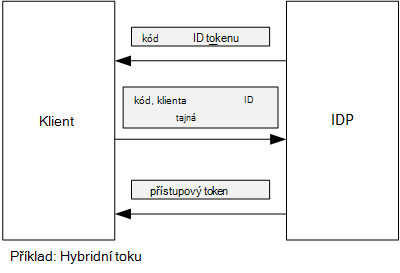

<properties
   pageTitle="Získání přístupu tokenů z Azure AD pomocí klienta výraz | Microsoft Azure"
   description="Jak získat přístup tokenů z Azure AD pomocí klienta výraz."
   services=""
   documentationCenter="na"
   authors="MikeWasson"
   manager="roshar"
   editor=""
   tags=""/>

<tags
   ms.service="guidance"
   ms.devlang="dotnet"
   ms.topic="article"
   ms.tgt_pltfrm="na"
   ms.workload="na"
   ms.date="05/23/2016"
   ms.author="mwasson"/>

# <a name="using-client-assertion-to-get-access-tokens-from-azure-ad"></a>Získání přístupu tokenů z Azure AD pomocí výrazu klienta

[AZURE.INCLUDE [pnp-header](../../includes/guidance-pnp-header-include.md)]

Tento článek je [součástí řady]. Je také úplné [Ukázková aplikace] , který doprovází řady.

## <a name="background"></a>Pozadí

Pokud chcete použít se tak mohli ověřovat kód toku nebo hybridní toku OpenID připojení, klienta výměny autorizační kód pro přístupový token. Během tohoto kroku klienta musí dokončit ověření na server.



Jedním ze způsobů ověřit klienta je pomocí tajná klienta. Je to způsob [Zjišťování Tailspin] [ Surveys] aplikace je ve výchozím nastavení nakonfigurována.

Tady je příklad žádost o konverzaci z klienta do IDP žádosti o přístupový token. Poznámka `client_secret` parametr.

```
POST https://login.microsoftonline.com/b9bd2162xxx/oauth2/token HTTP/1.1
Content-Type: application/x-www-form-urlencoded

resource=https://tailspin.onmicrosoft.com/surveys.webapi
  &client_id=87df91dc-63de-4765-8701-b59cc8bd9e11
  &client_secret=i3Bf12Dn...
  &grant_type=authorization_code
  &code=PG8wJG6Y...
```

Tajná je právě řetězec, budete muset zkontrolujte, že není nevrací hodnotu. Doporučený postup je ponechání tajná klienta z ovládacího prvku zdroje. Při nasazení Azure ukládat tajná v [Nastavení aplikace][configure-web-app].

Každý, kdo má přístup k Azure předplatné ale zobrazit nastavení aplikace. Kromě toho je vždy riziko kontrola tajemství do ovládacího prvku zdroje (například v skripty nasazení), je sdílet e-mailem a tak dále.

Pro větší zabezpečení můžete [klienta výraz] místo tajná klienta. Pomocí klienta výraz používá klienta certifikát X.509 k prokážete, že požadavek tokenu pochází z klienta. Certifikát klienta je nainstalovaná na webovém serveru. Obvykle to bude snadněji omezit přístup k certifikátu, než zajistit, aby nikdo omylem zobrazíte tajná klienta. Další informace o konfiguraci certifikáty ve web appu najdete v článku [Použití certifikáty v aplikacích weby Azure][using-certs-in-websites]

Tady je žádost o tokenu pomocí klienta výraz:

```
POST https://login.microsoftonline.com/b9bd2162xxx/oauth2/token HTTP/1.1
Content-Type: application/x-www-form-urlencoded

resource=https://tailspin.onmicrosoft.com/surveys.webapi
  &client_id=87df91dc-63de-4765-8701-b59cc8bd9e11
  &client_assertion_type=urn:ietf:params:oauth:client-assertion-type:jwt-bearer
  &client_assertion=eyJhbGci...
  &grant_type=authorization_code
  &code= PG8wJG6Y...
```

Všimněte si, že `client_secret` parametr se už používá. Místo toho `client_assertion` parametr obsahuje token JWT, který byl podepsán pomocí certifikátu klienta. `client_assertion_type` Parametr určuje typ výrazu &mdash; v tomto případě tokenu JWT. Server ověří JWT token. Je-li JWT token neplatný, požadavek na token vrátí chybu.

> [AZURE.NOTE] Certifikáty X.509 nejsou pouze formuláře Klient výraz; Budeme se zaměřují na ho tady protože tuto možnost podporuje Azure AD.

## <a name="using-client-assertion-in-the-surveys-application"></a>Použití výrazu klienta v aplikaci průzkumy

Tato část popisuje nakonfigurovat aplikaci Tailspin průzkumy pro použití klienta výraz. V těchto krocích vygeneruje certifikátu podepsaného svým držitelem, který je vhodný pro vývoj, ale ne pro použití v praxi.

1. Spuštění skript Powershellu [/Scripts/Setup-KeyVault.ps1] [ Setup-KeyVault] následujícím způsobem:

    ```
    .\Setup-KeyVault.ps -Subject [subject]
    ```

    Pro `Subject` parametr, zadejte libovolný název, třeba "surveysapp". Skript vygeneruje certifikátu podepsaného svým držitelem a uloží jej v úložišti certifikátů "aktuálního uživatele/osobní".

2. Výstup skript je JSON fragment. Přidáte k manifestu aplikace ve web appu, následujícím způsobem:

    1. Přihlaste se k [portálu Správa Azure] [ azure-management-portal] a přejděte do adresáře Azure AD.

    2. Klikněte na **aplikace**.

    3. Vyberte aplikaci průzkumy.

    4.  Klikněte na tlačítko **Spravovat Manifest** a vyberte **Stáhnout Manifest**.

    5.  Otevřete soubor JSON v textovém editoru. Vložte výstup skriptu do `keyCredentials` vlastnost. By měla vypadat přibližně takto:

        ```    
        "keyCredentials": [
            {
              "type": "AsymmetricX509Cert",
              "usage": "Verify",
              "keyId": "29d4f7db-0539-455e-b708-....",
              "customKeyIdentifier": "ZEPpP/+KJe2fVDBNaPNOTDoJMac=",
              "value": "MIIDAjCCAeqgAwIBAgIQFxeRiU59eL.....
            }
          ],
         ```

    6.  Uložte provedené změny souboru JSON.

    7.  Vraťte se k portálu. Klikněte na tlačítko **Spravovat Manifest** > **Nahrát Manifest** a uložit soubor JSON.

3. Spusťte tento příkaz zobrazíte otisk certifikátu.

    ```
    certutil -store -user my [subject]
    ```

    kde `[subject]` je hodnota, která jste zadali pro předmět v skript Powershellu. Miniatura je uvedené v části "Certifikátu Hash(sha1)". Odebrání mezer mezi šestnáctkové čísly.

4. Aktualizace aplikace tajemství. V okně Průzkumník projektu Tailspin.Surveys.Web pravým tlačítkem vyberte **Spravovat tajemství uživatele**. Přidání položky pro "Asymmetric" v části "AzureAd", jak je ukázáno v následujícím příkladu:

    ```
    {
      "AzureAd": {
        "ClientId": "[Surveys application client ID]",
        // "ClientSecret": "[client secret]",  << Delete this entry
        "PostLogoutRedirectUri": "https://localhost:44300/",
        "WebApiResourceId": "[App ID URI of your Survey.WebAPI application]",
        // new:
        "Asymmetric": {
          "CertificateThumbprint": "[certificate thumbprint]",  // Example: "105b2ff3bc842c53582661716db1b7cdc6b43ec9"
          "StoreName": "My",
          "StoreLocation": "CurrentUser",
          "ValidationRequired": "false"
        }
      },
      "Redis": {
        "Configuration": "[Redis connection string]"
      }
    }
    ```

    Musíte nastavit `ValidationRequired` na hodnotu false, protože není certifikátu podepsaného kořenovou Certifikační autority. Ve výrobním, použijte certifikát, který je podepsáno Certifikační autorita a nastavte `ValidationRequired` true (pravda).

    Také odstranit položku pro `ClientSecret`, protože není potřeba s výraz klienta.

5. V Startup.cs, vyhledejte kód, který zaregistruje `ICredentialService`. Zrušte komentář řádku, který používá `CertificateCredentialService`a komentář řádek, který používá `ClientCredentialService`:

    ```csharp
    // Uncomment this:
    services.AddSingleton<ICredentialService, CertificateCredentialService>();
    // Comment out this:
    //services.AddSingleton<ICredentialService, ClientCredentialService>();
    ```

Za běhu webové aplikace přečte certifikát z úložiště certifikátů. Certifikát musí být nainstalovaný ve stejném počítači jako web app.

## <a name="next-steps"></a>Další kroky

- Přečtěte si další článek v této řadě: [Pomocí Azure klíč trezoru chránit tajemství aplikace][key vault]


<!-- Links -->
[configure-web-app]: ../app-service-web/web-sites-configure.md
[azure-management-portal]: https://manage.windowsazure.com
[výraz klienta]: https://tools.ietf.org/html/rfc7521
[key vault]: guidance-multitenant-identity-keyvault.md
[Setup-KeyVault]: https://github.com/Azure-Samples/guidance-identity-management-for-multitenant-apps/blob/master/scripts/Setup-KeyVault.ps1
[Surveys]: guidance-multitenant-identity-tailspin.md
[using-certs-in-websites]: https://azure.microsoft.com/blog/using-certificates-in-azure-websites-applications/
[součástí řady]: guidance-multitenant-identity.md
[Ukázková aplikace]: https://github.com/Azure-Samples/guidance-identity-management-for-multitenant-apps
