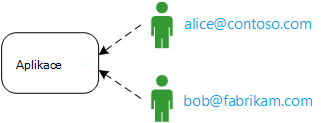
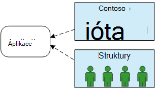
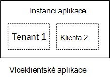
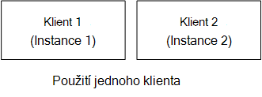
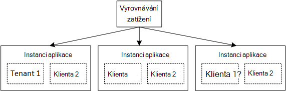

<properties
   pageTitle="Správa identit víceklientské aplikací | Microsoft Azure"
   description="Úvod do správy identit víceklientské aplikací"
   services=""
   documentationCenter="na"
   authors="MikeWasson"
   manager="roshar"
   editor=""
   tags=""/>

<tags
   ms.service="guidance"
   ms.devlang="dotnet"
   ms.topic="article"
   ms.tgt_pltfrm="na"
   ms.workload="na"
   ms.date="06/02/2016"
   ms.author="mwasson"/>

# Úvod do správy identit víceklientské aplikací v Microsoft Azure

[AZURE.INCLUDE [pnp-header](../../includes/guidance-pnp-header-include.md)]

Tento článek je [součástí řady]. Je také úplné [Ukázková aplikace] , který doprovází řady.

Řekněme, že píšete podnikové aplikaci SaaS hostované v cloudu. Uživatelé budou mít samozřejmě aplikace:

Ale patří tyto uživatele do organizace:

Příklad: Tailspin prodává předplatná pro provádění SaaS. Contoso a Fabrikam zaregistrovat si aplikaci. Když Alice (`alice@contoso`) znaménka v aplikaci měli vědět, že Alice je součástí Contoso.

- Alice _by měl_ mít přístup k datům Contoso.
- Alice _neměli_ mít přístup k datům Fabrikam.

Tyto pokyny vám ukáže, jak správy identit uživatelů v víceklientské aplikace pomocí [Služby Azure Active Directory] [ AzureAD] (Azure AD) pro zpracování přihlášení a ověření.

## Co je multitenancy?

_Klienta_ je skupinu uživatelů. V aplikaci SaaS je klient účastníka nebo zákazníka rohu aplikace. _Multitenancy_ je architektura kde víc klientů sdílet fyzický stejné instanci aplikace. I když se student sdílení fyzický zdrojů (například VMs nebo úložiště), každého klienta získá vlastní logické instanci aplikace.

Obvykle aplikace způsobem budou sdíleny získal mezi uživateli v rámci klienta, ale not s operátorem jiných klientů.

Porovnejte tuto architekturu s jednoduchým klienta architektura mají vyhrazenou fyzické instanci každého klienta. Do jednoho tenanta architektura přidáte klienti otáčející se nové instance aplikace.

### Multitenancy a vodorovných měřítka

Abyste dosáhli velkém měřítku v cloudu, je běžné přidávat další fyzické instance. Jedná se o jako _měřítko vodorovné_ nebo _rozšiřování_. Zvažte do webových aplikací. Zpracovávání více přenosy, můžete přidat další serveru VMs a umístěte za vyrovnávání zatížení. Každý OM spustí samostatnou fyzické instanci web appu.

Jakékoliv žádosti o mohou být směrovány na všechny instance. Společně se jako jedna instance logické funkce systému. Můžete byl virtuálního počítače nebo číselníku nahoru nové OM beze změny uživatelů. V této architektury pokaždé fyzické více klienta a je měřítko přidáním další instance. Pokud jedna instance přejde, nedotýká všechny klienta.

## Identita víceklientské aplikace

V víceklientské aplikaci je nutné zvážit uživatelů v souvislosti s klienty.

**Ověřování**

- Uživatelé se přihlásit do aplikace pomocí svých přihlašovacích údajů organizace. Nebudete muset vytvořit nové profily aplikace.
- Uživatelům ve stejné organizaci využívající jsou součástí stejném klientovi.
- Pokud se uživatel přihlásí, aplikace ví, které klienta uživatel patří.

**Povolení**

- Při ověřování uživatele akce (například zobrazení zdroje), aplikace musíte vzít v úvahu uživatele klienta.
- Uživatele můžete přiřadit role v aplikaci, třeba "Správce" nebo "Standardní uživatele". Přiřazení rolí by měly být spravovány zákazník, ne zprostředkovatelem SaaS.

**Příklad.** Alice, zaměstnance na Contoso, přejde aplikace do svého prohlížeče a klepne na tlačítko "Přihlásit". Uživatel se přesměruje do přihlašovací obrazovky, kde uživatel zadá své firemní přihlašovacích údajů (uživatelské jméno a heslo). V tomto okamžiku mohla přihlášení k aplikaci jako `alice@contoso.com`. Aplikace taky zná Alice je správce k této aplikaci. Protože je správce, kontakt můžete zobrazit všechny zdroje, které patří k Contoso. Však mohla nemůže zobrazit společnosti Fabrikam zdrojů, protože je správce pouze v rámci svého klienta.

V tomto pokyny podíváme na Azure AD pomocí správy identit.

- Budeme se předpokládá, že zákazníka ukládá jejich profilů uživatelů v Azure AD (včetně klientů Office 365 a Dynamics CRM)
- Zákazníkům s místním Active Directory (AD) můžete použít [Azure AD Connect] [ ADConnect] k synchronizaci svých místních AD s Azure AD.

Pokud zákazník s místním AD nelze použít Azure AD Connect (kvůli podnikové zásady IT nebo dalších důvodů), je SaaS poskytovatele můžete vytvořit federaci s zákazníka AD prostřednictvím služby Active Directory Federation Services (AD FS). Tato možnost je popsaná v [Federating se službou AD FS zákazníka].

Tyto pokyny v úvahu další aspekty multitenancy například rozdělování dat konfigurace jednoho klienta a tak dále.

## Další kroky

- Přečtěte si další článek v této řadě: [žádost o Tailspin průzkumy][tailpin]

<!-- Links -->
[ADConnect]: ../active-directory/active-directory-aadconnect.md
[AzureAD]: https://azure.microsoft.com/documentation/services/active-directory/
[součástí řady]: guidance-multitenant-identity.md
[Federování se službou AD FS zákazníka]: guidance-multitenant-identity-adfs.md
[Ukázková aplikace]: https://github.com/Azure-Samples/guidance-identity-management-for-multitenant-apps
[tailpin]: guidance-multitenant-identity-tailspin.md
