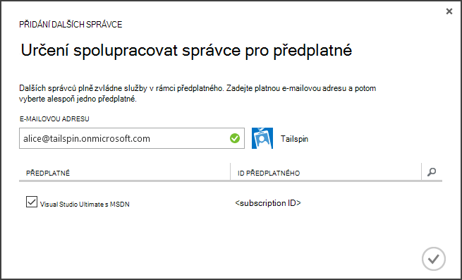

<properties
   pageTitle="Pomocí klávesy trezoru chránit aplikace tajemství | Microsoft Azure"
   description="Způsob použití klíč trezoru služby pro ukládání tajemství aplikace"
   services=""
   documentationCenter="na"
   authors="MikeWasson"
   manager="roshar"
   editor=""
   tags=""/>

<tags
   ms.service="guidance"
   ms.devlang="dotnet"
   ms.topic="article"
   ms.tgt_pltfrm="na"
   ms.workload="na"
   ms.date="02/16/2016"
   ms.author="mwasson"/>

# <a name="using-azure-key-vault-to-protect-application-secrets"></a>Zamknout aplikaci tajemství pomocí trezoru klíč Azure

[AZURE.INCLUDE [pnp-header](../../includes/guidance-pnp-header-include.md)]

Tento článek je [součástí řady]. Je také úplné [Ukázková aplikace] , který doprovází řady.

## <a name="overview"></a>Základní informace

Je běžné mít nastavení aplikace, které jsou citlivé a musí být zamknutý, jako například:

- Řetězců připojení k databázi
- Hesla
- Klíče

Osvědčený zabezpečení měli byste nikdy uložit tyto tajemství na ovládací prvek zdroje. Příliš snadno se nevrací &mdash; i v případě úložiště zdrojového kódu soukromé. A to není prakticky zachování tajemství od obecné veřejné. U větších projektů můžete chtít omezit vývojáři a operátory přístup tajemství výroby. (Nastavení zkušební nebo vývojové prostředí se liší.)

Bezpečnější možnost je k ukládání tyto tajemství v [Azure klíč trezoru][KeyVault]. Klíč trezoru je hostovaný cloudu služba pro správu klíče a další tajemství. Tento článek ukazuje, jak používat trezoru klíč pro uložení nastavení pro aplikaci můžete.

Při [Zjišťování Tailspin] [ Surveys] aplikace, jsou skryté následující nastavení:

- Připojovací řetězec databáze.
- Redis připojovací řetězec.
- Tajná klienta pro webovou aplikaci.

Na ukládání konfigurace tajemství trezoru klíč, průzkumy aplikace používá vlastní konfigurace poskytovatele, která zachytí do ASP.NET Core 1.0 [Konfigurace systému][configuration]. Vlastní poskytovatel přečte nastavení z trezoru klíč při spuštění.

Konfigurace nastavení načtení aplikace průzkumy z těchto míst:

- Soubor appsettings.json
- [Ukládání uživatele tajemství] [ user-secrets] (vývojové prostředí: pouze; k testování)
- Hostitelské prostředí (nastavení aplikace v Azure web apps)
- Klíčové trezoru

Každý z těchto přepíše předchozí snímek, formátovat klíč trezoru přednost.

> [AZURE.NOTE] Ve výchozím nastavení je vypnutá poskytovatele konfigurace klíč trezoru. Není potřeba pro spuštění aplikace místně. By ji povolit v nasazení výroby.

> Zprostředkovatel klíč trezoru aktuálně nepodporuje pro .NET Core, protože vyžaduje [Microsoft.Azure.KeyVault] [ Microsoft.Azure.KeyVault] balíčku.

Při prvním spuštění aplikace načte nastavení z každé poskytovatele registrovaných konfigurace a používá k naplnění silného typu možnosti objektu. (Další informace najdete v tématu [použití možností a objekty konfigurace][options].)

## <a name="implementation"></a>Implementace

[KeyVaultConfigurationProvider] [ KeyVaultConfigurationProvider] předmětu je poskytovatele konfigurace zapojení do ASP.NET Core 1.0 [Konfigurace systému][configuration].

Použít `KeyVaultConfigurationProvider`, zavolejte `AddKeyVaultSecrets` přípona metody ve třídě při spuštění:

```csharp
    var builder = new ConfigurationBuilder()
        .SetBasePath(appEnv.ApplicationBasePath)
        .AddJsonFile("appsettings.json");

    if (env.IsDevelopment())
    {
        builder.AddUserSecrets();
    }
    builder.AddEnvironmentVariables();
    var config = builder.Build();

    // Add key vault configuration:
    builder.AddKeyVaultSecrets(config["AzureAd:ClientId"],
        config["KeyVault:Name"],
        config["AzureAd:Asymmetric:CertificateThumbprint"],
        Convert.ToBoolean(config["AzureAd:Asymmetric:ValidationRequired"]),
        loggerFactory);
```

Všimněte si, že `KeyVaultConfigurationProvider` vyžaduje některé nastavení, které musí být uložena v jednom z jiných zdrojů konfigurace.

Při spuštění aplikace `KeyVaultConfigurationProvider` zobrazí všechny tajemství klíčové trezoru. Pro každý tajná hledá značku s názvem "ConfigKey". Značka hodnotu názvu nastavení konfigurace.

> [AZURE.NOTE] [Značky] [ key-tags] jsou volitelné metadata uložená s klíčem. Značky se používají tady, protože klíčové názvy nemohou obsahovat znaky dvojtečka (:).

```csharp
var kvClient = new KeyVaultClient(GetTokenAsync);
var secretsResponseList = await kvClient.GetSecretsAsync(_vault, MaxSecrets, token);
foreach (var secretItem in secretsResponseList.Value)
{
    //The actual config key is stored in a tag with the Key "ConfigKey"
    // because ':' is not supported in a shared secret name by Key Vault.
    if (secretItem.Tags != null && secretItem.Tags.ContainsKey(ConfigKey))
    {
        var secret = await kvClient.GetSecretAsync(secretItem.Id, token);
        Data.Add(secret.Tags[ConfigKey], secret.Value);
    }
}
```

> [AZURE.NOTE] V tématu [KeyVaultConfigurationProvider.cs].

## <a name="setting-up-key-vault-in-the-surveys-app"></a>Nastavení klíč trezoru v aplikaci průzkumy

Požadavky:

- Instalace [Azure rutiny pro správce prostředků][azure-rm-cmdlets].
- Konfigurace aplikace průzkumy podle popisu v [aplikaci průzkumy][readme].

Hlavních kroků:

1. Nastavení správce v klientovi.
2. Nastavte si certifikát klienta.
3. Vytvoření klíčových trezoru.
4. Konfigurace nastavení dodejte trezoru klíče.
5. Zrušte komentář kód, který umožňuje klíčové trezoru.
6. Aktualizujte tajemství uživatele aplikace.

### <a name="set-up-an-admin-user"></a>Nastavení správce

> [AZURE.NOTE] Pokud chcete vytvořit klíčové trezoru, je nutné použít účet, který můžete spravovat Azure předplatné. Všechny aplikace, které povolují číst z trezoru klíčové musí registruje ve stejném klientovi jako tohoto účtu.

V tomto kroku bude zajistíte, že můžete vytvořit klíčové trezoru při přihlášení jako uživatel z klienta kde je aplikace průzkumy zaregistrovaná.

Nejdřív změňte adresáři přidružený k předplatnému Azure.

1. Přihlaste se k [portálu Správa Azure][azure-management-portal]

2. Klikněte na **Nastavení**.

    

3. Vyberte předplatné Azure.

4. Klikněte na **Upravit adresáře** v dolní části na portálu.

    

5. V "Změnit adresáři přidružené", vyberte klienta Azure AD, kde je aplikace průzkumy zaregistrovaná,

    

6. Klikněte na tlačítko se šipkou a vyplňte dialogového okna.

Vytvoření správce v rámci Azure AD tenanta, kde je aplikace průzkumy zaregistrovaná.

1. Přihlaste se k [portálu Správa Azure][azure-management-portal].

2. Vyberte Azure AD klienta, kde je aplikace zaregistrovaná.

3. Klikněte na možnost **Uživatelé** > **Přidat uživatele**.

4. V dialogovém okně **Přidat uživatele** přiřadíte roli globálního správce uživatele.

Přidejte uživatele správce jako spolu správce předplatného Azure.

1. Přihlaste se k [portálu Správa Azure][azure-management-portal].

2. Klikněte na **Nastavení** a vyberte předplatné Azure.

3. Klikněte na **Správce**

4. Klikněte na **Přidat** v dolní části na portálu.

5. Zadejte e-mailu správce uživatele, který jste vytvořili v předchozích krocích.

6. Zaškrtněte políčko u předplatného.

7. Klikněte na tlačítko se zaškrtnutím dokončete dialogového okna.




### <a name="set-up-a-client-certificate"></a>Nastavení certifikát klienta

1. Spuštění skript Powershellu [/Scripts/Setup-KeyVault.ps1] [ Setup-KeyVault] následujícím způsobem:
    ```
    .\Setup-KeyVault.ps1 -Subject <<subject>>
    ```
    Pro `Subject` parametr, zadejte libovolný název, třeba "surveysapp". Skript vygeneruje certifikátu podepsaného svým držitelem a uloží jej v úložišti certifikátů "aktuálního uživatele/osobní".

2. Výstup skript je JSON fragment. Přidáte k manifestu aplikace ve web appu, následujícím způsobem:

    1. Přihlaste se k [portálu Správa Azure] [ azure-management-portal] a přejděte do adresáře Azure AD.

    2. Klikněte na **aplikace**.

    3. Vyberte aplikaci průzkumy.

    4.  Klikněte na tlačítko **Spravovat Manifest** a vyberte **Stáhnout Manifest**.

    5.  Otevřete soubor JSON v textovém editoru. Vložte výstup skriptu do `keyCredentials` vlastnost. By měla vypadat přibližně takto:
    ```
            "keyCredentials": [
                {
                  "type": "AsymmetricX509Cert",
                  "usage": "Verify",
                  "keyId": "29d4f7db-0539-455e-b708-....",
                  "customKeyIdentifier": "ZEPpP/+KJe2fVDBNaPNOTDoJMac=",
                  "value": "MIIDAjCCAeqgAwIBAgIQFxeRiU59eL.....
                }
              ],
    ```          
    6.  Uložte provedené změny souboru JSON.

    7.  Vraťte se k portálu. Klikněte na tlačítko **Spravovat Manifest** > **Nahrát Manifest** a uložit soubor JSON.

3. Přidáte stejné fragment JSON manifestu aplikace webového rozhraní API (Surveys.WebAPI).

4. Spusťte tento příkaz zobrazíte otisk certifikátu.
    ```
    certutil -store -user my [subject]
    ```
    kde `[subject]` je hodnota, která jste zadali pro předmět v skript Powershellu. Miniatura je uvedené v části "Certifikátu Hash(sha1)". Odebrání mezer mezi šestnáctkové čísly.

Použijeme miniaturou později.

### <a name="create-a-key-vault"></a>Vytvoření klíčových trezoru

1. Spuštění skript Powershellu [/Scripts/Setup-KeyVault.ps1] [ Setup-KeyVault] následujícím způsobem:

    ```
    .\Setup-KeyVault.ps1 -KeyVaultName <<key vault name>> -ResourceGroupName <<resource group name>> -Location <<location>>
    ```

    Po zobrazení výzvy k zadání přihlašovacích údajů, přihlaste se jako uživatel Azure AD, že jste dříve vytvořili. Skript vytvoří nové skupiny prostředků a nové klíčové trezoru v dané skupině zdroje.

    Poznámka: parametru – umístění můžete pomocí následujícího příkazu Powershellu zobrazte seznam platné oblastí:

    ```
    Get-AzureRmResourceProvider -ProviderNamespace "microsoft.keyvault" | Where-Object { $_.ResourceTypes.ResourceTypeName -eq "vaults" } | Select-Object -ExpandProperty Locations
    ```

2. Opětovné spuštění SetupKeyVault.ps pomocí následujících parametrů:

    ```
    .\Setup-KeyVault.ps1 -KeyVaultName <<key vault name>> -ApplicationIds @("<<web app client ID>>", "<<web API client ID>>")
    ```

    kde

    - Název klíčové trezoru = název, který jste zadali klíčové trezoru v předchozím kroku.
    - Webová aplikace ID klienta = ID klienta pro průzkumy webové aplikace.
    - ID klienta rozhraní api webových = ID klienta aplikace Surveys.WebAPI.

    Příklad:
    ```
    .\Setup-KeyVault.ps1 -KeyVaultName tailspinkv -ApplicationIds @("f84df9d1-91cc-4603-b662-302db51f1031", "8871a4c2-2a23-4650-8b46-0625ff3928a6")
    ```

    > [AZURE.NOTE] Můžete získat klienta ID z [portálu Správa Azure][azure-management-portal]. Vyberte Azure AD klienta, vyberte požadovanou aplikaci a klikněte na **Konfigurovat**.

    Tento skript povoluje web app a rozhraní API webových k načtení tajemství z trezoru klíče. V tématu [Začínáme s Azure klíč trezoru] [ authorize-app] Další informace.

### <a name="add-configuration-settings-to-your-key-vault"></a>Přidání nastavení trezoru klíče

1. Spuštění SetupKeyVault.ps následujícím způsobem:

    ```
    .\Setup-KeyVault.ps1 -KeyVaultName <<key vault name> -KeyName RedisCache -KeyValue "<<Redis DNS name>>.redis.cache.windows.net,password=<<Redis access key>>,ssl=true" -ConfigName "Redis:Configuration"
    ```
    kde

    - Název klíčové trezoru = název, který jste zadali klíčové trezoru v předchozím kroku.
    - Redis název DNS = DNS název instance mezipaměti Redis.
    - Redis přístupová klávesa = přístupová klávesa instanci mezipaměti Redis.

    Příkaz přidá tajná trezoru klíče. Spočívá tajemství dvojici název/hodnota plus značku:

    -   Název klíče nepoužívá aplikací, ale musí být jedinečný v rámci trezoru klíče.
    -   Hodnota je hodnota možnost konfigurace v tomto případě Redis připojovací řetězec.
    -   značka "ConfigKey" obsahuje název konfigurace klíče.

2. V tomto okamžiku je vhodné otestovat, jestli úspěšně uložené tajemství do klíčové trezoru. Spusťte tento příkaz Powershellu:

    ```
    Get-AzureKeyVaultSecret <<key vault name>> RedisCache | Select-Object *
    ```
    Výstup by měl zobrazit skryté hodnoty a některé metadat:

    

3. Spusťte SetupKeyVault.ps znovu přidáte připojovací řetězec databáze:

    ```
    .\Setup-KeyVault.ps1 -KeyVaultName <<key vault name> -KeyName ConnectionString -KeyValue <<DB connection string>> -ConfigName "Data:SurveysConnectionString"
    ```

    kde `<<DB connection string>>` je hodnota připojovací řetězec databáze.

    Testování s místní databázi, zkopírujte připojovací řetězec z Tailspin.Surveys.Web/appsettings.json souboru. Pokud to uděláte, zkontrolujte, že změnit double zpětné lomítko ("\\\\") do jednoho zpětné lomítko. Dvojité zpětné lomítko je řídicí znak v souboru JSON.

    Příklad:

    ```
    .\Setup-KeyVault.ps1 -KeyVaultName mykeyvault -KeyName ConnectionString -KeyValue "Server=(localdb)\MSSQLLocalDB;Database=Tailspin.SurveysDB;Trusted_Connection=True;MultipleActiveResultSets=true" -ConfigName "Data:SurveysConnectionString"
    ```

### <a name="uncomment-the-code-that-enables-key-vault"></a>Zrušte komentář kód, který umožňuje trezoru klíč

1. Otevřete Tailspin.Surveys řešení.

2. V [Tailspin.Surveys.Web/Startup.cs][web-startup], vyhledejte následující blok kódu a zrušte komentář ho.

    ```csharp
    //#if DNX451
    //            _configuration = builder.Build();
    //            builder.AddKeyVaultSecrets(_configuration["AzureAd:ClientId"],
    //                _configuration["KeyVault:Name"],
    //                _configuration["AzureAd:Asymmetric:CertificateThumbprint"],
    //                Convert.ToBoolean(_configuration["AzureAd:Asymmetric:ValidationRequired"]),
    //                loggerFactory);
    //#endif
    ```

3. V [Tailspin.Surveys.WebAPI/Startup.cs][web-api-startup], vyhledejte následující blok kódu a zrušte komentář ho.

    ```csharp
    //#if DNX451
    //            var config = builder.Build();
    //            builder.AddKeyVaultSecrets(config["AzureAd:ClientId"],
    //                config["KeyVault:Name"],
    //                config["AzureAd:Asymmetric:CertificateThumbprint"],
    //                Convert.ToBoolean(config["AzureAd:Asymmetric:ValidationRequired"]),
    //                loggerFactory);
    //#endif
    ```

4. V [Tailspin.Surveys.Web/Startup.cs][web-startup], vyhledejte kód, který zaregistruje `ICredentialService`. Zrušte komentář řádku, který používá `CertificateCredentialService`a komentář řádek, který používá `ClientCredentialService`:

    ```csharp
    // Uncomment this:
    services.AddSingleton<ICredentialService, CertificateCredentialService>();
    // Comment out this:
    //services.AddSingleton<ICredentialService, ClientCredentialService>();
    ```

    Tato změna umožňuje web appu používat [klienta výraz] [ client-assertion] získat tokeny přístupu OAuth. Výraz klienta nemusíte tajná klienta OAuth. Můžete taky může uložit tajná klienta klíčové trezoru. Však klíčové trezoru a výraz klienta, jak pomocí klienta certifikátu, pokud povolíte klíčové trezoru, je vhodné povolit i výraz klienta.

### <a name="update-the-user-secrets"></a>Aktualizovat uživatelské tajemství

V okně Průzkumník projektu Tailspin.Surveys.Web pravým tlačítkem vyberte **Spravovat tajemství uživatele**. V souboru secrets.json odstranit existující JSON a vkládání v následujících tématech:

    ```
    {
      "AzureAd": {
        "ClientId": "[Surveys web app client ID]",
        "PostLogoutRedirectUri": "https://localhost:44300/",
        "WebApiResourceId": "[App ID URI of your Surveys.WebAPI application]",
        "Asymmetric": {
          "CertificateThumbprint": "[certificate thumbprint. Example: 105b2ff3bc842c53582661716db1b7cdc6b43ec9]",
          "StoreName": "My",
          "StoreLocation": "CurrentUser",
          "ValidationRequired": "false"
        }
      },
      "KeyVault": {
        "Name": "[key vault name]"
      }
    }
    ```

Nahraďte položky v [hranatých závorek] správné hodnoty.

- `AzureAd:ClientId`Aplikace pro průzkumy: ID klienta.
- `AzureAd:WebApiResourceId`: Aplikace Identifikátor URI, že jste zadali při vytváření aplikace Surveys.WebAPI v Azure AD.
- `Asymmetric:CertificateThumbprint`: Miniaturu certifikátu, kterou jste získali dříve, když jste vytvořili certifikát klienta.
- `KeyVault:Name`: Název trezoru klíče.

> [AZURE.NOTE] `Asymmetric:ValidationRequired`je NEPRAVDA protože certifikát, který jste vytvořili dříve není podepsán kořenové certifikační autoritou (CA). Ve výrobním, použijte certifikát, který je podepsáno kořenové CA a nastavte `ValidationRequired` true (pravda).

Uložte soubor aktualizované secrets.json.

Pak v Průzkumníku Tailspin.Surveys.WebApi projektu klikněte pravým tlačítkem myši a vyberte **Spravovat tajemství uživatele**. Odstranění existující JSON a vkládání v následujících tématech:

```
{
  "AzureAd": {
    "ClientId": "[Surveys.WebAPI client ID]",
    "WebApiResourceId": "https://tailspin5.onmicrosoft.com/surveys.webapi",
    "Asymmetric": {
      "CertificateThumbprint": "[certificate thumbprint]",
      "StoreName": "My",
      "StoreLocation": "CurrentUser",
      "ValidationRequired": "false"
    }
  },
  "KeyVault": {
    "Name": "[key vault name]"
  }
}
```

Nahraďte položky v [hranatých závorek] a uložit soubor secrets.json.

> [AZURE.NOTE] Webového rozhraní API zkontrolujte pro účely Surveys.WebAPI aplikaci, nikoli aplikace průzkumy ID klienta.


<!-- Links -->
[authorize-app]: ../key-vault/key-vault-get-started.md/#authorize
[azure-management-portal]: https://manage.windowsazure.com/
[azure-rm-cmdlets]: https://msdn.microsoft.com/library/mt125356.aspx
[client-assertion]: guidance-multitenant-identity-client-assertion.md
[configuration]: https://docs.asp.net/en/latest/fundamentals/configuration.html
[KeyVault]: https://azure.microsoft.com/services/key-vault/
[KeyVaultConfigurationProvider]: https://github.com/Azure-Samples/guidance-identity-management-for-multitenant-apps/blob/master/src/Tailspin.Surveys.Configuration.KeyVault/KeyVaultConfigurationProvider.cs
[key-tags]: https://msdn.microsoft.com/library/azure/dn903623.aspx#BKMK_Keytags
[Microsoft.Azure.KeyVault]: https://www.nuget.org/packages/Microsoft.Azure.KeyVault/
[options]: https://docs.asp.net/en/latest/fundamentals/configuration.html#using-options-and-configuration-objects
[readme]: https://github.com/Azure-Samples/guidance-identity-management-for-multitenant-apps/blob/master/docs/running-the-app.md
[Setup-KeyVault]: https://github.com/Azure-Samples/guidance-identity-management-for-multitenant-apps/blob/master/scripts/Setup-KeyVault.ps1
[Surveys]: guidance-multitenant-identity-tailspin.md
[user-secrets]: http://go.microsoft.com/fwlink/?LinkID=532709
[web-startup]: https://github.com/Azure-Samples/guidance-identity-management-for-multitenant-apps/blob/master/src/Tailspin.Surveys.Web/Startup.cs
[web-api-startup]: https://github.com/Azure-Samples/guidance-identity-management-for-multitenant-apps/blob/master/src/Tailspin.Surveys.WebAPI/Startup.cs
[součástí řady]: guidance-multitenant-identity.md
[KeyVaultConfigurationProvider.cs]: https://github.com/Azure-Samples/guidance-identity-management-for-multitenant-apps/blob/master/src/Tailspin.Surveys.Configuration.KeyVault/KeyVaultConfigurationProvider.cs
[Ukázková aplikace]: https://github.com/Azure-Samples/guidance-identity-management-for-multitenant-apps
