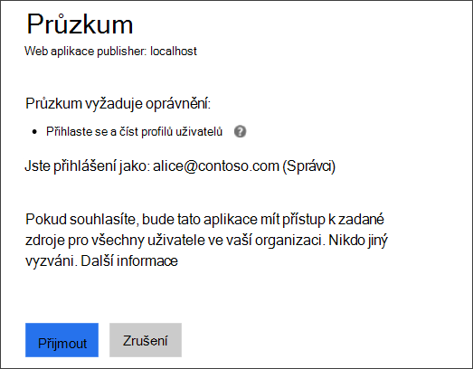
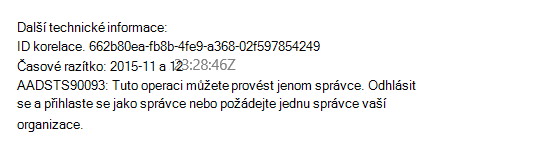
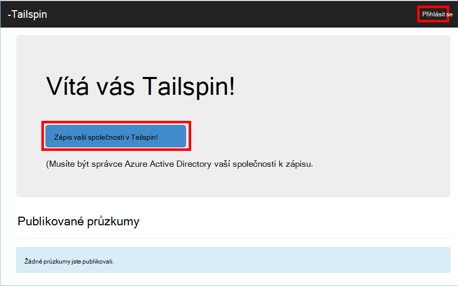
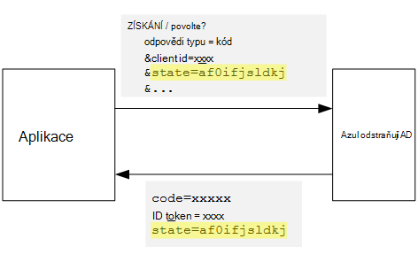
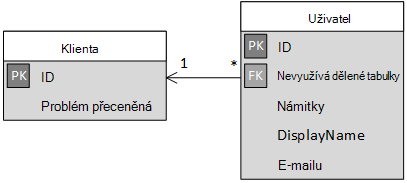

<properties
   pageTitle="Registrace a klient rychlého připojení aplikace víceklientské | Microsoft Azure"
   description="Jak integrovaný klienti víceklientské aplikace"
   services=""
   documentationCenter="na"
   authors="MikeWasson"
   manager="roshar"
   editor=""
   tags=""/>

<tags
   ms.service="guidance"
   ms.devlang="dotnet"
   ms.topic="article"
   ms.tgt_pltfrm="na"
   ms.workload="na"
   ms.date="05/23/2016"
   ms.author="mwasson"/>

# <a name="sign-up-and-tenant-onboarding-in-a-multitenant-application"></a>Registrace a klient rychlého připojení víceklientské aplikace

[AZURE.INCLUDE [pnp-header](../../includes/guidance-pnp-header-include.md)]

Tento článek je [součástí řady]. Je také úplné [Ukázková aplikace] , který doprovází řady.

Tento článek popisuje, jak provádět _Registrace_ zpracovat v aplikaci více klienta zákazníkům zaregistrovat jejich organizace aplikace umožňuje.
Existuje několik příčin implementovat proces zápisu:

-   Povolte správce AD o souhlasu pro celou organizaci zákazníka k používání aplikace.
-   Shromáždit platby platební kartou nebo Další informace o zákazníkovi.
-   Instalaci jakékoli jednorázové jednoho tenanta potřeby tak, že aplikace.

## <a name="admin-consent-and-azure-ad-permissions"></a>Správce souhlas a Azure AD oprávnění

Abyste mohli ověřovat pomocí Azure AD aplikace potřebuje přístup k adresáři uživatele. Minimálně potřebuje oprávnění ke čtení profilu uživatele. Při prvním uživatel přihlásí, Azure AD zobrazí stránce pro vyjádření souhlasu, který obsahuje požadované oprávnění. Kliknutím na tlačítko **přijmout**uživatel udělí oprávnění aplikace.

Ve výchozím nastavení souhlas uděleno na jednotlivé uživatele. Každý uživatel, který se přihlašuje zobrazí se stránka souhlas. Azure AD však také podporují _správu souhlas_, které umožňuje správcům AD souhlas pro celou organizaci.

Použijete toku souhlas správce stránce pro vyjádření souhlasu je uvedeno, že správce AD udělení oprávnění jménem na celém klientovi:



Po správce klikne na **přijmout**, můžete se ostatním uživatelům ve stejném klientovi a Azure AD přeskočí na obrazovce souhlas.

Pouze správce AD můžete zobrazit správce souhlas, protože udělí oprávnění za celou organizaci. Pokud není správcem se pokusí o ověření toku souhlas správce, Azure AD chybovou zprávu:



Pokud aplikace vyžaduje další oprávnění a později, zákazníka muset znovu přihlásit a souhlas s aktualizovanými oprávnění.  

## <a name="implementing-tenant-sign-up"></a>Provádění klienta registrace

Pro [Průzkumy Tailspin] [ Tailspin] aplikace, byla definována několik požadavků pro procesu registrace:

-   Klienta musíte přihlásit, aby mohli uživatelé přihlašovat.
-   Registrace používá toku souhlas správce.
-   Registrace přidá klienta uživatele do databáze aplikace.
-   Po zaregistruje ke klientovi aplikace ukazuje stránku rychlého připojení.

V této části budete projdeme naše provádění procesu registrace.
Je důležité, pokud chcete zjistit, že "registrace" a "přihlásit" je koncept aplikace. Během tok ověřování Azure AD neví podstatě zda je uživatel procesu registrace. Je aplikaci ke sledování kontextu.

Anonymní uživatel návštěvy aplikaci zjišťování, uživatel při zachycujících dvou tlačítek, jeden se přihlásit a druhý na "zapsat vaší společnosti" (přihlásit).



Tato tlačítka vyvolat akce ve třídě [AccountController] .

`SignIn` Akce vrátí **ChallegeResult**, který způsobuje middleware OpenID připojit k přesměrování na koncový bod ověřování. Toto je výchozí umožňuje ověřování aktivační událost v ASP.NET Core 1.0.  

```csharp
[AllowAnonymous]
public IActionResult SignIn()
{
    return new ChallengeResult(
        OpenIdConnectDefaults.AuthenticationScheme,
        new AuthenticationProperties
        {
            IsPersistent = true,
            RedirectUri = Url.Action("SignInCallback", "Account")
        });
}
```

Porovnejte `SignUp` akce:

```csharp
[AllowAnonymous]
public IActionResult SignUp()
{
    // Workaround for https://github.com/aspnet/Security/issues/546
    HttpContext.Items.Add("signup", "true");

    var state = new Dictionary<string, string> { { "signup", "true" }};
    return new ChallengeResult(
        OpenIdConnectDefaults.AuthenticationScheme,
        new AuthenticationProperties(state)
        {
            RedirectUri = Url.Action(nameof(SignUpCallback), "Account")
        });
}
```

Jako `SignIn`, `SignUp` akce vrátí také `ChallengeResult`. Ale tentokrát přičteme v části informace o stavu k `AuthenticationProperties` v `ChallengeResult`:

-   registrace používání: příznaku Boolean označující, že uživatel spustila procesu registrace.

Informace o stavu v `AuthenticationProperties` se přidají do parametr OpenID připojení [Stav] , který zaokrouhlení výletů během tok ověřování.



Když uživatel ověří v Azure AD a přesměrovaná zpátky do aplikace, lístek ověření obsahuje informace o stavu. Aby zkontrolovala, jestli že hodnotu "registrace" potrvají napříč celou ověřování tok používáme tuto skutečnost.

## <a name="adding-the-admin-consent-prompt"></a>Přidání řádku souhlas správce

V Azure AD toku souhlas správce spouštěný přidáním "Výzva" parametru řetězce dotazu požadavku na ověření:

```
/authorize?prompt=admin_consent&...
```

Průzkumy aplikace přidá na výzvu během `RedirectToAuthenticationEndpoint` události. Tato událost je místo toho vpravo před middleware přesměruje koncový bod ověřování.

```csharp
public override Task RedirectToAuthenticationEndpoint(RedirectContext context)
{
    if (context.IsSigningUp())
    {
        context.ProtocolMessage.Prompt = "admin_consent";
    }

    _logger.RedirectToIdentityProvider();
    return Task.FromResult(0);
}
```

> [AZURE.NOTE] V tématu [SurveyAuthenticationEvents.cs].

Nastavení` ProtocolMessage.Prompt` říká middleware přidáte parametr "Výzva" na požadavek na ověření.

Všimněte si, že na výzvu stačí během registrace. Běžná přihlašovací neměli ji připojit. K rozlišení mezi nimi, doporučujeme zkontrolovat `signup` hodnotu v stav ověření. Tato podmínka kontroluje podle pokynů pro rozšíření:

```csharp
internal static bool IsSigningUp(this BaseControlContext context)
{
    Guard.ArgumentNotNull(context, nameof(context));

    string signupValue;
    object obj;
    // Check the HTTP context and convert to string
    if (context.HttpContext.Items.TryGetValue("signup", out obj))
    {
        signupValue = (string)obj;
    }
    else
    {
        // It's not in the HTTP context, so check the authentication ticket.  If it's not there, we aren't signing up.
        if ((context.AuthenticationTicket == null) ||
            (!context.AuthenticationTicket.Properties.Items.TryGetValue("signup", out signupValue)))
        {
            return false;
        }
    }

    // We have found the value, so see if it's valid
    bool isSigningUp;
    if (!bool.TryParse(signupValue, out isSigningUp))
    {
        // The value for signup is not a valid boolean, throw                
        throw new InvalidOperationException($"'{signupValue}' is an invalid boolean value");
    }

    return isSigningUp;
}
```

> [AZURE.NOTE] V tématu [BaseControlContextExtensions.cs].

> [AZURE.NOTE] Poznámka: Tento kód obsahuje alternativní řešení: pro známý problém v ASP.NET Core 1.0 RC1. V `RedirectToAuthenticationEndpoint` události, nejde žádným způsobem zobrazíte vlastnosti ověřování, který obsahuje informace o stavu "zápisu k". Jako alternativu `AccountController.SignUp` metoda také umístí stavu "registrace" do `HttpContext`. To funguje, protože `RedirectToAuthenticationEndpoint` předchází přesměrování, proto jsme přesto stejné `HttpContext`.

## <a name="registering-a-tenant"></a>Registrace ke klientovi

Průzkumy aplikace ukládá některé informace o jednotlivých klienta a uživatele v databázi aplikace.



V tabulce klienta IssuerValue hodnotu deklarace Vystavitel klienta. Azure AD jde o `https://sts.windows.net/<tentantID>` a poskytuje jedinečnou hodnotu jednoho klienta.

Když nového klienta zaregistruje, průzkumy aplikace zapisuje záznamu klienta do databáze. K tomu dojde uvnitř `AuthenticationValidated` události. (Není to udělat před událostí, protože ID token nebude ověřený ještě, takže nemůžete důvěřovat hodnoty deklarace. V tématu [ověření].

Tady je příslušný kód z aplikace průzkumy:

```csharp
public override async Task AuthenticationValidated(AuthenticationValidatedContext context)
{
    var principal = context.AuthenticationTicket.Principal;
    var userId = principal.GetObjectIdentifierValue();
    var tenantManager = context.HttpContext.RequestServices.GetService<TenantManager>();
    var userManager = context.HttpContext.RequestServices.GetService<UserManager>();
    var issuerValue = principal.GetIssuerValue();
    _logger.AuthenticationValidated(userId, issuerValue);

    // Normalize the claims first.
    NormalizeClaims(principal);
    var tenant = await tenantManager.FindByIssuerValueAsync(issuerValue)
        .ConfigureAwait(false);

    if (context.IsSigningUp())
    {
        // Originally, we were checking to see if the tenant was non-null, however, this would not allow
        // permission changes to the application in AAD since a re-consent may be required.  Now we just don't
        // try to recreate the tenant.
        if (tenant == null)
        {
            tenant = await SignUpTenantAsync(context, tenantManager)
                .ConfigureAwait(false);
        }

        // In this case, we need to go ahead and set up the user signing us up.
        await CreateOrUpdateUserAsync(context.AuthenticationTicket, userManager, tenant)
            .ConfigureAwait(false);
    }
    else
    {
        if (tenant == null)
        {
            _logger.UnregisteredUserSignInAttempted(userId, issuerValue);
            throw new SecurityTokenValidationException($"Tenant {issuerValue} is not registered");
        }

        await CreateOrUpdateUserAsync(context.AuthenticationTicket, userManager, tenant)
            .ConfigureAwait(false);
    }
}
```

> [AZURE.NOTE] V tématu [SurveyAuthenticationEvents.cs].

Tento kód dělá toto:

1.  Zaškrtněte, pokud klienta Vystavitel hodnotu již v databázi. Pokud není registraci klienta, `FindByIssuerValueAsync` chybovou hodnotu null.
2.  Pokud je uživatel registrace:
  1.    Přidání klienta do databáze (`SignUpTenantAsync`).
  2.    Přidání ověřeného uživatele pro databázi (`CreateOrUpdateUserAsync`).
3.  V opačném případě dokončení normálního toku přihlášení:
  1.    Pokud klienta Vystavitel nebyl nalezen v databázi, znamená to není registrovaný klienta a zákazník musí přihlásit. V takovém případě výjimku způsobilo neúspěšné ověření.
  2.    V opačném vytvořit záznam databáze pro tohoto uživatele, pokud tam není jednu (`CreateOrUpdateUserAsync`).

Tady je způsob [SignUpTenantAsync] přidá klienta do databáze.

```csharp
private async Task<Tenant> SignUpTenantAsync(BaseControlContext context, TenantManager tenantManager)
{
    Guard.ArgumentNotNull(context, nameof(context));
    Guard.ArgumentNotNull(tenantManager, nameof(tenantManager));

    var principal = context.AuthenticationTicket.Principal;
    var issuerValue = principal.GetIssuerValue();
    var tenant = new Tenant
    {
        IssuerValue = issuerValue,
        Created = DateTimeOffset.UtcNow
    };

    try
    {
        await tenantManager.CreateAsync(tenant)
            .ConfigureAwait(false);
    }
    catch(Exception ex)
    {
        _logger.SignUpTenantFailed(principal.GetObjectIdentifierValue(), issuerValue, ex);
        throw;
    }

    return tenant;
}
```

Tady je přehled celý registrace tok v aplikaci průzkumy:

1.  Kliknutí na tlačítko **Odhlásit se** .
2.  `AccountController.SignUp` Akce vrátí výsledek challege.  Stav ověření obsahuje hodnotu "registrace".
3.  V `RedirectToAuthenticationEndpoint` události, přidat `admin_consent` řádku.
4.  Připojení OpenID middleware přesměruje Azure AD a uživatel ověří.
5.  V `AuthenticationValidated` události, hledejte stavu "zápisu k".
6.  Přidání klienta do databáze.

## <a name="next-steps"></a>Další kroky

- Přečtěte si další článek v této řadě: [role aplikací víceklientské aplikace][app roles]


<!-- Links -->
[app roles]: guidance-multitenant-identity-app-roles.md
[Tailspin]: guidance-multitenant-identity-tailspin.md
[součástí řady]: guidance-multitenant-identity.md
[AccountController]: https://github.com/Azure-Samples/guidance-identity-management-for-multitenant-apps/blob/master/src/Tailspin.Surveys.Web/Controllers/AccountController.cs
[Stav]: http://openid.net/specs/openid-connect-core-1_0.html#AuthRequest
[SurveyAuthenticationEvents.cs]: https://github.com/Azure-Samples/guidance-identity-management-for-multitenant-apps/blob/master/src/Tailspin.Surveys.Web/Security/SurveyAuthenticationEvents.cs
[BaseControlContextExtensions.cs]: https://github.com/Azure-Samples/guidance-identity-management-for-multitenant-apps/blob/master/src/Tailspin.Surveys.Web/Security/BaseControlContextExtensions.cs
[Ověřování]: guidance-multitenant-identity-authenticate.md
[SignUpTenantAsync]: https://github.com/Azure-Samples/guidance-identity-management-for-multitenant-apps/blob/master/src/Tailspin.Surveys.Web/Security/SurveyAuthenticationEvents.cs
[Ukázková aplikace]: https://github.com/Azure-Samples/guidance-identity-management-for-multitenant-apps
