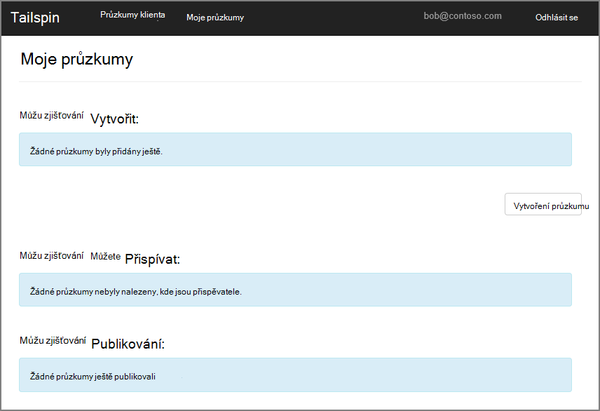
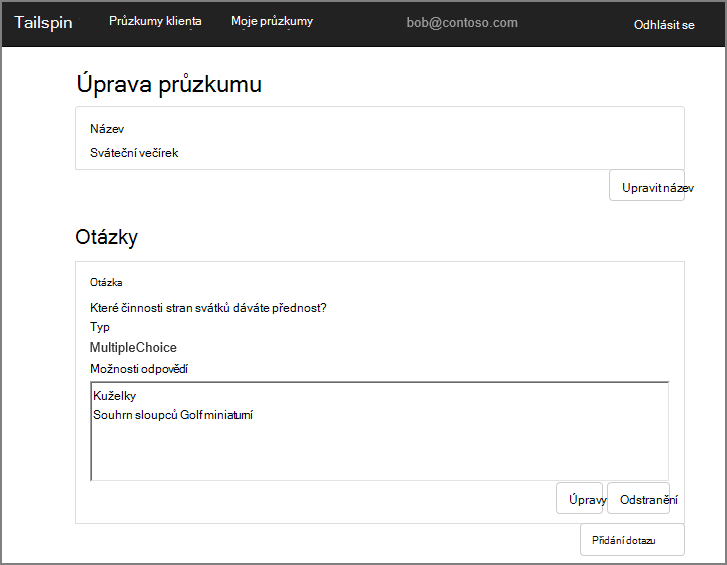
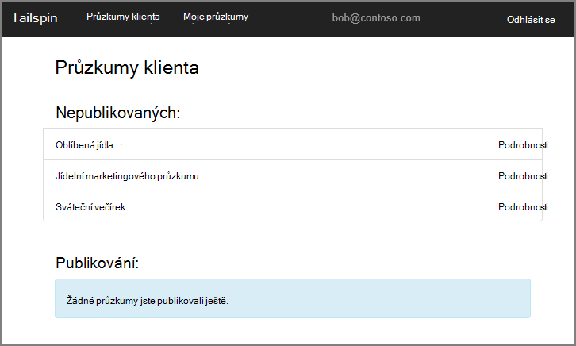
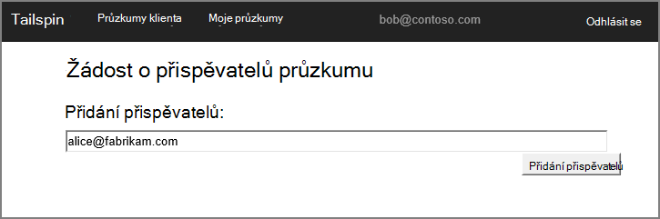
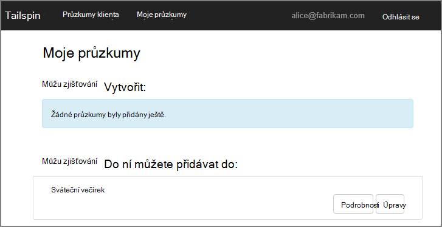

<properties
   pageTitle="O aplikaci Tailspin průzkumy | Microsoft Azure"
   description="Přehled aplikací průzkumy Tailspin"
   services=""
   documentationCenter="na"
   authors="MikeWasson"
   manager="roshar"
   editor=""
   tags=""/>

<tags
   ms.service="guidance"
   ms.devlang="dotnet"
   ms.topic="article"
   ms.tgt_pltfrm="na"
   ms.workload="na"
   ms.date="05/23/2016"
   ms.author="mwasson"/>

# Informace o aplikaci Tailspin průzkumy

[AZURE.INCLUDE [pnp-header](../../includes/guidance-pnp-header-include.md)]

Tento článek je [součástí řady]. Je také úplné [Ukázková aplikace] , který doprovází řady.

Tailspin je fiktivní společnost, která vyvíjí SaaS aplikace s názvem průzkumy. Tato aplikace umožňuje organizacím umožňují vytvářet a publikovat průzkumy online.

- Organizaci můžou zaregistrovat ke aplikace.
- Po organizace je nemáte, můžete podepisovat uživatele do aplikace pomocí svých přihlašovacích údajů organizace.
- Uživatelé můžete vytvářet, upravovat a publikovat průzkumy.

> [AZURE.NOTE] Začínáme s aplikací, najdete v tématu [spuštění aplikace průzkumy].

## Uživatelé můžete vytvářet, upravovat a zobrazovat průzkumy

Ověřený uživatel můžete zobrazit všechny průzkumy, které se u něho vytvořila nebo má přispěvatelů práva a vytvořit nové průzkumy. Všimněte si, že uživatel přihlášení pomocí své identity organizační `bob@contoso.com`.

Tento snímek obrazovky se zobrazí na stránce Upravit průzkumu:

Uživatele můžete prohlédnout všechny průzkumy vytvořil ostatním uživatelům ve stejném klientovi.

## Vlastníci průzkumu můžete pozvat přispěvatelů

Když uživatel vytvoří průzkumu, kterými váš kolega pozvat další osoby stát přispěvateli na průzkum. Přispěvatelům můžete upravit průzkumu, ale nemůže odstranit nebo publikujte.  

Uživatele můžete přidat přispěvatele z jiných klienti umožňující křížově klienta sdílení zdrojů. V tomto snímek, Jan (`bob@contoso.com`) přidává Alice (`alice@fabrikam.com`) jako přispěvatele do průzkumu vytvořenou Jan.

Pokud Alice připojí, zobrazí průzkumu uvedené v části "Můžu přispět k zjišťování".

Všimněte si, že Alice přihlásí k vlastní klienta, ne jako Host Contoso klienta. Alice oprávnění Přispěvatel pouze pro tento průzkum &mdash; kontakt nejde zobrazit další průzkumy z klienta Contoso.

## Architektura

Průzkumy aplikace tvořeno webových front-end a back-end webového rozhraní API. Jak implementovat, pomocí [ASP.NET Core 1.0].

Webová aplikace používá Azure Active Directory (Azure AD) pro ověřování uživatelů. Webová aplikace taky hovorů Azure AD zobrazíte tokeny OAuth 2 přístup pro rozhraní API webových. Tokeny přístupu jsou uložené v mezipaměti Redis Azure. Mezipaměť umožňuje několika instancích spuštěných sdílení mezipaměti stejné tokenu (například v serverové farmy).

## Další kroky

- Přečtěte si další článek v této řadě: [ověřování víceklientské aplikace pomocí služby Azure Active Directory a OpenID připojení][authentication]

<!-- Links -->

[authentication]: guidance-multitenant-identity-authenticate.md
[součástí řady]: guidance-multitenant-identity.md
[Spuštění aplikace průzkumy]: https://github.com/Azure-Samples/guidance-identity-management-for-multitenant-apps/blob/master/docs/running-the-app.md
[Základní ASP.NET 1.0]: https://docs.asp.net/en/latest/
[Ukázková aplikace]: https://github.com/Azure-Samples/guidance-identity-management-for-multitenant-apps
