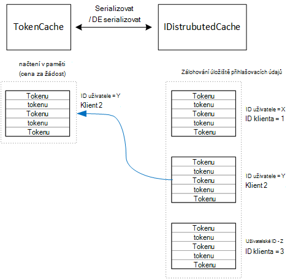

<properties
   pageTitle="Ukládání do mezipaměti přístupu tokeny víceklientské aplikaci | Microsoft Azure"
   description="Ukládání do mezipaměti tokeny přístupu pro vyvolání rozhraní API webových back-end"
   services=""
   documentationCenter="na"
   authors="MikeWasson"
   manager="roshar"
   editor=""
   tags=""/>

<tags
   ms.service="guidance"
   ms.devlang="dotnet"
   ms.topic="article"
   ms.tgt_pltfrm="na"
   ms.workload="na"
   ms.date="02/16/2016"
   ms.author="mwasson"/>


# <a name="caching-access-tokens-in-a-multitenant-application"></a>Ukládání do mezipaměti tokeny přístupu víceklientské aplikace

[AZURE.INCLUDE [pnp-header](../../includes/guidance-pnp-header-include.md)]

Tento článek je [součástí řady]. Je také úplné [Ukázková aplikace] , který doprovází řady.

Je poměrně drahé se dostat OAuth tokenu, protože se musí žádost HTTP tokenu koncový bod. Proto je vhodné mezipaměti tokeny kdykoli je to možné. [Azure AD Authentication Library] [ ADAL] (ADAL) automaticky ukládá tokeny získané Azure AD, včetně tokeny aktualizace.

ADAL obsahuje výchozí implementace tokenu mezipaměti. Však je určená pro aplikace native client – tokenu mezipaměti a _není_ vhodné pro webové aplikace:

-   Je statické instance a ne vlákna bezpečí.
-   Není měřítko do většího počtu uživatelů, protože tokeny všem uživatelům přejděte do stejné slovníku.
-   Nejde sdílet na webu serverech ve farmě.

Místo toho měli implementovat vlastní tokenu mezipaměti, která je odvozena z ADAL `TokenCache` třídy ale je vhodné pro prostředí serveru a poskytuje žádoucí úroveň izolace mezi tokeny pro jiné uživatele.

`TokenCache` Třídy ukládá slovník tokenů indexované vystavitel, zdrojů, ID klienta a uživatele. Vlastní token mezipaměti by měly zapisovat tento slovník záložní úložiště, jako je Redis mezipaměti.

V aplikaci Tailspin průzkumy `DistributedTokenCache` třídy implementuje tokenu mezipaměti. Tato implementace používá [IDistributedCache] [ distributed-cache] odběru služby základní 1.0 ASP.NET. Tak všechny `IDistributedCache` implementaci mohou sloužit jako záložní úložiště.

-   Ve výchozím nastavení používá aplikaci průzkumy Redis mezipaměti.
-   Jednou instancí webového serveru, můžete použít základní 1.0 ASP.NET [v mezipaměti][in-memory-cache]. (Toto je taky dobré možnosti pro spuštění aplikace místně průběhu vývoje.)

> [AZURE.NOTE] Mezipaměť Redis není podporována pro .NET Core.

`DistributedTokenCache`jsou uložená data v mezipaměti jako klíč/dvojice v úložišti zálohování. Klíči je ID uživatele plus ID klienta, abyste záložní úložiště obsahuje data samostatné mezipaměti pro každou jedinečnou kombinaci klienta a uživatele.



Záložní úložiště je rozdělen uživatelem. Pro každou žádost HTTP tokeny pro daného uživatele čtou z obchodu zálohování a načtená `TokenCache` slovníku. Pokud Redis slouží jako úložiště zálohování všechny instance serveru v serverové farmy čtení a zápis do stejné mezipaměti a upraví tento přístup pro mnoho uživatelů.

## <a name="encrypting-cached-tokens"></a>Šifrování režim cached tokenů

Tokeny jsou citlivá data, protože udělení přístupu k prostředkům uživatele. (Navíc na rozdíl od uživatelského hesla, nelze jenom ukládat hash tokenu.) Proto je naprosto zásadní zabránit právě ohroženo tokeny. Mezipaměť záložní Redis je chráněn heslem, ale pokud někdo získá heslo, může dostanou celému tokeny režim cached přístup. Z tohoto důvodu `DistributedTokenCache` šifruje všechno, co, který data zapisuje k úložišti zálohování. Probíhá šifrování pomocí ASP.NET Core 1.0 [ochranu dat] [ data-protection] rozhraní API.

> [AZURE.NOTE] Když nasadíte k webům Azure, šifrovacího klíče zálohovala k základnímu úložišti sítě a synchronizovat ve všech počítačích (viz [Správy klíčů][key-management]). Ve výchozím nastavení nejsou šifrované klíče při spuštění v Azure webů, ale můžete [Povolit šifrování pomocí certifikátu X.509][x509-cert-encryption].


## <a name="distributedtokencache-implementation"></a>Provádění DistributedTokenCache

[DistributedTokenCache] [ DistributedTokenCache] předmětu je odvozena z ADAL [TokenCache] [ tokencache-class] předmětu.

V konstruktoru `DistributedTokenCache` tříd vytvoří klíč pro aktuálního uživatele a načte mezipaměti ze záložní úložiště:

```csharp
public DistributedTokenCache(
    ClaimsPrincipal claimsPrincipal,
    IDistributedCache distributedCache,
    ILoggerFactory loggerFactory,
    IDataProtectionProvider dataProtectionProvider)
    : base()
{
    _claimsPrincipal = claimsPrincipal;
    _cacheKey = BuildCacheKey(_claimsPrincipal);
    _distributedCache = distributedCache;
    _logger = loggerFactory.CreateLogger<DistributedTokenCache>();
    _protector = dataProtectionProvider.CreateProtector(typeof(DistributedTokenCache).FullName);
    AfterAccess = AfterAccessNotification;
    LoadFromCache();
}
```

Klíč vytvořen zřetězením ID uživatele a ID klienta. Obě tyto jsou odebrány deklarací součástí uživatele `ClaimsPrincipal`:

```csharp
private static string BuildCacheKey(ClaimsPrincipal claimsPrincipal)
{
    string clientId = claimsPrincipal.FindFirstValue("aud", true);
    return string.Format(
        "UserId:{0}::ClientId:{1}",
        claimsPrincipal.GetObjectIdentifierValue(),
        clientId);
}
```

Načíst data v mezipaměti, najdete sériové objektů blob ze záložní úložiště a volání `TokenCache.Deserialize` převést objektů blob data v mezipaměti.

```csharp
private void LoadFromCache()
{
    byte[] cacheData = _distributedCache.Get(_cacheKey);
    if (cacheData != null)
    {
        this.Deserialize(_protector.Unprotect(cacheData));
    }
}
```

Pokaždé, když ADAL přístup do mezipaměti, aktivuje `AfterAccess` události. Pokud data v mezipaměti změnila, `HasStateChanged` vlastnost na hodnotu true. V takovém případě aktualizovat záložní úložiště změně a pak nastavte `HasStateChanged` na hodnotu false.

```csharp
public void AfterAccessNotification(TokenCacheNotificationArgs args)
{
    if (this.HasStateChanged)
    {
        try
        {
            if (this.Count > 0)
            {
                _distributedCache.Set(_cacheKey, _protector.Protect(this.Serialize()));
            }
            else
            {
                // There are no tokens for this user/client, so remove the item from the cache.
                _distributedCache.Remove(_cacheKey);
            }
            this.HasStateChanged = false;
        }
        catch (Exception exp)
        {
            _logger.WriteToCacheFailed(exp);
            throw;
        }
    }
}
```

TokenCache odešle dvou událostí:

- `BeforeWrite`. S názvem těsně před ADAL zapíše do mezipaměti. Tímto způsobem můžete provádět souběžné strategii
- `BeforeAccess`. S názvem těsně před ADAL přečte z mezipaměti. Tady můžete načíst znovu mezipaměti nejnovější verzi.

V našem případě jsme rozhodla zpracování těchto dvou událostí.

- Souběžné posledního zápisu wins. Který je v pořádku, protože tokeny jsou uloženy nezávisle na sobě pro každého uživatele + klienta, takže konflikt by pouze dojít, pokud má stejné uživatel dvě souběžné přihlášení relace.
- Pro čtení, jsme načíst mezipaměť na každou žádost. Žádosti se zkrátí. Pokud mezipaměti získá změněno v té době, vyzvedne dalším požadavku na novou hodnotu.

## <a name="next-steps"></a>Další kroky

- Přečtěte si další článek v této řadě: [Federating se službou AD FS zákazníka víceklientské aplikací v Azure][adfs]

<!-- links -->
[ADAL]: https://msdn.microsoft.com/library/azure/jj573266.aspx
[adfs]: guidance-multitenant-identity-adfs.md
[data-protection]: https://docs.asp.net/en/latest/security/data-protection/index.html
[distributed-cache]: https://docs.asp.net/en/latest/fundamentals/distributed-cache.html
[DistributedTokenCache]: https://github.com/Azure-Samples/guidance-identity-management-for-multitenant-apps/blob/master/src/Tailspin.Surveys.TokenStorage/DistributedTokenCache.cs
[key-management]: https://docs.asp.net/en/latest/security/data-protection/configuration/default-settings.html
[in-memory-cache]: https://docs.asp.net/en/latest/fundamentals/caching.html
[tokencache-class]: https://msdn.microsoft.com/library/azure/microsoft.identitymodel.clients.activedirectory.tokencache.aspx
[x509-cert-encryption]: https://docs.asp.net/en/latest/security/data-protection/implementation/key-encryption-at-rest.html#x-509-certificate
[součástí řady]: guidance-multitenant-identity.md
[Ukázková aplikace]: https://github.com/Azure-Samples/guidance-identity-management-for-multitenant-apps
