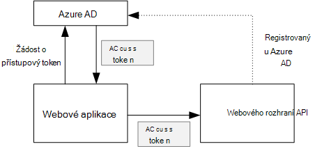
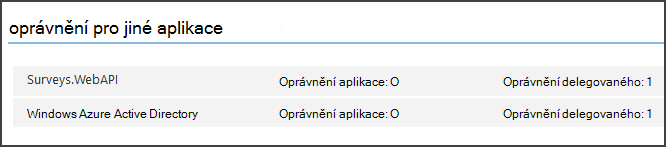

<properties
   pageTitle="Zabezpečení back-end webového rozhraní API aplikace víceklientské | Microsoft Azure"
   description="Jak zajistit back-end webového rozhraní API"
   services=""
   documentationCenter="na"
   authors="MikeWasson"
   manager="roshar"
   editor=""
   tags=""/>

<tags
   ms.service="guidance"
   ms.devlang="dotnet"
   ms.topic="article"
   ms.tgt_pltfrm="na"
   ms.workload="na"
   ms.date="06/02/2016"
   ms.author="mwasson"/>

# <a name="securing-a-backend-web-api-in-a-multitenant-application"></a>Zabezpečení back-end webového rozhraní API víceklientské aplikace

[AZURE.INCLUDE [pnp-header](../../includes/guidance-pnp-header-include.md)]

Tento článek je [součástí řady]. Je také úplné [Ukázková aplikace] , který doprovází řady.

Aplikace [Tailspin průzkumy] používá back-end webového rozhraní API pro správu s průzkumy operace CRUD. Po kliknutí "Moje průzkumy", webové aplikace odešle žádost HTTP do webového rozhraní API:

```
GET /users/{userId}/surveys
```

Webového rozhraní API vrátí objekt JSON:

```
{
  "Published":[],
  "Own":[
    {"Id":1,"Title":"Survey 1"},
    {"Id":3,"Title":"Survey 3"},
    ],
  "Contribute": [{"Id":8,"Title":"My survey"}]
}
```

Webového rozhraní API neumožňuje anonymní požadavky, aby web appu musí dokončit ověření používání tokenů nosný OAuth 2.

> [AZURE.NOTE] Toto je scénáři na serveru. Aplikace abyste nevolali všechny AJAX k rozhraní API z klientského prohlížeče.

Existují dva hlavní způsoby, kterými můžete:

- Delegovat identita uživatele. Webová aplikace ověří s identita uživatele.
- Identita aplikace. Webová aplikace ověří s jeho klienta ID, pomocí OAuth2 klienta pověření toku.

Aplikaci Tailspin používá identity delegované uživatele. Tady jsou hlavní rozdíly:

**Identita delegovaného uživatele**

- Nosný token posílat webového rozhraní API obsahuje identita uživatele.
- Webového rozhraní API rozhoduje se tak mohli ověřovat podle identita uživatele.
- Webová aplikace musí obsloužení 403 chyb (zakázáno) z webového rozhraní API, pokud uživatel nemá oprávnění k provedení akce.
- Obvykle webové aplikace pořád rozhoduje některé se tak mohli ověřovat ovlivňující uživatelského rozhraní, jako jsou zobrazení nebo skrytí prvkům uživatelského rozhraní).
- Rozhraní API webových může používat potenciálně nedůvěryhodných klienti, jako je JavaScript aplikace nebo aplikace native client –.

**Identita aplikace**

- Webového rozhraní API není získat informace o uživateli.
- Webového rozhraní API nelze provést povolení podle identita uživatele. Všechna rozhodnutí týkající se tak mohli ověřovat jsou určené webovou aplikací.  
- Rozhraní API webových nelze použít nedůvěryhodných klientem (JavaScript nebo nativní klientské aplikaci).
- Tento postup může být trochu jednodušší provádět, protože bez použití logických operátorů se tak mohli ověřovat v rozhraní API webových.

V obou přístup musíte nejprve získat webové aplikace přístupový token, který je potřeba zavolat webového rozhraní API přihlašovacích údajů.

- Pro identitu pověřený uživatel token musí pocházet z IDP, která umožňuje vydávat token jménem uživatele.

- Klienta v části přihlašovací údaje může aplikace získání token z IDP nebo hostovat vlastní token server. (Ale ne psaní tokenu serveru od začátku, používat dobře testované rámec jako [IdentityServer3].) Pokud ověření s Azure AD má důrazně doporučujeme přejít přístupový token z Azure AD, dokonce i s toku pověření klienta.

Ve zbývající části tohoto článku se předpokládá, že aplikace ověřování s Azure AD.



## <a name="register-the-web-api-in-azure-ad"></a>Registrace webového rozhraní API v Azure AD

Aby Azure AD o vystavení nosný token webového rozhraní API musíte nakonfigurovat několik položek, které Azure AD.

1. [Registrace webového rozhraní API v Azure AD].

2. Přidat kód klienta ve web appu manifest webového rozhraní API aplikace `knownClientApplications` vlastnost. V tématu [aktualizace manifesty aplikace].

3. [Udělit oprávnění webové aplikace volání webového rozhraní API].

  Na portálu Správa Azure můžete nastavit dva typy oprávnění: "Oprávnění aplikace" pro identitu (toku pověření klienta) nebo "Delegovat oprávnění" identity delegované uživatele.

  

## <a name="getting-an-access-token"></a>Získání přístupový token

Před voláním webového rozhraní API, webové aplikace získá přístupový token z Azure AD. V aplikaci .NET použít [Azure AD Authentication Library (ADAL) pro .NET][ADAL].

V toku kód se tak mohli ověřovat OAuth 2 výměny aplikace se tak mohli ověřovat kód pro přístupový token. Následující kód používá ADAL k získání přístupový token. Tento kód se nazývá během `AuthorizationCodeReceived` události.

```csharp
// The OpenID Connect middleware sends this event when it gets the authorization code.   
public override async Task AuthorizationCodeReceived(AuthorizationCodeReceivedContext context)
{
    string authorizationCode = context.ProtocolMessage.Code;
    string authority = "https://login.microsoftonline.com/" + tenantID
    string resourceID = "https://tailspin.onmicrosoft.com/surveys.webapi" // App ID URI
    ClientCredential credential = new ClientCredential(clientId, clientSecret);

    AuthenticationContext authContext = new AuthenticationContext(authority, tokenCache);
    AuthenticationResult authResult = await authContext.AcquireTokenByAuthorizationCodeAsync(
        authorizationCode, new Uri(redirectUri), credential, resourceID);

    // If successful, the token is in authResult.AccessToken
}
```

Tady jsou různé parametrů, které jsou potřebné:

- `authority`. Odvozeno z ID klienta přihlášený uživatel. (Není ID klienta poskytovatele SaaS)  
- `authorizationCode`. auth kód, který jste dostali od IDP zpět.
- `clientId`. ID webové aplikace klienta.
- `clientSecret`. Tajná klienta webové aplikace.
- `redirectUri`. Přesměrování identifikátor URI, který jste vytvořili OpenID připojení. Je to, kde IDP volá zpět tokenu.
- `resourceID`. Aplikace ID identifikátor URI webového rozhraní API, kterou jste vytvořili při registraci webového rozhraní API v Azure AD
- `tokenCache`. Objekt, který ukládá tokeny přístup. V tématu [Token ukládání do mezipaměti].

Pokud `AcquireTokenByAuthorizationCodeAsync` úspěšném ADAL ukládá tokenu. Později dostane tokenu z mezipaměti tak, že zavoláte AcquireTokenSilentAsync:

```csharp
AuthenticationContext authContext = new AuthenticationContext(authority, tokenCache);
var result = await authContext.AcquireTokenSilentAsync(resourceID, credential, new UserIdentifier(userId, UserIdentifierType.UniqueId));
```

kde `userId` je ID objektu uživatele, který je součástí `http://schemas.microsoft.com/identity/claims/objectidentifier` deklarace.

## <a name="using-the-access-token-to-call-the-web-api"></a>Vytočení webového rozhraní API pomocí přístupový token

Až budete mít tokenu, odešlete ho v záhlaví se tak mohli ověřovat požadavků protokolu HTTP webového rozhraní API.

```
Authorization: Bearer xxxxxxxxxx
```

Podle pokynů pro rozšíření z aplikace průzkumy nastaví se tak mohli ověřovat záhlaví na žádost HTTP pomocí třídy **HttpClient** .

```csharp
public static async Task<HttpResponseMessage> SendRequestWithBearerTokenAsync(this HttpClient httpClient, HttpMethod method, string path, object requestBody, string accessToken, CancellationToken ct)
{
    var request = new HttpRequestMessage(method, path);
    if (requestBody != null)
    {
        var json = JsonConvert.SerializeObject(requestBody, Formatting.None);
        var content = new StringContent(json, Encoding.UTF8, "application/json");
        request.Content = content;
    }

    request.Headers.Authorization = new AuthenticationHeaderValue("Bearer", accessToken);
    request.Headers.Accept.Add(new MediaTypeWithQualityHeaderValue("application/json"));

    var response = await httpClient.SendAsync(request, ct);
    return response;
}
```

> [AZURE.NOTE] V tématu [HttpClientExtensions.cs].

## <a name="authenticating-in-the-web-api"></a>Ověřování ve webového rozhraní API

Webového rozhraní API musí ověřit nosný token. V ASP.NET Core 1.0, můžete použít [Microsoft.AspNet.Authentication.JwtBearer] [ JwtBearer] balíčku. Tento balíček obsahuje middleware, který umožňuje přijímat připojení OpenID tokeny nosný.

Zaregistrovat middleware na webu rozhraní API `Startup` předmětu.

```csharp
app.UseJwtBearerAuthentication(options =>
{
    options.Audience = "[app ID URI]";
    options.Authority = "https://login.microsoftonline.com/common/";
    options.TokenValidationParameters = new TokenValidationParameters
    {
        //Instead of validating against a fixed set of known issuers, we perform custom multi-tenant validation logic
        ValidateIssuer = false,
    };
    options.Events = new SurveysJwtBearerEvents();
});
```

> [AZURE.NOTE] V tématu [Startup.cs].

- **Cílové skupiny**. Nastavte na adresu URL ID aplikace pro web rozhraní API, který jste vytvořili při registraci webového rozhraní API s Azure AD.
- **Autorita**. Pro aplikace víceklientské, nastavte `https://login.microsoftonline.com/common/`.
- **TokenValidationParameters**. U aplikace víceklientské nastavte **ValidateIssuer** NEPRAVDA. To znamená, že aplikace ověří Vystavitel.
- **Události** je třída, která je odvozena z **JwtBearerEvents**.

### <a name="issuer-validation"></a>Ověření vydavatel

Ověření vydavatele tokenu v případě **JwtBearerEvents.ValidatedToken** . Vystavitel odeslaný v deklaraci "iss".

V aplikaci průzkumy nezpracuje webového rozhraní API [klienta registrace]. Proto ho právě zkontroluje, jestli Vystavitel je už v databázi aplikace. V opačném případě ho výjimku, který způsobuje neúspěšné ověření.

```csharp
public override async Task ValidatedToken(ValidatedTokenContext context)
{
    var principal = context.AuthenticationTicket.Principal;
    var tenantManager = context.HttpContext.RequestServices.GetService<TenantManager>();
    var userManager = context.HttpContext.RequestServices.GetService<UserManager>();
    var issuerValue = principal.GetIssuerValue();
    var tenant = await tenantManager.FindByIssuerValueAsync(issuerValue);

    if (tenant == null)
    {
        // the caller was not from a trusted issuer - throw to block the authentication flow
        throw new SecurityTokenValidationException();
    }
}
```

> [AZURE.NOTE] V tématu [SurveysJwtBearerEvents.cs].

Taky můžete událost **ValidatedToken** dělat [deklarací transformace]. Mějte na paměti, že deklarace pocházet přímo z Azure AD tak, aby pokud webové aplikace všechny deklarací transformace, můžou být neprojevily v nosný token, že webového rozhraní API přijímá.

## <a name="authorization"></a>Povolení

Obecné informace o povolení naleznete v tématu [ověření na základě rolí a na základě zdroje][Authorization]. 

JwtBearer middleware zpracovává odpovědi se tak mohli ověřovat. Například omezit řadiče akce pro ověřeného uživatele, použijte atrribute **[povolení]** a zadejte **JwtBearerDefaults.AuthenticationScheme** jako schéma ověřování:

```csharp
[Authorize(ActiveAuthenticationSchemes = JwtBearerDefaults.AuthenticationScheme)]
```

To vrátí 401 stavový kód, pokud není ověření uživatele.

Pokud chcete omezit akce řadiče zásadami authorizaton, zadejte název zásady atribut **[povolení]** :

```csharp
[Authorize(Policy = PolicyNames.RequireSurveyCreator)]
```

To vrátí stavový kód 401 Pokud není ověření uživatele a 403, pokud je uživatel ověřen, ale nejsou povoleny. Registrace zásad při spuštění:

```csharp
public void ConfigureServices(IServiceCollection services)
{
    services.AddAuthorization(options =>
    {
        options.AddPolicy(PolicyNames.RequireSurveyCreator,
            policy =>
            {
                policy.AddRequirements(new SurveyCreatorRequirement());
                policy.AddAuthenticationSchemes(JwtBearerDefaults.AuthenticationScheme);
            });
    });
}
```

## <a name="next-steps"></a>Další kroky

- Přečtěte si další článek v této řadě: [ukládání do mezipaměti přístupové tokeny víceklientské aplikace][token cache]

<!-- links -->
[ADAL]: https://msdn.microsoft.com/library/azure/jj573266.aspx
[JwtBearer]: https://www.nuget.org/packages/Microsoft.AspNet.Authentication.JwtBearer
[součástí řady]: guidance-multitenant-identity.md
[Průzkumy Tailspin]: guidance-multitenant-identity-tailspin.md
[IdentityServer3]: https://github.com/IdentityServer/IdentityServer3
[Registrace webového rozhraní API v Azure AD]: https://github.com/Azure-Samples/guidance-identity-management-for-multitenant-apps/blob/master/docs/running-the-app.md#register-the-surveys-web-api
[Aktualizace manifesty aplikace]: https://github.com/Azure-Samples/guidance-identity-management-for-multitenant-apps/blob/master/docs/running-the-app.md#update-the-application-manifests
[Udělit oprávnění webové aplikace volání webového rozhraní API]: https://github.com/Azure-Samples/guidance-identity-management-for-multitenant-apps/blob/master/docs/running-the-app.md#give-the-web-app-permissions-to-call-the-web-api
[Tokenu ukládání do mezipaměti]: guidance-multitenant-identity-token-cache.md
[HttpClientExtensions.cs]: https://github.com/Azure-Samples/guidance-identity-management-for-multitenant-apps/blob/master/src/Tailspin.Surveys.Common/HttpClientExtensions.cs
[Startup.cs]: https://github.com/Azure-Samples/guidance-identity-management-for-multitenant-apps/blob/master/src/Tailspin.Surveys.WebAPI/Startup.cs
[registrace klienta]: guidance-multitenant-identity-signup.md
[SurveysJwtBearerEvents.cs]: https://github.com/Azure-Samples/guidance-identity-management-for-multitenant-apps/blob/master/src/Tailspin.Surveys.WebAPI/SurveyJwtBearerEvents.cs
[nároky transformace]: guidance-multitenant-identity-claims.md#claims-transformations
[Authorization]: guidance-multitenant-identity-authorize.md
[Ukázková aplikace]: https://github.com/Azure-Samples/guidance-identity-management-for-multitenant-apps
[token cache]: guidance-multitenant-identity-token-cache.md
