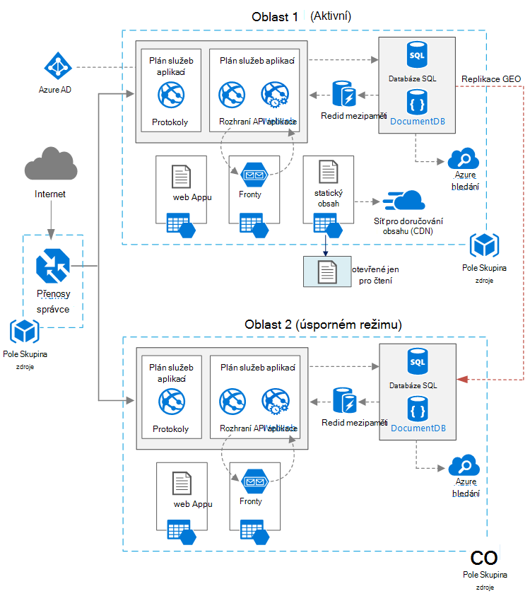

<properties
   pageTitle="Webová aplikace s vysokou dostupnost | Architektura Azure odkaz | Microsoft Azure"
   description="Doporučené architektura pro webovou aplikaci s vysokou dostupnost spuštěné v Microsoft Azure."
   services="app-service,app-service\web,sql-database" 
   documentationCenter="na"
   authors="MikeWasson"
   manager="roshar"
   editor=""
   tags=""/>

<tags
   ms.service="guidance"
   ms.devlang="na"
   ms.topic="article"
   ms.tgt_pltfrm="na"
   ms.workload="na"
   ms.date="06/27/2016"
   ms.author="mwasson"/>

# <a name="azure-reference-architecture-web-application-with-high-availability"></a>Architektura Azure odkaz: webové aplikace s vysokou dostupnost

[AZURE.INCLUDE [pnp-RA-branding](../../includes/guidance-pnp-header-include.md)]

Tento článek popisuje doporučené architektura pro webovou aplikaci s vysokou dostupnost, se systémem Microsoft Azure. Architektura je založena na [Architektura Azure odkaz: vylepšení škálovatelnost ve webové aplikaci][guidance-web-apps-scalability].

## <a name="architecture-diagram"></a>Diagram architektury



Tato architektura je založena na takové, jaké vidíte v [vylepšení škálovatelnost ve webové aplikaci][guidance-web-apps-scalability]. Hlavní rozdíly jsou:

- **Primární a sekundární oblastí**. Tato architektura používá k dosažení vyšší dostupnost dvou oblastí. Nasazení aplikace u jednotlivých oblastí. Běžného provozu v síti směrován k oblasti primární. Ale pokud, nebude k dispozici, přenosy směrován k oblasti sekundární. Podrobnosti o převzetí najdete v tématu [Správa překlopení](#managing-failover-and-failback).

- **Azure přenosy správce**. [Přenosy správce] [ traffic-manager] přesměrovává příchozí žádosti na primární oblast. Pokud aplikace dané oblasti nebude k dispozici, správce přenosy selhání na vedlejší oblast. 

- **Geo replikace** databáze SQL a DocumentDB.

## <a name="recommendations"></a>Doporučení

### <a name="regional-pairing"></a>Místní párování

Každou oblast Azure je spárované s jiné oblasti v rámci stejné zeměpisná oblast. Obecně vyberte oblastí stejné místní pár (například východoasijských USA 2 a střed USA). Výhody tím patří:

- Pokud existuje obecných výpadku, obnovení alespoň jeden oblasti mimo každou dvojici prioritu.
- Aktualizace plánované Azure systému rozšiřují párových oblasti postupně, na možné prostoje.
- Ve většině případů dvojice umístěny ve stejné zeměpisných dat sídlo požadavkům.

Přesvědčte, že obě oblasti podporují všechny potřebné pro aplikaci služby Azure. V tématu [služby podle regionů][services-by-region]. Další informace o místní dvojice najdete v tématu [firmy kontinuitu a havárie obnovení (BCDR): Azure párovaný oblastí][regional-pairs].

### <a name="resource-groups"></a>Skupiny zdrojů

Zvažte umístění primární oblast, sekundární oblast a provoz správce do jiné [skupiny zdrojů][resource groups]. Toto oprávnění umožňuje spravovat zdroje nasazených na každou oblast jako jediná kolekce &mdash; můžete nasadit samostatně, odstranit nasazení a tak dále. 

### <a name="traffic-manager"></a>Přenosy správce

**Směrování.** Přenosy správce podporuje několik [algoritmy směrování][tm-routing]. Scénář popisované v tomto článku využívat _Priorita_ směrování (dříve označovaného jako _převzetí_ směrování). S toto nastavení používají, přenosy správce rozešle všechny žádosti o primárního oblast, pokud koncový bod pro danou oblast bude dostupný. V tomto okamžiku automaticky dojde k chybě myší na vedlejší oblast. Najdete v článku [směrování metody konfigurace převzetí][tm-configure-failover].

**Zkušební stavu.** Přenosy správce používá HTTP (nebo HTTPS) zkušební sledovat dostupnost každé koncového bodu. Zkušební vám bude radit přenosy správce přijetí/vyloučení test při přechodu na vedlejší oblast. Funguje tak, že žádost o zadaný cesta URL. Pokud není 200 odpověď nenarazí v rámci časový limit, zkušební se nezdaří. Po čtyři Nezdařené požadavky přenosy správce označí koncový bod sníženou a selhání na druhý koncový bod. Další informace najdete v tématu [Sledování přenosy správce koncového bodu a převzetí][tm-monitoring].

Osvědčený vytvořte zkušební koncového bodu stavu, který sestavy celkový stav aplikace a použít tento koncový bod pro zkušební stavu. Koncový bod měli zkontrolovat závislostí důležité například aplikaci služby aplikace, fronty úložiště a databáze SQL. V opačném zkušební "pořádku" koncový bod při hlásit selhává skutečně důležité část aplikace. 

Na druhé straně nepoužívejte zkušební stavu ke kontrole nižší prioritou služby. Například pokud e-mailové služby přejde, aplikace můžete přepnout na druhý poskytovatele nebo jenom posílat e-maily. Aplikace pravděpodobně neměli převzetí v tomto případě. Další informace najdete v tématu [Vzorek sledování stavu koncový bod][health-endpoint-monitoring-pattern].
  
### <a name="sql-database"></a>Databáze SQL

Použití [Aktivní Geo replikace] [ sql-replication] vytvoření čitelné sekundární v jiné oblasti. Můžete mít až se čtyřmi čitelné druhotné. Když se vaše primární databáze nepovede, nebo jednoduše je potřeba vzít offline, je to možné převzetí některé z vašich sekundární databází. Aktivní Geo replikace je možné konfigurovat databáze v každém fondu pružná databáze.

### <a name="documentdb"></a>DocumentDB

DocumentDB podporuje geo replikace různých oblastí. Jednom regionu označen jako zapisovatelný a ostatní jsou kopie jen pro čtení. 

Pokud existuje místní výpadku, může selhat úplně od začátku výběr jiné oblasti, kterou chcete být oblasti zápisu. V klientovi DocumentDB SDK automaticky odešle zapisovat žádosti o aktuální oblasti zapsat, není potřeba aktualizovat po selhání konfigurace klienta. Další informace najdete v tématu [Rozmístit dat globálně s DocumentDB][docdb-geo]. 

> [AZURE.NOTE] Replice patří do stejné skupiny prostředků.

### <a name="storage"></a>Úložiště

Úložiště Azure pomocí [geo nadbytečné úložiště přístup pro čtení] [ ra-grs] (Vzdálená pomoc GRS). Vzdálená pomoc GRS úložiště data replikovat do vedlejší oblasti. Máte jen pro čtení přístup k datům v oblasti sekundární prostřednictvím samostatné koncového bodu. Pokud je místní výpadku nebo havárie, může provádět geo přepnutí do oblasti sekundárním určuje týmu Azure úložiště. Je požadována pro tento převzetí žádná akce zákazníka.

Úložištěm fronty vytvořte záložní fronty v oblasti sekundární. Při selhání můžete aplikaci používat frontě záložní, dokud oblasti primární znovu k dispozici. Tímto způsobem aplikace nadále zpracovávat nových žádostí o. 

## <a name="availability-considerations"></a>Důležité informace o dostupnosti

Architektura více oblastech může poskytovat vyšší dostupnost než nasadíte pro jednu oblast. Pokud výpadku místní blokování automaticky otevíraných primární oblasti, můžete k oblasti sekundární nepovede myší. Tato architektura můžou pomoct taky selže podsystému jednotlivé aplikace.  
     
K dosažení dostupnost přes datacentrech několik obecné způsoby:      
- Aktivní/pasivní s režimu. Přenosy přejde na jednom regionu při další čeká v úsporném režimu. Aplikace je nasazeném a spuštěné v oblasti sekundární. Můžete začít s menší počet instancí v centru sekundárního datového a potom rozšiřování podle potřeby. 

- Aktivní/pasivní s studenou úsporném režimu. Stejné, ale aplikace není nasazené dokud potřebné pro překlopení. Tento přístup náklady menší spustíte, ale bude obecně již dolů během se nepovede. 

- Aktivní/aktivní. Obě oblasti jsou aktivní a požadavky rozloženy mezi nimi. Pokud jeden datovém centru nebude k dispozici, se považuje mimo otočení. 

Tento článek se zaměřuje na aktivní/pasivní s žádanou úsporném režimu pomocí [Správce přenosy Azure] [ traffic-manager] provoz směrovat na oblast. 

### <a name="traffic-manager"></a>Přenosy správce

Přenosy správce automaticky selhání Pokud oblasti primární nebude k dispozici. Při selhání přenosy Manager je určité době, kdy klientů nelze kontaktovat aplikace, což může být několik minut. Dva faktory vliv na celkovou dobou trvání:

- Zkušební stav musíte zjistit primární datovém centru stal nedostupný.

- Servery DNS musíte aktualizovat záznamy z mezipaměti DNS na IP adresu, která závisí DNS time to live (TTL). Výchozí hodnota TTL je 300 sekund (5 minut), ale můžete nakonfigurovat tuto hodnotu při vytváření profilu přenosy správce.

Další informace najdete v tématu [O přenosu správce sledování][tm-monitoring]. 

Přenosy Manager je bod možné selhání systému. Když službu nepovede, klienti nemají přístup k aplikaci během výpadku. Kontrola [Přenosy správce SLA][tm-sla]a zjistit, zda správce přenosy samotný splňuje vaše obchodní požadavky vysoké dostupnosti. Pokud ne, můžete do ní přidat další řešení pro správu přenosy jako navrácení. Pokud službu Azure přenosy správce nepovede, změňte CNAME záznamů u DNS tak, aby ukazovaly na jiných přenosy službu pro správu. (Tento krok musíte provést ruční a aplikace nebude k dispozici, dokud šíření změn DNS.) 

### <a name="sql-database"></a>Databáze SQL

Obnovení čárky cíle (operace RPO) a obnovení předpokládanou dobu (Vložit) SQL databáze jsou popsané [v tomto poli][sql-rpo]. 

### <a name="storage"></a>Úložiště

Vzdálená pomoc GRS úložiště poskytuje trvalé úložiště, ale lepší je důležité pochopit, jak může dojít během výpadku: 

- Pokud dojde k výpadku úložiště, bude určité době, kdy nemáte zápisu přístupu k datům. Číst z sekundárním koncový bod můžete pořád během výpadku.

- Pokud místní výpadku nebo havárie ovlivňuje primární umístění a možné obnovit data tam, může provádět geo přepnutí do oblasti sekundární určit týmu Azure úložiště. 

- Replikace dat k oblasti sekundární proběhne asynchronní. Pokud provedených geo převzetí ztrátu dat tedy možné možné obnovit data z oblasti primárního.

- Přechodné chyby, například výpadku sítě neaktivují selhání úložiště. Návrh aplikace může pružné přechodná k chybám. Možné mitigations:

    - Číst z sekundární.

    - Dočasně přepněte do jiného účtu úložiště pro nové operace zápisu (například zprávy fronty). 

    - Kopírování dat z sekundární k jinému účtu úložiště.

    - Poskytuje omezená funkčnost, dokud zpět selhání systému.

Další informace najdete v článku [Co dělat, když dojde k úložišti Azure výpadku][storage-outage].

## <a name="managing-failover-and-failback"></a>Správa překlopení a překlopení zpět

### <a name="traffic-manager"></a>Přenosy správce

Přenosy správce automaticky selhání Pokud oblasti primární nebude k dispozici. Ve výchozím nastavení taky automaticky selže zpět, jakmile oblasti primární znovu k dispozici.

Doporučujeme však provedení ruční navrácení, spíše než automaticky selhání zpět. Než zpět, ověřte, zda všechny aplikace podsystémy správný. Jinak můžete vytvořit situaci, kdy aplikace překlápět sebou poslalo mezi datacentrech. 

Chcete-li zabránit tomu, aby automatické, snížit ručně prioritu primární oblasti po převzetí události. Předpokládejme například, oblasti primární je priorita záznamů 1 a sekundární je priorita záznamů 2. Jakmile přepojení nastavte primární oblast Priorita 3, kterou chcete zabránit tomu, aby automatické. Až budete chtít přepnout zpátky, obnovte prioritu 1.

Následující příkazy aktualizovat prioritu.

**Prostředí PowerShell** 

```bat
$endpoint = Get-AzureRmTrafficManagerEndpoint -Name <endpoint> -ProfileName <profile> -ResourceGroupName <resource-group> -Type AzureEndpoints
$endpoint.Priority = 3
Set-AzureRmTrafficManagerEndpoint -TrafficManagerEndpoint $endpoint
```

Další informace najdete v tématu [Rutiny přenosy správce Azure][tm-ps].

**Azure rozhraní příkazového řádku**

```bat
azure network traffic-manager endpoint set --name <endpoint> --profile-name <profile> --resource-group <resource-group> --type AzureEndpoints --priority 3
```    

### <a name="sql-database"></a>Databáze SQL

Když je hlavní databází nepovede, proveďte ruční přepnutí do vedlejší databáze. V tématu [obnovení databáze SQL Azure nebo převzetí na sekundární][sql-failover]. Dokud selhání, zůstane databázi vedlejší jen pro čtení. 


<!-- links -->

[azure-sql-db]: https://azure.microsoft.com/en-us/documentation/services/sql-database/
[docdb-geo]: ../documentdb/documentdb-distribute-data-globally.md
[guidance-web-apps-scalability]: guidance-web-apps-scalability.md
[health-endpoint-monitoring-pattern]: https://msdn.microsoft.com/library/dn589789.aspx
[ra-grs]: ../storage/storage-redundancy.md#read-access-geo-redundant-storage
[regional-pairs]: ../best-practices-availability-paired-regions.md
[resource groups]: ../resource-group-overview.md
[services-by-region]: https://azure.microsoft.com/en-us/regions/#services
[sql-failover]: ../sql-database/sql-database-disaster-recovery.md
[sql-replication]: ../sql-database/sql-database-geo-replication-overview.md
[sql-rpo]: ../sql-database/sql-database-business-continuity.md#sql-database-business-continuity-features
[storage-outage]: ../storage/storage-disaster-recovery-guidance.md
[tm-configure-failover]: ../traffic-manager/traffic-manager-configure-failover-routing-method.md
[tm-monitoring]: ../traffic-manager/traffic-manager-monitoring.md
[tm-ps]: https://msdn.microsoft.com/en-us/library/mt125941.aspx
[tm-routing]: ../traffic-manager/traffic-manager-routing-methods.md
[tm-sla]: https://azure.microsoft.com/en-us/support/legal/sla/traffic-manager/v1_0/
[traffic-manager]: https://azure.microsoft.com/en-us/services/traffic-manager/
