<properties
    pageTitle="Správa Hadoop clusterů pomocí portálu Azure HDInsight | Microsoft Azure"
    description="Naučte se spravovat službu HDInsight. Vytvoření HDInsight clusteru, spusťte konzolu interaktivní JavaScript a spusťte konzolu příkaz Hadoop."
    services="hdinsight"
    documentationCenter=""
    tags="azure-portal"
    authors="mumian"
    manager="jhubbard"
    editor="cgronlun"/>

<tags
    ms.service="hdinsight"
    ms.workload="big-data"
    ms.tgt_pltfrm="na"
    ms.devlang="na"
    ms.topic="article"
    ms.date="09/14/2016"
    ms.author="jgao"/>

# Správa Hadoop clusterů HDInsight pomocí portálu Azure

[AZURE.INCLUDE [selector](../../includes/hdinsight-portal-management-selector.md)]

Pomocí [Azure portál][azure-portal], můžete vytvořit Hadoop clusterů v Azure Hdinsightu, změna hesla k uživatelskému Hadoop a povolit vzdálené plochy RDP (Protocol), aby měli přístup k konzole Hadoop příkaz na clusteru.

Informace v tomto článku platí jenom pro clusterů na základě okno HDInsight. Další informace o správě na základě Linux clusterů klikněte na volič kartu.

Klikněte na kartu volič informace týkající se vytváření Hadoop clusterů v HDInsight pomocí dalších nástrojů. 

**Zjistit předpoklady pro**

Než začnete v tomto článku, musíte mít takto:

- **Azure předplatného**. Viz [získání Azure bezplatnou zkušební verzi](https://azure.microsoft.com/documentation/videos/get-azure-free-trial-for-testing-hadoop-in-hdinsight/).
- **Účet azure úložiště** - HDInsight clusteru používá kontejneru úložiště objektů Blob Azure jako výchozí systém souborů. Další informace o způsobu, jakým úložiště objektů Blob Azure provádí bezproblémovou práci s clusterů Hdinsightu najdete v článku [Použití úložiště objektů Blob Azure s HDInsight](hdinsight-hadoop-use-blob-storage.md). Podrobné informace o vytváření účet Azure úložiště zjistěte, [jak vytvořit účet úložiště](../storage/storage-create-storage-account.md).

##Otevřete portál

1. Přihlaste se k [https://portal.azure.com](https://portal.azure.com).
2. Po otevření portálu máte tyto možnosti:

    - Klikněte na tlačítko **Nový** v levé nabídce k vytvoření nového obrázku:
    
        
    - Klikněte v nabídce nalevo na **Clusterů HDInsight** .
    
        

    Pokud **HDInsight** v levé nabídce nezobrazí, klikněte na **Procházet**. 

    

##Vytvoření clusterů

Vytvoření pokyny na portálu najdete v tématu [Vytvoření HDInsight clusterů](hdinsight-provision-clusters.md#create-using-the-preview-portal).

HDInsight funguje s celou oblast Hadoop součásti. Seznam složek, které ověření a podporované najdete v tématu [jakou verzi systému Hadoop je v Azure HDInsight](hdinsight-component-versioning.md). Je možné upravit HDInsight pomocí jedné z následujících možností:

- Pomocí skriptu akce spustit vlastní skripty, které můžete přizpůsobit clusteru změnit konfigurace clusteru nebo nainstalovat vlastní součásti Giraph ATP Solr. Další informace najdete v tématu [přizpůsobení HDInsight clusteru pomocí skriptu akce](hdinsight-hadoop-customize-cluster.md).
- Použití parametrů úprav obrázku v HDInsight .NET SDK nebo Azure PowerShell během vytváření clusteru. Tyto změny konfigurace se pak zachovají prostřednictvím životnost clusteru a neovlivní reimages uzel obrázku, které Azure platformu pravidelně provádí pro údržbu. Další informace o použití parametrů úprav obrázku najdete v článku [Vytvoření HDInsight clusterů](hdinsight-provision-clusters.md).
- Některé nativní součástí jazyka Java, jako jsou Mahout a s možností, je možné spouštět na clusteru jako SKLENICE soubory. Tyto soubory SKLENICE můžete distributed k úložišti objektů Blob Azure a ověřeny clusterů HDInsight pomocí Hadoop úlohy odeslání mechanismy. Další informace najdete v tématu [odeslání Hadoop úlohy programově](hdinsight-submit-hadoop-jobs-programmatically.md).

    >[AZURE.NOTE] Pokud máte problémy s nasazováním SKLENICE soubory HDInsight clusterů nebo volání SKLENICE souborů na HDInsight clusterů, kontaktujte [Podporu od Microsoftu](https://azure.microsoft.com/support/options/).

    > Kaskádové neposkytuje podporu HDInsight a není vhodný pro Microsoft Support. Seznam podporovaných součásti, najdete v článku [Co je nového v verze obrázku poskytovanou HDInsight?](hdinsight-component-versioning.md).

Instalace softwaru vlastní clusteru pomocí připojení ke vzdálené ploše není podporována. Vyhněte se ukládat soubory na jednotkách uzel hlavy, jak budou ztraceny, budete muset znovu vytvořit clusterů. Doporučujeme ukládání souborů v úložišti objektů Blob Azure. Úložiště objektů blob je trvalý.

##Seznam a zobrazit clusterů

1. Přihlaste se k [https://portal.azure.com](https://portal.azure.com).
2. Klikněte v nabídce nalevo na **Clusterů HDInsight** .
3. Klikněte na název obrázku. Pokud je seznam clusteru dlouhý, můžete použít filtr v horní části stránky.
4. Poklikejte na obrázku ze seznamu a zobrazit podrobnosti.

    **Nabídka a essentials**:

    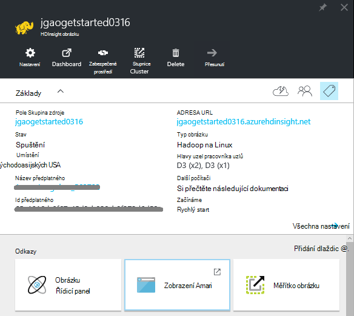
    
    - Nabídku upravit, klikněte pravým tlačítkem myši na nabídku a pak klikněte na **Přizpůsobit**.
    - **Nastavení** a **Všechna nastavení**: Zobrazí zásuvné **Nastavení** pro obrázku, který umožňuje přístup k podrobné informace o konfiguraci clusteru.
    - **Řídicí panel**, **Řídicího panelu obrázku** a **adresy URL: Toto jsou všechny možnosti přístupu k řídicím panelu clusteru, což je Ambari Web clusterů na základě Linux. - **Zabezpečené prostředí **: zobrazuje pokyny pro připojení k obrázku pomocí připojení zabezpečené prostředí (SSH).
    - **Měřítka obrázku**: umožňuje změnit počet zobrazených pracovníka uzly pro tento obrázku.
    - **Odstranit**: Odstraní clusteru.
    - **Rychlý úvod ()**: Zobrazí informace, které vám pomohou začít používat HDInsight.
    - **Uživatelé ()**: umožňuje nastavit oprávnění pro _portálu správy_ tohoto clusteru pro jiné uživatele předplatného Azure.
    
        > [AZURE.IMPORTANT] Tento _pouze_ ovlivňuje přístup a oprávnění na tomto obrázku na portálu Azure a nemá žádný vliv na kdo ho může připojit k nebo odeslat úlohy clusteru HDInsight.
    - **Značky ()**: značky můžete nastavit klíč/dvojice definovat vlastní taxonomie cloudovým službám. Může například vytvořit klíč s názvem __projektu__a potom použijete se společnou hodnotou pro všechny služby související s projektem konkrétní.
    - **Zobrazení Ambari**: odkazy na Ambari Web.
    
    > [AZURE.IMPORTANT] Správa služby poskytované HDInsight obrázku, je nutné použít Ambari Web nebo Ambari REST API. Další informace o použití Ambari najdete v článku [Správa HDInsight clusterů pomocí Ambari](hdinsight-hadoop-manage-ambari.md).

    **Použití**:
    
    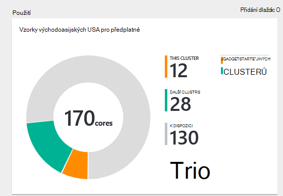
    
5. Klikněte na **Nastavení**.

    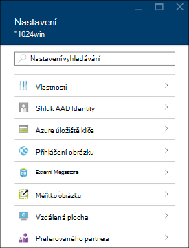

    - **Vlastnosti**: zobrazení vlastností obrázku.
    - **Identita AAD obrázku**: 
    - **Azure úložiště klíče**: Zobrazit výchozí účet úložiště a klíče. Konfigurace během procesu vytváření clusteru je účtu úložiště.
    - **Přihlášení clusteru**: Změna clusteru HTTP uživatelské jméno a heslo.
    - **Externí Metastores**: zobrazení metastores podregistru a Oozie. Metastores je možné konfigurovat pouze během procesu vytváření clusteru.
    - **Měřítka obrázku**: tlačítka Zvětšit písmo a zmenšit počet uzlech kolegy.
    - **Vzdálená plocha**: povolení a zakázání přístupu ke vzdálené ploše (RDP) a konfigurace RDP uživatelské jméno.  Uživatelské jméno RDP musí být liší od HTTP uživatelské jméno.
    - **Preferovaného partnera**:
    
    > [AZURE.NOTE] Toto je obecný seznam dostupných nastavení; Ne všechny bude k dispozici pro všechny typy obrázku.

6. Klikněte na **Vlastnosti**:

    Seznamy vlastností následující:
    
    - **Název hostitele**: název obrázku.
    - **Adresa URL obrázku**.
    - **Stav**: zahrnout přerušena potvrdili, ClusterStorageProvisioned, AzureVMConfiguration, HDInsightConfiguration, provozní, systém, chyba, odstraňovat, odstranili, Timedout DeleteQueued, DeleteTimedout, DeleteError, PatchQueued, CertRolloverQueued, ResizeQueued, ClusterCustomization
    - **Oblast**: Azure umístění. Seznam podporovaných Azure umístění najdete v článku **oblast** rozevíracího seznamu na [ceny HDInsight](https://azure.microsoft.com/pricing/details/hdinsight/).
    - **Data vytvoří**.
    - **Operační systém**: buď **Windows** nebo **Linux**.
    - **Typ**: Hadoop, HBase, bouře, podnítit. 
    - **Verze**. Podívejte se na [HDInsight verze](hdinsight-component-versioning.md)
    - **Předplatné**: Název předplatného.
    - **ID předplatného**.
    - **Primární datový zdroj**. Úložiště objektů Blob Azure účet použít jako výchozí systém souborů Hadoop.
    - **Pracovní uzly ceny osy**.
    - **Hlavy uzel ceny osy**.

##Odstranění clusterů

Odstranění clusteru neodstraní výchozí úložiště účet nebo všechny účty propojené úložiště. Obrázku můžete vytvořte znovu pomocí stejné účty úložiště a stejné metastores.

1. Přihlaste se k [portálu][azure-portal].
2. Klikněte na **Procházet vše** v nabídce nalevo, klikněte na **HDInsight clusterů**, klikněte na název svého obrázku.
3. Horní v nabídce klikněte na **Odstranit** a pak postupujte podle pokynů.

Další informace najdete v článku [Pozastavit/vypnout clusterů](#pauseshut-down-clusters).

##Měřítko clusterů
Funkci změny velikosti obrázku umožňuje změnit počet zobrazených pracovníka uzly použít clusteru, na kterém běží v Azure HDInsight aniž by bylo nutné znovu vytvořit clusteru.

>[AZURE.NOTE] Pouze clusterů s HDInsight verze 3.1.3 nebo vyšší nejsou podporovány. Pokud si nejste jisti verze svůj cluster, můžete zkontrolovat, že na stránce Vlastnosti.  Zobrazit [seznam a zobrazit clusterů](#list-and-show-clusters).

Vliv změny počtu uzlů dat pro každý typ obrázku nepodporuje HDInsight:

- Hadoop

    Bezproblémová zvětšením počtu uzlů pracovníka Hadoop clusteru, na kterém běží bez vlivu na všechny úlohy čeká na vyřízení ani pracovního. Nové úlohy můžete odeslat taky v průběhu operace. K chybám v operaci měřítka řádně fungují tak, aby clusteru ještě zbývá vždy nefunkční.

    Při změně clusteru Hadoop měřítka omezením počtu uzlů dat, některé z těchto služeb v clusteru restartovat. To způsobí, že všechny spuštěné až úlohy selhání po dokončení operace změny měřítka. Po dokončení operace můžete, ale opětovné odeslání úlohy.

- HBase

    Bezproblémová můžete přidat nebo odebrat uzly HBase clusteru je spuštěná. Místní servery jsou automaticky rovnoměrně objevit během pár minut dokončení operaci změny měřítka. Místní servery však můžete taky ručně zůstatek protokolování do headnode obrázku a spuštěním následujících příkazů z okna příkazového řádku:

        >pushd %HBASE_HOME%\bin
        >hbase shell
        >balancer

    Další informace o použití HBase prostředí najdete v článku]
- Bouře

    Bezproblémová můžete přidat nebo odebrat datových uzlů bouře clusteru je spuštěná. Ale po úspěšném dokončení změny velikosti operace, budete muset vyrovnání topologii.

    Nové posouzení lze provést dvěma způsoby:

    * Web bouře uživatelského rozhraní
    * Nástroj rozhraní příkazového řádku (rozhraní příkazového řádku)

    Získáte [Apache bouře si přečtěte následující dokumentaci](http://storm.apache.org/documentation/Understanding-the-parallelism-of-a-Storm-topology.html) pro další podrobnosti.

    Uživatelské rozhraní webu bouře neexistuje clusteru HDInsight:

    

    Tady je příklad použití příkazu rozhraní příkazového řádku pro vyrovnání topologii bouře:

        ## Reconfigure the topology "mytopology" to use 5 worker processes,
        ## the spout "blue-spout" to use 3 executors, and
        ## the bolt "yellow-bolt" to use 10 executors

        $ storm rebalance mytopology -n 5 -e blue-spout=3 -e yellow-bolt=10

**Chcete-li změnit velikost clusterů**

1. Přihlaste se k [portálu][azure-portal].
2. Klikněte na **Procházet vše** v nabídce nalevo, klikněte na **HDInsight clusterů**, klikněte na název svého obrázku.
3. Horní v nabídce klikněte na **Nastavení** a klikněte na **Měřítko obrázku**.
4. Zadejte **číslo pracovníka uzlů**. Omezení počtu clusteru liší Azure předplatná. Můžete kontaktovat podporu fakturace zvýšení limitu.  Informace o nákladech budou obsahovat provedené změny provedené počtu uzlů.

    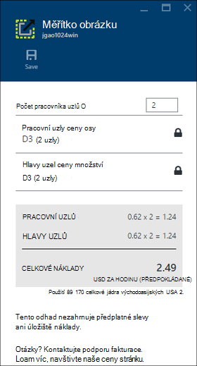

##Pozastavit/vypnout clusterů

Většina Hadoop úloh je, že dávka úloh, které jsou pouze spustili občas. U většiny Hadoop clusterů jsou velké období doba, po kterou clusteru není použitý pro zpracování. S HDInsight data uložena v úložišti Azure, takže bezpečně odstraněním clusteru nepoužívá v.
Můžete taky účtovány HDInsight clusteru, i když není použití. Protože poplatky za clusteru se opakovaně pokoušeli více než poplatky za úložiště, má smysl economic odstranit clusterů, pokud nejsou ve použití.

Program procesu několika způsoby:

- Uživatel Azure Data Factory. Na vyžádání a vlastním definovaný HDInsight propojené služby naleznete v tématu [Propojené služby Azure HDInsight](../data-factory/data-factory-compute-linked-services.md) a [transformace a analyzovat pomocí Azure Data Factory](../data-factory/data-factory-data-transformation-activities.md) .
- Použití Azure Powershellu.  V tématu [daty zpoždění letů analyzovat](hdinsight-analyze-flight-delay-data.md).
- Použití Azure rozhraní příkazového řádku. V tématu [Správa HDInsight clusterů pomocí rozhraní příkazového řádku Azure](hdinsight-administer-use-command-line.md).
- Použití HDInsight .NET SDK. V tématu [odeslání Hadoop úlohy](hdinsight-submit-hadoop-jobs-programmatically.md).

Ceny informace najdete v tématu [ceny HDInsight](https://azure.microsoft.com/pricing/details/hdinsight/). Z portálu odstranit clusteru, přejděte na téma [Odstranění clusterů](#delete-clusters)

##Změna uživatelského jména obrázku

HDInsight cluster může mít dva uživatelské účty. Uživatelský účet HDInsight clusteru je vytvořen během s vytvářením. Můžete taky vytvořit uživatelský účet RDP pro přístup k obrázku prostřednictvím RDP. V tématu [Povolení Vzdálená plocha](#connect-to-hdinsight-clusters-by-using-rdp).

**Chcete-li změnit HDInsight clusteru uživatelské jméno a heslo**

1. Přihlaste se k [portálu][azure-portal].
2. Klikněte na **Procházet vše** v nabídce nalevo, klikněte na **HDInsight clusterů**, klikněte na název svého obrázku.
3. Horní v nabídce klikněte na **Nastavení** a klikněte na položku **Přihlášení obrázku**.
4. Pokud **přihlášení clusteru** je povolená, musíte klikněte na **Zakázat**a klikněte na **Povolit** před změnou uživatelského jména a hesla.
4. Změna **Obrázku přihlašovací jméno** a **Heslo pro přihlášení obrázku**a klikněte na tlačítko **Uložit**.

    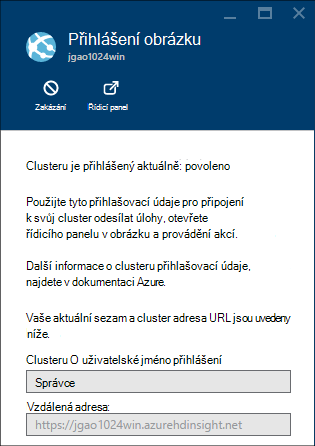

##Udělit nebo odvolat přístup

HDInsight clusterů mít takto webové služby protokolu HTTP (všechny tyto služby mít RESTful koncové body):

- ROZHRANÍ ODBC
- JDBC
- Ambari
- Oozie
- Templeton

Ve výchozím nastavení jsou tyto služby poskytuje přístup. Je můžete odvolat/udělit přístup z portálu Microsoft Azure.

>[AZURE.NOTE] Zrušením udělení/přístup, můžete obnovit clusteru uživatelské jméno a heslo.

**Chcete udělit nebo odvolat přístup webové služby protokolu HTTP**

1. Přihlaste se k [portálu][azure-portal].
2. Klikněte na **Procházet vše** v nabídce nalevo, klikněte na **HDInsight clusterů**, klikněte na název svého obrázku.
3. Horní v nabídce klikněte na **Nastavení** a klikněte na položku **Přihlášení obrázku**.
4. Pokud **přihlášení clusteru** je povolená, musíte klikněte na **Zakázat**a klikněte na **Povolit** před změnou uživatelského jména a hesla.
6. **Přihlášení clusteru uživatelské jméno** a **Clusteru přihlašovacího hesla**zadejte nové uživatelské jméno a heslo (v tomto pořadí) clusteru.
7. Klikněte na **Uložit**.

    

##Vyhledání výchozí účet úložiště

Každý cluster HDInsight má výchozí účet úložiště. Výchozí úložiště účet a jeho klávesové zkratky pro clusteru se zobrazí v části **Nastavení**/**Vlastnosti**/**Azure úložiště klíče**. Zobrazit [seznam a zobrazit clusterů](#list-and-show-clusters).

    
##Vyhledání skupiny zdrojů 

V režimu správce prostředků Azure každý HDInsight cluster vytvořená pomocí skupina Azure zdroje. V okně zobrazí skupiny Azure zdroje, které clusteru patří:

- Shluk seznam obsahuje sloupec **Pole Skupina zdroje** .
- **Základní** dlaždice obrázku.  

Zobrazit [seznam a zobrazit clusterů](#list-and-show-clusters).
   
##Otevřené konzoly HDInsight dotazu

Konzole HDInsight dotaz obsahuje následující funkce:

- **Začínáme Galerie**: použití Galerie, najdete v článku [Další Hadoop pomocí Galerie Azure HDInsight Začínáme Začínáme](hdinsight-learn-hadoop-use-sample-gallery.md).
- **Editor podregistru**: grafického uživatelského rozhraní A webového rozhraní pro odeslání podregistru úlohy.  V tématu [spuštění podregistru dotazů pomocí konzole dotazu](hdinsight-hadoop-use-hive-query-console.md).

    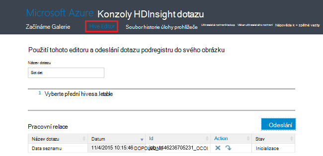

- **Historie úlohy**: sledování Hadoop úlohy.  

    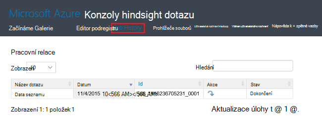

    Klikněte na **Název dotazu** a zobrazí se podrobnosti včetně úlohy vlastnosti **Dotazu úlohy**a ** výstup projektu. Můžete taky stáhnete dotaz a výstup k počítači.

- **Soubor prohlížeče**: Procházet výchozí účet úložiště a účet propojené úložiště.

    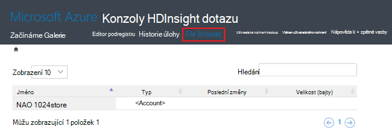

    Na snímek **<Account>** typ označuje položku účet Azure úložiště.  Klikněte na název účtu, který Procházet soubory.
    
- **Uživatelské rozhraní Hadoop**.

    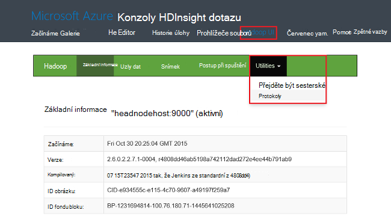
    
    Z **Hadoop uživatelského rozhraní*, můžete procházet soubory a protokolech. 

- **Vláken uživatelského rozhraní**.

    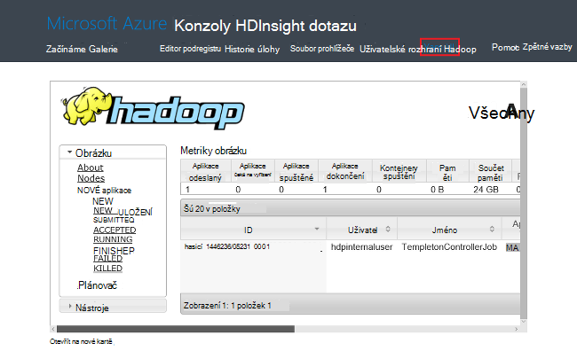

##Spouštění dotazů podregistru

Spuštění úlohy podregistru z portálu Microsoft, klikněte na **Podregistru Editor** v konzole HDInsight dotazu. V tématu [otevření dotazu HDInsight konzoly](#open-hdinsight-query-console).

##Sledování úloh

Sledování práce na portálu, klikněte na **Historie úlohy** v konzole HDInsight dotazu. V tématu [otevření dotazu HDInsight konzoly](#open-hdinsight-query-console).

##Prohlížení souborů

Procházet soubory uložené ve výchozí účet úložiště a propojené úložiště účtů, klikněte na **Soubor prohlížeče** v konzole HDInsight dotazu. V tématu [otevření dotazu HDInsight konzoly](#open-hdinsight-query-console).

Můžete taky pomocí nástroje **Procházet systém souborů** z **Uživatelského rozhraní Hadoop** v konzole HDInsight.  V tématu [otevření dotazu HDInsight konzoly](#open-hdinsight-query-console).

##Použití obrázku monitoru

V části __použití__ zásuvné clusteru HDInsight zobrazuje informace o počet jádra k dispozici ke svému předplatnému pro použití s HDInsight, jakož i počet jádra přidělit na tomto obrázku a jak se přidělený uzlů v tomto obrázku. Zobrazit [seznam a zobrazit clusterů](#list-and-show-clusters).

> [AZURE.IMPORTANT] Sledování služby poskytované HDInsight clusteru, je nutné použít Ambari webu nebo rozhraní REST API Ambari. Další informace o použití Ambari najdete v článku [Správa HDInsight clusterů pomocí Ambari](hdinsight-hadoop-manage-ambari.md)

##Otevřete Hadoop uživatelského rozhraní

Sledování clusteru, přejděte v systému souborů a v protokolech, klikněte na **Uživatelské rozhraní Hadoop** v konzole HDInsight dotazu. V tématu [otevření dotazu HDInsight konzoly](#open-hdinsight-query-console).

##Otevřete vláken uživatelského rozhraní

Použít vláken uživatelského rozhraní, klikněte na **Uživatelské rozhraní vláken** v konzole HDInsight dotazu. V tématu [otevření dotazu HDInsight konzoly](#open-hdinsight-query-console).

##Připojení k clusterů pomocí RDP

Přihlašovací údaje pro obrázku, kterou jste použili při jeho vytvoření poskytnout přístup ke službám na clusteru, ale ne na samotný cluster prostřednictvím vzdálené plochy. Přístup ke vzdálené ploše můžete zapnout, když zřizujete clusteru nebo po zřízení clusteru. Pokyny o povolení vzdálené plochy při vytvoření najdete v tématu [Vytvoření HDInsight obrázku](hdinsight-provision-clusters.md).

**Chcete-li povolit vzdálená plocha**

1. Přihlaste se k [portálu][azure-portal].
2. Klikněte na **Procházet vše** v nabídce nalevo, klikněte na **HDInsight clusterů**, klikněte na název svého obrázku.
3. Horní v nabídce klikněte na **Nastavení** a klikněte na **Vzdálená plocha**.
4. Zadejte **Vypršení platnosti**, **Vzdálené plochy uživatelské jméno** a **Heslo vzdálené plochy**a potom klikněte na **Povolit**.

    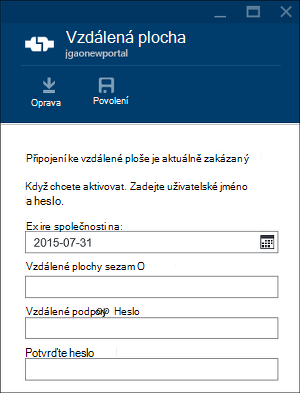

    Výchozí hodnoty pro vyprší jejich platnost na je týden.
> [AZURE.NOTE] Můžete taky HDInsight .NET SDK povolit vzdálená plocha clusteru. Použijte metodu **EnableRdp** objektu klienta HDInsight následujícím způsobem: **klienta. EnableRdp (název_clusteru, umístění, "rdpuser", "rdppassword", DateTime.Now.AddDays(6))**. Podobně zakázání Vzdálená plocha na clusteru, můžete **klienta. DisableRdp (název_clusteru, umístění)**. Další informace o těchto metodách najdete v článku Principy [HDInsight .NET SDK](http://go.microsoft.com/fwlink/?LinkId=529017). To platí jenom pro HDInsight clusterů se systémem Windows.

**Připojení k clusteru pomocí RDP**

1. Přihlaste se k [portálu][azure-portal].
2. Klikněte na **Procházet vše** v nabídce nalevo, klikněte na **HDInsight clusterů**, klikněte na název svého obrázku.
3. Horní v nabídce klikněte na **Nastavení** a klikněte na **Vzdálená plocha**.
4. Klikněte na **Připojit** a postupujte podle pokynů. -Li připojit zakázat, musíte ji nejprve povolit. Ujistěte se Vzdálená plocha uživatelského jména a hesla.  Nelze použít přihlašovací údaje uživatele pro obrázku.

##Otevřete Hadoop příkazového řádku

A připojte se k němu pomocí vzdálené plochy příkazového řádku Hadoop, musíte nejprve povolili jste Vzdálená plocha přístup ke clusteru podle popisu v předchozí části.

**Chcete-li otevřít Hadoop příkazového řádku**

1. Připojte se k němu pomocí vzdálené plochy.
8. Z plochy poklikejte na **Hadoop příkazového řádku**.

    ![HDI. HadoopCommandLine][image-hadoopcommandline]

    Další informace o příkazech Hadoop najdete v článku Principy [Hadoop příkazy](http://hadoop.apache.org/docs/current/hadoop-project-dist/hadoop-common/CommandsManual.html).

V předchozí snímek název složky obsahuje číslo verze Hadoop vložené. Číslo verze lze změnit založené na verzi systému Hadoop součásti nainstalovaným clusteru. Můžete odkázat na těchto složek Hadoop proměnné. Příklad:

    cd %hadoop_home%
    cd %hive_home%
    cd %hbase_home%
    cd %pig_home%
    cd %sqoop_home%
    cd %hcatalog_home%
    
##Další kroky
V tomto článku jste se naučili postup vytvoření obrázku HDInsight pomocí portálu a jak můžete otevřít nástroj Hadoop příkazového řádku. Další informace naleznete v následujících článcích:

* [Spravovat pomocí prostředí PowerShell Azure HDInsight](hdinsight-administer-use-powershell.md)
* [Spravovat pomocí rozhraní příkazového řádku Azure HDInsight](hdinsight-administer-use-command-line.md)
* [Vytvoření HDInsight clusterů](hdinsight-provision-clusters.md)
* [Odeslat Hadoop úlohy programově](hdinsight-submit-hadoop-jobs-programmatically.md)
* [Začínáme s Azure HDInsight](hdinsight-hadoop-linux-tutorial-get-started.md)
* [Jakou verzi systému Hadoop je Azure HDInsight?](hdinsight-component-versioning.md)

[azure-portal]: https://portal.azure.com
[image-hadoopcommandline]: ./media/hdinsight-administer-use-management-portal/hdinsight-hadoop-command-line.png "Přepínač příkazového řádku Hadoop"
