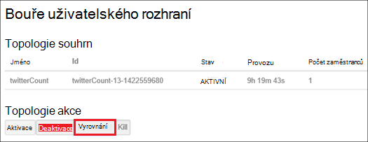

<properties
    pageTitle="Správa na základě Linux Hadoop clusterů v portálu Azure HDInsight | Microsoft Azure"
    description="Naučte se vytvářet a spravovat pomocí portálu Azure HDInsight na základě Linux clusterů."
    services="hdinsight"
    documentationCenter=""
    authors="mumian"
    manager="jhubbard"
    editor="cgronlun"
    tags="azure-portal"/>

<tags
    ms.service="hdinsight"
    ms.workload="big-data"
    ms.tgt_pltfrm="na"
    ms.devlang="na"
    ms.topic="article"
    ms.date="08/10/2016"
    ms.author="jgao"/>

#Správa Hadoop clusterů HDInsight pomocí portálu Azure

[AZURE.INCLUDE [selector](../../includes/hdinsight-portal-management-selector.md)]

Pomocí [Azure portál][azure-portal], můžete spravovat na základě Linux clusterů Azure HDInsight. Pomocí voliče kartu informace týkající se vytváření Hadoop clusterů v HDInsight pomocí dalších nástrojů. 

**Zjistit předpoklady pro**

Než začnete v tomto článku, musíte mít takto:

- **Azure předplatného**. Viz [získání Azure bezplatnou zkušební verzi](https://azure.microsoft.com/documentation/videos/get-azure-free-trial-for-testing-hadoop-in-hdinsight/).

##Otevřete portál

1. Přihlaste se k [https://portal.azure.com](https://portal.azure.com).
2. Po otevření portálu máte tyto možnosti:

    - Klikněte na tlačítko **Nový** v levé nabídce k vytvoření nového obrázku:
    
        
    - Klikněte na **HDInsight clusterů** v levé nabídce seznam existující clusterů
    
        

        Pokud **HDInsight** v levé nabídce nezobrazí, klikněte na tlačítko **Procházet**a klikněte na **HDInsight clusterů**.

        

##Vytvoření clusterů

[AZURE.INCLUDE [delete-cluster-warning](../../includes/hdinsight-delete-cluster-warning.md)]

HDInsight funguje s celou oblast Hadoop součásti. Seznam složek, které ověření a podporované najdete v tématu [jakou verzi systému Hadoop je v Azure HDInsight](hdinsight-component-versioning.md). Informace o vytvoření obecné obrázku najdete v článku [Vytvoření Hadoop clusterů HDInsight](hdinsight-hadoop-provision-linux-clusters.md). 

##Seznam a zobrazit clusterů

1. Přihlaste se k [https://portal.azure.com](https://portal.azure.com).
2. **HDInsight clusterů** v nabídce klikněte na levém seznamu existující clusterů.
3. Klikněte na název obrázku. Pokud je seznam clusteru dlouhý, můžete použít filtr v horní části stránky.
4. Poklikejte na obrázku ze seznamu a zobrazit podrobnosti.

    **Nabídka a essentials**:

    
    
    - **Nastavení** a **Všechna nastavení**: Zobrazí zásuvné **Nastavení** pro obrázku, který umožňuje přístup k podrobné informace o konfiguraci clusteru.
    - **Řídicí panel**, **Řídicího panelu obrázku** a ** adresy URL: Toto jsou všechny možnosti přístupu k řídicím panelu clusteru, což je Ambari Web clusterů na základě Linux.
    - **Zabezpečené prostředí**: zobrazuje pokyny pro připojení k obrázku pomocí připojení zabezpečené prostředí (SSH).
    - **Měřítka obrázku**: umožňuje změnit počet zobrazených pracovníka uzly pro tento obrázku.
    - **Odstranit**: Odstraní clusteru.
    - **Rychlý úvod ()**: Zobrazí informace, které vám pomohou začít používat HDInsight.
    - **Uživatelé ()**: umožňuje nastavit oprávnění pro _portálu správy_ tohoto clusteru pro jiné uživatele předplatného Azure.
    
        > [AZURE.IMPORTANT] Tento _pouze_ ovlivňuje přístup a oprávnění na tomto obrázku na portálu Azure a nemá žádný vliv na kdo ho může připojit k nebo odeslat úlohy clusteru HDInsight.
    - **Značky ()**: značky můžete nastavit klíč/dvojice definovat vlastní taxonomie cloudovým službám. Může například vytvořit klíč s názvem __projektu__a potom použijete se společnou hodnotou pro všechny služby související s projektem konkrétní.
    - **Zobrazení Ambari**: odkazy na Ambari Web.
    
    > [AZURE.IMPORTANT] Správa služby poskytované HDInsight obrázku, je nutné použít Ambari Web nebo Ambari REST API. Další informace o použití Ambari najdete v článku [Správa HDInsight clusterů pomocí Ambari](hdinsight-hadoop-manage-ambari.md).

    **Použití**:
    
    
    
5. Klikněte na **Nastavení**.

    

    - **Protokolů auditování**:
    - **Rychlý Start**: Zobrazí informace, které vám pomohou začít používat HDInsight.
    - **Měřítka obrázku**: tlačítka Zvětšit písmo a zmenšit počet uzlech kolegy.
    - **Zabezpečené prostředí**: zobrazuje pokyny pro připojení k obrázku pomocí připojení zabezpečené prostředí (SSH).
    - **HDInsight partnera**: Přidat nebo odebrat aktuální partnera HDInsight.
    - **Externí Metastores**: zobrazení metastores podregistru a Oozie. Metastores je možné konfigurovat pouze během procesu vytváření clusteru.
    - **Akce skriptu**: spuštění flám skriptů clusteru.
    - **Vlastnosti**: zobrazení vlastností obrázku.
    - **Azure úložiště klíče**: Zobrazit výchozí účet úložiště a klíče. Konfigurace během procesu vytváření clusteru je účtu úložiště.
    - **Identita AAD obrázku**: 
    - **Uživatelé**: umožňuje nastavit oprávnění pro _portálu správy_ tohoto clusteru pro jiné uživatele předplatného Azure.
    - **Značky**: značky můžete nastavit klíč/dvojice definovat vlastní taxonomie cloudovým službám. Může například vytvořit klíč s názvem __projektu__a potom použijete se společnou hodnotou pro všechny služby související s projektem konkrétní.
    
    > [AZURE.NOTE] Toto je obecný seznam dostupných nastavení; Ne všechny bude k dispozici pro všechny typy obrázku.

6. Klikněte na **Vlastnosti**:

    Vlastnosti jsou:
    
    - **Název hostitele**: název obrázku.
    - **Adresa URL obrázku**.
    - **Stav**: zahrnout přerušena potvrdili, ClusterStorageProvisioned, AzureVMConfiguration, HDInsightConfiguration, provozní, systém, chyba, odstraňovat, odstranili, Timedout DeleteQueued, DeleteTimedout, DeleteError, PatchQueued, CertRolloverQueued, ResizeQueued, ClusterCustomization
    - **Oblast**: Azure umístění. Seznam podporovaných Azure umístění najdete v článku **oblast** rozevíracího seznamu na [ceny HDInsight](https://azure.microsoft.com/pricing/details/hdinsight/).
    - **Data vytvoří**.
    - **Operační systém**: buď **Windows** nebo **Linux**.
    - **Typ**: Hadoop, HBase, bouře, podnítit. 
    - **Verze**. Podívejte se na [HDInsight verze](hdinsight-component-versioning.md)
    - **Předplatné**: Název předplatného.
    - **ID předplatného**.
    - **Zdroj dat výchozí**: výchozí systém souborů obrázku.
    - **Pracovní uzly ceny osy**.
    - **Hlavy uzel ceny osy**.

##Odstranění clusterů

Odstranění clusteru neodstraní výchozí úložiště účet nebo všechny účty propojené úložiště. Obrázku můžete vytvořte znovu pomocí stejné účty úložiště a stejné metastores. Doporučujeme použít nové výchozí objektů Blob kontejner po opětovné vytvoření clusteru.

1. Přihlaste se k [portálu][azure-portal].
2. Klikněte na **Procházet vše** v nabídce nalevo, klikněte na **HDInsight clusterů**, klikněte na název svého obrázku.
3. Horní v nabídce klikněte na **Odstranit** a pak postupujte podle pokynů.

Další informace najdete v článku [Pozastavit/vypnout clusterů](#pauseshut-down-clusters).

##Měřítko clusterů
Funkci změny velikosti obrázku umožňuje změnit počet zobrazených pracovníka uzly použít clusteru, na kterém běží v Azure HDInsight aniž by bylo nutné znovu vytvořit clusteru.

>[AZURE.NOTE] Pouze clusterů s HDInsight verze 3.1.3 nebo vyšší nejsou podporovány. Pokud si nejste jisti verze svůj cluster, můžete zkontrolovat, že na stránce Vlastnosti.  Zobrazit [seznam a zobrazit clusterů](#list-and-show-clusters).

Vliv změny počtu uzlů dat pro každý typ obrázku nepodporuje HDInsight:

- Hadoop

    Bezproblémová zvětšením počtu uzlů pracovníka Hadoop clusteru, na kterém běží bez vlivu na všechny úlohy čeká na vyřízení ani pracovního. Nové úlohy můžete odeslat taky v průběhu operace. K chybám v operaci měřítka řádně fungují tak, aby clusteru ještě zbývá vždy nefunkční.

    Při změně clusteru Hadoop měřítka omezením počtu uzlů dat, některé z těchto služeb v clusteru restartovat. To způsobí, že všechny spuštěné až úlohy selhání po dokončení operace změny měřítka. Po dokončení operace můžete, ale opětovné odeslání úlohy.

- HBase

    Bezproblémová můžete přidat nebo odebrat uzly HBase clusteru je spuštěná. Místní servery jsou automaticky rovnoměrně objevit během pár minut dokončení operaci změny měřítka. Místní servery však můžete taky ručně zůstatek protokolování do headnode obrázku a spuštěním následujících příkazů z okna příkazového řádku:

        >pushd %HBASE_HOME%\bin
        >hbase shell
        >balancer

    Další informace o použití HBase prostředí najdete v článku]
- Bouře

    Bezproblémová můžete přidat nebo odebrat datových uzlů bouře clusteru je spuštěná. Ale po úspěšném dokončení změny velikosti operace, budete muset vyrovnání topologii.

    Nové posouzení lze provést dvěma způsoby:

    * Web bouře uživatelského rozhraní
    * Nástroj rozhraní příkazového řádku (rozhraní příkazového řádku)

    Získáte [Apache bouře si přečtěte následující dokumentaci](http://storm.apache.org/documentation/Understanding-the-parallelism-of-a-Storm-topology.html) pro další podrobnosti.

    Uživatelské rozhraní webu bouře neexistuje clusteru HDInsight:

    

    Tady je příklad použití příkazu rozhraní příkazového řádku pro vyrovnání topologii bouře:

        ## Reconfigure the topology "mytopology" to use 5 worker processes,
        ## the spout "blue-spout" to use 3 executors, and
        ## the bolt "yellow-bolt" to use 10 executors

        $ storm rebalance mytopology -n 5 -e blue-spout=3 -e yellow-bolt=10

**Chcete-li změnit velikost clusterů**

1. Přihlaste se k [portálu][azure-portal].
2. Klikněte na **Procházet vše** v nabídce nalevo, klikněte na **HDInsight clusterů**, klikněte na název svého obrázku.
3. Horní v nabídce klikněte na **Nastavení** a klikněte na **Měřítko obrázku**.
4. Zadejte **číslo pracovníka uzlů**. Omezení počtu clusteru liší Azure předplatná. Můžete kontaktovat podporu fakturace zvýšení limitu.  Informace o nákladech budou obsahovat provedené změny provedené počtu uzlů.

    

##Pozastavit/vypnout clusterů

Většina Hadoop úloh je, že dávka úloh, které jsou pouze spustili občas. U většiny Hadoop clusterů jsou velké období doba, po kterou clusteru není použitý pro zpracování. S HDInsight data uložena v úložišti Azure, takže bezpečně odstraněním clusteru nepoužívá v.
Můžete taky účtovány HDInsight clusteru, i když není použití. Protože poplatky za clusteru se opakovaně pokoušeli více než poplatky za úložiště, má smysl economic odstranit clusterů, pokud nejsou ve použití.

Program procesu několika způsoby:

- Uživatel Azure Data Factory. Naleznete v tématu [Vytvoření na vyžádání na základě Linux Hadoop clusterů v pomocí Factory dat Azure HDInsight](hdinsight-hadoop-create-linux-clusters-adf.md) vytváření na vyžádání HDInsight propojené služeb.
- Použití Azure Powershellu.  V tématu [daty zpoždění letů analyzovat](hdinsight-analyze-flight-delay-data.md).
- Použití Azure rozhraní příkazového řádku. V tématu [Správa HDInsight clusterů pomocí rozhraní příkazového řádku Azure](hdinsight-administer-use-command-line.md).
- Použití HDInsight .NET SDK. V tématu [odeslání Hadoop úlohy](hdinsight-submit-hadoop-jobs-programmatically.md).

Ceny informace najdete v tématu [ceny HDInsight](https://azure.microsoft.com/pricing/details/hdinsight/). Z portálu odstranit clusteru, přejděte na téma [Odstranění clusterů](#delete-clusters)

##Změna hesla

HDInsight cluster může mít dva uživatelské účty. HDInsight (také clusteru uživatelského účtu Nastavit informace HTTP uživatelský účet) a SSH uživatelský účet je vytvořen během s vytvářením. Můžete provést tyto akce webu Ambari uživatelského rozhraní pro změnit clusteru uživatelského účtu uživatelské jméno a heslo a skript akce, které chcete změnit SSH uživatelského účtu

###Změna hesla uživatelského obrázku

Uživatelské rozhraní webu Ambari umožňuje změnit heslo uživatele obrázku. Pokud chcete se přihlásit k Ambari, je nutné použít existující clusteru uživatelské jméno a heslo.

> [AZURE.NOTE] Pokud změníte heslo uživatele (Správci) clusteru, může dojít skript, který spustil akce týkající se tohoto clusteru selhání. Pokud máte akcích trvalých skript této cílových pracovníka uzlů, tyto nemusí podařit, když přidáte uzly clusteru prostřednictvím změnit velikost operace. Další informace o skript akce najdete v článku [přizpůsobení HDInsight clusterů pomocí skriptu akce](hdinsight-hadoop-customize-cluster-linux.md).

1. Přihlaste se k uživatelské rozhraní webu Ambari pomocí přihlašovací údaje uživatele pro clusteru HDInsight. Výchozí uživatelské jméno je **Správce**. Adresa URL je **https://&lt;název clusteru HDInsight > azurehdinsight.net**.
2. Horní v nabídce klikněte na **Správce** a klikněte na "Správa Ambari". 
3. V nabídce nalevo klikněte na **uživatele**.
4. Klikněte na **Správce**.
5. Klikněte na **změnit heslo**.

Ambari změní heslo ve všech uzlech clusteru.

###Změna hesla uživatelského SSH

1. V textovém editoru, uložte si následující jako do souboru nazvaného __changepassword.sh__.

    > [AZURE.IMPORTANT] Je nutné použít editor, který používá LF jako pole Konec řádku. Pokud editor používá Line FEED, nebudou fungovat skript.
    
        #! /bin/bash
        USER=$1
        PASS=$2

        usermod --password $(echo $PASS | openssl passwd -1 -stdin) $USER

2. Nahrajte soubor do úložiště, které jsou přístupné z Hdinsightu pomocí adresu HTTP nebo HTTPS. Například veřejné soubor uložit jako je třeba OneDrive nebo objektů Blob Azure úložiště. Ukládat identifikátor URI (HTTP nebo HTTPS adresa) do souboru, jak to je potřeba v dalším kroku.

3. Z portálu Microsoft Azure vyberte svůj cluster HDInsight a potom vyberte __všechna nastavení__. V __Nastavení__ zásuvné vyberte __Akce skriptu__.

4. Z zásuvné __Skript akce__ vyberte __Odeslat nový__. Jakmile se objeví zásuvné __akci skriptu odeslat__ , zadejte následující informace.

  	| Pole | Hodnota |
  	| ----- | ----- |
  	| Jméno | Změna ssh hesla |
  	| Flám skript URI | Identifikátor URI changepassword.sh souboru |
  	| Uzly (vedoucí pracovník, Nimbus, správce, Zookeeper, atd.) | ✓ pro všechny typy uzlu uvedené |
  	| Parametry | Zadejte uživatelské jméno SSH a potom nové heslo. Musí existovat jedna mezera mezi uživatelské jméno a heslo.
  	| Zachování tuto akci skript... | Nechte toto pole zrušené zaškrtnutí políčka.

5. Výběrem možnosti __vytvořit__ použít skript. Po dokončení skript, budete moct připojit k obrázku SSH pomocí nového hesla.

##Udělit nebo odvolat přístup

HDInsight clusterů mít takto webové služby protokolu HTTP (všechny tyto služby mít RESTful koncové body):

- ROZHRANÍ ODBC
- JDBC
- Ambari
- Oozie
- Templeton

Ve výchozím nastavení jsou tyto služby poskytuje přístup. Můžete můžete odvolat/udělit přístup pomocí [Rozhraní příkazového řádku Azure](hdinsight-administer-use-command-line.md#enabledisable-http-access-for-a-cluster) a [Azure Powershellu](hdinsight-administer-use-powershell.md#grantrevoke-access).

##Vyhledání ID předplatného

**K vyhledání předplatného Azure ID**

1. Přihlaste se k [portálu][azure-portal].
2. Klikněte na **Procházet vše** v nabídce nalevo a potom klikněte na **předplatná**. Každého předplatného obsahuje název a ID.

Každý clusteru je svázané se předplatné Azure. ID předplatného se zobrazuje na obrázku **důležité** dlaždice. Zobrazit [seznam a zobrazit clusterů](#list-and-show-clusters).

##Vyhledání skupiny zdrojů 

V režimu ARM každý HDInsight cluster vytvořená pomocí skupina Azure zdroje. V okně zobrazí skupiny Azure zdroje, které clusteru patří:

- Shluk seznam obsahuje sloupec **Pole Skupina zdroje** .
- **Základní** dlaždice obrázku.  

Zobrazit [seznam a zobrazit clusterů](#list-and-show-clusters).

##Vyhledání výchozí účet úložiště

Každý cluster HDInsight má výchozí účet úložiště. Výchozí úložiště účet a jeho klávesové zkratky pro clusteru se zobrazí v části **Nastavení**/**Vlastnosti**/**Azure úložiště klíče**. Zobrazit [seznam a zobrazit clusterů](#list-and-show-clusters).

##Spouštění dotazů podregistru

Nelze spuštění úlohy podregistru přímo z portálu Microsoft Azure, ale můžete použít zobrazení podregistru na uživatelské rozhraní webu Ambari.

**Chcete-li spouštění dotazů podregistru pomocí Ambari podregistru zobrazení**

1. Přihlaste se k uživatelské rozhraní webu Ambari pomocí přihlašovací údaje uživatele pro clusteru HDInsight. Uživatelské jméno defaut je **Správce**. Adresa URL je **https://&lt;název clusteru HDInsight > azurehdinsight.net**.
2. Zobrazení podregistru jak je vidět na následující snímek obrazovky:  

    
3. Horní v nabídce klikněte na **dotaz** .
4. Zadejte podregistru dotaz v **Editoru dotazů**a potom klikněte na **Spustit**.

##Sledování úloh

V tématu [Správa HDInsight clusterů pomocí rozhraní webových Ambari](hdinsight-hadoop-manage-ambari.md#monitoring).

##Prohlížení souborů

Na portálu Azure, můžete procházet obsah výchozí kontejner.

1. Přihlaste se k [https://portal.azure.com](https://portal.azure.com).
2. **HDInsight clusterů** v nabídce klikněte na levém seznamu existující clusterů.
3. Klikněte na název obrázku. Pokud je seznam clusteru dlouhý, můžete použít filtr v horní části stránky.
4. Klikněte na **Nastavení**.
5. **Nastavení** zásuvné klikněte na **Azure úložiště klíče**.
6. Klikněte na výchozí název účtu úložiště.
7. Klikněte na dlaždici **objektů BLOB** .
8. Klikněte na jméno container výchozí.

##Použití obrázku monitoru

V části __použití__ zásuvné clusteru HDInsight zobrazuje informace o počet jádra k dispozici ke svému předplatnému pro použití s HDInsight, jakož i počet jádra přidělit na tomto obrázku a jak se přidělený uzlů v tomto obrázku. Zobrazit [seznam a zobrazit clusterů](#list-and-show-clusters).

> [AZURE.IMPORTANT] Sledování služby poskytované HDInsight clusteru, je nutné použít Ambari webu nebo rozhraní REST API Ambari. Další informace o použití Ambari najdete v článku [Správa HDInsight clusterů pomocí Ambari](hdinsight-hadoop-manage-ambari.md)

##Připojení ke clusteru

V tématu [použití podregistru s Hadoop v Hdinsightu pomocí SSH](hdinsight-hadoop-use-hive-ssh.md#ssh).
    
##Další kroky
V tomto článku jste se naučili postup vytvoření obrázku HDInsight pomocí portálu a jak můžete otevřít nástroj Hadoop příkazového řádku. Další informace naleznete v následujících článcích:

* [Spravovat pomocí prostředí PowerShell Azure HDInsight](hdinsight-administer-use-powershell.md)
* [Spravovat pomocí rozhraní příkazového řádku Azure HDInsight](hdinsight-administer-use-command-line.md)
* [Vytvoření HDInsight clusterů](hdinsight-provision-clusters.md)
* [Použití podregistru v HDInsight](hdinsight-use-hive.md)
* [Použití Prasátko v HDInsight](hdinsight-use-pig.md)
* [Použití Sqoop v HDInsight](hdinsight-use-sqoop.md)
* [Začínáme s Azure HDInsight](hdinsight-hadoop-linux-tutorial-get-started.md)
* [Jakou verzi systému Hadoop je Azure HDInsight?](hdinsight-component-versioning.md)

[azure-portal]: https://portal.azure.com
[image-hadoopcommandline]: ./media/hdinsight-administer-use-portal-linux/hdinsight-hadoop-command-line.png "Přepínač příkazového řádku Hadoop"
