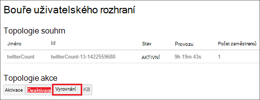

<properties
    pageTitle="Správa Hadoop clusterů Hdinsightu pomocí prostředí PowerShell | Microsoft Azure"
    description="Informace o provádění úkolů správy pro Hadoop clusterů pomocí prostředí PowerShell Azure HDInsight."
    services="hdinsight"
    editor="cgronlun"
    manager="jhubbard"
    tags="azure-portal"
    authors="mumian"
    documentationCenter=""/>

<tags
    ms.service="hdinsight"
    ms.workload="big-data"
    ms.tgt_pltfrm="na"
    ms.devlang="na"
    ms.topic="article"
    ms.date="08/10/2016"
    ms.author="jgao"/>

# Správa Hadoop clusterů HDInsight pomocí prostředí PowerShell Azure

[AZURE.INCLUDE [selector](../../includes/hdinsight-portal-management-selector.md)]

Azure Powershellu je výkonné skriptu prostředí, které můžete použít k ovládání a automatizovat nasazení a řízení úloh v Azure. V tomto článku se dozvíte, jak správy Hadoop clusterů Azure Hdinsightu pomocí místní konzoly Azure PowerShell pomocí prostředí Windows PowerShell. Seznam rutin prostředí PowerShell Hdinsightu najdete v článku Principy [HDInsight rutina][hdinsight-powershell-reference].

**Zjistit předpoklady pro**

Než začnete v tomto článku, musíte mít takto:

- **Azure předplatného**. Viz [získání Azure bezplatnou zkušební verzi](https://azure.microsoft.com/documentation/videos/get-azure-free-trial-for-testing-hadoop-in-hdinsight/).

##Instalace modulu Azure PowerShell

[AZURE.INCLUDE [upgrade-powershell](../../includes/hdinsight-use-latest-powershell.md)]

Pokud jste nainstalovali Azure PowerShell verze 0,9 x, musíte ho odinstalovat před instalací novější verzi.

Kontrola verze nainstalované Powershellu:

    Get-Module *azure*
    
Odinstalování starších verzí, spusťte programy a funkce v Ovládacích panelech. 

##Vytvoření clusterů

Zobrazit [na základě vytvořit Linux clusterů pomocí prostředí PowerShell Azure HDInsight](hdinsight-hadoop-create-linux-clusters-azure-powershell.md)

##Seznam clusterů
Pomocí následujícího příkazu zobrazíte seznam všech clusterů aktuálního předplatného:

    Get-AzureRmHDInsightCluster

##Zobrazení obrázku

Umožňuje znázornit podrobností o konkrétní obrázku do aktuálního předplatného tento příkaz:

    Get-AzureRmHDInsightCluster -ClusterName <Cluster Name>

##Odstranění clusterů

Umožňuje odstranit clusteru tento příkaz:

    Remove-AzureRmHDInsightCluster -ClusterName <Cluster Name>

Můžete taky odstranit clusteru odebráním skupina zdroje, který obsahuje clusteru. Dejte pozor, budou odstraněny všechny zdroje ve skupině včetně výchozí účet úložiště.

    Remove-AzureRmResourceGroup -Name <Resource Group Name>
            
##Měřítko clusterů
Funkci změny velikosti obrázku umožňuje změnit počet zobrazených pracovníka uzly použít clusteru, na kterém běží v Azure HDInsight aniž by bylo nutné znovu vytvořit clusteru.

>[AZURE.NOTE] Pouze clusterů s HDInsight verze 3.1.3 nebo vyšší nejsou podporovány. Pokud si nejste jisti verze svůj cluster, můžete zkontrolovat, že na stránce Vlastnosti.  Zobrazit [seznam a zobrazit clusterů](hdinsight-administer-use-portal-linux.md#list-and-show-clusters).

Vliv změny počtu uzlů dat pro každý typ obrázku nepodporuje HDInsight:

- Hadoop

    Bezproblémová zvyšují počet pracovníka uzlů v Hadoop clusteru, na kterém běží bez vlivu na všechny úlohy čeká na vyřízení ani pracovního. Nové úlohy můžete odeslat taky v průběhu operace. K chybám v operaci měřítka řádně fungují tak, aby clusteru ještě zbývá vždy nefunkční.

    Při změně clusteru Hadoop měřítka omezením počtu uzlů dat, některé z těchto služeb v clusteru restartovat. To způsobí, že všechny spuštěné až úlohy selhání po dokončení operace změny měřítka. Po dokončení operace můžete, ale opětovné odeslání úlohy.

- HBase

    Bezproblémová můžete přidat nebo odebrat uzly HBase clusteru je spuštěná. Místní servery jsou automaticky rovnoměrně objevit během pár minut dokončení operaci změny měřítka. Místní servery však můžete taky ručně zůstatek přihlášení do headnode obrázku a spuštěním následujících příkazů z okna příkazového řádku:

        >pushd %HBASE_HOME%\bin
        >hbase shell
        >balancer

- Bouře

    Bezproblémová můžete přidat nebo odebrat datových uzlů bouře clusteru je spuštěná. Ale po úspěšném dokončení změny velikosti operace, budete muset vyrovnání topologii.

    Nové posouzení lze provést dvěma způsoby:

    * Web bouře uživatelského rozhraní
    * Nástroj rozhraní příkazového řádku (rozhraní příkazového řádku)

    Získáte [Apache bouře si přečtěte následující dokumentaci](http://storm.apache.org/documentation/Understanding-the-parallelism-of-a-Storm-topology.html) pro další podrobnosti.

    Uživatelské rozhraní webu bouře neexistuje clusteru HDInsight:

    

    Tady je příklad použití příkazu rozhraní příkazového řádku pro vyrovnání topologii bouře:

        ## Reconfigure the topology "mytopology" to use 5 worker processes,
        ## the spout "blue-spout" to use 3 executors, and
        ## the bolt "yellow-bolt" to use 10 executors

        $ storm rebalance mytopology -n 5 -e blue-spout=3 -e yellow-bolt=10

Pokud chcete změnit velikost obrázku Hadoop pomocí prostředí PowerShell Azure, spusťte tento příkaz z klientského počítače:

    Set-AzureRmHDInsightClusterSize -ClusterName <Cluster Name> -TargetInstanceCount <NewSize>
    

##Udělit nebo odvolat přístup

HDInsight clusterů mít takto webové služby protokolu HTTP (všechny tyto služby mít RESTful koncové body):

- ROZHRANÍ ODBC
- JDBC
- Ambari
- Oozie
- Templeton

Ve výchozím nastavení jsou tyto služby poskytuje přístup. Je můžete odvolat/udělit přístup. Chcete-li odebrat:

    Revoke-AzureRmHDInsightHttpServicesAccess -ClusterName <Cluster Name>

Udělit:

    $clusterName = "<HDInsight Cluster Name>"

    # Credential option 1
    $hadoopUserName = "admin"
    $hadoopUserPassword = "<Enter the Password>"
    $hadoopUserPW = ConvertTo-SecureString -String $hadoopUserPassword -AsPlainText -Force
    $credential = New-Object System.Management.Automation.PSCredential($hadoopUserName,$hadoopUserPW)

    # Credential option 2
    #$credential = Get-Credential -Message "Enter the HTTP username and password:" -UserName "admin"
    
    Grant-AzureRmHDInsightHttpServicesAccess -ClusterName $clusterName -HttpCredential $credential

>[AZURE.NOTE] Zrušením udělení/přístup, můžete obnovit clusteru uživatelské jméno a heslo.

Lze také to prostřednictvím portálu. V tématu [Správa HDInsight pomocí portálu Azure][hdinsight-admin-portal].

##Aktualizovat přihlašovací údaje uživatele pro HTTP

Je stejný postup, který [HTTP udělit nebo odvolat](#grant/revoke-access)přístup. Pokud clusteru udělil přístup HTTP, musíte ji nejprve odvolat.  A udělit přístup s přihlašovací údaje uživatele pro nové HTTP.

##Vyhledání výchozí účet úložiště

Tento skript Powershellu ukazuje, jak získat výchozí název účtu úložiště a klíč účtu úložiště výchozí clusteru.

    $clusterName = "<HDInsight Cluster Name>"
    
    $cluster = Get-AzureRmHDInsightCluster -ClusterName $clusterName
    $resourceGroupName = $cluster.ResourceGroup
    $defaultStorageAccountName = ($cluster.DefaultStorageAccount).Replace(".blob.core.windows.net", "")
    $defaultBlobContainerName = $cluster.DefaultStorageContainer
    $defaultStorageAccountKey = (Get-AzureRmStorageAccountKey -ResourceGroupName $resourceGroupName -Name $defaultStorageAccountName)[0].Value
    $defaultStorageAccountContext = New-AzureStorageContext -StorageAccountName $defaultStorageAccountName -StorageAccountKey $defaultStorageAccountKey 

##Vyhledání skupiny zdrojů

V režimu správce prostředků každý HDInsight cluster patří do skupiny Azure zdroje.  Jak vyhledat skupinu zdrojů:

    $clusterName = "<HDInsight Cluster Name>"
    
    $cluster = Get-AzureRmHDInsightCluster -ClusterName $clusterName
    $resourceGroupName = $cluster.ResourceGroup

##Odeslat úlohy

**Chcete-li odeslat MapReduce úlohy**

V tématu [spuštění Hadoop MapReduce vzorky v systému Windows HDInsight](hdinsight-run-samples.md).

**Chcete-li odeslat podregistru úlohy** 

V tématu [spuštění podregistru dotazů pomocí Powershellu](hdinsight-hadoop-use-hive-powershell.md).

**Chcete-li odeslat Prasátko úlohy**

V tématu [spuštění Prasátko úlohy pomocí Powershellu](hdinsight-hadoop-use-pig-powershell.md).

**Chcete-li odeslat Sqoop úlohy**

V tématu [použití Sqoop s HDInsight](hdinsight-use-sqoop.md).

**Chcete-li odeslat Oozie úlohy**

V tématu [Použití Oozie s Hadoop definovat a spustit pracovní postup v HDInsight](hdinsight-use-oozie.md).

##Odeslání dat do úložiště objektů Blob Azure
V tématu [nahrání data, která chcete HDInsight][hdinsight-upload-data].

## Viz taky
* [Rutina HDInsight si přečtěte následující dokumentaci odkaz][hdinsight-powershell-reference]
* [Spravovat pomocí portálu Azure HDInsight][hdinsight-admin-portal]
* [Správa HDInsight pomocí rozhraní příkazového řádku][hdinsight-admin-cli]
* [Vytvoření HDInsight clusterů][hdinsight-provision]
* [Odeslání dat do HDInsight][hdinsight-upload-data]
* [Odeslat Hadoop úlohy programově][hdinsight-submit-jobs]
* [Začínáme s Azure HDInsight][hdinsight-get-started]

[azure-purchase-options]: http://azure.microsoft.com/pricing/purchase-options/
[azure-member-offers]: http://azure.microsoft.com/pricing/member-offers/
[azure-free-trial]: http://azure.microsoft.com/pricing/free-trial/

[hdinsight-get-started]: hdinsight-hadoop-linux-tutorial-get-started.md
[hdinsight-provision]: hdinsight-provision-clusters.md
[hdinsight-provision-custom-options]: hdinsight-provision-clusters.md#configuration
[hdinsight-submit-jobs]: hdinsight-submit-hadoop-jobs-programmatically.md

[hdinsight-admin-cli]: hdinsight-administer-use-command-line.md
[hdinsight-admin-portal]: hdinsight-administer-use-management-portal.md
[hdinsight-storage]: hdinsight-hadoop-use-blob-storage.md
[hdinsight-use-hive]: hdinsight-use-hive.md
[hdinsight-use-mapreduce]: hdinsight-use-mapreduce.md
[hdinsight-upload-data]: hdinsight-upload-data.md
[hdinsight-flight]: hdinsight-analyze-flight-delay-data.md

[hdinsight-powershell-reference]: https://msdn.microsoft.com/library/dn858087.aspx

[powershell-install-configure]: powershell-install-configure.md

[image-hdi-ps-provision]: ./media/hdinsight-administer-use-powershell/HDI.PS.Provision.png
