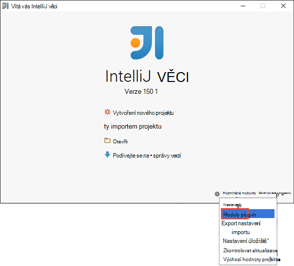
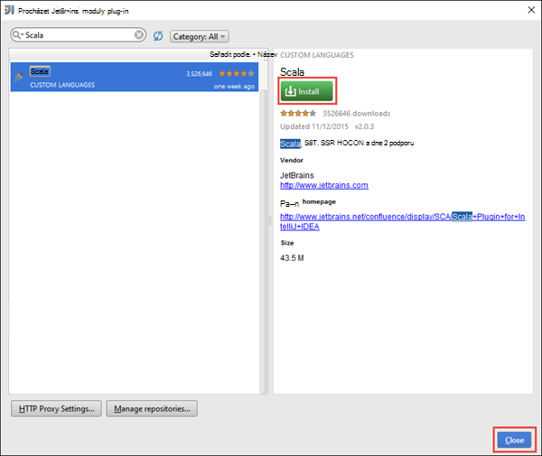
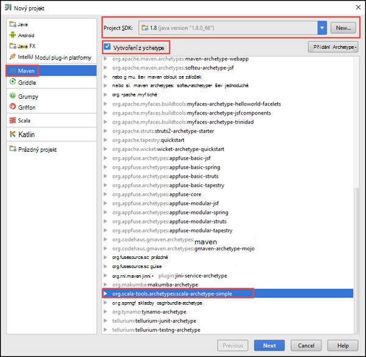
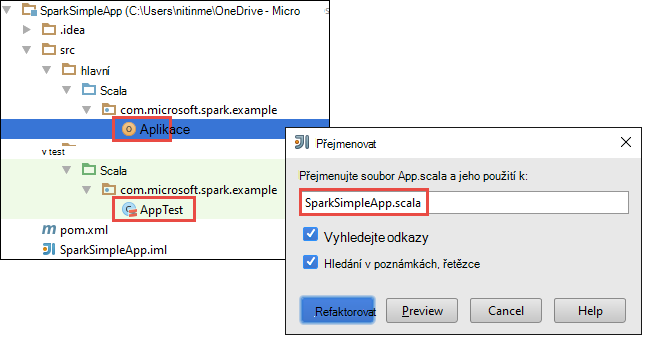
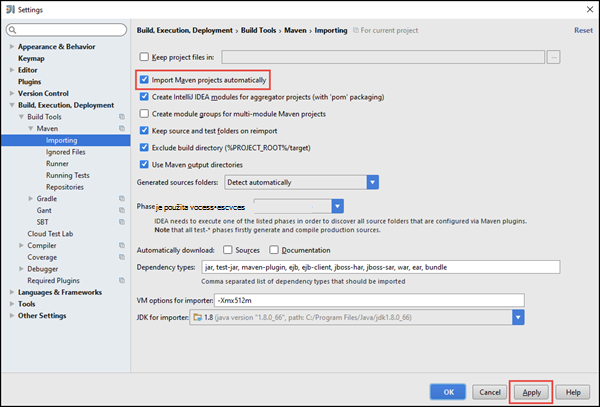
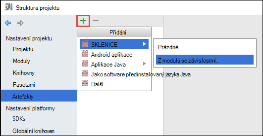
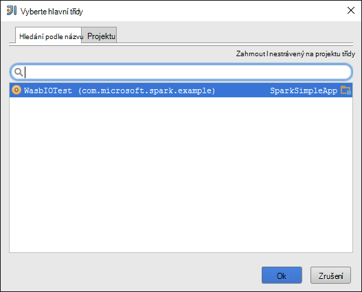
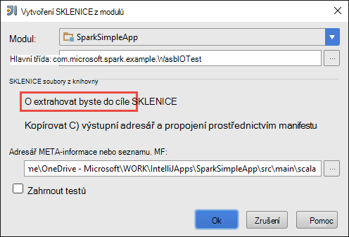
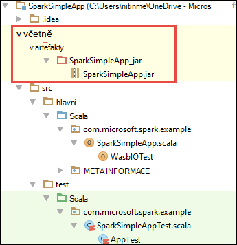

<properties
    pageTitle="Vytvoření samostatného scala spouštět aplikace na HDInsight Spark clusterů | Microsoft Azure"
    description="Naučte se vytvářet samostatně Spark spuštění aplikace v clusterů HDInsight Spark."
    services="hdinsight"
    documentationCenter=""
    authors="nitinme"
    manager="jhubbard"
    editor="cgronlun"
    tags="azure-portal"/>

<tags
    ms.service="hdinsight"
    ms.workload="big-data"
    ms.tgt_pltfrm="na"
    ms.devlang="na"
    ms.topic="article"
    ms.date="10/28/2016"
    ms.author="nitinme"/>

# Vytvoření samostatného Scala spuštění aplikace v Apache Spark obrázku na HDInsight Linux

Tento článek obsahuje podrobné pokyny na vývoj aplikací Spark samostatného napsané v Scala Maven pomocí IntelliJ věci. V článku používá Apache Maven jako systém sestavení a začíná existující archetype Maven pro Scala poskytovanou IntelliJ věci.  Na uceleném vytváření Scala aplikaci IntelliJ MYŠLENCE bude zahrnovat podle těchto kroků:

* Použití Maven jako systém sestavení.
* Aktualizujte soubor modelu objektu projektu (POM) řešení Spark modul závislosti.
* Napište aplikace Scala.
* Vytvořit soubor sklenice odeslání clusterů HDInsight Spark.
* Spusťte aplikaci Spark clusteru pomocí Livius.

>[AZURE.NOTE] HDInsight také poskytuje nástroj IntelliJ MYŠLENCE modul plug-in pro usnadnění proces vytvoření a odeslání aplikací HDInsight Spark obrázku na Linux. Další informace najdete v tématu [Použití HDInsight nástroje modul plug-in IntelliJ představu k vytvoření a odeslání Spark aplikací](hdinsight-apache-spark-intellij-tool-plugin.md).

**Zjistit předpoklady pro**

* Předplatné Azure. Viz [získání Azure bezplatnou zkušební verzi](https://azure.microsoft.com/documentation/videos/get-azure-free-trial-for-testing-hadoop-in-hdinsight/).
* Apache Spark obrázku na HDInsight Linux. Pokyny najdete v tématu [Vytvoření Spark Apache clusterů Azure HDInsight](hdinsight-apache-spark-jupyter-spark-sql.md).
* Oracle Java Development kit. Můžete ji nainstalovat z [tady](http://www.oracle.com/technetwork/java/javase/downloads/jdk8-downloads-2133151.html).
* Java integrovaném vývojovém prostředí. Tento článek používá IntelliJ MYŠLENCE 15.0.1. Můžete ji nainstalovat z [tady](https://www.jetbrains.com/idea/download/).

## Nainstalujte modul plug-in Scala IntelliJ představu

Pokud instalace IntelliJ MYŠLENCE není výzvu k povolení Scala modul plug-in, spusťte IntelliJ MYŠLENCE a projděte si následující kroky k instalaci modulu plug-in:

1. Spusťte IntelliJ MYŠLENCE a od úvodní obrazovky klikněte na **Konfigurovat** a klepněte na **moduly plug-in**.

    

2. Na další obrazovce klikněte na **modul plug-in nainstalovat JetBrains** v levém dolním rohu. V dialogovém okně **Procházet moduly plug-in JetBrains** vyhledat Scala a potom klikněte na **nainstalovat**.

    

3. Po úspěšném instalace modulu plug-in klikněte na **tlačítko restartujte MYŠLENCE IntelliJ** restartujte integrovaném vývojovém prostředí.

## Vytvoření samostatného Scala projektu

1. Spuštění IntelliJ MYŠLENCE a vytvořte nový projekt. V dialogovém okně Nový projekt zkontrolujte následující možnosti a potom na tlačítko **Další**.

    

    * Vyberte **Maven** jako typ projektu.
    * Určení **projektu SDK**. Klikněte na nový a přejděte v adresáři instalace Java obvykle `C:\Program Files\Java\jdk1.8.0_66`.
    * Vyberte možnost **vytvořit z archetype** .
    * V seznamu archetypes vyberte **org.scala tools.archetypes:scala archetype jednoduché**. Tím vytvořte strukturu správné adresářů a stáhnout závislosti požadované výchozí psát Scala program.

2. Zadejte příslušné hodnoty **ID skupiny**, **ArtifactId**a **verze**. Klikněte na tlačítko **Další**.

3. V další dialogovým oknem, kam zadáte Maven domácí adresář a další nastavení, přijměte výchozí nastavení a klikněte na tlačítko **Další**.

4. V dialogovém okně poslední zadejte název projektu a umístění a potom klikněte na **Dokončit**.

5. Odstraňte soubor na **MySpec.Scala** **src\test\scala\com\microsoft\spark\example**. Aplikace to nepotřebujete.

6. V případě potřeby přejmenujte výchozí zdrojový a testovací soubor. V levém podokně v IntelliJ PŘEDSTAVU přejděte na **src\main\scala\com.microsoft.spark.example**. Klikněte pravým tlačítkem myši **App.scala**klepněte **Refaktorovat**, klikněte na soubor přejmenovat a v dialogovém okně zadejte nový název aplikace a potom klikněte na **Refaktorovat**.

      

7. V dalších částech se aktualizuje pom.xml závislosti aplikace Spark Scala definovat. U těchto závislostí ke stažení a vyřešit automaticky musíte nakonfigurovat Maven příslušným způsobem.

    

    1. V nabídce **soubor** klikněte na **Nastavení**.
    2. V dialogovém okně **Nastavení** přejděte k **Vytvoření, spuštění, nasazení** > **Nástroje pro sestavení** > **Maven** > **Import**.
    3. Vyberte možnost **importovat Maven projekty automaticky**.
    4. Klikněte na **použít**a potom klikněte na **OK**.

8. Aktualizujte zdrojový soubor Scala zahrnout kód aplikace. Otevření a nahraďte stávající ukázkový kód následující kód a uložte požadované změny. Tento kód načte data z HVAC.csv (k dispozici na všech clusterů HDInsight Spark) načte řádky, které mají ve sloupci šestým pouze na jedno desetinné a zapíše výstup **/HVACOut** v části kontejneru výchozí úložiště clusteru.

        package com.microsoft.spark.example

        import org.apache.spark.SparkConf
        import org.apache.spark.SparkContext

        /**
          * Test IO to wasb
          */
        object WasbIOTest {
          def main (arg: Array[String]): Unit = {
            val conf = new SparkConf().setAppName("WASBIOTest")
            val sc = new SparkContext(conf)

            val rdd = sc.textFile("wasbs:///HdiSamples/HdiSamples/SensorSampleData/hvac/HVAC.csv")

            //find the rows which have only one digit in the 7th column in the CSV
            val rdd1 = rdd.filter(s => s.split(",")(6).length() == 1)

            rdd1.saveAsTextFile("wasbs:///HVACout")
          }
        }

9. Aktualizujte pom.xml.

    1.  V rámci `<project>\<properties>` přidejte následující text:

            <scala.version>2.10.4</scala.version>
            <scala.compat.version>2.10.4</scala.compat.version>
            <scala.binary.version>2.10</scala.binary.version>

    2. V rámci `<project>\<dependencies>` přidejte následující text:

            <dependency>
              <groupId>org.apache.spark</groupId>
              <artifactId>spark-core_${scala.binary.version}</artifactId>
              <version>1.4.1</version>
            </dependency>

    Uložení změn pom.xml.

10. Vytvoření souboru .jar. IntelliJ MYŠLENCE umožňuje vytváření SKLENICE jako artefaktem projektu. Proveďte následující kroky.

    1. V nabídce **soubor** klikněte na **Struktury projektu**.
    2. V dialogovém okně **Struktury projektu** klikněte na **artefakty** a potom klikněte na symbol plus. V dialogovém okně místní klikněte **JAR**a potom klikněte na **z moduly se závislostmi**.

        

    3. V dialogovém okně **Vytvořit JAR z modulů kontroly** , klikněte na tři tečky ( ) proti **Hlavní předmětu**.

    4. V dialogovém okně **Vyberte třídy hlavní** vyberte předmětu, které se zobrazí ve výchozím nastavení a klikněte na **OK**.

        

    5. V dialogovém okně **Vytvořit JAR z modulů** zkontrolujte, jestli je vybraná možnost extrahovat **byste do cíle SKLENICE** a klikněte na **OK**. Tím vytvoříte jednoho SKLENICE se všechny závislostmi.

        

    6. Karta rozložení výstup obsahuje seznam všech sklenic po g, které jsou součástí projektu Maven. Můžete vybrat a odstranit z nich, na kterém má aplikace Scala žádná přímý závislost. Aplikace vytváříme Tady můžete odebrat všechno kromě posledního jednu (**SparkSimpleApp kompilaci výstup**). Vyberte sklenic po g odstranit a pak klikněte na ikonu **Odstranit** .

        

        Zkontrolujte, že je zaškrtnuto políčko **vycházejí nastavení** , která zajistí, aby sklenice vytvořit pokaždé, když vytvořené nebo aktualizovat projekt. Klikněte na **použít** a potom na **OK**.

    7. Na řádku nabídek klikněte na **vytvořit**a potom klikněte na **Vytvořit projekt**. Klikněte na tlačítko **Sestavit artefakty** vytvořit sklenice. Sklenice výstup se vytvoří ve skupinovém rámečku **\out\artifacts**.

        

## Spusťte aplikaci clusteru Spark

Spusťte aplikaci na clusteru, postupujte takto:

* **Zkopírujte sklenice aplikace na Azure úložiště objektů blob** přidružené clusteru. [**AzCopy**](../storage/storage-use-azcopy.md), nástroj příkazového řádku, můžete to udělat. Existuje spoustu i v jiných klientech využívající nahrát data. Můžete najít další informace o jejich na [Odeslat data pro Hadoop projekty v HDInsight](hdinsight-upload-data.md).

* **Použití Livius můžou odeslat úloha aplikace vzdáleně** Spark clusteru. Spark clusterů na HDInsight obsahuje Livius, který poskytuje koncové body ZBÝVAJÍCÍ vzdáleně posílat Spark úkoly. Další informace najdete v tématu [odeslání Spark úlohy vzdáleně používat Livius pomocí Spark clusterů v HDInsight](hdinsight-apache-spark-livy-rest-interface.md).

## Viz taky

* [Přehled: Apache Spark na Azure HDInsight](hdinsight-apache-spark-overview.md)

### Scénáře

* [Spark s BI: Analýza interaktivní dat pomocí Spark v HDInsight nástrojích BI](hdinsight-apache-spark-use-bi-tools.md)

* [Spark s výukové počítače: použití Spark v HDInsight pro analýzu stavební teplotu pomocí TVK dat](hdinsight-apache-spark-ipython-notebook-machine-learning.md)

* [Spark s výukové počítače: použití Spark v HDInsight odhadnout výsledků kontroly jídla](hdinsight-apache-spark-machine-learning-mllib-ipython.md)

* [Datových proudů Spark: Použití Spark v HDInsight vytvářet v reálném čase streamování aplikace](hdinsight-apache-spark-eventhub-streaming.md)

* [Analýza protokolu webu pomocí Spark HDInsight](hdinsight-apache-spark-custom-library-website-log-analysis.md)

### Vytvoření a spuštění aplikací

* [Spuštění úlohy vzdáleně Spark clusteru pomocí Livius](hdinsight-apache-spark-livy-rest-interface.md)

### Nástroje a rozšíření

* [Modul plug-in nástroje HDInsight IntelliJ představu umožňuje vytvořit a odeslat Spark Scala aplikace](hdinsight-apache-spark-intellij-tool-plugin.md)

* [Modul plug-in pro použití HDInsight nástroje pro IntelliJ NÁPAD vzdáleně ladění Spark aplikací](hdinsight-apache-spark-intellij-tool-plugin-debug-jobs-remotely.md)

* [Pomocí obrázku Spark na HDInsight Zeppelin poznámkových bloků](hdinsight-apache-spark-use-zeppelin-notebook.md)

* [Oříšky umožňující Jupyter poznámkového bloku na Spark obrázku pro HDInsight](hdinsight-apache-spark-jupyter-notebook-kernels.md)

* [Použití externích balíčků s poznámkovými bloky Jupyter](hdinsight-apache-spark-jupyter-notebook-use-external-packages.md)

* [Instalace Jupyter ve vašem počítači a připojte k HDInsight Spark obrázku](hdinsight-apache-spark-jupyter-notebook-install-locally.md)

### Přidávání a používání zdrojů

* [Přidávání a používání zdrojů pro Apache Spark cluster v Azure HDInsight](hdinsight-apache-spark-resource-manager.md)

* [Sledování a ladění úlohy výpočetnímu clusteru Apache Spark v HDInsight](hdinsight-apache-spark-job-debugging.md)
