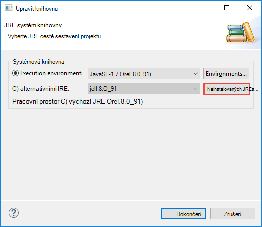

 <properties
    pageTitle="Vytvoření Spark Scala aplikací pomocí nástroje HDInsight v Azure nástrojů pro Eclipse | Microsoft Azure"
    description="Naučte se vytvářet samostatně Spark spuštění aplikace v clusterů HDInsight Spark."
    services="hdinsight"
    documentationCenter=""
    authors="nitinme"
    manager="jhubbard"
    editor="cgronlun"
    tags="azure-portal"/>

<tags
    ms.service="hdinsight"
    ms.workload="big-data"
    ms.tgt_pltfrm="na"
    ms.devlang="na"
    ms.topic="article"
    ms.date="08/30/2016"
    ms.author="nitinme"/>

# Pomocí nástrojů pro HDInsight v Azure sada nástrojů pro Eclipse vytvořit Spark žádosti o HDInsight Spark Linux obrázku

Tento článek obsahuje podrobné pokyny pro na vývoj aplikací Spark napsané v Scala a odesílání, aby HDInsight Spark clusteru pomocí nástroje HDInsight v Azure nástrojů pro zatmění. Pomocí nástrojů v několika různými způsoby:

* K vytvoření a odeslání aplikace Scala Spark clusteru HDInsight Spark
* Přístup k prostředky clusteru Azure HDInsight Spark
* K vytvoření a spuštění aplikace Scala Spark místně

>[AZURE.IMPORTANT] Tento nástroj slouží k vytvoření a odeslání aplikací jenom pro HDInsight Spark obrázku na Linux.

##Zjistit předpoklady pro

* Předplatné Azure. Viz [získání Azure bezplatnou zkušební verzi](https://azure.microsoft.com/documentation/videos/get-azure-free-trial-for-testing-hadoop-in-hdinsight/).

* Apache Spark obrázku na HDInsight Linux. Pokyny najdete v tématu [Vytvoření Spark Apache clusterů Azure HDInsight](hdinsight-apache-spark-jupyter-spark-sql.md).

* Oracle Java Development kit verze 7 a 8. 
    * **Java SDK 7** slouží k sestavování Spark projekty jako clusterů HDInsight podpora Java verze 7. Java SDK 7 si můžete stáhnout z [tady](http://www.oracle.com/technetwork/java/javase/downloads/jdk7-downloads-1880260.html).
    * **Java SDK 8** se používá pro runtime zatmění integrovaném vývojovém prostředí. Můžete si ji z [tady](http://www.oracle.com/technetwork/java/javase/downloads/jdk8-downloads-2133151.html).

* Zatmění integrovaném vývojovém prostředí. Tento článek používá zatmění Neónová. Můžete ji nainstalovat z [tady](https://www.eclipse.org/downloads/).

* Scala integrovaném vývojovém prostředí pro Eclipse. 
    * **Pokud máte nainstalovanou integrovaném vývojovém prostředí zatmění**, můžete přidat modul plug-in Scala integrovaném vývojovém prostředí tak, že přejdete **usnadnit** -> **Nainstalovat nový SoftWare**a přidejte [http://download.scala-ide.org/sdk/lithium/e44/scala211/stable/site](http://download.scala-ide.org/sdk/lithium/e44/scala211/stable/site) jako zdroj ke stažení modulu plug-in Scala pro Eclipse. 
    * **Pokud nemáte nainstalovaný integrovaném vývojovém prostředí zatmění**, si můžete nainstalovat integrovaném vývojovém prostředí Scala přímo z [tady](http://scala-ide.org/download/sdk.html). Můžete ZIP budou moct soubor stáhnout z tohoto odkazu, extrahovat ho, přejděte do složky **/eclipse** a spusťte soubor **eclipse.exe** odtud.
    
    >[AZURE.NOTE] Kroky v tomto dokumentu jsou založeny na integrovaném vývojovém prostředí zatmění pomocí modulu plug-in Scala nainstalovaný.

* Spark SDK. Můžete si ji z [tady](http://go.microsoft.com/fwlink/?LinkID=723585&clcid=0x409).

* Instalace z [https://www.eclipse.org/efxclipse/install.html](https://www.eclipse.org/efxclipse/install.html)clipse e (fx).

## Instalace nástroje HDInsight v Azure sada nástrojů pro Eclipse

HDInsight nástroje pro zatmění je k dispozici jako součást sady nástrojů Azure pro Eclipse. Pokyny k instalaci sady nástrojů Azure najdete v tématu [instalace Azure sada nástrojů pro Eclipse](../azure-toolkit-for-eclipse-installation.md).

## Přihlaste se k předplatného Azure

1. Spuštění integrovaném vývojovém zatmění prostředí a spusťte Průzkumníka Azure. V nabídce **okno** v integrovaném vývojovém prostředí klikněte na **Zobrazit zobrazení** a klikněte na **Další**. V dialogovém okně, které se otevře rozbalte **Azure**, klikněte na položku **Průzkumník Azure**a potom klikněte na **OK**.

    

2. Klikněte pravým tlačítkem myši na uzel **Azure** v **Průzkumníkovi Azure**a potom klikněte na **Spravovat předplatná**.

3. V dialogovém okně **Spravovat předplatná** klepněte na tlačítko **přihlásit** a zadejte svoje přihlašovací údaje Azure.

    

4. Po přihlášení se dialogové okno **Spravovat předplatná** seznam všech Azure předplatných přidružené pomocí přihlašovacích údajů. Klikněte na tlačítko **Zavřít** v dialogovém okně.

5. Na kartě Azure Explorer rozbalte **HDInsight** zobrazíte clusterů HDInsight Spark v rámci předplatného.

    

6. Dál můžete rozbalit název clusteru zobrazíte přidruženy clusteru prostředky (například úložiště účty).

    

## Nastavení Spark Scala projektu pro HDInsight Spark obrázku

1. Z pracovního prostoru zatmění integrovaném vývojovém prostředí klikněte na **soubor**, klikněte na **Nový**a potom klikněte na **projekt**. 

2. V průvodci **Nový projekt** rozbalte **HDInsight**, vyberte **Spark na HDInsight (Scala)**a klikněte na tlačítko **Další**.

    

3. V dialogovém okně **Nový projekt Scala HDInsight** zadejte nebo vyberte hodnoty jak je znázorněno na následujícím obrázku a klikněte na tlačítko **Další**.

    

    * Zadejte název projektu.
    * V dialogovém okně **JRE** zkontrolujte, že **použití prostředí spuštění JRE** je nastavený na **JavaSE 1.7**.
    * Ujistěte se, že Spark SDK je nastavený na místo, kde jste stáhli SDK. Odkaz umístění pro stahování je součástí [požadavky](#prerequisites) dříve v tomto tématu. Můžete taky si stáhnout SDK propojení zahrnuté v tomto dialogovém jak je vidět na obrázku nahoře.    

4. V dialogovém okně Další klikněte na kartu **knihovny** a potom poklikejte na **Knihovnu systému JRE [JavaSE 1.7]**.

    

5. V dialogovém okně **Upravit knihovnu** zkontrolujte, že **Spuštění prostředí** je nastavena na **JavaSE-1.7(jdk1.7.0_79)**. Pokud to není k dispozici jako jednu z možností, postupujte následujícím způsobem.

    1. Vyberte možnost **Alternativní JRE** a zda **JavaSE-1.7(jdk1.7.0_79)** je k dispozici.
    2. Pokud ne, klikněte na tlačítko **Nainstalovaný JREs** .

          

    3. V dialogovém okně **Nainstalovaný JREs** klikněte na **Přidat**.

            

    4. V dialogovém okně **JRE typ** vyberte **Standardní OM**a klikněte na tlačítko **Další**

            

    5. V dialogovém okně **JRE definice** klikněte na adresář, přejděte do umístění pro instalaci JDK 7 a vyberte kořenové složce pro **jdk1.7.0_79**.

            

    6. Klikněte na **Dokončit**. V dialogovém okně **JREs nenainstalovali** vyberte nově přidaný JRE a klikněte na **OK**.

           

    7. Nově přidaný JRE by měl být uveden pro **Spuštění prostředí**. Klikněte na **Dokončit**.

           

6. Zpět na kartě **knihoven** poklikejte na **Kontejner knihovny Scala [2.11.8]**. V dialogovém okně **Upravit knihovny** vyberte **Knihovna pevné Scala kontejner: 2.10.6**. 

    

    Kliknutím na **Dokončit** zavřete dialogové okno nastavení projektu.

## Vytvoření aplikace Scala pro HDInsight Spark obrázku

1. V už otevřené zatmění integrovaném vývojovém prostředí, z **Průzkumníka balíčku**rozšíření projektu, který jste dříve vytvořili, klikněte pravým tlačítkem **src**, přejděte na **Nový**a klikněte na **Další**.

2. V dialogovém okně **Vybrat průvodce** rozbalte **Scala průvodců**, klepněte na **Objekt Scala**a klikněte na tlačítko **Další**.

    

3. V dialogovém okně **Vytvořit nový soubor** zadejte název objektu a potom klikněte na **Dokončit**.

    

4. Vložte tento kód v textovém editoru.

        import org.apache.spark.SparkConf
        import org.apache.spark.SparkContext
    
        object MyClusterApp{
          def main (arg: Array[String]): Unit = {
            val conf = new SparkConf().setAppName("MyClusterApp")
            val sc = new SparkContext(conf)
        
            val rdd = sc.textFile("wasbs:///HdiSamples/HdiSamples/SensorSampleData/hvac/HVAC.csv")
        
            //find the rows which have only one digit in the 7th column in the CSV
            val rdd1 =  rdd.filter(s => s.split(",")(6).length() == 1)
        
            rdd1.saveAsTextFile("wasbs:///HVACOut")
          }     
        }

5. Spusťte aplikaci clusteru HDInsight Spark.

    1. Z **Průzkumníka balíček**klikněte pravým tlačítkem myši na název projektu a vyberte **Odeslat aplikace Spark HDInsight**.      

    2. V dialogovém okně **Odeslání Spark** poskytovat následující hodnoty.

        * **Název clusteru**vyberte HDInsight Spark obrázku, na kterém chcete spustit aplikaci.

        * Budete muset vyberte artefaktem z zatmění projektu, nebo vyberte jednu z disku.

        * Před textového pole **název třídy hlavní** zadejte název objektu zadaný v kódu (viz obrázek dole).

            

        * Protože kód aplikace v tomto příkladu nevyžaduje všechny argumenty příkazového řádku ani odkaz sklenic po g nebo soubory, můžete nechat zbývající textová pole prázdné.

        * Klikněte na **Odeslat**.

    3. Karta **Spark odeslání** by měly začít zobrazující průběh. Ukončení aplikace kliknutím na červené tlačítko v okně "Spark odeslání". Můžete taky zobrazit protokoly k této konkrétní aplikaci spustíte kliknutím na ikonu zeměkoule (symbolem modrého rámečku na obrázku).

        

    V následující části se naučíte, jak pro přístup k projektu výstup používat nástroje HDInsight Azure nástrojů pro Eclipse.

## Přístup a správě clusterů HDInsight Spark pomocí nástroje HDInsight v Azure nástrojů pro zatmění

Můžete provést řadu operací pomocí nástroje HDInsight.

### Přístup k kontejneru úložiště clusteru

1. Pomocí Průzkumník Windows Azure rozbalte uzel kořenové **HDInsight** zobrazíte seznam HDInsight Spark clusterů, které jsou k dispozici.

3. Rozbalte název clusteru zobrazíte účtu úložiště a kontejneru výchozí úložiště clusteru.

    

4. Klikněte na název kontejneru úložiště přidružené clusteru. V pravém podokně byste měli vidět složku s názvem **HVACOut**. Poklikáním je možné otevřít složku a uvidí **část -*** soubory. Otevřete jednu z těchto souborů zobrazíte výstup aplikace.

### Přístup k serveru Spark historie

1. Z **Průzkumníka Azure**klikněte pravým tlačítkem na název clusteru Spark a pak vyberte **Otevřít uživatelského rozhraní Spark historie**. Po zobrazení výzvy zadejte přihlašovací údaje Správce clusteru. Musí být zadána tyto při zřizování clusteru.

2. Na řídicím panelu Spark historie serveru můžete vyhledávat aplikace je právě dokončili systémem pomocí název aplikace. Ve výše uvedeného kódu nastavíte název aplikace pomocí `val conf = new SparkConf().setAppName("MyClusterApp")`. Proto název aplikace Spark byl **MyClusterApp**.

### Spuštění portálu Ambari

Z **Azure Explorer**klikněte pravým tlačítkem na název clusteru Spark a pak vyberte **Otevřít portálu pro správu obrázku (Ambari)**. Po zobrazení výzvy zadejte přihlašovací údaje Správce clusteru. Musí být zadána tyto při zřizování clusteru.

### Správa Azure předplatná

Ve výchozím nastavení seznamy nástrojích HDInsight v Azure sada nástrojů pro Eclipse clusterů Spark z Azure předplatného. V případě potřeby můžete určit předplatné, ke kterým chcete přistupovat ke clusteru. Z **Průzkumníka Azure**klikněte pravým tlačítkem myši na uzel kořenové **Azure** a potom klikněte na **Spravovat předplatná**. V dialogovém okně zrušte zaškrtnutí políček proti předplatné, které nechcete, aby přístup a pak klikněte na **Zavřít**. Můžete taky kliknout **Odhlásit se** Pokud se chcete odhlásit z Azure předplatného.

## Spuštění aplikace Spark Scala místně

Spouštění aplikací Spark Scala místně k počítači, můžete pomocí nástrojů HDInsight v Azure sada nástrojů pro Eclipse. Obvykle tyto aplikace není nutné přístupu k prostředkům clusteru například kontejner úložiště a spustit a testování bude místně.

### Předpoklady

Při spuštění místní Spark Scala aplikace na počítači s Windows, může se objevit výjimku způsobem popsaným v tématu [SPARK 2356](https://issues.apache.org/jira/browse/SPARK-2356) , který bude proveden kvůli chybějící **WinUtils.exe** operačního systému Windows. Tento problém vyřešit, musíte [Stáhněte spustitelný soubor odsud](http://public-repo-1.hortonworks.com/hdp-win-alpha/winutils.exe) do umístění, jako je **C:\WinUtils\bin**. Musíte potom přidejte proměnná prostředí **HADOOP_HOME** a nastavte hodnotu proměnné na **C\WinUtils**.

### Spuštění aplikace místní Spark Scala  

1. Spuštění zatmění a vytvořte nový projekt. V dialogovém okně Nový projekt zkontrolujte následující možnosti a potom na tlačítko **Další**.

    

    * V levém podokně vyberte **HDInsight**.
    * V pravém podokně vyberte **Spark vzorkem HDInsight místní spustit (Scala)**.
    * Klikněte na tlačítko **Další**.

2. Zajistit podrobnosti projektu kroky 3 až 6 uvedeno v předchozí části [Nastavení aplikace projektu Spark Scala clusteru HDInsight Spark](#set-up-a-spark-scala-application-project-for-an-hdinsight-spark cluster).

3. Šablona přidá ukázkový kód (**LogQuery**) ve složce **src** , který lze spustit místně na vašem počítači.

    

4.  Klikněte pravým tlačítkem na aplikaci **LogQuery** , přejděte na příkaz **Spustit jako**a potom klikněte na **1 Scala aplikace**. Zobrazí se výstup takto na kartě **konzoly** dole.

    

## Zpětné vazby a známé problémy

Zobrazený Spark výstup přímo nepodporuje a pracujeme na tomto.

Pokud máte nápady nebo názory nebo pokud jste používání narazíte na problémy při použití tohoto nástroje, neváhejte upusťte nám e-mailu na hdivstool v microsoft tečka cz.

## Viz taky

* [Přehled: Apache Spark na Azure HDInsight](hdinsight-apache-spark-overview.md)

### Scénáře

* [Spark s BI: Analýza interaktivní dat pomocí Spark v HDInsight nástrojích BI](hdinsight-apache-spark-use-bi-tools.md)

* [Spark s výukové počítače: použití Spark v HDInsight pro analýzu stavební teplotu pomocí TVK dat](hdinsight-apache-spark-ipython-notebook-machine-learning.md)

* [Spark s výukové počítače: použití Spark v HDInsight odhadnout výsledků kontroly jídla](hdinsight-apache-spark-machine-learning-mllib-ipython.md)

* [Datových proudů Spark: Použití Spark v HDInsight vytvářet v reálném čase streamování aplikace](hdinsight-apache-spark-eventhub-streaming.md)

* [Analýza protokolu webu pomocí Spark HDInsight](hdinsight-apache-spark-custom-library-website-log-analysis.md)

### Vytvoření a spuštění aplikací

* [Vytvoření samostatného aplikace pomocí Scala](hdinsight-apache-spark-create-standalone-application.md)

* [Spuštění úlohy vzdáleně Spark clusteru pomocí Livius](hdinsight-apache-spark-livy-rest-interface.md)

### Nástroje a rozšíření

* [Pomocí nástrojů pro HDInsight v Azure sada nástrojů pro IntelliJ k vytvoření a odeslání Spark Scala aplikace](hdinsight-apache-spark-intellij-tool-plugin.md)

* [Použití nástrojích HDInsight v Azure sada nástrojů pro IntelliJ ladění podnítit aplikací vzdáleně](hdinsight-apache-spark-intellij-tool-plugin-debug-jobs-remotely.md)

* [Pomocí obrázku Spark na HDInsight Zeppelin poznámkových bloků](hdinsight-apache-spark-use-zeppelin-notebook.md)

* [Oříšky umožňující Jupyter poznámkového bloku na Spark obrázku pro HDInsight](hdinsight-apache-spark-jupyter-notebook-kernels.md)

* [Použití externích balíčků s poznámkovými bloky Jupyter](hdinsight-apache-spark-jupyter-notebook-use-external-packages.md)

* [Instalace Jupyter ve vašem počítači a připojte k HDInsight Spark obrázku](hdinsight-apache-spark-jupyter-notebook-install-locally.md)

### Přidávání a používání zdrojů

* [Přidávání a používání zdrojů pro Apache Spark cluster v Azure HDInsight](hdinsight-apache-spark-resource-manager.md)

* [Sledování a ladění úlohy výpočetnímu clusteru Apache Spark v HDInsight](hdinsight-apache-spark-job-debugging.md)
