<properties 
    pageTitle="Pomocí Azure události rozbočovače Apache Spark v HDInsight zpracování streamování dat | Microsoft Azure" 
    description="Podrobné pokyny k odeslání dat můžete vysílat datovými proudy k rozbočovači Azure události a potom zobrazit tyto události Spark pomocí aplikace scala" 
    services="hdinsight" 
    documentationCenter="" 
    authors="nitinme" 
    manager="jhubbard" 
    editor="cgronlun"
    tags="azure-portal"/>

<tags 
    ms.service="hdinsight" 
    ms.workload="big-data" 
    ms.tgt_pltfrm="na" 
    ms.devlang="na" 
    ms.topic="article" 
    ms.date="09/30/2016" 
    ms.author="nitinme"/>

# Datových proudů Spark: Zpracování událostí z Azure události rozbočovače s Apache Spark obrázku na HDInsight Linux

Streamování Spark rozšiřuje základní rozhraní API Spark k vytváření aplikací pro zpracování scalable vysoký výkon, chybám proudu. Data můžete požití z mnoha zdrojů. V tomto článku používáme Azure události rozbočovače jedí data. Událost rozbočovače je velmi scalable požití systému, které se dají příjmu miliony události sekundu. 

V tomto kurzu se dozvíte, jak vytvořit událost rozbočovači Azure jedí zprávy do události rozbočovače pomocí aplikace konzoly v Java a načíst je paralelně použitím aplikace Spark vytvořené v Scala. Tato aplikace využívá data streamují přes rozbočovače událostí a přesměrovává na různých výstupy (Azure úložiště objektů Blob tabulku podregistru a tabulka serveru SQL).

> [AZURE.NOTE] Chcete-li postupovat podle pokynů v tomto článku, budete muset používat obě verze portálu Azure. Vytvoření události centrální použijete [Azure klasické portálu](https://manage.windowsazure.com). Pro práci s HDInsight Spark clusteru, budou používat [Portál Azure](https://portal.azure.com/).  

**Požadavky:**

Je nutné mít takto:

- Předplatné Azure. Viz [získání Azure bezplatnou zkušební verzi](https://azure.microsoft.com/documentation/videos/get-azure-free-trial-for-testing-hadoop-in-hdinsight/).
- Apache Spark obrázku. Pokyny najdete v tématu [Vytvoření Spark Apache clusterů Azure HDInsight](hdinsight-apache-spark-jupyter-spark-sql.md).
- Oracle Java Development kit. Můžete ji nainstalovat z [tady](http://www.oracle.com/technetwork/java/javase/downloads/jdk8-downloads-2133151.html).
- Java integrovaném vývojovém prostředí. Tento článek používá IntelliJ MYŠLENCE 15.0.1. Můžete ji nainstalovat z [tady](https://www.jetbrains.com/idea/download/).
- Ovladač Microsoft JDBC SQL Server, v4.1 nebo novější. To je nutné k zápisu dat událostí do databáze SQL serveru. Můžete ji nainstalovat z [tady](https://msdn.microsoft.com/sqlserver/aa937724.aspx).
- Databáze Azure SQL. Pokyny najdete v tématu [vytvoření databáze SQL v minutách](../sql-database/sql-database-get-started.md).

## Co dělá toto řešení?

Je to, jak streamování řešení přetékat:

1. Vytvoření rozbočovači Azure událost, kterou dostane proudem události.

2. Spuštění místní samostatnou aplikaci generuje události a posune centru Azure události. Ukázkové aplikace, která znamená to je publikován na [https://github.com/hdinsight/spark-streaming-data-persistence-examples](https://github.com/hdinsight/spark-streaming-data-persistence-examples).

2. Spuštění aplikace na streamování vzdáleně Spark clusteru, který načítá streamování události z Azure události centrální a posune na různých místech (objektů Blob Azure tabulku podregistru a tabulky databáze SQL). 

## Vytvořit centrum Azure události

1. Z [Portálu Azure](https://manage.windowsazure.com), vyberte **Nový** > **Služby Bus** > **Události centrální** > **Vytvořit vlastní**.

2. V dialogovém okně **Přidat nový rozbočovač událost** zadejte **Název centrální události**, vyberte **oblast** , kterou chcete vytvořit centru a vytvořte nový obor názvů nebo vyberte stávající. Klikněte na **šipku** na pokračovat.

    ![Stránka průvodce 1] (./media/hdinsight-apache-spark-eventhub-streaming/hdispark.streaming.create.event.hub.png "Vytvoření rozbočovači Azure události")

    > [AZURE.NOTE] Do stejného **umístění** by měla vyberte jako Apache Spark cluster v HDInsight snížit náklady a latence.

3. V dialogovém okně **Konfigurovat centrální událost** zadejte hodnoty **počet oddílů** a **Zprávy uchovávání informací** a klepněte na značku zaškrtnutí. V tomto příkladu použití počet oddílů 10 a zprávy uchování 1. Poznámka: počet oddílů, protože byste potřebovali tuto hodnotu později.

    ![Stránka průvodce 2] (./media/hdinsight-apache-spark-eventhub-streaming/hdispark.streaming.create.event.hub2.png "Oddíl zadejte velikost a uchovávání informací dnů centrální události")

4. Klikněte na centrum událost, kterou jste vytvořili, klikněte na **Konfigurovat**a vytvořte dvě zásady přístupu pro centrální události.

    <table>
    <tr><th>Jméno</th><th>Oprávnění</th></tr>
    <tr><td>mysendpolicy</td><td>Odeslání</td></tr>
    <tr><td>myreceivepolicy</td><td>Poslech</td></tr>
    </table>

    Po vytvoření oprávnění vyberte ikonu **Uložit** v dolní části stránky. Tím vytvoříte zásady sdílené přístupu, které se použijí k odeslání (**mysendpolicy**) a poslouchat Tato událost centrální (**myreceivepolicy**).

    ![zásady] (./media/hdinsight-apache-spark-eventhub-streaming/hdispark.streaming.event.hub.policies.png "Vytvoření události centrální zásady")

    
5. Poznamenejte si zásad klíčů vygenerovaných pro dvě zásady na stejné stránce. Klávesy uložte, protože se používají později.

    ![zásady klíče] (./media/hdinsight-apache-spark-eventhub-streaming/hdispark.streaming.event.hub.policy.keys.png "Uložení zásad klíče")

6. Na stránce **řídicího panelu** klikněte na **Informace o připojení** zdola načtení a uložení řetězce připojení pomocí dvou zásad rozbočovače události.

    ![zásady klíče] (./media/hdinsight-apache-spark-eventhub-streaming/hdispark.streaming.event.hub.policy.connection.strings.png "Uložení zásad připojovací řetězec")

## Použití aplikace Scala k odesílání zpráv k rozbočovači události

V této části použijte samostatnou místní aplikaci Scala proudu události odešlete centrální Azure událost, kterou jste vytvořili v předchozím kroku. Tuto aplikaci je dostupná na GitHub na [https://github.com/hdinsight/eventhubs-sample-event-producer](https://github.com/hdinsight/eventhubs-sample-event-producer). Tímto postupem se předpokládá, že jste již forked tohoto GitHub úložiště.

1. Otevřete aplikaci a **EventhubsSampleEventProducer**v IntelliJ MYŠLENCE.
    
2. Vytvoření projektu. V nabídce **sestavení** klikněte na **Vytvořit projekt**. Sklenice výstup se vytvoří ve skupinovém rámečku **\out\artifacts**.

>[AZURE.TIP] Můžete také k dispozici v IntelliJ MYŠLENCE možnost přímo z úložiště GitHub vytvořte projekt. Pokud chcete zjistit, jak tuto možnost používat proto, postupujte podle pokynů v následující části pokyny. Všimněte si, že spoustu kroky, které jsou popsané v následující části se nepoužijí Scala aplikace, kterou vytvoříte v tomto kroku. Příklad:

> * Nebudete muset aktualizovat POM zahrnout verze Spark. Důvodem je, že neexistuje žádná závislost na Spark pro vytváření této aplikace
> * Nebudete muset přidat několik sklenic po g závislost do knihovny projektu. Je proto, že tyto sklenic po g podporují není pro tento projekt.

## Aktualizace Scala streamování aplikace pro příjem události

Ukázková Scala aplikace přijímat události a směrování do různých míst je k dispozici [https://github.com/hdinsight/spark-streaming-data-persistence-examples](https://github.com/hdinsight/spark-streaming-data-persistence-examples). Postupujte podle pokynů a aktualizovat aplikaci a vytvořte sklenice výstupu.

1. Spuštění IntelliJ MYŠLENCE a na obrazovce Snadné spuštění vyberte **najdete v článku z správy verzí** a klikněte na **Libovolná**.
        
    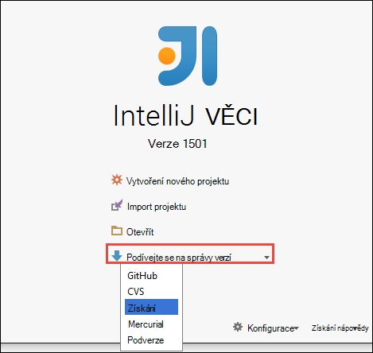

2. V dialogovém okně **Klonovat úložiště** zadejte adresu URL do úložiště libovolná zkopírovat, zadejte v adresáři klonovat do a klikněte na **vytvořit kopii**.

    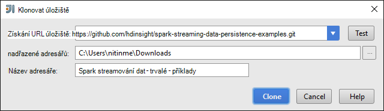

    
3. Dokud je úplně klonovat projektu, postupujte podle pokynů. Stisknutím **klávesy Alt + 1** otevřete **Zobrazení projektu**. By měl vypadat takto.

    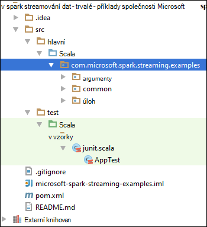
    
4. Zkontrolujte, že kód aplikace kompilaci s Java8. Abyste měli jistotu, klikněte na kartu **soubor**a **Struktury projektu**na kartě **projekt** Ujistěte se, že úroveň jazyka projektu je nastavený na **8 – lambda výrazy typ poznámky atd**.

    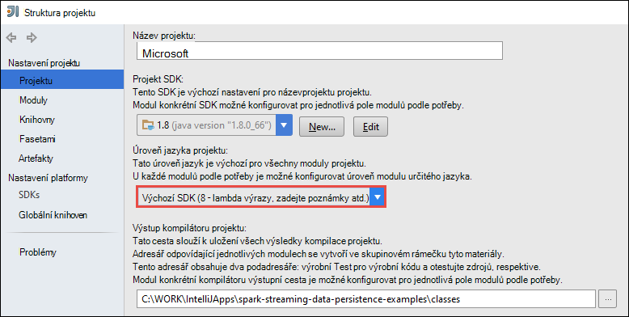

5. Otevřete **pom.xml** a zkontrolujte, jestli že je správná Spark verze. V části <properties> uzel, hledejte následující úryvek a ověření verze Spark.

        <scala.version>2.10.4</scala.version>
        <scala.compat.version>2.10.4</scala.compat.version>
        <scala.binary.version>2.10</scala.binary.version>
        <spark.version>1.6.2</spark.version>
    
5. Aplikace vyžaduje dva sklenic po g závislost:

    * **Sklenice EventHub příjemce**. Toto je potřebný pro Spark přijímat zprávy z centrální události. Použít tento sklenice, aktualizujte **pom.xml** přidáte pod nadpisem `<dependencies>`.

            <dependency>
              <groupId>com.microsoft.azure</groupId>
              <artifactId>spark-streaming-eventhubs_2.10</artifactId>
              <version>1.6.0</version>
            </dependency> 

    * **Sklenice ovladač JDBC**. To je nutné psát zprávy přijaté od rozbočovače událostí do databáze Azure SQL. Můžete si stáhnout v4.1 nebo novější tohoto souboru sklenice z [tady](https://msdn.microsoft.com/sqlserver/aa937724.aspx). Přidání odkazu do této sklenice v knihovně projektu. Proveďte následující kroky:

        1. Z okna IntelliJ MYŠLENCE Pokud máte aplikaci otevřít, klikněte na **soubor**klikněte na **Struktury projektu**a potom klikněte na položku **knihovny**. 
        
        2. Klikněte na ikonu Přidat (), klepněte na **Java**a přejděte do umístění, kam jste stáhli sklenice ovladač JDBC. Podle pokynů přidejte sklenice soubor do knihovny projektu.

            ![přidání chybějících závislostí] (./media/hdinsight-apache-spark-eventhub-streaming/add-missing-dependency-jars.png "Přidání chybějících závislosti, sklenic po g")

        3. Klikněte na tlačítko **použít**.

6. Vytvořte ve výstupním souboru sklenice. Proveďte následující kroky.
    1. V dialogovém okně **Struktury projektu** klikněte na **artefakty** a potom klikněte na symbol plus. V dialogovém okně místní klikněte **JAR**a potom klikněte na **z moduly se závislostmi**.

        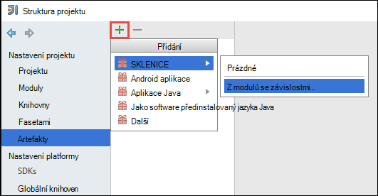

    1. V dialogovém okně **Vytvořit JAR z modulů kontroly** , klikněte na tři tečky () proti **Hlavní předmětu**.

    1. V dialogovém okně **Vyberte třídy hlavní** vyberte některé z dostupných tříd a klikněte na tlačítko **OK**.

        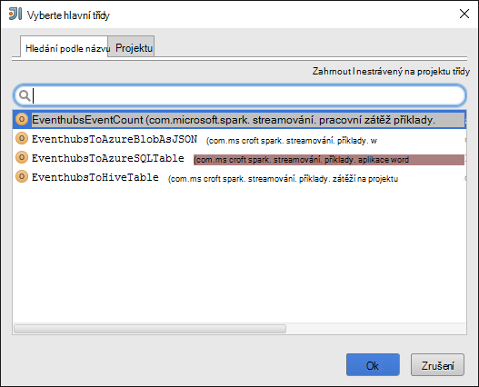

    1. V dialogovém okně **Vytvořit JAR z modulů** zkontrolujte, jestli je vybraná možnost extrahovat **byste do cíle SKLENICE** a klikněte na **OK**. Tím vytvoříte jednoho SKLENICE se všechny závislostmi.

        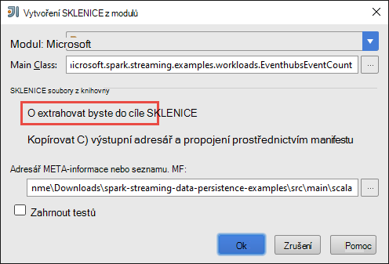

    1. Karta **Rozložení výstup** seznam všech sklenic po g, které jsou součástí projektu Maven. Můžete vybrat a odstranit z nich, na kterém má aplikace Scala žádná přímý závislost. Aplikace vytváříme Tady můžete odebrat všechno kromě posledního jednu (**microsoft-spark streamování – příklady kompilaci výstup**). Vyberte sklenic po g odstranit a pak klikněte na ikonu **Odstranit** ().

        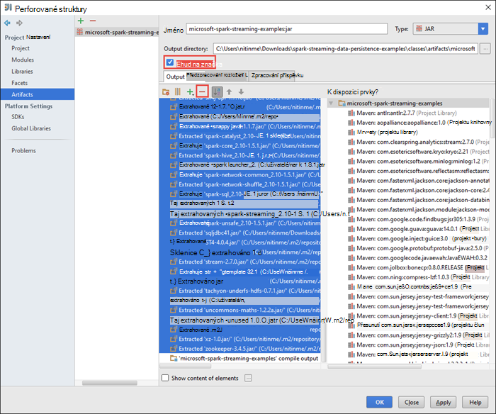

        Zkontrolujte, že je zaškrtnuto políčko **vycházejí nastavení** , která zajistí, aby sklenice vytvořit pokaždé, když vytvořené nebo aktualizovat projekt. Klikněte na **použít** a potom na **OK**.

    1. Na kartě **Rozložení výstup** vpravo dole v seznamu **Dostupné prvky** máte sklenice SQL JDBC, který jste dříve přidali do knihovny projektu. Na kartě **Rozložení výstup** musíte přidat takto. Klikněte pravým tlačítkem myši na soubor sklenice a potom klikněte na **Extrahovat do výstupu kořenové**.

        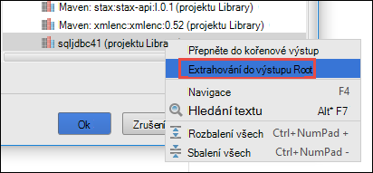  

        Karta **Rozložení výstup** by měl vypadat takto.

        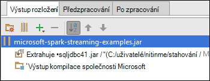     

        V dialogovém okně **Struktury projektu** klikněte na **použít** a potom klikněte na **OK**. 

    1. Na řádku nabídek klikněte na **vytvořit**a potom klikněte na **Vytvořit projekt**. Klikněte na tlačítko **Sestavit artefakty** vytvořit sklenice. Sklenice výstup se vytvoří ve skupinovém rámečku **\out\artifacts**.

        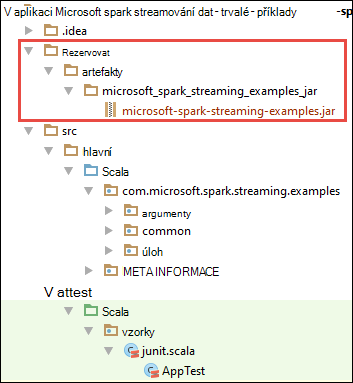

## Spuštění aplikace vzdáleně Spark clusteru pomocí Livius

Spusťte aplikaci streamování vzdáleně clusteru Spark použijeme Livius. Podrobné informace o používání Livius s HDInsight Spark clusteru najdete v tématu [odesílání úlohy vzdáleně Apache Spark clusteru v Azure HDInsight](hdinsight-apache-spark-livy-rest-interface.md). Než začnete s vzdálené úlohy na události datového proudu pomocí Spark nějaké jsou na několik věcí, které byste měli udělat:

1. Spusťte aplikaci místní samostatného pro generování událostí a odešle centrální události. Použití příkazu následující postup:

        java -cp EventhubsSampleEventProducer.jar com.microsoft.eventhubs.client.example.EventhubsClientDriver --eventhubs-namespace "mysbnamespace" --eventhubs-name "myeventhub" --policy-name "mysendpolicy" --policy-key "<policy key>" --message-length 32 --thread-count 32 --message-count -1

2. Zkopírujte streamování sklenice (**microsoft-spark streamování examples.jar**) k základnímu úložišti objektů Blob Azure přidružené clusteru. Díky sklenice přístupné pro Livius. [**AzCopy**](../storage/storage-use-azcopy.md), nástroj příkazového řádku, můžete to udělat. Existuje spoustu dalších klienty, se kterými můžete odeslat data. Můžete najít další informace o jejich na [Odeslat data pro Hadoop projekty v HDInsight](hdinsight-upload-data.md).

3. OTOČENÍ nainstalujte na počítač, kde používáte tyto aplikace z. Pomocí OTOČENÍ vyvolat koncové body Livius k provádění úloh vzdáleně.

### Spuštění aplikace pro příjem události do úložiště objektů Blob Azure jako text

Otevřete okno příkazového řádku, přejděte v adresáři nainstalovanou OTOČENÍ a spusťte tento příkaz (uživatelské jméno a heslo a clusteru nahradit název):

    curl -k --user "admin:mypassword1!" -v -H "Content-Type: application/json" -X POST --data @C:\Temp\inputBlob.txt "https://mysparkcluster.azurehdinsight.net/livy/batches"

Parametry v souboru **inputBlob.txt** je definována následujícím způsobem:

    { "file":"wasbs:///example/jars/microsoft-spark-streaming-examples.jar", "className":"com.microsoft.spark.streaming.examples.workloads.EventhubsEventCount", "args":["--eventhubs-namespace", "mysbnamespace", "--eventhubs-name", "myeventhub", "--policy-name", "myreceivepolicy", "--policy-key", "<put-your-key-here>", "--consumer-group", "$default", "--partition-count", 10, "--batch-interval-in-seconds", 20, "--checkpoint-directory", "/EventCheckpoint", "--event-count-folder", "/EventCount/EventCount10"], "numExecutors":20, "executorMemory":"1G", "executorCores":1, "driverMemory":"2G" }

Dejte nám pochopit, jaké parametry ve vstupním souboru:

* **soubor** je cesta k souboru sklenice aplikace v Azure úložiště účet spojený s clusteru.
* **název třídy** je název třídy v sklenice.
* **argumenty** je seznamu argumentů vyžadované předmětu
* **numExecutors** označuje počet jádra použijete Spark ke spuštění streamování aplikace. To buďte vždy aspoň dvakrát počet oddílů centrální události.
* **executorMemory**, **executorCores** **driverMemory** jsou parametry lze přiřadit požadované prostředky ke streamování aplikaci.

>[AZURE.NOTE] Není potřeba vytvářet složky výsledků výstup (EventCheckpoint, EventCount/EventCount10), které se používají jako parametry. Streamování aplikace je pro vás vytvoří.
    
Při spuštění příkazu byste měli vidět výstup takto:

    < HTTP/1.1 201 Created
    < Content-Type: application/json; charset=UTF-8
    < Location: /18
    < Server: Microsoft-IIS/8.5
    < X-Powered-By: ARR/2.5
    < X-Powered-By: ASP.NET
    < Date: Tue, 01 Dec 2015 05:39:10 GMT
    < Content-Length: 37
    <
    {"id":1,"state":"starting","log":[]}* Connection #0 to host mysparkcluster.azurehdinsight.net left intact

Poznamenejte si ID dávky v posledním řádku výstupu (v tomto příkladu je "1"). Abyste ověřili, že aplikace úspěšně spuštěna, můžete si prohlédnout účet Azure úložiště spojený s clusteru a byste měli vidět složce **/EventCount/EventCount10** tam vytvořen. Tato složka by měl obsahovat objekty BLOB, které zaznamenává počet událostí zpracovat v období zadané pro parametr **dávku interval v sekundách**.

Aplikace zůstanou spustit, dokud ho ukončit. Postup, použijte tento příkaz:

    curl -k --user "admin:mypassword1!" -v -X DELETE "https://mysparkcluster.azurehdinsight.net/livy/batches/1"

### Spuštění aplikace pro příjem události do úložiště objektů Blob Azure jako JSON

Otevřete okno příkazového řádku, přejděte v adresáři nainstalovanou OTOČENÍ a spusťte tento příkaz (uživatelské jméno a heslo a clusteru nahradit název):

    curl -k --user "admin:mypassword1!" -v -H "Content-Type: application/json" -X POST --data @C:\Temp\inputJSON.txt "https://mysparkcluster.azurehdinsight.net/livy/batches"

Parametry v souboru **inputJSON.txt** je definována následujícím způsobem:

    { "file":"wasbs:///example/jars/microsoft-spark-streaming-examples.jar", "className":"com.microsoft.spark.streaming.examples.workloads.EventhubsToAzureBlobAsJSON", "args":["--eventhubs-namespace", "mysbnamespace", "--eventhubs-name", "myeventhub", "--policy-name", "myreceivepolicy", "--policy-key", "<put-your-key-here>", "--consumer-group", "$default", "--partition-count", 10, "--batch-interval-in-seconds", 20, "--checkpoint-directory", "/EventCheckpoint", "--event-count-folder", "/EventCount/EventCount10", "--event-store-folder", "/EventStore10"], "numExecutors":20, "executorMemory":"1G", "executorCores":1, "driverMemory":"2G" }

Parametry se podobají určeným pro výstupu text v předchozím kroku. Znovu nepotřebujete vytvářet složky výstup (EventCheckpoint, EventCount/EventCount10), které se používají jako parametry. Streamování aplikace je pro vás vytvoří.

 Po spuštění příkazu může samostatně prohlížet účet Azure úložiště spojený s clusteru a byste měli vidět složce **/EventStore10** tam vytvořen. Otevřete libovolný soubor s předponou **část** a jste měli vidět zpracovaných ve formátu JSON událostí.

### Spuštění aplikace pro příjem události do tabulku podregistru

Chcete-li spustit aplikaci, která proudů událostí do tabulku podregistru je třeba některé další součásti. Toto jsou:

* datanucleus rozhraní api jdo 3.2.6.jar
* datanucleus rdbms 3.2.9.jar
* datanucleus základní 3.2.10.jar
* podregistru site.xml

**.Jar** soubory, které jsou k dispozici na svůj cluster HDInsight Spark na `/usr/hdp/current/spark-client/lib`. **Podregistru site.xml** je k dispozici na `/usr/hdp/current/spark-client/conf`.

Můžete [WinScp](http://winscp.net/eng/download.php) zkopírovat tyto soubory z clusteru do místního počítače. Pak můžete pomocí nástrojů zkopírovat tyto soubory k vašemu účtu úložiště přidružené clusteru. Další informace o tom, jak nahrát soubory do účtu úložiště najdete v článku [Odeslat data pro Hadoop projekty v HDInsight](hdinsight-upload-data.md).

Jakmile nad soubory zkopírovaná ke svému účtu Azure úložiště, otevřete okno příkazového řádku, přejděte v adresáři nainstalovanou OTOČENÍ a spusťte tento příkaz (uživatelské jméno a heslo a clusteru nahradit název):

    curl -k --user "admin:mypassword1!" -v -H "Content-Type: application/json" -X POST --data @C:\Temp\inputHive.txt "https://mysparkcluster.azurehdinsight.net/livy/batches"

Parametry v souboru **inputHive.txt** je definována následujícím způsobem:

    { "file":"wasbs:///example/jars/microsoft-spark-streaming-examples.jar", "className":"com.microsoft.spark.streaming.examples.workloads.EventhubsToHiveTable", "args":["--eventhubs-namespace", "mysbnamespace", "--eventhubs-name", "myeventhub", "--policy-name", "myreceivepolicy", "--policy-key", "<put-your-key-here>", "--consumer-group", "$default", "--partition-count", 10, "--batch-interval-in-seconds", 20, "--checkpoint-directory", "/EventCheckpoint", "--event-count-folder", "/EventCount/EventCount10", "--event-hive-table", "EventHiveTable10" ], "jars":["wasbs:///example/jars/datanucleus-api-jdo-3.2.6.jar", "wasbs:///example/jars/datanucleus-rdbms-3.2.9.jar", "wasbs:///example/jars/datanucleus-core-3.2.10.jar"], "files":["wasbs:///example/jars/hive-site.xml"], "numExecutors":20, "executorMemory":"1G", "executorCores":1, "driverMemory":"2G" }

Parametry se podobají určeným pro výstupu text v předchozích krocích. Znovu nepotřebujete k vytvoření složky výstup (EventCheckpoint, EventCount/EventCount10) nebo výstup tabulku podregistru (EventHiveTable10), který slouží jako parametry. Streamování aplikace je pro vás vytvoří. Všimněte si, že možnost **sklenic po g** a **soubory** obsahuje cest k souborům .jar a site.xml podregistru, kterou jste zkopírovali přes účet úložiště.

Pokud chcete ověřit, že tabulku podregistru byla úspěšně, můžete do obrázku a zpracování dotazů podregistru SSH. Pokyny najdete v tématu [Použití podregistru s Hadoop v Hdinsightu pomocí SSH](hdinsight-hadoop-use-hive-ssh.md). Po připojení pomocí SSH, spuštěním následujícího příkazu ověřit, že tabulku podregistru, **EventHiveTable10**, je.

    show tables;

Měli byste vidět výstup podobná této:

    OK
    eventhivetable10
    hivesampletable

Můžete taky spustit výběrový dotaz a zobrazit obsah tabulky.

    SELECT * FROM eventhivetable10 LIMIT 10;

Měli byste vidět výstup takto:

    ZN90apUSQODDTx7n6Toh6jDbuPngqT4c
    sor2M7xsFwmaRW8W8NDwMneFNMrOVkW1
    o2HcsU735ejSi2bGEcbUSB4btCFmI1lW
    TLuibq4rbj0T9st9eEzIWJwNGtMWYoYS
    HKCpPlWFWAJILwR69MAq863nCWYzDEw6
    Mvx0GQOPYvPR7ezBEpIHYKTKiEhYammQ
    85dRppSBSbZgThLr1s0GMgKqynDUqudr
    5LAWkNqorLj3ZN9a2mfWr9rZqeXKN4pF
    ulf9wSFNjD7BZXCyunozecov9QpEIYmJ
    vWzM3nvOja8DhYcwn0n5eTfOItZ966pa
    Time taken: 4.434 seconds, Fetched: 10 row(s)

### Spuštění aplikace pro příjem události do tabulky databáze Azure SQL

Před spuštěním tohoto kroku, zkontrolujte, že máte databázi Azure SQL vytvořili. Budete potřebovat hodnoty název databáze, název databázového serveru a přihlašovací údaje správce databáze jako parametry. Není potřeba vytvořit databázovou tabulku přes. Která vytvoří streamování aplikace.

Otevřete okno příkazového řádku, přejděte v adresáři nainstalovanou OTOČENÍ a spusťte tento příkaz:

    curl -k --user "admin:mypassword1!" -v -H "Content-Type: application/json" -X POST --data @C:\Temp\inputSQL.txt "https://mysparkcluster.azurehdinsight.net/livy/batches"

Parametry v souboru **inputSQL.txt** je definována následujícím způsobem:

    { "file":"wasbs:///example/jars/microsoft-spark-streaming-examples.jar", "className":"com.microsoft.spark.streaming.examples.workloads.EventhubsToAzureSQLTable", "args":["--eventhubs-namespace", "mysbnamespace", "--eventhubs-name", "myeventhub", "--policy-name", "myreceivepolicy", "--policy-key", "<put-your-key-here>", "--consumer-group", "$default", "--partition-count", 10, "--batch-interval-in-seconds", 20, "--checkpoint-directory", "/EventCheckpoint", "--event-count-folder", "/EventCount/EventCount10", "--sql-server-fqdn", "<database-server-name>.database.windows.net", "--sql-database-name", "mysparkdatabase", "--database-username", "sparkdbadmin", "--database-password", "<put-password-here>", "--event-sql-table", "EventContent" ], "numExecutors":20, "executorMemory":"1G", "executorCores":1, "driverMemory":"2G" }

Abyste ověřili, že aplikace úspěšně spuštěna, můžete připojení k databázi Azure SQL pomocí SQL Server Management Studio. Další informace o tom, jak to udělat, přečtěte si článek [připojení k databázi SQL s SQL Server Management Studio](../sql-database/sql-database-connect-query-ssms.md). Jakmile jste připojení k databázi, můžete přejít na **EventContent** tabulku, která byla vytvořená streamování aplikací. Můžete spustit rychlého dotazu přístup k datům z tabulky. Spuštěním následujícího dotazu:

    SELECT * FROM EventCount

Měli byste vidět výstup následujícím způsobem:

    00046b0f-2552-4980-9c3f-8bba5647c8ee
    000b7530-12f9-4081-8e19-90acd26f9c0c
    000bc521-9c1b-4a42-ab08-dc1893b83f3b
    00123a2a-e00d-496a-9104-108920955718
    0017c68f-7a4e-452d-97ad-5cb1fe5ba81b
    001KsmqL2gfu5ZcuQuTqTxQvVyGCqPp9
    001vIZgOStka4DXtud0e3tX7XbfMnZrN
    00220586-3e1a-4d2d-a89b-05c5892e541a
    0029e309-9e54-4e1b-84be-cd04e6fce5ec
    003333cf-874f-4045-9da3-9f98c2b4ea49
    0043c07e-8d73-420a-9af7-1fcb94575356
    004a11a9-0c2c-4bc0-a7d5-2e0ebd947ab9

    
## Viz taky

* [Přehled: Apache Spark na Azure HDInsight](hdinsight-apache-spark-overview.md)

### Scénáře

* [Spark s BI: Analýza interaktivní dat pomocí Spark v HDInsight nástrojích BI](hdinsight-apache-spark-use-bi-tools.md)

* [Spark s výukové počítače: použití Spark v HDInsight pro analýzu stavební teplotu pomocí TVK dat](hdinsight-apache-spark-ipython-notebook-machine-learning.md)

* [Spark s výukové počítače: použití Spark v HDInsight odhadnout výsledků kontroly jídla](hdinsight-apache-spark-machine-learning-mllib-ipython.md)

* [Analýza protokolu webu pomocí Spark HDInsight](hdinsight-apache-spark-custom-library-website-log-analysis.md)

### Vytvoření a spuštění aplikací

* [Vytvoření samostatného aplikace pomocí Scala](hdinsight-apache-spark-create-standalone-application.md)

* [Spuštění úlohy vzdáleně Spark clusteru pomocí Livius](hdinsight-apache-spark-livy-rest-interface.md)

### Nástroje a rozšíření

* [Modul plug-in nástroje HDInsight IntelliJ představu umožňuje vytvořit a odeslat Spark Scala aplikace](hdinsight-apache-spark-intellij-tool-plugin.md)

* [Modul plug-in pro použití HDInsight nástroje pro IntelliJ NÁPAD vzdáleně ladění Spark aplikací](hdinsight-apache-spark-intellij-tool-plugin-debug-jobs-remotely.md)

* [Pomocí obrázku Spark na HDInsight Zeppelin poznámkových bloků](hdinsight-apache-spark-use-zeppelin-notebook.md)

* [Oříšky umožňující Jupyter poznámkového bloku na Spark obrázku pro HDInsight](hdinsight-apache-spark-jupyter-notebook-kernels.md)

* [Použití externích balíčků s poznámkovými bloky Jupyter](hdinsight-apache-spark-jupyter-notebook-use-external-packages.md)

* [Instalace Jupyter ve vašem počítači a připojte k HDInsight Spark obrázku](hdinsight-apache-spark-jupyter-notebook-install-locally.md)

### Přidávání a používání zdrojů

* [Přidávání a používání zdrojů pro Apache Spark cluster v Azure HDInsight](hdinsight-apache-spark-resource-manager.md)

* [Sledování a ladění úlohy výpočetnímu clusteru Apache Spark v HDInsight](hdinsight-apache-spark-job-debugging.md)

[hdinsight-versions]: hdinsight-component-versioning.md
[hdinsight-upload-data]: hdinsight-upload-data.md
[hdinsight-storage]: hdinsight-hadoop-use-blob-storage.md

[azure-purchase-options]: http://azure.microsoft.com/pricing/purchase-options/
[azure-member-offers]: http://azure.microsoft.com/pricing/member-offers/
[azure-free-trial]: http://azure.microsoft.com/pricing/free-trial/
[azure-management-portal]: https://manage.windowsazure.com/
[azure-create-storageaccount]: ../storage-create-storage-account/ 
