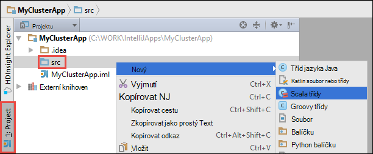

 <properties
    pageTitle="Pomocí nástrojů pro HDInsight v Azure sada nástrojů pro IntelliJ vzdáleně ladění spuštěné v HDInsight Spark clusterů | Microsoft Azure"
    description="Zjistěte, jak používat nástroje HDInsight v Azure sada nástrojů pro IntelliJ vzdáleně ladění spuštěné v clusterů HDInsight Spark."
    services="hdinsight"
    documentationCenter=""
    authors="nitinme"
    manager="jhubbard"
    editor="cgronlun"
    tags="azure-portal"/>

<tags
    ms.service="hdinsight"
    ms.workload="big-data"
    ms.tgt_pltfrm="na"
    ms.devlang="na"
    ms.topic="article"
    ms.date="09/09/2016"
    ms.author="nitinme"/>

# Pomocí nástrojů pro HDInsight v Azure sada nástrojů pro IntelliJ ladění Spark aplikací vzdáleně na HDInsight Spark Linux obrázku

Tento článek obsahuje podrobné pokyny, jak můžete pomocí nástroje HDInsight v Azure sada nástrojů pro IntelliJ odeslání úlohy Spark HDInsight Spark clusteru a potom ho vzdáleně ladění ze stolního počítače. Postup, musíte proveďte následující kroky nejvyšší úrovně:

1. Vytvoření webu na webu nebo čárky webu Azure virtuální síti. Kroky v tomto dokumentu Předpokládejme, že používáte v síti na webu.

2. Vytvoření clusteru Spark v Azure Hdinsightu, která je součástí virtuální sítě Azure na webu.

3. Ověřte připojení mezi headnode obrázku s počítačem.

4. Vytvoření aplikace Scala v IntelliJ MYŠLENCE a nastavení pro vzdálené ladění.

5. Spuštění a ladění aplikace.

##Zjistit předpoklady pro

* Předplatné Azure. Viz [získání Azure bezplatnou zkušební verzi](https://azure.microsoft.com/documentation/videos/get-azure-free-trial-for-testing-hadoop-in-hdinsight/).

* Apache Spark obrázku na HDInsight Linux. Pokyny najdete v tématu [Vytvoření Spark Apache clusterů Azure HDInsight](hdinsight-apache-spark-jupyter-spark-sql.md).
 
* Oracle Java Development kit. Můžete ji nainstalovat z [tady](http://www.oracle.com/technetwork/java/javase/downloads/jdk8-downloads-2133151.html).
 
* IntelliJ úvodními kroky. Tento článek používá verzi 15.0.1. Můžete ji nainstalovat z [tady](https://www.jetbrains.com/idea/download/).
 
* Nástrojích HDInsight v Azure sada nástrojů pro IntelliJ. HDInsight nástroje pro IntelliJ jsou k dispozici jako součást sady nástrojů Azure pro IntelliJ. Pokyny k instalaci sady nástrojů Azure najdete v tématu [instalace Azure sada nástrojů pro IntelliJ](../azure-toolkit-for-intellij-installation.md).

* Přihlaste se do předplatného Azure z IntelliJ úvodními kroky. Postupujte podle pokynů [v tomto poli](hdinsight-apache-spark-intellij-tool-plugin.md#log-into-your-azure-subscription).
 
* Při spuštění aplikace Spark Scala pro vzdálené ladění na počítači s Windows, může se objevit výjimku způsobem popsaným v tématu [SPARK 2356](https://issues.apache.org/jira/browse/SPARK-2356) , který bude proveden kvůli chybějící WinUtils.exe v systému Windows. Tento problém vyřešit, musíte [Stáhněte spustitelný soubor odsud](http://public-repo-1.hortonworks.com/hdp-win-alpha/winutils.exe) do umístění, jako je **C:\WinUtils\bin**. Musíte potom přidejte proměnná prostředí **HADOOP_HOME** a nastavte hodnotu proměnné na **C\WinUtils**.

## Krok 1: Vytvoření Azure virtuální sítě

Postupujte podle pokynů následujících odkazů můžete vytvořit virtuální síť Azure a ověřte propojení mezi plochu a Azure virtuální sítě.

* [Vytvoření VNet pomocí portálu Azure připojení VPN k webu](../vpn-gateway/vpn-gateway-howto-site-to-site-resource-manager-portal.md)
* [Vytvoření VNet pomocí připojení VPN k webu pomocí prostředí PowerShell](../vpn-gateway/vpn-gateway-create-site-to-site-rm-powershell.md)
* [Konfigurace čárky webu připojení k síti virtuální pomocí prostředí PowerShell](../vpn-gateway/vpn-gateway-howto-point-to-site-rm-ps.md)

## Krok 2: Vytvoření HDInsight Spark obrázku

Měli byste také vytvořit Apache Spark obrázku na Azure Hdinsightu, který je součástí Azure virtuální sítě, který jste vytvořili. Použití informací dostupných na [základě vytvořit Linux clusterů HDInsight](hdinsight-hadoop-provision-linux-clusters.md). V rámci volitelné konfigurace vyberte Azure virtuální sítě, který jste vytvořili v předchozím kroku.

## Krok 3: Ověření propojení mezi headnode obrázku s počítačem

1. Pokud potřebujete IP adresu headnode. Otevřete Ambari uživatelského rozhraní pro clusteru. Z zásuvné obrázku klikněte na **řídicí panel**.

    

2. V uživatelském rozhraní Ambari v pravém horním rohu klikněte na **Hosts**.

    

3. Zobrazí seznam headnodes, pracovní uzly a zookeeper uzlů. Headnodes mít **kola hn*** předponu. Klikněte na první headnode.

    

4. V dolní části stránky, která se otevře v poli **Souhrn** zkopírujte IP adresu headnode a název hostitele.

    

5. Zahrnout IP adresa a název hostitele headnode **hosts** soubor v počítači na místo, kam chcete spustit a vzdáleně ladění Spark úlohy. To vám umožní komunikovat s headnode pomocí IP adresu, jakož i název hostitele.

    1. Otevřete Poznámkový blok se zvýšenými oprávněními. V nabídce Soubor klikněte na **Otevřít** a potom přejděte do umístění souboru hosts. Na počítači s Windows je `C:\Windows\System32\Drivers\etc\hosts`.

    2. Přidejte následující text do souboru **hosts** .

            # For headnode0
            192.xxx.xx.xx hn0-nitinp
            192.xxx.xx.xx hn0-nitinp.lhwwghjkpqejawpqbwcdyp3.gx.internal.cloudapp.net

            # For headnode1
            192.xxx.xx.xx hn1-nitinp
            192.xxx.xx.xx hn1-nitinp.lhwwghjkpqejawpqbwcdyp3.gx.internal.cloudapp.net

5. Z počítače, na kterém jste připojení k virtuální síť Azure, která používá HDInsight clusteru zkontrolujte, že jste pomocí příkazu ping obou headnodes pomocí IP adresu, jakož i název hostitele.

6. SSH do obrázku headnode pomocí pokynů uvedených v [připojit k clusteru HDInsight pomocí SSH](hdinsight-hadoop-linux-use-ssh-windows.md#connect-to-a-linux-based-hdinsight-cluster). Z headnode clusteru ping IP adresu stolním počítači. Je vhodné otestovat připojení obou IP adresy přiřazené k počítači, jeden pro připojení k síti a druhý pro virtuální síť Azure, která je počítač připojený k.

7. Opakujte kroky pro další headnode stejně. 

## Krok 4: Vytvoření aplikace Spark Scala používat nástroje HDInsight Azure nástrojů pro IntelliJ a nastavení pro vzdálené ladění

1. Spuštění IntelliJ MYŠLENCE a vytvořte nový projekt. V dialogovém okně Nový projekt zkontrolujte následující možnosti a potom na tlačítko **Další**.

    

    * V levém podokně vyberte **HDInsight**.
    * V pravém podokně vyberte **Spark na HDInsight (Scala)**.
    * Klikněte na tlačítko **Další**.

2. Do dalšího okna zadejte podrobnosti projektu.

    * Zadejte název projektu a umístění projektu.
    * Pro **SDK projektu**zkontrolujte, že zadáte verze Java větší než 7.
    * **Scala SDK**klikněte na **vytvořit**, klikněte na tlačítko **Stáhnout**a vyberte verzi Scala používat. **Přesvědčte se, zda nepoužíváte verze 2.11.x**. V tomto příkladu verze **2.10.6**.

        

    * **Spark SDK**stažení a použití SDK z [tady](http://go.microsoft.com/fwlink/?LinkID=723585&clcid=0x409). Můžete taky ignorovat to a použijte [Spark Maven úložiště](http://mvnrepository.com/search?q=spark) , ale zkontrolujte, jestli máte nainstalované se dají aplikace Spark úložiště správné maven. (Třeba budete muset zkontrolujte, jestli že máte Spark streamování část nainstalovat, pokud používáte Spark streamování; Také prosím zkontrolujte, jestli že používáte úložiště, která je označená jako Scala 2.10: Nepoužívejte úložiště je označená jako Scala 2.11.)

        

    * Klikněte na **Dokončit**.

3. Aplikace project Spark automaticky vytvoří artefaktem za vás. Chcete-li zobrazit artefakt, postupujte takto.

    1. V nabídce **soubor** klikněte na **Struktury projektu**.
    2. V dialogovém okně **Struktury projektu** klikněte na **artefakty** zobrazíte artefakt výchozí, která se vytvoří.

        

    Můžete taky vytvořit vlastní artefakt bly po kliknutí na **+** ikona zvýrazněná na předchozím obrázku.

4. V dialogovém okně **Struktury projektu** klikněte na **projekt**. Pokud je nastaveno **Projektu SDK** 1.8, ujistěte se, že na **úrovni projektu jazyka** nastavena na **7 – kosočtverce, ARM, více skutečné atd**.

    

4. Přidání knihoven do projektu. Pokud chcete přidat do knihovny, klikněte pravým tlačítkem myši na název projektu ve stromové struktuře projektu a klikněte na **Otevřít nastavení modulu**. V dialogovém okně **Struktury projektu** v levém podokně klikněte na položku **knihovny**, klikněte na (+) symbol a potom klikněte na **Z Maven**. 

     

    V dialogovém okně **Stažení knihovny z úložiště Maven** vyhledávání a přidejte následující knihovny.

    * `org.scalatest:scalatest_2.10:2.2.1`
    * `org.apache.hadoop:hadoop-azure:2.7.1`

5. Kopírovat `yarn-site.xml` a `core-site.xml` z headnode obrázku a přidejte do projektu. Použijte následující příkazy Kopírovat soubory. Můžete provádět následující [softwaru Cygwin](https://cygwin.com/install.html) `scp` příkazů, které chcete zkopírovat soubory z headnodes obrázku.

        scp <ssh user name>@<headnode IP address or host name>://etc/hadoop/conf/core-site.xml .

    Protože už přidali, clusteru headnode IP adresy a názvy hostitelů fo hostitelů soubor na plochu, používáme příkazy **spojovací bod služby** následujícím způsobem.

        scp sshuser@hn0-nitinp:/etc/hadoop/conf/core-site.xml .
        scp sshuser@hn0-nitinp:/etc/hadoop/conf/yarn-site.xml .

    Přidejte tyto soubory do projektu zkopírováním je ve složce **/src** v projektu strom, například `<your project directory>\src`.

6. Aktualizace `core-site.xml` provést následující změny.

    1. `core-site.xml`obsahuje klávesy šifrované úložiště účet spojený s clusteru. V `core-site.xml` , že jste přidali do projektu, nahraďte zašifrovaný klíč klávesu skutečné úložiště přidružené k účtu úložiště výchozí. V tématu [Správa přístupových kláves úložiště](../storage/storage-create-storage-account.md#manage-your-storage-account).

            <property>
                <name>fs.azure.account.key.hdistoragecentral.blob.core.windows.net</name>
                <value>access-key-associated-with-the-account</value>
            </property>

    2. Odeberte tyto záznamy z `core-site.xml`.

            <property>
                <name>fs.azure.account.keyprovider.hdistoragecentral.blob.core.windows.net</name>
                <value>org.apache.hadoop.fs.azure.ShellDecryptionKeyProvider</value>
            </property>

            <property>
                <name>fs.azure.shellkeyprovider.script</name>
                <value>/usr/lib/python2.7/dist-packages/hdinsight_common/decrypt.sh</value>
            </property>

            <property>
                <name>net.topology.script.file.name</name>
                <value>/etc/hadoop/conf/topology_script.py</value>
            </property>

    3. Uložte soubor.

7. Přidání hlavní třídy aplikace. Z **Průzkumník projektu**klikněte pravým tlačítkem **src**, přejděte na **Nový**a klikněte na **Scala předmětu**.

    

8. V dialogovém okně **Vytvořit nové třídy Scala** zadejte název, **Typ** vyberte **objekt**a klikněte na **OK**.

    

9. V `MyClusterAppMain.scala` soubor, vložte tento kód. Tento kód vytvoří Spark kontext a spustí `executeJob` podle `SparkSample` objektu.

        import org.apache.spark.{SparkConf, SparkContext}

        object SparkSampleMain {
          def main (arg: Array[String]): Unit = {
            val conf = new SparkConf().setAppName("SparkSample")
                                      .set("spark.hadoop.validateOutputSpecs", "false")
            val sc = new SparkContext(conf)
        
            SparkSample.executeJob(sc,
                                   "wasbs:///HdiSamples/HdiSamples/SensorSampleData/hvac/HVAC.csv",
                                   "wasbs:///HVACOut")
          }
        }

10. Opakujte kroky 8 a 9 výše uvedeného přidat nový objekt Scala s názvem `SparkSample`. Do této třídy přidáte následující kód. Tento kód načte data z HVAC.csv (k dispozici na všech clusterů HDInsight Spark) načítá řádky, které mají ve sloupci sedmé CSV pouze na jedno desetinné a zapíše výstup **/HVACOut** v části kontejneru výchozí úložiště clusteru.

        import org.apache.spark.SparkContext
    
        object SparkSample {
          def executeJob (sc: SparkContext, input: String, output: String): Unit = {
            val rdd = sc.textFile(input)
        
            //find the rows which have only one digit in the 7th column in the CSV
            val rdd1 =  rdd.filter(s => s.split(",")(6).length() == 1)
        
            val s = sc.parallelize(rdd.take(5)).cartesian(rdd).count()
            println(s)
        
            rdd1.saveAsTextFile(output)
            //rdd1.collect().foreach(println)
          }
        
        }

11. Opakujte kroky 8 a 9 výše uvedeného slouží k přidání nového třídy s názvem `RemoteClusterDebugging`. Tato třída používá testovací architektura Spark, který se používá pro ladění aplikací. Přidat následující kód, který `RemoteClusterDebugging` předmětu.

        import org.apache.spark.{SparkConf, SparkContext}
        import org.scalatest.FunSuite
        
        class RemoteClusterDebugging extends FunSuite {
        
          test("Remote run") {
            val conf = new SparkConf().setAppName("SparkSample")
                                      .setMaster("yarn-client")
                                      .set("spark.yarn.am.extraJavaOptions", "-Dhdp.version=2.4")
                                      .set("spark.yarn.jar", "wasbs:///hdp/apps/2.4.2.0-258/spark-assembly-1.6.1.2.4.2.0-258-hadoop2.7.1.2.4.2.0-258.jar")
                                      .setJars(Seq("""C:\WORK\IntelliJApps\MyClusterApp\out\artifacts\MyClusterApp_DefaultArtifact\default_artifact.jar"""))
                                      .set("spark.hadoop.validateOutputSpecs", "false")
            val sc = new SparkContext(conf)
        
            SparkSample.executeJob(sc,
              "wasbs:///HdiSamples/HdiSamples/SensorSampleData/hvac/HVAC.csv",
              "wasbs:///HVACOut")
          }
        }

    Několik důležitých věcí je potřeba pamatovat tady:
    
    * Pro `.set("spark.yarn.jar", "wasbs:///hdp/apps/2.4.2.0-258/spark-assembly-1.6.1.2.4.2.0-258-hadoop2.7.1.2.4.2.0-258.jar")`, musí být sestavení Spark SKLENICE k dispozici v úložišti clusteru v zadaném umístění.
    * Pro `setJars`, zadejte umístění, kde bude vytvořen sklenice artefakt. Je většinou `<Your IntelliJ project directory>\out\<project name>_DefaultArtifact\default_artifact.jar`. 

11. V `RemoteClusterDebugging` třídy, klikněte pravým tlačítkem myši `test` klíčových slov a vyberte **Vytvořit konfigurace RemoteClusterDebugging**.

    

12. V dialogovém okně zadejte název pro konfiguraci a vyberte **identifikovat zkušební** jako **název testu**. Nechte všechny ostatní hodnoty jako výchozí, klikněte na **použít**a klikněte na **OK**.

    

13. Teď byste měli vidět **Vzdáleném spuštění** konfigurace rozevírací seznam v řádku nabídek. 

    

## Krok 5: Spustit aplikaci v režimu ladění

1. V projektu IntelliJ PŘEDSTAVU, otevřete `SparkSample.scala` a vytvořte zarážku vedle val rdd1. V rozevírací nabídce pro vytváření zarážky vyberte **řádek v executeJob (funkce)**.

    

2. Klikněte na tlačítko **Ladění spustit** vedle konfigurace **Vzdáleném spuštění** rozevírací seznam pro spuštění aplikace.

    

3. Při spuštění programu dosáhne zarážky, byste měli vidět **ladění** karta v dolní části okna.

    

4. Klikněte (**+**) na ikonu Přidat kukátko, jak je znázorněno na následujícím obrázku. 

    

    Zde, protože došlo k poškození aplikace před proměnnou `rdd1` byl vytvořen pomocí tohoto kukátko je vidět, co se nejprve 5 řádků v proměnné `rdd`. Stiskněte klávesu **ENTER**.

    

    Co vidíte na obrázku nahoře je mohl dotazu za běhu terrabytes dat a ladění jak pokračuje aplikace. Například do výstupu vidět na obrázku nahoře, zobrazí se, že první řádek výstup je záhlaví. Na základě toho, můžete upravit kód aplikací přejděte na řádek záhlaví v případě potřeby.

5. Teď můžete klepnutím na ikonu **Programu životopisu** pokračujte spuštění aplikace.

    

6. Pokud se aplikace úspěšně dokončí, byste měli vidět výstup například následující.

    

 

## Viz taky

* [Přehled: Apache Spark na Azure HDInsight](hdinsight-apache-spark-overview.md)

### Scénáře

* [Spark s BI: Analýza interaktivní dat pomocí Spark v HDInsight nástrojích BI](hdinsight-apache-spark-use-bi-tools.md)

* [Spark s výukové počítače: použití Spark v HDInsight pro analýzu stavební teplotu pomocí TVK dat](hdinsight-apache-spark-ipython-notebook-machine-learning.md)

* [Spark s výukové počítače: použití Spark v HDInsight odhadnout výsledků kontroly jídla](hdinsight-apache-spark-machine-learning-mllib-ipython.md)

* [Datových proudů Spark: Použití Spark v HDInsight vytvářet v reálném čase streamování aplikace](hdinsight-apache-spark-eventhub-streaming.md)

* [Analýza protokolu webu pomocí Spark HDInsight](hdinsight-apache-spark-custom-library-website-log-analysis.md)

### Vytvoření a spuštění aplikací

* [Vytvoření samostatného aplikace pomocí Scala](hdinsight-apache-spark-create-standalone-application.md)

* [Spuštění úlohy vzdáleně Spark clusteru pomocí Livius](hdinsight-apache-spark-livy-rest-interface.md)

### Nástroje a rozšíření

* [Pomocí nástrojů pro HDInsight v Azure sada nástrojů pro IntelliJ k vytvoření a odeslání Spark Scala aplikace](hdinsight-apache-spark-intellij-tool-plugin.md)

* [Pomocí nástrojů pro HDInsight v Azure sada nástrojů pro Eclipse vytvářet Spark aplikace](hdinsight-apache-spark-eclipse-tool-plugin.md)

* [Pomocí obrázku Spark na HDInsight Zeppelin poznámkových bloků](hdinsight-apache-spark-use-zeppelin-notebook.md)

* [Oříšky umožňující Jupyter poznámkového bloku na Spark obrázku pro HDInsight](hdinsight-apache-spark-jupyter-notebook-kernels.md)

* [Použití externích balíčků s poznámkovými bloky Jupyter](hdinsight-apache-spark-jupyter-notebook-use-external-packages.md)

* [Instalace Jupyter ve vašem počítači a připojte k HDInsight Spark obrázku](hdinsight-apache-spark-jupyter-notebook-install-locally.md)

### Přidávání a používání zdrojů

* [Přidávání a používání zdrojů pro Apache Spark cluster v Azure HDInsight](hdinsight-apache-spark-resource-manager.md)

* [Sledování a ladění úlohy výpočetnímu clusteru Apache Spark v HDInsight](hdinsight-apache-spark-job-debugging.md)
