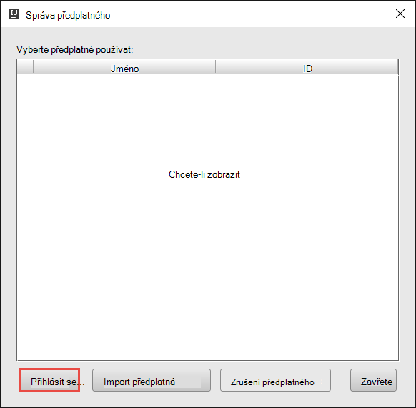

 <properties
    pageTitle="Vytvoření Spark Scala aplikací pomocí nástroje HDInsight v Azure nástrojů pro IntelliJ | Microsoft Azure"
    description="Naučte se vytvářet samostatně Spark spuštění aplikace v clusterů HDInsight Spark."
    services="hdinsight"
    documentationCenter=""
    authors="nitinme"
    manager="jhubbard"
    editor="cgronlun"
    tags="azure-portal"/>

<tags
    ms.service="hdinsight"
    ms.workload="big-data"
    ms.tgt_pltfrm="na"
    ms.devlang="na"
    ms.topic="article"
    ms.date="09/09/2016"
    ms.author="nitinme"/>

# Pomocí nástrojů pro HDInsight v Azure sada nástrojů pro IntelliJ vytvořit Spark žádosti o HDInsight Spark Linux obrázku

Tento článek obsahuje podrobné pokyny pro na vývoj aplikací Spark napsané v Scala a odesílání, aby HDInsight Spark clusteru pomocí nástroje HDInsight v Azure nástrojů pro IntelliJ.  Pomocí nástrojů v několika různými způsoby:

* K vytvoření a odeslání aplikace Scala Spark clusteru HDInsight Spark
* Přístup k prostředky clusteru Azure HDInsight Spark
* K vytvoření a spuštění aplikace Scala Spark místně

Můžete taky použít videa [tady](https://mix.office.com/watch/1nqkqjt5xonza) vám usnadní zahájení práce.

>[AZURE.IMPORTANT] Tento nástroj slouží k vytvoření a odeslání aplikací jenom pro HDInsight Spark obrázku na Linux.

##Zjistit předpoklady pro

* Předplatné Azure. Viz [získání Azure bezplatnou zkušební verzi](https://azure.microsoft.com/documentation/videos/get-azure-free-trial-for-testing-hadoop-in-hdinsight/).

* Apache Spark obrázku na HDInsight Linux. Pokyny najdete v tématu [Vytvoření Spark Apache clusterů Azure HDInsight](hdinsight-apache-spark-jupyter-spark-sql.md).

* Oracle Java Development kit. Můžete ji nainstalovat z [tady](http://www.oracle.com/technetwork/java/javase/downloads/jdk8-downloads-2133151.html).

* IntelliJ úvodními kroky. Tento článek používá verzi 15.0.1. Můžete ji nainstalovat z [tady](https://www.jetbrains.com/idea/download/).

## Instalace nástroje HDInsight v Azure sada nástrojů pro IntelliJ

HDInsight nástroje pro IntelliJ je k dispozici jako součást sady nástrojů Azure pro IntelliJ. Pokyny k instalaci sady nástrojů Azure najdete v tématu [instalace Azure sada nástrojů pro IntelliJ](../azure-toolkit-for-intellij-installation.md).

## Přihlaste se k předplatného Azure

1. Spuštění integrovaném vývojovém IntelliJ prostředí a spusťte Průzkumníka Azure. Z nabídky **zobrazení** v integrovaném vývojovém prostředí klikněte na **Panel nástrojů** a potom klikněte na položku **Průzkumník Azure**.

    

2. Klikněte pravým tlačítkem myši na uzel **Azure** v **Průzkumníkovi Azure**a potom klikněte na **Spravovat předplatná**.

3. V dialogovém okně **Spravovat předplatná** klepněte na tlačítko **přihlásit** a zadejte svoje přihlašovací údaje Azure.

    

4. Po přihlášení se dialogové okno **Spravovat předplatná** seznam všech Azure předplatných přidružené pomocí přihlašovacích údajů. Klikněte na tlačítko **Zavřít** v dialogovém okně.

5. Na kartě **Azure Explorer** rozbalte **HDInsight** zobrazíte clusterů HDInsight Spark v rámci předplatného.

    

6. Dál můžete rozbalit název clusteru zobrazíte přidruženy clusteru prostředky (například úložiště účty).

    

## Spuštění aplikace na Spark Scala HDInsight Spark obrázku

1. Spuštění IntelliJ MYŠLENCE a vytvořte nový projekt. V dialogovém okně Nový projekt zkontrolujte následující možnosti a potom na tlačítko **Další**.

    

    * V levém podokně vyberte **HDInsight**.
    * V pravém podokně vyberte **Spark na HDInsight (Scala)**.
    * Klikněte na tlačítko **Další**.

2. Do dalšího okna zadejte podrobnosti projektu.

    * Zadejte název projektu a umístění projektu.
    * Pro **SDK projektu**zkontrolujte, že zadáte verze Java větší než 7.
    * **Scala SDK**klikněte na **vytvořit**, klikněte na tlačítko **Stáhnout**a vyberte verzi Scala používat. **Přesvědčte se, zda nepoužíváte verze 2.11.x**. V tomto příkladu verze **2.10.6**.

        

    * **Spark SDK**stažení a použití SDK z [tady](http://go.microsoft.com/fwlink/?LinkID=723585&clcid=0x409). Můžete taky ignorovat to a použijte [Spark Maven úložiště](http://mvnrepository.com/search?q=spark) , ale zkontrolujte, jestli máte nainstalované se dají aplikace Spark úložiště správné maven. (Třeba budete muset zkontrolujte, jestli že máte Spark streamování část nainstalovat, pokud používáte Spark streamování; Také prosím zkontrolujte, jestli že používáte úložiště, která je označená jako Scala 2.10: Nepoužívejte úložiště je označená jako Scala 2.11.)

        

    * Klikněte na **Dokončit**.

3. Aplikace project Spark automaticky vytvoří artefaktem za vás. Chcete-li zobrazit artefakt, postupujte takto.

    1. V nabídce **soubor** klikněte na **Struktury projektu**.
    2. V dialogovém okně **Struktury projektu** klikněte na **artefakty** zobrazíte artefakt výchozí, která se vytvoří.

        

    Můžete taky vytvořit vlastní artefakt bly po kliknutí na **+** ikona zvýrazněná na předchozím obrázku.

4. V dialogovém okně **Struktury projektu** klikněte na **projekt**. Pokud je nastaveno **Projektu SDK** 1.8, ujistěte se, že na **úrovni projektu jazyka** nastavena na **7 – kosočtverce, ARM, více skutečné atd**.

    

5. Přidání zdrojového kódu aplikace.

    1. Z **Průzkumník projektu**klikněte pravým tlačítkem **src**, přejděte na **Nový**a klikněte na **Scala předmětu**.

        

    2. V dialogovém okně **Vytvořit nové třídy Scala** zadejte název, **Typ** vyberte **objekt**a klikněte na **OK**.

        

    3. V souboru **MyClusterApp.scala** vložte tento kód. Tento kód načte data z HVAC.csv (k dispozici na všech clusterů HDInsight Spark) načítá řádky, které mají ve sloupci sedmé CSV pouze na jedno desetinné a zapíše výstup **/HVACOut** v části kontejneru výchozí úložiště clusteru.

            import org.apache.spark.SparkConf
            import org.apache.spark.SparkContext

            object MyClusterApp{
              def main (arg: Array[String]): Unit = {
                val conf = new SparkConf().setAppName("MyClusterApp")
                val sc = new SparkContext(conf)

                val rdd = sc.textFile("wasbs:///HdiSamples/HdiSamples/SensorSampleData/hvac/HVAC.csv")

                //find the rows which have only one digit in the 7th column in the CSV
                val rdd1 =  rdd.filter(s => s.split(",")(6).length() == 1)

                rdd1.saveAsTextFile("wasbs:///HVACOut")
              }

            }

5. Spusťte aplikaci clusteru HDInsight Spark.

    1. Z okna **Průzkumník projektu**klikněte pravým tlačítkem myši na název projektu a vyberte **Odeslat aplikace Spark HDInsight**.

        

    2. Zobrazí se výzva k zadání přihlašovacích údajů Azure předplatného. V dialogovém okně **Odeslání Spark** poskytovat následující hodnoty.

        * **Spark clusterů (pouze Linux)**vyberte HDInsight Spark obrázku, na kterém chcete spustit aplikaci.

        * Potřebujete vyberte artefaktem z IntelliJ projektu, nebo vyberte jednu z disku.

        * Před textového pole **název třídy hlavní** klikněte na tři tečky ( ), vyberte hlavní předmětu ve zdrojovém kódu aplikace a klikněte na **OK**.

            

        * Protože kód aplikace v tomto příkladu nevyžaduje všechny argumenty příkazového řádku ani odkaz sklenic po g nebo soubory, můžete nechat zbývající textová pole prázdné.

        * Po zadání všech vstupy, dialogové okno by měl vypadat takto.

            

        * Klikněte na **Odeslat**.

    3. Karta **Odeslání Spark** v dolní části okna by měly začít zobrazující průběh. Aplikaci můžete taky ukončit kliknutím na červené tlačítko v okně "Spark odeslání".

        

    V následující části se naučíte, jak získat přístup úlohy výstup používat nástroje HDInsight Azure nástrojů pro IntelliJ.

## Přístup a správě clusterů HDInsight Spark pomocí nástroje HDInsight v Azure nástrojů pro IntelliJ

Můžete provést řadu operací používat HDInsight nástroje, které jsou součástí sady nástrojů Azure pro IntelliJ.

### Zobrazit přímo úlohy nástrojích HDInsight

1. Z **Průzkumníka Azure**rozbalíte **Hdinsightu**, rozbalte název obrázku Spark a klikněte na **projekty**.

2. V pravém podokně zobrazí kartu **Spark úlohy zobrazit** všechny aplikace spuštěné v clusteru. Klikněte na název aplikace, u kterého chcete zobrazit podrobnosti.

    

3. Do polí **Chybová zpráva**, **Výstup projektu**, **Livius úlohy protokoly**a **Spark ovladač protokoly** jsou vyplněné založené na aplikaci, kterou vyberete.

4. Po kliknutí na příslušné tlačítka v horní části obrazovky můžete otevřít taky **Spark historie uživatelského rozhraní** a **Vláken uživatelského rozhraní** (na úrovni aplikace).

### Přístup k serveru Spark historie

1. Z **Průzkumníka Azure**rozbalte **HDInsight**, klikněte pravým tlačítkem na název clusteru Spark a vyberte **Otevřít uživatelského rozhraní Spark historie**. Po zobrazení výzvy zadejte přihlašovací údaje Správce clusteru. Musí být zadána tyto při zřizování clusteru.

2. Na řídicím panelu Spark historie serveru můžete vyhledávat aplikace je právě dokončili systémem pomocí název aplikace. Ve výše uvedeného kódu nastavíte název aplikace pomocí `val conf = new SparkConf().setAppName("MyClusterApp")`. Proto název aplikace Spark byl **MyClusterApp**.

### Spuštění portálu Ambari

Z **Průzkumníka Azure**rozbalte **HDInsight**, klikněte pravým tlačítkem na název clusteru Spark a pak vyberte **Otevřít portálu pro správu obrázku (Ambari)**. Po zobrazení výzvy zadejte přihlašovací údaje Správce clusteru. Musí být zadána tyto při zřizování clusteru.

### Správa Azure předplatná

Ve výchozím nastavení HDInsight nástroje seznamy clusterů Spark z Azure předplatného. V případě potřeby můžete určit předplatné, ke kterým chcete přistupovat ke clusteru. Z **Průzkumníka Azure**klikněte pravým tlačítkem myši na uzel kořenové **Azure** a potom klikněte na **Spravovat předplatná**. V dialogovém okně zrušte zaškrtnutí políček proti předplatné, které nechcete, aby přístup a pak klikněte na **Zavřít**. Můžete taky kliknout **Odhlásit se** Pokud se chcete odhlásit z Azure předplatného.

## Spuštění aplikace Spark Scala místně

Spouštění aplikací Spark Scala místně k počítači, můžete pomocí nástrojů HDInsight v Azure sada nástrojů pro IntelliJ. Obvykle tyto aplikace není nutné přístupu k prostředkům clusteru například kontejner úložiště a spustit a testování bude místně.

### Předpoklady

Při spuštění místní Spark Scala aplikace na počítači s Windows, může se objevit výjimku způsobem popsaným v tématu [SPARK 2356](https://issues.apache.org/jira/browse/SPARK-2356) , který bude proveden kvůli chybějící WinUtils.exe v systému Windows. Tento problém vyřešit, musíte [Stáhněte spustitelný soubor odsud](http://public-repo-1.hortonworks.com/hdp-win-alpha/winutils.exe) do umístění, jako je **C:\WinUtils\bin**. Musíte potom přidejte proměnná prostředí **HADOOP_HOME** a nastavte hodnotu proměnné na **C\WinUtils**.

### Spuštění aplikace místní Spark Scala  

1. Spuštění IntelliJ MYŠLENCE a vytvořte nový projekt. V dialogovém okně Nový projekt zkontrolujte následující možnosti a potom na tlačítko **Další**.

    

    * V levém podokně vyberte **HDInsight**.
    * V pravém podokně vyberte **Spark vzorkem HDInsight místní spustit (Scala)**.
    * Klikněte na tlačítko **Další**.

2. Do dalšího okna zadejte podrobnosti projektu.

    * Zadejte název projektu a umístění projektu.
    * Pro **SDK projektu**zkontrolujte, že zadáte verze Java větší než 7.
    * **Scala SDK**klikněte na **vytvořit**, klikněte na tlačítko **Stáhnout**a vyberte verzi Scala používat. **Přesvědčte se, zda nepoužíváte verze 2.11.x**. V tomto příkladu verze **2.10.6**.

        

    * **Spark SDK**stažení a použití SDK z [tady](http://go.microsoft.com/fwlink/?LinkID=723585&clcid=0x409). Můžete taky ignorovat to a použijte [Spark Maven úložiště](http://mvnrepository.com/search?q=spark) , ale zkontrolujte, jestli máte nainstalované se dají aplikace Spark úložiště správné maven. (Třeba budete muset zkontrolujte, jestli že máte Spark streamování část nainstalovat, pokud používáte Spark streamování; Také prosím zkontrolujte, jestli že používáte úložiště, která je označená jako Scala 2.10: Nepoužívejte úložiště je označená jako Scala 2.11.)

        

    * Klikněte na **Dokončit**.

3. Šablona přidá ukázkový kód (**LogQuery**) ve složce **src** , který lze spustit místně na vašem počítači.

    

4.  Klikněte pravým tlačítkem na aplikaci **LogQuery** a potom klikněte na **"Spustit"LogQuery""**. Zobrazí se výstup takto na kartě **Spustit** dole.

    

## Převést existující IntelliJ MYŠLENCE aplikace pro účely HDInsight nástroje v Azure nástrojů IntelliJ

Můžete také převést existující Spark Scala aplikace vytvořené v IntelliJ zkontrolovat, že kompatibilní s nástrojích HDInsight v Azure sada nástrojů pro IntelliJ. To vám umožní podat žádost clusteru HDInsight Spark pomocí nástroje. Můžete to udělat pomocí následujících kroků:

1. Pro existující Spark Scala použitím vytvořené pomocí IntelliJ PŘEDSTAVU otevřete soubor přidružené .iml.
2. Na kořenové úrovni zobrazí se element **modul** takto:

        <module org.jetbrains.idea.maven.project.MavenProjectsManager.isMavenModule="true" type="JAVA_MODULE" version="4">

3. Úprava prvek, který chcete přidat `UniqueKey="HDInsightTool"` tak, aby element **modul** vypadá následovně:

        <module org.jetbrains.idea.maven.project.MavenProjectsManager.isMavenModule="true" type="JAVA_MODULE" version="4" UniqueKey="HDInsightTool">

4. Uložte změny. Aplikace by se měla kompatibilní s nástrojích HDInsight v Azure sada nástrojů pro IntelliJ. Toto můžete otestovat kliknutím pravým tlačítkem myši na název projektu, v okně Průzkumník projektu. V místní nabídce nyní měli mít možnost **Odeslat aplikace Spark HDInsight**.

## Řešení potíží

### Chyba "Stiskněte klávesovou zkratku větší velikost haldy" v místní spuštění

V Spark 1,6 Pokud používáte SDK Java 32bitová verze během místní spustit, může dojít následujících chyb:

    Exception in thread "main" java.lang.IllegalArgumentException: System memory 259522560 must be at least 4.718592E8. Please use a larger heap size.
        at org.apache.spark.memory.UnifiedMemoryManager$.getMaxMemory(UnifiedMemoryManager.scala:193)
        at org.apache.spark.memory.UnifiedMemoryManager$.apply(UnifiedMemoryManager.scala:175)
        at org.apache.spark.SparkEnv$.create(SparkEnv.scala:354)
        at org.apache.spark.SparkEnv$.createDriverEnv(SparkEnv.scala:193)
        at org.apache.spark.SparkContext.createSparkEnv(SparkContext.scala:288)
        at org.apache.spark.SparkContext.<init>(SparkContext.scala:457)
        at LogQuery$.main(LogQuery.scala:53)
        at LogQuery.main(LogQuery.scala)
        at sun.reflect.NativeMethodAccessorImpl.invoke0(Native Method)
        at sun.reflect.NativeMethodAccessorImpl.invoke(NativeMethodAccessorImpl.java:57)
        at sun.reflect.DelegatingMethodAccessorImpl.invoke(DelegatingMethodAccessorImpl.java:43)
        at java.lang.reflect.Method.invoke(Method.java:606)
        at com.intellij.rt.execution.application.AppMain.main(AppMain.java:144)

Totiž velikost haldy není dostatečně velký k tomu pro Spark spustit, protože Spark vyžaduje aspoň 471MB (můžete získat další informace z [SPARK 12081](https://issues.apache.org/jira/browse/SPARK-12081) požadovaná). Jeden jednoduché řešení je použít SDK Java 64bitová verze. Můžete taky změnit nastavení JVM IntelliJ přidáním těchto možností:

    -Xms128m -Xmx512m -XX:MaxPermSize=300m -ea

## Zpětné vazby a známé problémy

Zobrazený Spark výstup přímo nepodporuje a pracujeme na tomto.

Pokud máte nápady nebo názory nebo pokud jste používání narazíte na problémy při použití tohoto nástroje, neváhejte upusťte nám e-mailu na hdivstool v microsoft tečka cz.

## Viz taky

* [Přehled: Apache Spark na Azure HDInsight](hdinsight-apache-spark-overview.md)

### Scénáře

* [Spark s BI: Analýza interaktivní dat pomocí Spark v HDInsight nástrojích BI](hdinsight-apache-spark-use-bi-tools.md)

* [Spark s výukové počítače: použití Spark v HDInsight pro analýzu stavební teplotu pomocí TVK dat](hdinsight-apache-spark-ipython-notebook-machine-learning.md)

* [Spark s výukové počítače: použití Spark v HDInsight odhadnout výsledků kontroly jídla](hdinsight-apache-spark-machine-learning-mllib-ipython.md)

* [Datových proudů Spark: Použití Spark v HDInsight vytvářet v reálném čase streamování aplikace](hdinsight-apache-spark-eventhub-streaming.md)

* [Analýza protokolu webu pomocí Spark HDInsight](hdinsight-apache-spark-custom-library-website-log-analysis.md)

### Vytvoření a spuštění aplikací

* [Vytvoření samostatného aplikace pomocí Scala](hdinsight-apache-spark-create-standalone-application.md)

* [Spuštění úlohy vzdáleně Spark clusteru pomocí Livius](hdinsight-apache-spark-livy-rest-interface.md)

### Nástroje a rozšíření

* [Použití nástrojích HDInsight v Azure sada nástrojů pro IntelliJ ladění podnítit aplikací vzdáleně](hdinsight-apache-spark-intellij-tool-plugin-debug-jobs-remotely.md)

* [Pomocí nástrojů pro HDInsight v Azure sada nástrojů pro Eclipse vytvářet Spark aplikace](hdinsight-apache-spark-eclipse-tool-plugin.md)

* [Pomocí obrázku Spark na HDInsight Zeppelin poznámkových bloků](hdinsight-apache-spark-use-zeppelin-notebook.md)

* [Oříšky umožňující Jupyter poznámkového bloku na Spark obrázku pro HDInsight](hdinsight-apache-spark-jupyter-notebook-kernels.md)

* [Použití externích balíčků s poznámkovými bloky Jupyter](hdinsight-apache-spark-jupyter-notebook-use-external-packages.md)

* [Instalace Jupyter ve vašem počítači a připojte k HDInsight Spark obrázku](hdinsight-apache-spark-jupyter-notebook-install-locally.md)

### Přidávání a používání zdrojů

* [Přidávání a používání zdrojů pro Apache Spark cluster v Azure HDInsight](hdinsight-apache-spark-resource-manager.md)

* [Sledování a ladění úlohy výpočetnímu clusteru Apache Spark v HDInsight](hdinsight-apache-spark-job-debugging.md)
