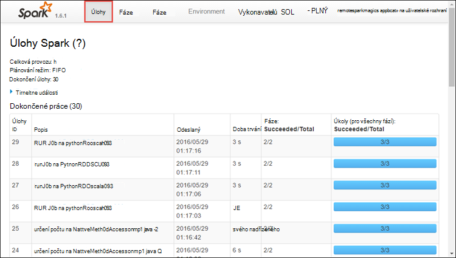

<properties 
    pageTitle="Sledování a ladění úlohami na Apache Spark cluster v HDInsight | Microsoft Azure" 
    description="Sledování a ladění úlohy výpočetnímu clusteru Spark v Azure Hdinsightu pomocí vláken uživatelského rozhraní, Spark uživatelského rozhraní a historie Spark server" 
    services="hdinsight" 
    documentationCenter="" 
    authors="nitinme" 
    manager="jhubbard" 
    editor="cgronlun"
    tags="azure-portal"/>

<tags 
    ms.service="hdinsight" 
    ms.workload="big-data" 
    ms.tgt_pltfrm="na" 
    ms.devlang="na" 
    ms.topic="article" 
    ms.date="08/25/2016" 
    ms.author="nitinme"/>

# Sledování a ladění úlohy výpočetnímu clusteru Apache Spark v HDInsight Linux

V tomto článku budou informace o sledování a ladění Spark úlohy pomocí rozhraní vláken, Spark uživatelského rozhraní a Server historie Spark. V tomto článku se začneme Spark úlohy pomocí dostupných Poznámkový blok s clusteru Spark **počítače výukové: prediktivní analýzy dat kontroly jídla pomocí MLLib**. Můžete použít pokynů a sledovat aplikace, která jste odeslali pomocí libovolné další přístup taky, například **spark odeslat**.

##Zjistit předpoklady pro

Je nutné mít takto:

- Předplatné Azure. Viz [získání Azure bezplatnou zkušební verzi](https://azure.microsoft.com/documentation/videos/get-azure-free-trial-for-testing-hadoop-in-hdinsight/).
- Apache Spark obrázku na HDInsight Linux. Pokyny najdete v tématu [Vytvoření Spark Apache clusterů Azure HDInsight](hdinsight-apache-spark-jupyter-spark-sql.md).
- Měli jste zahájili, můžete systém poznámkovém bloku, **[počítače výukové: prediktivní analýzy dat kontroly jídla pomocí MLLib](hdinsight-apache-spark-machine-learning-mllib-ipython.md)**. Pokyny k tomu tento poznámkový blok klepněte na odkaz.  

## Sledování aplikací v uživatelském rozhraní vláken

1. Spusťte vláken uživatelského rozhraní. Z zásuvné obrázku klikněte na **Řídicí panel obrázku**a klepněte **vláken**.

    

    >[AZURE.TIP] Můžete taky můžete taky spustit uživatelské rozhraní vláken v uživatelském rozhraní Ambari. Spuštění v uživatelském rozhraní Ambari z zásuvné obrázku, klikněte na **Řídicí panel obrázku**a klikněte na **Řídicí panel clusteru HDInsight**. V uživatelském rozhraní Ambari klikněte **vláken**, klikněte na **Odkazy**, klikněte na správce aktivní prostředků a potom klikněte na **Uživatelské rozhraní ResourceManager**.  

3. Protože začít Spark úlohy pomocí Jupyter poznámkové bloky aplikace má název **remotesparkmagics** (to je název pro všechny aplikace, které se spouští ze poznámkových bloků). Klikněte na ID aplikace proti název aplikace chcete získat víc informací o projektu. Spustí se aplikace zobrazení.

    

    Aplikace, které jsou vyvolaná Jupyter poznámkových bloků stav je vždy **SPUŠTĚNÝ** dokud ukončete Poznámkový blok.

4. V zobrazení aplikace můžete procházet dolů na zjistíte, kontejnerů přidružené aplikace a protokoly (stdout/stderr). Uživatelské rozhraní Spark můžete spustit taky kliknutím propojení odpovídající **Sledování adresy URL**, jak je ukázáno v následujícím příkladu. 

    

## Sledování aplikací v uživatelském rozhraní Spark

V uživatelském rozhraní Spark se můžete přecházet na podrobnější Spark úloh, které jsou vytvořený v aplikaci, kterou máte rozepsanou.

1. Spustit v uživatelském rozhraní Spark ze zobrazení aplikace klikněte na odkaz proti **Sledování adresy URL**, jak je znázorněno snímek obrazovky nad. Zobrazí se všechny spuštěné aplikace spuštěné v poznámkovém bloku Jupyter úlohy Spark.

    

2. Klikněte na kartu **vykonavatelů** zobrazíte informace o jednotlivých vykonavatel zpracování a úložiště. Můžete taky načtete zásobníku volání kliknutím na odkaz **Podprocesu výpis** .

    
 
3. Klikněte na kartu **fází** zobrazíte fází přidružené k aplikaci.

    

    Každé fáze může obsahovat více úkolů, u kterých je možné zobrazit spuštění statistiky, třeba následujícího obrázku.

     

4. Na stránce Podrobnosti o fázi můžete spustit DAG vizualizace. Rozbalení odkazu **DAG vizualizace** v horní části stránky, jak je ukázáno v následujícím příkladu.

    

    DAG nebo přímé Aclyic grafu představuje různých fází v aplikaci. Každý modrého rámečku v grafu představuje Spark operace vyvolané z aplikace.

5. Na stránce Podrobnosti o fázi můžete taky spustit zobrazení časové osy aplikace. Rozbalení odkazu **Časová osa událostí** v horní části stránky, jak je ukázáno v následujícím příkladu.

    

    Zobrazí se Spark události ve formě časové osy. Zobrazení časové osy je k dispozici ve třech úrovních mezi projekty, v rámci projektu a v rámci dílčí fáze. Obrázek nad textem zaznamenává zobrazení časové osy dané fáze.

    >[AZURE.TIP] Pokud zaškrtnete políčko **Povolit tvořené** , se budou posunovat vlevo a vpravo přes zobrazení časové osy.

6. Další karty v uživatelském rozhraní Spark poskytují užitečné informace o dané Spark instance.

    * Karta úložiště – Pokud aplikace vytvoří RDDs, najdete informace o můžou být na kartě úložiště.
    * Prostředí karta – Tato karta nabízí spoustu užitečné informace o Spark instance, jako 
        * Scala verze
        * Protokol událostí adresáře přidruženého clusteru
        * Počet vykonavatel vzorky pro aplikace
        * Atd.

## Informace o dokončení úlohy pomocí serveru Spark historie

Po dokončení projektu informace o projektu zachovat na serveru Spark historie.

1. Spuštění Spark historie serveru, zásuvné obrázku, klikněte na **Řídicí panel obrázku**a klepněte na tlačítko **Spark historie serveru**.

    

    >[AZURE.TIP] Můžete taky můžete taky spustit rozhraní Spark historie serveru v uživatelském rozhraní Ambari. Spuštění v uživatelském rozhraní Ambari z zásuvné obrázku, klikněte na **Řídicí panel obrázku**a klikněte na **Řídicí panel clusteru HDInsight**. V uživatelském rozhraní Ambari klikněte **Spark**, klikněte na **Odkazy**a klikněte na **Uživatelské rozhraní Spark historie serveru**.

2. Zobrazí se všechny dokončené aplikace uvedené. Klikněte na kód aplikace přecházet na podrobnější žádost o další informace.

    
    

## Viz taky

* [Přehled: Apache Spark na Azure HDInsight](hdinsight-apache-spark-overview.md)

### Scénáře

* [Spark s BI: Analýza interaktivní dat pomocí Spark v HDInsight nástrojích BI](hdinsight-apache-spark-use-bi-tools.md)

* [Spark s výukové počítače: použití Spark v HDInsight pro analýzu stavební teploty pomocí TVK dat](hdinsight-apache-spark-ipython-notebook-machine-learning.md)

* [Spark s výukové počítače: použití Spark v HDInsight odhadnout výsledků kontroly jídla](hdinsight-apache-spark-machine-learning-mllib-ipython.md)

* [Datových proudů Spark: Použití Spark v HDInsight vytvářet v reálném čase streamování aplikace](hdinsight-apache-spark-eventhub-streaming.md)

* [Analýza protokolu webu pomocí Spark HDInsight](hdinsight-apache-spark-custom-library-website-log-analysis.md)

### Vytvoření a spuštění aplikací

* [Vytvoření samostatného aplikace pomocí Scala](hdinsight-apache-spark-create-standalone-application.md)

* [Spuštění úlohy vzdáleně Spark clusteru pomocí Livius](hdinsight-apache-spark-livy-rest-interface.md)

### Nástroje a rozšíření

* [Modul plug-in nástroje HDInsight IntelliJ představu umožňuje vytvořit a odeslat Spark Scala aplikace](hdinsight-apache-spark-intellij-tool-plugin.md)

* [Modul plug-in pro použití HDInsight nástroje pro IntelliJ NÁPAD vzdáleně ladění Spark aplikací](hdinsight-apache-spark-intellij-tool-plugin-debug-jobs-remotely.md)

* [Pomocí obrázku Spark na HDInsight Zeppelin poznámkových bloků](hdinsight-apache-spark-use-zeppelin-notebook.md)

* [Oříšky umožňující Jupyter poznámkového bloku na Spark obrázku pro HDInsight](hdinsight-apache-spark-jupyter-notebook-kernels.md)

* [Použití externích balíčků pomocí Jupyter poznámkových bloků](hdinsight-apache-spark-jupyter-notebook-use-external-packages.md)

* [Instalace Jupyter ve vašem počítači a připojte k HDInsight Spark obrázku](hdinsight-apache-spark-jupyter-notebook-install-locally.md)

### Přidávání a používání zdrojů

* [Přidávání a používání zdrojů pro Apache Spark cluster v Azure HDInsight](hdinsight-apache-spark-resource-manager.md)
