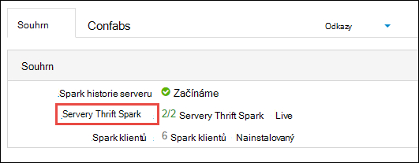

<properties 
    pageTitle="Použití Správce prostředků přidělení zdrojů clusteru Apache Spark v HDInsight | Microsoft Azure" 
    description="Informace o použití Správce prostředků pro Spark clusterů na HDInsight pro lepší výkon." 
    services="hdinsight" 
    documentationCenter="" 
    authors="nitinme" 
    manager="jhubbard" 
    editor="cgronlun"
    tags="azure-portal"/>

<tags 
    ms.service="hdinsight" 
    ms.workload="big-data" 
    ms.tgt_pltfrm="na" 
    ms.devlang="na" 
    ms.topic="article" 
    ms.date="08/25/2016" 
    ms.author="nitinme"/>

# Přidávání a používání zdrojů pro Apache Spark obrázku na HDInsight Linux

V tomto článku se dozvíte, jak pro přístup k rozhraní jako Ambari uživatelské rozhraní aplikace vláken uživatelského rozhraní a serveru historie Spark přidružené Spark obrázku. Naučíte se taky o tom, jak optimalizovat konfiguraci clusteru pro optimální výkon.

**Požadavky:**

Je nutné mít takto:

- Předplatné Azure. Viz [získání Azure bezplatnou zkušební verzi](https://azure.microsoft.com/documentation/videos/get-azure-free-trial-for-testing-hadoop-in-hdinsight/).
- Apache Spark obrázku na HDInsight Linux. Pokyny najdete v tématu [Vytvoření Spark Apache clusterů Azure HDInsight](hdinsight-apache-spark-jupyter-spark-sql.md).

## Jak spustit uživatelské rozhraní webu Ambari?

1. Z [Portálu Azure](https://portal.azure.com/)z startboard klikněte na dlaždici pro svůj cluster Spark (Pokud připnuté na startboard). Můžete taky přejít na svůj cluster v části **Procházet vše** > **Clusterů HDInsight**. 
 
2. Z zásuvné Spark obrázku klikněte na **řídicí panel**. Po zobrazení výzvy zadejte přihlašovací údaje správce Spark obrázku.

    ![Spuštění Ambari] (./media/hdinsight-apache-spark-resource-manager/hdispark.cluster.launch.dashboard.png "Spusťte Správce zdrojů")

3. By se zobrazit v uživatelském rozhraní Web Ambari, jak je ukázáno v následujícím příkladu.

    ![Web Ambari uživatelského rozhraní] (./media/hdinsight-apache-spark-resource-manager/ambari-web-ui.png "Web Ambari uživatelského rozhraní")   

## Jak spustit Spark historie serveru?

1. Z [Portálu Azure](https://portal.azure.com/)z startboard klikněte na dlaždici pro svůj cluster Spark (Pokud připnuté na startboard).

2. Zásuvné obrázku v části **Odkazy**, klikněte na **Řídicí panel obrázku**. V zásuvné **Řídicího panelu obrázku** klikněte na **Spark historie serveru**.

    ![Spark historie serveru] (./media/hdinsight-apache-spark-resource-manager/launch-history-server.png "Spark historie serveru")

    Po zobrazení výzvy zadejte přihlašovací údaje správce Spark obrázku.

## Jak spustit uživatelské rozhraní vláken?

Uživatelské rozhraní vláken slouží ke sledování aplikací, které jsou aktuálně spuštěných pro Spark obrázku. 

1. Z zásuvné obrázku klikněte na **Řídicí panel obrázku**a klepněte **vláken**.

    

    >[AZURE.TIP] Můžete taky taky samostatné předplatné uživatelského rozhraní vláken z Ambari uživatelského rozhraní: Spuštění v uživatelském rozhraní Ambari z zásuvné obrázku, klikněte na **Řídicí panel obrázku**a klikněte na **Řídicí panel clusteru HDInsight**. V uživatelském rozhraní Ambari klikněte **vláken**, klikněte na **Odkazy**, klikněte na správce aktivní prostředků a potom klikněte na **Uživatelské rozhraní ResourceManager**.

## Co je konfigurace optimální clusteru spustit Spark aplikace?

Jsou tři klíčové parametry, které lze použít při konfiguraci Spark podle toho, požadavky aplikace `spark.executor.instances`, `spark.executor.cores`, a `spark.executor.memory`. Vykonavatele je proces spuštění aplikace Spark. Běží na uzel pracovní a odpovídá plnit úkoly pro aplikaci. Výchozí počet vykonavatelů a velikosti vykonavatel pro každý cluster počítá podle počtu uzlů pracovní a velikost uzel pracovního. Toto jsou uloženy v `spark-defaults.conf` na hlavní uzlů. 

Parametry tři konfigurace možné konfigurovat na úrovni obrázku (pro všechny aplikace spuštěné v operačním systému clusteru) nebo může být zadán pro každou jednotlivé aplikaci.

### Změna parametrů pomocí Ambari uživatelského rozhraní

1. V uživatelském rozhraní Ambari na **Spark**klikněte **Configs**a potom rozbalte položku **spark výchozích možností vlastní**.

    

2. Výchozí hodnoty je dobré mít 4 Spark aplikací v clusteru současně spustit. Je možné změny tyto hodnoty z uživatelského rozhraní, jak je ukázáno v následujícím příkladu.

    

3. Klepněte na tlačítko **Uložit** uložte změny konfigurace. V horní části stránky se výzva k restartování všechny ovlivněné služby. Klikněte na **Restartovat**.

    

### Změna parametrů pro aplikace spuštěné v poznámkovém bloku Jupyter

Aplikace spuštěné v poznámkovém bloku Jupyter, můžete použít `%%configure` magické provádět změny konfigurace. V ideálním případě musí uděláte tyto změny na začátku aplikací, aby se vám nestalo první buňku kód. Zajistíte tím, že konfigurace se použije k relaci Livius, kdy se vytvářejí. Pokud chcete změnit konfiguraci později v aplikaci, musíte použít `-f` parametr. Však podle přitom všechny průběhu v aplikaci budou ztraceny.

Fragment dole ukazuje, jak změnit konfiguraci aplikace spuštěné v Jupyter.

    %%configure 
    {"executorMemory": "3072M", "executorCores": 4, “numExecutors”:10}

Konfigurace parametry musí být předaný jako řetězec formátu JSON a musí být na dalším řádku po magické, jak je uvedeno v příkladu sloupců. 

### Změna, kterou odešlete spark parametry zaslat pomocí aplikace

Následující příkaz je příklad toho, jak změnit parametry konfigurace aplikace dávku odeslání pomocí `spark-submit`.

    spark-submit --class <the application class to execute> --executor-memory 3072M --executor-cores 4 –-num-executors 10 <location of application jar file> <application parameters>

### Změna parametrů aplikace zaslat pomocí otočení

Následující příkaz je příklad toho, jak změnit parametry konfigurace aplikace dávku odeslání pomocí otočení.

    curl -k -v -H 'Content-Type: application/json' -X POST -d '{"file":"<location of application jar file>", "className":"<the application class to execute>", "args":[<application parameters>], "numExecutors":10, "executorMemory":"2G", "executorCores":5' localhost:8998/batches

### Jak můžu změnit tyto parametry na serveru Thrift Spark?

Spark Thrift Server k dispozici JDBC/ODBC Spark obrázku a slouží k dotazy týkající se služeb Spark SQL. Nástroje, jako je Power BI, Tableau atd. umožňuje komunikaci se serverem Thrift Spark provést dotazy Spark SQL jako aplikace Spark protokol ODBC. Po vytvoření clusteru Spark jsou spuštěna dvě instance serveru Thrift Spark, jednu v jednotlivých uzlech hlavy. Každý Spark Thrift Server se zobrazuje jako Spark aplikace v uživatelském rozhraní vláken. 

Spark Thrift Server používá Spark dynamické vykonavatel přidělení a tím i `spark.executor.instances` nepoužívá. Místo toho Spark Thrift Server používá `spark.dynamicAllocation.minExecutors` a `spark.dynamicAllocation.maxExecutors` k určení počtu vykonavatele. Parametry konfigurace `spark.executor.cores` a `spark.executor.memory` slouží k úpravám vykonavatel velikost. Tyto parametry můžete změnit, jak je ukázáno v následujícím příkladu.

* Rozbalení na kategorii **Upřesnit spark-thrift-sparkconf** aktualizovat parametry `spark.dynamicAllocation.minExecutors`, `spark.dynamicAllocation.maxExecutors`, a `spark.executor.memory`.

     

* Rozbalení kategorii **vlastní spark-thrift-sparkconf** aktualizovat parametr `spark.executor.cores`.

    

### Změna paměti ovladač Spark Thrift serveru

Paměť ovladač Spark Thrift serveru nakonfigurované tak, aby 25 % velikosti hlavního uzlu RAM, je za předpokladu, že je větší než 14 GB celkovou velikost RAM hlavy uzel Můžete uživatelského rozhraní Ambari změnit konfigurace paměti ovladač, jak je ukázáno v následujícím příkladu.

* V uživatelském rozhraní Ambari klikněte na **Spark**klepněte **Configs**, rozbalte položku **Upřesnit spark Obálka**a potom zadejte hodnotu pro **spark_thrift_cmd_opts**.

    

## Můžu nepoužívejte BI s Spark obrázku. Jak mám zpátky zvolit zdroje?

Protože používáme dynamického přidělení Spark, pouze prostředky, které jsou spotřebované množství serverem thrift jsou v tématech předloh aplikací. Uvolnit tyto materiály stop Thrift serveru služby v clusteru.

1. V uživatelském rozhraní Ambari v levém podokně klikněte na **Spark**.

2. Na další stránce klikněte na položku **Spark Thrift servery**.

    

3. Měli byste vidět dva headnodes, na kterých běží Spark Thrift Server. Klikněte na jednu headnodes.

    

4. Další stránka obsahuje seznam všech služeb spuštěných pro tuto headnode. V seznamu klikněte na rozevírací tlačítko vedle Spark Thrift serveru a pak klikněte na **Zastavit**.

    

5. Opakujte tento postup na jiných headnode stejně.

## Moje poznámkové bloky Jupyter se nepoužívá podle očekávání. Jak lze restartovat službu?

1. Spusťte uživatelské rozhraní webu Ambari uvedené výše. V levém navigačním podokně klikněte **Jupyter**, klikněte na tlačítko **Akce služby**a pak klikněte na **Restartovat vše**. Tím se spustí služba Jupyter na všechny headnodes.

    ![Restartujte Jupyter] (./media/hdinsight-apache-spark-resource-manager/restart-jupyter.png "Restartujte Jupyter")

    

## Viz taky

* [Přehled: Apache Spark na Azure HDInsight](hdinsight-apache-spark-overview.md)

### Scénáře

* [Spark s BI: Analýza interaktivní dat pomocí Spark v HDInsight nástrojích BI](hdinsight-apache-spark-use-bi-tools.md)

* [Spark s výukové počítače: použití Spark v HDInsight pro analýzu stavební teplotu pomocí TVK dat](hdinsight-apache-spark-ipython-notebook-machine-learning.md)

* [Spark s výukové počítače: použití Spark v HDInsight odhadnout výsledků kontroly jídla](hdinsight-apache-spark-machine-learning-mllib-ipython.md)

* [Datových proudů Spark: Použití Spark v HDInsight vytvářet v reálném čase streamování aplikace](hdinsight-apache-spark-eventhub-streaming.md)

* [Analýza protokolu webu pomocí Spark HDInsight](hdinsight-apache-spark-custom-library-website-log-analysis.md)

### Vytvoření a spuštění aplikací

* [Vytvoření samostatného aplikace pomocí Scala](hdinsight-apache-spark-create-standalone-application.md)

* [Spuštění úlohy vzdáleně Spark clusteru pomocí Livius](hdinsight-apache-spark-livy-rest-interface.md)

### Nástroje a rozšíření

* [Modul plug-in nástroje HDInsight IntelliJ představu umožňuje vytvořit a odeslat Spark Scala aplikace](hdinsight-apache-spark-intellij-tool-plugin.md)

* [Modul plug-in pro použití HDInsight nástroje pro IntelliJ NÁPAD vzdáleně ladění Spark aplikací](hdinsight-apache-spark-intellij-tool-plugin-debug-jobs-remotely.md)

* [Pomocí obrázku Spark na HDInsight Zeppelin poznámkových bloků](hdinsight-apache-spark-use-zeppelin-notebook.md)

* [Oříšky umožňující Jupyter poznámkového bloku na Spark obrázku pro HDInsight](hdinsight-apache-spark-jupyter-notebook-kernels.md)

* [Použití externích balíčků s poznámkovými bloky Jupyter](hdinsight-apache-spark-jupyter-notebook-use-external-packages.md)

* [Instalace Jupyter ve vašem počítači a připojte k HDInsight Spark obrázku](hdinsight-apache-spark-jupyter-notebook-install-locally.md)

### Přidávání a používání zdrojů

* [Sledování a ladění úlohy výpočetnímu clusteru Apache Spark v HDInsight](hdinsight-apache-spark-job-debugging.md)

[hdinsight-versions]: hdinsight-component-versioning.md
[hdinsight-upload-data]: hdinsight-upload-data.md
[hdinsight-storage]: hdinsight-hadoop-use-blob-storage.md

[azure-purchase-options]: http://azure.microsoft.com/pricing/purchase-options/
[azure-member-offers]: http://azure.microsoft.com/pricing/member-offers/
[azure-free-trial]: http://azure.microsoft.com/pricing/free-trial/
[azure-management-portal]: https://manage.windowsazure.com/
[azure-create-storageaccount]: storage-create-storage-account.md 
