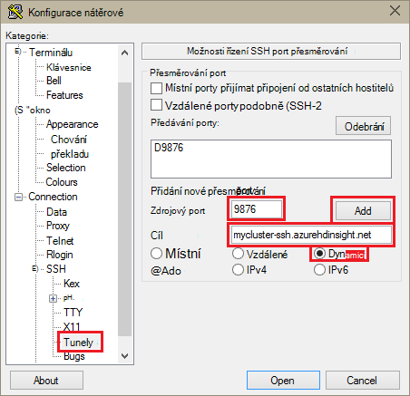
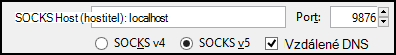
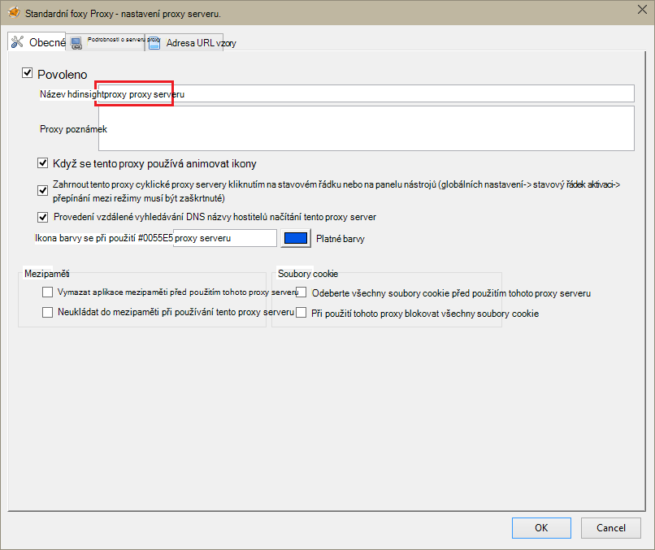
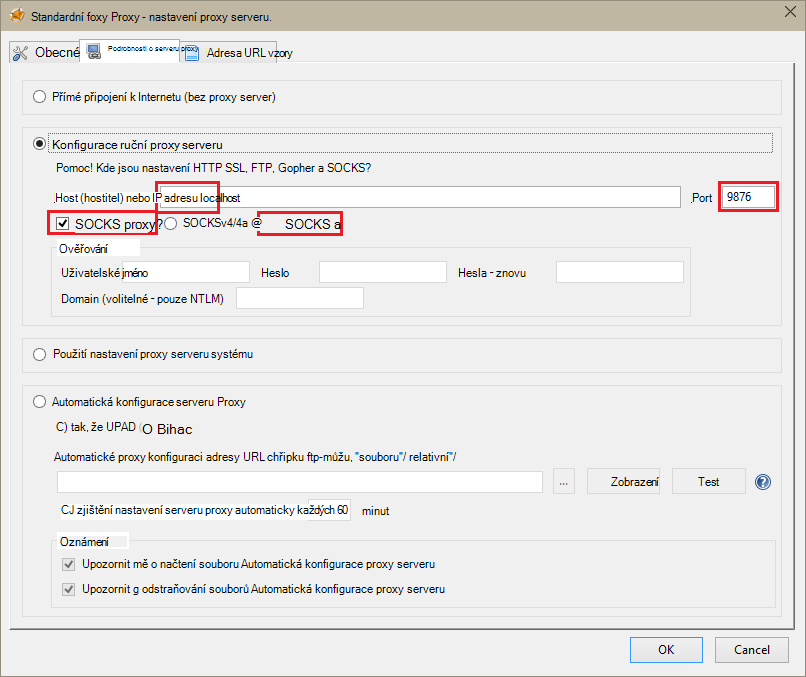
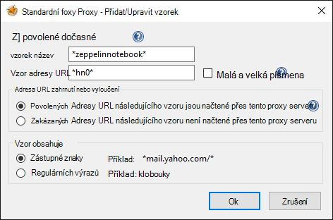
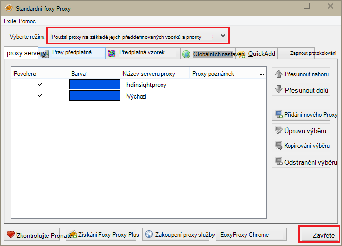

<properties 
    pageTitle="Instalace Zeppelin poznámkové bloky pro Apache Spark obrázku na HDInsight Linux | Microsoft Azure" 
    description="Podrobný návod, jak nainstalovat a používat Zeppelin poznámkové bloky pomocí Spark clusterů v HDInsight Linux." 
    services="hdinsight" 
    documentationCenter="" 
    authors="nitinme" 
    manager="jhubbard" 
    editor="cgronlun"/>

<tags 
    ms.service="hdinsight" 
    ms.workload="big-data" 
    ms.tgt_pltfrm="na" 
    ms.devlang="na" 
    ms.topic="article" 
    ms.date="10/28/2016" 
    ms.author="nitinme"/>

# Nainstalovat HDInsight Linux Zeppelin poznámkové bloky pro Apache Spark obrázku

Zjistěte, jak nainstalovat Zeppelin poznámkových bloků na Apache Spark clusterů a jak používat poznámkové bloky Zeppelin spustit Spark úlohy.

> [AZURE.IMPORTANT] Poznámkové bloky Zeppelin jsou teď dostupné ve výchozím nastavení se Spark clusterů. Nemusíte explicitně nainstalujte je clusteru Spark už. Další informace najdete [Zeppelin použití poznámkových bloků pomocí Apache Spark clusteru na HDInsight Linux](hdinsight-apache-spark-zeppelin-notebook.md). 

**Požadavky:**

* Před zahájením tohoto kurzu, musíte mít předplatné Azure. Viz [získání Azure bezplatnou zkušební verzi](https://azure.microsoft.com/documentation/videos/get-azure-free-trial-for-testing-hadoop-in-hdinsight/).
* Apache Spark obrázku. Pokyny najdete v tématu [Vytvoření Spark Apache clusterů Azure HDInsight](hdinsight-apache-spark-jupyter-spark-sql.md).
* SSH klienta. Distribuce Linux a Unix nebo Macintosh OS X `ssh` příkaz je součástí operačního systému. Pro systém Windows doporučujeme [nátěrové](http://www.chiark.greenend.org.uk/~sgtatham/putty/download.html)

    > [AZURE.NOTE] Pokud budete chtít používat klienta SSH jiné než `ssh` nebo nátěrové, najdete v dokumentaci k svému klientovi na tom, jak vytvořit SSH tunelem.

* Webový prohlížeč, který může být nakonfigurované pro použití proxy serveru SOCKS

* __(volitelné)__: modul plug-in například [FoxyProxy](http://getfoxyproxy.org/,) , které můžete použít pravidla, která pouze směrování specifických požadavků tunelem.

    > [AZURE.WARNING] Bez modulu plug-in například FoxyProxy může být všechny žádosti pomocí prohlížeče směrovány tunelem. Může být výsledkem pomaleji načítání webové stránky v prohlížeči.

## Instalace Zeppelin clusteru Spark

Nainstalujte Zeppelin Spark clusteru pomocí skriptu akce. Akci skriptu používá k instalaci součásti clusteru, které nejsou k dispozici ve výchozím nastavení vlastních skriptů. Vlastní skript můžete nainstalovat Zeppelin z portálu Azure pomocí HDInsight .NET SDK nebo pomocí prostředí PowerShell Azure. Skript můžete použít buď v rámci vytváření clusteru nebo po clusteru je do začátků nainstalovat Zeppelin. Odkazy v následujících částech obsahují pokyny o tom, jak to udělat. 

### Pomocí portálu Azure

Pokyny o tom, jak používat portál Azure Pokud chcete spustit akci skript nainstalovat Zeppelin najdete v tématu [přizpůsobení HDInsight clusterů pomocí skriptu akce](hdinsight-hadoop-customize-cluster-linux.md#use-a-script-action-from-the-azure-portal). Pokyny v tomto článku je nutné provést několik změn.

* Pomocí skriptu musíte nainstalovat Zeppelin. Vlastní skript nainstalovat Zeppelin clusteru Spark na HDInsight má k dispozici následující odkazy:
    * U Spark 1.6.0 clusterů-`https://hdiconfigactions.blob.core.windows.net/linuxincubatorzeppelinv01/install-zeppelin-spark160-v01.sh`
    * U Spark 1.5.2 clusterů-`https://hdiconfigactions.blob.core.windows.net/linuxincubatorzeppelinv01/install-zeppelin-spark151-v01.sh`

* Je třeba spustit akci skript jenom na headnode.

* Skript nemusí všechny parametry. 

### Použití HDInsight .NET SDK

Pokyny o používání HDInsight .NET SDK Pokud chcete spustit akci skript nainstalovat Zeppelin najdete v tématu [přizpůsobení HDInsight clusterů pomocí skriptu akce](hdinsight-hadoop-customize-cluster-linux.md#use-a-script-action-from-the-hdinsight-net-sdk). Pokyny v tomto článku je nutné provést několik změn.

* Pomocí skriptu musíte nainstalovat Zeppelin. Vlastní skript nainstalovat Zeppelin clusteru Spark na HDInsight má k dispozici následující odkazy:
    * U Spark 1.6.0 clusterů-`https://hdiconfigactions.blob.core.windows.net/linuxincubatorzeppelinv01/install-zeppelin-spark160-v01.sh`
    * U Spark 1.5.2 clusterů-`https://hdiconfigactions.blob.core.windows.net/linuxincubatorzeppelinv01/install-zeppelin-spark151-v01.sh`

* Skript nemusí všechny parametry. 

* Nastavte typ obrázku, který vytváříte Spark.

### Pomocí prostředí PowerShell Azure

Pomocí následující úryvek prostředí PowerShell můžete vytvářet Spark obrázku na HDInsight Linux s Zeppelin nainstalovaný. Podle toho, jakou verzi systému Spark clusteru máte musíte aktualizovat dole zahrnout odkaz na odpovídající vlastní skript Powershellu fragment. 

* U Spark 1.6.0 clusterů-`https://hdiconfigactions.blob.core.windows.net/linuxincubatorzeppelinv01/install-zeppelin-spark160-v01.sh`
* U Spark 1.5.2 clusterů-`https://hdiconfigactions.blob.core.windows.net/linuxincubatorzeppelinv01/install-zeppelin-spark151-v01.sh`

[AZURE.INCLUDE [upgrade-powershell](../../includes/hdinsight-use-latest-powershell.md)]

    Login-AzureRMAccount
    
    # PROVIDE VALUES FOR THE VARIABLES
    $clusterAdminUsername="admin"
    $clusterAdminPassword="<<password>>"
    $clusterSshUsername="adminssh"
    $clusterSshPassword="<<password>>"
    $clusterName="<<clustername>>"
    $clusterContainerName=$clusterName
    $resourceGroupName="<<resourceGroupName>>"
    $location="<<region>>"
    $storage1Name="<<storagename>>"
    $storage1Key="<<storagekey>>"
    $subscriptionId="<<subscriptionId>>"
    
    Select-AzureRmSubscription -SubscriptionId $subscriptionId
    
    $passwordAsSecureString=ConvertTo-SecureString $clusterAdminPassword -AsPlainText -Force
    $clusterCredential=New-Object System.Management.Automation.PSCredential ($clusterAdminUsername, $passwordAsSecureString)
    $passwordAsSecureString=ConvertTo-SecureString $clusterSshPassword -AsPlainText -Force
    $clusterSshCredential=New-Object System.Management.Automation.PSCredential ($clusterSshUsername, $passwordAsSecureString)
    
    $azureHDInsightConfigs= New-AzureRmHDInsightClusterConfig -ClusterType Spark
    $azureHDInsightConfigs.DefaultStorageAccountKey = $storage1Key
    $azureHDInsightConfigs.DefaultStorageAccountName = "$storage1Name.blob.core.windows.net"
    
    Add-AzureRMHDInsightScriptAction -Config $azureHDInsightConfigs -Name "Install Zeppelin" -NodeType HeadNode -Parameters "void" -Uri "https://hdiconfigactions.blob.core.windows.net/linuxincubatorzeppelinv01/install-zeppelin-spark151-v01.sh"
    
    New-AzureRMHDInsightCluster -Config $azureHDInsightConfigs -OSType Linux -HeadNodeSize "Standard_D12" -WorkerNodeSize "Standard_D12" -ClusterSizeInNodes 2 -Location $location -ResourceGroupName $resourceGroupName -ClusterName $clusterName -HttpCredential $clusterCredential -DefaultStorageContainer $clusterContainerName -SshCredential $clusterSshCredential -Version "3.3"
 
## Nastavení SSH tunneling k poznámkovému bloku Zeppelin

SSH tunelů bude používat pro přístup k poznámkovým blokům Zeppelin výpočetnímu clusteru Spark na HDInsight Linux. Postupem ukazují, jak vytvořit SSH tunelem pomocí ssh příkazového řádku (Linux) a nátěrové (Windows).

### Vytvoření tunelem pomocí příkazu SSH (Linux)

Pomocí následujícího příkazu Vytvořit SSH tunelu pomocí `ssh` příkaz. Nahraďte uživatel SSH pro svůj cluster HDInsight __uživatelské jméno__ a __NÁZEV_CLUSTERU__ nahraďte názvem HDInsight obrázku

    ssh -C2qTnNf -D 9876 USERNAME@CLUSTERNAME-ssh.azurehdinsight.net

Tím vytvoříte připojení, který přesměrovává přenosy na místní port 9876 clusteru přes SSH. Tyto možnosti jsou:

* **D 9876** - místního portu, které budou směrovat přenosy v síti tunelem.

* **C** - komprimovat všechna data, protože webový přenos je většinou text.

* **2** – vyšší SSH zkusit protokol pouze verze 2.

* **otázky** – bezobslužný režim.

* **T** - rozdělení pseudo tty zakázat, protože jsme jenom přeposíláte port.

* **n** - zabránit čtení standardního, protože jsme jenom přeposíláte portu.

* **N** – spuštění vzdáleného příkazu, protože jsme jenom přeposíláte portu.

* **f** - běží na pozadí.

Pokud jste nakonfigurovali clusteru klíčem SSH, může být nutné použít `-i` parametr a zadejte cestu k privátním klíčem SSH.

Po dokončení příkaz přenosů na port 9876 v místním počítači bude směrovaná přes Sockets Layer SSL (Secure) do clusteru sídlo uzel a zdá se, že pocházejí.

### Vytvoření tunelem pomocí nátěrové (Windows)

Pomocí následujících kroků k vytvoření SSH tunelem pomocí nátěrové.

1. Otevřete nátěrové a zadejte informace o připojení. Pokud znáte není nátěrové, přečtěte si článek [Použití SSH s Hadoop Linux založené na HDInsight z Windows](hdinsight-hadoop-linux-use-ssh-windows.md) informace o tom, jak ho použít s HDInsight.

2. V části **kategorie** nalevo od dialogového okna rozbalte **připojení**, rozbalte **SSH**a vyberte **tunelů**.

3. Ve formuláři **Možnosti řízení SSH port předávání** zadejte následující informace:

    * **Zdrojový port** - port na straně klienta, který chcete předat dál. Například **9876**.

    * **Určení** – SSH adresu na základě Linux HDInsight clusteru. Například **ssh.azurehdinsight.net clusteru**.

    * **Dynamické** – umožňuje dynamické proxy serveru SOCKS směrování.

    

4. Kliknutím na **Přidat** přidejte nastavení a potom klikněte na **Otevřít** otevřete SSH připojení.

5. Po zobrazení výzvy, přihlaste se k serveru. Tím vytvořit relaci SSH a povolit tunelem.

### Použití tunelem z prohlížeče

> [AZURE.NOTE] Postup v této části pomocí prohlížeče FireFox, jako je zdarma systémy Linux, Unix, Macintosh OS X a Windows. Jiné moderní prohlížeče například Google Chrome, Microsoft Edge nebo Apple Safari by měly fungovat i; modul plug-in FoxyProxy v některých krocích použili však nemusí být k dispozici pro všechny prohlížeče.

1. Prohlížeč nakonfigurujte pro použití **localhost:9876** jako **verze 5 SOCKS** proxy. Tady je nastavení Firefox vypadat takto. Pokud jste použili jiný port než 9876, změňte číslo portu tu, kterou jste použili:

    

    > [AZURE.NOTE] Výběr **Vzdálené DNS** vyřeší požadavky na systém DNS (Domain Name) pomocí clusteru HDInsight. Pokud to není vybrána, bude DNS místně přeložit.

2. Ověřte, že přenosy směrovány tunelem tak, že vising na webu, jako [http://www.whatismyip.com/](http://www.whatismyip.com/) s nastavením proxy serveru povolit nebo zakázat v prohlížeči Firefox. Při nastavení jsou povoleny, IP adresu budou pro počítač v Microsoft Azure datacentra.

### Rozšíření prohlížeče

Při konfiguraci prohlížeče můžete tunelem pracuje, nechcete obvykle směrovat všechny přenosy myší tunelem. Rozšíření prohlížeče například [FoxyProxy](http://getfoxyproxy.org/) podporují porovnávání pro požadavky na adresu URL (standardní FoxyProxy nebo Plus pouze) tak, aby odesílaná jenom žádosti o konkrétní adresy URL tunelem.

Nainstalovaného FoxyProxy směrodatná nakonfigurovat tak, aby jenom přenosu pro HDInsight myší tunelem pomocí následujících kroků.

1. Otevřete FoxyProxy rozšíření v prohlížeči. Ve Firefoxu, vyberte ikonu FoxyProxy vedle pole Adresa.

    

2. Vyberte **Přidat nový Proxy**, vyberte kartu **Obecné** a potom zadejte název serveru proxy **HDInsightProxy**.

    

3. Vyberte kartu **Podrobnosti o serveru Proxy** a vyplňte následující pole:

    * **Host (hostitel) nebo IP adresa** – to je localhost, protože používáme SSH tunelem v místním počítači.

    * **Port** – jedná se o port jste použili pro tunelem SSH.

    * **SOCKS proxy** - výběrem této možnosti povolení prohlížeče můžete tunelem jako proxy server.

    * **SOCKS verze 5** – výběrem této možnosti nastavte požadovanou verzi pro proxy server.

    

4. Vyberte kartu **Vzorů adresy URL** a pak vyberte **Přidat nový vzorek**. Pomocí následujících můžete definovat vzorec a potom klikněte na **OK**:

    * **Vzorek název** - **zeppelinnotebook** – to je právě popisný název vzorku.

    * **Adresa URL vzorek** - **\*hn0** * – Tato možnost definuje vzorek, která odpovídá vnitřní plně kvalifikovaný název domény koncového bodu, kde jsou hostovány Zeppelin poznámkové bloky. Protože jsou k dispozici pouze v headnode0 clusteru Zeppelin poznámkových bloků a koncový bod je obvykle `http://hn0-<string>.internal.cloudapp.net`, pomocí vzorku * *hn0** zajistí, že je požadavek přesměrován Zeppelin koncový bod.

        

4. Klikněte na **OK** přidáte proxy server a zavřete okno **Nastavení proxy serveru**.

5. V horní části dialogu FoxyProxy změňte **Vyberte režim** na **použití proxy servery na základě jejich předdefinovaných vzorků a priority**a potom na tlačítko **Zavřít**.

    

Za tímto postupem budou jenom žádosti o adresy URL, které obsahují řetězce __hn0__ směrovány přes tunelem SSL. 

## Přístup k Zeppelin poznámkového bloku

Až budete mít SSH tunneling instalace, můžete získat přístup k bloku Zeppelin clusteru Spark podle následujících pokynů podle těchto kroků. V této části zobrazí se k tomu % sql a příkazy podregistru %.

1. Z webového prohlížeče otevřete následující koncový bod:

        http://hn0-myspar:9995

    * **hn0** označuje headnode0
    * **myspar** je prvních šest písmena názvu Spark obrázku.
    * **9995** je port, kde je Poznámkový blok Zeppelin přístupných osobám s postižením.

2. Vytvoření nového poznámkového bloku. V podokně záhlaví klikněte na **Poznámkový blok**a potom klikněte na **Vytvořit novou poznámku**.

    ![Vytvoření nového poznámkového bloku Zeppelin] (./media/hdinsight-apache-spark-use-zeppelin-notebook/hdispark.createnewnote.png "Vytvoření nového poznámkového bloku Zeppelin")

    Na stejné stránce pod hlavičkou daného **poznámkového bloku** byste měli vidět nový poznámkový blok s názvem počínaje **XXXXXXXXX poznámky**. Klikněte na nový poznámkový blok.

3. Na webové stránce Nový poznámkový blok klikněte na záhlaví a pokud chcete změnit název poznámkového bloku. Stisknutím klávesy ENTER uložit změny názvu. Taky musíte že záhlaví Poznámkový blok se zobrazí stav **Připojit** v pravém horním rohu.

    ![Stav Zeppelin poznámkového bloku] (./media/hdinsight-apache-spark-use-zeppelin-notebook/hdispark.newnote.connected.png "Stav Zeppelin poznámkového bloku")

### Spusťte příkazy SQL

4. Načtení ukázkových dat do dočasné tabulky. Při vytváření Spark obrázku v HDInsight Ukázka datového souboru, **hvac.csv**zkopírována přidružené úložiště účtu v části **\HdiSamples\SensorSampleData\hvac**.

    Do prázdných odstavců, která se vytvoří ve výchozím nastavení do nového poznámkového bloku vložte následující fragment kódu.

        // Create an RDD using the default Spark context, sc
        val hvacText = sc.textFile("wasbs:///HdiSamples/HdiSamples/SensorSampleData/hvac/HVAC.csv")
        
        // Define a schema
        case class Hvac(date: String, time: String, targettemp: Integer, actualtemp: Integer, buildingID: String)
        
        // Map the values in the .csv file to the schema
        val hvac = hvacText.map(s => s.split(",")).filter(s => s(0) != "Date").map(
            s => Hvac(s(0), 
                    s(1),
                    s(2).toInt,
                    s(3).toInt,
                    s(6)
            )
        ).toDF()
        
        // Register as a temporary table called "hvac"
        hvac.registerTempTable("hvac")
        
    Když stisknete **SHIFT + ENTER** nebo klikněte na tlačítko **Přehrát** odstavce spustit fragment. Stav v pravém dolním rohu odstavce by měl probíhají od PŘIPRAVENÝCH čekající na spuštění dokončeno. Výstup se zobrazí v dolní části odstavcem. Snímek obrazovky vypadá takto:

    ![Vytvořit dočasné tabulku z neformátovaná data] (./media/hdinsight-apache-spark-use-zeppelin-notebook/hdispark.note.loaddDataintotable.png "Vytvořit dočasná tabulku z neformátovaná data")

    Můžete také zadat název každého odstavce. V pravém rohu klikněte na ikonu **Nastavení** a potom klikněte na **Zobrazit název**.

5. Nyní můžete spustit příkazy Spark SQL v tabulce **TVK** . Vložte nového odstavce následující dotaz. Dotaz načte ID budovy a rozdíl mezi cílové a skutečné teploty pro každou vytváření k danému datu. Když stisknete **SHIFT + ENTER**.

        %sql
        select buildingID, (targettemp - actualtemp) as temp_diff, date 
        from hvac
        where date = "6/1/13" 

    Výraz **% sql** na začátku, bude Poznámkový blok můžete video interpreter Spark SQL. Můžete si může samostatně prohlížet definovaný tlumočníky na kartě **Video Interpreter** v záhlaví Poznámkový blok.

    Následující obrázek ukazuje výstupu.

    ![Spuštění příkazu Spark SQL poznámkového bloku] (./media/hdinsight-apache-spark-use-zeppelin-notebook/hdispark.note.sparksqlquery1.png "Spuštění příkazu Spark SQL poznámkového bloku")

     Klikněte na tlačítko Možnosti zobrazení (zvýrazněné v obdélník) můžete přepínat mezi různých formátovaná jako pro stejný výstup. Klikněte na **Nastavení** a vyberte, jaké consitutes klíče a hodnoty do výstupu. Snímek obrazovky nad využívá **buildingID** klávesu a průměr **temp_diff** hodnotu.

    
6. Můžete taky spustit příkazy Spark SQL pomocí proměnných v dotazu. Další fragment kódu ukazuje, jak definovat proměnnou **Temp**v dotazu s možnými hodnotami, která že se má k vytvoření dotazu s. Při prvním spuštění dotazu rozevírací seznam automaticky naplní hodnoty, které jste zadali proměnné.

        %sql
        select buildingID, date, targettemp, (targettemp - actualtemp) as temp_diff
        from hvac
        where targettemp > "${Temp = 65,65|75|85}" 

    Vložte tento fragment kódu do nového odstavce a stiskněte klávesu **SHIFT + ENTER**. Následující obrázek ukazuje výstupu.

    ![Spuštění příkazu Spark SQL poznámkového bloku] (./media/hdinsight-apache-spark-use-zeppelin-notebook/hdispark.note.sparksqlquery2.png "Spuštění příkazu Spark SQL poznámkového bloku")

    Dalších dotazů můžete vybrat novou hodnotu z rozevíracího seznamu a znovu spusťte dotaz. Klikněte na **Nastavení** a vyberte, jaké consitutes klíče a hodnoty do výstupu. Snímek obrazovky výše používá **buildingID** jako klíč, průměrnou hodnotu **temp_diff** jako hodnota a **targettemp** jako skupina.

7. Restartujte video interpreter Spark SQL ukončete aplikaci. Klikněte na kartu **Video Interpreter** nahoře a pro video interpreter Spark, klikněte na **Restartovat**.

    ![Restartujte Zeppelin intepreter] (./media/hdinsight-apache-spark-use-zeppelin-notebook/hdispark.zeppelin.restart.interpreter.png "Restartujte Zeppelin intepreter")

### Spusťte podregistru příkazy

1. V poznámkovém bloku Zeppelin klikněte na tlačítko **Video Interpreter** .

    ![Aktualizace podregistru video interpreter] (./media/hdinsight-apache-spark-use-zeppelin-notebook/zeppelin-update-hive-interpreter-1.png "Aktualizace podregistru video interpreter")

2. Video interpreter **podregistru** klikněte na **Upravit**.

    ![Aktualizace podregistru video interpreter] (./media/hdinsight-apache-spark-use-zeppelin-notebook/zeppelin-update-hive-interpreter-2.png "Aktualizace podregistru video interpreter")

    Aktualizujte následující vlastnosti.

    * Nastavte **default.password** heslo, které jste zadali pro správu uživatelů při vytváření clusteru HDInsight Spark.
    * Nastavit **default.url** `jdbc:hive2://<spark_cluster_name>.azurehdinsight.net:443/default;ssl=true?hive.server2.transport.mode=http;hive.server2.thrift.http.path=/hive2`. Nahrazení ** \<spark_cluster_name >** s názvem Spark obrázku.
    * Nastavte **default.user** na jméno uživatele správce, které jste zadali při vytváření clusteru. Například, *Správce*.

3. Klikněte na tlačítko **Uložit** a po zobrazení výzvy k restartování video interpreter podregistru, klikněte na **OK**.

4. Vytvoření nového poznámkového bloku a spusťte následující příkaz do seznamu všech tabulek podregistru na clusteru.

        %hive
        SHOW TABLES

    Ve výchozím nastavení clusteru HDInsight má ukázkovou tabulku s názvem **hivesampletable** , takže byste měli vidět následující výstup.

    ![Podregistru výstup] (./media/hdinsight-apache-spark-use-zeppelin-notebook/zeppelin-update-hive-interpreter-3.png "Podregistru výstup")

5. Spusťte následující příkaz seznam položek v tabulce.

        %hive
        SELECT * FROM hivesampletable LIMIT 5

    Měli byste výstup například následující.

    ![Podregistru výstup] (./media/hdinsight-apache-spark-use-zeppelin-notebook/zeppelin-update-hive-interpreter-4.png "Podregistru výstup")

## Viz taky

* [Přehled: Apache Spark na Azure HDInsight](hdinsight-apache-spark-overview.md)

### Scénáře

* [Spark s BI: Analýza interaktivní dat pomocí Spark v HDInsight nástrojích BI](hdinsight-apache-spark-use-bi-tools.md)

* [Spark s výukové počítače: použití Spark v HDInsight pro analýzu stavební teplotu pomocí TVK dat](hdinsight-apache-spark-ipython-notebook-machine-learning.md)

* [Spark s výukové počítače: použití Spark v HDInsight odhadnout výsledků kontroly jídla](hdinsight-apache-spark-machine-learning-mllib-ipython.md)

* [Datových proudů Spark: Použití Spark v HDInsight vytvářet v reálném čase streamování aplikace](hdinsight-apache-spark-eventhub-streaming.md)

* [Analýza protokolu webu pomocí Spark HDInsight](hdinsight-apache-spark-custom-library-website-log-analysis.md)

### Vytvoření a spuštění aplikací

* [Vytvoření samostatného aplikace pomocí Scala](hdinsight-apache-spark-create-standalone-application.md)

* [Spuštění úlohy vzdáleně Spark clusteru pomocí Livius](hdinsight-apache-spark-livy-rest-interface.md)

### Nástroje a rozšíření

* [Modul plug-in nástroje HDInsight IntelliJ představu umožňuje vytvořit a odeslat Spark Scala aplikace](hdinsight-apache-spark-intellij-tool-plugin.md)

* [Modul plug-in pro použití HDInsight nástroje pro IntelliJ NÁPAD vzdáleně ladění Spark aplikací](hdinsight-apache-spark-intellij-tool-plugin-debug-jobs-remotely.md)

* [Oříšky umožňující Jupyter poznámkového bloku na Spark obrázku pro HDInsight](hdinsight-apache-spark-jupyter-notebook-kernels.md)

* [Použití externích balíčků s poznámkovými bloky Jupyter](hdinsight-apache-spark-jupyter-notebook-use-external-packages.md)

* [Instalace Jupyter ve vašem počítači a připojte k HDInsight Spark obrázku](hdinsight-apache-spark-jupyter-notebook-install-locally.md)

### Přidávání a používání zdrojů

* [Přidávání a používání zdrojů pro Apache Spark cluster v Azure HDInsight](hdinsight-apache-spark-resource-manager.md)

* [Sledování a ladění úlohy výpočetnímu clusteru Apache Spark v HDInsight](hdinsight-apache-spark-job-debugging.md)

[hdinsight-versions]: hdinsight-component-versioning.md
[hdinsight-upload-data]: hdinsight-upload-data.md
[hdinsight-storage]: hdinsight-hadoop-use-blob-storage.md

[azure-purchase-options]: http://azure.microsoft.com/pricing/purchase-options/
[azure-member-offers]: http://azure.microsoft.com/pricing/member-offers/
[azure-free-trial]: http://azure.microsoft.com/pricing/free-trial/
[azure-management-portal]: https://manage.windowsazure.com/
[azure-create-storageaccount]: storage-create-storage-account.md 

