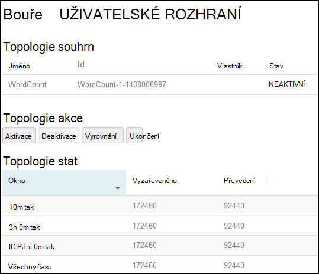
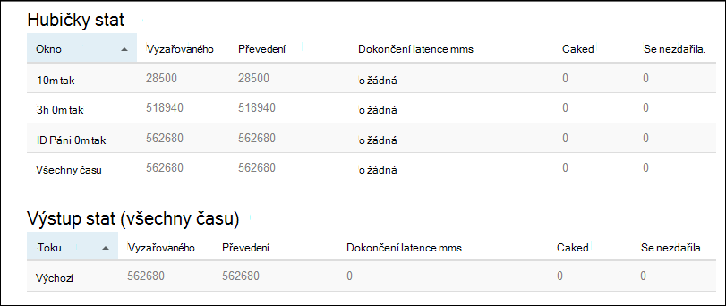

<properties
    pageTitle="Kurz Apache bouře: Začínáme s bouře Linux založené na HDInsight | Microsoft Azure"
    description="Začínáme s analýzy velký dat pomocí Apache bouře a ukázky bouře Starter na základě Linux HDInsight. Naučte se používat bouře proces data v reálném čase."
    keywords="Apache bouře apache bouře kurz, analýzy velký dat, bouře starter"
    services="hdinsight"
    documentationCenter=""
    authors="Blackmist"
    manager="jhubbard"
    editor="cgronlun"/>

<tags
   ms.service="hdinsight"
   ms.devlang="java"
   ms.topic="get-started-article"
   ms.tgt_pltfrm="na"
   ms.workload="big-data"
   ms.date="10/12/2016"
   ms.author="larryfr"/>

# Kurz Apache bouře: Začínáme s ukázkami bouře Starter pro analýzy velký dat na HDInsight

Apache bouře je systém scalable chybám, distribuované, v reálném čase výpočtu pro zpracování datové proudy. Pomocí bouře na Azure Hdinsightu můžete vytvořit cloudové bouře obrázku, který provádí analýzy velký data v reálném čase.

> [AZURE.NOTE] Kroky v tomto článku Vytvoření clusteru na základě Linux HDInsight. Postup vytvoření bouře serveru s Windows HDInsight clusteru najdete v tématech [Apache bouře kurz: Začínáme s ukázkovými bouře Starter pomocí technologie pro analýzu dat na HDInsight](hdinsight-apache-storm-tutorial-get-started.md)

## Zjistit předpoklady pro

[AZURE.INCLUDE [delete-cluster-warning](../../includes/hdinsight-delete-cluster-warning.md)]

Musí mít podle následujících pokynů úspěšné dokončení tohoto kurzu Apache bouře:

- **Azure předplatného**. Viz [získání Azure bezplatnou zkušební verzi](https://azure.microsoft.com/documentation/videos/get-azure-free-trial-for-testing-hadoop-in-hdinsight/).

- **Znalost SSH a spojovací bod služby**. Další informace o používání SSH a spojovací bod služby s Hdinsightu najdete v těchto článcích:

    - **Linux, Unix nebo OS X klienti**: najdete v článku [Použití SSH s Hadoop Linux založené na HDInsight z Linux, OS X nebo Unix](hdinsight-hadoop-linux-use-ssh-unix.md)

    - **Klienti se systémem Windows**: najdete v článku [Použití SSH s Hadoop Linux založené na HDInsight z Windows](hdinsight-hadoop-linux-use-ssh-windows.md)

### Požadavky na řízení přístupu

[AZURE.INCLUDE [access-control](../../includes/hdinsight-access-control-requirements.md)]

## Vytvoření clusteru bouře

V této části vytvoříte clusteru verzemi 3,2 HDInsight (bouře verze 0.9.3) pomocí šablony správce prostředků Azure. Informace o verzích HDInsight a jejich rozsahu najdete v tématu [HDInsight součást správy verzí](hdinsight-component-versioning.md). Další metody vytvoření obrázku najdete v článku [Vytvoření HDInsight clusterů](hdinsight-hadoop-provision-linux-clusters.md).

1. Klikněte na následujícím obrázku otevření šablony na portálu Azure.         

    
    
    Šablona se nachází v kontejneru veřejné objektů blob *https://hditutorialdata.blob.core.windows.net/armtemplates/create-linux-based-storm-cluster-in-hdinsight.json*. 
   
2. Z zásuvné parametry zadejte následující údaje:

    - **Název_clusteru**: Zadejte název Hadoop obrázku, který chcete vytvořit.
    - **Shluk přihlašovací jméno a heslo**: výchozí přihlašovací jméno je správce.
    - **SSH uživatelské jméno a heslo**.
    
    Opište tyto hodnoty.  Byste potřebovali je dál v tomto kurzu.

    > [AZURE.NOTE] SSH slouží vzdálený přístup k clusteru HDInsight pomocí příkazového řádku. Uživatelské jméno a heslo, které používáte zde se používá při připojování k clusteru prostřednictvím SSH. SSH uživatelské jméno musí být jedinečné, při vytváření uživatelského účtu ve všech uzlech clusteru HDInsight. Následující jsou některé názvy účtů vyhrazená pro použití služby na clusteru a nelze použít jako SSH uživatelské jméno:
    >
    > kořenové, hdiuser, bouře, hbase, se systémem ubuntu, zookeeper, hdfs, vláken, mapred, hbase, podregistru, oozie, falcon, sqoop, správce, tez, hcat, hdinsight zookeeper.

    > Další informace o použití SSH s Hdinsightu najdete v následujících článcích:

    > * [Použití SSH s bázi Linux Hadoop na HDInsight z Linux, Unix nebo OS X](hdinsight-hadoop-linux-use-ssh-unix.md)
    > * [Použití SSH s Hadoop Linux založené na HDInsight z Windows](hdinsight-hadoop-linux-use-ssh-windows.md)

    
3 Kliknutím na **OK** uložte parametry.

4 na zásuvné **nasazení vlastní** klikněte na rozevírací seznam pole **Skupina zdroje** a potom klikněte na **Nový** k vytvoření nové skupiny prostředků. Skupina zdroje je kontejner seskupující clusteru, účtu závislá úložiště a další propojených zdrojů.

5. klikněte **právní podmínky**a pak klikněte na **vytvořit**.

6. klikněte na **vytvořit**. Zobrazí se nová dlaždice s názvem Submitting nasazení šablony nasazení. K vytvoření obrázku a SQL databáze trvá o asi 20 minut.

##Spustit ukázku bouře Starter HDInsight

Příklady [bouře starter](https://github.com/apache/storm/tree/master/examples/storm-starter) jsou zahrnuty clusteru HDInsight. V následujících krocích se spustí příklad WordCount.

1. Připojení k clusteru HDInsight pomocí SSH:

        ssh USERNAME@CLUSTERNAME-ssh.azurehdinsight.net
        
    Pokud jste použili heslo zabezpečení SSH uživatelský účet, zobrazí se výzva k zadání ho. Pokud jste použili veřejný klíč, bude pravděpodobně nutné použít `-i` parametr určuje odpovídající privátním klíčem. Například `ssh -i ~/.ssh/id_rsa USERNAME@CLUSTERNAME-ssh.azurehdinsight.net`.
        
    Další informace o použití SSH s na základě Linux Hdinsightu najdete v následujících článcích:
    
    * [Použití SSH s Hadoop Linux založeny na HDInsight z Linux, Unix nebo OS X](hdinsight-hadoop-linux-use-ssh-unix.md)

    * [Použití SSH s bázi Linux Hadoop na HDInsight z Windows](hdinsight-hadoop-linux-use-ssh-windows)

2. Pomocí následujícího příkazu spustit příklad topologie:

        storm jar /usr/hdp/current/storm-client/contrib/storm-starter/storm-starter-topologies-*.jar storm.starter.WordCountTopology wordcount
        
    > [AZURE.NOTE] `*` Část názvu souboru se používá k porovnání číslem verze, které se změní při aktualizaci HDInsight.

    Příklad WordCount topologie bude vytvořena clusteru s popisný název "wordcount". Bude náhodně generovat věty a určení počtu výskytů každého slova ve větě.

    > [AZURE.NOTE] Při odesílání topologie clusteru, je nutné nejprve zkopírovat sklenice soubor, ve kterém clusteru před použitím `storm` příkaz. Můžete to provést pomocí `scp` příkazu z klienta, kde soubor existuje. Například`scp FILENAME.jar USERNAME@CLUSTERNAME-ssh.azurehdinsight.net:FILENAME.jar`
    >
    > Příklad WordCount a další příklady starter bouře již nacházejí na svůj cluster v `/usr/hdp/current/storm-client/contrib/storm-starter/`.

##Sledování topologie

Uživatelské rozhraní bouře poskytuje webového rozhraní pro práci se systémem topologií a zahrnuta clusteru HDInsight.

Sledování topologii pomocí rozhraní bouře pomocí následujících kroků:

1. Otevřete webový prohlížeč na https://CLUSTERNAME.azurehdinsight.net/stormui, kde __NÁZEV_CLUSTERU__ je název vašeho obrázku. Otevře se v uživatelském rozhraní bouře.

    > [AZURE.NOTE] Pokud budete vyzváni k zadání uživatelského jména a hesla, zadejte Správce clusteru (Správci) a heslo, které jste použili při vytváření clusteru.

2. V části **topologie souhrnné**vyberte položku **wordcount** ve sloupci **název** . Tím zobrazíte další informace o topologii.

    

    Tato stránka obsahuje tyto informace:

    * **Topologie stat** – základní informace o výkonu topologie uspořádané do systému windows.

        > [AZURE.NOTE] Výběr určitého časového intervalu změní časového intervalu informace zobrazené v další části stránky.

    * **Spouts** – základní informace o spouts, včetně poslední chyby vrácené každý hubičky.

    * **Bolts** – základní informace o prvky.

    * **Topologie konfigurace** – podrobné informace o konfiguraci topologie.

    Tato stránka obsahuje také akce, které lze provést topologii:

    * **Aktivace** - životopisy zpracování deaktivovaný topologie.

    * **Deaktivovat** - pozastaví pracovního topologie.

    * **Vyrovnání** - upraví paralelismus topologii. Průběžný topologií by měl vyrovnání po změně počtu uzlů v clusteru. Díky topologii upravte paralelismus pro počtu uzlů v clusteru zvýšit nebo snížit. Další informace najdete v tématu [Princip paralelismus bouře topologie](http://storm.apache.org/documentation/Understanding-the-parallelism-of-a-Storm-topology.html).

    * **Odstranění** - ukončí bouře topologie po zadaného časového limitu.

3. Na této stránce zvolte položku z části **Spouts** nebo **Bolts** . Zobrazí se informace o vybrané součásti.

    

    Na této stránce zobrazí následující informace:

    * **Hubičky/blesku stat** – základní informace o výkonu součásti uspořádané do systému windows.

        > [AZURE.NOTE] Výběr určitého časového intervalu změní časového intervalu informace zobrazené v další části stránky.

    * **Vstupní stat** (šroubu pouze) – informace týkající se součástí, které vytvářejí dat využívané šroubu.

    * **Výstup stat** – informace o dat, které tato blesku.

    * **Vykonavatelů** – informace týkající se výskyty této součásti.

    * **Chyby** – chyby vytvořené pomocí této součásti.

4. Při zobrazení podrobností o hubičky nebo blesku, vyberte položku ze sloupce **Port** v části **vykonavatelů** a zobrazit podrobnosti pro konkrétní instanci součásti.

        2015-01-27 14:18:02 b.s.d.task [INFO] Emitting: split default ["with"]
        2015-01-27 14:18:02 b.s.d.task [INFO] Emitting: split default ["nature"]
        2015-01-27 14:18:02 b.s.d.executor [INFO] Processing received message source: split:21, stream: default, id: {}, [snow]
        2015-01-27 14:18:02 b.s.d.task [INFO] Emitting: count default [snow, 747293]
        2015-01-27 14:18:02 b.s.d.executor [INFO] Processing received message source: split:21, stream: default, id: {}, [white]
        2015-01-27 14:18:02 b.s.d.task [INFO] Emitting: count default [white, 747293]
        2015-01-27 14:18:02 b.s.d.executor [INFO] Processing received message source: split:21, stream: default, id: {}, [seven]
        2015-01-27 14:18:02 b.s.d.task [INFO] Emitting: count default [seven, 1493957]

    Z těchto dat uvidíte, že slovo **sedm** došlo k 1493957 časy. Je to kolikrát byl nalezen od spuštění této topologie.

##Ukončení topologie

Návrat na stránku **topologie souhrnné** pro topologii počtu slov a pak klikněte na tlačítko **Ukončit** z části **topologie akce** . Po zobrazení výzvy zadejte 10 sekund se má čekat, před ukončením topologii. Po časový limit topologii se budou zobrazovat při návštěvě části **Uživatelského rozhraní bouře** řídicího panelu.

##Odstranění clusteru

[AZURE.INCLUDE [delete-cluster-warning](../../includes/hdinsight-delete-cluster-warning.md)]

##Další kroky

V tomto kurzu Apache bouře používá Starter bouře informace o bouře HDInsight clusteru Kam zmizely řídicím panelu bouře nasadit, sledování a správa bouře topologií. Dále se naučíte, jak [na základě vyvíjet Java topologií pomocí Maven](hdinsight-storm-develop-java-topology.md).

Pokud jste už znáte vývoj na základě Java topologie a chcete nasadit existující topologie HDInsight, přečtěte si článek [nasazení a správu Apache bouře topologie na HDInsight](hdinsight-storm-deploy-monitor-topology-linux.md).

Jestliže jste vývojáři .NET, můžete vytvořit C# nebo hybridní C# / Java topologií pomocí aplikace Visual Studio. Další informace najdete v tématu [vyvíjet C# topologie pro Apache bouře na HDInsight pomocí nástroje Hadoop for Visual Studio](hdinsight-storm-develop-csharp-visual-studio-topology.md).

Například topologie, které se dá používat se bouře na HDInsight, najdete v článku příklady:

    * [Příklad topologie pro bouře na HDInsight](hdinsight-storm-example-topology.md)

[apachestorm]: https://storm.incubator.apache.org
[stormdocs]: http://storm.incubator.apache.org/documentation/Documentation.html
[stormstarter]: https://github.com/apache/storm/tree/master/examples/storm-starter
[stormjavadocs]: https://storm.incubator.apache.org/apidocs/
[azureportal]: https://manage.windowsazure.com/
[hdinsight-provision]: hdinsight-provision-clusters.md
[preview-portal]: https://portal.azure.com/
