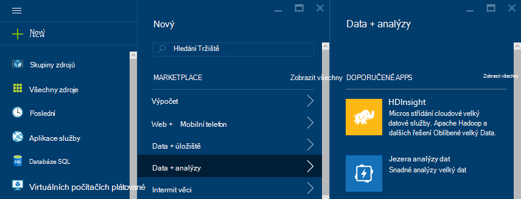
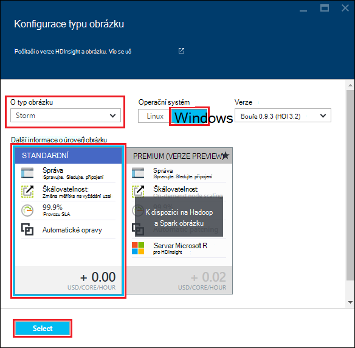

<properties
    pageTitle="Kurz Apache bouře: Začínáme s bouře | Microsoft Azure"
    description="Začínáme s analýzy velký dat pomocí Apache bouře a ukázky bouře Starter na HDInsight. Naučte se používat bouře proces data v reálném čase."
    keywords="Apache bouře apache bouře kurz, analýzy velký dat, bouře starter"
    services="hdinsight"
    documentationCenter=""
    authors="Blackmist"
    manager="jhubbard"
    editor="cgronlun"
    tags="azure-portal"/>

<tags
   ms.service="hdinsight"
   ms.devlang="java"
   ms.topic="article"
   ms.tgt_pltfrm="na"
   ms.workload="big-data"
   ms.date="09/07/2016"
   ms.author="larryfr"/>

# Kurz Apache bouře: Začínáme s ukázkami bouře Starter pro analýzy velký dat na HDInsight

Apache bouře je systém scalable chybám, distribuované, v reálném čase výpočtu pro zpracování datové proudy. Pomocí bouře na Microsoft Azure HDInsight můžete vytvořit cloudové bouře obrázku, který provádí analýzy velký data v reálném čase. 

> [AZURE.NOTE] Kroky v tomto článku Vytvoření clusteru serveru s Windows HDInsight. Postup vytvoření bouře na základě Linux HDInsight clusteru najdete v tématech [Apache bouře kurz: Začínáme s ukázkovými bouře Starter pomocí technologie pro analýzu dat na HDInsight](hdinsight-apache-storm-tutorial-get-started-linux.md)

## Zjistit předpoklady pro

[AZURE.INCLUDE [delete-cluster-warning](../../includes/hdinsight-delete-cluster-warning.md)]

Musí mít podle následujících pokynů úspěšné dokončení tohoto kurzu Apache bouře:

- **Azure předplatného**. Viz [získání Azure bezplatnou zkušební verzi](https://azure.microsoft.com/documentation/videos/get-azure-free-trial-for-testing-hadoop-in-hdinsight/).

### Požadavky na řízení přístupu

[AZURE.INCLUDE [access-control](../../includes/hdinsight-access-control-requirements.md)]

## Vytvoření clusteru bouře

Bouře na HDInsight používá úložiště objektů Blob Azure pro ukládání souborů protokolu a topologie odeslané do clusteru. Vytvořte účet Azure úložiště pro použití s svůj cluster pomocí následujících kroků:

1. Přihlaste se k [portálu Azure][preview-portal].

2. Vyberte **Nový**, vyberte __Technologie pro analýzu dat__a potom vyberte __HDInsight__.

    

3. Zadejte __název obrázku__. Zelené zaškrtnutí se zobrazí vedle __Názvu clusteru__ , pokud je k dispozici.

4. Pokud máte víc předplatných, vyberte položku __předplatného__ vyberte Azure předplatné, které bude sloužit k clusteru.

5.  __Vyberte typ obrázku__ slouží k výběru __bouře__ obrázku. __Operační systém__vyberte systému Windows. Pro __Clusteru osy__vyberte. Nakonec pomocí tlačítka Vybrat uložte toto nastavení.

    

5. __Pole Skupina zdroje__můžete nám v rozevíracím seznamu zobrazit seznam existující skupiny zdrojů a vyberte vytvořit obrázku v. Nebo vyberte __Nový__ a potom zadejte název nové skupiny prostředků. Zelené zaškrtnutí se zobrazí označíte, pokud je k dispozici název nové skupiny.

6. Vyberte __přihlašovací údaje__a zadejte __Uživatelské clusteru přihlašovací jméno__ a __Heslo pro přihlášení obrázku__. Nakonec pomocí __Vyberte__ nastavit přihlašovací údaje. Vzdálená plocha nepoužije v tomto dokumentu, můžete ponechat zakázané.

    

6. Pro __Zdroj dat__můžete vybrat položku a zvolte existujícího zdroje dat nebo vytvořte nový účet.

    

    Nyní můžete vybrat účet Azure úložiště jako zdroj dat pro HDInsight obrázku. Principy položky na zásuvné __Zdroj dat__ pomocí následující.

    - __Výběr metody__: nastavte __ze všech předplatných__ povolení procházení osnovu úložiště u vašeho předplatného. Pokud chcete zadat __Název úložiště__ a __Přístupové klávesy__ existujícího účtu úložiště nastavena na __Přístupové klávesy__ .

    - __Vytvoření nového__: slouží k vytvoření nového účtu úložiště. Pomocí pole, které se objeví zadejte název účtu úložiště. Zelené zaškrtnutí se zobrazí, pokud je k dispozici v poli název.

    - __Vyberte výchozí kontejner__: slouží k zadejte jméno container výchozí pro účely clusteru. Můžete zadat libovolný název, doporučujeme použít stejný název jako clusteru tak, aby si snadno zapamatujete kontejneru se používá k této konkrétní obrázku.

    - __Umístění__: zeměpisná oblast účet úložiště bude je v, nebo se vytvoří v.

        > [AZURE.IMPORTANT] Výběr umístění zdroje dat výchozí také nastaví umístění obrázku HDInsight. Zdroj dat obrázku a výchozí musí být umístěné ve stejné oblasti.

    - __Vyberte__: Tato možnost slouží k uložení nastavení zdroje dat.

7. Vyberte __Uzel ceny úrovní__ k zobrazení informací o vytvořené pro tento cluster uzlů. Ve výchozím nastavení počtu uzlů pracovníka nastavenou __4__. Nastavte na hodnotu __1__, a to stačí pro účely tohoto návodu zmenší náklady clusteru. Odhad nákladů clusteru je zobrazen v dolní části této zásuvné.

    

    Umožňuje __Vybrat__ uložení __Uzel ceny úrovní__ informací.

8. Vyberte __volitelné konfiguraci__. Tento zásuvné umožňuje vybrat verzi obrázku i konfigurovat další volitelná nastavení, například připojení __Virtuální sítě__.

    

9. Zajistěte __Připnout k Startboard__ a pak vyberte __vytvořit__. Vytvoří clusteru a přidá na dlaždici pro něj Startboard portálu Azure. Ikona označuje, že zřizování clusteru a dokončení změny zobrazit ikonu HDInsight jednou zřizování.

  	| Při vytváření | Zřízení dokončení |
  	| ------------------ | --------------------- |
  	|  |  |

    > [AZURE.NOTE] Trvá delší dobu clusteru vytvořit, obvykle asi 15 minut. Použití dlaždice na Startboard nebo položce __oznámení__ na levé straně stránky, informace o vytváření obrázku.

## Spustit ukázku bouře Starter HDInsight

Tento kurz Apache bouře vás seznámí s analýzy velký dat pomocí ukázky bouře Starter na GitHub.

Každý bouře HDInsight clusteru je součástí řídicím bouře mohou sloužit k nahrání a spustit bouře topologií clusteru. Každý cluster taky získáváte ukázkové topologií spuštěné přímo z řídicího panelu bouře.

### Připojení k řídicím panelu

Řídicí panel je umístěný na **https://&lt;Název_clusteru >.azurehdinsight.net//**, kde je **název_clusteru** název clusteru. Odkaz na řídicí panel můžete najít taky výběr clusteru z Startboard a výběrem odkazu __řídicího panelu__ v horní části zásuvné.

> [AZURE.NOTE] Při připojování k řídicím panelu, zobrazí se výzva k zadání uživatelského jména a hesla. Je to jméno správce (**Správce**) a heslo při vytvoření clusteru.

Po načetl řídicího panelu bouře, zobrazí se **Topologie odeslání** formuláře.

**Odeslání topologie** formuláře mohou sloužit k nahrávání a spouštět .jar soubory, které obsahují bouře topologií. Obsahuje i několik ukázek základní, které jsou součástí clusteru.

### Spuštění ukázku počtu slov z bouře Starter projektu v GitHub

Ukázky součástí clusteru zahrnout několika varianty topologie počítání Wordu. Tyto příklady zahrnout **spout** , náhodně posílá věty a **bolts** , které rozdělí větě jednotlivá slova a potom počítat kolikrát došlo k každého slova. Tyto příklady jsou hodnoty [bouře Starter výběry](https://github.com/apache/storm/tree/master/examples/storm-starter), které jsou součástí Apache bouře.

Provedení následujících kroků můžete spustit bouře Starter výběru:

1. Vyberte **StormStarter - WordCount** z rozevíracího seznamu **Jar soubor** . To vyplní pole **Název třídy** a **Další parametry** s parametry v tomto příkladu.

    

    * **Název třídy** - třídy v souboru .jar, která odešle topologii.
    * **Další parametry** – všechny parametry vyžadované o topologii. V tomto příkladu pole slouží k zadejte popisný název odeslané topologie.

2. Klikněte na **Odeslat**. Po chvíli zobrazí pole **výsledek** příkazu odesílat úkoly, jakož i výsledky příkazu. Pole **chybová** zobrazí všechny chyby, ke kterým dochází v odeslání topologii.

    

    > [AZURE.NOTE] Výsledky neoznačují, že topologii proběhla - **bouře topologii, po spuštění se spustí, dokud nástroj jej.** Topologie počtu slov vygeneruje náhodné věty a ponechá počtu kolikrát dojde každého slova až po ukončení.

### Sledování topologie

Uživatelské rozhraní bouře lze použít ke sledování topologii.

1. Vyberte **Uživatelské rozhraní bouře** v horní části řídicího panelu bouře. Zobrazí se souhrnné informace o clusteru a všechny spuštěné topologií.

    

    Nahoře na stránce zobrazí se o čase, který byl aktivní topologii, jakož i počet zaměstnanců, vykonavatelů a úkolů, který se používá.

    > [AZURE.NOTE] Sloupec **název** obsahuje zadaný popisný název dříve pomocí pole **Další parametry** .

4. V části **topologie souhrnné**vyberte položku **wordcount** ve sloupci **název** . Zobrazí se další informace o topologii.

    

    Tato stránka obsahuje tyto informace:

    * **Topologie stat** – základní informace o výkonu topologie uspořádané do systému windows.

        > [AZURE.NOTE] Výběr určitého časového intervalu změní časového intervalu informace zobrazené v další části stránky.

    * **Spouts** – základní informace o spouts, včetně poslední chyby vrácené každý hubičky.

    * **Bolts** – základní informace o prvky.

    * **Topologie konfigurace** – podrobné informace o konfiguraci topologie.

    Tato stránka obsahuje také akce, které lze provést topologii:

    * **Aktivace** - životopisy zpracování deaktivovaný topologie.

    * **Deaktivovat** - pozastaví pracovního topologie.

    * **Vyrovnání** - upraví paralelismus topologii. Průběžný topologií by měl vyrovnání po změně počtu uzlů v clusteru. Díky topologii upravte paralelismus pro počtu uzlů v clusteru zvýšit nebo snížit. Další informace najdete v tématu [Princip paralelismus bouře topologie](http://storm.apache.org/documentation/Understanding-the-parallelism-of-a-Storm-topology.html).

    * **Odstranění** - ukončí bouře topologie po zadaného časového limitu.

5. Na této stránce zvolte položku z části **Spouts** nebo **Bolts** . Zobrazí se informace o vybrané součásti.

    

    Na této stránce zobrazí následující informace:

    * **Hubičky/blesku stat** – základní informace o výkonu součásti uspořádané do systému windows.

        > [AZURE.NOTE] Výběr určitého časového intervalu změní časového intervalu informace zobrazené v další části stránky.

    * **Vstupní stat** (šroubu pouze) – informace týkající se součástí, které vytvářejí dat využívané šroubu.

    * **Výstup stat** – informace o dat, které tato blesku.

    * **Vykonavatelů** – informace týkající se výskyty této součásti.

    * **Chyby** – chyby vytvořené pomocí této součásti.

5. Při zobrazení podrobností o hubičky nebo blesku, vyberte položku ze sloupce **Port** v části **vykonavatelů** a zobrazit podrobnosti pro konkrétní instanci součásti.

        2015-01-27 14:18:02 b.s.d.task [INFO] Emitting: split default ["with"]
        2015-01-27 14:18:02 b.s.d.task [INFO] Emitting: split default ["nature"]
        2015-01-27 14:18:02 b.s.d.executor [INFO] Processing received message source: split:21, stream: default, id: {}, [snow]
        2015-01-27 14:18:02 b.s.d.task [INFO] Emitting: count default [snow, 747293]
        2015-01-27 14:18:02 b.s.d.executor [INFO] Processing received message source: split:21, stream: default, id: {}, [white]
        2015-01-27 14:18:02 b.s.d.task [INFO] Emitting: count default [white, 747293]
        2015-01-27 14:18:02 b.s.d.executor [INFO] Processing received message source: split:21, stream: default, id: {}, [seven]
        2015-01-27 14:18:02 b.s.d.task [INFO] Emitting: count default [seven, 1493957]

    Z těchto dat uvidíte, že slovo **sedm** došlo k 1,493,957 časy. Je to kolikrát byl nalezen od spuštění této topologie.

### Ukončení topologie

Návrat na stránku **topologie souhrnné** pro topologii počtu slov a pak vyberte **Ukončit** oddíl **topologie akce** . Po zobrazení výzvy zadejte 10 sekund se má čekat, před ukončením topologii. Po časový limit topologii už se zobrazí při návštěvě části **Uživatelského rozhraní bouře** řídicího panelu.

##Odstranění clusteru

[AZURE.INCLUDE [delete-cluster-warning](../../includes/hdinsight-delete-cluster-warning.md)]

## Souhrn

V tomto kurzu Apache bouře používá Starter bouře informace o bouře HDInsight clusteru Kam zmizely řídicím panelu bouře nasadit, sledování a správa bouře topologií.

## Další kroky

* **HDInsight Tools for Visual Studio** - HDInsight nástroje umožňuje pomocí aplikace Visual Studio odeslat, sledování a správa bouře topologií podobný řídicím panelu bouře uvedených výše. HDInsight nástroje taky obsahuje možnost vytvořit C# bouře topologií a topologie vzorku, které můžete nasazení a spustit na svůj cluster.

    Další informace najdete v tématu [Začínáme používat nástroje HDInsight for Visual Studio](hdinsight-hadoop-visual-studio-tools-get-started.md).

* **Ukázkové soubory** – bouře HDInsight clusteru obsahuje několik příkladů v adresáři **%STORM_HOME%\contrib** . Každý příklad by měl obsahovat takto:

    * Zdrojový kód – například bouře starter-0.9.1.2.1.5.0-2057-sources.jar

    * Java dokumenty, které – například bouře starter-0.9.1.2.1.5.0-2057-javadoc.jar

    * V příkladu – například storm-starter-0.9.1.2.1.5.0-2057-jar-with-dependencies.jar

    Chcete-li extrahovat zdrojového kódu jazyka Java dokumenty pomocí příkazu "sklenice". Například "sklenice - xvf bouře-starter-0.9.1.2.1.5.0.2057-javadoc.jar".

    > [AZURE.NOTE] Dokumenty Java sestávat z webové stránky. Jakmile extrahovaných, použijte jiný prohlížeč zobrazení **index.html** souboru.

    Pro přístup k tyto ukázky, musíte povolit vzdálená plocha pro bouře HDInsight clusteru a z **%STORM_HOME%\contrib**zkopírujte soubory.

* Následující dokument obsahuje seznam Další příklady, které můžete používat s bouře na HDInsight:

    * [Příklad topologie pro bouře na HDInsight](hdinsight-storm-example-topology.md)

[apachestorm]: https://storm.incubator.apache.org
[stormdocs]: http://storm.incubator.apache.org/documentation/Documentation.html
[stormstarter]: https://github.com/apache/storm/tree/master/examples/storm-starter
[stormjavadocs]: https://storm.incubator.apache.org/apidocs/
[azureportal]: https://manage.windowsazure.com/
[hdinsight-provision]: hdinsight-provision-clusters.md
[preview-portal]: https://portal.azure.com/
