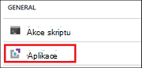
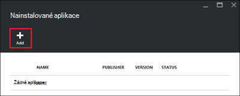
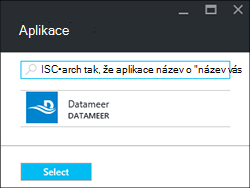
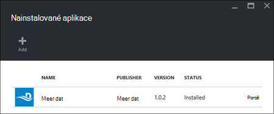

<properties
    pageTitle="Instalace aplikací Hadoop HDInsight | Microsoft Azure"
    description="Informace o instalaci aplikací HDInsight HDInsight aplikace."
    services="hdinsight"
    documentationCenter=""
    authors="mumian"
    manager="jhubbard"
    editor="cgronlun"
    tags="azure-portal"/>

<tags
    ms.service="hdinsight"
    ms.devlang="na"
    ms.topic="hero-article"
    ms.tgt_pltfrm="na"
    ms.workload="big-data"
    ms.date="09/14/2016"
    ms.author="jgao"/>

# Instalace aplikací HDInsight

HDInsight aplikace je aplikace, která můžou uživatelé nainstalovat na základě Linux HDInsight obrázku. Tyto aplikace můžete vyvinutý společností Microsoft, nezávisle prodejci nebo za vás. V tomto článku se dozvíte, jak nainstalovat publikované aplikace. Instalace vlastní aplikace, najdete v článku [instalace vlastních aplikací HDInsight](hdinsight-apps-install-custom-applications.md). 

Momentálně je jedna publikovaných aplikace:

- **Datameer**: [Datameer](http://www.datameer.com/documentation/display/DAS50/Home?ls=Partners&lsd=Microsoft&c=Partners&cd=Microsoft) nabízí analytici interaktivní způsob, jak zjistit, analýza a vizualizovat výsledky na velká Data. V dalších zdrojů dat snadno zjišťovat nové relace a získat odpovědi, které potřebujete rychle si ho naimportovat.

>[AZURE.NOTE] Datameer je aktuálně k dispozici pouze v Azure HDInsight verzemi 3,2.

Azure portál pomocí pokynů uvedených v tomto článku. Můžete taky exportovat šablonu Azure správce na portálu nebo získat kopii šablony správce prostředků od dodavatelů a nasadit šablony pomocí prostředí PowerShell Azure a rozhraní příkazového řádku Azure.  Najdete v článku [na základě vytvořit Linux Hadoop clusterů v HDInsight pomocí šablon správce prostředků](hdinsight-hadoop-create-linux-clusters-arm-templates.md).

## Zjistit předpoklady pro

Pokud chcete instalovat aplikace HDInsight existujícího HDInsight clusteru, musíte mít HDInsight obrázku. Chcete-li vytvořit průzkum, najdete v článku [clusterů vytvořit](hdinsight-hadoop-linux-tutorial-get-started.md#create-cluster). Můžete také nainstalovat aplikace HDInsight při vytváření clusteru HDInsight.

## Instalace aplikací do existující clusterů

Následující postup ukazuje, jak instalovat aplikace HDInsight do existujícího clusteru HDInsight.

**Chcete-li nainstalovat aplikaci HDInsight**

1. Přihlaste se k [portálu Azure](https://portal.azure.com).
2. Klikněte v nabídce nalevo na **Clusterů HDInsight** .  Pokud nevidíte, klikněte na tlačítko **Procházet**a pak klikněte na **HDInsight clusterů**.
3. Klikněte na obrázku HDInsight.  Pokud nemáte jeden, je nutné ho vytvořit první.  v tématu [Vytvoření clusterů](hdinsight-hadoop-linux-tutorial-get-started.md#create-cluster).
4. V kategorii **Obecné** zásuvné **Nastavení** klikněte na **aplikace** . Zásuvné **Nainstalované aplikace** jsou uvedeny všechny nainstalované aplikace. 

    

5. V nabídce zásuvné klikněte na **Přidat** . 

    

    Zobrazí se seznam existující HDInsight aplikací.

    

6. Klikněte na jednu z aplikací, třeba souhlasit s podmínkami právní a potom na tlačítko **Vybrat**.

Můžete zobrazit stav instalace z portálu oznámení (klikněte na ikonu zvonu nahoře na portálu). Po instalaci aplikace aplikace se zobrazí na zásuvné nainstalované aplikace.

## Instalace aplikací při vytváření obrázku

Máte možnost instalovat aplikace HDInsight při vytváření clusteru. V průběhu instalace aplikací HDInsight po clusteru se vytvoří a pracovního stav. Následující postup ukazuje, jak instalovat aplikace HDInsight při vytváření clusteru.

**Chcete-li nainstalovat aplikaci HDInsight**

1. Přihlaste se k [portálu Azure](https://portal.azure.com).
2. Klikněte na **Nový**, klikněte na **Data + technologie pro analýzu**a klikněte na **HDInsight**.
3. Zadejte **Název clusteru**: Tento název musí být jedinečné.
4. Klikněte na **předplatné** vyberte Azure předplatné, které bude sloužit k clusteru.
5. Klikněte na **Výběr obrázku typ**a vyberte:

    - **Typ obrázku**: Pokud nevíte, co chcete-li zvolit, vyberte **Hadoop**. Je nejoblíbenější typ obrázku.
    - **Operační systém**: vyberte **Linux**.
    - **Verze**: Pokud nevíte, co chcete použít na výchozí verzi. Další informace najdete v tématu [verze obrázku HDInsight](hdinsight-component-versioning.md).
    - **Shluk osy**: Azure HDInsight obsahuje nabídky cloudu velký dat ve dvou kategorií: standardní osy a Premium osy. Další informace najdete v tématu [úrovní obrázku](hdinsight-hadoop-provision-linux-clusters.md#cluster-tiers).
6. Klikněte na **aplikace**, klikněte na jednu z publikované aplikace a potom klikněte na **Výběr**.
6. Klikněte na **přihlašovací údaje** a pak zadejte heslo pro správu uživatelů. Také je nutné zadat **Jména SSH** a buď **heslo** nebo **VEŘEJNÝM klíčem**, který se použijí k ověření uživatele SSH. Použití veřejným klíčem je doporučený postup. V dolní části uložení konfigurace přihlašovacích údajů klikněte na **Výběr** .
8. Klikněte na **Zdroj dat**, vyberte jednu z existujícího účtu úložiště nebo vytvořte nový účet úložiště chcete použít jako výchozí účet úložiště clusteru.
9. Klikněte na **Pole Skupina zdroje** , které chcete vybrat existující skupiny zdrojů, nebo klikněte na **Nový** k vytvoření nové skupiny prostředků

10. Na zásuvné **Nového clusteru HDInsight** zajistit, že **kód Pin pro Startboard** zaškrtnuté a klikněte na **vytvořit**. 

## Seznam nainstalovaných aplikací HDInsight a vlastností

Na portálu zobrazuje seznam aplikací nainstalovaných HDInsight clusteru a vlastností jednotlivých nainstalované aplikace.

**Do seznamu HDInsight aplikace a zobrazení dialogového okna Vlastnosti**

1. Přihlaste se k [portálu Azure](https://portal.azure.com).
2. Klikněte v nabídce nalevo na **Clusterů HDInsight** .  Pokud nevidíte, klikněte na tlačítko **Procházet**a pak klikněte na **HDInsight clusterů**.
3. Klikněte na obrázku HDInsight.
4. V kategorii **Obecné** zásuvné **Nastavení** klikněte na **aplikace** . Zásuvné nainstalované aplikace jsou uvedeny všechny nainstalované aplikace. 

    

5. Klikněte na jednu z nainstalovaných aplikací zobrazit vlastnosti. Seznamy vlastností zásuvné:

    - Název aplikace: název aplikace.
    - Stav: stav aplikace. 
    - Webová stránka: Adresu URL webové aplikace, kterou jste nasadili uzel okraj, pokud je některý. Přihlašovací údaje je stejná jako přihlašovací údaje uživatele HTTP, které jste nakonfigurovali clusteru.
    - Nastavit informace HTTP koncového bodu: pověření je stejná jako přihlašovací údaje uživatele HTTP, které jste nakonfigurovali clusteru. 
    - SSH koncového bodu: umožňuje [SSH](hdinsight-hadoop-linux-use-ssh-unix.md) připojení k uzel okraje. Přihlašovací údaje SSH jsou stejné jako přihlašovací údaje uživatele SSH, které jste nakonfigurovali clusteru.

6. Odstranění aplikace, klikněte pravým tlačítkem aplikaci a v místní nabídce klikněte na příkaz **Odstranit** .

## Připojení k uzel hrany

Můžete se připojit pomocí protokolu HTTP a SSH uzel okraje. Koncový bod informace najdete na [portálu](#list-installed-hdinsight-apps-and-properties). Další informace o použití SSH najdete v tématu [Použití SSH s Hadoop Linux založené na HDInsight z Linux, Unix nebo OS X](hdinsight-hadoop-linux-use-ssh-unix.md). 

Přihlašovací údaje HTTP koncový bod jsou přihlašovací údaje uživatele HTTP, které jste nakonfigurovali HDInsight clusteru; přihlašovací údaje koncový bod SSH jsou SSH přihlašovací údaje, které jste nakonfigurovali clusteru HDInsight.

## Poradce při potížích s

V tématu [Poradce při instalaci](hdinsight-apps-install-custom-applications.md#troubleshoot-the-installation).

## Další kroky

- [Instalace aplikací vlastní HDInsight](hdinsight-apps-install-custom-applications.md): Naučte se nasadit aplikace zrušením publikované HDInsight HDInsight.
- [Publikování HDInsight aplikace](hdinsight-apps-publish-applications.md): Přečtěte si, jak publikovat vlastních aplikací HDInsight Azure Marketplace.
- [MSDN: instalace aplikace HDInsight](https://msdn.microsoft.com/library/mt706515.aspx): Přečtěte si, jak definovat HDInsight aplikací.
- [Na základě přizpůsobení Linux HDInsight clusterů pomocí skriptu akce](hdinsight-hadoop-customize-cluster-linux.md): Naučte se používat akci skriptu nainstalovat další aplikace.
- [Na základě vytvořit Linux Hadoop clusterů v HDInsight pomocí Správce prostředků šablon](hdinsight-hadoop-create-linux-clusters-arm-templates.md): Přečtěte si, jak volání správce prostředků šablony k vytvoření clusterů HDInsight.
- [Použití prázdné okraj uzlů v HDInsight](hdinsight-apps-use-edge-node.md): Naučte se používat prázdné okraj uzel pro přístup k HDInsight obrázku, testování HDInsight aplikací a hostování HDInsight aplikace.

