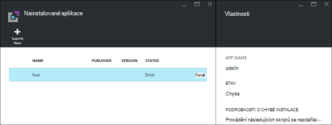
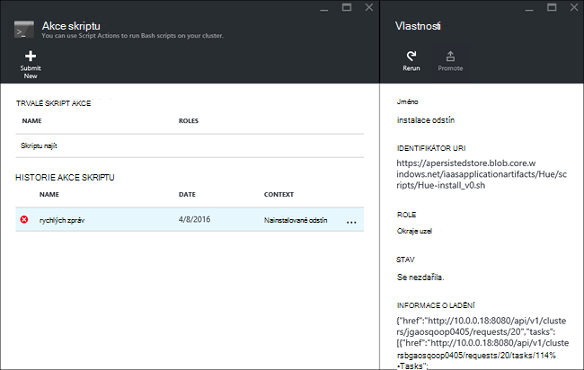

<properties
    pageTitle="Instalace aplikací Hadoop HDInsight | Microsoft Azure"
    description="Informace o instalaci aplikací HDInsight HDInsight aplikace."
    services="hdinsight"
    documentationCenter=""
    authors="mumian"
    manager="jhubbard"
    editor="cgronlun"
    tags="azure-portal"/>

<tags
    ms.service="hdinsight"
    ms.devlang="na"
    ms.topic="hero-article"
    ms.tgt_pltfrm="na"
    ms.workload="big-data"
    ms.date="09/14/2016"
    ms.author="jgao"/>

# Instalace aplikací vlastní HDInsight

HDInsight aplikace je aplikace, která můžou uživatelé nainstalovat na základě Linux HDInsight obrázku.  Tyto aplikace můžete vyvinutý společností Microsoft, nezávisle prodejci nebo za vás. V tomto článku se dozvíte, jak nainstalovat aplikaci HDInsight, která nebyl publikován na portálu Azure na HDInsight. Aplikaci, kterou chcete nainstalovat je [odstín](http://gethue.com/). 

Další související články:

- [Instalace HDInsight aplikace](hdinsight-apps-install-applications.md): Přečtěte si, jak nainstalovat aplikace HDInsight clusterů.
- [Publikování HDInsight aplikace](hdinsight-apps-publish-applications.md): Přečtěte si, jak publikovat vlastních aplikací HDInsight Azure Marketplace.
- [MSDN: instalace aplikace HDInsight](https://msdn.microsoft.com/library/mt706515.aspx): Přečtěte si, jak definovat HDInsight aplikací.

 
## Zjistit předpoklady pro

Pokud chcete instalovat aplikace HDInsight existujícího HDInsight clusteru, musíte mít HDInsight obrázku. Vytvořte si ho, najdete v článku [Vytvoření clusterů](hdinsight-hadoop-linux-tutorial-get-started.md#create-cluster). Můžete také nainstalovat aplikace HDInsight při vytváření clusteru HDInsight.

## Instalace aplikací HDInsight

HDInsight aplikací lze použít při vytváření clusteru nebo do existujícího clusteru HDInsight. Definování správce prostředků Azure šablon, najdete v článku [MSDN: instalace aplikace HDInsight](https://msdn.microsoft.com/library/mt706515.aspx).

Soubory potřebné pro nasazení aplikace (odstín):

- [azuredeploy.JSON](https://github.com/hdinsight/Iaas-Applications/blob/master/Hue/azuredeploy.json): Šablona správce prostředků pro instalaci aplikace HDInsight. V tématu [MSDN: instalace aplikace HDInsight](https://msdn.microsoft.com/library/mt706515.aspx) k vývoji šablony správce prostředků.
- [odstín install_v0.sh](https://github.com/hdinsight/Iaas-Applications/blob/master/Hue/scripts/Hue-install_v0.sh): akci skriptu voláním šabloně správce prostředků pro konfiguraci uzel okraje. 
- [odstín binaries.tgz](https://hdiconfigactions.blob.core.windows.net/linuxhueconfigactionv01/hue-binaries-14-04.tgz): binární soubor odstín volat z Huiovi install_v0.sh. 
- [odstín binární 14 04.tgz](https://hdiconfigactions.blob.core.windows.net/linuxhueconfigactionv01/hue-binaries-14-04.tgz): binární soubor odstín volat z Huiovi install_v0.sh. 
- [webwasb tomcat.tar.gz](https://hdiconfigactions.blob.core.windows.net/linuxhueconfigactionv01/webwasb-tomcat.tar.gz): ukázkové webové aplikace (Tomcat) jen z Huiovi install_v0.sh.

**Chcete-li nainstalovat odstín do existujícího clusteru HDInsight**

1. Klikněte na následujícím obrázku se přihlásit k Azure a otevření šablony správce na portálu Azure. 

    

    Kliknutím na toto tlačítko otevře šablona správce na portálu Azure.  Správce prostředků šablony se nachází v [https://github.com/hdinsight/Iaas-Applications/tree/master/Hue](https://github.com/hdinsight/Iaas-Applications/tree/master/Hue).  Zjistěte, jak psát tuto šablonu správce prostředků, najdete v článku [MSDN: instalace aplikace HDInsight](https://msdn.microsoft.com/library/mt706515.aspx).
    
2. Z zásuvné **Parametry** zadejte následující údaje:

    - **Název_clusteru**: Zadejte název clusteru místo, kam chcete nainstalovat aplikace. Tento cluster musí být existujícího clusteru.
    
3. Kliknutím na **OK** uložte parametry.
4. Z zásuvné **Vlastní nasazení** zadejte **pole Skupina zdroje**.  Skupina zdroje je kontejner seskupující clusteru, účtu závislá úložiště a další zdroje informací. Je nutné použít stejné skupiny prostředků jako clusteru.
5. Klikněte na **právní podmínky**a pak klikněte na **vytvořit**.
6. Zkontrolujte **kód Pin pro řídicí panel** políčko zaškrtnuté a klikněte na **vytvořit**. Můžete zobrazit stav instalace z dlaždic připnuté portálu řídicích panelů a portálu oznámení (klikněte nahoře na portálu u ikony zvonku).  Instalace aplikace trvá asi 10 minut.

**Chcete-li nainstalovat odstínem při vytváření clusteru**

1. Klikněte na následujícím obrázku se přihlásit k Azure a otevření šablony správce na portálu Azure. 

    

    Kliknutím na toto tlačítko otevře šablona správce na portálu Azure.  Správce prostředků šablony se nachází v [https://hditutorialdata.blob.core.windows.net/hdinsightapps/create-linux-based-hadoop-cluster-in-hdinsight.json](https://hditutorialdata.blob.core.windows.net/hdinsightapps/create-linux-based-hadoop-cluster-in-hdinsight.json).  Zjistěte, jak psát tuto šablonu správce prostředků, najdete v článku [MSDN: instalace aplikace HDInsight](https://msdn.microsoft.com/library/mt706515.aspx).

2. Postupujte podle pokynů k vytvoření obrázku a nainstalovat odstín. Další informace o vytváření clusterů Hdinsightu najdete v článku [bázi vytvořit Linux Hadoop clusterů HDInsight](hdinsight-hadoop-provision-linux-clusters.md).

Kromě portálu Azure taky můžete [Azure PowerShell](hdinsight-hadoop-create-linux-clusters-arm-templates.md#deploy-with-powershell) a [Rozhraní příkazového řádku Azure](hdinsight-hadoop-create-linux-clusters-arm-templates.md#deploy-with-azure-cli) volání šablon správce prostředků.

## Ověření instalace

Stav aplikace v Azure portálu pro ověření instalace aplikace. Kromě toho můžete taky ověřit všechny HTTP koncové body dodané spolu se podle očekávání a webové stránky, pokud je:

**Otevřete portál odstín**

1. Přihlaste se k [portálu Azure](https://portal.azure.com).
2. Klikněte v nabídce nalevo na **Clusterů HDInsight** .  Pokud nevidíte, klikněte na tlačítko **Procházet**a pak klikněte na **HDInsight clusterů**.
3. Klikněte na obrázku, které jste si nainstalovali aplikace.
4. V kategorii **Obecné** zásuvné **Nastavení** klikněte na **aplikace** . Zobrazí se **odstín** uvedené v zásuvné **Nainstalované aplikace** .
5. Klikněte na tlačítko **odstínem** ze seznamu a zobrazit vlastnosti.  
6. Klikněte na odkaz webové stránky na ověřit Web; v prohlížeči na ověřit web odstín uživatelského rozhraní, otevřete koncový bod SSH pomocí [nátěrové](hdinsight-hadoop-linux-use-ssh-windows.md) nebo jiných [SSH klienti](hdinsight-hadoop-linux-use-ssh-unix.md)otevřete koncový bod HTTP.
 
## Poradce při potížích s instalace

Kontrola stavu instalace aplikací z portálu oznámení (klikněte nahoře na portálu u ikony zvonku). 

Pokud instalace aplikace selže, můžete zobrazit chybové zprávy a ladění informace z 3 míst:

- Aplikacích HDInsight: informace o těchto obecné chyby.

    Otevřete clusteru z portálu Microsoft a klikněte na aplikace z zásuvné nastavení:

    

- HDInsight skript akce: Pokud HDInsight aplikací chybové zprávy označují selhání akce skript, další podrobnosti o chybě skriptu zobrazí v podokně akcí skriptu.

    Klikněte na akci skriptu z zásuvné nastavení. Skript akce historie se zobrazí chybové zprávy

    
    
- Ambari Web uživatelského rozhraní: Pokud příčinou selhání byl instalační skript, pomocí uživatelské rozhraní webu Ambari úplné protokolech skripty instalovat.

    Další informace najdete v tématu [Poradce při potížích](hdinsight-hadoop-customize-cluster-linux.md#troubleshooting).

## Odebrání aplikace HDInsight

Existuje několik způsobů odstraňování aplikací HDInsight.

### Pomocí portálu

**Chcete-li odebrat na portálu**

1. Přihlaste se k [portálu Azure](https://portal.azure.com).
2. Klikněte v nabídce nalevo na **Clusterů HDInsight** .  Pokud nevidíte, klikněte na tlačítko **Procházet**a pak klikněte na **HDInsight clusterů**.
3. Klikněte na obrázku, které jste si nainstalovali aplikace.
4. V kategorii **Obecné** zásuvné **Nastavení** klikněte na **aplikace** . Zobrazí se seznam nainstalované aplikace. Pro účely tohoto návodu **odstín** uvedené v zásuvné **Nainstalované aplikace** .
5. Klikněte pravým tlačítkem na aplikaci, kterou chcete odebrat a pak klikněte na **Odstranit**.
6. Klikněte na **Ano** potvrďte.

Z portálu Microsoft můžete také odstranit clusteru nebo odstranění skupiny zdrojů, která obsahuje aplikace.

### Použití Powershellu Azure

Pomocí prostředí PowerShell Azure, můžete odstranit clusteru nebo odstranit skupiny zdrojů. V tématu [Odstranění clusterů pomocí prostředí PowerShell Azure](hdinsight-administer-use-powershell.md#delete-clusters).

### Použití Azure rozhraní příkazového řádku

Pomocí rozhraní příkazového řádku Azure, můžete odstranit clusteru nebo odstranit skupiny zdrojů. V tématu [Odstranění clusterů pomocí rozhraní příkazového řádku Azure](hdinsight-administer-use-command-line.md#delete-clusters).

## Další kroky

- [MSDN: instalace aplikace HDInsight](https://msdn.microsoft.com/library/mt706515.aspx): Přečtěte si, jak se dají šablony správce prostředků pro nasazení HDInsight aplikací.
- [Instalace HDInsight aplikace](hdinsight-apps-install-applications.md): Přečtěte si, jak nainstalovat aplikace HDInsight clusterů.
- [Publikování HDInsight aplikace](hdinsight-apps-publish-applications.md): Přečtěte si, jak publikovat vlastních aplikací HDInsight Azure Marketplace.
- [Na základě přizpůsobení Linux HDInsight clusterů pomocí skriptu akce](hdinsight-hadoop-customize-cluster-linux.md): Naučte se používat akci skriptu nainstalovat další aplikace.
- [Na základě vytvořit Linux Hadoop clusterů v HDInsight pomocí Správce prostředků šablon](hdinsight-hadoop-create-linux-clusters-arm-templates.md): Přečtěte si, jak volání správce prostředků šablony k vytvoření clusterů HDInsight.
- [Použití prázdné okraj uzlů v HDInsight](hdinsight-apps-use-edge-node.md): Naučte se používat prázdné krajního uzlu pro přístup k HDInsight clusteru, testování HDInsight aplikací a hostingu HDInsight aplikací.
