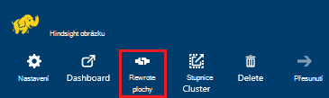
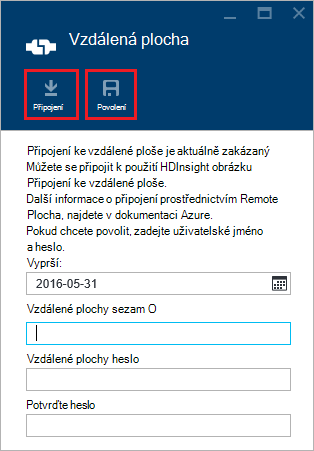
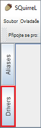
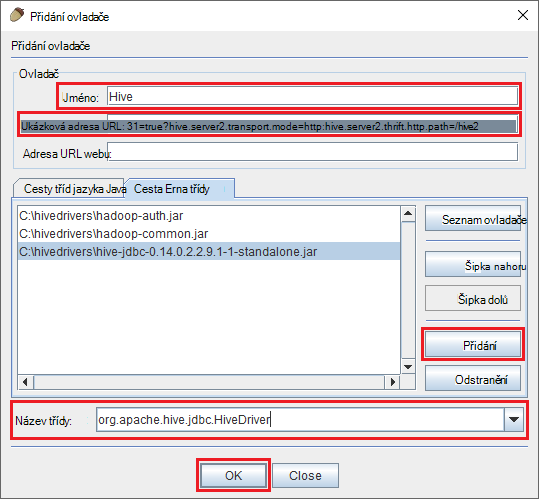
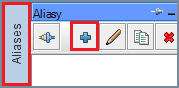
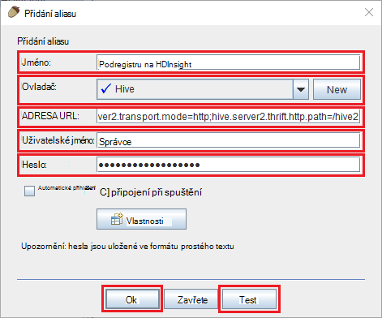
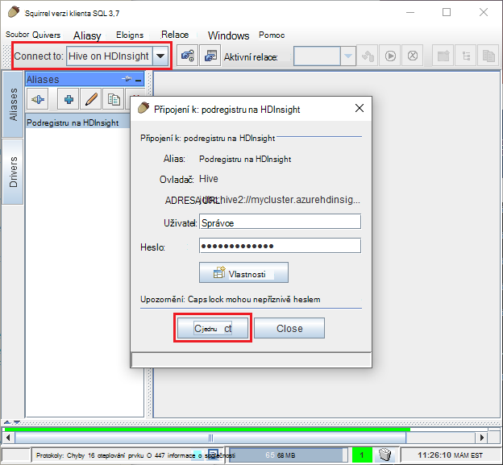
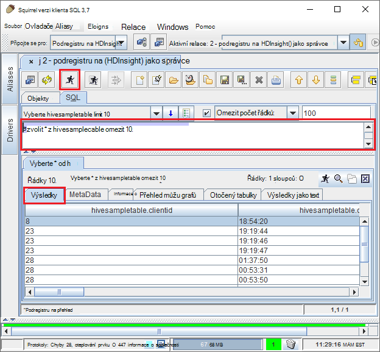

<properties
 pageTitle="Použití JDBC dotazu podregistru na Azure HDInsight"
 description="Naučte se používat JDBC se můžete připojit k podregistru na Azure HDInsight a vzdáleně spouštění dotazů dat uložených v cloudu."
 services="hdinsight"
 documentationCenter=""
 authors="Blackmist"
 manager="jhubbard"
 editor="cgronlun"
    tags="azure-portal"/>

<tags
 ms.service="hdinsight"
 ms.devlang="java"
 ms.topic="article"
 ms.tgt_pltfrm="na"
 ms.workload="big-data"
 ms.date="08/23/2016"
 ms.author="larryfr"/>

#Připojení k podregistru na Azure Hdinsightu pomocí ovladače podregistru JDBC

[AZURE.INCLUDE [ODBC-JDBC-selector](../../includes/hdinsight-selector-odbc-jdbc.md)]

V tomto dokumentu budou zjistěte, jak používat JDBC z aplikace Java vzdáleně odešlete podregistru dotazy k clusteru HDInsight. Naučíte se, jak připojit z klienta SQuirreL SQL a jak programové připojení z Java.

Další informace o rozhraní JDBC podregistru najdete v článku [HiveJDBCInterface](https://cwiki.apache.org/confluence/display/Hive/HiveJDBCInterface).

##Zjistit předpoklady pro

Kroky v tomto článku, budete potřebovat:

* Hadoop clusteru HDInsight. Na základě Linux nebo serveru s Windows clusterů budou fungovat.

* [SQuirreL SQL](http://squirrel-sql.sourceforge.net/). SQuirreL je klientská aplikace JDBC.

K vytvoření a spuštění aplikace Java příklad propojené v tomto článku, budete potřebovat.

* [Java vývojář Kit (JDK) verze 7](https://www.oracle.com/technetwork/java/javase/downloads/jdk7-downloads-1880260.html) nebo novější.

* [Apache Maven](https://maven.apache.org). Maven je projektu vytvořit systém Java projekty používanou projekt spojený s tohoto článku.

##Připojovací řetězec

Připojení JDBC HDInsight clusteru na Azure udělali delší než 443, a provoz je zabezpečená protokolem SSL. Veřejné brány, který clusterů sednout za přesměrovává přenosy HiveServer2 skutečně přijímá požadavky na port. Typický připojovací řetězec libovolný text to takto:

    jdbc:hive2://CLUSTERNAME.azurehdinsight.net:443/default;ssl=true?hive.server2.transport.mode=http;hive.server2.thrift.http.path=/hive2

__NÁZEV_CLUSTERU__ nahraďte názvem svůj cluster HDInsight.

##Ověřování

Po vytvoření připojení, musíte se pomocí HDInsight clusteru jménem a heslem správce ověření ho bráně obrázku. Při připojení klientů JDBC například SQuirreL SQL, je nutné zadat jménem a heslem správce v nastavení klienta.

Z aplikace Java je nutné použít jméno a heslo při vytváření připojení. Například následující kód jazyka Java otevře nové připojení s protokolem připojovací řetězec, správce jméno a heslo:

    DriverManager.getConnection(connectionString,clusterAdmin,clusterPassword);

##Připojení pomocí klienta SQuirreL SQL

SQuirreL SQL je JDBC klienta, který slouží ke vzdálené spouštění dotazů podregistru s svůj cluster HDInsight. Následující postup předpokládá, že jste již nainstalovali SQuirreL SQL a vás provede stahování a konfigurace ovladačů pro podregistru.

1. Zkopírujte podregistru JDBC ovladačů ze svého obrázku HDInsight.

    * __Na základě Linux HDInsight__pomocí následujících kroků stahovat soubory povinná sklenice.

        1. Vytvořte nový adresář, který bude obsahovat soubory. Například `mkdir hivedriver`.

        2. Z příkazového řádku, flám, prostředí PowerShell nebo jiných příkazového řádku změňte adresáře do nového adresáře a zkopírujte soubory z obrázku HDInsight pomocí následující příkazy.

                scp USERNAME@CLUSTERNAME:/usr/hdp/current/hive-client/lib/hive-jdbc*standalone.jar .
                scp USERNAME@CLUSTERNAME:/usr/hdp/current/hadoop-client/hadoop-common.jar .
                scp USERNAME@CLUSTERNAME:/usr/hdp/current/hadoop-client/hadoop-auth.jar .

            Nahraďte název SSH uživatelského účtu clusteru __uživatelské jméno__ . __NÁZEV_CLUSTERU__ nahraďte názvem clusteru HDInsight.

            > [AZURE.NOTE] V prostředí Windows musíte používat nástroj PSCP místo spojovací bod služby. Můžete si ji z [http://www.chiark.greenend.org.uk/~sgtatham/putty/download.html](http://www.chiark.greenend.org.uk/~sgtatham/putty/download.html).

    * Pro __HDInsight serveru s Windows__postupujte následujícím stahovat soubory sklenice.

        1. Z portálu Microsoft Azure vyberte svůj cluster HDInsight a potom vyberte ikonu __Vzdálená plocha__ .

            

        2. Na zásuvné vzdálené plochy umožňuje tlačítko __Připojit__ připojte se k němu. Pokud vzdálené plochy není povolená, umožňuje formuláři zadejte uživatelské jméno a heslo, pak zaškrtněte políčko __Povolit__ povolit připojení ke vzdálené ploše pro clusteru.

            

            Po výběru __Připojit__, bude možné stáhnout soubor RDP. Pomocí tohoto souboru vzdálené plochy klienta. Po zobrazení výzvy, použijte uživatelské jméno a heslo, které jste zadali pro přístup ke vzdálené ploše.

        3. Po připojení, zkopírujte následující soubory z relace vzdálené plochy do místního počítače. Zapište je do místní adresář s názvem `hivedriver`.

            * C:\apps\dist\hive-0.14.0.2.2.9.1-7\lib\hive-JDBC-0.14.0.2.2.9.1-7-Standalone.JAR
            * C:\apps\dist\hadoop-2.6.0.2.2.9.1-7\share\hadoop\common\hadoop-Common-2.6.0.2.2.9.1-7.JAR
            * C:\apps\dist\hadoop-2.6.0.2.2.9.1-7\share\hadoop\common\lib\hadoop-auth-2.6.0.2.2.9.1-7.JAR

            > [AZURE.NOTE] Číslo verze součástí cesty a názvy můžou být odlišná na svůj cluster.

        4. Odpojte relace vzdálené plochy po dokončení kopírování souborů.

3. Spusťte aplikaci SQuirreL SQL. V levé části okna vyberte __ovladače__.

    

4. Ikony v horní části dialogu __ovladače__ , vyberte __+__ ikonu k vytvoření nového ovladače.

    

5. V dialogovém okně Přidat ovladač přidejte následující informace.

    * __Název__: podregistru
    * __Ukázková adresa URL__: jdbc:hive2://localhost:443/default;ssl=true?hive.server2.transport.mode=http;hive.server2.thrift.http.path=/hive2
    * __Navíc cesty tříd__: použití dříve stáhli na tlačítko Přidat pro přidání sklenice souborů
    * __Název třídy__: org.apache.hive.jdbc.HiveDriver

    

    Klikněte na __OK__ uložte toto nastavení.

6. Na levé straně okna SQuirreL SQL vyberte __aliasy__. Klikněte __+__ ikonu vytvářet nové připojení aliasy.

    

7. Použijte tyto hodnoty k zobrazení dialogového okna __Přidat Alias__ .

    * __Název__: podregistru na HDInsight
    * __Ovladač__: pomocí rozevíracího seznamu vyberte ovladač __podregistru__
    * __Adresa URL__: jdbc:hive2://CLUSTERNAME.azurehdinsight.net:443/default;ssl=true?hive.server2.transport.mode=http;hive.server2.thrift.http.path=/hive2

        __NÁZEV_CLUSTERU__ nahraďte názvem svůj cluster HDInsight.

    * __Uživatelské jméno__: název účtu přihlášení obrázku pro svůj cluster HDInsight. Výchozí hodnota je `admin`.
    * __Heslo__: heslo k účtu přihlášení obrázku. To je heslo, které jste zadali při vytváření clusteru HDInsight.

    

    Pomocí tlačítka __Test__ k ověření, že funguje připojení. Když __připojení k: podregistru na HDInsight__ , zobrazí se dialog, vyberte __Připojit__ k provedení testu. Pokud test podaří, zobrazí se dialogové okno __připojení úspěšně__ .

    Uložte alias připojení pomocí na tlačítko __Ok__ v dolní části dialogového okna __Přidat Alias__ .

8. V rozevíracím seznamu __připojit k__ v horní části SQuirreL SQL vyberte __podregistru na HDInsight__. Po zobrazení výzvy vyberte __Připojit__.

    

9. Po připojení, zadejte následující dotaz do dialogového okna dotazu SQL a potom vyberte ikonu __Spustit__ . V oblasti výsledky by měl zobrazit výsledky dotazu.

        select * from hivesampletable limit 10;

    

##Připojení z příkladu aplikace Java

Příklad použití Java klienta dotazu podregistru na HDInsight je k dispozici [https://github.com/Azure-Samples/hdinsight-java-hive-jdbc](https://github.com/Azure-Samples/hdinsight-java-hive-jdbc). Postupujte podle pokynů v úložišti k vytvoření a spuštění vzorku.

##Řešení potíží

### Při pokusu o otevření připojení k SQL došlo k neočekávané chybě.

__Příznaky__: při připojování k HDInsight obrázku, který je verze 3.3 nebo 3.4, může zobrazit chybová, že došlo k neočekávané chybě. Zásobníku k této chybě bude začínat následující řádky:

    java.util.concurrent.ExecutionException: java.lang.RuntimeException: java.lang.NoSuchMethodError: org.apache.commons.codec.binary.Base64.<init>(I)V
    at java.util.concurrent.FutureTas...(FutureTask.java:122)
    at java.util.concurrent.FutureTask.get(FutureTask.java:206)

__Příčina__: Tato chyba způsobená neshodu ve verzi souboru commons codec.jar používaného SQuirreL a je vyžadován součástmi podregistru JDBC stahují z obrázku HDInsight.

__Řešení__: Chcete-li opravit tuto chybu, použijte následující kroky.

1. Commons kodek sklenice moct soubor stáhněte z svůj cluster HDInsight.

        scp USERNAME@CLUSTERNAME:/usr/hdp/current/hive-client/lib/commons-codec*.jar ./commons-codec.jar

2. Ukončete SQuirreL a potom přejděte k části adresáři nainstalovanou SQuirreL v počítači. V adresáři SquirreL v části `lib` adresáře, nahradit stávající codec.jar commons s tím stahují z obrázku HDInsight.

3. Restartujte SQuirreL. Chyba by měla proběhnout už při připojování k podregistru na HDInsight.

##Další kroky

Teď, když jste se naučili používání JDBC pro práci s podregistru, použijte následující odkazy, které můžete prozkoumat další způsoby, jak pracovat s Azure HDInsight.

* [Odeslání dat do HDInsight](hdinsight-upload-data.md)
* [Použití podregistru s HDInsight](hdinsight-use-hive.md)
* [Použití Prasátko s HDInsight](hdinsight-use-pig.md)
* [Použití MapReduce úlohy s HDInsight](hdinsight-use-mapreduce.md)
