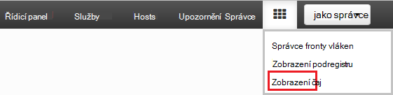
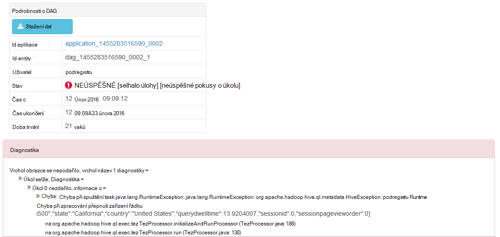

<properties
pageTitle="Použití zobrazení Tez Ambari s HDInsight | Azure"
description="Zjistěte, jak můžete pomocí zobrazení Ambari Tez ladění Tez úlohy na HDInsight."
services="hdinsight"
documentationCenter=""
authors="Blackmist"
manager="jhubbard"
editor="cgronlun"/>

<tags
ms.service="hdinsight"
ms.devlang="na"
ms.topic="article"
ms.tgt_pltfrm="na"
ms.workload="big-data"
ms.date="10/04/2016"
ms.author="larryfr"/>

# Ladění Tez úlohy na HDInsight pomocí Ambari zobrazení

Uživatelské rozhraní webu Ambari pro HDInsight obsahuje Tez zobrazení, které mohou sloužit k pochopení a ladění úlohy, které používají Tez jako modul spuštění. Zobrazení Tez umožňuje vizualizovat jako graf připojeného položek, procházejte všechny požadované položky a načíst Statistika a informace o protokolování.

> [AZURE.NOTE] Informace v tomto dokumentu jsou specifické pro clusterů na základě Linux HDInsight. Informace o ladění Tez úlohy pomocí serveru s Windows Hdinsightu najdete v tématu [použití Tez uživatelského rozhraní pro ladění Tez úlohy na serveru s Windows HDInsight](hdinsight-debug-tez-ui.md).

## Zjistit předpoklady pro

* Na základě Linux HDInsight obrázku. Postup pro vytvoření nového obrázku najdete v článku [Začínáme s používáním na základě Linux HDInsight](hdinsight-hadoop-linux-tutorial-get-started.md).

* Moderní webového prohlížeče, který podporuje HTML5.

## Principy Tez

Tez je extensible rámec pro zpracování dat v Hadoop poskytující rychlosti větší než tradiční MapReduce zpracování. Na základě Linux HDInsight clusterů je výchozí modul podregistru.

Při práci se odešle ke Tez, vytvoří směrovány Acyklické grafu (DAG) popisující pořadí provádění akcí vyžadované projektu. Jednotlivé akce se označují jako vrcholy a spusťte část celkové projektu. Skutečné provádění práce označená vrcholu nazývá úkolu a může být rozvržena více uzlů v clusteru.

### Principy Tez zobrazení

Zobrazení Tez poskytuje informace o procesů, které používáte, nebo jste dříve spustili pomocí Tez. Umožňuje zobrazit DAG generovaných Tez, jak je distribuovaná pomocí clusterů čítače například paměti používané úkoly a vrcholy a informace o chybě. Můžou nabízet užitečné informace v následujících situacích:

* Sledování dlouho probíhajících procesy, zobrazení průběhu mapy a zmenšení úkoly.

* Analýza historických dat z hlediska úspěšném nebo neúspěšném procesy se dozvíte, jak lze zlepšit zpracování nebo proč se nezdařila.

## Generovat DAG

Zobrazení Tez bude obsahovat pouze data, pokud projektu, který používá modul Tez právě probíhá nebo byl spuštěn v minulosti. Jednoduché dotazy podregistru obvykle lze přeložit bez použití Tez, ale složitější dotazy, které se filtrování, seskupování, řazení, spojení atd., obvykle potřebují Tez.

Spustit dotaz podregistru, který bude proveden pomocí Tez pomocí následujících kroků.

1. Ve webovém prohlížeči přejděte na https://CLUSTERNAME.azurehdinsight.net, kde __NÁZEV_CLUSTERU__ je název svůj cluster HDInsight.

2. V nabídce v horní části stránky vyberte ikonu __zobrazení__ . Takto vypadá řady čtverců. V rozevíracím seznamu, které se zobrazí vyberte __podregistru zobrazení__. 

    

3. Při zobrazení podregistru zatížení, vložte následující do editoru dotazů a potom klikněte na __Spustit__.

        select market, state, country from hivesampletable where deviceplatform='Android' group by market, country, state;
    
    Po dokončení projektu byste měli vidět záhlaví zobrazí v části __Obrázku výsledků dotazu__ . Výsledky by měly být podobně jako tento
    
        market  state       country
        en-GB   Hessen      Germany
        en-GB   Kingston    Jamaica
        
4. Vyberte kartu __protokolu__ . Zobrazí se informace podobná této:
    
        INFO : Session is already open
        INFO :

        INFO : Status: Running (Executing on YARN cluster with App id application_1454546500517_0063)

    Uložte hodnotu __id aplikace__ jako to se použije v další části.

## Použití zobrazení vedle Tez

1. V nabídce v horní části stránky vyberte ikonu __zobrazení__ . V rozevíracím seznamu, které se zobrazí vyberte __Tez zobrazení__.

    

2. Při zobrazení Tez načtení, zobrazí se seznam DAGs, které jsou aktuálně spuštěných nebo byly spustili na clusteru. Výchozí zobrazení obsahuje Dag název, Id, odesílatele, stav, čas zahájení, koncový čas, dobu trvání, ID aplikace a fronty. Další sloupce lze přidat pomocí ikony ozubeného kola v pravé části stránky.

    

3. Pokud máte jenom jednu položku, budou pro dotaz, který jste spustili v předchozí části. Pokud máte více položek, můžete si ji vyhledat podle zadání ID aplikace do pole __ID aplikace__ a stiskněte klávesu enter.

4. Vyberte __Název Dag__. Zobrazí se informace o DAG i možnost stáhnout zip JSON soubory, které obsahují informace o DAG.

    

5. Nad __DAG podrobnosti__ je několik odkazů, které můžete použít k zobrazení informací o DAG.

    * __DAG čítače__ zobrazí statistických informací pro tento DAG.
    
    * __Grafické zobrazení__ nabízí grafické znázornění tento DAG.
    
    * __Všechny vrcholy__ seznam vrcholů v tomto DAG.
    
    * __Všechny úkoly__ zobrazí seznam úkolů na všechny vrcholy v tomto DAG.
    
    * __Všechny TaskAttempts__ zobrazuje informace o pokusů o spuštění úkoly pro tento DAG.
    
    > [AZURE.NOTE] Pokud posuňte zobrazení sloupců vrcholy, úkoly a TaskAttempts Všimněte si, že jsou odkazy zobrazit __čítače__ a __Zobrazit nebo stáhnout protokoly__ pro každý řádek.

    Pokud došlo k chybě pomocí úlohy, podrobnosti DAG se zobrazí stav VADNÝ, spolu s odkazy na informace o nezdařeném uložení úkolu. Diagnostické informace se zobrazí pod DAG podrobnosti.
    
    

7. Vyberte __grafické zobrazení__. Zobrazí se grafické znázornění DAG. Umístěte ukazatel myši každý vrchol v zobrazení tak, aby informace o.

    

8. Po kliknutí na vrcholu načte __Vrchol podrobnosti__ pro danou položku. Klikněte na vrchol obrazce __Map 1__ a zobrazte podrobnosti pro tuto položku.

    

9. Poznámka: teď mají odkazy v horní části stránky, které se vztahují k vrcholy a úkoly.

    > [AZURE.NOTE] Na této stránce můžete taky dospět tak, že přejdete zpět na __DAG podrobnosti__, výběrem __Vrchol podrobnosti__a klepnutím na vrchol obrazce __Map 1__ .

    * __Vrchol čítače__ zobrazuje informace výpočtového pro tento vrchol obrazce.
    
    * __Úkoly__ se zobrazí úkoly pro tento vrchol obrazce.
    
    * __Pokusí úkolu__ zobrazuje informace o pokusů o spuštění úlohy pro tento vrchol obrazce.
    
    * __Zdroje propadů__ slouží k zobrazení zdrojů dat a propadů pro tento vrchol obrazce.

    > [AZURE.NOTE] Jako s do předchozí nabídky se budou posunovat zobrazované sloupce pro úkoly, pokusy o úkolu, zdroje a Sinks__ zobrazíte odkazy na další informace pro každou položku.

10. Vyberte __úkoly__a potom vyberte položku s názvem __00_000000__. Tím zobrazíte __Podrobnosti úkolu__ pro daný úkol. Pomocí této obrazovky můžete zobrazit __Čítače úkolu__ a __Pokusy o úkolu__.

    

## Další kroky

Teď, když jste se naučili jak můžete pomocí zobrazení Tez, další informace o [Používání podregistru na HDInsight](hdinsight-use-hive.md).

Podrobné technické informace o Tez naleznete na [stránce Tez na Hortonworks](http://hortonworks.com/hadoop/tez/).

Další informace o použití Ambari s Hdinsightu najdete v článku [Správa HDInsight clusterů pomocí rozhraní webových Ambari](hdinsight-hadoop-manage-ambari.md)
