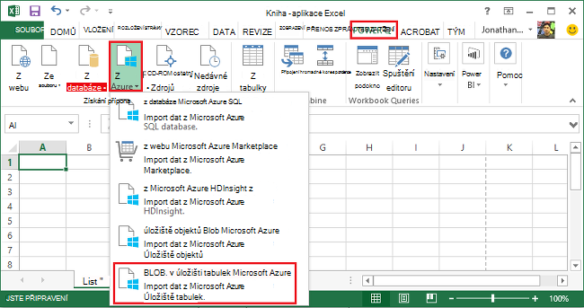
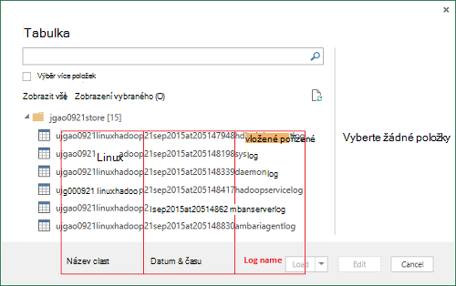
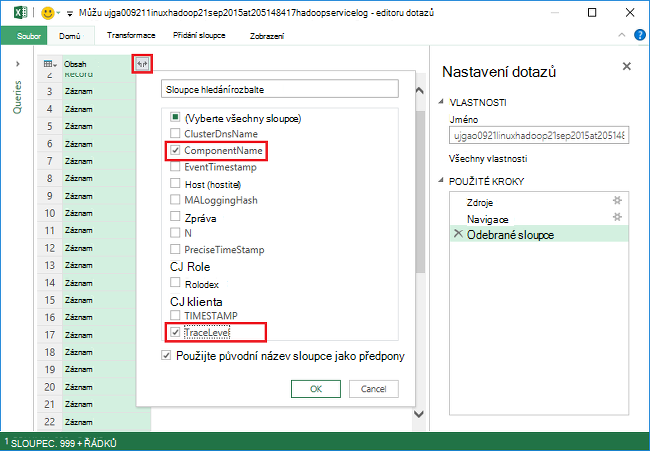
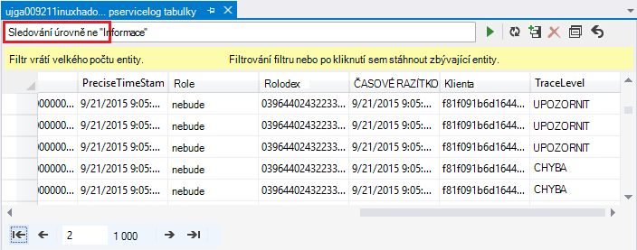
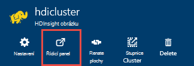
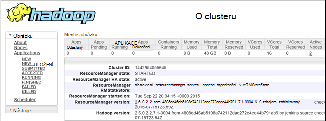

<properties
    pageTitle="Ladění Hadoop v HDInsight: protokoly zobrazit a interpretovat chybové zprávy | Microsoft Azure"
    description="Informace o chybové zprávy, které můžou zobrazit při správě HDInsight pomocí prostředí PowerShell a kroky, kterými můžete obnovit."
    services="hdinsight"
    tags="azure-portal"
    editor="cgronlun"
    manager="jhubbard"
    authors="mumian"
    documentationCenter=""/>

<tags
    ms.service="hdinsight"
    ms.workload="big-data"
    ms.tgt_pltfrm="na"
    ms.devlang="na"
    ms.topic="article"
    ms.date="09/02/2016"
    ms.author="jgao"/>

# Analýza HDInsight protokoly

Každý Hadoop cluster v Azure HDInsight má účet Azure úložiště použít jako výchozí systém souborů. Úložiště účtu se označuje jako výchozí účet úložiště. Shluk používá úložiště tabulek Azure a úložiště objektů Blob na výchozí účet úložiště uložit jeho protokoly.  Výchozí účet úložiště pro svůj cluster najdete v tématu [Správa Hadoop clusterů HDInsight](hdinsight-administer-use-management-portal.md#find-the-default-storage-account). Protokoly uchovávat v účtu úložiště i po odstranění clusteru.

##Protokoly zapisovat tabulek Azure

Protokoly zapisovat tabulek Azure poskytují jednu úroveň pochopení co se stalo s HDInsight obrázku.

Při vytváření clusteru HDInsight 6 tabulky se automaticky vytvoří na základě Linux clusterů úložiště tabulek výchozí:

- hdinsightagentlog
- Syslog
- daemonlog
- hadoopservicelog
- ambariserverlog
- ambariagentlog

3 tabulky vytvořené pro clusterů serveru s Windows:

- setuplog: protokolu událostí/výjimky při vytváření a nastavování clusterů HDInsight.
- hadoopinstalllog: protokolu událostí/výjimky při instalaci Hadoop na clusteru. V této tabulce mohou být užitečné při ladění problémům souvisejícím s clusterů vytvořené pomocí vlastní parametry.
- hadoopservicelog: protokolu událostí/výjimky zaznamenal všechny Hadoop služby. V této tabulce mohou být užitečné při ladění problémům souvisejícím s chyby úlohy na clusterů HDInsight.

Názvy souborů tabulky jsou **u<ClusterName>DDMonYYYYatHHMMSSsss<TableName>**.

V této tabulce obsahuje následující pole:

- ClusterDnsName
- Součásti
- EventTimestamp
- Host (hostitel)
- MALoggingHash
- Zpráva
- N
- PreciseTimeStamp
- Role
- RowIndex
- Klienta
- ČASOVÉ RAZÍTKO
- TraceLevel

### Nástroje pro přístup k protokoly

Dostupné jsou mnoho nástroje pro přístup k datům v této tabulce:

-  Visual Studio
-  Průzkumník Azure úložiště
-  Power Query pro Excel

#### Pomocí Power Query pro Excel

Power Query můžete nainstalovat z [www.microsoft.com/en-us/download/details.aspx?id=39379]( http://www.microsoft.com/en-us/download/details.aspx?id=39379). Podívejte se na stránku Stáhnout požadavky na systém

**Chcete-li pomocí Power Query můžete otevřít a analyzovat protokolu služby**

1. Otevřete **Aplikaci Microsoft Excel**.
2. V nabídce **Power Query** klikněte na **Z Azure**a potom klikněte na **úložiště z Microsoft Azure tabulek**.
 
    
3. Zadejte název účtu úložiště. To může být krátký název nebo plně kvalifikovaný název domény.
4. Zadejte klíč účtu úložiště. Zobrazí se seznam tabulky:

    
5. V tabulce hadoopservicelog v **navigačním** podokně klikněte pravým tlačítkem myši a vyberte **Upravit**. Zobrazí se 4 sloupci. Volitelně můžete odstraníte sloupce **Klíč oddílu**, **Klíče řádku**a **časové razítko** vyberte je a následným kliknutím na **Odebrat sloupce** z možnosti na pásu karet.
6. Kliknutím na ikonu Rozbalit ve sloupci obsahu vyberte sloupce, které chcete importovat do tabulky aplikace Excel. Pro tato ukázka se rozhodli, že TraceLevel a součásti: ho můžete získávat některé základní informace, podle kterého součásti měli problémy.

    
7. Klikněte na **OK** importovat data.
8. Vyberte sloupce **TraceLevel**, Role a **součásti** a pak klikněte na **Seskupit podle** ovládacího prvku pásu karet.
9. Klikněte na tlačítko **OK** v dialogovém okně Seskupit podle
10. Klikněte na** použít a zavřít**.
 
Teď můžete Excel filtrovat a seřadit podle potřeby. Chcete samozřejmě přecházet na podrobnější problémy při jejich vzniku, ale výběru a seskupování sloupce jsme je popsali výše poskytuje dobré vzhledu co se děje se službami Hadoop zařadit ostatních sloupců (například zprávy). Stejné myšlenky se dají použít s setuplog a hadoopinstalllog tabulkami.

#### Pomocí aplikace Visual Studio

**Použití aplikace Visual Studio**

1. Otevřete aplikaci Visual Studio.
2. V nabídce **Zobrazit** klikněte na položku **Průzkumník cloudu**. Nebo jednoduše klikněte na **kombinaci kláves CTRL +\, kombinaci kláves CTRL + X**.
3. Z **Průzkumníka cloudu**vyberte **Typy zdrojů**.  K dispozici možnost je **Skupiny zdrojů**.
4. Rozbalte **Úložiště účty**výchozí účet úložiště pro svůj cluster a **tabulky**.
5. Poklikejte na **hadoopservicelog**.
6. Přidání filtru. Příklad:
    
        TraceLevel eq 'ERROR'

    

    Další informace o vytváření filtrů najdete v článku [Vytvářet řetězcích filtru pro návrháře tabulky](../vs-azure-tools-table-designer-construct-filter-strings.md).
 
##Aby došlo k úložišti objektů Blob Azure zápisu protokolů

[Protokoly zapisovat tabulek Azure](#log-written-to-azure-tables) poskytují jednu úroveň pochopení co se stalo s HDInsight obrázku. V této tabulce však nenabízejí protokoly úrovni úkolu, které mohou být užitečné pro přechod na další potíže při jejich vzniku. Pokud chcete, aby tato další úroveň podrobností, HDInsight clusterů nakonfigurovaná k zápisu protokolů úkolu ke svému účtu úložiště objektů Blob pro odeslání prostřednictvím Templeton úlohy. Prakticky to znamená úlohy zaslat pomocí rutin prostředí Microsoft Azure nebo odeslání API úlohy .NET, ne úlohy ověřeny pomocí RDP/příkazovém-řádku přístup ke clusteru. 

Chcete-li zobrazit protokoly, najdete v článku [aplikace Access vláken přihlášení na základě Linux HDInsight](hdinsight-hadoop-access-yarn-app-logs-linux.md).

Další informace o protokolech aplikací najdete v článku [Správa Simplifying přihlášení uživatele a přístupu v vláken](http://hortonworks.com/blog/simplifying-user-logs-management-and-access-in-yarn/).
 
 
## Zobrazení protokolů zdraví a úlohy obrázku

###Přístup k Hadoop uživatelského rozhraní

Z portálu Microsoft Azure klikněte na název clusteru HDInsight otevřete zásuvné obrázku. Z zásuvné obrázku klikněte na **řídicí panel**.

Po zobrazení výzvy zadejte přihlašovací údaje správce obrázku. V konzole dotazu, která se otevře klikněte na **Uživatelské rozhraní Hadoop**.

###Přístup k vláken uživatelského rozhraní

Z portálu Microsoft Azure klikněte na název clusteru HDInsight otevřete zásuvné obrázku. Z zásuvné obrázku klikněte na **řídicí panel**. Po zobrazení výzvy zadejte přihlašovací údaje správce obrázku. V konzole dotazu, která se otevře klikněte na **Uživatelské rozhraní vláken**.

Uživatelské rozhraní vláken můžete provádět následující akce:

* **Stav obrázku**. V levém podokně rozbalte **obrázku**a kliknout na **o produktu**. Tato prezentace clusteru podrobnosti o stavu jako celkové rozdělené paměti, jádra použili, stav správce prostředků clusteru, clusteru verze atd.

    

* Pokud **uzel stav**. V levém podokně rozbalte **obrázku**a klikněte na tlačítko **uzly**. Seznam všech uzlů v protokolu HTTP adresu jednotlivých uzlech clusteru zdroje přidělené každý uzel atd.

* **Sledování stavu úloh**. V levém podokně rozbalte **obrázku**a klikněte na **aplikace** zobrazíte všechny úlohy v clusteru. Pokud chcete zobrazit úlohy v konkrétním kraji (například spuštění nové, odeslané, atd.), klikněte na příslušný odkaz v části **aplikace**. Můžete dál klikněte na název projektu chcete zjistit víc informací o projektu takové včetně výstup protokoly, atd.

###Přístup k rozhraní HBase

Z portálu Microsoft Azure klikněte na název clusteru HDInsight HBase otevřete zásuvné obrázku. Z zásuvné obrázku klikněte na **řídicí panel**. Po zobrazení výzvy zadejte přihlašovací údaje správce obrázku. V konzole dotazu, která se otevře klikněte na **Uživatelské rozhraní HBase**.

## Kódy chyb HDInsight

Chybové zprávy rozpis v této části jsou poskytuje pomoc uživatelům Hadoop v Azure HDInsight pochopení možných chybové podmínky, které může dojít při správě služby pomocí prostředí PowerShell Azure orientační na kroky, které lze obnovit z chyby.

Některé z těchto chybových zpráv může taky vypadat jinak portálu Azure při pracovní postup slouží ke správě clusterů HDInsight. Další chybové zprávy se můžete setkat, ale existují méně podrobného kvůli omezujících akcí může poskytnout kontext. Další chybové zprávy jsou k dispozici v kontextu, kde je zjevných omezení rizik. 

### AtleastOneSqlMetastoreMustBeProvided
- **Popis**: Zadejte podrobnosti o databázi Azure SQL pro aspoň jednou součástí mohli použít vlastní nastavení pro podregistru a Oozie metastores.
- **Řešení**: uživatel musí zadat platné metastore SQL Azure a opakování žádosti.  

### AzureRegionNotSupported
- **Popis**: Nelze vytvořit obrázku v oblasti *nameOfYourRegion*. Pomocí platné HDInsight oblast a opakování žádosti.
- **Řešení**: zákazníka vytvořte požadovanou oblast obrázku je aktuálně podporuje: jihovýchodní Asie, západní Europe, severní Europe, východoasijských USA nebo západní USA.  

### ClusterContainerRecordNotFound
- **Popis**: server nelze najít záznam požadovaného obrázku.  
- **Řešení**: opakujte.

### ClusterDnsNameInvalidReservedWord
- **Popis**: clusteru DNS název *yourDnsName* je neplatný. Zkontrolujte, zda název začíná řetězcem a alfanumerický a může obsahovat pouze "-" speciální znak  
- **Řešení**: Ujistěte se, že jste použili platné názvy DNS u svého obrázku, který spustí a končí alfanumerický a obsahuje žádné zvláštní znaky jedině pomlčku "-" a akci opakujte.

### ClusterNameUnavailable
- **Popis**: název clusteru *yourClusterName* není k dispozici. Vyberte jiný název.  
- **Řešení**: uživatel neměli určit název_clusteru, které jsou jedinečné existují a opakování. Pokud uživatel používá portálu, uživatelského rozhraní budou upozornit je název clusteru používá při vytvoření kroky.

### ClusterPasswordInvalid
- **Popis**: hesla clusteru je neplatný. Heslo musí mít délku nejméně 10 znaků a musí obsahovat aspoň jedno číslo, velké písmeno, malé písmeno a speciální znak bez mezer a nesmí obsahovat uživatelské jméno v rámci od něj.  
- **Řešení**: zadání hesla platné obrázku a opakujte.

### ClusterUserNameInvalid
- **Popis**: uživatelské jméno clusteru je neplatný. Zkontrolujte, zda uživatelské jméno neobsahuje speciální znaky nebo mezery.  
- **Řešení**: Zadejte platný clusteru uživatelské jméno a opakujte.

### ClusterUserNameInvalidReservedWord
- **Popis**: clusteru DNS název *yourDnsClusterName* je neplatný. Zkontrolujte, zda název začíná řetězcem a alfanumerický a může obsahovat pouze "-" speciální znak  
- **Řešení**: Zadejte platný uživatelské jméno clusteru DNS a opakujte.

### ContainerNameMisMatchWithDnsName
- **Popis**: jméno Container na URI *yourcontainerURI* a DNS název *yourDnsName* v textu žádosti o musí být stejný.  
- **Řešení**: Ujistěte se, že kontejneru název a název DNS jsou stejné a opakujte.

### DataNodeDefinitionNotFound
- **Popis**: Konfigurace neplatné clusteru. Nelze najít všechny definice uzel dat uzel velikost.  
- **Řešení**: opakujte.

### DeploymentDeletionFailure
- **Popis**: odstranění nasazení se nezdařilo clusteru  
- **Řešení**: opakování operace odstranění se nezobrazuje.

### DnsMappingNotFound
- **Popis**: Chyba konfigurace služby. Požadované DNS informace o mapování nebyl nalezen.  
- **Řešení**: Odstraňte obrázku a vytvoření nového clusteru.

### DuplicateClusterContainerRequest
- **Popis**: Duplicitní pokusu o vytvoření kontejneru obrázku. Záznam pro *nameOfYourContainer* existuje ale Etags se neshodují.
- **Řešení**: Zadejte jedinečný název pro kontejner a opakujte vytvořit.

### DuplicateClusterInHostedService
- **Popis**: hostovanou službu *nameOfYourHostedService* již obsahuje clusteru. Hostovanou službu nesmí obsahovat více clusterů  
- **Řešení**: hostovat obrázku v jiném hostovanou službu.

### FailureToUpdateDeploymentStatus
- **Popis**: server nelze aktualizovat stav nasazení obrázku.  
- **Řešení**: opakujte. V takovém případě tisknutím kontaktujte šablon stylů CSS.

### HdiRestoreClusterAltered
- **Popis**: clusteru *yourClusterName* odstranil jako součást správy. Vytvořte clusteru.
- **Řešení**: znovu clusteru.

### HeadNodeConfigNotFound
- **Popis**: Konfigurace neplatné clusteru. Konfigurace povinný hlavy uzel nebyl nalezen uzel velikostí.
- **Řešení**: opakujte.

### HostedServiceCreationFailure
- **Popis**: Nelze vytvořit hostovanou službu *nameOfYourHostedService*. Opakujte žádost.  
- **Řešení**: opakování žádosti.

### HostedServiceHasProductionDeployment
- **Popis**: hostovanou službu *nameOfYourHostedService* už má provozní nasazení. Hostovanou službu nesmí obsahovat více nasazení výroby. Opakování žádosti o s názvem jiný obrázku.
- **Řešení**: použijte název jiné obrázku a opakování žádosti.

### HostedServiceNotFound
- **Popis**: hostované služby *nameOfYourHostedService* pro clusteru nebyl nalezen.  
- **Řešení**: Pokud je cluster v chybovém stavu, odstraňte ji a pak to zkuste znova.

### HostedServiceWithNoDeployment
- **Popis**: hostovanou službu *nameOfYourHostedService* má žádné přidružené nasazení.  
- **Řešení**: Pokud je cluster v chybovém stavu, odstraňte ji a pak to zkuste znova.

### InsufficientResourcesCores
- **Popis**: SubscriptionId *yourSubscriptionId* neměl jádra doleva k vytvoření obrázku *yourClusterName*. Povinné: *resourcesRequired*, k dispozici: *resourcesAvailable*.  
- **Řešení**: uvolnili prostředky ve vašem předplatném nebo zvětšit dostupných k předplatnému zdrojů a zkuste vytvořit clusteru znova.

### InsufficientResourcesHostedServices
- **Popis**: ID předplatného *yourSubscriptionId* nemá kvóty pro nové HostedService k vytvoření obrázku *yourClusterName*.  
- **Řešení**: uvolnili prostředky ve vašem předplatném nebo zvětšit dostupných k předplatnému zdrojů a zkuste vytvořit clusteru znova.

### InternalErrorRetryRequest
- **Popis**: došlo k interní chybě. Opakujte žádost.  
- **Řešení**: opakování žádosti.

### InvalidAzureStorageLocation
- **Popis**: Azure úložiště umístění *dataRegionName* není platné umístění. Ujistěte se, že oblasti správné a opakujte žádost.
- **Řešení**: Vyberte úložiště, který podporuje HDInsight, zkontrolujte, že svůj cluster nachází na prezentaci a opakujte.

### InvalidNodeSizeForDataNode
- **Popis**: neplatné OM velikost datových uzlů. Pouze "Velké OM" velikost je podporovaný pro všechny uzly data.  
- **Řešení**: Zadejte velikost podporované uzel uzel dat a akci opakujte.

### InvalidNodeSizeForHeadNode
- **Popis**: neplatné OM velikost hlavního uzlu. Pouze "ExtraLarge OM" velikost je podporovaný pro hlavního uzlu.  
- **Řešení**: Zadejte velikost podporované uzel hlavního uzlu a opakujte

### InvalidRightsForDeploymentDeletion
- **Popis**: ID předplatného *yourSubscriptionId* použit nemá dostatečná oprávnění k provedení operace odstranění pro clusteru *yourClusterName*.  
- **Řešení**: Pokud je cluster v chybovém stavu, umístěte jej a zkuste to znovu.  

### InvalidStorageAccountBlobContainerName
- **Popis**: externí úložiště účtu objektů blob kontejneru název *yourContainerName* je neplatný. Zkontrolujte název začíná písmenem a obsahuje pouze malá písmena, číslice a přerušované čáry.  
- **Řešení**: Zadejte název kontejneru platné úložné účtu objektů blob a opakujte.

### InvalidStorageAccountConfigurationSecretKey
- **Popis**: Konfigurace účtu externí úložiště *yourStorageAccountName* je potřeba mít tajné klíčové údaje nastavení.  
- **Řešení**: Zadejte platný tajné klíč účtu úložiště a opakujte.

### InvalidVersionHeaderFormat
- **Popis**: verze záhlaví *yourVersionHeader* není platný formát yyyy mm dd.  
- **Řešení**: Zadejte platný formát pro záhlaví verze a opakování žádosti.

### MoreThanOneHeadNode
- **Popis**: Konfigurace neplatné clusteru. Najdete víc konfigurace hlavního uzlu.  
- **Řešení**: Úprava konfigurace tak, aby jeden hlavy uzel onloy není zadán.

### OperationTimedOutRetryRequest
- **Popis**: operaci nelze dokončit v rámci doby povolené nebo maximální počet opakování pokusí možné. Opakujte žádost.  
- **Řešení**: opakování žádosti.

### ParameterNullOrEmpty
- **Popis**: Parametr *yourParameterName* nesmí být null nebo prázdná.  
- **Řešení**: Zadejte platnou hodnotu parametru.

### PreClusterCreationValidationFailure
- **Popis**: jeden nebo více vstupů žádost o vytvoření obrázku není platný. Zkontrolujte, jestli vstupní hodnoty jsou správné a opakování žádosti.  
- **Řešení**: Zkontrolujte, jestli vstupní hodnoty jsou správné a opakování žádosti.

### RegionCapabilityNotAvailable
- **Popis**: oblast funkce není k dispozici pro oblast *yourRegionName* a ID předplatného *yourSubscriptionId*.  
- **Řešení**: Zadejte oblast, která podporuje clusterů HDInsight. Jsou veřejně podporovaných oblastí: jihovýchodní Asie, západní Europe, severní Europe, východoasijských USA nebo západní USA.

### StorageAccountNotColocated
- **Popis**: úložiště účtu *yourStorageAccountName* je v oblasti *currentRegionName*. By měl být stejný jako oblast obrázku *yourClusterRegionName*.  
- **Řešení**: Zadejte účet úložiště ve stejné oblasti, která je svůj cluster v nebo pokud se již data účtu úložiště, vytvoření nového clusteru ve stejné oblasti jako existujícího účtu úložiště. Pokud používáte portálu uživatelské rozhraní upozorníte, je tento problém předem.

### SubscriptionIdNotActive
- **Popis**: vzhledem k tomu ID předplatného *yourSubscriptionId* není aktivní.  
- **Řešení**: znovu aktivovat předplatné nebo získejte nové platné předplatné.

### SubscriptionIdNotFound
- **Popis**: ID předplatného *yourSubscriptionId* nebyl nalezen.  
- **Řešení**: Ověřte, zda je platný ID předplatného a opakujte.

### UnableToResolveDNS
- **Popis**: nelze přeložit DNS *yourDnsUrl*. Zkontrolujte, zda že je k dispozici úplnou adresu URL pro koncový bod objektů blob.  
- **Řešení**: Zadejte adresu URL platné objektů blob. Adresa URL musí být plně platné, včetně začínající *http://* a končící *.com*.

### UnableToVerifyLocationOfResource
- **Popis**: nelze ověřit umístění zdroje *yourDnsUrl*. Zkontrolujte, zda že je k dispozici úplnou adresu URL pro koncový bod objektů blob.  
- **Řešení**: Zadejte adresu URL platné objektů blob. Adresa URL musí být plně platné, včetně začínající *http://* a končící *.com*.

### VersionCapabilityNotAvailable
- **Popis**: verze funkce není k dispozici pro verzi *specifiedVersion* a ID předplatného *yourSubscriptionId*.  
- **Řešení**: Zvolte verzi, která je k dispozici a opakujte.

### VersionNotSupported
- **Popis**: verze *specifiedVersion* nejsou podporované.
- **Řešení**: Zvolte verze, který podporuje a opakujte.

### VersionNotSupportedInRegion
- **Popis**: verze *specifiedVersion* není k dispozici v Azure oblast *specifiedRegion*.  
- **Řešení**: Zvolte verzi, kterou je podporované v oblasti určené a opakujte.

### WasbAccountConfigNotFound
- **Popis**: Konfigurace neplatné clusteru. Požadovaná WASB účtu konfigurace nebyl nalezen v externí účty.  
- **Řešení**: Ověřte, že účet existuje a je správně zadané v konfiguraci a opakujte.

## Další kroky

- [Ladění Tez úlohy na HDInsight pomocí Ambari zobrazení](hdinsight-debug-ambari-tez-view.md)
- [Povolení haldy výpisy Hadoop služeb na základě Linux HDInsight](hdinsight-hadoop-collect-debug-heap-dump-linux.md)
- [Správa clusterů HDInsight pomocí rozhraní webových Ambari](hdinsight-hadoop-manage-ambari.md)
